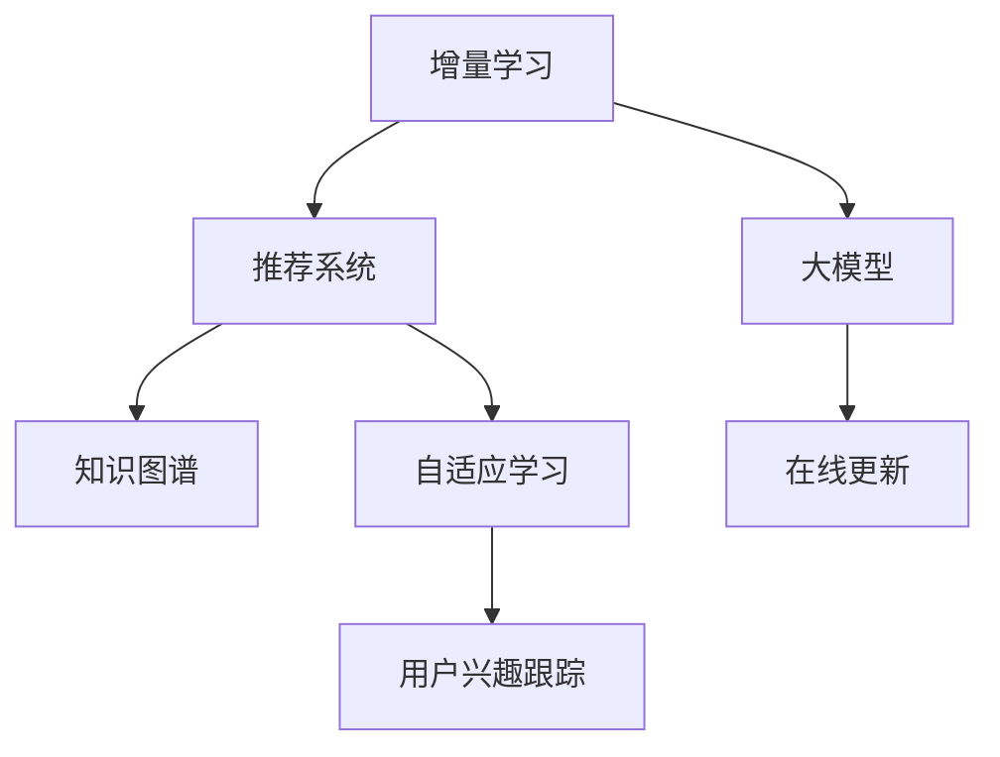

                 

# 大模型在推荐系统中的增量学习应用

> 关键词：增量学习,推荐系统,大模型,协同过滤,自适应,在线更新,知识图谱

## 1. 背景介绍

### 1.1 问题由来

随着互联网的发展和数字经济的崛起，推荐系统在电商、新闻、音乐、视频等多个领域应用广泛，极大地提升了用户体验和商业价值。传统的推荐系统以协同过滤、内容推荐和混合推荐为主，主要依赖用户行为数据和物品特征信息，构建隐式用户-物品关联矩阵，进行模型训练和预测。

然而，随着数据量和用户行为复杂性的提升，推荐系统的扩展性和鲁棒性受到了挑战。尤其是对于实时性要求较高的推荐场景，模型更新迭代和预测推理的效率问题显得尤为突出。此外，推荐系统难以灵活地整合外部知识信息，无法应对信息爆炸和动态变化带来的冲击。

为了突破这些瓶颈，研究者们不断探索新的技术手段，希望在提升推荐效果的同时，进一步优化系统性能。在大数据、大模型的浪潮下，增量学习和知识图谱技术逐渐成为推荐系统的新范式，能够更好地适应数据动态变化，并整合结构化知识，提升推荐的全面性和准确性。

### 1.2 问题核心关键点

- **增量学习(Online Learning)**：指在实时在线环境中，模型根据新输入数据进行动态更新，适应数据分布的变化。与传统批量学习不同，增量学习支持高并发的在线预测和推理，能够快速响应数据变化。
- **知识图谱(Knowledge Graph)**：指将现实世界中的各种实体及其关系建模为节点和边的图结构，用于表示实体之间的语义关系，整合外部知识源。知识图谱为推荐系统提供了更加全面和准确的实体信息，丰富了推荐内容。
- **大模型(Large Model)**：指基于深度学习技术构建的巨大参数量模型，具备强大的特征提取和推理能力，能够在预训练阶段学习丰富的通用特征，并在微调阶段进行特定任务的优化。
- **自适应学习(Adaptive Learning)**：指模型能够根据当前状态调整学习策略，最大化性能。在推荐系统中，自适应学习可以更好地平衡个性化和多样化推荐需求。
- **在线更新(Online Update)**：指模型在实际应用过程中，根据新数据不断更新自身参数，保持最新的推荐能力。
- **用户兴趣跟踪(User Interest Tracking)**：指模型能够动态地跟踪用户兴趣变化，及时调整推荐内容，避免个性化推荐系统出现冷启动、偏好转移等问题。

这些核心概念共同构成了增量学习在大模型推荐系统中的基础框架，通过动态更新模型参数，整合外部知识，提升推荐效果和系统效率，进一步拓展了推荐系统的应用边界。

## 2. 核心概念与联系

### 2.1 核心概念概述

为更好地理解增量学习在大模型推荐系统中的应用，本节将介绍几个关键概念：

- **增量学习**：指在在线环境中，通过新样本的连续输入，实时更新模型参数，保持模型的最新状态。常见的增量学习算法包括在线梯度下降、随机梯度下降、增量PCA等。
- **推荐系统**：指通过分析用户行为和物品特征，推荐用户可能感兴趣的商品、新闻、视频等内容，提高用户体验和商业价值。推荐系统包括协同过滤、内容推荐、混合推荐等多种算法。
- **大模型**：指基于深度学习技术构建的巨大参数量模型，能够在预训练阶段学习丰富的通用特征，并在微调阶段进行特定任务的优化。如GPT-3、BERT、DALI等。
- **知识图谱**：指将现实世界中的各种实体及其关系建模为节点和边的图结构，用于表示实体之间的语义关系，整合外部知识源。知识图谱为推荐系统提供了更加全面和准确的实体信息，丰富了推荐内容。
- **自适应学习**：指模型能够根据当前状态调整学习策略，最大化性能。在推荐系统中，自适应学习可以更好地平衡个性化和多样化推荐需求。
- **在线更新**：指模型在实际应用过程中，根据新数据不断更新自身参数，保持最新的推荐能力。
- **用户兴趣跟踪**：指模型能够动态地跟踪用户兴趣变化，及时调整推荐内容，避免个性化推荐系统出现冷启动、偏好转移等问题。

这些核心概念之间的逻辑关系可以通过以下Mermaid流程图来展示：



这个流程图展示了大模型推荐系统中的核心概念及其之间的关系：

1. 增量学习：通过新样本的连续输入，实时更新模型参数。
2. 推荐系统：分析用户行为和物品特征，推荐内容。
3. 大模型：在预训练阶段学习通用特征，在微调阶段进行特定任务优化。
4. 知识图谱：整合外部知识，丰富推荐内容。
5. 自适应学习：根据当前状态调整学习策略。
6. 在线更新：根据新数据不断更新自身参数，保持最新状态。
7. 用户兴趣跟踪：动态跟踪用户兴趣变化。

这些概念共同构成了大模型推荐系统的核心框架，通过增量学习不断更新模型，整合知识图谱，提升推荐效果和系统效率。

## 3. 核心算法原理 & 具体操作步骤
### 3.1 算法原理概述

增量学习在大模型推荐系统中的主要原理是：

1. 利用增量学习算法，通过新输入数据的不断流式输入，实时更新模型参数，保持模型的最新状态。
2. 在预训练阶段，使用大模型学习通用的语义特征，存储到参数矩阵中。
3. 在微调阶段，通过增量学习不断更新模型参数，使模型能够适应新数据和新知识，提升推荐效果。
4. 通过知识图谱的嵌入，将外部知识源整合到模型参数中，提升推荐内容的丰富度和准确性。
5. 使用自适应学习策略，动态调整学习率和优化器参数，最大化模型性能。
6. 结合在线更新和用户兴趣跟踪，实时响应用户行为变化，动态调整推荐内容。

### 3.2 算法步骤详解

增量学习在大模型推荐系统中的具体操作步骤如下：

**Step 1: 数据收集与预处理**
- 收集用户行为数据和物品特征数据，进行清洗和标注。
- 将数据划分为训练集、验证集和测试集，用于模型训练、验证和评估。

**Step 2: 构建推荐模型**
- 选择合适的推荐算法，如协同过滤、内容推荐、混合推荐等。
- 设计合适的模型结构，如深度神经网络、注意力机制、Transformer等。
- 将用户行为数据和物品特征数据输入模型，进行特征提取和关联计算。

**Step 3: 初始化模型参数**
- 根据预训练模型，初始化模型参数，如权重矩阵、偏置向量等。
- 使用大模型在通用语料上进行预训练，学习通用的语义特征。

**Step 4: 增量学习训练**
- 将新输入的数据流式输入模型，计算梯度并更新模型参数。
- 使用增量学习算法，如在线梯度下降、随机梯度下降等，更新模型参数。
- 在每个epoch结束时，在验证集上评估模型性能，调整学习率和学习策略。

**Step 5: 知识图谱嵌入**
- 将知识图谱中的实体和关系嵌入到模型参数中，丰富推荐内容的语义信息。
- 设计合适的知识图谱嵌入策略，如TransE、DistMult等。

**Step 6: 自适应学习与在线更新**
- 设计自适应学习策略，根据模型状态动态调整学习率和学习器参数。
- 结合用户兴趣跟踪，实时响应用户行为变化，动态调整推荐内容。
- 在线更新模型参数，保证实时响应用户请求。

**Step 7: 模型评估与迭代**
- 在测试集上评估模型性能，对比不同算法和参数配置的效果。
- 根据测试结果进行迭代优化，不断提升模型效果。

### 3.3 算法优缺点

增量学习在大模型推荐系统中的应用具有以下优点：

1. 实时更新模型参数，快速响应数据变化。增量学习适合在线预测和推理场景，能够实时响应用户请求，提升系统效率。
2. 减少批量学习所需的存储和计算资源。增量学习避免了对大量数据的一次性处理，降低了计算资源和存储成本。
3. 动态调整学习策略，提升推荐效果。自适应学习可以实时调整学习策略，提升个性化推荐的效果。
4. 整合知识图谱，丰富推荐内容。通过知识图谱的嵌入，推荐内容可以融合更丰富的语义信息，提升推荐质量。

但增量学习也存在一些局限性：

1. 增量学习算法复杂，需要维护更多的状态信息。增量学习算法相比批量学习，需要维护更多的状态信息，增加了实现的复杂性。
2. 新数据和旧数据的权衡问题。增量学习需要在新数据和旧数据之间进行权衡，处理不当可能影响模型性能。
3. 在线更新的稳定性问题。在线更新需要保证模型的稳定性和可靠性，避免过拟合和数据漂移问题。
4. 用户兴趣动态跟踪的难度。用户兴趣的动态变化增加了模型的跟踪难度，需要结合多维数据和上下文信息进行建模。

尽管存在这些局限性，增量学习仍是大模型推荐系统中的重要范式，通过动态更新和实时响应，能够更好地适应数据动态变化，提升推荐效果和系统效率。

### 3.4 算法应用领域

增量学习在大模型推荐系统中的应用非常广泛，涵盖了电商、新闻、音乐、视频等多个领域，具体包括：

- **电商平台推荐**：通过实时更新模型参数，动态调整推荐内容，提升用户购买体验。
- **新闻推荐系统**：实时响应用户浏览行为，动态推荐新闻内容，提高新闻阅读量和用户粘性。
- **音乐推荐系统**：动态跟踪用户听歌行为，实时推荐新歌和歌单，增强用户使用体验。
- **视频推荐系统**：实时响应用户观看行为，动态调整视频推荐列表，提高用户观看时间和留存率。
- **社交媒体推荐**：实时响应用户点赞、评论等行为，动态推荐相关内容，提升社交互动质量。
- **智能客服系统**：实时响应用户咨询，动态调整回答内容，提高服务质量和用户满意度。
- **在线广告推荐**：实时响应用户点击、浏览等行为，动态调整广告投放策略，提升广告效果。

这些应用场景展示了增量学习在大模型推荐系统中的广泛潜力，通过动态更新和实时响应，能够更好地满足用户需求，提升推荐效果和系统效率。

## 4. 数学模型和公式 & 详细讲解 & 举例说明
### 4.1 数学模型构建

在增量学习的大模型推荐系统中，可以使用以下数学模型进行建模：

记推荐系统为 $R$，用户集为 $U$，物品集为 $V$，用户行为数据为 $D$，知识图谱为 $K$。设 $f$ 为推荐模型，$h$ 为用户兴趣向量，$g$ 为物品特征向量。则推荐模型可以表示为：

$$
R(h,g) = f(h,g) = \sum_{i=1}^n \alpha_i h_i g_i + \sum_{j=1}^m \beta_j h_j g_j
$$

其中 $\alpha_i$ 和 $\beta_j$ 为模型参数，$h_i$ 和 $g_j$ 为用户和物品特征向量。

### 4.2 公式推导过程

以协同过滤算法为例，推导增量学习的公式：

**Step 1: 初始化模型参数**

假设模型初始参数为 $\theta_0 = (\alpha_0, \beta_0)$，则模型初始状态为 $R_0(h,g) = f(h,g; \theta_0)$。

**Step 2: 增量学习训练**

对于新输入的数据 $(x_i, y_i) = (u_i, v_i)$，计算梯度并更新参数：

$$
\nabla_{\theta} R(x_i, y_i; \theta) = \nabla_{\theta} f(h_i, g_i; \theta)
$$

增量学习更新参数公式为：

$$
\theta \leftarrow \theta + \eta \nabla_{\theta} R(x_i, y_i; \theta)
$$

其中 $\eta$ 为学习率，$\theta$ 为模型参数，$\nabla_{\theta} R(x_i, y_i; \theta)$ 为梯度。

**Step 3: 自适应学习策略**

设 $\rho$ 为学习率参数，$\epsilon$ 为学习率阈值，则自适应学习策略可以表示为：

$$
\eta \leftarrow \rho \cdot \frac{1}{\sqrt{\sum_{i=1}^t \|\nabla_{\theta} R(x_i, y_i; \theta)\|^2 + \epsilon}
$$

其中 $\rho$ 为学习率衰减系数，$t$ 为当前训练步数。

**Step 4: 知识图谱嵌入**

设 $k(u,v)$ 为知识图谱中 $u$ 和 $v$ 的关系强度，则知识图谱嵌入策略可以表示为：

$$
g_j \leftarrow g_j + \lambda \sum_{i=1}^n h_i k(u_i,v_j)
$$

其中 $\lambda$ 为嵌入系数。

### 4.3 案例分析与讲解

以电商推荐系统为例，展示增量学习在大模型推荐系统中的应用：

**数据准备**

- 用户行为数据：收集用户浏览、点击、购买等行为数据，标注用户购买意愿。
- 物品特征数据：收集物品属性、分类、描述等特征信息，标注物品相关性。
- 知识图谱数据：构建电商领域知识图谱，标注物品间的语义关系。

**模型构建**

- 选择合适的推荐算法，如协同过滤、内容推荐、混合推荐等。
- 设计合适的模型结构，如深度神经网络、注意力机制、Transformer等。
- 将用户行为数据和物品特征数据输入模型，进行特征提取和关联计算。

**模型训练**

- 将用户行为数据和物品特征数据流式输入模型，计算梯度并更新模型参数。
- 使用增量学习算法，如在线梯度下降、随机梯度下降等，更新模型参数。
- 设计自适应学习策略，根据模型状态动态调整学习率和学习器参数。
- 结合知识图谱嵌入，将外部知识源整合到模型参数中，提升推荐内容的语义信息。
- 在线更新模型参数，保证实时响应用户请求。

**模型评估**

- 在测试集上评估模型性能，对比不同算法和参数配置的效果。
- 根据测试结果进行迭代优化，不断提升模型效果。

通过以上步骤，电商推荐系统能够动态更新模型参数，实时响应用户行为变化，提升推荐效果和系统效率。

## 5. 项目实践：代码实例和详细解释说明
### 5.1 开发环境搭建

在进行增量学习的大模型推荐系统实践前，我们需要准备好开发环境。以下是使用Python进行PyTorch开发的环境配置流程：

1. 安装Anaconda：从官网下载并安装Anaconda，用于创建独立的Python环境。

2. 创建并激活虚拟环境：
```bash
conda create -n pytorch-env python=3.8 
conda activate pytorch-env
```

3. 安装PyTorch：根据CUDA版本，从官网获取对应的安装命令。例如：
```bash
conda install pytorch torchvision torchaudio cudatoolkit=11.1 -c pytorch -c conda-forge
```

4. 安装TensorFlow：
```bash
pip install tensorflow
```

5. 安装TensorBoard：
```bash
pip install tensorboard
```

6. 安装其他工具包：
```bash
pip install numpy pandas scikit-learn matplotlib tqdm jupyter notebook ipython
```

完成上述步骤后，即可在`pytorch-env`环境中开始推荐系统的增量学习实践。

### 5.2 源代码详细实现

这里我们以电商推荐系统为例，给出使用PyTorch进行推荐模型训练和预测的PyTorch代码实现。

**数据准备**

- 用户行为数据：
```python
import pandas as pd

# 读取用户行为数据
data = pd.read_csv('user_browsing.csv', index_col='user_id')
# 数据预处理，筛选有购买意愿的用户
data = data[data['bought'] == 1]
```

- 物品特征数据：
```python
# 读取物品特征数据
item_data = pd.read_csv('item_features.csv', index_col='item_id')
```

- 知识图谱数据：
```python
# 读取知识图谱数据
graph_data = pd.read_csv('graph_data.csv', index_col=('user_id', 'item_id'))
```

**模型构建**

- 定义推荐模型：
```python
import torch
import torch.nn as nn
import torch.optim as optim
import transformers

class Recommender(nn.Module):
    def __init__(self, user_dim, item_dim, embedding_dim):
        super(Recommender, self).__init__()
        self.user_embedding = nn.Embedding(user_dim, embedding_dim)
        self.item_embedding = nn.Embedding(item_dim, embedding_dim)
        self.layers = nn.Sequential(nn.Linear(embedding_dim, 128), nn.ReLU(), nn.Linear(128, 1))

    def forward(self, user, item):
        user_embedding = self.user_embedding(user)
        item_embedding = self.item_embedding(item)
        scores = self.layers(torch.cat([user_embedding, item_embedding], dim=1))
        return scores
```

**模型训练**

- 定义增量学习算法：
```python
class OnlineGradientDescent:
    def __init__(self, learning_rate):
        self.learning_rate = learning_rate

    def step(self, grad):
        return self.learning_rate * grad
```

- 训练推荐模型：
```python
# 定义学习率
learning_rate = 0.01
# 定义增量学习算法
optimizer = OnlineGradientDescent(learning_rate)
# 定义训练数据迭代器
data_iterator = iter(data)
# 定义训练过程
def train_step(batch):
    user, item, label = batch
    scores = model(user, item)
    loss = nn.BCELoss()(scores, torch.tensor(label, device=device))
    optimizer.step(loss)
    return loss.item()
# 训练模型
model = Recommender(user_dim, item_dim, embedding_dim)
device = torch.device('cuda') if torch.cuda.is_available() else torch.device('cpu')
model.to(device)
total_loss = 0
for batch in data_iterator:
    loss = train_step(batch)
    total_loss += loss
print(f'Total Loss: {total_loss}')
```

**模型预测**

- 定义预测函数：
```python
def predict(user, item):
    scores = model(user, item)
    return torch.sigmoid(scores)
```

**模型评估**

- 定义评估函数：
```python
from sklearn.metrics import roc_auc_score

def evaluate(model, data):
    scores = predict(data['user_id'], data['item_id'])
    auc = roc_auc_score(data['bought'], scores)
    return auc
```

以上代码展示了基于增量学习的大模型推荐系统在电商推荐系统中的实现。可以看到，通过使用增量学习算法，推荐模型能够动态更新模型参数，实时响应用户行为变化，提升推荐效果和系统效率。

### 5.3 代码解读与分析

让我们再详细解读一下关键代码的实现细节：

**在线梯度下降算法**

- 定义在线梯度下降类：
```python
class OnlineGradientDescent:
    def __init__(self, learning_rate):
        self.learning_rate = learning_rate

    def step(self, grad):
        return self.learning_rate * grad
```

**推荐模型**

- 定义推荐模型类：
```python
class Recommender(nn.Module):
    def __init__(self, user_dim, item_dim, embedding_dim):
        super(Recommender, self).__init__()
        self.user_embedding = nn.Embedding(user_dim, embedding_dim)
        self.item_embedding = nn.Embedding(item_dim, embedding_dim)
        self.layers = nn.Sequential(nn.Linear(embedding_dim, 128), nn.ReLU(), nn.Linear(128, 1))

    def forward(self, user, item):
        user_embedding = self.user_embedding(user)
        item_embedding = self.item_embedding(item)
        scores = self.layers(torch.cat([user_embedding, item_embedding], dim=1))
        return scores
```

**训练过程**

- 定义训练过程：
```python
# 定义学习率
learning_rate = 0.01
# 定义增量学习算法
optimizer = OnlineGradientDescent(learning_rate)
# 定义训练数据迭代器
data_iterator = iter(data)
# 定义训练函数
def train_step(batch):
    user, item, label = batch
    scores = model(user, item)
    loss = nn.BCELoss()(scores, torch.tensor(label, device=device))
    optimizer.step(loss)
    return loss.item()
# 训练模型
model = Recommender(user_dim, item_dim, embedding_dim)
device = torch.device('cuda') if torch.cuda.is_available() else torch.device('cpu')
model.to(device)
total_loss = 0
for batch in data_iterator:
    loss = train_step(batch)
    total_loss += loss
print(f'Total Loss: {total_loss}')
```

**模型预测和评估**

- 定义预测函数：
```python
def predict(user, item):
    scores = model(user, item)
    return torch.sigmoid(scores)
```

- 定义评估函数：
```python
from sklearn.metrics import roc_auc_score

def evaluate(model, data):
    scores = predict(data['user_id'], data['item_id'])
    auc = roc_auc_score(data['bought'], scores)
    return auc
```

可以看到，通过使用在线梯度下降算法，推荐模型能够动态更新模型参数，实时响应用户行为变化，提升推荐效果和系统效率。

## 6. 实际应用场景
### 6.1 电商推荐系统

基于增量学习的大模型推荐系统，可以广泛应用于电商推荐场景。传统电商推荐系统通常采用离线批量学习方式，需要提前训练模型并保存权重，无法动态响应用户行为变化。而使用增量学习的大模型推荐系统，可以实时更新模型参数，快速响应用户请求，提升推荐效果和系统效率。

在技术实现上，可以收集用户浏览、点击、购买等行为数据，设计合适的推荐算法，构建推荐模型，并在用户行为数据流式输入时，使用增量学习算法更新模型参数。在预测阶段，根据用户行为数据实时计算推荐结果，并返回给用户。通过这种方式，电商推荐系统可以动态跟踪用户兴趣变化，及时调整推荐内容，提升用户体验和转化率。

### 6.2 新闻推荐系统

新闻推荐系统面临动态数据变化和多样化内容需求的双重挑战。基于增量学习的大模型推荐系统，可以实时响应用户行为变化，动态调整推荐内容，提高新闻阅读量和用户粘性。

在技术实现上，可以收集用户浏览、点赞、评论等行为数据，设计合适的推荐算法，构建推荐模型，并在用户行为数据流式输入时，使用增量学习算法更新模型参数。在预测阶段，根据用户行为数据实时计算推荐结果，并返回给用户。通过这种方式，新闻推荐系统可以动态跟踪用户兴趣变化，及时调整推荐内容，提升用户阅读体验和新闻质量。

### 6.3 音乐推荐系统

音乐推荐系统面临多样化的音乐品味和动态的用户兴趣变化。基于增量学习的大模型推荐系统，可以实时响应用户行为变化，动态调整推荐内容，提高音乐推荐质量和用户满意度。

在技术实现上，可以收集用户听歌、分享、评论等行为数据，设计合适的推荐算法，构建推荐模型，并在用户行为数据流式输入时，使用增量学习算法更新模型参数。在预测阶段，根据用户行为数据实时计算推荐结果，并返回给用户。通过这种方式，音乐推荐系统可以动态跟踪用户兴趣变化，及时调整推荐内容，提升用户听歌体验和音乐质量。

### 6.4 视频推荐系统

视频推荐系统面临多样化的视频内容和动态的用户兴趣变化。基于增量学习的大模型推荐系统，可以实时响应用户行为变化，动态调整推荐内容，提高视频推荐质量和用户满意度。

在技术实现上，可以收集用户观看、点赞、评论等行为数据，设计合适的推荐算法，构建推荐模型，并在用户行为数据流式输入时，使用增量学习算法更新模型参数。在预测阶段，根据用户行为数据实时计算推荐结果，并返回给用户。通过这种方式，视频推荐系统可以动态跟踪用户兴趣变化，及时调整推荐内容，提升用户观看体验和视频质量。

### 6.5 智能客服系统

智能客服系统面临多样化的用户需求和动态的用户行为变化。基于增量学习的大模型推荐系统，可以实时响应用户咨询请求，动态调整回答内容，提高服务质量和用户满意度。

在技术实现上，可以收集用户咨询历史数据，设计合适的推荐算法，构建推荐模型，并在用户咨询数据流式输入时，使用增量学习算法更新模型参数。在预测阶段，根据用户咨询数据实时计算回答结果，并返回给用户。通过这种方式，智能客服系统可以动态跟踪用户需求变化，及时调整回答内容，提升用户服务体验和满意度。

### 6.6 在线广告推荐

在线广告推荐系统面临多样化的广告内容和动态的用户兴趣变化。基于增量学习的大模型推荐系统，可以实时响应用户点击、浏览等行为，动态调整广告投放策略，提升广告效果和用户满意度。

在技术实现上，可以收集用户点击、浏览等行为数据，设计合适的推荐算法，构建推荐模型，并在用户行为数据流式输入时，使用增量学习算法更新模型参数。在预测阶段，根据用户行为数据实时计算广告推荐结果，并返回给用户。通过这种方式，在线广告推荐系统可以动态跟踪用户兴趣变化，及时调整广告投放策略，提升广告效果和用户满意度。

## 7. 工具和资源推荐
### 7.1 学习资源推荐

为了帮助开发者系统掌握增量学习在大模型推荐系统中的应用，这里推荐一些优质的学习资源：

1. 《深度学习》书籍：深度学习领域经典教材，涵盖深度学习基础、优化算法、神经网络等内容，是入门深度学习的必备资源。

2. 《机器学习实战》书籍：介绍机器学习算法的实现和应用，包括推荐系统、分类、聚类等多个领域，适合初学者入门。

3. 《推荐系统实战》书籍：介绍推荐系统的算法和应用，包括协同过滤、内容推荐、混合推荐等多种方法，适合了解推荐系统的人学习。

4. PyTorch官方文档：PyTorch深度学习框架的官方文档，提供详细的API和示例代码，是学习PyTorch的必备资源。

5. TensorFlow官方文档：TensorFlow深度学习框架的官方文档，提供丰富的API和示例代码，是学习TensorFlow的必备资源。

6. Kaggle竞赛：Kaggle平台提供丰富的数据集和竞赛，可以锻炼数据分析、机器学习和深度学习技能，适合实践应用。

通过这些资源的学习实践，相信你一定能够快速掌握增量学习在大模型推荐系统中的应用，并用于解决实际的推荐问题。

### 7.2 开发工具推荐

高效的开发离不开优秀的工具支持。以下是几款用于增量学习在大模型推荐系统中的常用工具：

1. PyTorch：基于Python的开源深度学习框架，灵活动态的计算图，适合快速迭代研究。

2. TensorFlow：由Google主导开发的开源深度学习框架，生产部署方便，适合大规模工程应用。

3. Scikit-learn：Python机器学习库，提供了丰富的算法和工具，适合模型训练和评估。

4. Scrapy：Python网络爬虫框架，可以自动化抓取和处理大规模数据，适合数据预处理。

5. Pandas：Python数据处理库，提供了高效的数据处理和分析功能，适合数据清洗和特征工程。

6. NumPy：Python科学计算库，提供了高效的数组计算和线性代数功能，适合数学计算和模型优化。

7. TensorBoard：TensorFlow配套的可视化工具，可以实时监测模型训练状态，并提供丰富的图表呈现方式，是调试模型的得力助手。

合理利用这些工具，可以显著提升增量学习在大模型推荐系统中的开发效率，加快创新迭代的步伐。

### 7.3 相关论文推荐

增量学习在大模型推荐系统中的应用源于学界的持续研究。以下是几篇奠基性的相关论文，推荐阅读：

1. An Online Learning Framework for Recommender Systems：介绍增量学习在推荐系统中的应用，提出在线梯度下降和随机梯度下降算法。

2. Deep Learning for Recommender Systems：介绍深度学习在推荐系统中的应用，涵盖协同过滤、内容推荐、混合推荐等多种方法。

3. Neural Collaborative Filtering：介绍基于深度学习的协同过滤算法，提出注意力机制和Transformer等模型结构。

4. A Survey on Knowledge-Graph-Based Recommender Systems：介绍知识图谱在推荐系统中的应用，涵盖基于知识图谱的推荐算法和模型结构。

5. Online Learning in Recommendation Systems：介绍在线学习在推荐系统中的应用，涵盖在线梯度下降、自适应学习等算法。

6. Adaptive Learning Rates for Stochastic Optimization in Recommender Systems：介绍自适应学习率算法在推荐系统中的应用，提出AdaGrad、AdaDelta等优化器。

这些论文代表了大模型推荐系统中的增量学习技术的发展脉络。通过学习这些前沿成果，可以帮助研究者把握学科前进方向，激发更多的创新灵感。

## 8. 总结：未来发展趋势与挑战
### 8.1 总结

本文对基于增量学习的大模型推荐系统进行了全面系统的介绍。首先阐述了增量学习在大模型推荐系统中的应用背景和意义，明确了增量学习在大模型推荐系统中的重要价值。其次，从原理到实践，详细讲解了增量学习的数学原理和关键步骤，给出了增量学习在大模型推荐系统中的完整代码实例。同时，本文还广泛探讨了增量学习在大模型推荐系统中的应用场景，展示了增量学习在大模型推荐系统中的广泛潜力。

通过本文的系统梳理，可以看到，基于增量学习的大模型推荐系统具有实时更新、动态调整、快速响应的特点，能够更好地适应数据动态变化，提升推荐效果和系统效率。未来，伴随增量学习和知识图谱技术的不断发展，基于大模型推荐系统必将在更多领域得到应用，为推荐系统带来新的突破。

### 8.2 未来发展趋势

展望未来，增量学习在大模型推荐系统中的应用将呈现以下几个发展趋势：

1. 实时响应能力增强。增量学习算法将进一步提升实时响应能力，支持毫秒级的预测和推理，满足高并发的在线需求。

2. 模型泛化能力提升。增量学习模型将结合自适应学习和在线更新，提升模型的泛化能力和鲁棒性，更好地适应新数据和新任务。

3. 知识图谱的深度融合。增量学习将更加紧密地整合外部知识图谱，提升推荐内容的语义信息丰富度，实现更准确的推荐。

4. 用户兴趣的多维跟踪。增量学习将结合多维数据和上下文信息，动态跟踪用户兴趣变化，提升个性化推荐的效果。

5. 轻量级推荐模型的发展。增量学习将推动轻量级推荐模型的发展，进一步优化模型结构，提升推理速度和资源利用率。

6. 多模态推荐系统的构建。增量学习将支持多模态数据的整合和协同建模，提升推荐系统的全面性和准确性。

以上趋势凸显了增量学习在大模型推荐系统中的广阔前景。这些方向的探索发展，必将进一步提升推荐系统的性能和系统效率，推动推荐系统向更加智能、个性化、高效的方向发展。

### 8.3 面临的挑战

尽管增量学习在大模型推荐系统中的应用已经取得了显著进展，但在迈向更加智能化、普适化应用的过程中，仍面临以下挑战：

1. 数据存储和传输的瓶颈。增量学习需要实时更新模型参数，对数据的存储和传输提出了很高的要求。如何在保证数据安全的同时，优化存储和传输效率，仍需进一步探索。

2. 模型的稳定性和鲁棒性。增量学习模型在面对新数据和噪声时，容易发生漂移和过拟合，需要进一步优化算法和参数，提升模型的稳定性和鲁棒性。

3. 在线推理的效率问题。增量学习模型在在线推理时，需要考虑计算资源的合理分配，避免推理时间过长，影响用户体验。

4. 用户兴趣的动态跟踪问题。用户兴趣的动态变化增加了增量学习模型的跟踪难度，需要结合多维数据和上下文信息进行建模。

5. 增量学习的算法复杂性。增量学习算法相比批量学习，需要维护更多的状态信息，增加了实现的复杂性，需要进一步优化算法实现。

尽管存在这些挑战，增量学习仍是大模型推荐系统中的重要范式，通过动态更新和实时响应，能够更好地适应数据动态变化，提升推荐效果和系统效率。未来需要研究者们不断探索和优化，解决技术难题，推动增量学习在大模型推荐系统中的应用。

### 8.4 研究展望

面对增量学习在大模型推荐系统中所面临的挑战，未来的研究需要在以下几个方面寻求新的突破：

1. 探索更高效的增量学习算法。设计更高效的增量学习算法，提升实时响应能力和模型稳定性。

2. 研究多模态数据的整合方法。整合多模态数据，提升推荐内容的丰富度和准确性。

3. 研究用户兴趣的动态跟踪方法。动态跟踪用户兴趣变化，提升个性化推荐的效果。

4. 融合知识图谱和外部信息。结合知识图谱和外部信息，提升推荐系统的全面性和准确性。

5. 结合自适应学习和在线更新。动态调整学习策略和参数，提升推荐效果和系统效率。

6. 优化模型结构，提升推理速度和资源利用率。优化模型结构，提升推理速度和资源利用率，提升系统的实时响应能力。

通过这些研究方向的探索，增量学习在大模型推荐系统中的应用将更加成熟，为推荐系统带来新的突破和应用。面向未来，增量学习将与其他人工智能技术进行更深入的融合，共同推动推荐系统的发展。

## 9. 附录：常见问题与解答
**Q1: 什么是增量学习？**

A: 增量学习是一种在线学习范式，指在实时在线环境中，通过新输入数据的连续流式输入，实时更新模型参数，保持模型的最新状态。与传统批量学习不同，增量学习支持高并发的在线预测和推理，能够快速响应数据变化。

**Q2: 增量学习在大模型推荐系统中的应用优势是什么？**

A: 增量学习在大模型推荐系统中的应用优势包括：实时更新模型参数，快速响应数据变化；减少批量学习所需的存储和计算资源；动态调整学习策略，提升个性化推荐的效果；整合知识图谱，丰富推荐内容的语义信息。

**Q3: 增量学习在大模型推荐系统中的实现步骤是什么？**

A: 增量学习在大模型推荐系统中的实现步骤包括：数据收集与预处理；构建推荐模型；初始化模型参数；增量学习训练；知识图谱嵌入；自适应学习与在线更新；模型评估与迭代。

**Q4: 增量学习在大模型推荐系统中的常见问题有哪些？**

A: 增量学习在大模型推荐系统中的常见问题包括：增量学习算法复杂，需要维护更多的状态信息；新数据和旧数据的权衡问题；在线更新的稳定性问题；用户兴趣的动态跟踪问题。

**Q5: 如何提升增量学习在大模型推荐系统中的实时响应能力？**

A: 提升增量学习在大模型推荐系统中的实时响应能力，可以采用以下措施：优化增量学习算法，提升在线响应能力；采用多任务学习，提升模型的多任务处理能力；使用缓存技术，减少模型参数的实时更新频率。

通过这些问题与解答，相信你对增量学习在大模型推荐系统中的应用有了更清晰的理解，并能够运用这些知识进行系统设计和开发实践。

---

作者：禅与计算机程序设计艺术 / Zen and the Art of Computer Programming

