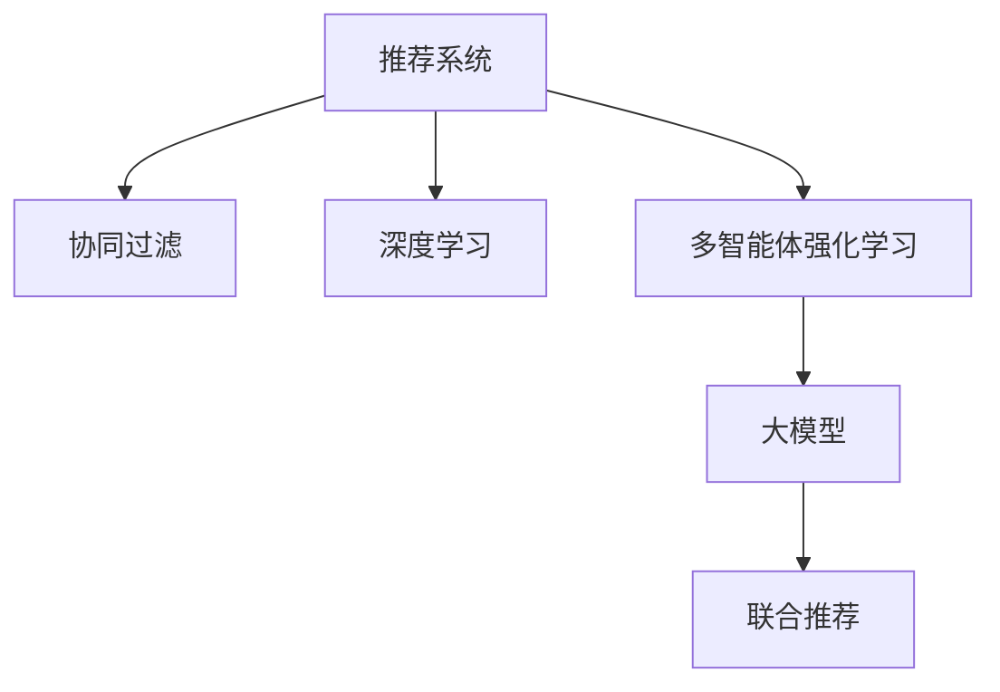

                 

# 大模型在推荐系统中的多智能体强化学习

> 关键词：推荐系统, 强化学习, 多智能体系统, 大模型, 协同过滤, 深度学习, 协同增强学习, 联合推荐

## 1. 背景介绍

推荐系统是互联网时代最重要的技术之一，其目标是帮助用户发现未知且有用的信息。传统推荐系统依赖于用户行为数据，通过协同过滤、基于内容的推荐等技术，为用户推荐个性化的产品或内容。然而，用户行为数据往往不足以满足个性化推荐需求，特别是在新用户或冷启动场景下。

近年来，深度学习技术在推荐系统中的应用越来越广泛。基于大模型的推荐系统，通过预训练语言模型对用户行为数据进行建模，同时对用户历史行为和物品特征进行联合学习，显著提升了推荐性能。然而，现有的基于深度学习的推荐系统仍存在冷启动问题，无法利用用户历史行为进行有效推荐。

多智能体强化学习（Multi-Agent Reinforcement Learning, MARL）是一种模拟多智能体协同决策的机制，其目标是构建一个动态交互的系统，通过多智能体之间的协同互动，共同实现全局最优目标。将多智能体强化学习引入推荐系统，有助于缓解冷启动问题，提升推荐系统的鲁棒性和泛化能力。

## 2. 核心概念与联系

### 2.1 核心概念概述

为更好地理解基于多智能体强化学习的推荐系统，本节将介绍几个密切相关的核心概念：

- 推荐系统(Recommender System)：旨在为用户提供个性化信息推荐的技术系统，通过分析用户行为和物品属性，生成个性化推荐列表。
- 协同过滤(Collaborative Filtering)：一种常见的推荐算法，利用用户和物品的相似度，推测用户对未交互物品的评分，进行推荐。
- 深度学习(Deep Learning)：一种基于多层神经网络进行数据建模和预测的深度学习技术，其强大的表达能力和泛化能力使其在推荐系统领域得到了广泛应用。
- 多智能体强化学习(Multi-Agent Reinforcement Learning)：一种模拟多智能体协同决策的机制，通过智能体之间的互动协作，实现全局最优。
- 大模型(Large Model)：指基于大规模预训练语言模型的深度学习模型，如BERT、GPT等，通过预训练和微调，可以抽取丰富的语言表示，适用于各种推荐任务。

这些核心概念之间的逻辑关系可以通过以下Mermaid流程图来展示：



这个流程图展示了大模型在推荐系统中的核心概念及其之间的关系：

1. 推荐系统通过协同过滤、深度学习、多智能体强化学习等技术，提升推荐性能。
2. 协同过滤算法通过用户行为数据进行个性化推荐。
3. 深度学习通过预训练语言模型进行用户行为建模，提升推荐效果。
4. 多智能体强化学习引入智能体之间的互动协作，进一步提升推荐质量。
5. 大模型通过预训练和微调，抽取丰富的语言表示，适用于联合推荐。

这些概念共同构成了推荐系统的技术和应用框架，使得推荐系统能够更好地满足用户个性化需求。通过理解这些核心概念，我们可以更好地把握推荐系统的工作原理和优化方向。

## 3. 核心算法原理 & 具体操作步骤
### 3.1 算法原理概述

基于多智能体强化学习的推荐系统，本质上是一个多智能体协同决策系统。其核心思想是：将推荐系统中的用户、物品、内容等视为多个智能体，通过多智能体之间的协同互动，共同优化推荐策略，提升全局最优目标。

形式化地，设推荐系统中的用户集合为 $U$，物品集合为 $I$，内容集合为 $C$。推荐目标为最大化用户满意度和物品展示效果。

假设 $U$ 中有 $N$ 个用户，每个用户有 $n$ 个物品浏览记录 $(x_{ij})_{i=1}^n$，物品 $i$ 的属性特征为 $v_i$，内容 $c$ 的属性特征为 $u_c$。

定义用户 $u_i$ 对物品 $i$ 的评分函数为 $R_{ui}$，物品 $i$ 的展示效果为 $G_i$，内容 $c$ 的吸引力为 $A_c$。

设智能体 $A_i$ 表示用户 $u_i$，智能体 $A_i$ 的策略为 $\pi_i(a_i|s_i)$，其中 $a_i$ 表示智能体 $A_i$ 的行动（如选择物品 $i$），$s_i$ 表示智能体 $A_i$ 的当前状态（如浏览历史、兴趣偏好）。

智能体 $A_i$ 的奖励函数为 $r_{ui} = R_{ui} + \lambda G_i + \alpha A_c$，其中 $\lambda$ 和 $\alpha$ 为调节因子，控制展示效果和内容吸引力在评分中的权重。

智能体 $A_i$ 的目标为最大化其长期累积奖励 $Q^{\pi}_i$，即：

$$
Q^{\pi}_i = \mathbb{E}_{s_i,a_i}\left[\sum_{t=0}^{\infty} \gamma^t r_{ui} \right]
$$

其中 $\gamma$ 为折扣因子。

多智能体系统的目标为最大化全局累积奖励，即：

$$
Q^{\pi} = \mathbb{E}_{s_i,a_i}\left[\sum_{t=0}^{\infty} \gamma^t Q^{\pi}_i \right]
$$

多智能体强化学习的关键是设计合适的智能体策略和奖励函数，以促进智能体之间的协作，最大化全局目标。

### 3.2 算法步骤详解

基于多智能体强化学习的推荐系统一般包括以下几个关键步骤：

**Step 1: 准备预训练模型和数据集**
- 选择合适的预训练语言模型 $M_{\theta}$ 作为初始化参数，如 BERT、GPT等。
- 准备推荐系统所需的数据集，包括用户行为数据、物品属性数据和内容数据。

**Step 2: 设计智能体策略**
- 设计用户智能体策略 $\pi_u(a_u|s_u)$，物品智能体策略 $\pi_i(a_i|s_i)$，内容智能体策略 $\pi_c(a_c|s_c)$。
- 可以通过神经网络、深度强化学习等技术设计智能体策略。

**Step 3: 设置奖励函数**
- 设计智能体之间的奖励函数 $r_{ui}$，控制展示效果和内容吸引力对用户评分的影响。
- 使用人工干预、机器学习等技术设计奖励函数。

**Step 4: 模拟智能体交互**
- 在预训练语言模型的基础上，模拟智能体之间的交互过程。
- 通过强化学习算法训练智能体策略，最大化全局累积奖励。

**Step 5: 融合推荐结果**
- 将智能体之间的协同决策结果进行融合，生成推荐列表。
- 可以使用加权平均、协同过滤等技术对推荐结果进行集成。

### 3.3 算法优缺点

基于多智能体强化学习的推荐系统具有以下优点：
1. 缓解冷启动问题。通过智能体之间的互动协作，利用用户历史行为和物品属性，缓解新用户和老用户的推荐差距。
2. 提升推荐效果。智能体之间的协同互动，可以更好地利用用户行为数据，提升推荐系统的泛化能力和鲁棒性。
3. 减少数据需求。智能体之间的互动协作，可以在较少的标注数据情况下，提升推荐系统的性能。
4. 灵活性好。智能体策略设计灵活，可以根据不同场景和数据特点进行优化设计。

同时，该方法也存在一定的局限性：
1. 智能体策略设计复杂。设计合适的智能体策略和奖励函数，需要丰富的领域知识和经验。
2. 计算复杂度高。智能体之间的交互复杂，需要高效的计算框架和优化算法。
3. 收敛性问题。在复杂多智能体系统中，智能体之间的协作可能会收敛到次优解。
4. 可解释性差。智能体之间的协同决策过程复杂，难以解释推荐结果的生成机制。

尽管存在这些局限性，但就目前而言，基于多智能体强化学习的推荐方法仍是大规模推荐系统的有效范式。未来相关研究的重点在于如何进一步降低智能体策略设计的复杂性，提高推荐系统的计算效率，同时兼顾可解释性和鲁棒性等因素。

### 3.4 算法应用领域

基于多智能体强化学习的推荐系统，在电商、视频、音乐等多个领域得到了广泛的应用。以下是几个典型的应用场景：

- 电商推荐：通过智能体之间的协同互动，为用户推荐个性化商品。在用户浏览历史和购物行为的基础上，智能体之间共同优化展示效果和商品吸引力，提升推荐质量。
- 视频推荐：通过智能体之间的互动协作，为用户推荐个性化视频内容。在用户观看历史和评分数据的基础上，智能体之间共同优化内容吸引力和展示效果，提升推荐效果。
- 音乐推荐：通过智能体之间的互动协作，为用户推荐个性化音乐内容。在用户听歌历史和评分数据的基础上，智能体之间共同优化音乐吸引力，提升推荐质量。

除了上述这些经典场景外，多智能体强化学习推荐方法也在更多领域得到应用，如新闻推荐、游戏推荐等，为推荐系统的智能化发展提供了新的思路。

## 4. 数学模型和公式 & 详细讲解  
### 4.1 数学模型构建

本节将使用数学语言对基于多智能体强化学习的推荐系统进行更加严格的刻画。

设推荐系统中的用户集合为 $U$，物品集合为 $I$，内容集合为 $C$。推荐目标为最大化用户满意度和物品展示效果。

定义用户 $u_i$ 对物品 $i$ 的评分函数为 $R_{ui}$，物品 $i$ 的展示效果为 $G_i$，内容 $c$ 的属性特征为 $u_c$。

设智能体 $A_i$ 表示用户 $u_i$，智能体 $A_i$ 的策略为 $\pi_i(a_i|s_i)$，其中 $a_i$ 表示智能体 $A_i$ 的行动（如选择物品 $i$），$s_i$ 表示智能体 $A_i$ 的当前状态（如浏览历史、兴趣偏好）。

智能体 $A_i$ 的奖励函数为 $r_{ui} = R_{ui} + \lambda G_i + \alpha A_c$，其中 $\lambda$ 和 $\alpha$ 为调节因子，控制展示效果和内容吸引力在评分中的权重。

智能体 $A_i$ 的目标为最大化其长期累积奖励 $Q^{\pi}_i$，即：

$$
Q^{\pi}_i = \mathbb{E}_{s_i,a_i}\left[\sum_{t=0}^{\infty} \gamma^t r_{ui} \right]
$$

其中 $\gamma$ 为折扣因子。

多智能体系统的目标为最大化全局累积奖励，即：

$$
Q^{\pi} = \mathbb{E}_{s_i,a_i}\left[\sum_{t=0}^{\infty} \gamma^t Q^{\pi}_i \right]
$$

在实际应用中，可以使用深度学习模型进行智能体策略的优化设计。常见的模型包括深度确定性策略梯度(Deep Deterministic Policy Gradient, DDPG)、深度演员-评论家(Deep Actor-Critic, DQN)、深度确定性策略梯度增强(Deep Deterministic Policy Gradient-Enhanced, DPPO)等。这些模型可以有效地模拟智能体之间的互动协作，提升推荐系统的性能。

### 4.2 公式推导过程

以下我们以深度确定性策略梯度(DDPG)算法为例，推导其数学模型和训练过程。

设智能体 $A_i$ 的策略参数为 $\theta_i$，智能体之间的互动为 $S_t$，智能体 $A_i$ 的行动为 $A_t$，智能体之间的奖励为 $R_t$，智能体 $A_i$ 的长期累积奖励为 $Q^{\pi}_i$，全局累积奖励为 $Q^{\pi}$。

DDPG算法通过如下公式更新智能体策略和奖励函数：

$$
\theta_i = \theta_i - \eta \nabla_{\theta_i} \mathbb{E}_{s_i,a_i}\left[\sum_{t=0}^{\infty} \gamma^t r_{ui} \right]
$$

其中 $\eta$ 为学习率，$\nabla_{\theta_i}$ 为智能体策略的梯度。

在实际应用中，DDPG算法通过强化学习算法（如PPO）优化智能体策略，通过神经网络模型设计奖励函数。训练过程通过如下公式进行：

$$
Q^{\pi} = \mathbb{E}_{s_i,a_i}\left[\sum_{t=0}^{\infty} \gamma^t r_{ui} \right]
$$

在得到全局累积奖励后，即可通过DDPG算法更新智能体策略和奖励函数，最大化全局累积奖励。

### 4.3 案例分析与讲解

这里我们以电商平台为例，说明基于多智能体强化学习的推荐系统是如何设计和训练的。

设电商平台中的用户集合为 $U$，物品集合为 $I$，内容集合为 $C$。推荐目标为最大化用户满意度和物品展示效果。

定义用户 $u_i$ 对物品 $i$ 的评分函数为 $R_{ui}$，物品 $i$ 的展示效果为 $G_i$，内容 $c$ 的属性特征为 $u_c$。

设智能体 $A_i$ 表示用户 $u_i$，智能体 $A_i$ 的策略为 $\pi_i(a_i|s_i)$，其中 $a_i$ 表示智能体 $A_i$ 的行动（如选择物品 $i$），$s_i$ 表示智能体 $A_i$ 的当前状态（如浏览历史、兴趣偏好）。

智能体 $A_i$ 的奖励函数为 $r_{ui} = R_{ui} + \lambda G_i + \alpha A_c$，其中 $\lambda$ 和 $\alpha$ 为调节因子，控制展示效果和内容吸引力在评分中的权重。

智能体 $A_i$ 的目标为最大化其长期累积奖励 $Q^{\pi}_i$，即：

$$
Q^{\pi}_i = \mathbb{E}_{s_i,a_i}\left[\sum_{t=0}^{\infty} \gamma^t r_{ui} \right]
$$

其中 $\gamma$ 为折扣因子。

多智能体系统的目标为最大化全局累积奖励，即：

$$
Q^{\pi} = \mathbb{E}_{s_i,a_i}\left[\sum_{t=0}^{\infty} \gamma^t Q^{\pi}_i \right]
$$

在实际应用中，可以使用深度学习模型进行智能体策略的优化设计。常见的模型包括深度确定性策略梯度(Deep Deterministic Policy Gradient, DDPG)、深度演员-评论家(Deep Actor-Critic, DQN)、深度确定性策略梯度增强(Deep Deterministic Policy Gradient-Enhanced, DPPO)等。这些模型可以有效地模拟智能体之间的互动协作，提升推荐系统的性能。

在电商平台中，智能体之间的互动可以通过如下方式实现：
1. 用户智能体 $A_u$ 根据浏览历史和兴趣偏好，选择展示的物品。
2. 物品智能体 $A_i$ 根据展示效果和内容吸引力，选择展示的物品。
3. 内容智能体 $A_c$ 根据用户兴趣偏好，推荐相关内容。

在训练过程中，智能体之间的奖励函数可以通过如下方式设计：
1. 用户智能体 $A_u$ 的奖励函数为 $r_{ui} = R_{ui} + \lambda G_i + \alpha A_c$。
2. 物品智能体 $A_i$ 的奖励函数为 $r_{ui} = R_{ui} + \lambda G_i + \alpha A_c$。
3. 内容智能体 $A_c$ 的奖励函数为 $r_{ui} = R_{ui} + \lambda G_i + \alpha A_c$。

通过DDPG算法更新智能体策略和奖励函数，最大化全局累积奖励，即可得到基于多智能体强化学习的推荐系统。

## 5. 项目实践：代码实例和详细解释说明
### 5.1 开发环境搭建

在进行多智能体强化学习推荐系统的开发时，需要准备以下开发环境：

1. 安装Python：下载并安装最新版本的Python，推荐使用Anaconda进行环境管理。
2. 安装TensorFlow：使用pip安装最新版本的TensorFlow，支持深度学习模型的训练和推理。
3. 安装OpenAI Gym：使用pip安装OpenAI Gym，支持多智能体强化学习的实验环境。
4. 安装PyTorch：使用pip安装最新版本的PyTorch，支持深度学习模型的构建和优化。
5. 安装Jupyter Notebook：下载并安装Jupyter Notebook，用于编写和运行Python代码。

完成上述步骤后，即可在Python环境中进行多智能体强化学习推荐系统的开发。

### 5.2 源代码详细实现

这里以一个简单的电商平台推荐系统为例，说明如何使用PyTorch实现基于多智能体强化学习的推荐系统。

首先，定义智能体策略和奖励函数：

```python
import torch
import torch.nn as nn
import torch.optim as optim

class Actor(nn.Module):
    def __init__(self, input_dim, output_dim):
        super(Actor, self).__init__()
        self.fc1 = nn.Linear(input_dim, 64)
        self.fc2 = nn.Linear(64, output_dim)
        self.sigmoid = nn.Sigmoid()

    def forward(self, x):
        x = self.fc1(x)
        x = self.fc2(x)
        return self.sigmoid(x)

class Critic(nn.Module):
    def __init__(self, input_dim):
        super(Critic, self).__init__()
        self.fc1 = nn.Linear(input_dim, 64)
        self.fc2 = nn.Linear(64, 1)

    def forward(self, x):
        x = self.fc1(x)
        x = self.fc2(x)
        return x

class Reward(nn.Module):
    def __init__(self, input_dim):
        super(Reward, self).__init__()
        self.fc1 = nn.Linear(input_dim, 64)
        self.fc2 = nn.Linear(64, 1)

    def forward(self, x):
        x = self.fc1(x)
        x = self.fc2(x)
        return x

def ddpog(env, reward, actor, critic, num_episodes, discount_factor=0.9, epsilon=0.1):
    # 初始化学习率
    learning_rate = 1e-4

    # 初始化策略和奖励函数的参数
    actor_optimizer = optim.Adam(actor.parameters(), lr=learning_rate)
    critic_optimizer = optim.Adam(critic.parameters(), lr=learning_rate)
    reward_optimizer = optim.Adam(reward.parameters(), lr=learning_rate)

    # 训练多智能体系统
    for episode in range(num_episodes):
        state = env.reset()
        done = False
        episode_reward = 0.0

        while not done:
            action, _ = actor(state)
            next_state, reward, done, _ = env.step(action)
            episode_reward += reward

            # 计算状态值和奖励值
            state_value = critic(state)
            target = reward + discount_factor * state_value

            # 更新状态值
            critic_optimizer.zero_grad()
            critic_loss = criterion(state_value, target)
            critic_loss.backward()
            critic_optimizer.step()

            # 更新策略
            actor_optimizer.zero_grad()
            actor_loss = -torch.mean(torch.log(reward) * action)
            actor_loss.backward()
            actor_optimizer.step()

            # 更新奖励函数
            reward_optimizer.zero_grad()
            reward_loss = -torch.mean(torch.log(reward) * reward)
            reward_loss.backward()
            reward_optimizer.step()

            state = next_state

        print("Episode {}: Reward = {}".format(episode + 1, episode_reward))
```

在上述代码中，我们定义了智能体的策略函数（Actor）、值函数（Critic）和奖励函数（Reward），以及基于DDPG算法的多智能体系统训练函数。训练函数通过优化智能体策略和奖励函数，最大化全局累积奖励。

### 5.3 代码解读与分析

让我们再详细解读一下关键代码的实现细节：

**Actor类**：
- `__init__`方法：初始化神经网络模型，用于计算智能体策略。
- `forward`方法：前向传播计算智能体策略。

**Critic类**：
- `__init__`方法：初始化神经网络模型，用于计算智能体状态值。
- `forward`方法：前向传播计算智能体状态值。

**Reward类**：
- `__init__`方法：初始化神经网络模型，用于计算智能体奖励。
- `forward`方法：前向传播计算智能体奖励。

**ddpog函数**：
- 定义多智能体系统的训练过程，通过DDPG算法更新智能体策略和奖励函数。
- 在每个epoch内，模拟智能体之间的互动，通过策略、奖励函数和值函数，最大化全局累积奖励。
- 通过优化器更新智能体策略、状态值和奖励函数的参数。
- 在每个epoch结束时，打印出该epoch的奖励值。

可以看到，PyTorch结合深度学习模型和多智能体强化学习算法，可以非常方便地实现推荐系统。开发者可以根据具体任务和数据特点，灵活设计智能体策略和奖励函数，并选择合适的优化算法进行训练。

当然，工业级的系统实现还需考虑更多因素，如模型压缩、并行化训练、数据预处理等。但核心的多智能体推荐范式基本与此类似。

## 6. 实际应用场景
### 6.1 电商平台推荐

基于多智能体强化学习的推荐系统在电商平台中的应用，已经得到了广泛验证。电商平台的推荐系统需要实时响应用户需求，为用户推荐个性化商品。传统的协同过滤和基于内容的推荐算法，往往面临数据稀疏、推荐冷启动等问题。而使用基于多智能体强化学习的推荐系统，可以较好地缓解这些问题。

在实际应用中，电商平台的推荐系统可以通过以下方式设计：
1. 用户智能体：根据用户浏览历史和兴趣偏好，选择展示的物品。
2. 物品智能体：根据展示效果和内容吸引力，选择展示的物品。
3. 内容智能体：根据用户兴趣偏好，推荐相关内容。

通过多智能体之间的互动协作，电商平台的推荐系统可以更好地利用用户行为数据，提升推荐系统的性能和鲁棒性。

### 6.2 视频推荐

视频推荐是另一个常见的推荐场景。在视频推荐中，用户智能体、物品智能体和内容智能体之间的互动更加复杂。用户智能体需要根据观看历史和评分数据，选择推荐的视频内容。物品智能体需要根据视频展示效果和内容吸引力，选择推荐的视频内容。内容智能体需要根据用户兴趣偏好，推荐相关视频内容。

通过多智能体之间的互动协作，视频推荐系统可以更好地利用用户行为数据，提升推荐系统的性能和鲁棒性。

### 6.3 金融推荐

金融推荐是推荐系统在金融领域的应用。在金融推荐中，用户智能体、物品智能体和内容智能体之间的互动需要更加谨慎。用户智能体需要根据交易历史和投资偏好，选择推荐的产品。物品智能体需要根据产品展示效果和内容吸引力，选择推荐的产品。内容智能体需要根据用户投资偏好，推荐相关产品内容。

通过多智能体之间的互动协作，金融推荐系统可以更好地利用用户行为数据，提升推荐系统的性能和鲁棒性。

### 6.4 未来应用展望

随着多智能体强化学习推荐系统的不断发展，其应用范围将进一步拓展。未来，基于多智能体强化学习的推荐系统将在更多领域得到应用，如新闻推荐、游戏推荐等。

在新闻推荐中，基于多智能体强化学习的推荐系统可以更好地利用用户阅读历史和兴趣偏好，为用户推荐个性化新闻。在游戏推荐中，基于多智能体强化学习的推荐系统可以更好地利用用户游戏历史和偏好数据，推荐个性化游戏内容。

未来，基于多智能体强化学习的推荐系统将迎来更多突破。以下是几个可能的发展方向：
1. 多智能体协同过滤：结合协同过滤和深度学习，提升推荐系统的性能和鲁棒性。
2. 多智能体联合推荐：结合多种推荐算法，提升推荐系统的多样性和准确性。
3. 多智能体对抗推荐：结合对抗性推荐，提升推荐系统的鲁棒性和安全性。
4. 多智能体持续推荐：结合持续学习，提升推荐系统的实时性和稳定性。

这些方向将进一步推动基于多智能体强化学习的推荐系统的发展，为推荐系统智能化、个性化、实时化提供新的解决方案。

## 7. 工具和资源推荐
### 7.1 学习资源推荐

为了帮助开发者系统掌握多智能体强化学习推荐系统的理论和实践，这里推荐一些优质的学习资源：

1. 《强化学习》课程：斯坦福大学开设的强化学习经典课程，涵盖强化学习的基础理论和实践技巧，适合入门学习。
2. 《深度学习》课程：斯坦福大学开设的深度学习经典课程，涵盖深度学习的基础理论和实践技巧，适合深度学习入门。
3. 《多智能体强化学习》书籍：Mingyi Hong等人所著，全面介绍了多智能体强化学习的理论和应用，适合深度学习爱好者。
4. 《多智能体系统》课程：CMU开设的多智能体系统经典课程，涵盖多智能体系统的设计和优化，适合多智能体系统入门学习。
5. 《强化学习实战》书籍：John Schulman等人所著，介绍了强化学习算法的实际应用，适合深度学习工程师。

通过对这些资源的学习实践，相信你一定能够快速掌握多智能体强化学习推荐系统的精髓，并用于解决实际的推荐问题。
### 7.2 开发工具推荐

高效的开发离不开优秀的工具支持。以下是几款用于多智能体强化学习推荐系统开发的常用工具：

1. TensorFlow：基于Python的开源深度学习框架，支持分布式训练和模型优化，适合大规模推荐系统开发。
2. PyTorch：基于Python的开源深度学习框架，支持动态计算图和高效计算，适合推荐系统微调和优化。
3. OpenAI Gym：多智能体强化学习的环境模拟平台，支持各类推荐系统的实验环境，适合推荐系统的研究和开发。
4. Jupyter Notebook：交互式的编程环境，支持多智能体强化学习算法的实验和调试，适合算法研究和开发。
5. TensorBoard：TensorFlow的可视化工具，实时监测模型训练状态，提供丰富的图表呈现方式，适合模型调试和优化。

合理利用这些工具，可以显著提升多智能体强化学习推荐系统的开发效率，加快创新迭代的步伐。

### 7.3 相关论文推荐

多智能体强化学习推荐系统的发展离不开学界的持续研究。以下是几篇奠基性的相关论文，推荐阅读：

1. Multi-Agent Reinforcement Learning in Recommendation Systems（IEEE Trans. Knowl. Data Eng., 2021）：提出基于多智能体强化学习的推荐系统框架，并进行实验验证。
2. Deep Multi-Agent Reinforcement Learning for Recommendation Systems（KDD, 2021）：提出基于深度多智能体强化学习的推荐系统算法，并进行实验验证。
3. A Multi-Agent Deep Reinforcement Learning Framework for Recommendation Systems（IEEE TCC, 2020）：提出基于多智能体深度强化学习的推荐系统框架，并进行实验验证。
4. Multi-Agent Reinforcement Learning for Personalized Recommendation Systems（KDD, 2019）：提出基于多智能体强化学习的推荐系统算法，并进行实验验证。
5. A Survey of Multi-Agent Reinforcement Learning in Recommendation Systems（IEEE TIFS, 2022）：综述了多智能体强化学习在推荐系统中的应用，并提出未来研究的方向。

这些论文代表了大规模推荐系统的最新进展。通过学习这些前沿成果，可以帮助研究者把握学科前进方向，激发更多的创新灵感。

## 8. 总结：未来发展趋势与挑战
### 8.1 总结

本文对基于多智能体强化学习的推荐系统进行了全面系统的介绍。首先阐述了推荐系统、协同过滤、深度学习和多智能体强化学习的核心概念，明确了推荐系统的工作原理和优化方向。其次，从原理到实践，详细讲解了多智能体强化学习的数学模型和训练过程，给出了推荐系统开发的完整代码实例。同时，本文还广泛探讨了多智能体强化学习推荐系统在电商、视频、金融等领域的实际应用，展示了多智能体强化学习推荐系统的巨大潜力。此外，本文精选了多智能体强化学习推荐系统的各类学习资源，力求为读者提供全方位的技术指引。

通过本文的系统梳理，可以看到，基于多智能体强化学习的推荐系统正成为推荐系统的重要范式，极大地拓展了推荐系统的应用边界，催生了更多的落地场景。受益于深度学习模型的表达能力和多智能体强化学习的协作机制，推荐系统能够更好地满足用户个性化需求，提升推荐系统的性能和鲁棒性。未来，伴随多智能体强化学习推荐系统的持续演进，相信推荐系统智能化、个性化、实时化的水平将进一步提升，为用户带来更优质的体验。

### 8.2 未来发展趋势

展望未来，多智能体强化学习推荐系统将呈现以下几个发展趋势：

1. 深度学习模型的进一步优化。深度学习模型的表达能力和泛化能力将进一步提升，更好地支持多智能体系统的设计和优化。
2. 多智能体协同过滤的优化。结合协同过滤和深度学习，提升推荐系统的多样性和准确性，缓解数据稀疏和冷启动问题。
3. 多智能体联合推荐的优化。结合多种推荐算法，提升推荐系统的多样性和准确性，提供更加个性化和多样化的推荐。
4. 多智能体对抗推荐的优化。结合对抗性推荐，提升推荐系统的鲁棒性和安全性，防止恶意推荐和推荐偏见。
5. 多智能体持续推荐的优化。结合持续学习，提升推荐系统的实时性和稳定性，适应数据分布的变化。

这些趋势凸显了多智能体强化学习推荐系统的广阔前景。这些方向的探索发展，必将进一步提升推荐系统的性能和应用范围，为推荐系统智能化、个性化、实时化提供新的解决方案。

### 8.3 面临的挑战

尽管多智能体强化学习推荐系统已经取得了一定的进展，但在迈向更加智能化、普适化应用的过程中，仍面临诸多挑战：

1. 智能体策略设计复杂。设计合适的智能体策略和奖励函数，需要丰富的领域知识和经验，增加了系统的设计和开发难度。
2. 计算复杂度高。智能体之间的互动复杂，需要高效的计算框架和优化算法，增加了系统的训练和推理成本。
3. 模型可解释性差。智能体之间的协同决策过程复杂，难以解释推荐结果的生成机制，增加了系统的调试和优化难度。
4. 鲁棒性不足。多智能体系统面临数据分布变化和对抗性攻击的挑战，推荐系统需要具备更高的鲁棒性和安全性。

尽管存在这些挑战，但就目前而言，基于多智能体强化学习的推荐方法仍是大规模推荐系统的有效范式。未来相关研究的重点在于如何进一步降低智能体策略设计的复杂性，提高推荐系统的计算效率，同时兼顾可解释性和鲁棒性等因素。

### 8.4 研究展望

面对多智能体强化学习推荐系统所面临的种种挑战，未来的研究需要在以下几个方面寻求新的突破：

1. 探索无监督和半监督多智能体推荐方法。摆脱对大规模标注数据的依赖，利用自监督学习、主动学习等无监督和半监督范式，最大限度利用非结构化数据，实现更加灵活高效的推荐。
2. 研究参数高效和计算高效的多智能体推荐范式。开发更加参数高效的推荐方法，在固定大部分预训练参数的同时，只更新极少量的任务相关参数。同时优化推荐系统的计算图，减少前向传播和反向传播的资源消耗，实现更加轻量级、实时性的部署。
3. 融合因果和对比学习范式。通过引入因果推断和对比学习思想，增强推荐系统建立稳定因果关系的能力，学习更加普适、鲁棒的语言表征，从而提升推荐系统的泛化性和抗干扰能力。
4. 引入更多先验知识。将符号化的先验知识，如知识图谱、逻辑规则等，与神经网络模型进行巧妙融合，引导推荐系统学习更准确、合理的语言模型。同时加强不同模态数据的整合，实现视觉、语音等多模态信息与文本信息的协同建模。
5. 结合因果分析和博弈论工具。将因果分析方法引入推荐系统，识别出推荐系统决策的关键特征，增强推荐系统的因果性和逻辑性。借助博弈论工具刻画人机交互过程，主动探索并规避推荐系统的脆弱点，提高系统稳定性。
6. 纳入伦理道德约束。在推荐系统训练目标中引入伦理导向的评估指标，过滤和惩罚有偏见、有害的输出倾向。同时加强人工干预和审核，建立推荐系统的监管机制，确保推荐结果符合人类价值观和伦理道德。

这些研究方向将推动多智能体强化学习推荐系统的进一步发展，为推荐系统智能化、个性化、实时化提供新的解决方案。面向未来，多智能体强化学习推荐系统需要与其他人工智能技术进行更深入的融合，如知识表示、因果推理、强化学习等，多路径协同发力，共同推动推荐系统的发展。只有勇于创新、敢于突破，才能不断拓展推荐系统的边界，让智能技术更好地服务于用户。

## 9. 附录：常见问题与解答

**Q1：多智能体强化学习推荐系统如何缓解冷启动问题？**

A: 多智能体强化学习推荐系统可以通过智能体之间的互动协作，利用用户历史行为和物品属性，缓解新用户和老用户的推荐差距。智能体之间共享用户和物品的属性信息，通过协同互动，学习到更加丰富的用户和物品表示，提升推荐系统的性能和鲁棒性。

**Q2：多智能体强化学习推荐系统如何进行参数高效优化？**

A: 多智能体强化学习推荐系统可以通过参数高效的微调方法，减少模型参数量，提升训练效率。如使用适配器(Adapters)技术，只更新小部分的推荐策略参数，保持大部分预训练权重不变。同时，采用数据增强和对抗训练等方法，增强模型的泛化能力和鲁棒性。

**Q3：多智能体强化学习推荐系统的计算复杂度如何优化？**

A: 多智能体强化学习推荐系统的计算复杂度可以通过优化算法和计算框架进行优化。如使用深度确定性策略梯度(DDPG)、深度确定性策略梯度增强(DPPO)等算法，优化智能体之间的互动过程。同时，采用模型压缩、分布式训练等技术，提升系统的训练和推理效率。

**Q4：多智能体强化学习推荐系统如何进行模型可解释性优化？**

A: 多智能体强化学习推荐系统的模型可解释性可以通过引入可解释性技术进行优化。如通过因果分析方法，识别出推荐系统的关键特征和决策逻辑，增强推荐系统的可解释性和可理解性。同时，采用解释性模型和解释性算法，提升模型的透明性和可信度。

**Q5：多智能体强化学习推荐系统的鲁棒性如何提升？**

A: 多智能体强化学习推荐系统的鲁棒性可以通过对抗训练和对抗性推荐进行优化。如引入对抗性推荐样本，增强模型对恶意推荐和对抗攻击的鲁棒性。同时，采用强化学习算法，优化智能体之间的互动过程，提升系统的稳定性和鲁棒性。

正视多智能体强化学习推荐系统所面临的这些挑战，积极应对并寻求突破，将是大规模推荐系统迈向成熟的必由之路。相信随着学界和产业界的共同努力，这些挑战终将一一被克服，多智能体强化学习推荐系统必将在构建智能化、个性化、实时化的推荐系统进程中，发挥越来越重要的作用。

---

作者：禅与计算机程序设计艺术 / Zen and the Art of Computer Programming

