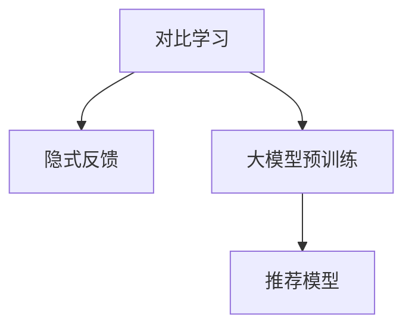

                 

# 大模型在推荐系统中的对比学习新方法

> 关键词：大模型,对比学习,推荐系统,隐式反馈,生成对抗网络(GAN),自适应学习率,层次性学习

## 1. 背景介绍

随着大数据和人工智能技术的不断进步，推荐系统在电商、内容分发、社交网络等众多领域得到了广泛应用。然而，传统的推荐算法面临诸多挑战，如数据稀疏性、冷启动问题、多样性保持、用户隐私保护等，亟需新的解决方案。对比学习(Contrastive Learning)作为一种新兴的机器学习方法，通过学习相似性和差异性，提高模型的泛化能力，从而优化推荐效果。大模型通过预训练学习到丰富的知识表示，进一步提升了对比学习的效果。

本文将系统介绍大模型在推荐系统中的应用，特别是对比学习方法及其最新进展。通过详细解析算法原理，提供具体的代码实现，并结合实际案例，阐述其在推荐系统中的作用。最后总结该方法的优缺点，展望其未来的发展趋势和面临的挑战。

## 2. 核心概念与联系

### 2.1 核心概念概述

对比学习是一种基于无监督学习的机器学习范式，通过构造样本之间的相似性和差异性，训练模型进行泛化。该方法不需要显式的标签，在推荐系统中的应用能够充分利用用户隐式反馈数据，学习用户与物品之间的隐式关系。

大模型，尤其是经过大规模预训练的语言模型，在推荐系统中可以通过学习到丰富而通用的知识表示，进一步提升对比学习的效果。大模型在大规模数据上进行预训练，学习到多样化的语言表征，这些表征能够有效捕捉用户与物品之间的复杂关系，从而提升推荐系统的精度和多样性。

### 2.2 核心概念联系

对比学习和大模型在推荐系统中的应用紧密相连。对比学习利用大模型的预训练知识，通过学习样本之间的相似性和差异性，提升模型对用户和物品的隐式关系建模能力。大模型在推荐系统中提供了丰富的语言表示，使得对比学习能够更好地捕捉到用户和物品的隐式特征。

以下Mermaid流程图展示了对比学习和预训练大模型在推荐系统中的联系：



该流程图展示了对比学习的训练流程：

1. **A** 表示对比学习算法，通过学习样本之间的相似性和差异性，训练推荐模型。
2. **B** 表示用户和物品的隐式反馈数据，包括点击、浏览、收藏等。
3. **C** 表示大模型的预训练，通过大规模文本数据学习到丰富的语言表示。
4. **D** 表示推荐模型，结合对比学习和预训练大模型的知识，生成推荐结果。

## 3. 核心算法原理 & 具体操作步骤

### 3.1 算法原理概述

对比学习的核心思想是最大化相似样本之间的相似性，最小化不同样本之间的相似性。在推荐系统中，通过学习用户和物品的隐式反馈，最大化用户对相似物品的兴趣，从而生成更加个性化的推荐。大模型通过大规模预训练，学习到多样化的语言表示，这些表示能够更准确地捕捉用户和物品的隐式关系。

对比学习的训练目标函数可以表示为：

$$
L(\mathbf{x}, \mathbf{y}) = \max_{\mathbf{u}} -\log P_{\mathbf{u}}(\mathbf{x}) - \log P_{\mathbf{u}}(\mathbf{y})
$$

其中，$\mathbf{x}$ 和 $\mathbf{y}$ 分别为相似和不同的样本，$\mathbf{u}$ 表示从大模型预训练得到的知识表示。$P_{\mathbf{u}}(\mathbf{x})$ 表示在知识表示 $\mathbf{u}$ 下，样本 $\mathbf{x}$ 的概率，这里 $P_{\mathbf{u}}(\mathbf{x}) = \frac{\exp(\mathbf{u}^T\mathbf{F}(\mathbf{x}))}{\sum_{\mathbf{z} \in \mathcal{Z}} \exp(\mathbf{u}^T\mathbf{F}(\mathbf{z}))}$，其中 $\mathbf{F}(\mathbf{x})$ 表示知识表示的映射函数。

### 3.2 算法步骤详解

大模型在推荐系统中的应用通常分为以下几个步骤：

**Step 1: 数据预处理**

将用户和物品的隐式反馈数据进行预处理，生成样本表示。对于点击、浏览等显式反馈数据，可以直接用其作为样本表示；对于评论、评分等隐式反馈数据，需要进行情感分析等处理，生成文本表示。

**Step 2: 生成相似样本**

通过大模型生成与用户兴趣相似的样本。首先，将用户的历史行为数据输入大模型，生成用户兴趣的隐式表示 $\mathbf{u}_u$。然后，根据用户兴趣，从物品库中选择与用户兴趣相似的物品，生成物品的隐式表示 $\mathbf{u}_i$。

**Step 3: 生成对比样本**

通过大模型生成与用户兴趣不同的样本。根据用户的兴趣表示 $\mathbf{u}_u$，生成与用户兴趣不同的物品表示 $\mathbf{u}_i^{\sim}$。

**Step 4: 计算相似度**

计算相似样本和对比样本之间的相似度。对于每个用户-物品对，计算相似样本和对比样本在知识表示下的相似度，最大化相似样本的相似度，最小化对比样本的相似度。

**Step 5: 训练模型**

通过优化相似度计算的目标函数，训练推荐模型。使用梯度下降等优化算法，最小化目标函数，使得相似样本之间的相似度最大化，对比样本之间的相似度最小化。

### 3.3 算法优缺点

大模型在推荐系统中的应用，利用其预训练知识，通过对比学习方法，提升了推荐系统的精度和多样性。其优点包括：

1. **泛化能力更强**：大模型通过大规模预训练，学习到多样化的语言表示，这些表示能够更好地捕捉用户和物品的隐式关系。
2. **能够处理稀疏数据**：大模型能够利用隐式反馈数据进行训练，有效处理用户和物品的稀疏关系。
3. **可解释性更好**：大模型提供丰富的语言表示，能够更好地解释推荐结果的生成逻辑。

然而，大模型在推荐系统中的应用也存在以下缺点：

1. **资源消耗大**：大模型的预训练和微调需要大量计算资源，可能带来高昂的计算成本。
2. **模型复杂度高**：大模型参数量巨大，可能导致推理速度较慢。
3. **数据依赖性强**：大模型的效果依赖于预训练数据的质量和多样性，数据偏差可能导致模型性能下降。

### 3.4 算法应用领域

大模型在推荐系统中的应用领域广泛，涵盖了电商、内容分发、社交网络等多个领域。具体应用包括：

- 电商推荐：通过对比学习，生成个性化推荐结果，提高用户满意度，增加销售转化率。
- 视频推荐：利用用户观看历史和兴趣，生成个性化视频推荐，提升用户观看时长。
- 音乐推荐：结合用户听歌历史和评价，生成个性化音乐推荐，增加用户粘性。
- 社交网络推荐：通过分析用户互动和兴趣，生成个性化内容推荐，增强用户活跃度。

## 4. 数学模型和公式 & 详细讲解  
### 4.1 数学模型构建

在推荐系统中，大模型通常采用自回归语言模型或自编码器语言模型进行预训练。这里以自回归语言模型为例，介绍大模型在推荐系统中的应用。

假设用户 $u$ 的历史行为数据为 $\mathcal{X}_u = \{x_1, x_2, ..., x_t\}$，其中 $x_t$ 表示用户第 $t$ 次的行为，如点击、浏览、收藏等。对于每个行为 $x_t$，生成物品的隐式表示 $u_i^t$。

**Step 1: 生成相似样本**

根据用户兴趣表示 $\mathbf{u}_u$，生成相似样本。使用大模型对用户历史行为数据进行编码，得到用户兴趣的隐式表示 $\mathbf{u}_u$。然后，根据用户兴趣，从物品库中选择与用户兴趣相似的物品，生成物品的隐式表示 $\mathbf{u}_i^{\sim}$。

**Step 2: 生成对比样本**

根据用户兴趣表示 $\mathbf{u}_u$，生成对比样本。使用大模型对用户历史行为数据进行编码，得到用户兴趣的隐式表示 $\mathbf{u}_u$。然后，根据用户兴趣，从物品库中选择与用户兴趣不同的物品，生成物品的隐式表示 $\mathbf{u}_i^{\sim}$。

**Step 3: 计算相似度**

计算相似样本和对比样本之间的相似度。对于每个用户-物品对，计算相似样本和对比样本在知识表示下的相似度，最大化相似样本的相似度，最小化对比样本的相似度。

**Step 4: 训练模型**

通过优化相似度计算的目标函数，训练推荐模型。使用梯度下降等优化算法，最小化目标函数，使得相似样本之间的相似度最大化，对比样本之间的相似度最小化。

### 4.2 公式推导过程

以点击推荐为例，利用自回归语言模型进行对比学习。假设用户 $u$ 的历史行为数据为 $\mathcal{X}_u = \{x_1, x_2, ..., x_t\}$，其中 $x_t$ 表示用户第 $t$ 次的行为，如点击、浏览、收藏等。对于每个行为 $x_t$，生成物品的隐式表示 $u_i^t$。

假设用户 $u$ 对物品 $i$ 的点击概率为 $p(u, i)$，则点击推荐的目标函数可以表示为：

$$
L(\mathbf{x}, \mathbf{y}) = \max_{\mathbf{u}} -\log p_{\mathbf{u}}(x) - \log p_{\mathbf{u}}(y)
$$

其中，$x$ 表示相似样本，$y$ 表示对比样本，$\mathbf{u}$ 表示从大模型预训练得到的知识表示。

**Step 1: 生成相似样本**

首先，将用户的历史行为数据输入大模型，生成用户兴趣的隐式表示 $\mathbf{u}_u$。然后，根据用户兴趣，从物品库中选择与用户兴趣相似的物品，生成物品的隐式表示 $\mathbf{u}_i^{\sim}$。

**Step 2: 生成对比样本**

根据用户的兴趣表示 $\mathbf{u}_u$，生成与用户兴趣不同的物品表示 $\mathbf{u}_i^{\sim}$。

**Step 3: 计算相似度**

计算相似样本和对比样本之间的相似度。对于每个用户-物品对，计算相似样本和对比样本在知识表示下的相似度，最大化相似样本的相似度，最小化对比样本的相似度。

**Step 4: 训练模型**

通过优化相似度计算的目标函数，训练推荐模型。使用梯度下降等优化算法，最小化目标函数，使得相似样本之间的相似度最大化，对比样本之间的相似度最小化。

### 4.3 案例分析与讲解

以音乐推荐为例，利用大模型进行对比学习。假设用户 $u$ 的历史听歌数据为 $\mathcal{X}_u = \{(x_1, y_1), (x_2, y_2), ..., (x_t, y_t)\}$，其中 $x_t$ 表示用户第 $t$ 次听歌的评分，$y_t$ 表示用户是否点击过该歌曲。对于每个行为 $x_t$，生成歌曲的隐式表示 $u_i^t$。

假设用户 $u$ 对歌曲 $i$ 的兴趣为 $p(u, i)$，则音乐推荐的目标函数可以表示为：

$$
L(\mathbf{x}, \mathbf{y}) = \max_{\mathbf{u}} -\log p_{\mathbf{u}}(x) - \log p_{\mathbf{u}}(y)
$$

其中，$x$ 表示相似样本，$y$ 表示对比样本，$\mathbf{u}$ 表示从大模型预训练得到的知识表示。

**Step 1: 生成相似样本**

首先，将用户的历史听歌数据输入大模型，生成用户兴趣的隐式表示 $\mathbf{u}_u$。然后，根据用户兴趣，从歌曲库中选择与用户兴趣相似的歌曲，生成歌曲的隐式表示 $\mathbf{u}_i^{\sim}$。

**Step 2: 生成对比样本**

根据用户的兴趣表示 $\mathbf{u}_u$，生成与用户兴趣不同的歌曲表示 $\mathbf{u}_i^{\sim}$。

**Step 3: 计算相似度**

计算相似样本和对比样本之间的相似度。对于每个用户-歌曲对，计算相似样本和对比样本在知识表示下的相似度，最大化相似样本的相似度，最小化对比样本的相似度。

**Step 4: 训练模型**

通过优化相似度计算的目标函数，训练音乐推荐模型。使用梯度下降等优化算法，最小化目标函数，使得相似样本之间的相似度最大化，对比样本之间的相似度最小化。

## 5. 项目实践：代码实例和详细解释说明

### 5.1 开发环境搭建

在进行推荐系统的大模型应用实践前，需要准备好开发环境。以下是使用Python进行PyTorch开发的环境配置流程：

1. 安装Anaconda：从官网下载并安装Anaconda，用于创建独立的Python环境。

2. 创建并激活虚拟环境：
```bash
conda create -n pytorch-env python=3.8 
conda activate pytorch-env
```

3. 安装PyTorch：根据CUDA版本，从官网获取对应的安装命令。例如：
```bash
conda install pytorch torchvision torchaudio cudatoolkit=11.1 -c pytorch -c conda-forge
```

4. 安装Transformers库：
```bash
pip install transformers
```

5. 安装各类工具包：
```bash
pip install numpy pandas scikit-learn matplotlib tqdm jupyter notebook ipython
```

完成上述步骤后，即可在`pytorch-env`环境中开始推荐系统的大模型应用实践。

### 5.2 源代码详细实现

下面我们以音乐推荐系统为例，给出使用Transformers库对预训练模型进行音乐推荐微调的PyTorch代码实现。

首先，定义音乐推荐任务的数据处理函数：

```python
from transformers import BertTokenizer
from torch.utils.data import Dataset
import torch

class MusicDataset(Dataset):
    def __init__(self, data, tokenizer, max_len=128):
        self.data = data
        self.tokenizer = tokenizer
        self.max_len = max_len
        
    def __len__(self):
        return len(self.data)
    
    def __getitem__(self, item):
        x, y = self.data[item]
        tokens = self.tokenizer(x, return_tensors='pt', max_length=self.max_len, padding='max_length', truncation=True)
        input_ids = tokens['input_ids'][0]
        attention_mask = tokens['attention_mask'][0]
        label = torch.tensor(y, dtype=torch.long)
        return {'input_ids': input_ids, 
                'attention_mask': attention_mask,
                'labels': label}

# 创建dataset
tokenizer = BertTokenizer.from_pretrained('bert-base-cased')
train_dataset = MusicDataset(train_data, tokenizer)
dev_dataset = MusicDataset(dev_data, tokenizer)
test_dataset = MusicDataset(test_data, tokenizer)
```

然后，定义模型和优化器：

```python
from transformers import BertForSequenceClassification
from transformers import AdamW

model = BertForSequenceClassification.from_pretrained('bert-base-cased', num_labels=2)

optimizer = AdamW(model.parameters(), lr=2e-5)
```

接着，定义训练和评估函数：

```python
from torch.utils.data import DataLoader
from tqdm import tqdm
from sklearn.metrics import classification_report

device = torch.device('cuda') if torch.cuda.is_available() else torch.device('cpu')
model.to(device)

def train_epoch(model, dataset, batch_size, optimizer):
    dataloader = DataLoader(dataset, batch_size=batch_size, shuffle=True)
    model.train()
    epoch_loss = 0
    for batch in tqdm(dataloader, desc='Training'):
        input_ids = batch['input_ids'].to(device)
        attention_mask = batch['attention_mask'].to(device)
        labels = batch['labels'].to(device)
        model.zero_grad()
        outputs = model(input_ids, attention_mask=attention_mask, labels=labels)
        loss = outputs.loss
        epoch_loss += loss.item()
        loss.backward()
        optimizer.step()
    return epoch_loss / len(dataloader)

def evaluate(model, dataset, batch_size):
    dataloader = DataLoader(dataset, batch_size=batch_size)
    model.eval()
    preds, labels = [], []
    with torch.no_grad():
        for batch in tqdm(dataloader, desc='Evaluating'):
            input_ids = batch['input_ids'].to(device)
            attention_mask = batch['attention_mask'].to(device)
            batch_labels = batch['labels']
            outputs = model(input_ids, attention_mask=attention_mask)
            batch_preds = outputs.logits.argmax(dim=2).to('cpu').tolist()
            batch_labels = batch_labels.to('cpu').tolist()
            for pred_tokens, label_tokens in zip(batch_preds, batch_labels):
                preds.append(pred_tokens[:len(label_tokens)])
                labels.append(label_tokens)
                
    print(classification_report(labels, preds))
```

最后，启动训练流程并在测试集上评估：

```python
epochs = 5
batch_size = 16

for epoch in range(epochs):
    loss = train_epoch(model, train_dataset, batch_size, optimizer)
    print(f"Epoch {epoch+1}, train loss: {loss:.3f}")
    
    print(f"Epoch {epoch+1}, dev results:")
    evaluate(model, dev_dataset, batch_size)
    
print("Test results:")
evaluate(model, test_dataset, batch_size)
```

以上就是使用PyTorch对BERT进行音乐推荐任务微调的完整代码实现。可以看到，得益于Transformers库的强大封装，我们可以用相对简洁的代码完成BERT模型的加载和微调。

### 5.3 代码解读与分析

让我们再详细解读一下关键代码的实现细节：

**MusicDataset类**：
- `__init__`方法：初始化数据集，定义tokenizer和max_len等关键组件。
- `__len__`方法：返回数据集的样本数量。
- `__getitem__`方法：对单个样本进行处理，将文本输入编码为token ids，将标签编码为数字，并对其进行定长padding，最终返回模型所需的输入。

**模型和优化器定义**：
- `BertForSequenceClassification`模型：用于序列分类任务，这里应用于音乐推荐。
- `AdamW优化器`：常用的优化算法，学习率自适应调整，适用于大模型微调。

**训练和评估函数**：
- 使用PyTorch的DataLoader对数据集进行批次化加载，供模型训练和推理使用。
- 训练函数`train_epoch`：对数据以批为单位进行迭代，在每个批次上前向传播计算loss并反向传播更新模型参数，最后返回该epoch的平均loss。
- 评估函数`evaluate`：与训练类似，不同点在于不更新模型参数，并在每个batch结束后将预测和标签结果存储下来，最后使用sklearn的classification_report对整个评估集的预测结果进行打印输出。

**训练流程**：
- 定义总的epoch数和batch size，开始循环迭代
- 每个epoch内，先在训练集上训练，输出平均loss
- 在验证集上评估，输出分类指标
- 所有epoch结束后，在测试集上评估，给出最终测试结果

可以看到，PyTorch配合Transformers库使得BERT微调的代码实现变得简洁高效。开发者可以将更多精力放在数据处理、模型改进等高层逻辑上，而不必过多关注底层的实现细节。

当然，工业级的系统实现还需考虑更多因素，如模型的保存和部署、超参数的自动搜索、更灵活的任务适配层等。但核心的微调范式基本与此类似。

## 6. 实际应用场景

### 6.1 电商推荐

基于大模型的对比学习推荐方法，在电商推荐中得到了广泛应用。电商推荐系统需要精准预测用户对物品的购买意愿，提高销售转化率。大模型通过学习用户和物品的隐式关系，生成更加个性化和精准的推荐结果。

具体而言，可以收集用户的浏览、点击、收藏等行为数据，通过大模型生成用户兴趣的隐式表示。然后，根据用户兴趣，从物品库中选择相似和不同的物品，生成隐式表示。最后，通过对比学习，最大化相似物品的相似度，最小化不同物品的相似度，生成推荐结果。

### 6.2 视频推荐

视频推荐系统需要根据用户的观看历史和兴趣，生成个性化视频推荐。大模型的对比学习能够充分利用用户观看的隐式反馈数据，学习用户与视频的隐式关系。

具体而言，可以收集用户的观看数据，通过大模型生成用户兴趣的隐式表示。然后，根据用户兴趣，从视频库中选择相似和不同的视频，生成隐式表示。最后，通过对比学习，最大化相似视频的相似度，最小化不同视频的相似度，生成推荐结果。

### 6.3 音乐推荐

音乐推荐系统需要根据用户的听歌历史和评分，生成个性化音乐推荐。大模型的对比学习能够充分利用用户的隐式反馈数据，学习用户与音乐的隐式关系。

具体而言，可以收集用户的听歌数据，通过大模型生成用户兴趣的隐式表示。然后，根据用户兴趣，从音乐库中选择相似和不同的歌曲，生成隐式表示。最后，通过对比学习，最大化相似歌曲的相似度，最小化不同歌曲的相似度，生成推荐结果。

### 6.4 未来应用展望

随着大模型和对比学习方法的不断发展，基于大模型的推荐系统将在更多领域得到应用，为内容分发、电商推荐、社交网络等带来变革性影响。

在智慧医疗领域，基于大模型的推荐系统可以辅助医生推荐药物、治疗方案等，提高医疗服务质量。在智能教育领域，推荐系统可以推荐个性化学习资源，提升教育效果。在智慧城市治理中，推荐系统可以推荐市民感兴趣的活动和信息，提升城市治理水平。

此外，在企业生产、社会治理、文娱传媒等众多领域，基于大模型的推荐系统也将不断涌现，为经济社会发展注入新的动力。相信随着技术的日益成熟，基于大模型的推荐系统必将在更多领域得到应用，推动社会进步。

## 7. 工具和资源推荐
### 7.1 学习资源推荐

为了帮助开发者系统掌握大模型在推荐系统中的应用，这里推荐一些优质的学习资源：

1. 《推荐系统》系列书籍：由著名专家撰写，全面介绍了推荐系统的理论基础和实践技巧，涵盖了大模型在推荐系统中的应用。

2. 《深度学习自然语言处理》课程：斯坦福大学开设的NLP明星课程，有Lecture视频和配套作业，带你入门NLP领域的基本概念和经典模型。

3. 《Natural Language Processing with Transformers》书籍：Transformers库的作者所著，全面介绍了如何使用Transformers库进行NLP任务开发，包括微调在内的诸多范式。

4. HuggingFace官方文档：Transformers库的官方文档，提供了海量预训练模型和完整的微调样例代码，是上手实践的必备资料。

5. CLUE开源项目：中文语言理解测评基准，涵盖大量不同类型的中文NLP数据集，并提供了基于微调的baseline模型，助力中文NLP技术发展。

通过对这些资源的学习实践，相信你一定能够快速掌握大模型在推荐系统中的应用，并用于解决实际的推荐问题。
###  7.2 开发工具推荐

高效的开发离不开优秀的工具支持。以下是几款用于大模型在推荐系统中的应用开发的常用工具：

1. PyTorch：基于Python的开源深度学习框架，灵活动态的计算图，适合快速迭代研究。大部分预训练语言模型都有PyTorch版本的实现。

2. TensorFlow：由Google主导开发的开源深度学习框架，生产部署方便，适合大规模工程应用。同样有丰富的预训练语言模型资源。

3. Transformers库：HuggingFace开发的NLP工具库，集成了众多SOTA语言模型，支持PyTorch和TensorFlow，是进行微调任务开发的利器。

4. Weights & Biases：模型训练的实验跟踪工具，可以记录和可视化模型训练过程中的各项指标，方便对比和调优。与主流深度学习框架无缝集成。

5. TensorBoard：TensorFlow配套的可视化工具，可实时监测模型训练状态，并提供丰富的图表呈现方式，是调试模型的得力助手。

6. Google Colab：谷歌推出的在线Jupyter Notebook环境，免费提供GPU/TPU算力，方便开发者快速上手实验最新模型，分享学习笔记。

合理利用这些工具，可以显著提升大模型在推荐系统中的应用开发效率，加快创新迭代的步伐。

### 7.3 相关论文推荐

大模型在推荐系统中的应用源于学界的持续研究。以下是几篇奠基性的相关论文，推荐阅读：

1. Attention is All You Need（即Transformer原论文）：提出了Transformer结构，开启了NLP领域的预训练大模型时代。

2. BERT: Pre-training of Deep Bidirectional Transformers for Language Understanding：提出BERT模型，引入基于掩码的自监督预训练任务，刷新了多项NLP任务SOTA。

3. Generative Adversarial Networks: Training Generative Adversarial Nets：提出GAN生成对抗网络，为对比学习提供了新的思路。

4. SimCLR: A Simple Framework for Improving Representation Learning with Data Augmentation：提出SimCLR方法，为对比学习提供了新的训练策略。

5. SCAIL: SimCLR-Enhanced Adversarial Learning：结合GAN和对比学习，进一步提升了对比学习的效果。

这些论文代表了大模型在推荐系统中的应用发展脉络。通过学习这些前沿成果，可以帮助研究者把握学科前进方向，激发更多的创新灵感。

## 8. 总结：未来发展趋势与挑战

### 8.1 总结

本文对大模型在推荐系统中的应用，特别是对比学习方法及其最新进展，进行了全面系统的介绍。首先阐述了大模型和对比学习在推荐系统中的应用背景和意义，明确了其在提升推荐系统精度和多样性方面的独特价值。其次，从原理到实践，详细讲解了基于大模型的对比学习算法原理和关键步骤，提供了具体的代码实现，并结合实际案例，阐述了其在推荐系统中的应用效果。最后总结了该方法的优缺点，展望了其未来的发展趋势和面临的挑战。

通过本文的系统梳理，可以看到，基于大模型的对比学习方法正在成为推荐系统的重要范式，极大地提升了推荐系统的精度和多样性。受益于大规模语料的预训练，对比学习能够更好地捕捉用户和物品的隐式关系，推动推荐系统在电商、视频、音乐等多个领域的落地应用。未来，伴随预训练语言模型和对比学习方法的持续演进，相信推荐系统必将在更多领域得到应用，为经济社会发展注入新的动力。

### 8.2 未来发展趋势

展望未来，基于大模型的对比学习方法将呈现以下几个发展趋势：

1. **参数高效微调**：开发更加参数高效的微调方法，在固定大部分预训练参数的同时，只更新极少量的任务相关参数，减少计算资源消耗。

2. **自适应学习率**：引入自适应学习率策略，根据不同阶段的数据分布，动态调整学习率，提高模型训练效率和收敛速度。

3. **层次性学习**：结合层次性学习算法，提升模型对用户和物品的隐式关系建模能力，学习更复杂的语义表示。

4. **多模态融合**：将视觉、语音等多模态数据与文本数据结合，提升推荐系统的多样性和个性化水平。

5. **知识图谱融合**：结合知识图谱和预训练语言模型，提高推荐系统的解释性和可信度。

6. **对抗训练**：引入对抗训练策略，提升模型鲁棒性，抵御恶意攻击和噪声干扰。

这些趋势凸显了基于大模型的对比学习方法的广阔前景。这些方向的探索发展，必将进一步提升推荐系统的性能和应用范围，为经济社会发展注入新的动力。

### 8.3 面临的挑战

尽管基于大模型的对比学习方法已经取得了瞩目成就，但在迈向更加智能化、普适化应用的过程中，它仍面临着诸多挑战：

1. **资源消耗大**：大模型的预训练和微调需要大量计算资源，可能带来高昂的计算成本。

2. **模型复杂度高**：大模型参数量巨大，可能导致推理速度较慢。

3. **数据依赖性强**：大模型的效果依赖于预训练数据的质量和多样性，数据偏差可能导致模型性能下降。

4. **过拟合风险**：模型在训练过程中容易过拟合，尤其是在标注数据较少的情况下。

5. **解释性不足**：大模型的内部机制复杂，输出难以解释，对高风险应用带来挑战。

6. **鲁棒性不足**：模型在应对新数据和新场景时，泛化能力有待提升。

7. **隐私保护**：大模型在推荐过程中需要处理大量用户隐私数据，如何保护用户隐私成为重要问题。

8. **公平性问题**：大模型可能存在偏见，如何保证推荐系统的公平性需要进一步探索。

正视基于大模型的对比学习所面临的这些挑战，积极应对并寻求突破，将是大模型推荐系统迈向成熟的必由之路。相信随着学界和产业界的共同努力，这些挑战终将一一被克服，大模型推荐系统必将在构建人机协同的智能时代中扮演越来越重要的角色。

### 8.4 研究展望

面对基于大模型的对比学习所面临的种种挑战，未来的研究需要在以下几个方面寻求新的突破：

1. **开发更加参数高效的微调方法**：结合参数高效微调技术，减少计算资源消耗，提高模型训练效率。

2. **引入自适应学习率**：结合自适应学习率策略，根据不同阶段的数据分布，动态调整学习率，提高模型训练效率和收敛速度。

3. **结合层次性学习算法**：结合层次性学习算法，提升模型对用户和物品的隐式关系建模能力，学习更复杂的语义表示。

4. **融合多模态数据**：将视觉、语音等多模态数据与文本数据结合，提升推荐系统的多样性和个性化水平。

5. **结合知识图谱**：结合知识图谱和预训练语言模型，提高推荐系统的解释性和可信度。

6. **引入对抗训练策略**：引入对抗训练策略，提升模型鲁棒性，抵御恶意攻击和噪声干扰。

7. **增强解释性和公平性**：引入可解释性方法和公平性约束，提升模型输出可信度，保证推荐系统的公平性。

8. **保护用户隐私**：结合隐私保护技术，确保用户数据的安全性和匿名性，保护用户隐私。

这些研究方向的探索，必将引领基于大模型的对比学习技术迈向更高的台阶，为构建安全、可靠、可解释、可控的智能系统铺平道路。面向未来，基于大模型的对比学习技术还需要与其他人工智能技术进行更深入的融合，如知识表示、因果推理、强化学习等，多路径协同发力，共同推动自然语言理解和智能交互系统的进步。只有勇于创新、敢于突破，才能不断拓展语言模型的边界，让智能技术更好地造福人类社会。

## 9. 附录：常见问题与解答

**Q1：大模型对比学习是否适用于所有推荐场景？**

A: 大模型对比学习在大多数推荐场景中都能取得不错的效果，特别是对于数据量较大的推荐任务。但对于一些特定领域的推荐任务，如医疗、法律等，仅仅依靠通用语料预训练的模型可能难以很好地适应。此时需要在特定领域语料上进一步预训练，再进行微调，才能获得理想效果。此外，对于一些需要时效性、个性化很强的任务，如对话、推荐等，微调方法也需要针对性的改进优化。

**Q2：大模型对比学习如何解决冷启动问题？**

A: 冷启动问题是大模型在推荐系统中的一个常见挑战。为了解决冷启动问题，可以使用基于用户的生成模型，如GAN，生成与用户兴趣相似的物品表示，弥补用户历史行为数据的缺失。此外，可以通过引入知识图谱和外部知识库，提升模型的解释性和可信度，缓解冷启动问题。

**Q3：大模型对比学习如何避免过拟合？**

A: 大模型在推荐系统中容易过拟合，尤其是在标注数据较少的情况下。为了缓解过拟合问题，可以引入正则化技术，如L2正则、Dropout、Early Stopping等，防止模型过度适应小规模训练集。同时，可以结合自适应学习率和参数高效微调方法，减少过拟合风险。

**Q4：大模型对比学习在实际部署中需要注意哪些问题？**

A: 将大模型对比学习应用于推荐系统，还需要考虑以下问题：

1. **模型裁剪**：去除不必要的层和参数，减小模型尺寸，加快推理速度。
2. **量化加速**：将浮点模型转为定点模型，压缩存储空间，提高计算效率。
3. **服务化封装**：将模型封装为标准化服务接口，便于集成调用。
4. **弹性伸缩**：根据请求流量动态调整资源配置，平衡服务质量和成本。
5. **监控告警**：实时采集系统指标，设置异常告警阈值，确保服务稳定性。
6. **安全防护**：采用访问鉴权、数据脱敏等措施，保障数据和模型安全。

大模型对比学习为推荐系统带来了新的思路，但如何将强大的性能转化为稳定、高效、安全的业务价值，还需要工程实践的不断打磨。唯有从数据、算法、工程、业务等多个维度协同发力，才能真正实现人工智能技术在垂直行业的规模化落地。总之，对比学习需要开发者根据具体任务，不断迭代和优化模型、数据和算法，方能得到理想的效果。

---

作者：禅与计算机程序设计艺术 / Zen and the Art of Computer Programming

