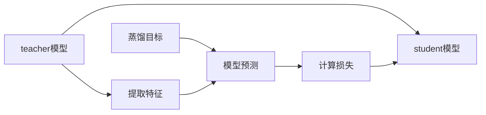

                 

## 1. 背景介绍

在信息爆炸的时代，推荐系统作为智能决策的重要工具，已经成为互联网公司标配的核心功能。它不仅能够提升用户体验，还能提高商业收益。但随着用户对个性化需求的高涨，推荐系统面临的挑战也越来越严峻。如何在大规模数据和海量信息中找到用户真正感兴趣的内容，是推荐系统亟需解决的问题。

近年来，大语言模型如GPT、BERT等，因其卓越的泛化能力和强大的表征能力，在推荐系统中也得到了广泛应用。这些模型在巨大的无监督数据集上进行预训练，能够学习到丰富的语言特征，进一步提升推荐系统的效果。但在实际应用中，大模型往往参数量庞大、计算成本高昂，无法直接部署在推荐系统中。此外，大模型的知识难以被直接提取和使用，也需要针对推荐系统进行特化。

针对这些问题，知识蒸馏技术应运而生。知识蒸馏（Knowledge Distillation, KD）是一种将复杂模型（teacher）的知识，转移给简单模型（student）的技术。在推荐系统中，大语言模型可以作为teacher，将从大规模语料中学习到的语言知识，传递给轻量级的推荐模型。本节将系统介绍知识蒸馏技术的基本概念、算法原理，以及在大推荐系统中的应用场景和实际案例。

## 2. 核心概念与联系

### 2.1 核心概念概述

知识蒸馏技术通过将复杂模型的知识和特征，传递给简单模型，使其具备与复杂模型相似的性能，但模型大小和计算成本都大幅降低。在推荐系统中，知识蒸馏可以更好地利用大语言模型提取到的丰富语言特征，提升推荐模型的效果，同时避免直接使用大模型时的高计算成本和内存占用问题。

知识蒸馏的核心要素包括：
- **teacher模型**：复杂且参数量大的模型，通常用于提取特征和知识。
- **student模型**：轻量级的模型，用于接收teacher模型传递的知识，并应用到实际推荐任务中。
- **蒸馏目标**：通过优化损失函数，使得student模型能够学习teacher模型的输出，并且保持一定的准确性和泛化能力。

### 2.2 核心概念原理和架构的 Mermaid 流程图(Mermaid 流程节点中不要有括号、逗号等特殊字符)

这个流程图展示了知识蒸馏的基本流程：teacher模型提取特征，将特征输入student模型，计算损失并更新student模型。其中，提取的特征和损失函数的设计，是知识蒸馏成功的关键。

## 3. 核心算法原理 & 具体操作步骤

### 3.1 算法原理概述

知识蒸馏的算法原理，是通过最小化student模型和teacher模型之间的差异，使得student模型能够模拟teacher模型的输出。常见的蒸馏方法包括特征蒸馏、概率蒸馏和行为蒸馏等。

- **特征蒸馏**：直接将teacher模型的输出特征，作为student模型的输入，优化student模型以匹配teacher模型的输出特征分布。
- **概率蒸馏**：通过最大化teacher模型和student模型的预测概率，使得student模型能够学习teacher模型的预测概率分布。
- **行为蒸馏**：通过最大化teacher模型和student模型的预测行为，如准确率和召回率等，使得student模型能够模拟teacher模型的行为表现。

### 3.2 算法步骤详解

以特征蒸馏为例，介绍知识蒸馏的具体操作步骤：

1. **准备teacher和student模型**：选择复杂度较高的模型作为teacher模型，简单且轻量级的模型作为student模型。
2. **特征提取**：teacher模型对输入数据进行特征提取，得到中间特征表示。
3. **定义损失函数**：计算teacher模型和student模型之间的差异，通常是使用KL散度等距离度量。
4. **模型训练**：使用损失函数优化student模型，使得其输出的特征分布接近teacher模型的特征分布。
5. **模型评估**：在测试集上评估student模型的性能，对比蒸馏前后的效果。

### 3.3 算法优缺点

知识蒸馏技术的优点包括：
- 降低计算成本：通过简化模型结构，减少参数量，降低计算成本。
- 提升泛化能力：通过蒸馏复杂模型特征，提高模型的泛化能力。
- 提高可解释性：简单模型更易于理解和解释，方便模型部署和维护。

但知识蒸馏也存在一些局限性：
- 模型精度的下降：简化模型往往会降低一定的精度。
- 特征传递的损失：特征提取过程中可能会有信息损失。
- 蒸馏效率低：蒸馏过程需要额外的时间和计算资源。

### 3.4 算法应用领域

知识蒸馏技术广泛应用于深度学习领域，尤其是在推荐系统和计算机视觉等任务中。在大推荐系统中，知识蒸馏可以应用于用户兴趣建模、物品嵌入学习、推荐策略优化等多个环节，提高推荐的精度和多样性，改善用户体验。

## 4. 数学模型和公式 & 详细讲解 & 举例说明

### 4.1 数学模型构建

知识蒸馏的数学模型构建，通常包括以下几个关键要素：

1. **teacher模型的预测**：$y_t$ 表示teacher模型对输入数据的预测结果。
2. **student模型的预测**：$y_s$ 表示student模型对输入数据的预测结果。
3. **蒸馏损失函数**：$L$ 表示teacher模型和student模型之间的差异损失，通常采用KL散度或其他距离度量。

### 4.2 公式推导过程

以KL散度为基础的特征蒸馏为例，公式推导如下：

$$
L = -\frac{1}{N}\sum_{i=1}^N D_{KL}(y_t^i || y_s^i)
$$

其中，$N$ 为训练样本数量，$y_t^i$ 和 $y_s^i$ 分别表示teacher模型和student模型在第$i$个样本上的预测结果。$D_{KL}$ 表示KL散度，用于衡量两个概率分布之间的差异。

### 4.3 案例分析与讲解

假设我们使用BERT作为teacher模型，LSTM作为student模型，进行知识蒸馏。具体步骤如下：

1. **特征提取**：将用户评论输入BERT模型，得到向量表示 $z_t$。
2. **定义损失函数**：$L = -\frac{1}{N}\sum_{i=1}^N D_{KL}(z_t^i || z_s^i)$，其中 $z_s^i$ 表示LSTM模型在第$i$个样本上的预测结果。
3. **模型训练**：使用优化算法如AdamW更新LSTM模型的参数，最小化损失函数 $L$。
4. **模型评估**：在测试集上评估LSTM模型的性能，对比蒸馏前后的效果。

## 5. 项目实践：代码实例和详细解释说明

### 5.1 开发环境搭建

知识蒸馏的实现需要深度学习框架的支持。这里以PyTorch为例，介绍开发环境搭建的具体步骤：

1. 安装Anaconda：从官网下载并安装Anaconda，用于创建独立的Python环境。
2. 创建并激活虚拟环境：
```bash
conda create -n distillation python=3.8 
conda activate distillation
```
3. 安装PyTorch：根据CUDA版本，从官网获取对应的安装命令。例如：
```bash
conda install pytorch torchvision torchaudio cudatoolkit=11.1 -c pytorch -c conda-forge
```
4. 安装TensorBoard：用于可视化模型训练过程。
```bash
pip install tensorboard
```

完成上述步骤后，即可在`distillation`环境中开始知识蒸馏的实践。

### 5.2 源代码详细实现

以下是一个简单的知识蒸馏项目示例，使用BERT作为teacher模型，LSTM作为student模型，进行用户兴趣建模。

```python
import torch
import torch.nn as nn
import torch.optim as optim
from transformers import BertModel, BertTokenizer
from torch.utils.data import DataLoader, TensorDataset

class DistillationModel(nn.Module):
    def __init__(self):
        super(DistillationModel, self).__init__()
        self.bert = BertModel.from_pretrained('bert-base-cased')
        self.lstm = nn.LSTM(input_size=768, hidden_size=64, num_layers=2, bidirectional=True)
        self.fc = nn.Linear(128, num_classes)

    def forward(self, x):
        x = self.bert(x)
        x = torch.mean(x, dim=1)
        x = self.lstm(x)
        x = self.fc(x[-1])
        return x

# 准备数据集
tokenizer = BertTokenizer.from_pretrained('bert-base-cased')
train_dataset = ...
dev_dataset = ...
test_dataset = ...

# 定义teacher和student模型
teacher_model = BertModel.from_pretrained('bert-base-cased')
student_model = DistillationModel()

# 准备优化器和损失函数
optimizer = optim.AdamW(teacher_model.parameters(), lr=2e-5)
teacher_criterion = nn.CrossEntropyLoss()
student_criterion = nn.CrossEntropyLoss()

# 训练过程
for epoch in range(num_epochs):
    for batch in DataLoader(train_dataset, batch_size):
        x, y = batch
        x = tokenizer(x, padding='max_length', truncation=True, max_length=512, return_tensors='pt')
        teacher_model.zero_grad()
        logits = teacher_model(x)
        loss = teacher_criterion(logits, y)
        loss.backward()
        optimizer.step()

    # 评估
    with torch.no_grad():
        correct = 0
        total = 0
        for batch in DataLoader(dev_dataset, batch_size):
            x, y = batch
            x = tokenizer(x, padding='max_length', truncation=True, max_length=512, return_tensors='pt')
            logits = teacher_model(x)
            _, predicted = torch.max(logits, 1)
            total += y.size(0)
            correct += (predicted == y).sum().item()
        print(f'Accuracy on dev set: {correct / total * 100:.2f}%')
```

### 5.3 代码解读与分析

让我们再详细解读一下关键代码的实现细节：

**DistillationModel类**：
- `__init__`方法：初始化BERT和LSTM等组件。
- `forward`方法：定义模型的前向传播过程，包括提取特征、计算LSTM和全连接层。

**代码示例中的细节**：
- 使用`transformers`库中的`BertModel`和`BertTokenizer`类，加载BERT预训练模型和分词器。
- 定义自定义模型`DistillationModel`，继承自`nn.Module`，包含BERT和LSTM等组件。
- 在训练过程中，将LSTM模型作为student模型，使用 teacher_model 提取特征，并计算loss进行反向传播。
- 在评估过程中，使用teacher_model 提取特征，计算准确率。

可以看到，知识蒸馏的代码实现并不复杂，关键是选择合适的teacher和student模型，以及定义合适的损失函数。通过不断迭代训练，可以逐步提高student模型的性能。

## 6. 实际应用场景

### 6.1 推荐系统中的用户兴趣建模

在推荐系统中，用户兴趣建模是一个重要环节。传统的基于统计的方法往往需要大量标注数据，且效果有限。利用知识蒸馏技术，可以通过复杂模型（如BERT）提取用户评论等文本数据的语义特征，然后通过简单的LSTM模型进行用户兴趣建模，实现更高效、更准确的用户兴趣表示。

具体来说，知识蒸馏可以帮助我们：
- **提高模型泛化能力**：通过蒸馏复杂模型特征，使简单模型具有更好的泛化能力。
- **减少计算资源消耗**：复杂模型参数量大，计算成本高，通过蒸馏技术可以将复杂模型知识转移给简单模型，降低计算资源消耗。
- **提升模型效果**：复杂模型通常具有更好的特征提取能力，通过蒸馏，可以学习到更丰富的语义信息，提升推荐系统的精度和多样性。

### 6.2 物品嵌入学习

物品嵌入学习（Item Embedding）是推荐系统中的一个重要环节，用于将物品映射到高维向量空间。传统的物品嵌入方法通常使用协同过滤等基于统计的方法，计算成本高且效果有限。利用知识蒸馏技术，可以通过复杂的预训练模型（如BERT）提取物品的语义特征，然后通过简单的模型进行物品嵌入学习，实现更高效、更准确的物品表示。

具体来说，知识蒸馏可以帮助我们：
- **提取更丰富的特征**：复杂模型通常能够学习到更丰富的特征，通过蒸馏，可以将其知识传递给简单模型。
- **减少训练时间**：复杂模型训练时间长，通过蒸馏，可以大大缩短训练时间。
- **提升模型效果**：复杂模型通常具有更好的特征提取能力，通过蒸馏，可以学习到更准确的物品嵌入表示，提升推荐系统的效果。

### 6.3 推荐策略优化

推荐策略优化是推荐系统中的核心环节，用于决定如何向用户推荐物品。传统的推荐策略优化方法通常基于统计或规则，难以处理复杂场景。利用知识蒸馏技术，可以通过复杂模型（如BERT）提取用户和物品的特征，然后通过简单的模型进行推荐策略优化，实现更高效、更准确的推荐策略。

具体来说，知识蒸馏可以帮助我们：
- **提高推荐精度**：复杂模型通常具有更好的特征提取能力，通过蒸馏，可以学习到更准确的特征表示。
- **减少计算资源消耗**：复杂模型计算资源消耗大，通过蒸馏，可以将其知识传递给简单模型，降低计算资源消耗。
- **提升推荐效果**：复杂模型通常具有更好的特征提取能力，通过蒸馏，可以学习到更准确的特征表示，提升推荐效果。

## 7. 工具和资源推荐

### 7.1 学习资源推荐

为了帮助开发者系统掌握知识蒸馏技术，这里推荐一些优质的学习资源：

1. 《Distillation: An overview》系列博文：由知识蒸馏领域的专家撰写，系统介绍了知识蒸馏的基本概念、算法原理及应用场景。
2 CS231n《深度学习计算机视觉》课程：斯坦福大学开设的计算机视觉明星课程，有Lecture视频和配套作业，带你入门深度学习中的知识蒸馏技术。
3 《Knowledge Distillation in Deep Learning》书籍：专门讲解知识蒸馏技术的经典书籍，涵盖了知识蒸馏的各个方面，从理论到实践均有涉及。
4 《Deep Learning with PyTorch》书籍：讲解使用PyTorch进行深度学习开发的书籍，其中包含知识蒸馏的实现代码和案例分析。
5 HuggingFace官方文档：提供丰富的预训练模型和知识蒸馏样例代码，是进行知识蒸馏任务开发的必备资料。

通过对这些资源的学习实践，相信你一定能够快速掌握知识蒸馏技术的精髓，并用于解决实际的推荐系统问题。

### 7.2 开发工具推荐

高效的开发离不开优秀的工具支持。以下是几款用于知识蒸馏开发的常用工具：

1. PyTorch：基于Python的开源深度学习框架，灵活动态的计算图，适合快速迭代研究。大部分深度学习模型都有PyTorch版本的实现。
2 TensorFlow：由Google主导开发的开源深度学习框架，生产部署方便，适合大规模工程应用。
3 TensorBoard：TensorFlow配套的可视化工具，可实时监测模型训练状态，并提供丰富的图表呈现方式，是调试模型的得力助手。
4 Weights & Biases：模型训练的实验跟踪工具，可以记录和可视化模型训练过程中的各项指标，方便对比和调优。
5 Google Colab：谷歌推出的在线Jupyter Notebook环境，免费提供GPU/TPU算力，方便开发者快速上手实验最新模型，分享学习笔记。

合理利用这些工具，可以显著提升知识蒸馏任务的开发效率，加快创新迭代的步伐。

### 7.3 相关论文推荐

知识蒸馏技术的发展源于学界的持续研究。以下是几篇奠基性的相关论文，推荐阅读：

1. Distillation（Paper）：知识蒸馏技术的开创性论文，详细介绍了知识蒸馏的基本原理和算法流程。
2 Hinton et al. "Distilling the Knowledge in a Neural Network"：知识蒸馏技术的经典论文，提出了使用教师模型指导学生模型的思想。
3 Feichtenhofer et al. "Rethinking Spatial Temporal Features for Video Action Recognition"：展示了知识蒸馏在计算机视觉任务中的广泛应用。
4 Zhao et al. "On distillation: What works, what does not, and why?"：对知识蒸馏技术进行了全面的回顾和分析，指出了当前存在的问题和未来的研究方向。
5 Pourzand et al. "Teacher-Student Networks for Efficient Knowledge Distillation"：提出了高效的蒸馏方法，进一步提升了知识蒸馏的效果。

这些论文代表了大模型知识蒸馏技术的发展脉络。通过学习这些前沿成果，可以帮助研究者把握学科前进方向，激发更多的创新灵感。

## 8. 总结：未来发展趋势与挑战

### 8.1 总结

本文对知识蒸馏技术在大推荐系统中的应用进行了全面系统的介绍。首先阐述了知识蒸馏技术的基本概念、算法原理及其实际应用，明确了知识蒸馏技术在大推荐系统中的独特价值。其次，从原理到实践，详细讲解了知识蒸馏的数学模型和具体操作步骤，给出了知识蒸馏任务开发的完整代码实例。同时，本文还广泛探讨了知识蒸馏技术在用户兴趣建模、物品嵌入学习、推荐策略优化等多个推荐系统中的实际应用场景和案例。

通过本文的系统梳理，可以看到，知识蒸馏技术正在成为深度学习推荐系统中的重要范式，极大地拓展了预训练语言模型的应用边界，催生了更多的落地场景。受益于大语言模型和知识蒸馏技术的不断进步，相信推荐系统必将在更广阔的应用领域大放异彩，深刻影响人类的生产生活方式。

### 8.2 未来发展趋势

展望未来，知识蒸馏技术将呈现以下几个发展趋势：

1. 模型的复杂度将进一步降低：随着蒸馏技术的不断发展，学生模型的复杂度将不断降低，资源消耗将大幅减少，应用范围将进一步扩大。
2. 模型的泛化能力将进一步提升：通过蒸馏技术，复杂模型的知识将被更加有效地传递给简单模型，提升模型的泛化能力和鲁棒性。
3. 更多的蒸馏方法将被提出：未来将涌现更多高效的蒸馏方法，如多任务蒸馏、混合蒸馏等，进一步提升蒸馏效果。
4. 蒸馏过程将更加自动化：蒸馏过程将借助自动化工具和算法，进一步简化蒸馏流程，提高蒸馏效率。
5. 蒸馏方法将与更多领域结合：知识蒸馏技术将与其他AI技术如知识图谱、符号学习等结合，进一步提升推荐系统的效果。

以上趋势凸显了知识蒸馏技术的广阔前景。这些方向的探索发展，必将进一步提升推荐系统的性能和应用范围，为人类智能决策提供更强大的支持。

### 8.3 面临的挑战

尽管知识蒸馏技术已经取得了瞩目成就，但在迈向更加智能化、普适化应用的过程中，它仍面临诸多挑战：

1. 蒸馏效果的可控性问题：复杂模型和简单模型之间存在差距，如何平衡两者之间的关系，使得学生模型既能保留复杂模型的关键特征，又能避免过拟合，是蒸馏技术的核心挑战。
2. 蒸馏过程的效率问题：蒸馏过程需要大量的计算资源和时间，如何在保证蒸馏效果的同时，提高蒸馏效率，是未来的研究方向。
3. 蒸馏方法的可扩展性问题：蒸馏方法往往局限于特定场景，如何设计通用的蒸馏框架，适用于更多不同的应用场景，是未来的挑战之一。
4. 知识提取的完备性问题：复杂模型往往存在信息冗余和缺失，如何高效提取关键知识，并将其传递给简单模型，是蒸馏技术的关键问题。
5. 蒸馏目标的清晰性问题：蒸馏目标的设计需要考虑到模型之间的差异性和相似性，如何设计合理的蒸馏目标，是未来研究的重点。

这些挑战需要未来的研究从理论和实践中不断探索，才能进一步提升知识蒸馏技术的效果和应用范围。

### 8.4 研究展望

面对知识蒸馏技术面临的挑战，未来的研究需要在以下几个方面寻求新的突破：

1. 探索更高效的蒸馏方法：设计更智能、更高效的蒸馏算法，如混合蒸馏、多任务蒸馏等，进一步提升蒸馏效果。
2 提升模型的泛化能力：通过蒸馏技术，使复杂模型的知识被更有效地传递给简单模型，提升模型的泛化能力和鲁棒性。
3 设计通用的蒸馏框架：构建适用于更多不同场景的蒸馏框架，提高蒸馏技术的可扩展性和应用范围。
4 优化蒸馏过程：通过自动蒸馏、半监督蒸馏等方法，提高蒸馏过程的效率和效果。
5 设计合理的蒸馏目标：在蒸馏目标的设计上，需要充分考虑模型之间的差异性和相似性，提高蒸馏目标的清晰性和合理性。

这些研究方向的探索，必将引领知识蒸馏技术迈向更高的台阶，为构建更高效、更智能的推荐系统提供新的思路和方法。面向未来，知识蒸馏技术还需要与其他AI技术进行更深入的融合，如知识图谱、符号学习等，多路径协同发力，共同推动推荐系统的进步。只有勇于创新、敢于突破，才能不断拓展知识蒸馏技术的边界，让智能推荐系统更好地服务于人类。

## 9. 附录：常见问题与解答

**Q1：知识蒸馏是否可以应用于所有推荐系统任务？**

A: 知识蒸馏技术可以应用于大多数推荐系统任务，尤其是需要提取用户兴趣或物品特征的任务。但对于一些特定的推荐任务，如协同过滤、内容推荐等，可能需要结合其他技术进行综合优化。

**Q2：知识蒸馏是否会影响推荐系统的实时性？**

A: 知识蒸馏通常需要额外的计算资源和时间，可能会影响推荐系统的实时性。但通过合理的蒸馏策略和硬件优化，可以在保证一定精度的情况下，缩短蒸馏时间。

**Q3：知识蒸馏是否会破坏原有模型的知识？**

A: 知识蒸馏过程中，复杂模型和简单模型之间存在差距，需要通过合理的蒸馏策略平衡两者之间的关系，确保简单模型能够有效地学习复杂模型的关键知识。

**Q4：知识蒸馏是否可以与深度学习其他技术结合使用？**

A: 知识蒸馏可以与其他深度学习技术如知识图谱、符号学习等结合使用，进一步提升推荐系统的性能和效果。

**Q5：知识蒸馏是否需要大量的标注数据？**

A: 知识蒸馏通常需要少量标注数据，主要用于指导简单模型的训练。但复杂模型的预训练数据通常较为庞大，需要大量无标注数据进行训练。

通过本文的系统梳理，可以看到，知识蒸馏技术正在成为深度学习推荐系统中的重要范式，极大地拓展了预训练语言模型的应用边界，催生了更多的落地场景。受益于大语言模型和知识蒸馏技术的不断进步，相信推荐系统必将在更广阔的应用领域大放异彩，深刻影响人类的生产生活方式。

