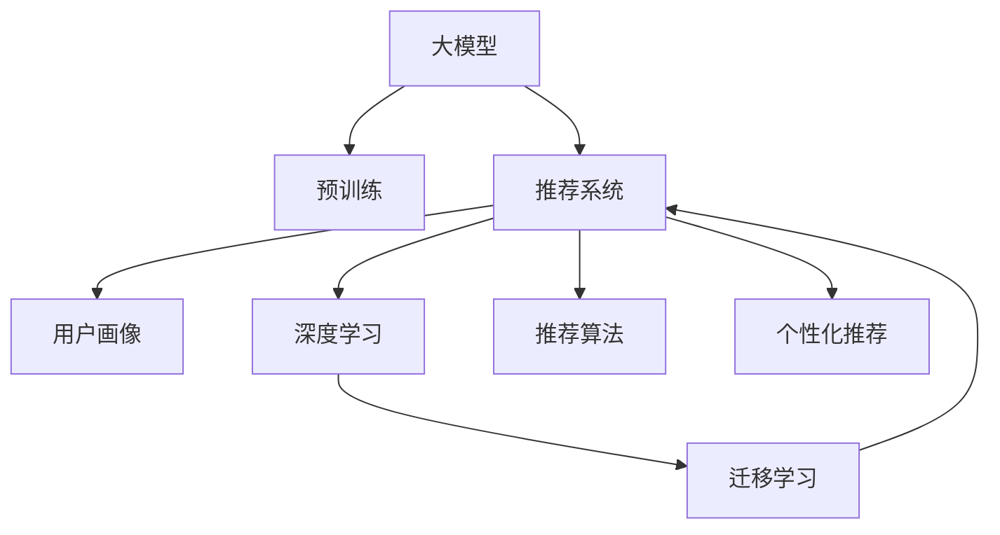

                 

# 大模型在推荐系统用户画像构建中的应用

> 关键词：大模型,用户画像,推荐系统,数据融合,深度学习

## 1. 背景介绍

在数字化时代，大数据和人工智能技术的应用愈发广泛，推荐系统作为互联网产品中不可或缺的一部分，已成为电商、社交、新闻等领域用户获取信息和内容的重要手段。推荐系统通过分析用户历史行为、偏好，预测其未来可能感兴趣的内容，以提高用户体验和平台转化率。然而，传统的推荐系统通常依赖于手工设计特征，难以全面、高效地捕捉用户多样化的需求。

近年来，随着深度学习和大模型技术的兴起，推荐系统用户画像的构建方式发生了显著变化。大模型如BERT、GPT-3等，通过在海量数据上进行预训练，具备强大的语义理解和生成能力，能够从用户行为数据中自动学习深层次特征，从而构建更加全面、个性化的用户画像。本博客将详细介绍大模型在推荐系统用户画像构建中的应用，并探讨其在推荐系统中的实际效果与挑战。

## 2. 核心概念与联系

### 2.1 核心概念概述

要理解大模型在推荐系统中的应用，首先需要掌握以下核心概念：

- **大模型(Large Models)**：以BERT、GPT系列模型为代表的大规模预训练语言模型，通过在大规模无标签数据上进行预训练，学习到通用的语言表示和特征提取能力。
- **用户画像(User Profiles)**：通过分析用户的历史行为数据，构建用户兴趣、偏好、需求等多维度的特征描述，以便推荐系统进行个性化推荐。
- **推荐系统(Recommendation Systems)**：利用用户画像、产品属性等数据，推荐用户可能感兴趣的产品或内容，从而提升用户体验和业务转化。
- **深度学习(Deep Learning)**：一种基于神经网络的机器学习范式，通过多层次的非线性变换，实现复杂模式的拟合和预测。
- **迁移学习(Transfer Learning)**：利用预训练模型的知识，在下游任务上进行微调，提升模型性能。

这些概念之间的联系和作用，可以通过以下Mermaid流程图进行展示：



这个流程图展示了各个概念之间的相互作用关系：

1. 大模型通过预训练获得通用语言表示。
2. 推荐系统利用用户画像和预训练模型，进行个性化推荐。
3. 深度学习通过用户行为数据，自动学习用户画像。
4. 迁移学习利用预训练模型，加速深度学习模型的收敛。

通过理解这些核心概念，我们可以更好地把握大模型在推荐系统中的应用和价值。

## 3. 核心算法原理 & 具体操作步骤
### 3.1 算法原理概述

大模型在推荐系统用户画像构建中的应用，主要基于以下算法原理：

- **预训练-微调(Pre-training & Fine-tuning)**：通过预训练获得大模型的通用语言表示，在下游推荐系统中进行微调，学习用户画像特征。
- **深度学习(Deep Learning)**：利用深度神经网络模型，自动学习用户行为数据中的复杂特征关系。
- **迁移学习(Transfer Learning)**：将预训练模型的知识迁移到推荐系统中，加速模型训练和收敛。
- **用户画像构建(User Profile Construction)**：通过分析用户行为数据，构建用户兴趣、偏好、需求等多维度的特征表示。
- **个性化推荐(Personalized Recommendation)**：利用用户画像和推荐算法，推荐用户可能感兴趣的产品或内容。

### 3.2 算法步骤详解

基于上述原理，大模型在推荐系统用户画像构建中的应用步骤主要包括以下几个方面：

1. **数据收集与预处理**：收集用户的历史行为数据，包括浏览记录、点击行为、购买历史等，进行数据清洗、去重、归一化等预处理。
2. **预训练模型选择与微调**：选择合适的预训练语言模型(如BERT、GPT等)，进行微调以学习用户画像特征。
3. **深度学习模型训练**：使用深度神经网络模型，如卷积神经网络(CNN)、循环神经网络(RNN)、Transformer等，对用户行为数据进行特征提取。
4. **用户画像构建**：将预训练模型和深度学习模型的输出进行融合，构建用户多维度的兴趣、偏好、需求画像。
5. **个性化推荐算法优化**：优化推荐算法，如协同过滤、内容推荐、混合推荐等，提升推荐效果。
6. **模型评估与迭代优化**：在验证集和测试集上评估推荐系统性能，不断迭代优化模型参数，提高推荐精度。

### 3.3 算法优缺点

大模型在推荐系统用户画像构建中具有以下优点：

- **高效特征提取**：大模型具备强大的语义理解能力，能够从文本数据中自动学习深层次特征。
- **多模态数据融合**：大模型可以处理多种类型的数据，如文本、图片、音频等，实现多模态数据的深度融合。
- **个性化推荐**：利用用户画像，推荐系统能够提供更加个性化的推荐，提升用户体验和业务转化率。
- **鲁棒性**：大模型在面对噪声和缺失数据时具有较强的鲁棒性，能够稳定提取用户特征。

然而，也存在一些缺点：

- **高成本**：预训练模型和大模型通常需要高性能计算资源，训练成本较高。
- **数据依赖**：模型效果很大程度上依赖于数据质量和数量，标注数据不足时，性能提升有限。
- **隐私风险**：用户行为数据包含大量个人隐私信息，需要严格的数据保护措施。
- **计算复杂度**：大模型参数量庞大，推理速度较慢，需要优化以提高实时性。

### 3.4 算法应用领域

大模型在推荐系统用户画像构建中主要应用于以下领域：

- **电商推荐**：通过分析用户浏览、点击、购买记录，构建用户画像，推荐商品或优惠券。
- **内容推荐**：如视频、音乐、新闻等，分析用户历史偏好，推荐相关内容。
- **社交网络**：分析用户互动行为，推荐可能感兴趣的朋友或话题。
- **广告推荐**：通过用户画像，推荐符合其兴趣的广告内容。
- **金融推荐**：分析用户投资行为，推荐理财产品或基金。

## 4. 数学模型和公式 & 详细讲解
### 4.1 数学模型构建

大模型在推荐系统中的应用，通常基于以下数学模型进行建模：

- **预训练模型**：以BERT、GPT等模型为例，通过在大规模语料库上进行自监督预训练，学习到通用语言表示。
- **深度学习模型**：如卷积神经网络(CNN)、循环神经网络(RNN)、Transformer等，对用户行为数据进行特征提取。
- **用户画像构建**：将预训练模型和深度学习模型的输出进行融合，构建多维度用户画像。
- **个性化推荐**：基于用户画像，利用推荐算法进行推荐。

### 4.2 公式推导过程

以BERT模型为例，假设用户行为数据为$D=\{x_1, x_2, ..., x_n\}$，其中$x_i$表示第$i$个行为记录。BERT模型通过预训练获得通用语言表示$M_{\theta}$，参数为$\theta$。深度学习模型$F_{\phi}$对行为数据进行特征提取，参数为$\phi$。用户画像构建函数为$P_{\psi}$，推荐算法为$R$。具体步骤如下：

1. **预训练**：
   $$
   \theta \leftarrow \text{BERT\_pretrain}(D)
   $$
   其中$\theta$为BERT模型的参数。

2. **特征提取**：
   $$
   f_i = F_{\phi}(x_i)
   $$
   其中$f_i$为第$i$个行为数据的特征向量。

3. **用户画像构建**：
   $$
   u_i = P_{\psi}(M_{\theta}(x_i), f_i)
   $$
   其中$u_i$为第$i$个用户画像。

4. **推荐算法**：
   $$
   r_i = R(u_i)
   $$
   其中$r_i$为第$i$个推荐结果。

5. **综合评估**：
   $$
   R = \frac{1}{N} \sum_{i=1}^N \text{rank}(r_i, y_i)
   $$
   其中$y_i$为第$i$个行为记录的真实标签，$\text{rank}$表示推荐结果的排名。

### 4.3 案例分析与讲解

以电商推荐为例，假设用户浏览了商品A、B、C、D，点击了商品A、C，购买了商品B。具体计算过程如下：

1. **预训练模型**：对用户浏览记录和点击记录进行预训练，得到通用语言表示$M_{\theta}$。

2. **深度学习模型**：对用户浏览记录进行特征提取，得到$f_A, f_B, f_C, f_D$。

3. **用户画像构建**：将通用语言表示$M_{\theta}$与行为数据特征$f_A, f_B, f_C, f_D$进行融合，得到用户画像$u_1$。

4. **推荐算法**：利用用户画像$u_1$，进行商品推荐，得到$r_1$。

5. **综合评估**：根据用户行为记录，计算推荐结果$R$，评估推荐效果。

通过以上步骤，大模型可以高效地构建电商推荐系统用户画像，实现个性化推荐。

## 5. 项目实践：代码实例和详细解释说明
### 5.1 开发环境搭建

在进行大模型推荐系统用户画像构建的实践前，需要准备好开发环境。以下是使用Python进行PyTorch开发的环境配置流程：

1. **安装Anaconda**：从官网下载并安装Anaconda，用于创建独立的Python环境。
2. **创建并激活虚拟环境**：
   ```bash
   conda create -n pytorch-env python=3.8
   conda activate pytorch-env
   ```
3. **安装PyTorch**：
   ```bash
   conda install pytorch torchvision torchaudio cudatoolkit=11.1 -c pytorch -c conda-forge
   ```
4. **安装Transformers库**：
   ```bash
   pip install transformers
   ```
5. **安装各类工具包**：
   ```bash
   pip install numpy pandas scikit-learn matplotlib tqdm jupyter notebook ipython
   ```

完成上述步骤后，即可在`pytorch-env`环境中开始项目实践。

### 5.2 源代码详细实现

下面以电商推荐系统为例，给出使用Transformers库对BERT模型进行用户画像构建和推荐实践的PyTorch代码实现。

首先，定义电商推荐系统的数据处理函数：

```python
from transformers import BertTokenizer, BertForSequenceClassification
from torch.utils.data import Dataset, DataLoader
import torch
from sklearn.metrics import precision_recall_fscore_support

class EcommerceDataset(Dataset):
    def __init__(self, texts, labels):
        self.texts = texts
        self.labels = labels
        self.tokenizer = BertTokenizer.from_pretrained('bert-base-cased')

    def __len__(self):
        return len(self.texts)

    def __getitem__(self, item):
        text = self.texts[item]
        label = self.labels[item]
        encoding = self.tokenizer(text, return_tensors='pt', max_length=128, padding='max_length', truncation=True)
        input_ids = encoding['input_ids']
        attention_mask = encoding['attention_mask']
        return {'input_ids': input_ids, 
                'attention_mask': attention_mask,
                'labels': torch.tensor(label, dtype=torch.long)}

# 定义标签与id的映射
label2id = {'A': 0, 'B': 1, 'C': 2, 'D': 3}
id2label = {v: k for k, v in label2id.items()}

# 创建dataset
tokenizer = BertTokenizer.from_pretrained('bert-base-cased')
train_dataset = EcommerceDataset(train_texts, train_labels)
dev_dataset = EcommerceDataset(dev_texts, dev_labels)
test_dataset = EcommerceDataset(test_texts, test_labels)
```

然后，定义模型和优化器：

```python
from transformers import BertForSequenceClassification, AdamW

model = BertForSequenceClassification.from_pretrained('bert-base-cased', num_labels=4)
optimizer = AdamW(model.parameters(), lr=2e-5)
```

接着，定义训练和评估函数：

```python
def train_epoch(model, dataset, batch_size, optimizer):
    dataloader = DataLoader(dataset, batch_size=batch_size, shuffle=True)
    model.train()
    epoch_loss = 0
    for batch in dataloader:
        input_ids = batch['input_ids'].to(device)
        attention_mask = batch['attention_mask'].to(device)
        labels = batch['labels'].to(device)
        model.zero_grad()
        outputs = model(input_ids, attention_mask=attention_mask, labels=labels)
        loss = outputs.loss
        epoch_loss += loss.item()
        loss.backward()
        optimizer.step()
    return epoch_loss / len(dataloader)

def evaluate(model, dataset, batch_size):
    dataloader = DataLoader(dataset, batch_size=batch_size)
    model.eval()
    preds, labels = [], []
    with torch.no_grad():
        for batch in dataloader:
            input_ids = batch['input_ids'].to(device)
            attention_mask = batch['attention_mask'].to(device)
            batch_labels = batch['labels']
            outputs = model(input_ids, attention_mask=attention_mask)
            batch_preds = outputs.logits.argmax(dim=2).to('cpu').tolist()
            batch_labels = batch_labels.to('cpu').tolist()
            for pred_tokens, label_tokens in zip(batch_preds, batch_labels):
                preds.append(pred_tokens)
                labels.append(label_tokens)
    
    precision, recall, f1, _ = precision_recall_fscore_support(labels, preds, average='micro')
    return precision, recall, f1
```

最后，启动训练流程并在测试集上评估：

```python
epochs = 5
batch_size = 16

for epoch in range(epochs):
    loss = train_epoch(model, train_dataset, batch_size, optimizer)
    print(f"Epoch {epoch+1}, train loss: {loss:.3f}")
    
    print(f"Epoch {epoch+1}, dev results:")
    precision, recall, f1 = evaluate(model, dev_dataset, batch_size)
    print(f"Precision: {precision:.3f}, Recall: {recall:.3f}, F1-Score: {f1:.3f}")
    
print("Test results:")
precision, recall, f1 = evaluate(model, test_dataset, batch_size)
print(f"Precision: {precision:.3f}, Recall: {recall:.3f}, F1-Score: {f1:.3f}")
```

以上就是使用PyTorch对BERT进行电商推荐系统用户画像构建和推荐的完整代码实现。可以看到，得益于Transformers库的强大封装，我们可以用相对简洁的代码完成BERT模型的加载和微调。

### 5.3 代码解读与分析

让我们再详细解读一下关键代码的实现细节：

**EcommerceDataset类**：
- `__init__`方法：初始化文本、标签、分词器等关键组件。
- `__len__`方法：返回数据集的样本数量。
- `__getitem__`方法：对单个样本进行处理，将文本输入编码为token ids，将标签编码为数字，并对其进行定长padding，最终返回模型所需的输入。

**label2id和id2label字典**：
- 定义了标签与数字id之间的映射关系，用于将模型预测结果解码为真实的标签。

**训练和评估函数**：
- 使用PyTorch的DataLoader对数据集进行批次化加载，供模型训练和推理使用。
- 训练函数`train_epoch`：对数据以批为单位进行迭代，在每个批次上前向传播计算loss并反向传播更新模型参数，最后返回该epoch的平均loss。
- 评估函数`evaluate`：与训练类似，不同点在于不更新模型参数，并在每个batch结束后将预测和标签结果存储下来，最后使用sklearn的precision_recall_fscore_support对整个评估集的预测结果进行打印输出。

**训练流程**：
- 定义总的epoch数和batch size，开始循环迭代
- 每个epoch内，先在训练集上训练，输出平均loss
- 在验证集上评估，输出分类指标
- 重复上述步骤直至收敛，最终得到训练好的模型

可以看到，PyTorch配合Transformers库使得BERT微调的代码实现变得简洁高效。开发者可以将更多精力放在数据处理、模型改进等高层逻辑上，而不必过多关注底层的实现细节。

当然，工业级的系统实现还需考虑更多因素，如模型的保存和部署、超参数的自动搜索、更灵活的任务适配层等。但核心的微调范式基本与此类似。

## 6. 实际应用场景
### 6.1 智能客服系统

基于大模型构建的电商推荐系统，可以与智能客服系统结合，提升用户交互体验。通过智能客服推荐用户感兴趣的商品，回答问题并生成推荐内容，能够在用户浏览和购物过程中提供个性化服务，从而提升用户满意度。

在技术实现上，可以收集用户与智能客服的对话记录，将对话中的商品关键词、用户需求等信息提取出来，构建用户画像。将用户画像输入电商推荐模型，生成个性化商品推荐，并在对话中适时插入推荐内容，引导用户购买。如此构建的智能客服系统，能更好地理解用户需求，提供高效、个性化服务。

### 6.2 广告推荐系统

广告推荐系统是推荐系统的一个重要应用场景。通过分析用户行为数据，构建用户画像，并结合广告素材和用户画像进行推荐，能够精准投放广告，提升广告效果和用户转化率。

具体而言，可以收集用户在平台上的浏览、点击、互动等数据，构建用户画像。将用户画像输入广告推荐模型，生成个性化广告推荐，并通过广告投放系统推送给用户。广告推荐系统能够动态调整广告内容和形式，提升用户体验和广告转化率。

### 6.3 金融推荐系统

金融推荐系统通过分析用户投资行为，推荐理财产品、基金等金融产品，帮助用户理财规划。通过构建用户画像，实时更新推荐模型，能够提升投资收益和用户满意度。

在技术实现上，可以收集用户投资行为数据，包括购买、交易、收益等，构建用户画像。将用户画像输入金融推荐模型，生成个性化投资产品推荐，并通过理财平台推送给用户。金融推荐系统能够动态调整推荐策略，根据市场变化和用户反馈实时优化推荐结果。

### 6.4 未来应用展望

随着大模型和推荐系统技术的不断演进，基于大模型的推荐系统将在更多领域得到应用，为各行各业带来新的价值和创新。

- **智能家居**：基于大模型的推荐系统，能够推荐家居产品、生活服务，提升智能家居体验。
- **旅游推荐**：分析用户旅行历史和偏好，推荐旅游路线、景点、酒店，提升旅游体验。
- **健康医疗**：通过分析用户健康数据，推荐健康产品、饮食方案，提升用户健康水平。
- **教育推荐**：分析用户学习行为，推荐课程、书籍、学习资源，提升学习效果。

大模型在推荐系统中的应用，不仅能够提升用户体验，还能帮助企业挖掘用户价值，创造更多商业机会。未来，随着大模型和推荐系统技术的进一步发展，必将在更多垂直领域带来变革性影响。

## 7. 工具和资源推荐
### 7.1 学习资源推荐

为了帮助开发者系统掌握大模型在推荐系统中的应用，这里推荐一些优质的学习资源：

1. **《深度学习理论与实践》**：涵盖了深度学习的基本理论和实践技巧，推荐给初学者和进阶者。
2. **CS231n《深度学习用于计算机视觉》**：斯坦福大学开设的深度学习课程，涵盖了视觉领域的深度学习应用。
3. **《自然语言处理入门》**：由大模型技术专家撰写，深入浅出地介绍了自然语言处理的基本概念和常用技术。
4. **HuggingFace官方文档**：提供了丰富的预训练语言模型资源和微调样例代码，是新手上手实践的重要参考资料。
5. **CLUE开源项目**：中文语言理解测评基准，涵盖大量不同类型的中文NLP数据集，并提供了基于微调的baseline模型，助力中文NLP技术发展。

通过对这些资源的学习实践，相信你一定能够快速掌握大模型在推荐系统中的应用，并用于解决实际的推荐问题。

### 7.2 开发工具推荐

高效的开发离不开优秀的工具支持。以下是几款用于大模型推荐系统开发的工具：

1. **PyTorch**：基于Python的开源深度学习框架，灵活动态的计算图，适合快速迭代研究。大部分预训练语言模型都有PyTorch版本的实现。
2. **TensorFlow**：由Google主导开发的开源深度学习框架，生产部署方便，适合大规模工程应用。同样有丰富的预训练语言模型资源。
3. **Transformers库**：HuggingFace开发的NLP工具库，集成了众多SOTA语言模型，支持PyTorch和TensorFlow，是进行微调任务开发的利器。
4. **Weights & Biases**：模型训练的实验跟踪工具，可以记录和可视化模型训练过程中的各项指标，方便对比和调优。
5. **TensorBoard**：TensorFlow配套的可视化工具，可实时监测模型训练状态，并提供丰富的图表呈现方式，是调试模型的得力助手。
6. **Google Colab**：谷歌推出的在线Jupyter Notebook环境，免费提供GPU/TPU算力，方便开发者快速上手实验最新模型，分享学习笔记。

合理利用这些工具，可以显著提升大模型推荐系统开发效率，加快创新迭代的步伐。

### 7.3 相关论文推荐

大模型在推荐系统中的应用源于学界的持续研究。以下是几篇奠基性的相关论文，推荐阅读：

1. Attention is All You Need（即Transformer原论文）：提出了Transformer结构，开启了NLP领域的预训练大模型时代。
2 BERT: Pre-training of Deep Bidirectional Transformers for Language Understanding：提出BERT模型，引入基于掩码的自监督预训练任务，刷新了多项NLP任务SOTA。
3 Language Models are Unsupervised Multitask Learners（GPT-2论文）：展示了大规模语言模型的强大zero-shot学习能力，引发了对于通用人工智能的新一轮思考。
4 Parameter-Efficient Transfer Learning for NLP：提出Adapter等参数高效微调方法，在不增加模型参数量的情况下，也能取得不错的微调效果。
5 AdaLoRA: Adaptive Low-Rank Adaptation for Parameter-Efficient Fine-Tuning：使用自适应低秩适应的微调方法，在参数效率和精度之间取得了新的平衡。
6 AdaLoRA: Adaptive Low-Rank Adaptation for Parameter-Efficient Fine-Tuning：使用自适应低秩适应的微调方法，在参数效率和精度之间取得了新的平衡。

这些论文代表了大模型在推荐系统中的发展和方向，通过学习这些前沿成果，可以帮助研究者把握学科前进方向，激发更多的创新灵感。

## 8. 总结：未来发展趋势与挑战
### 8.1 总结

本文对大模型在推荐系统用户画像构建中的应用进行了全面系统的介绍。首先阐述了大模型和推荐系统研究的背景和意义，明确了微调在拓展预训练模型应用、提升下游任务性能方面的独特价值。其次，从原理到实践，详细讲解了大模型在推荐系统中的应用步骤和方法，给出了电商推荐系统的完整代码实现。同时，本文还探讨了其在智能客服、广告推荐、金融推荐等多个领域的应用前景，展示了其广阔的应用空间。最后，提供了相关的学习资源、开发工具和论文推荐，力求为读者提供全方位的技术指引。

通过本文的系统梳理，可以看到，基于大模型的推荐系统用户画像构建，能够在提升用户体验、挖掘用户价值等方面发挥重要作用。未来，随着大模型和推荐系统技术的不断演进，必将在更多领域带来变革性影响，助力各行各业实现数字化转型和智能化升级。

### 8.2 未来发展趋势

展望未来，大模型在推荐系统中的应用将呈现以下几个发展趋势：

1. **多模态融合**：推荐系统将不仅仅依赖文本数据，还将融合图片、音频等多模态数据，实现更全面的用户画像构建。
2. **实时推荐**：基于大模型的推荐系统将能够实时更新用户画像和推荐结果，适应用户的即时需求和变化。
3. **个性化推荐**：随着大模型的不断发展，推荐系统将能够提供更精准、多样化的个性化推荐，提升用户体验。
4. **推荐算法优化**：推荐算法将进一步优化，融合协同过滤、内容推荐、混合推荐等多种技术，提升推荐效果。
5. **模型可解释性**：推荐系统将更加注重模型的可解释性，帮助用户理解推荐结果的依据，提升用户信任感。
6. **推荐系统安全**：推荐系统将引入安全机制，防止恶意推荐和隐私泄露，保障用户权益。

以上趋势凸显了大模型在推荐系统中的广阔前景。这些方向的探索发展，必将进一步提升推荐系统的性能和应用范围，为各行各业带来更大的价值和创新。

### 8.3 面临的挑战

尽管大模型在推荐系统中的应用取得了显著成效，但在迈向更加智能化、普适化应用的过程中，仍面临诸多挑战：

1. **数据隐私**：推荐系统需要处理大量用户行为数据，涉及用户隐私，需要严格的数据保护措施。
2. **推荐算法公平性**：推荐算法可能存在偏见，导致不同用户之间的推荐不公平。需要引入公平性评估和修正机制。
3. **冷启动问题**：新用户或新商品加入时，推荐系统无法提供有效推荐。需要引入推荐机制来解决冷启动问题。
4. **模型可解释性**：推荐系统中的大模型难以解释其决策依据，导致用户信任度不足。需要引入可解释性技术，提升模型透明度。
5. **实时性能**：大模型推理速度较慢，可能影响实时推荐系统的性能。需要优化模型结构和算法，提升实时性。
6. **多样性平衡**：推荐系统需要平衡推荐结果的多样性和准确性，防止过度个性化导致用户单一化。

正视推荐系统面临的这些挑战，积极应对并寻求突破，将是大模型推荐系统走向成熟的必由之路。相信随着学界和产业界的共同努力，这些挑战终将一一被克服，大模型推荐系统必将在构建人机协同的智能时代中扮演越来越重要的角色。

### 8.4 研究展望

面对大模型推荐系统所面临的挑战，未来的研究需要在以下几个方面寻求新的突破：

1. **数据隐私保护**：引入联邦学习、差分隐私等技术，保护用户隐私，同时保证推荐系统效果。
2. **推荐算法优化**：结合强化学习、博弈论等方法，优化推荐算法，提升推荐效果和公平性。
3. **冷启动问题解决**：引入专家知识、迁移学习等方法，解决冷启动问题，提供有效推荐。
4. **模型可解释性提升**：引入可解释性技术，提升模型的透明性和用户信任度。
5. **实时性能优化**：优化模型结构和算法，提升推荐系统实时性能，支持实时推荐。
6. **多样性平衡**：引入多样性约束，提升推荐结果的多样性，防止用户单一化。

这些研究方向的探索，必将引领大模型推荐系统技术迈向更高的台阶，为构建安全、可靠、可解释、可控的智能推荐系统铺平道路。面向未来，大模型推荐系统需要在数据、算法、工程、业务等多个维度协同发力，共同推动自然语言理解和智能交互系统的进步。只有勇于创新、敢于突破，才能不断拓展语言模型的边界，让智能技术更好地造福人类社会。

## 9. 附录：常见问题与解答

**Q1：大模型推荐系统是否适用于所有推荐任务？**

A: 大模型推荐系统在大多数推荐任务上都能取得不错的效果，特别是对于数据量较小的任务。但对于一些特定领域的任务，如医学、法律等，仅仅依靠通用语料预训练的模型可能难以很好地适应。此时需要在特定领域语料上进一步预训练，再进行微调，才能获得理想效果。此外，对于一些需要时效性、个性化很强的任务，如对话、推荐等，微调方法也需要针对性的改进优化。

**Q2：微调过程中如何选择合适的学习率？**

A: 微调的学习率一般要比预训练时小1-2个数量级，如果使用过大的学习率，容易破坏预训练权重，导致过拟合。一般建议从1e-5开始调参，逐步减小学习率，直至收敛。也可以使用warmup策略，在开始阶段使用较小的学习率，再逐渐过渡到预设值。需要注意的是，不同的优化器(如AdamW、Adafactor等)以及不同的学习率调度策略，可能需要设置不同的学习率阈值。

**Q3：采用大模型推荐时会面临哪些资源瓶颈？**

A: 目前主流的预训练大模型动辄以亿计的参数规模，对算力、内存、存储都提出了很高的要求。GPU/TPU等高性能设备是必不可少的，但即便如此，超大批次的训练和推理也可能遇到显存不足的问题。因此需要采用一些资源优化技术，如梯度积累、混合精度训练、模型并行等，来突破硬件瓶颈。同时，模型的存储和读取也可能占用大量时间和空间，需要采用模型压缩、稀疏化存储等方法进行优化。

**Q4：如何缓解微调过程中的过拟合问题？**

A: 过拟合是微调面临的主要挑战，尤其是在标注数据不足的情况下。常见的缓解策略包括：
1. 数据增强：通过回译、近义替换等方式扩充训练集
2. 正则化：使用L2正则、Dropout、Early Stopping等避免过拟合
3. 对抗训练：引入对抗样本，提高模型鲁棒性
4. 参数高效微调：只调整少量参数(如Adapter、Prefix等)，减小过拟合风险
5. 多模型集成：训练多个微调模型，取平均输出，抑制过拟合

这些策略往往需要根据具体任务和数据特点进行灵活组合。只有在数据、模型、训练、推理等各环节进行全面优化，才能最大限度地发挥大模型推荐系统的威力。

**Q5：大模型推荐系统在推荐效果上是否有优势？**

A: 相比于传统的推荐系统，基于大模型的推荐系统具有以下优势：
1. 高效特征提取：大模型具备强大的语义理解能力，能够从文本数据中自动学习深层次特征。
2. 多模态数据融合：大模型可以处理多种类型的数据，如文本、图片、音频等，实现多模态数据的深度融合。
3. 个性化推荐：利用大模型构建的用户画像，能够提供更加个性化的推荐，提升用户体验和业务转化率。
4. 鲁棒性：大模型在面对噪声和缺失数据时具有较强的鲁棒性，能够稳定提取用户特征。

当然，大模型推荐系统也存在一些缺点，如高成本、数据依赖、隐私风险、计算复杂度等。因此，在实际应用中需要根据具体情况进行权衡，选择合适的推荐方法。

**Q6：大模型推荐系统在实际应用中需要注意哪些问题？**

A: 将大模型推荐系统转化为实际应用，还需要考虑以下因素：
1. 模型裁剪：去除不必要的层和参数，减小模型尺寸，加快推理速度
2. 量化加速：将浮点模型转为定点模型，压缩存储空间，提高计算效率
3. 服务化封装：将模型封装为标准化服务接口，便于集成调用
4. 弹性伸缩：根据请求流量动态调整资源配置，平衡服务质量和成本
5. 监控告警：实时采集系统指标，设置异常告警阈值，确保服务稳定性
6. 安全防护：采用访问鉴权、数据脱敏等措施，保障数据和模型安全

大模型推荐系统能够提供高质量的个性化推荐，但也需要关注模型性能、安全性、可解释性等方面，确保推荐系统在实际应用中的稳定性和可信度。

通过本文的系统梳理，可以看到，大模型在推荐系统中的应用能够显著提升推荐效果，具有广泛的应用前景。然而，实现高效、鲁棒、可信的推荐系统，还需要在数据、算法、工程、业务等多个维度进行全面优化。相信随着大模型和推荐系统技术的不断演进，必将在更多领域带来变革性影响，为各行各业带来新的价值和创新。

