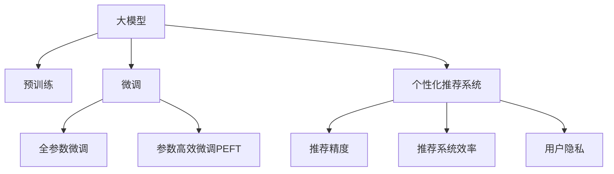

                 

# 大模型在电商平台个性化营销中的应用

## 1. 背景介绍

### 1.1 问题由来

随着电商平台的兴起，如何通过精准的个性化营销，提升用户购买转化率和忠诚度，成为了各大电商平台争相探索的重要课题。传统的电商平台个性化推荐，多基于基于用户历史行为数据或简单统计特征进行推荐。然而，随着用户行为日益复杂化、商品种类日益多样化，传统的个性化推荐方法在推荐精度和效果上都难以满足用户需求。

大模型的出现，为电商平台个性化推荐提供了新的解决方向。通过在大规模语料上进行预训练，大模型如BERT、GPT等能够学习到丰富的语言知识，具备强大的语言理解和生成能力。将大模型应用于电商平台个性化营销，可以大幅提升推荐系统的精度和效果。

### 1.2 问题核心关键点

使用大模型进行电商平台个性化推荐，关键点在于如何利用大模型的语言知识，将用户输入的文本信息转化为高精度的个性化推荐结果。具体而言，需要解决以下问题：

1. 如何高效地提取用户输入文本中的语义信息。
2. 如何将提取出的语义信息转化为个性化推荐结果。
3. 如何动态更新大模型参数，以适应用户偏好的变化。
4. 如何平衡个性化推荐和推荐系统效率的关系。
5. 如何保护用户隐私，确保个性化推荐的安全性。

### 1.3 问题研究意义

大模型在电商平台个性化营销中的应用，具有重要意义：

1. 提升推荐系统效果。通过利用大模型的语言知识，可以提高推荐系统的推荐精度和召回率，大幅提升用户的购物体验。
2. 拓展推荐系统应用范围。大模型可以处理更加多样化的用户输入形式，如自然语言文本、图像等，拓展了推荐系统的应用范围。
3. 加速业务创新。大模型能够快速响应用户需求变化，辅助电商平台在商品、价格、广告等方面进行快速迭代和创新。
4. 增强用户粘性。个性化推荐使得用户购物体验更个性化，提升用户对平台的粘性，提高用户留存率。
5. 带来技术突破。大模型技术的发展，为推荐系统带来了新的突破，催生了更多前沿研究方向。

## 2. 核心概念与联系

### 2.1 核心概念概述

为更好地理解大模型在电商平台个性化推荐中的应用，本节将介绍几个密切相关的核心概念：

- 大模型(Large Model)：指基于大规模语料进行预训练的深度学习模型，如BERT、GPT等。这些模型通过学习语言的深度表示，具备强大的语言理解和生成能力。
- 预训练(Pre-training)：指在大规模无标签文本数据上进行自监督学习，学习语言的通用表示。预训练使得模型具备较强的泛化能力。
- 微调(Fine-tuning)：指在预训练模型的基础上，使用下游任务的少量标注数据，通过有监督地训练来优化模型在该任务上的性能。
- 个性化推荐系统(Recommendation System)：根据用户的历史行为数据和当前输入，为用户推荐最相关的商品、内容或服务，提高用户满意度和转化率。
- 推荐精度(Recommendation Accuracy)：指推荐系统推荐的商品或服务与用户实际需求的匹配程度，是评估推荐系统效果的重要指标。
- 推荐系统效率(Recommendation Efficiency)：指推荐系统在生成推荐结果时所需的计算资源和时间，是评估推荐系统性能的另一重要指标。
- 用户隐私(User Privacy)：指在推荐过程中，如何保护用户的个人信息和行为数据，防止信息泄露和滥用。

这些核心概念之间的逻辑关系可以通过以下Mermaid流程图来展示：



这个流程图展示了大模型的核心概念及其之间的关系：

1. 大模型通过预训练获得基础能力。
2. 微调是对预训练模型进行任务特定的优化，以适应电商平台的个性化推荐任务。
3. 推荐精度和效率是衡量个性化推荐系统性能的关键指标。
4. 用户隐私是推荐系统需要关注的伦理问题。

这些概念共同构成了大模型在电商平台个性化推荐中的应用框架，使得电商平台能够更好地理解用户需求，提供精准的个性化推荐服务。

## 3. 核心算法原理 & 具体操作步骤

### 3.1 算法原理概述

基于大模型的电商平台个性化推荐，本质上是一个多任务学习过程。其核心思想是：将大模型视作一个强大的"特征提取器"，通过在电商平台上标注的少量用户行为数据上进行有监督的微调，使得模型能够理解用户输入的文本信息，并生成个性化的推荐结果。

形式化地，假设电商平台上的用户输入为 $x$，输出为推荐结果 $y$，其中 $x$ 可以是自然语言文本、图片等形式。定义模型的预测概率为 $p(y|x)$，则在标注数据集 $D$ 上的经验风险为：

$$
\mathcal{L}(p,y) = -\sum_{i=1}^N y_i\log p(y_i|x_i)
$$

其中 $N$ 为训练样本数，$x_i$ 和 $y_i$ 分别为第 $i$ 个样本的输入和标签。微调的优化目标是最小化经验风险，即找到最优的概率分布 $p$：

$$
p^* = \mathop{\arg\min}_{p} \mathcal{L}(p,y)
$$

在实践中，我们通常使用基于梯度的优化算法（如Adam、SGD等）来近似求解上述最优化问题。设 $\eta$ 为学习率，$\nabla_{p}\mathcal{L}(p)$ 为损失函数对模型概率分布的梯度，则参数的更新公式为：

$$
p \leftarrow p - \eta \nabla_{p}\mathcal{L}(p)
$$

其中 $\nabla_{p}\mathcal{L}(p)$ 可进一步通过反向传播算法计算得到。

### 3.2 算法步骤详解

基于大模型的电商平台个性化推荐一般包括以下几个关键步骤：

**Step 1: 准备预训练模型和数据集**
- 选择合适的预训练语言模型 $M_{\theta}$ 作为初始化参数，如BERT、GPT等。
- 准备电商平台上的用户行为数据集 $D$，划分为训练集、验证集和测试集。一般要求标注数据与电商数据的分布不要差异过大。

**Step 2: 添加任务适配层**
- 根据电商平台上的推荐任务，在预训练模型顶层设计合适的输出层和损失函数。
- 对于电商推荐任务，通常使用交叉熵损失，即将用户行为数据转化为二分类问题，输出概率。
- 对于图像推荐任务，可以采用多分类损失，将用户对不同图片的点击行为转化为概率。

**Step 3: 设置微调超参数**
- 选择合适的优化算法及其参数，如 Adam、SGD 等，设置学习率、批大小、迭代轮数等。
- 设置正则化技术及强度，包括权重衰减、Dropout、Early Stopping 等。
- 确定冻结预训练参数的策略，如仅微调顶层，或全部参数都参与微调。

**Step 4: 执行梯度训练**
- 将训练集数据分批次输入模型，前向传播计算损失函数。
- 反向传播计算参数梯度，根据设定的优化算法和学习率更新模型参数。
- 周期性在验证集上评估模型性能，根据性能指标决定是否触发 Early Stopping。
- 重复上述步骤直到满足预设的迭代轮数或 Early Stopping 条件。

**Step 5: 测试和部署**
- 在测试集上评估微调后模型 $p$ 的性能，对比微调前后的推荐精度提升。
- 使用微调后的模型对新样本进行推理预测，集成到实际的应用系统中。
- 持续收集新的用户行为数据，定期重新微调模型，以适应用户偏好的变化。

以上是基于大模型在电商平台个性化推荐的一般流程。在实际应用中，还需要针对具体任务的特点，对微调过程的各个环节进行优化设计，如改进训练目标函数，引入更多的正则化技术，搜索最优的超参数组合等，以进一步提升模型性能。

### 3.3 算法优缺点

基于大模型的电商平台个性化推荐方法具有以下优点：
1. 提升推荐精度。利用大模型的语言知识，可以更准确地理解用户输入，提高推荐系统的推荐精度。
2. 拓展推荐应用场景。大模型可以处理文本、图片等多种数据形式，拓展了推荐系统的应用范围。
3. 提高模型效率。大模型通常使用高效的优化算法，可以加快训练和推理的速度。
4. 具备良好的泛化能力。大模型通过预训练学习到丰富的语言知识，可以更好地泛化到不同的电商场景。

同时，该方法也存在一定的局限性：
1. 数据量要求高。使用大模型进行个性化推荐，需要大量的标注数据进行微调，对于标注成本较高的电商场景，难以满足。
2. 模型复杂度高。大模型的参数量巨大，对算力和存储要求较高，容易带来性能瓶颈。
3. 用户隐私问题。电商平台收集用户数据，可能面临隐私泄露和滥用的风险。

尽管存在这些局限性，但就目前而言，基于大模型的推荐方法仍是在线推荐系统的热门范式。未来相关研究的重点在于如何进一步降低对标注数据的依赖，提高推荐系统的泛化能力和效率，同时兼顾用户隐私保护，确保推荐系统的可控性和安全性。

### 3.4 算法应用领域

基于大模型的电商平台个性化推荐技术，已经在电商推荐系统、广告投放、内容推荐等多个领域得到了广泛的应用，以下是几个典型应用场景：

1. 商品推荐：根据用户浏览历史、搜索记录等行为数据，使用大模型预测用户可能感兴趣的商品。
2. 广告推荐：根据用户行为数据，使用大模型预测用户可能感兴趣的广告内容，提高广告投放效果。
3. 个性化内容推荐：根据用户历史阅读行为，使用大模型推荐个性化的文章、视频等内容，提升用户粘性。
4. 新商品推荐：根据用户对新上架商品的点击、评价等行为数据，使用大模型预测用户可能感兴趣的新商品，提高新商品曝光率。
5. 个性化活动推荐：根据用户的历史参与行为数据，使用大模型推荐个性化的促销活动，提升用户参与度。

除了上述这些经典应用外，基于大模型的推荐系统还创新性地应用于更多场景中，如智能客服、智能导购、营销效果分析等，为电商平台带来了更多的创新点和发展方向。

## 4. 数学模型和公式 & 详细讲解  

### 4.1 数学模型构建

本节将使用数学语言对基于大模型的电商平台个性化推荐过程进行更加严格的刻画。

记电商平台上的用户行为数据为 $x$，输出为推荐结果 $y$，其中 $x$ 可以是自然语言文本、图片等形式。定义模型的预测概率为 $p(y|x)$，则在标注数据集 $D$ 上的经验风险为：

$$
\mathcal{L}(p,y) = -\sum_{i=1}^N y_i\log p(y_i|x_i)
$$

其中 $N$ 为训练样本数，$x_i$ 和 $y_i$ 分别为第 $i$ 个样本的输入和标签。

在实践中，我们通常使用基于梯度的优化算法（如Adam、SGD等）来近似求解上述最优化问题。设 $\eta$ 为学习率，$\nabla_{p}\mathcal{L}(p)$ 为损失函数对模型概率分布的梯度，则参数的更新公式为：

$$
p \leftarrow p - \eta \nabla_{p}\mathcal{L}(p)
$$

其中 $\nabla_{p}\mathcal{L}(p)$ 可进一步通过反向传播算法计算得到。

### 4.2 公式推导过程

以下我们以电商平台上的商品推荐任务为例，推导交叉熵损失函数及其梯度的计算公式。

假设模型 $M_{\theta}$ 在输入 $x$ 上的输出为 $\hat{y}=M_{\theta}(x) \in [0,1]$，表示样本属于推荐结果的概率。真实标签 $y \in \{0,1\}$。则交叉熵损失函数定义为：

$$
\ell(M_{\theta}(x),y) = -[y\log \hat{y} + (1-y)\log (1-\hat{y})]
$$

将其代入经验风险公式，得：

$$
\mathcal{L}(\theta) = -\frac{1}{N}\sum_{i=1}^N [y_i\log \hat{y}_i+(1-y_i)\log(1-\hat{y}_i)]
$$

根据链式法则，损失函数对模型参数 $\theta_k$ 的梯度为：

$$
\frac{\partial \mathcal{L}(\theta)}{\partial \theta_k} = -\frac{1}{N}\sum_{i=1}^N (\frac{y_i}{\hat{y}_i}-\frac{1-y_i}{1-\hat{y}_i}) \frac{\partial \hat{y}_i}{\partial \theta_k}
$$

其中 $\frac{\partial \hat{y}_i}{\partial \theta_k}$ 可进一步递归展开，利用自动微分技术完成计算。

在得到损失函数的梯度后，即可带入参数更新公式，完成模型的迭代优化。重复上述过程直至收敛，最终得到适应电商平台推荐任务的最优模型参数 $\theta^*$。

## 5. 项目实践：代码实例和详细解释说明

### 5.1 开发环境搭建

在进行微调实践前，我们需要准备好开发环境。以下是使用Python进行PyTorch开发的环境配置流程：

1. 安装Anaconda：从官网下载并安装Anaconda，用于创建独立的Python环境。

2. 创建并激活虚拟环境：
```bash
conda create -n pytorch-env python=3.8 
conda activate pytorch-env
```

3. 安装PyTorch：根据CUDA版本，从官网获取对应的安装命令。例如：
```bash
conda install pytorch torchvision torchaudio cudatoolkit=11.1 -c pytorch -c conda-forge
```

4. 安装Transformers库：
```bash
pip install transformers
```

5. 安装各类工具包：
```bash
pip install numpy pandas scikit-learn matplotlib tqdm jupyter notebook ipython
```

完成上述步骤后，即可在`pytorch-env`环境中开始微调实践。

### 5.2 源代码详细实现

下面我们以电商平台上的商品推荐任务为例，给出使用Transformers库对BERT模型进行微调的PyTorch代码实现。

首先，定义商品推荐任务的数据处理函数：

```python
from transformers import BertTokenizer
from torch.utils.data import Dataset
import torch

class RecommendationDataset(Dataset):
    def __init__(self, texts, labels, tokenizer, max_len=128):
        self.texts = texts
        self.labels = labels
        self.tokenizer = tokenizer
        self.max_len = max_len
        
    def __len__(self):
        return len(self.texts)
    
    def __getitem__(self, item):
        text = self.texts[item]
        label = self.labels[item]
        
        encoding = self.tokenizer(text, return_tensors='pt', max_length=self.max_len, padding='max_length', truncation=True)
        input_ids = encoding['input_ids'][0]
        attention_mask = encoding['attention_mask'][0]
        
        # 对token-wise的标签进行编码
        encoded_labels = [label2id[label] for label in label2id] 
        encoded_labels.extend([label2id['O']] * (self.max_len - len(encoded_labels)))
        labels = torch.tensor(encoded_labels, dtype=torch.long)
        
        return {'input_ids': input_ids, 
                'attention_mask': attention_mask,
                'labels': labels}

# 标签与id的映射
label2id = {'O': 0, 'buy': 1, 'view': 2, 'add-to-cart': 3, 'evaluate': 4}
id2label = {v: k for k, v in label2id.items()}

# 创建dataset
tokenizer = BertTokenizer.from_pretrained('bert-base-cased')

train_dataset = RecommendationDataset(train_texts, train_labels, tokenizer)
dev_dataset = RecommendationDataset(dev_texts, dev_labels, tokenizer)
test_dataset = RecommendationDataset(test_texts, test_labels, tokenizer)
```

然后，定义模型和优化器：

```python
from transformers import BertForTokenClassification, AdamW

model = BertForTokenClassification.from_pretrained('bert-base-cased', num_labels=len(label2id))

optimizer = AdamW(model.parameters(), lr=2e-5)
```

接着，定义训练和评估函数：

```python
from torch.utils.data import DataLoader
from tqdm import tqdm
from sklearn.metrics import classification_report

device = torch.device('cuda') if torch.cuda.is_available() else torch.device('cpu')
model.to(device)

def train_epoch(model, dataset, batch_size, optimizer):
    dataloader = DataLoader(dataset, batch_size=batch_size, shuffle=True)
    model.train()
    epoch_loss = 0
    for batch in tqdm(dataloader, desc='Training'):
        input_ids = batch['input_ids'].to(device)
        attention_mask = batch['attention_mask'].to(device)
        labels = batch['labels'].to(device)
        model.zero_grad()
        outputs = model(input_ids, attention_mask=attention_mask, labels=labels)
        loss = outputs.loss
        epoch_loss += loss.item()
        loss.backward()
        optimizer.step()
    return epoch_loss / len(dataloader)

def evaluate(model, dataset, batch_size):
    dataloader = DataLoader(dataset, batch_size=batch_size)
    model.eval()
    preds, labels = [], []
    with torch.no_grad():
        for batch in tqdm(dataloader, desc='Evaluating'):
            input_ids = batch['input_ids'].to(device)
            attention_mask = batch['attention_mask'].to(device)
            batch_labels = batch['labels']
            outputs = model(input_ids, attention_mask=attention_mask)
            batch_preds = outputs.logits.argmax(dim=2).to('cpu').tolist()
            batch_labels = batch_labels.to('cpu').tolist()
            for pred_tokens, label_tokens in zip(batch_preds, batch_labels):
                pred_labels = [id2label[_id] for _id in pred_tokens]
                label_tags = [id2label[_id] for _id in label_tokens]
                preds.append(pred_labels[:len(label_tags)])
                labels.append(label_tags)
                
    print(classification_report(labels, preds))
```

最后，启动训练流程并在测试集上评估：

```python
epochs = 5
batch_size = 16

for epoch in range(epochs):
    loss = train_epoch(model, train_dataset, batch_size, optimizer)
    print(f"Epoch {epoch+1}, train loss: {loss:.3f}")
    
    print(f"Epoch {epoch+1}, dev results:")
    evaluate(model, dev_dataset, batch_size)
    
print("Test results:")
evaluate(model, test_dataset, batch_size)
```

以上就是使用PyTorch对BERT进行电商平台个性化推荐任务微调的完整代码实现。可以看到，得益于Transformers库的强大封装，我们可以用相对简洁的代码完成BERT模型的加载和微调。

### 5.3 代码解读与分析

让我们再详细解读一下关键代码的实现细节：

**RecommendationDataset类**：
- `__init__`方法：初始化文本、标签、分词器等关键组件。
- `__len__`方法：返回数据集的样本数量。
- `__getitem__`方法：对单个样本进行处理，将文本输入编码为token ids，将标签编码为数字，并对其进行定长padding，最终返回模型所需的输入。

**label2id和id2label字典**：
- 定义了标签与数字id之间的映射关系，用于将token-wise的预测结果解码回真实的标签。

**训练和评估函数**：
- 使用PyTorch的DataLoader对数据集进行批次化加载，供模型训练和推理使用。
- 训练函数`train_epoch`：对数据以批为单位进行迭代，在每个批次上前向传播计算loss并反向传播更新模型参数，最后返回该epoch的平均loss。
- 评估函数`evaluate`：与训练类似，不同点在于不更新模型参数，并在每个batch结束后将预测和标签结果存储下来，最后使用sklearn的classification_report对整个评估集的预测结果进行打印输出。

**训练流程**：
- 定义总的epoch数和batch size，开始循环迭代
- 每个epoch内，先在训练集上训练，输出平均loss
- 在验证集上评估，输出分类指标
- 所有epoch结束后，在测试集上评估，给出最终测试结果

可以看到，PyTorch配合Transformers库使得BERT微调的代码实现变得简洁高效。开发者可以将更多精力放在数据处理、模型改进等高层逻辑上，而不必过多关注底层的实现细节。

当然，工业级的系统实现还需考虑更多因素，如模型的保存和部署、超参数的自动搜索、更灵活的任务适配层等。但核心的微调范式基本与此类似。

## 6. 实际应用场景

### 6.1 智能客服系统

电商平台利用大模型进行智能客服系统的构建，可以大幅提升客户服务效率和满意度。传统的客服系统多依赖人工客服，无法满足用户7x24小时的全天候服务需求。使用大模型进行智能客服系统，可以实时响应用户咨询，自动匹配最佳答案，提升客户体验。

在技术实现上，可以收集用户咨询的历史记录和常见问题，将问题和最佳答复构建成监督数据，在此基础上对预训练大模型进行微调。微调后的模型能够自动理解用户输入，匹配最合适的答案模板进行回复。对于用户提出的新问题，还可以接入检索系统实时搜索相关内容，动态组织生成回答。如此构建的智能客服系统，能大幅提升客户咨询体验和问题解决效率。

### 6.2 个性化商品推荐

电商平台上，个性化商品推荐是提升用户购物体验和转化率的关键手段。传统推荐系统多基于用户历史行为数据进行推荐，难以捕捉用户的即时兴趣和偏好。使用大模型进行个性化推荐，可以更好地理解用户输入的文本信息，提供精准的个性化推荐。

在具体实现上，可以收集用户浏览、点击、评价等行为数据，提取和商品相关的文本内容。将文本内容作为模型输入，用户的后续行为（如是否点击、购买等）作为监督信号，在此基础上微调预训练语言模型。微调后的模型能够从文本内容中准确把握用户的兴趣点，在生成推荐列表时，先用候选商品的文本描述作为输入，由模型预测用户的兴趣匹配度，再结合其他特征综合排序，便可以得到个性化程度更高的推荐结果。

### 6.3 广告投放优化

电商平台上，广告投放是重要的营销手段，通过精准投放广告，可以提升广告效果和ROI。使用大模型进行广告投放优化，可以根据用户的兴趣和行为数据，实时调整广告投放策略，提高广告的点击率和转化率。

在具体实现上，可以收集用户的广告点击和评价数据，提取和广告内容相关的文本信息。将文本信息作为模型输入，广告的点击率作为监督信号，在此基础上微调预训练语言模型。微调后的模型能够预测用户对不同广告的点击概率，从而帮助电商平台进行更加精准的广告投放。

### 6.4 用户行为分析

电商平台上，用户行为分析是提高用户满意度和粘性的重要手段。使用大模型进行用户行为分析，可以更全面地理解用户的行为模式和偏好，提供个性化的推荐和服务。

在具体实现上，可以收集用户在平台上的浏览、点击、评价等行为数据，提取和用户行为相关的文本信息。将文本信息作为模型输入，用户的后续行为（如是否购买、评价等）作为监督信号，在此基础上微调预训练语言模型。微调后的模型能够预测用户的行为趋势和偏好，从而帮助电商平台进行更加精准的用户行为分析。

### 6.5 商品评价分析

电商平台上，商品评价分析是提高商品质量和用户体验的重要手段。使用大模型进行商品评价分析，可以更全面地理解用户对商品的评价和反馈，提供有针对性的改进建议。

在具体实现上，可以收集用户在平台上对商品的文字评价，提取和商品相关的文本信息。将文本信息作为模型输入，商品的评价得分作为监督信号，在此基础上微调预训练语言模型。微调后的模型能够预测用户对商品的评价得分，从而帮助电商平台进行更加精准的商品评价分析。

### 6.6 价格优化

电商平台上，价格优化是提高销售量和利润的重要手段。使用大模型进行价格优化，可以根据用户的行为数据和评价反馈，实时调整商品价格，提高销售量和利润。

在具体实现上，可以收集用户对不同商品的价格评价和反馈，提取和价格相关的文本信息。将文本信息作为模型输入，商品的销售量和利润作为监督信号，在此基础上微调预训练语言模型。微调后的模型能够预测用户对不同商品价格的评价，从而帮助电商平台进行更加精准的价格优化。

## 7. 工具和资源推荐

### 7.1 学习资源推荐

为了帮助开发者系统掌握大模型在电商平台个性化推荐中的应用，这里推荐一些优质的学习资源：

1. 《深度学习在电商应用中的实践》系列博文：由电商平台技术专家撰写，详细介绍了大模型在电商推荐、智能客服、广告投放等方面的应用，涵盖从模型加载到优化训练的完整流程。

2. 《自然语言处理与电商应用》课程：由某知名大学开设的课程，系统讲解了自然语言处理技术在电商应用中的各种场景，包括推荐系统、智能客服、广告投放等。

3. 《电商平台个性化推荐系统》书籍：系统介绍电商推荐系统从基础到高级的实现方法，涵盖了大模型、微调、推荐算法等关键技术。

4. 《NLP与电商推荐系统》视频教程：由某知名技术专家录制的视频教程，讲解了大模型在电商推荐系统中的应用，包括模型加载、微调训练、推荐算法等。

5. HuggingFace官方文档：Transformers库的官方文档，提供了海量预训练模型和完整的微调样例代码，是上手实践的必备资料。

通过对这些资源的学习实践，相信你一定能够快速掌握大模型在电商平台个性化推荐中的应用，并用于解决实际的电商推荐问题。

### 7.2 开发工具推荐

高效的开发离不开优秀的工具支持。以下是几款用于大模型在电商平台个性化推荐开发的常用工具：

1. PyTorch：基于Python的开源深度学习框架，灵活动态的计算图，适合快速迭代研究。大部分预训练语言模型都有PyTorch版本的实现。

2. TensorFlow：由Google主导开发的开源深度学习框架，生产部署方便，适合大规模工程应用。同样有丰富的预训练语言模型资源。

3. Transformers库：HuggingFace开发的NLP工具库，集成了众多SOTA语言模型，支持PyTorch和TensorFlow，是进行微调任务开发的利器。

4. Weights & Biases：模型训练的实验跟踪工具，可以记录和可视化模型训练过程中的各项指标，方便对比和调优。与主流深度学习框架无缝集成。

5. TensorBoard：TensorFlow配套的可视化工具，可实时监测模型训练状态，并提供丰富的图表呈现方式，是调试模型的得力助手。

6. Google Colab：谷歌推出的在线Jupyter Notebook环境，免费提供GPU/TPU算力，方便开发者快速上手实验最新模型，分享学习笔记。

合理利用这些工具，可以显著提升大模型在电商平台个性化推荐任务的开发效率，加快创新迭代的步伐。

### 7.3 相关论文推荐

大模型在电商平台个性化推荐技术的发展，得益于学界的持续研究。以下是几篇奠基性的相关论文，推荐阅读：

1. Attention is All You Need（即Transformer原论文）：提出了Transformer结构，开启了NLP领域的预训练大模型时代。

2. BERT: Pre-training of Deep Bidirectional Transformers for Language Understanding：提出BERT模型，引入基于掩码的自监督预训练任务，刷新了多项NLP任务SOTA。

3. Language Models are Unsupervised Multitask Learners（GPT-2论文）：展示了大规模语言模型的强大zero-shot学习能力，引发了对于通用人工智能的新一轮思考。

4. Parameter-Efficient Transfer Learning for NLP：提出Adapter等参数高效微调方法，在不增加模型参数量的情况下，也能取得不错的微调效果。

5. Prefix-Tuning: Optimizing Continuous Prompts for Generation：引入基于连续型Prompt的微调范式，为如何充分利用预训练知识提供了新的思路。

6. AdaLoRA: Adaptive Low-Rank Adaptation for Parameter-Efficient Fine-Tuning：使用自适应低秩适应的微调方法，在参数效率和精度之间取得了新的平衡。

这些论文代表了大模型在电商平台个性化推荐技术的发展脉络。通过学习这些前沿成果，可以帮助研究者把握学科前进方向，激发更多的创新灵感。

## 8. 总结：未来发展趋势与挑战

### 8.1 总结

本文对大模型在电商平台个性化推荐中的应用进行了全面系统的介绍。首先阐述了大模型和微调技术的研究背景和意义，明确了微调在拓展电商推荐系统应用、提升推荐系统效果方面的独特价值。其次，从原理到实践，详细讲解了基于大模型的电商平台推荐系统构建过程，给出了微调任务开发的完整代码实例。同时，本文还广泛探讨了大模型在电商推荐系统、智能客服、广告投放等多个领域的应用前景，展示了大模型技术带来的巨大潜力和广阔应用场景。

通过本文的系统梳理，可以看到，基于大模型的推荐系统已经在电商推荐、智能客服、广告投放等多个领域得到了应用，为电商平台带来了显著的用户体验提升和业务价值增长。未来，伴随大模型和微调方法的持续演进，基于大模型的推荐系统必将在更多领域得到应用，为电商平台的业务发展提供更强大的技术支持。

### 8.2 未来发展趋势

展望未来，大模型在电商平台个性化推荐技术的发展趋势如下：

1. 模型规模持续增大。随着算力成本的下降和数据规模的扩张，预训练语言模型的参数量还将持续增长。超大规模语言模型蕴含的丰富语言知识，有望支撑更加复杂多变的电商平台推荐任务。

2. 微调方法日趋多样。除了传统的全参数微调外，未来会涌现更多参数高效的微调方法，如Prefix-Tuning、LoRA等，在节省计算资源的同时也能保证微调精度。

3. 持续学习成为常态。随着电商平台的业务数据不断更新，微调模型也需要持续学习新知识以保持性能。如何在不遗忘原有知识的同时，高效吸收新数据信息，将成为重要的研究课题。

4. 标注样本需求降低。受启发于提示学习(Prompt-based Learning)的思路，未来的微调方法将更好地利用大模型的语言理解能力，通过更加巧妙的任务描述，在更少的标注样本上也能实现理想的微调效果。

5. 推荐精度和效率兼顾。大模型在个性化推荐中，可以同时提升推荐精度和系统效率。未来需要寻找更加高效的模型结构和算法，实现推荐精度和效率的平衡。

6. 融合多模态数据。当前推荐系统多聚焦于文本数据，未来会进一步拓展到图像、视频、音频等多模态数据微调。多模态信息的融合，将显著提升推荐系统的精准性和用户粘性。

以上趋势凸显了大模型在电商平台个性化推荐技术的应用前景。这些方向的探索发展，必将进一步提升推荐系统的精度和效果，为电商平台带来更优质的用户体验和业务价值。

### 8.3 面临的挑战

尽管大模型在电商平台个性化推荐中的应用已经取得了显著成果，但在迈向更加智能化、普适化应用的过程中，它仍面临诸多挑战：

1. 标注成本瓶颈。使用大模型进行个性化推荐，需要大量的标注数据进行微调，对于标注成本较高的电商场景，难以满足。如何进一步降低微调对标注数据的依赖，将是一大难题。

2. 模型鲁棒性不足。当前推荐系统面对域外数据时，泛化性能往往大打折扣。对于测试样本的微小扰动，推荐系统的输出也可能发生波动。如何提高推荐系统的鲁棒性，避免灾难性遗忘，还需要更多理论和实践的积累。

3. 推荐系统效率问题。虽然大模型能够提升推荐精度，但推荐系统在生成推荐结果时所需的计算资源和时间也大幅增加，如何平衡推荐精度和效率的关系，也是一大挑战。

4. 用户隐私问题。电商平台收集用户数据，可能面临隐私泄露和滥用的风险。如何在使用大模型进行个性化推荐时，保护用户隐私，确保推荐系统的可控性和安全性，也将是重要的研究方向。

尽管存在这些挑战，但随着大模型和微调方法的持续演进，基于大模型的推荐系统必将在更多领域得到应用，为电商平台带来更优质的用户体验和业务价值。

### 8.4 研究展望

面向未来，大模型在电商平台个性化推荐技术的研究展望如下：

1. 探索无监督和半监督微调方法。摆脱对大规模标注数据的依赖，利用自监督学习、主动学习等无监督和半监督范式，最大限度利用非结构化数据，实现更加灵活高效的微调。

2. 研究参数高效和计算高效的微调范式。开发更加参数高效的微调方法，在固定大部分预训练参数的同时，只更新极少量的任务相关参数。同时优化推荐系统的计算图，减少前向传播和反向传播的资源消耗，实现更加轻量级、实时性的部署。

3. 融合因果和对比学习范式。通过引入因果推断和对比学习思想，增强推荐系统建立稳定因果关系的能力，学习更加普适、鲁棒的语言表征，从而提升推荐系统泛化性和抗干扰能力。

4. 引入更多先验知识。将符号化的先验知识，如知识图谱、逻辑规则等，与神经网络模型进行巧妙融合，引导微调过程学习更准确、合理的语言模型。同时加强不同模态数据的整合，实现视觉、语音等多模态信息与文本信息的协同建模。

5. 结合因果分析和博弈论工具。将因果分析方法引入推荐系统，识别出推荐决策的关键特征，增强推荐系统的可解释性和逻辑性。借助博弈论工具刻画人机交互过程，主动探索并规避推荐系统的脆弱点，提高系统稳定性。

6. 纳入伦理道德约束。在推荐系统训练目标中引入伦理导向的评估指标，过滤和惩罚有害的输出倾向。同时加强人工干预和审核，建立推荐系统的监管机制，确保推荐系统的输出符合人类价值观和伦理道德。

这些研究方向的探索，必将引领大模型在电商平台个性化推荐技术迈向更高的台阶，为推荐系统带来更优质的用户体验和业务价值。面向未来，大模型在电商平台个性化推荐技术的研究还需要与其他人工智能技术进行更深入的融合，如知识表示、因果推理、强化学习等，多路径协同发力，共同推动自然语言理解和智能交互系统的进步。只有勇于创新、敢于突破，才能不断拓展语言模型的边界，让智能技术更好地造福人类社会。

## 9. 附录：常见问题与解答

**Q1：大模型在电商平台个性化推荐中如何高效提取用户输入的语义信息？**

A: 大模型在电商平台个性化推荐中，可以通过如下方法高效提取用户输入的语义信息：

1. 使用预训练模型。首先使用预训练模型对用户输入的文本进行编码，得到高维向量表示。预训练模型通过在大规模语料上进行自监督学习，学习到丰富的语言知识，具备强大的语义表示能力。

2. 使用Transformer模型。Transformer模型通过自注意力机制，能够捕捉长距离依赖关系，从而提取更全面的语义信息。可以在预训练模型基础上进行微调，提高推荐系统对文本输入的语义理解能力。

3. 使用多模态数据融合。电商平台的推荐系统可以结合用户输入的多种数据形式，如文本、图片、音频等。将不同模态的数据进行融合，可以更全面地理解用户输入，提升推荐系统的效果。

4. 使用参数高效微调。通过只更新部分模型参数，保留大部分预训练权重不变，可以在保证精度的同时，减小微调过程的计算资源消耗。

5. 使用预训练-微调(Pre-training-Fine-tuning)范式。先在大规模语料上对模型进行预训练，再使用少量标注数据进行微调，可以在保证模型泛化能力的同时，提升对用户输入的语义理解能力。

综上所述，通过使用预训练模型、Transformer模型、多模态数据融合、参数高效微调和预训练-微调范式，可以高效提取用户输入的语义信息，提升电商平台推荐系统的推荐精度和效果。

**Q2：大模型在电商平台个性化推荐中如何动态更新参数以适应用户偏好的变化？**

A: 大模型在电商平台个性化推荐中，可以通过以下方法动态更新参数以适应用户偏好的变化：

1. 使用在线学习(Online Learning)。在线学习是指在数据流中不断更新模型参数，适应用户偏好的实时变化。可以在每个用户行为数据到来时，更新模型参数，从而快速响应用户的变化。

2. 使用增量学习(Incremental Learning)。增量学习是指在已有模型参数的基础上，不断添加新的数据进行微调。可以在用户行为数据增加时，重新微调模型参数，从而适应用户偏好的变化。

3. 使用持续学习(Continual Learning)。持续学习是指在已有模型参数的基础上，不断学习新的数据，保持模型的泛化能力。可以在用户行为数据不断增加时，不断更新模型参数，从而适应用户偏好的变化。

4. 使用动态调整超参数。在微调过程中，可以通过动态调整学习率、批大小等超参数，适应不同数据流量的变化，从而适应用户偏好的变化。

5. 使用多任务学习(Multi-task Learning)。多任务学习是指在同时处理多个任务时，通过共享模型参数，提高模型的泛化能力。可以在多个电商任务上微调模型，提升对不同用户偏好的适应能力。

综上所述，通过使用在线学习、增量学习、持续学习、动态调整超参数和多任务学习，可以动态更新大模型参数以适应用户偏好的变化，提升电商平台推荐系统的实时性和效果。

**Q3：大模型在电商平台个性化推荐中如何平衡推荐精度和效率的关系？**

A: 大模型在电商平台个性化推荐中，可以通过以下方法平衡推荐精度和效率的关系：

1. 使用参数高效微调(Parameter-Efficient Fine-Tuning, PEFT)。PEFT方法可以在保持大部分预训练参数不变的情况下，只更新部分模型参数，从而减小微调过程的计算资源消耗，提升推荐系统的效率。

2. 使用多模态数据融合。结合用户输入的多种数据形式，如文本、图片、音频等，可以更全面地理解用户输入，提高推荐系统的精度。同时，多模态数据融合可以充分利用不同模态数据的优势，提高推荐系统的效率。

3. 使用增量学习(Incremental Learning)。增量学习可以在已有模型参数的基础上，不断添加新的数据进行微调，从而提升推荐系统的精度和效率。

4. 使用动态调整超参数。在微调过程中，可以通过动态调整学习率、批大小等超参数，平衡推荐精度和效率的关系。

5. 使用轻量级模型。使用轻量级模型，如MobileBERT、MobileGPT等，可以在保持较高精度的同时，减小模型尺寸，提升推荐系统的效率。

综上所述，通过使用参数高效微调、多模态数据融合、增量学习、动态调整超参数和轻量级模型，可以平衡大模型在电商平台个性化推荐中的推荐精度和效率，提升推荐系统的实时性和效果。

**Q4：大模型在电商平台个性化推荐中如何保护用户隐私？**

A: 大模型在电商平台个性化推荐中，可以通过以下方法保护用户隐私：

1. 使用数据匿名化。对用户输入的数据进行匿名化处理，去除可能泄露用户隐私的信息，从而保护用户隐私。

2. 使用差分隐私(Differential Privacy)。在模型训练过程中，加入噪声，保护个体数据的隐私，同时保证模型效果。

3. 使用联邦学习(Federated Learning)。在多个设备上分散训练模型，不将用户数据集中到服务器，从而保护用户隐私。

4. 使用本地计算。将模型训练和推理过程在本地设备上进行，不将用户数据上传到服务器，从而保护用户隐私。

5. 使用加密技术。对用户输入的数据进行加密处理，从而保护用户隐私。

综上所述，通过使用数据匿名化、差分隐私、联邦学习、本地计算和加密技术，可以保护大模型在电商平台个性化推荐中的用户隐私，确保推荐系统的可控性和安全性。

**Q5：大模型在电商平台个性化推荐中如何优化模型结构？**

A: 大模型在电商平台个性化推荐中，可以通过以下方法优化模型结构：

1. 使用知识蒸馏(Knowledge Distillation)。使用预训练模型作为教师模型，对目标模型进行蒸馏，从而减小模型规模，提高模型效率。

2. 使用模型压缩(Model Compression)。使用模型压缩技术，如剪枝、量化等，减小模型参数量，从而提高模型效率。

3. 使用模型并行(Model Parallelism)。使用模型并行技术，将模型在不同设备上进行分布式训练，提高模型效率。

4. 使用硬件加速(Hardware Acceleration)。使用GPU、TPU等硬件设备进行加速，提高模型训练和推理效率。

5

