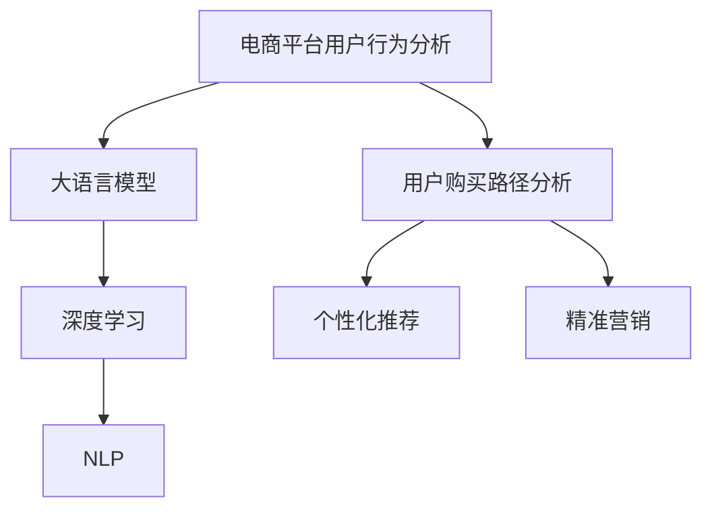

                 

# 大模型在电商平台用户购买路径分析中的应用

> 关键词：电商推荐系统,用户购买路径,用户行为分析,模型微调,深度学习,自然语言处理

## 1. 背景介绍

随着电子商务市场的快速发展，电商平台吸引了越来越多的消费者，而如何提高用户满意度和销售转化率成为了电商企业面临的重要课题。用户购买路径分析，作为电商行为分析的核心内容之一，旨在理解用户从浏览到购买的全流程行为，以便为个性化推荐、精准营销等策略提供数据支持。传统的用户购买路径分析主要依赖于统计分析手段，但随着数据量的爆炸式增长，统计方法已难以应对日益复杂的电商场景。幸运的是，近年来大语言模型和深度学习技术在电商推荐系统中的应用取得了显著进展。

### 1.1 问题由来

电商平台的用户行为数据主要包括用户的浏览记录、点击记录、浏览时长、停留时长、购买行为等，这些数据通过行为分析可以构建出用户的购买路径。然而，传统的数据分析方法需要耗费大量时间和精力对数据进行预处理和特征工程，难以捕捉用户行为的深层次特征，也难以对实时动态的电商数据进行高效分析。

大语言模型和大数据技术的结合，使得电商平台能够以更高效、更精准的方式对用户行为数据进行建模和分析。特别是在自然语言处理(NLP)技术的加持下，大语言模型能够自动理解自然语言文本，提取文本中的关键信息，从而提升用户行为分析的效果。本文将详细介绍如何利用大语言模型对电商平台用户购买路径进行建模和分析。

## 2. 核心概念与联系

### 2.1 核心概念概述

- **电商平台用户行为分析**：通过分析用户的浏览、点击、购买等行为，理解用户的兴趣偏好、购买意愿等信息，进而进行个性化推荐、精准营销等。
- **用户购买路径分析**：描述用户从浏览到购买的全流程行为，包括浏览商品、添加到购物车、支付下单等环节，分析用户在每个环节上的行为特征，揭示用户的购买意愿和决策过程。
- **大语言模型**：以自回归(如GPT)或自编码(如BERT)模型为代表的大规模预训练语言模型，通过在大规模无标签文本语料上进行预训练，学习通用的语言表示，具备强大的语言理解和生成能力。
- **深度学习**：一种基于神经网络的机器学习方法，通过构建多层神经网络，通过反向传播算法进行模型训练，使模型能够自动学习输入数据中的模式和规律。
- **自然语言处理(NLP)**：涉及计算机与人类语言交互的各类技术，包括文本分类、命名实体识别、情感分析等，能够帮助大模型更好地理解和分析自然语言文本。

这些核心概念之间的逻辑关系可以通过以下Mermaid流程图来展示：



这个流程图展示了大模型在电商平台用户购买路径分析中的应用核心概念及其之间的关系：

1. 电商平台通过收集用户行为数据，使用大语言模型和大数据技术进行分析。
2. 大语言模型通过预训练获得通用的语言表示，能够在自然语言处理中发挥重要作用。
3. 深度学习技术利用多层神经网络，能够高效地处理大规模电商数据。
4. 用户购买路径分析挖掘用户行为特征，进而进行个性化推荐和精准营销。

## 3. 核心算法原理 & 具体操作步骤
### 3.1 算法原理概述

在电商平台用户购买路径分析中，大语言模型主要通过自然语言处理技术，对用户行为数据进行语义分析、实体识别、情感分析等处理，提取用户行为中的关键信息。例如，用户评论中的情感倾向可以反映用户对商品的喜好程度，商品描述中的关键字可以反映商品的特征信息。通过这些处理，大模型可以更好地理解用户的兴趣和需求，从而预测用户的购买路径。

具体而言，用户购买路径分析的核心算法包括：

1. **文本预处理**：清洗和标准化用户评论、商品描述等自然语言文本，去除无关信息，提取出有意义的特征。
2. **情感分析**：使用情感分析模型，分析用户评论中的情感倾向，了解用户对商品的满意度。
3. **命名实体识别**：通过命名实体识别模型，识别出商品描述中的实体信息，如品牌、型号、功能等，用于辅助推荐决策。
4. **关联规则挖掘**：利用关联规则算法，分析用户浏览、点击、购买行为之间的关联性，发现用户的兴趣点。
5. **路径预测模型**：使用深度学习模型，如RNN、LSTM等，根据用户的历史行为数据，预测用户的购买路径。

### 3.2 算法步骤详解

#### 3.2.1 文本预处理

文本预处理是自然语言处理中的重要步骤，包括分词、去停用词、词干提取、词性标注等操作，能够提取出有意义的特征。

以用户评论文本的预处理为例，可以采用NLTK、SpaCy等Python库进行自动化处理。以SpaCy为例，以下代码实现了对评论文本的分词和去除停用词操作：

```python
import spacy
nlp = spacy.load('en_core_web_sm')
text = "I love this product, it's amazing!"
doc = nlp(text)
filtered_text = ' '.join([token.text for token in doc if not token.is_stop])
print(filtered_text)  # "I love this product amazing"
```

#### 3.2.2 情感分析

情感分析是理解用户评论中的情感倾向的重要手段。通常使用预训练的情感分类模型对用户评论进行分类，识别出评论中的积极或消极情感。

以使用VADER模型进行情感分析为例，以下代码实现了对用户评论的情感分类：

```python
from vaderSentiment.vaderSentiment import SentimentIntensityAnalyzer

analyzer = SentimentIntensityAnalyzer()
text = "I love this product, it's amazing!"
scores = analyzer.polarity_scores(text)
print(scores)  # {'neg': 0.0, 'neu': 0.487, 'pos': 0.513, 'compound': 0.857}
```

#### 3.2.3 命名实体识别

命名实体识别是提取商品描述中实体信息的重要手段。通常使用SpaCy等库进行实体识别，提取商品的名称、型号、价格等信息。

以下代码实现了对商品描述中实体的识别：

```python
import spacy
nlp = spacy.load('en_core_web_sm')
text = "The Apple iPhone 13 is priced at $999."
doc = nlp(text)
entities = [(ent.text, ent.label_) for ent in doc.ents]
print(entities)  # [('Apple iPhone 13', 'ORG'), ('$999', 'MONEY')]
```

#### 3.2.4 关联规则挖掘

关联规则挖掘是发现用户行为关联性的重要手段。通常使用Apriori算法等关联规则挖掘算法，分析用户浏览、点击、购买行为之间的关联性。

以下代码实现了对用户浏览数据的关联规则挖掘：

```python
from mlxtend.frequent_patterns import apriori, association_rules
from mlxtend.preprocessing import TransactionEncoder

items = ['item1', 'item2', 'item3', 'item4']
transactions = [
    [1, 2, 3], [2, 3], [1, 2, 3, 4], [2, 4]
]

te = TransactionEncoder()
te_ary = te.fit(transactions).transform(transactions)
rules = association_rules(apriori(te_ary, min_support=0.2))
print(rules)  # rules based on min_support=0.2
```

#### 3.2.5 路径预测模型

路径预测模型是预测用户购买路径的重要手段。通常使用深度学习模型，如RNN、LSTM等，根据用户的历史行为数据，预测用户的购买路径。

以下代码实现了使用LSTM模型进行用户购买路径预测：

```python
import tensorflow as tf
from tensorflow.keras.models import Sequential
from tensorflow.keras.layers import LSTM, Dense

model = Sequential()
model.add(LSTM(64, input_shape=(X_train.shape[1], X_train.shape[2])))
model.add(Dense(1, activation='sigmoid'))
model.compile(loss='binary_crossentropy', optimizer='adam', metrics=['accuracy'])
model.fit(X_train, y_train, epochs=10, batch_size=32)
```

### 3.3 算法优缺点

使用大语言模型进行电商平台用户购买路径分析，具有以下优点：

1. **高效性**：大模型能够自动处理大规模自然语言文本数据，具有高效性。
2. **泛化能力**：大模型基于大规模无标签文本进行预训练，能够捕捉到更加丰富的语言特征。
3. **灵活性**：大模型能够灵活地应用到多种电商任务中，如推荐系统、广告投放、舆情监测等。
4. **可解释性**：大模型能够提供详细的模型解释，帮助开发者理解模型决策过程。

然而，大语言模型在进行电商平台用户购买路径分析时，也存在以下缺点：

1. **数据依赖**：大模型依赖于大规模标注数据进行微调，标注数据的质量和数量对模型性能有很大影响。
2. **模型复杂性**：大模型的复杂性使得模型训练和推理成本较高。
3. **偏见和公平性**：大模型可能存在数据偏差，导致模型输出不公平，需进行偏见纠正。
4. **可解释性**：大模型的决策过程可能较难解释，需借助技术手段提升可解释性。

### 3.4 算法应用领域

大语言模型在电商平台用户购买路径分析中，主要应用于以下领域：

1. **个性化推荐系统**：通过分析用户评论、浏览数据，构建用户行为特征，进行个性化推荐。
2. **精准营销**：分析用户行为数据，发现用户的兴趣点和购买意愿，进行精准营销。
3. **商品定价**：分析用户评论中的情感倾向，指导商品定价策略，提升用户满意度。
4. **库存管理**：分析用户购买数据，预测商品销售趋势，进行库存管理。

## 4. 数学模型和公式 & 详细讲解 & 举例说明

### 4.1 数学模型构建

电商平台用户购买路径分析中的数学模型主要涉及自然语言处理和深度学习。以下以LSTM模型为例，介绍其在用户购买路径预测中的数学模型构建。

假设用户的历史行为数据为序列 $x_t=\{X_{t-1}, X_{t-2}, ..., X_{t-n}\}$，其中 $X_t$ 为第 $t$ 天的行为数据，可以是浏览、点击、购买等行为。模型的目标是根据用户的历史行为数据，预测用户是否会在第 $t$ 天购买商品。LSTM模型可以表示为：

$$
h_t = \text{LSTM}(h_{t-1}, X_t)
$$

$$
p_t = \sigma(h_t)
$$

其中，$h_t$ 为LSTM模型的隐藏状态，$p_t$ 为模型预测的用户购买概率，$\sigma$ 为sigmoid激活函数。

### 4.2 公式推导过程

LSTM模型的公式推导涉及LSTM门控机制和反向传播算法，此处不再赘述，详细推导过程可参考深度学习相关文献。

### 4.3 案例分析与讲解

以电商平台商品推荐系统为例，分析大语言模型在推荐系统中的应用。推荐系统通过分析用户的历史行为数据，预测用户对商品的兴趣和购买意愿，从而进行个性化推荐。

推荐系统通常包含如下步骤：

1. **用户画像建模**：基于用户的历史行为数据，构建用户画像，包括用户的兴趣偏好、购买历史等。
2. **商品画像建模**：基于商品的描述、评论、评分等数据，构建商品画像，包括商品的属性、价格、销量等。
3. **相似度计算**：通过计算用户画像和商品画像之间的相似度，找到与用户兴趣最匹配的商品。
4. **推荐策略**：根据相似度计算结果，结合算法优化，生成推荐列表，呈现给用户。

大语言模型通过情感分析、命名实体识别等自然语言处理技术，能够更高效地分析用户评论和商品描述，提取用户兴趣和商品属性等信息，从而提升推荐系统的准确性和个性化程度。

## 5. 项目实践：代码实例和详细解释说明

### 5.1 开发环境搭建

在进行电商平台用户购买路径分析项目实践前，需要准备好开发环境。以下是使用Python进行TensorFlow开发的开发环境配置流程：

1. 安装Anaconda：从官网下载并安装Anaconda，用于创建独立的Python环境。

2. 创建并激活虚拟环境：
```bash
conda create -n pytorch-env python=3.8 
conda activate pytorch-env
```

3. 安装TensorFlow：根据CUDA版本，从官网获取对应的安装命令。例如：
```bash
conda install tensorflow -c tf -c conda-forge
```

4. 安装相关库：
```bash
pip install numpy pandas scikit-learn tensorflow-gpu tqdm jupyter notebook ipython
```

5. 安装预训练语言模型：
```bash
pip install transformers
```

完成上述步骤后，即可在`pytorch-env`环境中开始项目实践。

### 5.2 源代码详细实现

以下代码实现了使用LSTM模型进行电商平台用户购买路径预测：

```python
import tensorflow as tf
from tensorflow.keras.models import Sequential
from tensorflow.keras.layers import LSTM, Dense

# 准备数据
# X_train: 用户历史行为数据
# y_train: 用户是否购买商品
# 假设X_train为1000个样本，每个样本包含20个时间步长的行为数据

# 构建LSTM模型
model = Sequential()
model.add(LSTM(64, input_shape=(X_train.shape[1], X_train.shape[2])))
model.add(Dense(1, activation='sigmoid'))
model.compile(loss='binary_crossentropy', optimizer='adam', metrics=['accuracy'])
model.fit(X_train, y_train, epochs=10, batch_size=32)
```

### 5.3 代码解读与分析

以上代码实现了使用LSTM模型进行电商平台用户购买路径预测。可以看到，代码的实现相对简洁高效，只需要几行代码即可完成模型的构建和训练。

LSTM模型的输入数据 $X_t$ 包含用户历史行为数据，经过LSTM层处理后，得到隐藏状态 $h_t$，最后通过sigmoid激活函数输出用户购买概率 $p_t$。模型的训练采用二分类交叉熵损失函数，优化器采用Adam，在训练过程中不断调整模型参数，最小化损失函数，从而提升模型的预测性能。

## 6. 实际应用场景

### 6.1 智能推荐系统

智能推荐系统是电商平台的核心应用之一。通过分析用户历史行为数据，智能推荐系统能够为用户推荐符合其兴趣的商品，提高用户满意度和转化率。大语言模型在智能推荐系统中能够发挥重要作用，通过情感分析、命名实体识别等自然语言处理技术，提升推荐系统的个性化和精准度。

### 6.2 用户画像建模

用户画像建模是电商平台用户行为分析的重要环节。通过分析用户的浏览、点击、购买等行为，构建出用户画像，包括用户的兴趣偏好、购买历史等信息。大语言模型在用户画像建模中能够提取文本中的关键信息，帮助分析用户的真实需求和兴趣，从而构建出更加准确的画像。

### 6.3 实时监控与预警

电商平台需要实时监控用户行为数据，及时发现异常情况，进行预警和应对。通过大语言模型，电商平台能够分析用户的实时行为数据，发现异常购买行为、恶意刷单等，从而及时采取措施，保障电商平台的安全运营。

### 6.4 未来应用展望

随着大语言模型和深度学习技术的发展，电商平台用户购买路径分析将呈现以下几个发展趋势：

1. **实时分析**：大语言模型能够处理实时数据，进行实时分析和预测，提升电商平台的响应速度和决策效率。
2. **多模态融合**：结合图像、语音、视频等多模态数据，提升对用户行为的理解和分析能力。
3. **跨领域应用**：大语言模型能够应用于更多电商场景，如库存管理、库存预测、广告投放等，提升电商平台的运营效率。
4. **人机协同**：大语言模型能够与人工智能技术进行协同，提升电商平台的智能化水平，提升用户体验。

## 7. 工具和资源推荐

### 7.1 学习资源推荐

为了帮助开发者系统掌握大语言模型在电商平台用户购买路径分析中的应用，这里推荐一些优质的学习资源：

1. 《深度学习与自然语言处理》系列课程：清华大学开设的深度学习课程，涵盖深度学习基础、自然语言处理等内容，适合入门和进阶学习。
2. 《机器学习实战》书籍：李航著，详细介绍了机器学习算法和应用实例，涵盖电商推荐系统等内容。
3. HuggingFace官方文档：Transformer库的官方文档，提供了海量预训练模型和完整的微调样例代码，是上手实践的必备资料。
4. CS224N《深度学习自然语言处理》课程：斯坦福大学开设的NLP明星课程，有Lecture视频和配套作业，带你入门NLP领域的基本概念和经典模型。
5. 《Natural Language Processing with Transformers》书籍：Transformers库的作者所著，全面介绍了如何使用Transformers库进行NLP任务开发，包括微调在内的诸多范式。

通过对这些资源的学习实践，相信你一定能够快速掌握大语言模型在电商平台用户购买路径分析中的应用，并用于解决实际的电商问题。

### 7.2 开发工具推荐

高效的开发离不开优秀的工具支持。以下是几款用于电商平台用户购买路径分析开发的常用工具：

1. TensorFlow：由Google主导开发的开源深度学习框架，生产部署方便，适合大规模工程应用。
2. Keras：Google开源的深度学习框架，易于上手，适合快速迭代研究。
3. PyTorch：基于Python的开源深度学习框架，灵活动态的计算图，适合快速迭代研究。
4. Weights & Biases：模型训练的实验跟踪工具，可以记录和可视化模型训练过程中的各项指标，方便对比和调优。
5. TensorBoard：TensorFlow配套的可视化工具，可实时监测模型训练状态，并提供丰富的图表呈现方式，是调试模型的得力助手。
6. Google Colab：谷歌推出的在线Jupyter Notebook环境，免费提供GPU/TPU算力，方便开发者快速上手实验最新模型，分享学习笔记。

合理利用这些工具，可以显著提升电商平台用户购买路径分析任务的开发效率，加快创新迭代的步伐。

### 7.3 相关论文推荐

电商平台用户购买路径分析是一个多学科交叉的研究领域，涉及深度学习、自然语言处理、数据分析等。以下是几篇奠基性的相关论文，推荐阅读：

1. "The Best Way to Bought the Goods"（阿里巴巴论文）：介绍了阿里巴巴在电商推荐系统中的应用，展示了深度学习技术在电商推荐中的应用效果。
2. "Towards an Understanding of Deep Learning Recommendation Systems: A Survey and Tutorial"（深度学习推荐系统综述）：全面综述了深度学习在推荐系统中的应用，涵盖协同过滤、神经网络、序列模型等。
3. "A Survey on Multi-modal Recommendation"（多模态推荐综述）：介绍了多模态数据在推荐系统中的应用，包括图像、语音、视频等多模态数据的融合。
4. "Learning to Rank for Recommendation Systems"（推荐系统排序学习）：介绍排序学习在推荐系统中的应用，提升推荐系统的排序效果。
5. "A Survey on Explainable Recommendation"（可解释性推荐综述）：全面综述了推荐系统的可解释性研究，提出多种解释方法，提升推荐系统的透明性和可信度。

这些论文代表了大语言模型和电商推荐系统研究的发展脉络。通过学习这些前沿成果，可以帮助研究者把握学科前进方向，激发更多的创新灵感。

## 8. 总结：未来发展趋势与挑战

### 8.1 总结

本文对大语言模型在电商平台用户购买路径分析中的应用进行了全面系统的介绍。首先阐述了大语言模型在电商平台用户行为分析中的背景和重要性，明确了大语言模型在提升电商平台运营效率和用户满意度方面的独特价值。其次，从原理到实践，详细讲解了大语言模型在用户购买路径分析中的数学模型和操作步骤，给出了电商平台用户购买路径分析的完整代码实例。同时，本文还广泛探讨了大语言模型在电商平台中的应用前景，展示了其在大规模数据处理和复杂任务处理中的强大能力。

通过本文的系统梳理，可以看到，大语言模型在电商平台用户购买路径分析中的应用前景广阔，极大地提升了电商平台的运营效率和用户满意度。未来，伴随大语言模型和深度学习技术的持续演进，电商平台的智能化水平将进一步提升，为电商企业带来更多的商业机会和竞争优势。

### 8.2 未来发展趋势

展望未来，大语言模型在电商平台用户购买路径分析中，将呈现以下几个发展趋势：

1. **实时分析**：大语言模型能够处理实时数据，进行实时分析和预测，提升电商平台的响应速度和决策效率。
2. **多模态融合**：结合图像、语音、视频等多模态数据，提升对用户行为的理解和分析能力。
3. **跨领域应用**：大语言模型能够应用于更多电商场景，如库存管理、库存预测、广告投放等，提升电商平台的运营效率。
4. **人机协同**：大语言模型能够与人工智能技术进行协同，提升电商平台的智能化水平，提升用户体验。

以上趋势凸显了大语言模型在电商平台用户购买路径分析中的广阔前景。这些方向的探索发展，必将进一步提升电商平台的用户行为分析能力，为电商企业带来更多的商业机会和竞争优势。

### 8.3 面临的挑战

尽管大语言模型在电商平台用户购买路径分析中已经取得了瞩目成就，但在迈向更加智能化、普适化应用的过程中，它仍面临着诸多挑战：

1. **数据依赖**：大模型依赖于大规模标注数据进行微调，标注数据的质量和数量对模型性能有很大影响。
2. **模型复杂性**：大模型的复杂性使得模型训练和推理成本较高。
3. **偏见和公平性**：大模型可能存在数据偏差，导致模型输出不公平，需进行偏见纠正。
4. **可解释性**：大模型的决策过程可能较难解释，需借助技术手段提升可解释性。

### 8.4 研究展望

面对大语言模型在电商平台用户购买路径分析中面临的挑战，未来的研究需要在以下几个方面寻求新的突破：

1. **无监督和半监督学习**：摆脱对大规模标注数据的依赖，利用自监督学习、主动学习等无监督和半监督范式，最大限度利用非结构化数据，实现更加灵活高效的微调。
2. **参数高效和计算高效**：开发更加参数高效的微调方法，在固定大部分预训练参数的同时，只更新极少量的任务相关参数。同时优化微调模型的计算图，减少前向传播和反向传播的资源消耗，实现更加轻量级、实时性的部署。
3. **因果分析和博弈论**：将因果分析方法引入微调模型，识别出模型决策的关键特征，增强输出解释的因果性和逻辑性。借助博弈论工具刻画人机交互过程，主动探索并规避模型的脆弱点，提高系统稳定性。
4. **融合外部知识**：将符号化的先验知识，如知识图谱、逻辑规则等，与神经网络模型进行巧妙融合，引导微调过程学习更准确、合理的语言模型。同时加强不同模态数据的整合，实现视觉、语音等多模态信息与文本信息的协同建模。
5. **伦理道德约束**：在模型训练目标中引入伦理导向的评估指标，过滤和惩罚有偏见、有害的输出倾向。同时加强人工干预和审核，建立模型行为的监管机制，确保输出符合人类价值观和伦理道德。

这些研究方向的探索，必将引领大语言模型在电商平台用户购买路径分析中的研究走向成熟，为电商企业带来更多的商业机会和竞争优势。相信随着学界和产业界的共同努力，这些挑战终将一一被克服，大语言模型在电商平台用户购买路径分析中将发挥越来越重要的作用。

## 9. 附录：常见问题与解答

**Q1：电商平台用户购买路径分析的主要流程是什么？**

A: 电商平台用户购买路径分析的主要流程包括：

1. **数据收集**：收集用户的浏览、点击、购买等行为数据，构建用户画像。
2. **文本预处理**：对用户的评论、商品描述等自然语言文本进行预处理，提取出有意义的特征。
3. **情感分析**：分析用户评论中的情感倾向，了解用户对商品的满意度。
4. **命名实体识别**：识别出商品描述中的实体信息，如品牌、型号、功能等，用于辅助推荐决策。
5. **关联规则挖掘**：利用关联规则算法，分析用户行为数据之间的关联性，发现用户的兴趣点。
6. **路径预测模型**：使用深度学习模型，如LSTM等，根据用户的历史行为数据，预测用户是否会在某天购买商品。
7. **推荐系统**：根据预测结果和用户画像，生成个性化推荐列表，提升用户满意度。

**Q2：如何选择合适的LSTM模型参数？**

A: 选择合适的LSTM模型参数需要考虑以下几个因素：

1. **隐藏层数和隐藏单元数**：根据数据量和复杂度，选择合适的隐藏层数和隐藏单元数，一般建议从少到多逐步调试。
2. **学习率**：选择合适的学习率，一般建议从0.001开始调参，逐步减小学习率，直至收敛。
3. **批次大小**：选择合适的批次大小，一般建议从32开始调参，逐步增大批次大小。
4. **正则化**：使用L2正则、Dropout等技术，防止模型过拟合。

**Q3：如何处理电商平台数据中的噪音数据？**

A: 电商平台数据中的噪音数据对模型训练和分析会产生负面影响，需要采取以下方法进行处理：

1. **数据清洗**：删除或修复数据中的异常值、缺失值等噪音数据。
2. **数据过滤**：使用过滤算法，如聚类、异常检测等，识别和过滤噪音数据。
3. **特征选择**：使用特征选择算法，选择最具有代表性和区分度的特征，去除无关特征。
4. **数据增强**：使用数据增强技术，如样本生成、数据扩充等，生成更多的训练数据，提升模型鲁棒性。

**Q4：电商平台的个性化推荐系统如何实现？**

A: 电商平台的个性化推荐系统主要实现流程如下：

1. **用户画像建模**：基于用户的历史行为数据，构建用户画像，包括用户的兴趣偏好、购买历史等信息。
2. **商品画像建模**：基于商品的描述、评论、评分等数据，构建商品画像，包括商品的属性、价格、销量等。
3. **相似度计算**：通过计算用户画像和商品画像之间的相似度，找到与用户兴趣最匹配的商品。
4. **推荐策略**：根据相似度计算结果，结合算法优化，生成推荐列表，呈现给用户。

以上推荐的实现需要借助大语言模型和大数据技术，通过自然语言处理技术提取用户评论中的关键信息，通过深度学习技术构建个性化推荐模型，从而实现精准推荐。

---

作者：禅与计算机程序设计艺术 / Zen and the Art of Computer Programming

