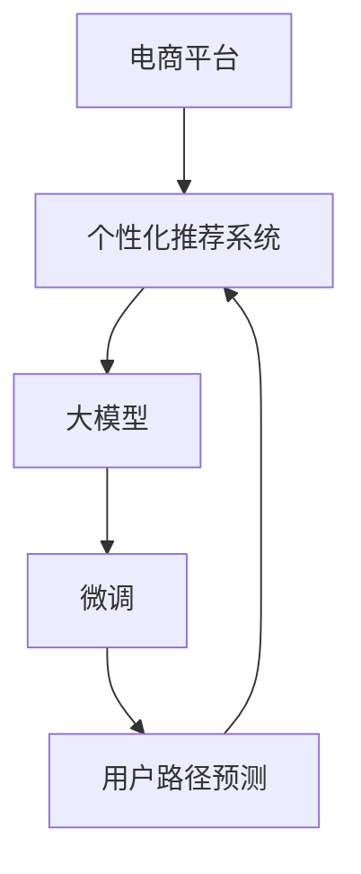

                 

# 大模型如何优化电商平台的用户留存策略

> 关键词：电商平台,用户留存策略,用户行为分析,个性化推荐系统,大模型,用户路径预测

## 1. 背景介绍

### 1.1 问题由来

在数字经济的浪潮中，电商平台凭借其便捷、高效的交易体验，成为零售行业的重要力量。据统计，全球电商平台交易额已占到全球零售市场的近三分之一，预计未来这一比例将进一步提升。然而，电商平台的激烈竞争也给用户留存带来巨大挑战。如何通过有效的策略提升用户粘性、增加消费频次，是电商平台运营的重要课题。

### 1.2 问题核心关键点

在电商平台的用户留存策略中，个性化推荐系统起着至关重要的作用。通过精准识别用户的兴趣和需求，个性化推荐系统能够向用户推荐其可能感兴趣的商品，增加用户的购买意愿和平台粘性。但传统推荐系统的核心在于历史行为分析，难以捕捉即时变化的用户兴趣。近年来，基于大模型的推荐系统应运而生，通过自然语言处理和深度学习技术，在用户留存方面表现出显著优势。

大模型推荐系统通过大规模无监督语料预训练，获得了对用户行为和商品属性的深度理解。在微调阶段，通过用户行为数据进行有监督学习，进一步优化模型的推荐效果，从而提升用户留存率。本文将深入探讨如何利用大模型优化电商平台的个性化推荐系统，构建用户留存策略。

### 1.3 问题研究意义

研究大模型优化电商平台用户留存策略，对于提升电商平台的运营效率、优化用户体验、提高用户满意度、增加营收具有重要意义：

1. 提高用户粘性。通过精准推荐，帮助用户发现新商品，提升用户的购物体验和平台粘性。
2. 增加消费频次。针对不同用户行为特点，制定个性化的营销策略，增加用户复购率。
3. 提升运营效率。个性化推荐可以大幅降低人工干预，提高运营效率和ROI。
4. 优化用户体验。结合用户的即时行为和偏好，提供即时的个性化服务，提升用户体验。
5. 增加营收。精准的个性化推荐能增加用户购买频次和客单价，从而提高平台整体营收。

## 2. 核心概念与联系

### 2.1 核心概念概述

为更好地理解基于大模型的电商平台个性化推荐系统，本节将介绍几个密切相关的核心概念：

- 电商平台：指以互联网为媒介，提供商品交易、信息展示、用户交互等服务的平台。
- 个性化推荐系统：根据用户的历史行为和即时行为，向用户推荐其可能感兴趣的商品，提高用户满意度和留存率。
- 大模型：指通过大规模无监督预训练获得的语言模型，如BERT、GPT、XLNet等。
- 微调(Fine-Tuning)：在大模型基础上，通过用户行为数据进行有监督学习，优化模型参数，提高推荐效果。
- 用户路径预测(User Path Prediction)：通过分析用户的购买行为和点击路径，预测用户未来的购买意向，优化推荐策略。

这些核心概念之间的逻辑关系可以通过以下Mermaid流程图来展示：



这个流程图展示了大模型优化电商平台推荐系统的核心概念及其之间的关系：

1. 电商平台通过个性化推荐系统提升用户留存率。
2. 推荐系统依赖于大模型获取用户和商品的深度语义表示。
3. 微调过程通过用户行为数据进一步优化模型，提高推荐效果。
4. 用户路径预测为推荐系统提供更精准的用户意图理解。

这些概念共同构成了电商平台个性化推荐系统的工作框架，为大模型优化用户留存策略提供了重要参考。

## 3. 核心算法原理 & 具体操作步骤
### 3.1 算法原理概述

基于大模型的电商平台个性化推荐系统，其核心原理是通过大规模无监督预训练获得商品和用户的行为表示，然后在用户行为数据上进行有监督微调，优化推荐模型，提升用户留存率。具体步骤如下：

1. **无监督预训练**：使用大规模无标签文本数据，通过自监督任务训练大模型，学习到商品和用户的语义表示。
2. **数据收集与预处理**：收集电商平台的用户行为数据，包括浏览、点击、购买等行为。对数据进行清洗和特征工程，构建训练集和验证集。
3. **微调过程**：在大模型的基础上，通过有监督微调过程，优化推荐模型，使其能够更好地适应电商平台的业务场景。
4. **用户路径预测**：分析用户的购买路径和行为特征，预测用户未来的购买意向，优化推荐策略。
5. **推荐实践**：将优化后的推荐模型部署到电商平台中，向用户推荐商品，提升用户留存率。

### 3.2 算法步骤详解

以下将详细介绍基于大模型的电商平台个性化推荐系统的实现流程：

**Step 1: 准备预训练模型和大规模语料**

- 选择合适的大模型，如BERT、GPT等，作为推荐系统的基础。
- 收集大规模无标签文本数据，如维基百科、新闻、商品描述等。
- 在无标签数据上训练大模型，学习商品和用户的语义表示。

**Step 2: 数据收集与预处理**

- 收集电商平台的用户行为数据，包括浏览记录、点击记录、购买记录等。
- 清洗数据，处理缺失值和异常值。
- 对用户行为数据进行特征工程，提取关键特征，如浏览时长、点击路径、购买记录等。
- 构建训练集和验证集，划分训练数据和验证数据。

**Step 3: 微调模型**

- 选择合适的微调框架和优化器，如PyTorch、TensorFlow等。
- 在大模型的基础上进行微调，优化推荐模型。
- 使用训练集数据进行迭代优化，最小化预测错误。
- 在验证集上评估模型效果，调整超参数，防止过拟合。

**Step 4: 用户路径预测**

- 分析用户的历史行为数据，提取用户的行为模式。
- 使用用户路径预测算法，如隐马尔可夫模型、深度强化学习等，预测用户未来的购买意向。
- 根据预测结果调整推荐策略，增加用户的购买概率。

**Step 5: 推荐实践**

- 将优化后的推荐模型部署到电商平台中，实时向用户推荐商品。
- 收集用户反馈，持续优化推荐策略。
- 结合用户即时行为和偏好，提供即时的个性化推荐服务。

### 3.3 算法优缺点

基于大模型的电商平台个性化推荐系统有以下优点：

1. 通用性高：大模型在多种语义任务中表现出色，能够处理复杂的商品和用户描述。
2. 表现优异：通过大规模语料预训练，大模型具备强大的语义理解能力，推荐效果显著。
3. 数据驱动：通过有监督微调，推荐模型能够不断适应用户行为的变化。
4. 实时性好：利用大模型的高效计算能力，能够实时分析用户行为，提供个性化推荐。

但该方法也存在一些局限性：

1. 预训练成本高：大规模无监督预训练需要大量计算资源，成本较高。
2. 数据依赖性强：微调过程依赖于电商平台的用户行为数据，难以处理冷启动问题。
3. 对抗性强：电商平台可能存在大量的对抗样本，推荐模型需要具备较强的鲁棒性。
4. 解释性差：大模型通常是一个"黑盒"，难以解释推荐结果的原因，用户可能缺乏信任。

尽管存在这些局限性，但就目前而言，基于大模型的推荐系统仍是最主流的方法。未来相关研究的重点在于如何降低预训练成本，提高模型的鲁棒性和可解释性，同时兼顾个性化推荐的效果。

### 3.4 算法应用领域

基于大模型的电商平台个性化推荐系统，已经在多个电商平台上得到应用，取得了显著的效果。具体应用领域包括：

- 天猫：通过基于大模型的推荐系统，提升用户留存率，增加销售额。
- 亚马逊：使用深度学习模型和强化学习算法，优化推荐策略，提升用户体验。
- 京东：结合用户行为数据和商品属性，提供精准推荐，提升用户复购率。
- 抖音：利用用户路径预测技术，优化广告推荐策略，增加用户使用时长。

这些应用展示了基于大模型的推荐系统在电商平台的强大能力，为未来的推荐系统优化提供了借鉴。

## 4. 数学模型和公式 & 详细讲解  
### 4.1 数学模型构建

本节将使用数学语言对基于大模型的电商平台个性化推荐系统进行更加严格的刻画。

记电商平台用户行为数据为 $D=\{(x_i,y_i)\}_{i=1}^N, x_i \in \mathcal{X}, y_i \in \mathcal{Y}$，其中 $\mathcal{X}$ 为行为特征空间，$\mathcal{Y}$ 为商品标签空间。假设大模型为 $M_{\theta}:\mathcal{X} \rightarrow \mathcal{Y}$，其中 $\theta$ 为模型参数。

定义推荐模型在行为数据上的损失函数为 $\ell(M_{\theta}(x),y)$，则在数据集 $D$ 上的经验风险为：

$$
\mathcal{L}(\theta) = \frac{1}{N} \sum_{i=1}^N \ell(M_{\theta}(x_i),y_i)
$$

微调的优化目标是最小化经验风险，即找到最优参数：

$$
\theta^* = \mathop{\arg\min}_{\theta} \mathcal{L}(\theta)
$$

在实践中，我们通常使用基于梯度的优化算法（如SGD、Adam等）来近似求解上述最优化问题。设 $\eta$ 为学习率，$\lambda$ 为正则化系数，则参数的更新公式为：

$$
\theta \leftarrow \theta - \eta \nabla_{\theta}\mathcal{L}(\theta) - \eta\lambda\theta
$$

其中 $\nabla_{\theta}\mathcal{L}(\theta)$ 为损失函数对参数 $\theta$ 的梯度，可通过反向传播算法高效计算。

### 4.2 公式推导过程

以下我们以二分类任务为例，推导交叉熵损失函数及其梯度的计算公式。

假设推荐模型 $M_{\theta}$ 在行为 $x$ 上的输出为 $\hat{y}=M_{\theta}(x) \in [0,1]$，表示用户点击商品的概率。真实标签 $y \in \{0,1\}$。则二分类交叉熵损失函数定义为：

$$
\ell(M_{\theta}(x),y) = -[y\log \hat{y} + (1-y)\log (1-\hat{y})]
$$

将其代入经验风险公式，得：

$$
\mathcal{L}(\theta) = -\frac{1}{N}\sum_{i=1}^N [y_i\log M_{\theta}(x_i)+(1-y_i)\log(1-M_{\theta}(x_i))]
$$

根据链式法则，损失函数对参数 $\theta_k$ 的梯度为：

$$
\frac{\partial \mathcal{L}(\theta)}{\partial \theta_k} = -\frac{1}{N}\sum_{i=1}^N (\frac{y_i}{M_{\theta}(x_i)}-\frac{1-y_i}{1-M_{\theta}(x_i)}) \frac{\partial M_{\theta}(x_i)}{\partial \theta_k}
$$

其中 $\frac{\partial M_{\theta}(x_i)}{\partial \theta_k}$ 可进一步递归展开，利用自动微分技术完成计算。

在得到损失函数的梯度后，即可带入参数更新公式，完成模型的迭代优化。重复上述过程直至收敛，最终得到适应电商平台业务场景的最优模型参数 $\theta^*$。

## 5. 项目实践：代码实例和详细解释说明
### 5.1 开发环境搭建

在进行微调实践前，我们需要准备好开发环境。以下是使用Python进行PyTorch开发的环境配置流程：

1. 安装Anaconda：从官网下载并安装Anaconda，用于创建独立的Python环境。

2. 创建并激活虚拟环境：
```bash
conda create -n pytorch-env python=3.8 
conda activate pytorch-env
```

3. 安装PyTorch：根据CUDA版本，从官网获取对应的安装命令。例如：
```bash
conda install pytorch torchvision torchaudio cudatoolkit=11.1 -c pytorch -c conda-forge
```

4. 安装Transformers库：
```bash
pip install transformers
```

5. 安装各类工具包：
```bash
pip install numpy pandas scikit-learn matplotlib tqdm jupyter notebook ipython
```

完成上述步骤后，即可在`pytorch-env`环境中开始微调实践。

### 5.2 源代码详细实现

下面我们以电商平台的用户留存优化为例，给出使用Transformers库对大模型进行微调的PyTorch代码实现。

首先，定义行为数据处理函数：

```python
from transformers import BertTokenizer
from torch.utils.data import Dataset
import torch

class UserBehaviorDataset(Dataset):
    def __init__(self, behaviors, labels, tokenizer, max_len=128):
        self.behaviors = behaviors
        self.labels = labels
        self.tokenizer = tokenizer
        self.max_len = max_len
        
    def __len__(self):
        return len(self.behaviors)
    
    def __getitem__(self, item):
        behavior = self.behaviors[item]
        label = self.labels[item]
        
        encoding = self.tokenizer(behavior, return_tensors='pt', max_length=self.max_len, padding='max_length', truncation=True)
        input_ids = encoding['input_ids'][0]
        attention_mask = encoding['attention_mask'][0]
        
        # 对label进行编码
        encoded_label = label
        labels = torch.tensor(encoded_label, dtype=torch.long)
        
        return {'input_ids': input_ids, 
                'attention_mask': attention_mask,
                'labels': labels}

# 标签编码
label_encoder = {'0': 0, '1': 1}

# 创建dataset
tokenizer = BertTokenizer.from_pretrained('bert-base-cased')

train_dataset = UserBehaviorDataset(train_behaviors, train_labels, tokenizer)
dev_dataset = UserBehaviorDataset(dev_behaviors, dev_labels, tokenizer)
test_dataset = UserBehaviorDataset(test_behaviors, test_labels, tokenizer)
```

然后，定义模型和优化器：

```python
from transformers import BertForTokenClassification, AdamW

model = BertForTokenClassification.from_pretrained('bert-base-cased', num_labels=2)

optimizer = AdamW(model.parameters(), lr=2e-5)
```

接着，定义训练和评估函数：

```python
from torch.utils.data import DataLoader
from tqdm import tqdm
from sklearn.metrics import accuracy_score

device = torch.device('cuda') if torch.cuda.is_available() else torch.device('cpu')
model.to(device)

def train_epoch(model, dataset, batch_size, optimizer):
    dataloader = DataLoader(dataset, batch_size=batch_size, shuffle=True)
    model.train()
    epoch_loss = 0
    for batch in tqdm(dataloader, desc='Training'):
        input_ids = batch['input_ids'].to(device)
        attention_mask = batch['attention_mask'].to(device)
        labels = batch['labels'].to(device)
        model.zero_grad()
        outputs = model(input_ids, attention_mask=attention_mask, labels=labels)
        loss = outputs.loss
        epoch_loss += loss.item()
        loss.backward()
        optimizer.step()
    return epoch_loss / len(dataloader)

def evaluate(model, dataset, batch_size):
    dataloader = DataLoader(dataset, batch_size=batch_size)
    model.eval()
    preds, labels = [], []
    with torch.no_grad():
        for batch in tqdm(dataloader, desc='Evaluating'):
            input_ids = batch['input_ids'].to(device)
            attention_mask = batch['attention_mask'].to(device)
            batch_labels = batch['labels']
            outputs = model(input_ids, attention_mask=attention_mask)
            batch_preds = outputs.logits.argmax(dim=2).to('cpu').tolist()
            batch_labels = batch_labels.to('cpu').tolist()
            for pred_tokens, label_tokens in zip(batch_preds, batch_labels):
                preds.append(pred_tokens[:len(label_tokens)])
                labels.append(label_tokens)
                
    print(accuracy_score(labels, preds))
```

最后，启动训练流程并在测试集上评估：

```python
epochs = 5
batch_size = 16

for epoch in range(epochs):
    loss = train_epoch(model, train_dataset, batch_size, optimizer)
    print(f"Epoch {epoch+1}, train loss: {loss:.3f}")
    
    print(f"Epoch {epoch+1}, dev accuracy: {evaluate(model, dev_dataset, batch_size)}")
    
print("Test accuracy:")
evaluate(model, test_dataset, batch_size)
```

以上就是使用PyTorch对BERT进行电商平台用户行为数据微调的完整代码实现。可以看到，得益于Transformers库的强大封装，我们可以用相对简洁的代码完成BERT模型的加载和微调。

### 5.3 代码解读与分析

让我们再详细解读一下关键代码的实现细节：

**UserBehaviorDataset类**：
- `__init__`方法：初始化行为数据、标签、分词器等关键组件。
- `__len__`方法：返回数据集的样本数量。
- `__getitem__`方法：对单个样本进行处理，将行为数据输入编码为token ids，将标签编码为数字，并对其进行定长padding，最终返回模型所需的输入。

**label_encoder字典**：
- 定义了标签与数字id之间的映射关系，用于将token-wise的预测结果解码回真实的标签。

**训练和评估函数**：
- 使用PyTorch的DataLoader对数据集进行批次化加载，供模型训练和推理使用。
- 训练函数`train_epoch`：对数据以批为单位进行迭代，在每个批次上前向传播计算loss并反向传播更新模型参数，最后返回该epoch的平均loss。
- 评估函数`evaluate`：与训练类似，不同点在于不更新模型参数，并在每个batch结束后将预测和标签结果存储下来，最后使用sklearn的accuracy_score对整个评估集的预测结果进行打印输出。

**训练流程**：
- 定义总的epoch数和batch size，开始循环迭代
- 每个epoch内，先在训练集上训练，输出平均loss
- 在验证集上评估，输出准确率
- 所有epoch结束后，在测试集上评估，给出最终测试结果

可以看到，PyTorch配合Transformers库使得BERT微调的代码实现变得简洁高效。开发者可以将更多精力放在数据处理、模型改进等高层逻辑上，而不必过多关注底层的实现细节。

当然，工业级的系统实现还需考虑更多因素，如模型的保存和部署、超参数的自动搜索、更灵活的任务适配层等。但核心的微调范式基本与此类似。

## 6. 实际应用场景
### 6.1 智能客服系统

基于大模型优化的电商平台个性化推荐系统，可以应用于智能客服系统的构建。传统客服往往需要配备大量人力，高峰期响应缓慢，且一致性和专业性难以保证。而使用优化后的推荐系统，可以7x24小时不间断服务，快速响应客户咨询，用个性化的商品推荐增加用户粘性。

在技术实现上，可以收集企业内部的历史客服对话记录，将问题和最佳答复构建成监督数据，在此基础上对预训练推荐模型进行微调。微调后的推荐模型能够自动理解用户意图，匹配最合适的商品进行推荐。对于客户提出的新问题，还可以接入检索系统实时搜索相关内容，动态组织生成推荐结果。如此构建的智能客服系统，能大幅提升客户咨询体验和问题解决效率。

### 6.2 个性化推荐系统

在电商平台的个性化推荐中，大模型推荐系统已经得到广泛应用。通过基于大模型的微调，推荐系统能够更好地理解用户的即时行为和偏好，提供即时的个性化商品推荐。例如，在用户浏览特定商品时，实时预测用户对类似商品的购买意向，并推荐相关商品。这种基于大模型的推荐方法，能够在降低人工干预的同时，提升推荐效果，增加用户复购率。

此外，结合用户路径预测技术，推荐系统能够预测用户未来的购买行为，提前推荐相关商品，提高用户转化率。例如，在用户浏览某品牌商品时，预测用户对其他品牌的兴趣，并推荐相关商品。这种预测性推荐能够显著提升用户的购物体验和平台粘性。

### 6.3 未来应用展望

随着大模型推荐系统的不断演进，其在电商平台的个性化推荐中将会发挥越来越重要的作用。未来，基于大模型的推荐系统将呈现以下几个趋势：

1. 模型规模不断增大。随着算力成本的下降和数据规模的扩张，大模型推荐系统将不断优化，具备更强大的语义理解能力，提供更加精准的推荐服务。

2. 深度融合多模态数据。当前推荐系统主要聚焦于文本数据，未来将逐步拓展到图像、视频、音频等多模态数据。多模态信息的融合，将显著提升推荐系统的表现。

3. 结合因果推断和强化学习。通过引入因果推断和强化学习思想，推荐系统能够更准确地预测用户行为，优化推荐策略，提升用户体验。

4. 引入外部知识图谱。将外部知识图谱与推荐系统结合，引导推荐过程学习更全面的知识，提供更加全面和可信的推荐结果。

5. 实时性进一步提升。利用大模型的计算能力，推荐系统能够实时分析用户行为，提供即时的个性化推荐服务，进一步提升用户体验。

这些趋势展示了基于大模型的推荐系统在电商平台的巨大潜力，未来必将在更多领域得到广泛应用，为电商行业的数字化转型升级提供新的动力。

## 7. 工具和资源推荐
### 7.1 学习资源推荐

为了帮助开发者系统掌握大模型优化电商平台用户留存策略的理论基础和实践技巧，这里推荐一些优质的学习资源：

1. 《深度学习入门：基于Python的理论与实现》系列书籍：全面介绍了深度学习的基本概念和应用案例，适合入门读者。

2. 《自然语言处理综述》课程：斯坦福大学开设的NLP经典课程，涵盖NLP的各个方面，包括文本分类、序列标注、语言生成等。

3. 《Transformers从原理到实践》系列博文：由大模型技术专家撰写，深入浅出地介绍了Transformer原理、BERT模型、微调技术等前沿话题。

4. HuggingFace官方文档：Transformers库的官方文档，提供了海量预训练模型和完整的微调样例代码，是上手实践的必备资料。

5. 《自然语言处理与深度学习》书籍：详细介绍了NLP的各个技术，包括文本表示、序列建模、深度学习等，适合进阶读者。

通过对这些资源的学习实践，相信你一定能够快速掌握大模型优化电商平台的技巧，并用于解决实际的NLP问题。
###  7.2 开发工具推荐

高效的开发离不开优秀的工具支持。以下是几款用于大模型优化电商平台个性化推荐系统开发的常用工具：

1. PyTorch：基于Python的开源深度学习框架，灵活动态的计算图，适合快速迭代研究。大部分预训练语言模型都有PyTorch版本的实现。

2. TensorFlow：由Google主导开发的开源深度学习框架，生产部署方便，适合大规模工程应用。同样有丰富的预训练语言模型资源。

3. Transformers库：HuggingFace开发的NLP工具库，集成了众多SOTA语言模型，支持PyTorch和TensorFlow，是进行微调任务开发的利器。

4. Weights & Biases：模型训练的实验跟踪工具，可以记录和可视化模型训练过程中的各项指标，方便对比和调优。与主流深度学习框架无缝集成。

5. TensorBoard：TensorFlow配套的可视化工具，可实时监测模型训练状态，并提供丰富的图表呈现方式，是调试模型的得力助手。

6. Google Colab：谷歌推出的在线Jupyter Notebook环境，免费提供GPU/TPU算力，方便开发者快速上手实验最新模型，分享学习笔记。

合理利用这些工具，可以显著提升大模型优化电商平台个性化推荐系统的开发效率，加快创新迭代的步伐。

### 7.3 相关论文推荐

大模型优化电商平台个性化推荐系统的研究源于学界的持续研究。以下是几篇奠基性的相关论文，推荐阅读：

1. Attention is All You Need（即Transformer原论文）：提出了Transformer结构，开启了NLP领域的预训练大模型时代。

2. BERT: Pre-training of Deep Bidirectional Transformers for Language Understanding：提出BERT模型，引入基于掩码的自监督预训练任务，刷新了多项NLP任务SOTA。

3. Deep & Dense: A Mixture of Deep Learning & Natural Language Processing for Recommendation Systems：结合深度学习和NLP技术，提出混合推荐模型，取得显著效果。

4. Information-Theoretic Recommendation Learning：从信息论的角度，研究推荐系统的优化问题，提出多种优化算法。

5. An Object-Oriented Approach to Recommendation Systems：从对象导向的角度，提出基于对象的推荐系统架构，优化推荐效果。

这些论文代表了大模型优化电商平台个性化推荐系统的发展脉络。通过学习这些前沿成果，可以帮助研究者把握学科前进方向，激发更多的创新灵感。

## 8. 总结：未来发展趋势与挑战

### 8.1 总结

本文对基于大模型的电商平台个性化推荐系统进行了全面系统的介绍。首先阐述了电商平台用户留存策略的重要性和个性化推荐系统的核心作用，明确了利用大模型优化推荐策略的独特价值。其次，从原理到实践，详细讲解了推荐系统的数学模型和关键步骤，给出了微调任务开发的完整代码实例。同时，本文还探讨了大模型推荐系统在电商平台的广泛应用，展示了其巨大的潜力和应用前景。最后，本文精选了推荐系统的各类学习资源，力求为开发者提供全方位的技术指引。

通过本文的系统梳理，可以看到，基于大模型的个性化推荐系统在电商平台用户留存策略优化中展现出强大的能力，能够通过精准的个性化推荐提升用户粘性和复购率，为电商平台的长期发展奠定坚实基础。

### 8.2 未来发展趋势

展望未来，基于大模型的电商平台个性化推荐系统将呈现以下几个发展趋势：

1. 模型规模不断增大。随着算力成本的下降和数据规模的扩张，大模型推荐系统将不断优化，具备更强大的语义理解能力，提供更加精准的推荐服务。

2. 深度融合多模态数据。当前推荐系统主要聚焦于文本数据，未来将逐步拓展到图像、视频、音频等多模态数据。多模态信息的融合，将显著提升推荐系统的表现。

3. 结合因果推断和强化学习。通过引入因果推断和强化学习思想，推荐系统能够更准确地预测用户行为，优化推荐策略，提升用户体验。

4. 引入外部知识图谱。将外部知识图谱与推荐系统结合，引导推荐过程学习更全面的知识，提供更加全面和可信的推荐结果。

5. 实时性进一步提升。利用大模型的计算能力，推荐系统能够实时分析用户行为，提供即时的个性化推荐服务，进一步提升用户体验。

这些趋势展示了基于大模型的推荐系统在电商平台巨大的潜力，未来必将在更多领域得到广泛应用，为电商行业的数字化转型升级提供新的动力。

### 8.3 面临的挑战

尽管基于大模型的推荐系统已经取得了显著效果，但在迈向更加智能化、普适化应用的过程中，它仍面临着诸多挑战：

1. 标注成本瓶颈。尽管微调依赖于用户行为数据，但仍然需要大量标注数据。如何降低标注成本，提高标注数据的质量和数量，是一大难题。

2. 模型鲁棒性不足。推荐模型需要具备较强的鲁棒性，以应对电商平台中的对抗样本和异常数据。如何提高模型的鲁棒性，避免灾难性遗忘，还需要更多理论和实践的积累。

3. 推理效率有待提高。大模型推荐系统虽然精度高，但在实际部署时往往面临推理速度慢、内存占用大等效率问题。如何优化模型结构和计算图，提升推理速度和效率，是重要的优化方向。

4. 可解释性亟需加强。当前推荐系统通常是一个"黑盒"，难以解释推荐结果的原因，用户可能缺乏信任。如何赋予推荐系统更强的可解释性，提供更透明的用户体验，将是重要的研究方向。

5. 安全性有待保障。推荐系统可能存在隐私泄露、内容误导等安全隐患。如何保障用户隐私，提升推荐系统的安全性，将是重要的研究课题。

6. 知识整合能力不足。现有的推荐系统往往局限于商品属性和用户行为数据，难以灵活吸收和运用更广泛的先验知识。如何让推荐过程更好地与外部知识库、规则库等专家知识结合，形成更加全面、准确的信息整合能力，还有很大的想象空间。

正视推荐系统面临的这些挑战，积极应对并寻求突破，将是大模型推荐系统走向成熟的必由之路。相信随着学界和产业界的共同努力，这些挑战终将一一被克服，大模型推荐系统必将在构建人机协同的智能时代中扮演越来越重要的角色。

### 8.4 研究展望

面向未来，基于大模型的推荐系统需要在以下几个方向寻求新的突破：

1. 探索无监督和半监督推荐方法。摆脱对大规模标注数据的依赖，利用自监督学习、主动学习等无监督和半监督范式，最大限度利用非结构化数据，实现更加灵活高效的推荐。

2. 研究参数高效和计算高效的推荐范式。开发更加参数高效的推荐方法，在固定大部分预训练参数的同时，只更新极少量的任务相关参数。同时优化推荐模型的计算图，减少前向传播和反向传播的资源消耗，实现更加轻量级、实时性的部署。

3. 融合因果和对比学习范式。通过引入因果推断和对比学习思想，增强推荐系统建立稳定因果关系的能力，学习更加普适、鲁棒的语言表征，从而提升推荐模型的泛化性和抗干扰能力。

4. 结合外部知识库。将外部知识图谱与推荐系统结合，引导推荐过程学习更全面的知识，提供更加全面和可信的推荐结果。

5. 引入多模态数据。结合用户路径预测技术，推荐系统能够预测用户未来的购买行为，提前推荐相关商品，提高用户转化率。

6. 强化用户互动。结合用户互动数据，优化推荐策略，提升用户体验和推荐效果。

这些研究方向的探索，必将引领基于大模型的推荐系统走向更高的台阶，为构建安全、可靠、可解释、可控的智能系统铺平道路。面向未来，基于大模型的推荐系统还需要与其他人工智能技术进行更深入的融合，如知识表示、因果推理、强化学习等，多路径协同发力，共同推动自然语言理解和智能交互系统的进步。只有勇于创新、敢于突破，才能不断拓展语言模型的边界，让智能技术更好地造福人类社会。

## 9. 附录：常见问题与解答

**Q1：电商平台推荐系统需要多少标注数据？**

A: 电商平台推荐系统需要多少标注数据，主要取决于推荐模型的复杂度和任务特征。一般来说，若推荐模型简单，只需要几千到几万的标注数据即可；若推荐模型复杂，可能需要几十万的标注数据。在实际应用中，推荐系统也可以通过A/B测试等方法，逐步优化模型，减少对标注数据的依赖。

**Q2：如何选择微调的学习率？**

A: 选择微调的学习率通常需要根据具体任务和数据集进行调整。一般来说，可以从1e-5开始调参，逐步减小学习率，直至收敛。也可以通过warmup策略，在开始阶段使用较小的学习率，再逐渐过渡到预设值。需要注意的是，不同的优化器(如AdamW、Adafactor等)以及不同的学习率调度策略，可能需要设置不同的学习率阈值。

**Q3：电商平台推荐系统如何应对新商品？**

A: 电商平台推荐系统应对新商品的方法主要有两种：一是利用商品描述进行商品表示学习，二是对商品进行多轮推荐，逐步提升商品的曝光度和点击率。在商品表示学习方面，可以利用大模型进行有监督微调，学习商品的语义表示；在多轮推荐方面，可以通过时间序列建模等方法，预测商品的潜在价值，逐步增加推荐次数。

**Q4：电商平台推荐系统如何应对冷启动问题？**

A: 电商平台推荐系统应对冷启动问题的方法主要有以下几种：

1. 利用用户行为数据进行行为预测，预测用户可能感兴趣的商品。
2. 结合商品标签和用户特征，利用协同过滤等算法进行推荐。
3. 利用外部数据进行商品表示学习，提升商品的曝光度。
4. 结合多模态数据，利用图像、视频等模态数据丰富推荐策略。

这些方法可以有效应对冷启动问题，提升推荐系统的表现。

**Q5：电商平台推荐系统如何保证用户隐私？**

A: 电商平台推荐系统保护用户隐私的方法主要有以下几种：

1. 采用差分隐私技术，对用户行为数据进行隐私保护，防止用户数据泄露。
2. 对用户数据进行匿名化处理，保护用户隐私。
3. 采用安全的推荐算法，防止推荐过程的漏洞。
4. 加强用户数据的访问控制，防止数据被滥用。

这些方法可以有效保护用户隐私，保障用户的隐私权益。

---

作者：禅与计算机程序设计艺术 / Zen and the Art of Computer Programming

