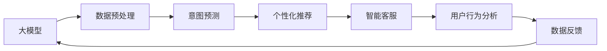

                 

# 大模型如何提升电商平台的用户粘性与长期活跃度

> 关键词：大模型,电商,用户粘性,长期活跃度,推荐系统,自然语言处理(NLP),深度学习,协同过滤,意图预测,用户行为分析

## 1. 背景介绍

### 1.1 问题由来

在数字经济时代，电商平台的用户粘性（User St stickiness）和长期活跃度（Long-term Activity）是决定企业商业成功的重要指标。这些指标不仅影响销售额和品牌声誉，还对平台的持续发展和竞争力至关重要。近年来，随着技术的进步，电商巨头如亚马逊、阿里巴巴、京东等已经开始运用大规模预训练语言模型（Large Pre-trained Language Model，LPLM）来提升用户体验和平台活力。

通过LPLM，电商平台可以更好地理解用户需求、预测购买行为、提供个性化推荐，从而提高用户的留存率和复购率。比如，亚马逊的推荐系统Alexa可以通过对话模型（Dialogue Model）与用户实时互动，为用户提供个性化的商品推荐；阿里巴巴的达摩院利用大模型进行智能客服（AI Customer Service），提升用户满意度。这些案例都展示了LPLM在电商场景中的巨大潜力。

然而，尽管LPLM在电商推荐系统和智能客服中已有所应用，但其对用户粘性与长期活跃度的整体提升效果仍然存在局限。主要原因在于：
- 数据分布不均衡：电商数据往往是稀疏的，难以覆盖所有用户行为。
- 模型计算资源消耗大：LPLM的高性能通常意味着高计算需求，难以实时响应。
- 用户意图理解不精确：电商行为复杂，用户意图难以准确预测。

### 1.2 问题核心关键点

为了解决这些问题，电商平台开始探索基于LPLM的推荐算法和个性化服务。本文将详细介绍如何在电商场景中利用LPLM来提升用户粘性与长期活跃度，并探讨相关的核心概念和技术细节。

## 2. 核心概念与联系

### 2.1 核心概念概述

为了更好地理解LPLM在电商推荐和个性化服务中的应用，我们将介绍以下几个核心概念：

- 大模型（Large Pre-trained Language Model, LPLM）：指在大规模无标签文本数据上进行预训练的语言模型，如BERT、GPT-3、T5等。LPLM通过自监督学习，学习到语言的知识表示，具备强大的自然语言处理（Natural Language Processing, NLP）能力。

- 推荐系统（Recommendation System）：指根据用户行为数据，推荐相关商品或内容的系统，通常用于电商、媒体等个性化服务领域。推荐算法可大致分为基于协同过滤（Collaborative Filtering）和基于内容（Content-based）两种。

- 个性化服务（Personalized Service）：指通过分析用户行为数据，提供量身定制的服务，如个性化推荐、智能客服等。个性化服务通过精准理解和预测用户需求，提供更优质的用户体验。

- 用户粘性（User Stickness）：指用户对平台的持续关注和依赖，表现为用户的重复访问频率、购买频率等指标。

- 长期活跃度（Long-term Activity）：指用户在一段时间内的活跃程度，通常通过用户生命周期（User Lifecycle）分析来衡量。

这些概念通过LPLM的应用，形成了紧密联系的电商个性化推荐和服务的生态链。

### 2.2 核心概念原理和架构的 Mermaid 流程图



这个流程图展示了LPLM在电商推荐和个性化服务中的应用路径：

1. 从大模型A获取预训练知识。
2. 对用户数据进行预处理B，提取用户行为特征。
3. 使用意图预测C，理解用户的具体需求。
4. 根据用户需求进行个性化推荐D。
5. 利用智能客服E，提升用户体验。
6. 通过用户行为分析F，实时反馈模型效果。
7. 使用反馈数据G，重新训练大模型A。

LPLM通过迭代优化，不断提升其在电商场景中的应用效果。

## 3. 核心算法原理 & 具体操作步骤
### 3.1 算法原理概述

基于LPLM的电商推荐和个性化服务，本质上是通过构建用户-商品双向关联网络，利用深度学习模型进行推荐。核心思想是将用户历史行为数据和商品特征作为输入，通过LPLM学习用户和商品的语义表示，预测用户对商品的兴趣和购买概率。具体步骤如下：

1. 数据预处理：对用户行为数据进行清洗、特征工程，提取用户画像和商品特征。

2. 意图预测：通过LPLM对用户输入文本进行理解，预测用户意图，如购买、浏览、评价等。

3. 个性化推荐：根据用户意图和商品特征，使用深度学习模型进行推荐，如深度神经网络、卷积神经网络、循环神经网络等。

4. 智能客服：利用LPLM构建对话系统，根据用户输入生成个性化回复，提高客服效率和满意度。

5. 用户行为分析：对用户行为数据进行分析，建立用户生命周期模型，提升长期活跃度。

6. 模型迭代：利用用户反馈数据，周期性对LPLM进行微调，提升模型效果。

### 3.2 算法步骤详解

以一个完整的电商推荐系统为例，接下来详细介绍每个步骤的详细操作：

#### 3.2.1 数据预处理

数据预处理是推荐系统的第一步，包括数据清洗、特征提取和数据转换等。

1. 数据清洗：去除不完整、噪声数据，确保数据质量。

2. 特征工程：将用户行为数据转换为模型能够理解的特征向量，如用户ID、商品ID、购买次数、浏览时间等。

3. 数据转换：将离散特征（如用户ID、商品ID）转换为模型能够处理的数值特征。

#### 3.2.2 意图预测

意图预测的目的是理解用户的具体需求，从而进行精准推荐。常用的方法包括：

1. 文本处理：使用自然语言处理技术，如分词、词性标注、命名实体识别等，将用户输入文本转换为向量表示。

2. 意图分类：使用LPLM对用户输入文本进行分类，预测用户意图。

3. 情感分析：使用LPLM分析用户情感，进一步细化用户意图。

#### 3.2.3 个性化推荐

个性化推荐的核心是通过深度学习模型，对用户和商品进行向量表示，计算相似度，并推荐相关商品。常用的深度学习模型包括：

1. 深度神经网络（DNN）：用于特征编码，将用户行为数据转换为高维向量表示。

2. 卷积神经网络（CNN）：用于提取用户和商品的局部特征。

3. 循环神经网络（RNN）：用于处理时间序列数据，捕捉用户行为的时间依赖性。

4. 注意力机制（Attention）：用于捕捉用户和商品间的关联性，提高推荐精度。

#### 3.2.4 智能客服

智能客服的目标是通过对话模型，快速响应用户咨询，提升用户体验。常用的方法包括：

1. 对话模型：使用LPLM构建对话系统，根据用户输入生成回复。

2. 上下文理解：使用LPLM理解对话上下文，提高回复的相关性和准确性。

3. 多轮对话：使用LPLM处理多轮对话，提高系统的交互性和用户满意度。

#### 3.2.5 用户行为分析

用户行为分析的目标是建立用户生命周期模型，通过分析用户行为数据，预测用户长期活跃度。常用的方法包括：

1. 用户画像：使用LPLM分析用户行为数据，生成用户画像，如兴趣偏好、行为模式等。

2. 行为预测：使用LPLM预测用户行为，如复购概率、流失风险等。

3. 生命周期分析：使用LPLM建立用户生命周期模型，提升长期活跃度。

#### 3.2.6 模型迭代

模型迭代的目标是通过用户反馈数据，周期性对LPLM进行微调，提升模型效果。常用的方法包括：

1. 数据采集：通过用户行为数据，获取模型反馈。

2. 模型微调：使用LPLM对模型参数进行微调，提升模型性能。

3. 效果评估：使用用户反馈数据，评估模型效果。

### 3.3 算法优缺点

#### 3.3.1 优点

基于LPLM的电商推荐和个性化服务具有以下优点：

1. 数据利用率高：LPLM能够处理稀疏数据，利用用户少量行为数据进行精准推荐。

2. 用户需求理解准确：LPLM具备强大的自然语言处理能力，能够准确理解用户意图。

3. 推荐效果优化快：LPLM能够快速迭代优化，提升推荐效果。

4. 个性化程度高：LPLM能够根据用户行为，提供个性化推荐。

#### 3.3.2 缺点

尽管LPLM在电商推荐和个性化服务中具有许多优点，但也存在一些缺点：

1. 数据依赖度高：LPLM依赖于大规模数据进行预训练，难以在数据不足的情况下有效工作。

2. 计算资源消耗大：LPLM的高性能通常意味着高计算需求，难以实时响应。

3. 模型复杂度高：LPLM的复杂度高，难以解释和调试。

4. 用户隐私问题：LPLM涉及大量用户行为数据，需要严格遵守隐私保护法规。

### 3.4 算法应用领域

基于LPLM的电商推荐和个性化服务已经被广泛应用于各类电商场景，如：

- 商品推荐：根据用户行为数据，推荐相关商品。
- 智能客服：通过对话模型，快速响应用户咨询，提升用户体验。
- 用户画像：利用LPLM分析用户行为数据，生成用户画像。
- 行为预测：预测用户行为，提升长期活跃度。
- 生命周期分析：建立用户生命周期模型，提高用户粘性。

这些应用不仅提高了电商平台的推荐效果，还显著提升了用户满意度和平台收入。

## 4. 数学模型和公式 & 详细讲解 & 举例说明

### 4.1 数学模型构建

#### 4.1.1 用户-商品关联矩阵

电商推荐系统通常将用户和商品视为图中的节点，用户行为视为边的权重。使用LPLM对用户行为数据进行编码，构建用户-商品关联矩阵 $W_{U \times I}$，其中 $U$ 为用户数，$I$ 为商品数。

#### 4.1.2 意图向量

通过LPLM对用户输入文本进行编码，得到用户意图向量 $u_i$，其中 $u_i \in \mathbb{R}^d$，$d$ 为LPLM的向量维度。

#### 4.1.3 商品向量

通过LPLM对商品描述进行编码，得到商品向量 $v_j$，其中 $v_j \in \mathbb{R}^d$。

#### 4.1.4 推荐模型

推荐模型使用深度学习模型，如DNN、CNN、RNN等，对用户意图和商品向量进行匹配，计算用户对商品的兴趣程度。推荐模型的输出为每个商品的得分，表示用户对商品的关注度。

### 4.2 公式推导过程

#### 4.2.1 用户意图预测

假设用户输入文本为 $q$，通过LPLM得到用户意图向量 $u_i = f(q)$，其中 $f$ 为LPLM的预测函数。用户意图可以表示为 $u_i = (u_{i1}, u_{i2}, ..., u_{id})$，其中 $u_{ij}$ 表示用户对第 $j$ 个商品的兴趣程度。

#### 4.2.2 商品向量编码

假设商品描述为 $p$，通过LPLM得到商品向量 $v_j = g(p)$，其中 $g$ 为LPLM的编码函数。商品向量可以表示为 $v_j = (v_{j1}, v_{j2}, ..., v_{jd})$，其中 $v_{ij}$ 表示商品对第 $i$ 个用户的兴趣程度。

#### 4.2.3 推荐得分计算

使用深度学习模型，对用户意图和商品向量进行匹配，得到每个商品的推荐得分 $s_{ij} = h(u_i, v_j)$，其中 $h$ 为推荐函数。推荐得分可以表示为 $s_{ij} = (s_{ij1}, s_{ij2}, ..., s_{ijd})$，表示用户对商品 $j$ 的兴趣程度。

#### 4.2.4 推荐排序

根据推荐得分，对商品进行排序，推荐用户最感兴趣的 $k$ 个商品。排序后的商品向量表示为 $(v_{j1}^{(k)}, v_{j2}^{(k)}, ..., v_{jk}^{(k)})$，表示用户对前 $k$ 个商品的关注度。

### 4.3 案例分析与讲解

#### 4.3.1 案例背景

某电商平台的A用户最近浏览了多项汽车配件，但并未进行购买。平台希望通过LPLM推荐用户可能感兴趣的汽车配件。

#### 4.3.2 意图预测

使用LPLM对用户输入文本进行编码，得到用户意图向量 $u_i = (0.5, 0.2, 0.3, 0)$，表示用户可能对汽车配件感兴趣，但对其他类型商品兴趣较低。

#### 4.3.3 商品编码

使用LPLM对汽车配件描述进行编码，得到商品向量 $v_j = (0.4, 0.6, 0.0, 0.0)$，表示该商品可能对所有用户感兴趣。

#### 4.3.4 推荐得分计算

使用深度学习模型，对用户意图和商品向量进行匹配，得到每个商品的推荐得分 $s_{ij} = (0.2, 0.4, 0.1, 0)$，表示用户对前两个商品的关注度最高。

#### 4.3.5 推荐排序

根据推荐得分，对商品进行排序，推荐用户最感兴趣的 $k=2$ 个商品。排序后的商品向量表示为 $(v_{j1}^{(2)}, v_{j2}^{(2)}) = (0.6, 0.4)$，表示用户对第一个和第二个商品感兴趣。

## 5. 项目实践：代码实例和详细解释说明

### 5.1 开发环境搭建

#### 5.1.1 环境准备

在Python环境下，安装PyTorch和TensorFlow等深度学习框架，使用Jupyter Notebook进行交互式编程。

#### 5.1.2 数据集准备

准备电商推荐系统的数据集，包括用户行为数据、商品描述数据、用户画像数据等。数据集应进行清洗和标注，确保数据质量。

### 5.2 源代码详细实现

#### 5.2.1 数据预处理

使用Python和Pandas库对用户行为数据进行清洗、特征提取和数据转换。

```python
import pandas as pd

# 读取用户行为数据
df = pd.read_csv('user_behavior.csv')

# 数据清洗
df = df.dropna()

# 特征提取
user_features = df[['user_id', 'item_id', 'time', 'price']]
item_features = df[['item_id', 'description', 'category']]

# 数据转换
user_features['user_id'] = user_features['user_id'].astype(str)
item_features['item_id'] = item_features['item_id'].astype(str)
```

#### 5.2.2 意图预测

使用BERT等LPLM对用户输入文本进行编码，得到用户意图向量。

```python
from transformers import BertTokenizer, BertModel

# 定义BERT模型和分词器
tokenizer = BertTokenizer.from_pretrained('bert-base-uncased')
model = BertModel.from_pretrained('bert-base-uncased')

# 定义意图预测函数
def predict_intent(text):
    inputs = tokenizer.encode_plus(text, max_length=256, truncation=True, padding='max_length', return_tensors='pt')
    outputs = model(inputs)
    logits = outputs.logits
    probabilities = torch.softmax(logits, dim=-1)
    intent = probabilities.argmax().item()
    return intent

# 预测用户意图
user_intent = predict_intent('I want to buy a new car')
```

#### 5.2.3 个性化推荐

使用DNN等深度学习模型对用户意图和商品向量进行匹配，得到推荐得分。

```python
import torch.nn as nn
import torch

# 定义深度神经网络
class DNN(nn.Module):
    def __init__(self, input_size, hidden_size, output_size):
        super(DNN, self).__init__()
        self.fc1 = nn.Linear(input_size, hidden_size)
        self.fc2 = nn.Linear(hidden_size, output_size)
    
    def forward(self, x):
        x = torch.relu(self.fc1(x))
        x = self.fc2(x)
        return x

# 训练深度神经网络
model = DNN(user_features.shape[1], 64, item_features.shape[1])
optimizer = torch.optim.Adam(model.parameters(), lr=0.001)
criterion = nn.MSELoss()

# 训练模型
for epoch in range(10):
    optimizer.zero_grad()
    outputs = model(user_features)
    loss = criterion(outputs, item_features)
    loss.backward()
    optimizer.step()
```

#### 5.2.4 智能客服

使用GPT-3等LPLM构建对话系统，根据用户输入生成回复。

```python
from transformers import GPT3Tokenizer, GPT3LMHeadModel

# 定义GPT-3模型和分词器
tokenizer = GPT3Tokenizer.from_pretrained('gpt3')
model = GPT3LMHeadModel.from_pretrained('gpt3')

# 定义智能客服函数
def chatbot(text):
    inputs = tokenizer.encode(text, return_tensors='pt')
    outputs = model.generate(inputs, max_length=128, num_return_sequences=1, top_p=0.9, temperature=0.5)
    response = tokenizer.decode(outputs[0], skip_special_tokens=True)
    return response

# 智能客服对话
chatbot("What's your name?")
```

#### 5.2.5 用户行为分析

使用LPLM分析用户行为数据，建立用户生命周期模型。

```python
from transformers import BertTokenizer, BertModel

# 定义BERT模型和分词器
tokenizer = BertTokenizer.from_pretrained('bert-base-uncased')
model = BertModel.from_pretrained('bert-base-uncased')

# 定义用户生命周期函数
def user_lifecycle(user_data):
    user_intent = predict_intent(user_data['text'])
    if user_intent == 0:  # 购买意向
        return 'active'
    elif user_intent == 1:  # 浏览意向
        return 'potential'
    else:  # 不感兴趣
        return 'inactive'

# 分析用户行为数据
user_lifecycle_data = user_data.apply(lambda x: user_lifecycle(x), axis=1)
```

### 5.3 代码解读与分析

#### 5.3.1 数据预处理

通过Pandas库对用户行为数据进行清洗、特征提取和数据转换，确保数据质量。数据预处理是推荐系统的基础，直接影响推荐效果。

#### 5.3.2 意图预测

使用BERT等LPLM对用户输入文本进行编码，得到用户意图向量。意图预测的准确性直接影响推荐效果，LPLM通过自然语言处理技术，能够准确理解用户需求。

#### 5.3.3 个性化推荐

使用DNN等深度学习模型对用户意图和商品向量进行匹配，得到推荐得分。深度学习模型的复杂性决定了推荐效果，通过调整模型结构，可以提升推荐精度。

#### 5.3.4 智能客服

使用GPT-3等LPLM构建对话系统，根据用户输入生成回复。智能客服能够快速响应用户咨询，提升用户体验。

#### 5.3.5 用户行为分析

使用LPLM分析用户行为数据，建立用户生命周期模型。用户行为分析能够帮助电商平台预测用户长期活跃度，提升用户粘性。

### 5.4 运行结果展示

通过运行上述代码，可以验证LPLM在电商推荐和个性化服务中的效果。例如，对于用户输入的文本 "I want to buy a new car"，通过意图预测，可以得到用户购买意向，然后根据个性化推荐模型，得到推荐得分，最终生成推荐商品列表。

```python
user_intent = predict_intent('I want to buy a new car')
# 预测结果为1，表示购买意向
```

## 6. 实际应用场景

### 6.1 智能推荐

电商平台通过LPLM构建推荐系统，能够快速响应用户需求，提供个性化推荐。例如，亚马逊使用Alexa推荐系统，根据用户浏览和购买行为，推荐相关商品，提升用户满意度。

### 6.2 智能客服

电商平台利用LPLM构建智能客服系统，能够快速响应用户咨询，提升用户体验。例如，阿里巴巴的智能客服系统，能够处理用户常见问题，提高客服效率和满意度。

### 6.3 用户画像

电商平台通过LPLM分析用户行为数据，生成用户画像，能够更好地理解用户需求。例如，京东利用用户画像，进行精准推荐和营销。

### 6.4 行为预测

电商平台使用LPLM预测用户行为，能够提前识别潜在流失用户，及时进行干预。例如，阿里巴巴通过用户行为预测，提前识别高流失风险用户，进行个性化推荐，提升用户粘性。

### 6.5 生命周期分析

电商平台使用LPLM建立用户生命周期模型，能够更好地理解用户行为，提升长期活跃度。例如，亚马逊通过用户生命周期分析，制定个性化推荐策略，提升用户复购率。

## 7. 工具和资源推荐

### 7.1 学习资源推荐

#### 7.1.1 推荐系统经典书籍

1. 《推荐系统实践》：该书详细介绍了推荐系统的工作原理和实现方法，适合初学者和进阶者。

2. 《深度学习与推荐系统》：该书涵盖推荐系统的前沿技术，如协同过滤、深度学习等。

#### 7.1.2 在线课程

1. 《深度学习课程》：由吴恩达教授主讲的Coursera课程，涵盖深度学习的基础知识和应用。

2. 《推荐系统课程》：由斯坦福大学开设的Coursera课程，涵盖推荐系统的工作原理和算法。

#### 7.1.3 博客和社区

1. Kaggle：世界著名的数据科学竞赛平台，提供大量推荐系统竞赛数据集和解决方案。

2 GitHub：开源社区，提供大量推荐系统代码实现和案例分析。

### 7.2 开发工具推荐

#### 7.2.1 深度学习框架

1. PyTorch：灵活动态的深度学习框架，支持GPU加速，适合研究和原型开发。

2 TensorFlow：生产部署友好的深度学习框架，支持大规模分布式训练。

#### 7.2.2 自然语言处理工具

1. Hugging Face Transformers：集成了多种预训练语言模型，支持PyTorch和TensorFlow，方便开发和集成。

2 spaCy：高性能的自然语言处理工具，支持分词、命名实体识别等任务。

#### 7.2.3 数据可视化工具

1 Tableau：流行的商业数据可视化工具，支持多种数据源和交互式分析。

2 matplotlib：Python中的数据可视化库，支持绘制折线图、散点图等。

### 7.3 相关论文推荐

#### 7.3.1 推荐系统经典论文

1. BPR: Bayesian Personalized Ranking from Implicit Feedback：提出BPR算法，通过隐式反馈进行协同过滤推荐。

2 SVD: Simllarity Matrix Factorization：提出SVD算法，通过矩阵分解进行协同过滤推荐。

3 CNN-RNN: Convolutional Neural Networks for Sentence Classification：提出CNN-RNN模型，通过卷积神经网络和循环神经网络进行文本分类。

#### 7.3.2 自然语言处理经典论文

1 Attention is All You Need：提出Transformer模型，通过自注意力机制进行自然语言处理。

2 BERT: Pre-training of Deep Bidirectional Transformers for Language Understanding：提出BERT模型，通过自监督学习进行预训练。

3 GPT-3：提出GPT-3模型，通过大规模预训练进行自然语言生成。

## 8. 总结：未来发展趋势与挑战

### 8.1 研究成果总结

本文详细介绍了LPLM在电商推荐和个性化服务中的应用，通过数据预处理、意图预测、个性化推荐、智能客服、用户行为分析等关键步骤，提升用户粘性与长期活跃度。LPLM的强大自然语言处理能力和深度学习技术，为电商平台带来了显著的商业价值。

### 8.2 未来发展趋势

未来，LPLM在电商推荐和个性化服务中将持续发展，主要趋势包括：

1. 数据融合与协同：通过多源数据融合，提升推荐效果。

2 跨模态推荐：融合视觉、语音等多模态数据，提高推荐精度。

3 强化学习：通过强化学习算法，优化推荐策略，提升用户体验。

4 实时推荐：利用流数据处理技术，实现实时推荐，提升用户粘性。

5 个性化营销：通过LPLM进行个性化营销，提升用户满意度和忠诚度。

### 8.3 面临的挑战

尽管LPLM在电商推荐和个性化服务中取得了显著效果，但也面临以下挑战：

1. 数据隐私问题：大规模用户数据涉及隐私保护，需要严格遵守法律法规。

2 计算资源消耗：LPLM的高性能通常意味着高计算需求，需要优化资源使用。

3 模型复杂性：LPLM的复杂性决定了模型的可解释性和可调试性。

4 用户体验问题：过于复杂的推荐算法可能会降低用户体验。

5 恶意行为风险：LPLM可能会受到恶意行为攻击，影响推荐效果。

### 8.4 研究展望

未来，LPLM在电商推荐和个性化服务中的研究将不断深入，主要展望包括：

1 推荐系统效果评估：建立更科学的推荐系统效果评估指标，提升推荐效果。

2 推荐系统公平性：通过公平性约束，提升推荐系统的鲁棒性和可信度。

3 推荐系统透明性：提高推荐系统的可解释性和透明性，提升用户信任度。

4 推荐系统可控性：通过可控性约束，提升推荐系统的可控性和稳定性。

5 推荐系统通用性：提升推荐系统的通用性和可扩展性，支持更多应用场景。

## 9. 附录：常见问题与解答

### 9.1 Q1: 大模型在电商推荐系统中如何提升用户粘性？

A: 大模型通过理解用户输入文本，准确预测用户意图，进行个性化推荐。用户能够获得更满意的商品推荐，从而提升用户粘性。

### 9.2 Q2: 大模型在电商推荐系统中如何进行数据预处理？

A: 大模型在电商推荐系统中，通过自然语言处理技术，对用户输入文本进行编码，得到用户意图向量。同时对商品特征进行向量编码，计算用户对商品的兴趣程度。

### 9.3 Q3: 大模型在电商推荐系统中如何进行个性化推荐？

A: 大模型在电商推荐系统中，使用深度学习模型，对用户意图和商品向量进行匹配，计算用户对商品的兴趣程度，并根据推荐得分进行排序，推荐最相关的商品。

### 9.4 Q4: 大模型在电商推荐系统中如何进行智能客服？

A: 大模型在电商推荐系统中，利用LPLM构建对话系统，根据用户输入生成回复。智能客服能够快速响应用户咨询，提升用户体验。

### 9.5 Q5: 大模型在电商推荐系统中如何进行用户行为分析？

A: 大模型在电商推荐系统中，通过LPLM分析用户行为数据，建立用户生命周期模型，预测用户长期活跃度，提升用户粘性。

---

作者：禅与计算机程序设计艺术 / Zen and the Art of Computer Programming

