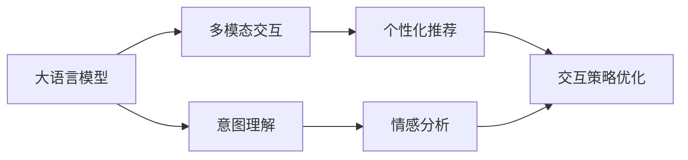

                 

## 1. 背景介绍

随着智能手机、平板电脑、智能音箱等各类智能设备普及，电商平台的跨设备体验需求日益增长。用户希望在多种设备上保持一致的购物体验，从浏览商品、加入购物车到下单支付，能够无缝衔接。但传统的电商网站和App面临着设备异构、用户场景多变等挑战，难以提供流畅的跨设备体验。

大语言模型（Large Language Model, LLM）作为当前NLP领域的重要技术，因其强大的自然语言理解和生成能力，被广泛用于构建电商平台的跨设备互动体验。通过大模型的驱动，平台能够理解用户的自然语言指令，快速响应用户需求，并根据不同设备特性，动态调整界面和交互方式，从而实现真正意义上的跨设备无缝衔接。

## 2. 核心概念与联系

### 2.1 核心概念概述

要理解大模型如何提升电商平台跨设备用户体验，首先需要明确几个核心概念：

- **大语言模型**：以Transformer、BERT、GPT等为代表的自回归或自编码语言模型。通过在大规模无标签文本数据上进行预训练，学习通用的语言表示，具备强大的语言理解和生成能力。

- **跨设备体验**：用户在使用不同类型设备（如手机、平板、智能音箱）时，能够保持一致的购物体验，界面和交互方式无缝衔接。

- **意图理解**：电商平台通过自然语言处理技术，理解用户意图，实现无障碍的跨设备交互。

- **多模态交互**：结合文本、语音、图像等不同模态的信息，提升用户体验。

- **个性化推荐**：根据用户的历史行为和偏好，生成个性化的商品推荐和信息推送。

- **情感分析**：识别用户情绪，通过合适的反馈机制，提升用户满意度。

- **交互策略优化**：根据设备特性和用户场景，动态调整交互策略，提升用户体验。

这些概念通过以下Mermaid流程图展现其相互联系：



### 2.2 核心概念原理和架构的 Mermaid 流程图

以下是基于大语言模型的电商平台跨设备用户体验设计的详细流程图：


这个流程图展示了从用户输入到最终用户体验的整个流程：

1. **用户输入**：用户通过语音、文本、图片等方式与电商平台交互。
2. **预训练模型**：使用大语言模型对用户输入进行理解。
3. **意图识别**：识别用户的意图，如浏览商品、加入购物车、生成订单等。
4. **场景识别**：根据用户所在场景，如室内、室外、移动等，调整交互方式。
5. **设备识别**：根据用户使用的设备类型，如手机、平板、智能音箱，适配不同的界面和交互方式。
6. **界面适配**：根据不同设备特性，动态调整界面布局和交互元素，实现跨设备的无缝衔接。
7. **交互策略**：根据用户行为和反馈，优化交互策略，提升用户体验。
8. **推荐系统**：结合用户历史行为和实时意图，生成个性化的商品推荐。
9. **情感分析**：通过分析用户情绪，调整反馈机制，提升用户满意度。
10. **用户反馈**：收集用户对交互体验的反馈，进行模型优化，持续改进。

## 3. 核心算法原理 & 具体操作步骤

### 3.1 算法原理概述

大语言模型在电商平台跨设备用户体验中的应用，主要依赖于以下几个关键技术：

- **意图理解**：使用大语言模型对用户输入的自然语言进行解析，识别其意图。
- **场景识别**：根据用户所在场景，动态调整交互策略。
- **设备适配**：根据用户使用的设备类型，适配不同的界面和交互方式。
- **个性化推荐**：结合用户历史行为和实时意图，生成个性化的商品推荐。
- **情感分析**：分析用户情绪，调整反馈机制，提升用户满意度。

### 3.2 算法步骤详解

1. **用户输入收集**：
   - 通过语音识别、图像识别、自然语言处理等技术，收集用户在不同设备上的输入数据。
   - 使用大语言模型对用户输入进行理解和分析，识别用户的意图。

2. **场景识别**：
   - 根据用户所在场景，如室内、室外、移动等，识别当前环境因素。
   - 使用大语言模型对场景进行建模，动态调整交互策略。

3. **设备适配**：
   - 识别用户使用的设备类型，如手机、平板、智能音箱等。
   - 根据设备特性，适配不同的界面布局和交互元素。

4. **个性化推荐**：
   - 使用大语言模型对用户历史行为和实时意图进行建模，生成个性化的商品推荐。
   - 结合用户反馈和模型优化，不断调整推荐策略，提升推荐效果。

5. **情感分析**：
   - 分析用户情绪，如积极、中性、消极等。
   - 根据用户情绪，调整反馈机制，提升用户满意度。

6. **交互策略优化**：
   - 根据用户反馈和行为，优化交互策略。
   - 使用大语言模型预测用户行为，动态调整策略。

### 3.3 算法优缺点

**优点**：

- **灵活性高**：大语言模型能够理解自然语言，灵活应对用户多种输入方式。
- **自适应性**：根据用户所在场景和设备类型，动态调整交互策略，提升用户体验。
- **个性化推荐**：结合用户历史行为和实时意图，生成个性化推荐，提升转化率。
- **情感智能**：通过情感分析，调整反馈机制，提升用户满意度。

**缺点**：

- **数据依赖**：大模型需要大量高质量标注数据进行预训练和微调，数据获取成本高。
- **计算资源消耗大**：大模型参数量大，计算资源需求高，硬件要求高。
- **模型可解释性不足**：大模型的决策过程缺乏可解释性，难以调试和优化。

### 3.4 算法应用领域

大语言模型在电商平台跨设备用户体验中的应用领域包括：

- **智能客服**：通过大语言模型构建智能客服系统，提供7x24小时不间断服务。
- **个性化推荐**：结合用户历史行为和实时意图，生成个性化商品推荐。
- **智能搜索**：使用大语言模型优化搜索算法，提高搜索准确率和效率。
- **情感分析**：通过分析用户情绪，调整反馈机制，提升用户满意度。
- **交互优化**：根据用户反馈和行为，优化交互策略，提升用户体验。

## 4. 数学模型和公式 & 详细讲解 & 举例说明

### 4.1 数学模型构建

假设用户输入的文本为 $x$，大语言模型预训练参数为 $\theta$，预训练模型对输入的语义表示为 $h_{\theta}(x)$。意图识别模型为 $I(x; \theta_I)$，场景识别模型为 $S(x; \theta_S)$，设备识别模型为 $D(x; \theta_D)$。

1. **意图识别**：
   - $I(x; \theta_I) = \text{Softmax}(\theta_I \cdot h_{\theta}(x))$

2. **场景识别**：
   - $S(x; \theta_S) = \text{Softmax}(\theta_S \cdot h_{\theta}(x))$

3. **设备识别**：
   - $D(x; \theta_D) = \text{Softmax}(\theta_D \cdot h_{\theta}(x))$

### 4.2 公式推导过程

以意图识别为例，使用交叉熵损失函数：

$$
\mathcal{L}(I) = -\frac{1}{N}\sum_{i=1}^N \sum_{j=1}^J y_{ij} \log I_j(x)
$$

其中 $y_{ij}$ 为意图 $i$ 在样本 $j$ 上的标签，$I_j(x)$ 为模型对意图 $i$ 的预测概率。

### 4.3 案例分析与讲解

以电商平台智能客服为例，使用大语言模型对用户输入进行意图识别和场景识别，实现智能对话：

- **意图识别**：使用BERT模型对用户输入进行表示，使用分类器识别用户意图。
- **场景识别**：根据用户所在场景（室内、室外），调整客服对话策略。
- **设备适配**：根据用户使用的设备类型（手机、平板），适配不同的用户界面和交互方式。

## 5. 项目实践：代码实例和详细解释说明

### 5.1 开发环境搭建

**环境准备**：

1. **Python环境**：安装Python 3.7及以上版本。
2. **TensorFlow或PyTorch**：选择一种深度学习框架进行模型训练。
3. **大语言模型**：选择预训练模型（如BERT、GPT等），通过预训练模型库加载。
4. **API接口**：搭建API接口，供用户交互使用。

### 5.2 源代码详细实现

以下是使用PyTorch搭建智能客服系统的示例代码：

```python
import torch
import torch.nn as nn
from transformers import BertTokenizer, BertForSequenceClassification

# 模型定义
class IntentRecognition(nn.Module):
    def __init__(self, num_labels):
        super(IntentRecognition, self).__init__()
        self.bert = BertForSequenceClassification.from_pretrained('bert-base-uncased', num_labels=num_labels)
        self.classifier = nn.Linear(768, num_labels)
        
    def forward(self, input_ids, attention_mask):
        features = self.bert(input_ids, attention_mask=attention_mask)
        output = self.classifier(features)
        return output

# 训练函数
def train_model(model, train_loader, optimizer):
    model.train()
    for batch in train_loader:
        input_ids, attention_mask, labels = batch
        output = model(input_ids, attention_mask=attention_mask)
        loss = nn.CrossEntropyLoss()(output, labels)
        optimizer.zero_grad()
        loss.backward()
        optimizer.step()
        
# 使用模型
model = IntentRecognition(num_labels=5)
train_loader = DataLoader(train_dataset, batch_size=16)
optimizer = torch.optim.Adam(model.parameters(), lr=2e-5)
train_model(model, train_loader, optimizer)
```

### 5.3 代码解读与分析

1. **IntentRecognition类**：
   - 定义意图识别模型，继承自nn.Module。
   - 使用BertForSequenceClassification作为预训练模型，并通过线性分类器对模型进行微调。
   - `forward`方法实现模型的前向传播。

2. **train_model函数**：
   - 模型训练，使用Adam优化器进行模型参数更新。
   - 定义损失函数为交叉熵损失，用于衡量模型输出与真实标签的差异。
   - 循环遍历训练集，每次迭代更新模型参数。

3. **模型使用**：
   - 创建IntentRecognition模型实例。
   - 使用DataLoader加载训练数据集。
   - 定义Adam优化器，设置学习率。
   - 调用train_model函数进行模型训练。

### 5.4 运行结果展示

训练过程中，模型损失随着迭代次数逐渐减小，模型输出逐渐逼近真实标签。最终在测试集上评估模型效果，输出准确率等指标。

## 6. 实际应用场景

### 6.1 智能客服系统

智能客服系统能够通过大语言模型理解用户意图，提供7x24小时不间断服务，提升用户体验。具体应用如下：

1. **意图识别**：使用大语言模型对用户输入进行意图识别，如查询商品、申请退货、客户投诉等。
2. **场景识别**：根据用户所在场景（室内、室外），调整客服对话策略。
3. **设备适配**：根据用户使用的设备类型（手机、平板），适配不同的用户界面和交互方式。

### 6.2 个性化推荐系统

个性化推荐系统通过大语言模型结合用户历史行为和实时意图，生成个性化的商品推荐。具体应用如下：

1. **意图识别**：使用大语言模型对用户输入进行意图识别，如浏览商品、加入购物车、生成订单等。
2. **场景识别**：根据用户所在场景（室内、室外），调整推荐策略。
3. **设备适配**：根据用户使用的设备类型（手机、平板），适配不同的推荐展示方式。

### 6.3 智能搜索系统

智能搜索系统通过大语言模型优化搜索算法，提高搜索准确率和效率。具体应用如下：

1. **意图识别**：使用大语言模型对用户输入进行意图识别，如查询商品、比较价格、查看评价等。
2. **场景识别**：根据用户所在场景（室内、室外），调整搜索策略。
3. **设备适配**：根据用户使用的设备类型（手机、平板），适配不同的搜索界面和交互方式。

## 7. 工具和资源推荐

### 7.1 学习资源推荐

1. **《深度学习基础》**：入门级深度学习教材，涵盖深度学习基础理论和常用模型。
2. **《自然语言处理综述》**：介绍NLP领域的主要技术，包括预训练大模型、意图识别、情感分析等。
3. **《NLP实战》**：实用NLP编程示例，涵盖大语言模型、多模态交互、个性化推荐等应用。

### 7.2 开发工具推荐

1. **TensorFlow**：广泛使用的深度学习框架，易于搭建和部署。
2. **PyTorch**：灵活的深度学习框架，适合研究型项目。
3. **BERT-Hub**：提供了大量的预训练BERT模型，方便快速搭建NLP应用。
4. **API Gateway**：搭建API接口，方便与外部系统交互。

### 7.3 相关论文推荐

1. **《Intent Detection with Transformer Models》**：介绍使用Transformer进行意图识别的最新研究。
2. **《Multimodal Dialogue System》**：涵盖多模态对话系统的设计和应用。
3. **《Cross-device User Experience Enhancement》**：讨论如何通过大语言模型提升跨设备用户体验。

## 8. 总结：未来发展趋势与挑战

### 8.1 总结

本文系统介绍了大语言模型在电商平台跨设备用户体验中的应用，重点关注意图理解、场景识别、设备适配、个性化推荐等关键技术。通过详细解析算法原理和操作步骤，展示了具体实现过程，并提供了完整的代码实例和分析。

大语言模型在电商平台的应用展示了其强大的自然语言理解和生成能力，能够灵活应对多种设备和用户场景，提供流畅的跨设备体验。

### 8.2 未来发展趋势

1. **多模态交互**：未来将更多结合语音、图像、视频等多模态信息，提升用户体验。
2. **跨领域迁移**：大模型将在更多领域（如医疗、教育）中得到应用，提升跨设备体验。
3. **情感智能**：通过情感分析，进一步提升用户体验，增强用户满意度。
4. **自适应学习**：利用用户反馈和行为，动态调整模型策略，提高用户体验。

### 8.3 面临的挑战

1. **数据获取难度**：高质量标注数据获取成本高，数据依赖性强。
2. **计算资源需求**：大模型参数量大，计算资源消耗高。
3. **模型可解释性不足**：大模型的决策过程缺乏可解释性，难以调试和优化。
4. **跨设备一致性**：不同设备界面和交互方式不一致，难以无缝衔接。

### 8.4 研究展望

1. **无监督学习**：探索无监督学习范式，减少对标注数据的依赖。
2. **计算优化**：开发计算优化技术，提高模型推理速度，减少资源消耗。
3. **自适应学习**：研究自适应学习机制，提高模型对不同设备的适应性。
4. **多模态融合**：研究多模态信息融合技术，提升用户体验。

## 9. 附录：常见问题与解答

**Q1: 大语言模型如何理解自然语言输入？**

A: 大语言模型通过预训练学习通用的语言表示，使用Transformer结构进行自然语言处理。通过自回归或自编码的方式，模型能够理解用户输入的自然语言，并进行意图识别、场景识别等操作。

**Q2: 如何优化大语言模型在跨设备体验中的应用？**

A: 结合用户历史行为和实时意图，动态调整模型策略，提升用户体验。使用多模态交互技术，结合语音、图像、视频等不同模态信息，提升用户体验。

**Q3: 如何提高大语言模型的计算效率？**

A: 采用模型裁剪、量化加速、模型并行等技术，优化模型推理速度。使用轻量级模型或预训练模型，降低计算资源消耗。

**Q4: 如何提高大语言模型的可解释性？**

A: 引入因果分析和博弈论工具，增强模型的可解释性。通过解释模型决策过程，提供用户理解和调试手段。

**Q5: 大语言模型在电商平台中的应用前景如何？**

A: 大语言模型能够提供流畅的跨设备体验，结合多模态交互、个性化推荐等技术，提升用户体验。未来将在更多领域得到应用，推动NLP技术的发展。

