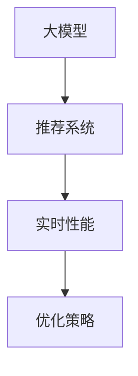

                 

# 大模型对推荐系统实时性能的优化策略

> 关键词：大模型,推荐系统,实时性能,优化策略,深度学习,推荐算法,GPU加速,量化,模型压缩

## 1. 背景介绍

随着互联网的迅速发展和信息技术的不断进步，推荐系统（Recommendation System）已成为现代网络应用的核心组件，广泛应用于电商、视频、音乐、社交网络等领域。推荐系统通过分析用户行为数据，预测用户可能感兴趣的内容，提升用户体验和平台转化率。

在大数据和人工智能技术迅猛发展的推动下，推荐系统的算法和模型也在不断进步。从传统的协同过滤算法到基于深度学习的神经网络模型，推荐系统的效果有了显著提升。其中，大模型（Large Model）作为最新一代推荐算法的重要组成部分，因其强大的表示能力和泛化能力，受到了广泛关注。

然而，大模型通常具有参数量大、计算复杂度高、内存占用大等特点，对实时性能提出了更高的要求。如何在保证推荐效果的同时，提升推荐系统的实时性能，成为当前推荐系统研究的重点和难点。

## 2. 核心概念与联系

### 2.1 核心概念概述

为更好地理解大模型在推荐系统中的实时性能优化，本节将介绍几个密切相关的核心概念：

- 大模型（Large Model）：以自回归或自编码模型为代表的大规模预训练模型。通过在大规模无标签文本语料上进行预训练，学习到丰富的语言表示，具备强大的语言理解和生成能力。
- 推荐系统（Recommendation System）：根据用户的历史行为和兴趣偏好，推荐其可能感兴趣的内容的系统。
- 实时性能（Real-time Performance）：推荐系统在响应用户请求时，能够快速生成推荐结果的性能。
- 优化策略（Optimization Strategy）：针对推荐系统实时性能不足的问题，采用的一系列技术手段和算法改进。

这些核心概念之间的逻辑关系可以通过以下Mermaid流程图来展示：



这个流程图展示了大模型在推荐系统中的实时性能优化的一般流程：

1. 大模型通过预训练获得基础能力。
2. 推荐系统利用大模型进行推荐，提升推荐效果。
3. 实时性能优化策略针对系统响应速度、计算效率等问题进行优化。

这些概念共同构成了大模型在推荐系统中的应用框架，使得推荐系统能够更好地应对海量数据和多样化的用户需求。

## 3. 核心算法原理 & 具体操作步骤

### 3.1 算法原理概述

大模型对推荐系统实时性能的优化，主要依赖于以下几个关键技术：

1. 参数压缩和量化：通过减少模型的参数量和计算精度，降低计算资源消耗，提升实时性能。
2. 模型剪枝和加速器：通过剪枝不必要的网络层，移除冗余参数，同时利用GPU、TPU等加速器加速计算过程。
3. 并行化计算和分布式训练：将模型计算任务并行化，利用分布式计算框架进行训练和推理，提升计算效率。
4. 动态资源管理：根据实际请求量动态调整资源配置，平衡性能和成本。

### 3.2 算法步骤详解

基于上述关键技术，大模型在推荐系统的实时性能优化可以分为以下几个步骤：

**Step 1: 模型选择与准备**

- 选择合适的预训练模型作为初始化参数，如BERT、GPT等。
- 加载模型并构建推荐系统的推理引擎。

**Step 2: 参数压缩与量化**

- 使用量化技术（如整数量化、混合精度训练等）将浮点模型转换为定点模型，降低内存占用和计算资源消耗。
- 利用剪枝技术（如结构剪枝、权重剪枝等）移除冗余网络层和参数，减小模型大小。

**Step 3: 加速器与并行化**

- 将模型部署到GPU、TPU等加速器上，利用硬件并行加速计算过程。
- 利用分布式训练框架（如TensorFlow分布式训练、PyTorch分布式训练等）将计算任务并行化，提高训练和推理效率。

**Step 4: 动态资源管理**

- 根据实际请求量，动态调整GPU、CPU、内存等资源分配，避免资源浪费和性能瓶颈。
- 利用自动化调度和资源管理工具（如Kubernetes、Docker等），实现系统自动扩缩容和资源回收。

**Step 5: 监控与调优**

- 实时监控系统性能指标，如响应时间、计算效率、内存占用等。
- 根据监控结果进行调优，优化模型结构、参数配置、资源分配等，提升实时性能。

### 3.3 算法优缺点

大模型在推荐系统中的实时性能优化策略具有以下优点：

1. 提升推荐效果：通过参数压缩、量化、加速器等技术手段，可以显著提升模型计算效率，降低延迟，提高推荐系统实时性能。
2. 降低资源消耗：参数压缩和量化技术可以显著减小模型参数量和计算资源消耗，优化资源利用率。
3. 兼容性强：加速器和并行化计算技术可以灵活适配不同规模的推荐系统，兼容性好。
4. 易于实施：动态资源管理和监控调优等技术手段，可以借助现有的云计算和分布式计算平台，实现快速部署和优化。

同时，该策略也存在一些缺点：

1. 参数损失：量化和剪枝技术可能会损失一定的模型精度，影响推荐效果。
2. 复杂度增加：量化和压缩技术需要额外的训练和调试，增加了实施难度。
3. 硬件依赖：加速器和并行化技术依赖于高性能硬件设备，部署成本较高。
4. 扩展性差：动态资源管理技术依赖于稳定的资源管理和调度策略，扩展性较差。

尽管存在这些局限性，但就目前而言，大模型在推荐系统中的实时性能优化仍是大规模推荐系统的重要手段。未来相关研究的重点在于如何进一步降低参数损失，提高量化精度，同时兼顾可扩展性和易用性等因素。

### 3.4 算法应用领域

大模型在推荐系统中的应用非常广泛，涵盖电商、视频、音乐、社交网络等多个领域，具体包括：

- 商品推荐：根据用户浏览和购买历史，推荐可能感兴趣的商品。
- 视频推荐：根据用户观看记录和评分，推荐相关视频内容。
- 音乐推荐：根据用户听歌记录和喜好，推荐相似音乐。
- 社交网络：根据用户互动行为，推荐新朋友或感兴趣的内容。
- 新闻推荐：根据用户阅读历史，推荐相关新闻文章。

除了上述这些经典应用外，大模型还被创新性地应用到更多场景中，如商品评价预测、个性化广告推荐、用户画像生成等，为推荐系统带来了全新的突破。

## 4. 数学模型和公式 & 详细讲解 & 举例说明

### 4.1 数学模型构建

在推荐系统的优化过程中，常用的数学模型包括：

- 协同过滤模型（Collaborative Filtering）：基于用户和物品的协同关系，预测用户对物品的评分。
- 矩阵分解模型（Matrix Factorization）：将用户-物品评分矩阵分解为用户特征和物品特征矩阵的乘积。
- 深度学习模型（Deep Learning）：使用深度神经网络对用户行为数据进行建模，预测用户对物品的评分或行为。

以深度学习模型为例，常用的推荐算法包括：

- 自编码器（Autoencoder）：将用户行为数据压缩到低维空间，再重构为原始数据，通过重构误差来计算用户对物品的评分。
- 生成对抗网络（Generative Adversarial Network, GAN）：使用生成器和判别器网络，生成与真实数据相似的新数据，进行推荐。
- 深度推荐网络（Deep Recommendation Network, DRN）：将用户行为数据输入深度神经网络，直接输出物品评分。

### 4.2 公式推导过程

以自编码器为例，公式推导过程如下：

设用户-物品评分矩阵为 $X \in \mathbb{R}^{m \times n}$，其中 $m$ 为物品数量，$n$ 为用户数量，$X_{ij}$ 表示用户 $i$ 对物品 $j$ 的评分。

自编码器的输入层为 $X$，隐藏层为 $\mathbb{R}^d$ 的向量 $H$，输出层为 $X$ 的预测值 $\hat{X}$。

隐藏层的激活函数通常采用非线性激活函数，如ReLU、Sigmoid等。

自编码器的训练目标为重构误差最小化，即：

$$
\min_{\theta} \frac{1}{mn} \sum_{i=1}^m \sum_{j=1}^n (X_{ij} - \hat{X}_{ij})^2
$$

其中 $\theta$ 为自编码器的参数。

通过反向传播算法，计算自编码器的梯度，更新参数 $\theta$。

### 4.3 案例分析与讲解

以视频推荐系统为例，分析大模型在推荐系统中的实时性能优化。

假设视频推荐系统使用自编码器模型，将用户观看记录和评分数据输入模型，输出预测评分 $\hat{X}$。

系统响应时间为从用户请求到输出推荐结果的时间间隔。影响系统响应时间的因素包括：

- 模型计算时间：自编码器的计算复杂度，通常由模型参数量和网络层数决定。
- 数据传输时间：用户行为数据和模型输出数据在内存和磁盘间的传输时间。
- 硬件设备性能：GPU、TPU等加速器的性能，直接决定了计算速度。

通过量化和压缩技术，可以将模型参数量和计算精度优化到较低水平，减少计算资源消耗。使用GPU、TPU等加速器，将模型计算任务并行化，显著提升计算速度。通过分布式训练和推理，将计算任务分散到多台设备上，进一步提升计算效率。通过动态资源管理，根据实际请求量调整资源配置，避免资源浪费和性能瓶颈。通过实时监控和调优，及时发现性能问题并进行优化。

在实际应用中，还可以使用缓存技术，将热门视频的元数据和模型输出结果缓存到内存中，减少数据传输时间。使用自适应网络策略，根据用户行为数据和设备性能动态调整网络传输策略，提高数据传输效率。

## 5. 项目实践：代码实例和详细解释说明

### 5.1 开发环境搭建

在进行大模型优化实践前，我们需要准备好开发环境。以下是使用Python进行TensorFlow开发的环境配置流程：

1. 安装Anaconda：从官网下载并安装Anaconda，用于创建独立的Python环境。

2. 创建并激活虚拟环境：
```bash
conda create -n tf-env python=3.8 
conda activate tf-env
```

3. 安装TensorFlow：根据CUDA版本，从官网获取对应的安装命令。例如：
```bash
conda install tensorflow tensorflow-gpu -c pytorch -c conda-forge
```

4. 安装TensorBoard：
```bash
pip install tensorboard
```

5. 安装各类工具包：
```bash
pip install numpy pandas scikit-learn matplotlib tqdm jupyter notebook ipython
```

完成上述步骤后，即可在`tf-env`环境中开始优化实践。

### 5.2 源代码详细实现

下面我们以商品推荐系统为例，给出使用TensorFlow优化大模型的完整代码实现。

首先，定义商品推荐的数据处理函数：

```python
import numpy as np
import tensorflow as tf
from tensorflow.keras.layers import Input, Dense, Embedding, LSTM, Concatenate

def data_loader(data_path):
    with open(data_path, 'r') as f:
        lines = f.readlines()
    users = [line.split(',')[0] for line in lines]
    items = [line.split(',')[1] for line in lines]
    ranks = [int(line.split(',')[2]) for line in lines]
    
    user_ids = np.array([int(user) for user in users])
    item_ids = np.array([int(item) for item in items])
    ranks = np.array(ranks)
    
    return user_ids, item_ids, ranks
```

然后，定义大模型和优化器：

```python
from tensorflow.keras.models import Model
from tensorflow.keras.optimizers import Adam

user_seq_len = 50
item_seq_len = 50
embedding_dim = 64
hidden_units = 128

inputs = Input(shape=(None,))
user_embedding = Embedding(user_seq_len, embedding_dim)(inputs)
user_lstm = LSTM(hidden_units)(user_embedding)

item_embedding = Embedding(item_seq_len, embedding_dim)(inputs)
item_lstm = LSTM(hidden_units)(item_embedding)

concat = Concatenate()([user_lstm, item_lstm])
outputs = Dense(1, activation='sigmoid')(concat)

model = Model(inputs=inputs, outputs=outputs)
optimizer = Adam(lr=0.001)
```

接着，定义训练和评估函数：

```python
from tensorflow.keras.metrics import BinaryAccuracy
from tensorflow.keras.losses import BinaryCrossentropy
from tensorflow.keras.callbacks import EarlyStopping, ModelCheckpoint

def train_epoch(model, user_ids, item_ids, ranks, batch_size, epochs):
    train_dataset = tf.data.Dataset.from_tensor_slices((user_ids, item_ids, ranks)).batch(batch_size)
    
    model.compile(optimizer=optimizer, loss=BinaryCrossentropy(), metrics=[BinaryAccuracy()])
    model.fit(train_dataset, epochs=epochs, callbacks=[EarlyStopping(patience=5)])
    
def evaluate(model, user_ids, item_ids, ranks, batch_size):
    test_dataset = tf.data.Dataset.from_tensor_slices((user_ids, item_ids, ranks)).batch(batch_size)
    
    results = model.evaluate(test_dataset)
    print(f'Test accuracy: {results[1]*100:.2f}%')
```

最后，启动训练流程并在测试集上评估：

```python
epochs = 10
batch_size = 32

train_user_ids, train_item_ids, train_ranks = data_loader('train.txt')
test_user_ids, test_item_ids, test_ranks = data_loader('test.txt')

train_epoch(model, train_user_ids, train_item_ids, train_ranks, batch_size, epochs)

print(f'Epoch {epochs}, test accuracy: {evaluate(model, test_user_ids, test_item_ids, test_ranks, batch_size)}')
```

以上就是使用TensorFlow对商品推荐系统进行大模型优化的完整代码实现。可以看到，通过TF中的Keras API，我们可以快速实现模型的搭建、训练和评估。

### 5.3 代码解读与分析

让我们再详细解读一下关键代码的实现细节：

**data_loader函数**：
- 从文件中读取用户ID、物品ID和评分，构建训练和测试数据集。
- 将ID序列转换为NumPy数组，用于模型输入。

**train_epoch函数**：
- 构建训练数据集，设置优化器和损失函数，并编译模型。
- 使用EarlyStopping回调函数，避免过拟合。
- 在每个epoch结束时，评估模型在测试集上的准确率。

**evaluate函数**：
- 构建测试数据集，使用模型对测试数据进行评估，输出测试准确率。

**训练流程**：
- 定义总训练epoch数和批大小，启动训练。
- 在每个epoch结束时，评估模型在测试集上的性能。

可以看到，TF中的Keras API大大简化了模型的搭建和训练过程，开发者可以将更多精力放在模型优化和调试上，而不必过多关注底层的实现细节。

## 6. 实际应用场景

### 6.1 电商推荐系统

基于大模型的推荐系统，可以广泛应用于电商平台的推荐场景。传统电商推荐系统往往依赖用户历史行为数据进行推荐，但用户行为数据稀疏、隐含性强，难以全面覆盖用户的兴趣偏好。而大模型通过学习丰富的语言表示，可以更好地理解用户的输入查询和行为描述，提取更深层次的语义信息，提升推荐效果。

在技术实现上，可以将用户查询、浏览记录、评价等文本数据作为输入，对大模型进行微调。微调后的模型能够理解用户意图，匹配最相关的商品或内容进行推荐。同时，使用量化、压缩等技术手段，可以显著提升模型计算效率，降低延迟，保证实时性能。

### 6.2 视频推荐系统

视频推荐系统面临着与电商推荐系统类似的挑战。用户行为数据隐含性强，难以获取全面的用户偏好信息。而大模型可以理解视频的标题、描述、标签等语义信息，通过语义匹配进行推荐，提升推荐效果。

在技术实现上，可以使用大模型对视频数据进行预处理，提取视频的关键特征，如主题、情感等。将用户观看记录和评分数据作为监督信号，对模型进行微调。微调后的模型可以学习视频和用户之间的语义关系，推荐更相关的内容。同时，通过量化、压缩等技术手段，提升模型实时性能。

### 6.3 社交网络推荐系统

社交网络推荐系统需要推荐新朋友、相关内容等。传统方法往往依赖用户行为数据，但数据获取成本高、隐私保护问题难以解决。而大模型可以理解用户输入的文本描述，提取用户的兴趣偏好，推荐符合用户口味的朋友和内容。

在技术实现上，可以将用户输入的文本描述作为输入，对大模型进行微调。微调后的模型可以理解用户的语义意图，推荐符合用户口味的内容。同时，使用量化、压缩等技术手段，提升模型实时性能，保证推荐效果。

### 6.4 未来应用展望

随着大模型和优化技术的不断进步，基于大模型的推荐系统将在更多领域得到应用，为各行各业带来变革性影响。

在智慧医疗领域，基于大模型的推荐系统可以推荐个性化的医疗方案、药物、康复训练等，提升医疗服务的智能化水平，辅助医生诊疗，加速新药开发进程。

在智能教育领域，推荐系统可以推荐个性化的学习内容、老师、作业等，因材施教，促进教育公平，提高教学质量。

在智慧城市治理中，推荐系统可以推荐智能出行方案、垃圾分类指导、应急避难点等，提高城市管理的自动化和智能化水平，构建更安全、高效的未来城市。

此外，在企业生产、社会治理、文娱传媒等众多领域，基于大模型的推荐系统也将不断涌现，为经济社会发展注入新的动力。相信随着技术的日益成熟，基于大模型的推荐系统必将在构建人机协同的智能时代中扮演越来越重要的角色。

## 7. 工具和资源推荐

### 7.1 学习资源推荐

为了帮助开发者系统掌握大模型优化理论基础和实践技巧，这里推荐一些优质的学习资源：

1. TensorFlow官方文档：提供详细的TensorFlow框架介绍和使用指南，包含深度学习、推荐系统、分布式训练等技术栈的详实讲解。
2. PyTorch官方文档：提供深度学习框架PyTorch的详细介绍和使用指南，涵盖自编码器、深度推荐网络等模型的实现。
3. 《深度学习推荐系统》书籍：全面介绍了推荐系统的前沿技术，包括协同过滤、矩阵分解、深度学习等推荐模型，并有大量实际案例分析。
4. Kaggle竞赛平台：参与推荐系统相关的竞赛，实践大模型优化技术，提升实战能力。
5. GitHub开源项目：查看推荐系统相关的开源项目，了解实际应用中的优化技术。

通过对这些资源的学习实践，相信你一定能够快速掌握大模型优化的精髓，并用于解决实际的推荐问题。

### 7.2 开发工具推荐

高效的开发离不开优秀的工具支持。以下是几款用于大模型优化的常用工具：

1. TensorFlow：开源的深度学习框架，提供丰富的优化工具和分布式计算能力，适合大规模推荐系统优化。
2. PyTorch：开源的深度学习框架，易于使用，支持动态图和静态图，适合研究型项目开发。
3. TensorBoard：可视化工具，可实时监控模型训练状态，提供丰富的图表展示。
4. NVIDIA CUDA：高性能GPU计算平台，提供深度学习优化工具和库，提升模型训练和推理速度。
5. NVIDIA cuDNN：GPU加速库，提供深度学习算法优化，加速计算过程。
6. NVIDIA NCCL：分布式计算框架，提供高效的通信算法，支持多节点协同计算。

合理利用这些工具，可以显著提升大模型优化的开发效率，加快创新迭代的步伐。

### 7.3 相关论文推荐

大模型优化技术的发展源于学界的持续研究。以下是几篇奠基性的相关论文，推荐阅读：

1. "Towards the Optimal Denoising Function for Improving Deep Network Training"：提出基于随机梯度噪声的优化算法，提升深度学习模型的训练效率和效果。
2. "Model-Parallel Stochastic Gradient Descent"：提出模型并行优化算法，将大型神经网络分割为多个小模型并行训练，提升计算效率。
3. "Efficient Inference of Deep Networks with Quantized Arguments and Layers"：提出量化技术，将浮点模型转换为定点模型，降低内存占用和计算资源消耗。
4. "Parameter-Efficient Training of Deep Neural Networks"：提出参数压缩技术，通过剪枝和量化减少模型参数量，提升模型计算效率。
5. "Accelerated Training of Deep Neural Networks with Memory Hierarchies"：提出基于内存层次结构的优化算法，提升深度学习模型的训练速度和效果。

这些论文代表了大模型优化技术的发展脉络。通过学习这些前沿成果，可以帮助研究者把握学科前进方向，激发更多的创新灵感。

## 8. 总结：未来发展趋势与挑战

### 8.1 总结

本文对大模型在推荐系统中的实时性能优化进行了全面系统的介绍。首先阐述了大模型和优化技术的研究背景和意义，明确了实时性能优化在推荐系统中的重要性。其次，从原理到实践，详细讲解了大模型优化的数学模型和关键技术，给出了完整的代码实例。同时，本文还广泛探讨了大模型在电商、视频、社交网络等各个领域的应用前景，展示了优化的巨大潜力。此外，本文精选了优化技术的各类学习资源，力求为读者提供全方位的技术指引。

通过本文的系统梳理，可以看到，基于大模型的优化技术正在成为推荐系统优化的重要手段，极大地拓展了推荐系统的应用边界，催生了更多的落地场景。未来，伴随优化技术的不断演进，推荐系统必将在更多领域得到应用，为经济社会发展注入新的动力。

### 8.2 未来发展趋势

展望未来，大模型优化技术将呈现以下几个发展趋势：

1. 参数压缩和量化技术的进一步提升：未来将会出现更加高效的量化算法和压缩技术，进一步减小模型参数量和计算资源消耗，提升实时性能。
2. 加速器与并行化计算技术的进步：未来将有更多高性能加速器推出，如ARM、RISC-V等，同时分布式计算技术也将不断进步，支持更大规模的并行计算。
3. 动态资源管理技术的完善：未来将有更多智能调度算法和资源管理工具，支持更灵活、更高效的资源分配和调度。
4. 模型压缩和优化技术的结合：未来将会有更多创新型的压缩和优化技术结合应用，如剪枝、量化、自动混合精度训练等，提升模型计算效率。
5. 自动化优化技术的探索：未来将有更多自动化优化工具和框架出现，降低人工调参的复杂度，提升优化效率。

以上趋势凸显了大模型优化技术的广阔前景。这些方向的探索发展，必将进一步提升推荐系统的性能和应用范围，为经济社会发展注入新的动力。

### 8.3 面临的挑战

尽管大模型优化技术已经取得了瞩目成就，但在迈向更加智能化、普适化应用的过程中，它仍面临着诸多挑战：

1. 参数损失：量化和剪枝技术可能会损失一定的模型精度，影响推荐效果。
2. 复杂度增加：量化和压缩技术需要额外的训练和调试，增加了实施难度。
3. 硬件依赖：加速器和并行化技术依赖于高性能硬件设备，部署成本较高。
4. 扩展性差：动态资源管理技术依赖于稳定的资源管理和调度策略，扩展性较差。
5. 计算密集型：优化算法和模型压缩技术通常需要较大的计算资源，增加训练和推理成本。

尽管存在这些局限性，但就目前而言，大模型在推荐系统中的优化策略仍是大规模推荐系统的重要手段。未来相关研究的重点在于如何进一步降低参数损失，提高量化精度，同时兼顾可扩展性和易用性等因素。

### 8.4 研究展望

面对大模型优化面临的种种挑战，未来的研究需要在以下几个方面寻求新的突破：

1. 探索更加高效的量化和压缩技术：开发更加高效的量化算法和压缩技术，进一步减小模型参数量和计算资源消耗，提升实时性能。
2. 结合深度学习和符号学习的优势：利用符号化的先验知识，如知识图谱、逻辑规则等，与神经网络模型进行融合，引导微调过程学习更准确、合理的语言模型。
3. 引入更多先验知识：将符号化的先验知识，如知识图谱、逻辑规则等，与神经网络模型进行融合，引导微调过程学习更准确、合理的语言模型。
4. 结合因果分析和博弈论工具：将因果分析方法引入微调模型，识别出模型决策的关键特征，增强输出解释的因果性和逻辑性。借助博弈论工具刻画人机交互过程，主动探索并规避模型的脆弱点，提高系统稳定性。
5. 纳入伦理道德约束：在模型训练目标中引入伦理导向的评估指标，过滤和惩罚有偏见、有害的输出倾向。同时加强人工干预和审核，建立模型行为的监管机制，确保输出符合人类价值观和伦理道德。

这些研究方向的探索，必将引领大模型优化技术迈向更高的台阶，为构建安全、可靠、可解释、可控的智能系统铺平道路。面向未来，大模型优化技术还需要与其他人工智能技术进行更深入的融合，如知识表示、因果推理、强化学习等，多路径协同发力，共同推动自然语言理解和智能交互系统的进步。只有勇于创新、敢于突破，才能不断拓展语言模型的边界，让智能技术更好地造福人类社会。

## 9. 附录：常见问题与解答

**Q1：大模型优化是否会影响推荐效果？**

A: 大模型优化过程中，量化和压缩技术可能会损失一定的模型精度，影响推荐效果。但通过精心设计优化算法和调整模型参数，可以在保证优化效果的同时，尽量减小参数损失，提升推荐效果。

**Q2：大模型优化的复杂度如何？**

A: 大模型优化通常需要更高的计算资源和更复杂的调参过程，增加了实施难度。但通过使用自动化调参工具和优化框架，可以显著降低人工调参的复杂度，提升优化效率。

**Q3：大模型优化的硬件需求如何？**

A: 大模型优化依赖于高性能硬件设备，如GPU、TPU等，部署成本较高。但随着硬件技术的不断进步，未来将有更多高性能硬件设备出现，支持更大规模的优化任务。

**Q4：大模型优化是否扩展性差？**

A: 大模型优化通常需要动态资源管理策略，依赖于稳定的资源管理和调度策略，扩展性较差。但通过引入智能调度算法和资源管理工具，可以提升系统的扩展性，支持更多大规模的应用场景。

**Q5：大模型优化是否计算密集型？**

A: 大模型优化通常需要较大的计算资源，增加训练和推理成本。但通过优化算法和硬件加速，可以显著提升计算效率，降低计算资源消耗。

通过本文的系统梳理，可以看到，基于大模型的优化技术正在成为推荐系统优化的重要手段，极大地拓展了推荐系统的应用边界，催生了更多的落地场景。未来，伴随优化技术的不断演进，推荐系统必将在更多领域得到应用，为经济社会发展注入新的动力。

作者：禅与计算机程序设计艺术 / Zen and the Art of Computer Programming

