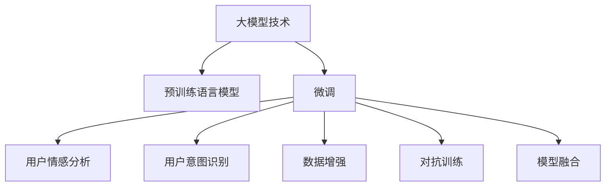

                 

# 大模型技术在电商平台商品评价分析中的应用

> 关键词：大模型技术, 商品评价分析, 自然语言处理, 电商平台, 用户情感分析, 用户意图识别, 数据增强, 对抗训练, 模型融合

## 1. 背景介绍

### 1.1 问题由来
随着电子商务的蓬勃发展，电商平台成为了消费者获取商品信息、进行购物决策的重要渠道。在各大电商平台上，商品评价是用户获取产品反馈、筛选商品的重要参考。通过分析大量商品评价数据，电商平台不仅可以了解用户的满意度和偏好，还可以指导商家优化产品和服务，提升用户体验。然而，传统的文本分析方法往往难以处理大规模的无结构文本数据，且效果有限。近年来，大模型技术（Large Model Technology）在自然语言处理（NLP）领域取得了突破性进展，被广泛应用于商品评价分析（Product Review Analysis）。

### 1.2 问题核心关键点
大模型技术在商品评价分析中的应用主要基于预训练语言模型（Pre-trained Language Model），该模型通过在海量文本数据上进行自监督预训练，学习到了广泛的语言知识和表示能力。通过微调（Fine-tuning），大模型可以适应特定的商品评价分析任务，实现高质量的用户情感分析、用户意图识别等功能。本节将从大模型的原理、算法步骤、应用领域、优缺点等方面，详细讲解其在电商平台商品评价分析中的应用。

### 1.3 问题研究意义
研究大模型技术在商品评价分析中的应用，对电商平台的业务优化和用户满意度提升具有重要意义：

1. **提升商品评价质量**：大模型可以自动分析海量的用户评价，提取有效的评价信息，提升评价质量。
2. **优化商品推荐**：基于用户评价，大模型可以精准识别用户需求，指导电商平台的商品推荐算法，提升用户购物体验。
3. **预警商品风险**：通过分析负面评价，大模型可以识别潜在的商品问题，提前预警商家，避免风险扩大。
4. **挖掘用户反馈**：大模型可以深入挖掘用户对商品功能和服务的反馈，指导商家改进产品。
5. **数据驱动决策**：基于分析结果，电商平台可以制定更加精准的市场策略，提升整体运营效率。

## 2. 核心概念与联系

### 2.1 核心概念概述

为更好地理解大模型技术在商品评价分析中的应用，本节将介绍几个关键概念：

- **大模型技术（Large Model Technology）**：指基于Transformer架构和深度学习模型的大规模预训练语言模型，如BERT、GPT-3等。通过在海量文本数据上进行自监督预训练，学习到广泛的语义表示能力。

- **预训练语言模型（Pre-trained Language Model）**：指在大规模无标签文本数据上，通过自监督学习任务训练得到的通用语言模型，如BERT、GPT等。

- **微调（Fine-tuning）**：指在预训练模型的基础上，使用特定任务的标注数据，通过有监督学习优化模型在该任务上的性能。

- **用户情感分析（User Sentiment Analysis）**：指通过分析用户评价文本，识别用户对商品的情感倾向（正面、负面、中性），评估商品的用户满意度。

- **用户意图识别（User Intent Recognition）**：指通过分析用户评价文本，识别用户的购买意图（购买、退换货、投诉等），指导电商平台进行精准推荐和用户体验优化。

- **数据增强（Data Augmentation）**：指通过文本生成、回译等方式，丰富训练集的多样性，提升模型的泛化能力。

- **对抗训练（Adversarial Training）**：指在模型训练过程中引入对抗样本，提高模型的鲁棒性和泛化能力。

- **模型融合（Model Ensemble）**：指将多个预训练模型或微调模型的输出进行融合，提升整体性能。

这些核心概念之间的逻辑关系可以通过以下Mermaid流程图来展示：



这个流程图展示了大模型技术在商品评价分析中的核心概念及其关系：

1. 大模型技术通过预训练获得通用语言表示能力。
2. 微调在大模型基础上，针对特定的商品评价分析任务进行优化。
3. 用户情感分析和用户意图识别是微调后的模型在商品评价分析中的主要应用场景。
4. 数据增强和对抗训练是提升模型性能的关键技术手段。
5. 模型融合可以在多个预训练模型或微调模型间进行，提高整体预测精度。

## 3. 核心算法原理 & 具体操作步骤
### 3.1 算法原理概述

大模型技术在商品评价分析中的应用，本质上是一个基于监督学习的微调过程。其核心思想是：将预训练的大模型视为一个强大的"特征提取器"，通过在商品评价标注数据上进行有监督的微调，使得模型输出能够匹配任务标签，从而获得针对特定商品评价分析任务的优化模型。

形式化地，假设预训练语言模型为 $M_{\theta}$，其中 $\theta$ 为预训练得到的模型参数。给定商品评价任务 $T$ 的标注数据集 $D=\{(x_i, y_i)\}_{i=1}^N$，其中 $x_i$ 为商品评价文本，$y_i$ 为评价标签（如正面、负面、中性），微调的目标是找到新的模型参数 $\hat{\theta}$，使得：

$$
\hat{\theta}=\mathop{\arg\min}_{\theta} \mathcal{L}(M_{\theta},D)
$$

其中 $\mathcal{L}$ 为针对商品评价任务设计的损失函数，用于衡量模型预测输出与真实标签之间的差异。常见的损失函数包括交叉熵损失、均方误差损失等。

通过梯度下降等优化算法，微调过程不断更新模型参数 $\theta$，最小化损失函数 $\mathcal{L}$，使得模型输出逼近真实标签。由于 $\theta$ 已经通过预训练获得了较好的初始化，因此即便在标注数据规模有限的情况下，微调过程也能较快收敛到理想的模型参数 $\hat{\theta}$。

### 3.2 算法步骤详解

基于监督学习的大模型技术在商品评价分析中的应用，一般包括以下几个关键步骤：

**Step 1: 准备预训练模型和数据集**
- 选择合适的预训练语言模型 $M_{\theta}$ 作为初始化参数，如 BERT、GPT等。
- 准备商品评价任务 $T$ 的标注数据集 $D$，划分为训练集、验证集和测试集。一般要求标注数据与预训练数据的分布不要差异过大。

**Step 2: 添加任务适配层**
- 根据任务类型，在预训练模型顶层设计合适的输出层和损失函数。
- 对于情感分析任务，通常在顶层添加线性分类器和交叉熵损失函数。
- 对于意图识别任务，通常使用序列标注模型，使用交叉熵损失函数。

**Step 3: 设置微调超参数**
- 选择合适的优化算法及其参数，如 AdamW、SGD 等，设置学习率、批大小、迭代轮数等。
- 设置正则化技术及强度，包括权重衰减、Dropout、Early Stopping 等。
- 确定冻结预训练参数的策略，如仅微调顶层，或全部参数都参与微调。

**Step 4: 执行梯度训练**
- 将训练集数据分批次输入模型，前向传播计算损失函数。
- 反向传播计算参数梯度，根据设定的优化算法和学习率更新模型参数。
- 周期性在验证集上评估模型性能，根据性能指标决定是否触发 Early Stopping。
- 重复上述步骤直到满足预设的迭代轮数或 Early Stopping 条件。

**Step 5: 测试和部署**
- 在测试集上评估微调后模型 $M_{\hat{\theta}}$ 的性能，对比微调前后的精度提升。
- 使用微调后的模型对新样本进行推理预测，集成到实际的商品评价分析系统中。
- 持续收集新的商品评价数据，定期重新微调模型，以适应数据分布的变化。

以上是基于监督学习微调大模型技术在商品评价分析中的应用的一般流程。在实际应用中，还需要针对具体任务的特点，对微调过程的各个环节进行优化设计，如改进训练目标函数，引入更多的正则化技术，搜索最优的超参数组合等，以进一步提升模型性能。

### 3.3 算法优缺点

基于监督学习的大模型技术在商品评价分析中的应用，具有以下优点：

1. **准确性高**：利用大模型的语言理解能力，能够高效、准确地分析商品评价，识别用户情感和意图。
2. **泛化能力强**：大模型通过预训练学习到广泛的语义表示能力，在小规模标注数据下仍能取得较好的泛化性能。
3. **可扩展性好**：通过微调，大模型可以适应不同商品评价分析任务，实现任务之间的无缝切换。
4. **实时性高**：大模型的推理速度快，能够实时处理商品评价，支持电商平台的动态推荐和预警。

同时，该方法也存在一些局限性：

1. **标注成本高**：商品评价标注需要大量的人工工作，成本较高。
2. **数据偏见**：预训练模型可能存在数据偏见，导致商品评价分析结果也存在偏差。
3. **计算资源需求大**：大模型的计算资源需求大，特别是在微调阶段，需要高性能的GPU或TPU支持。
4. **可解释性不足**：大模型的内部决策过程难以解释，用户难以理解模型的工作机制。
5. **模型迁移能力有限**：预训练模型可能难以适应特定领域的数据，迁移能力有限。

尽管存在这些局限性，但大模型技术在商品评价分析中的应用，已经展示出了强大的潜力，值得进一步研究和推广。

### 3.4 算法应用领域

大模型技术在商品评价分析中的应用，已经覆盖了电商平台的多个方面，如：

- **用户情感分析**：分析用户对商品的正面、负面和中性评价，评估商品的用户满意度。
- **用户意图识别**：识别用户的购买意图（如购买、退换货、投诉等），指导电商平台进行精准推荐和用户体验优化。
- **商品推荐**：基于用户评价，识别用户对商品功能和服务的反馈，指导电商平台的商品推荐算法。
- **风险预警**：通过分析负面评价，识别潜在的商品问题，提前预警商家，避免风险扩大。
- **市场洞察**：分析大量的用户评价数据，挖掘用户对商品和服务的整体反馈，指导电商平台的市场策略。

除了这些常见的应用场景外，大模型技术还可以被创新性地应用于更多场景中，如舆情监控、广告投放优化、客户服务智能答复等，为电商平台带来新的突破。

## 4. 数学模型和公式 & 详细讲解 & 举例说明

### 4.1 数学模型构建

本节将使用数学语言对大模型技术在商品评价分析中的应用进行更加严格的刻画。

记预训练语言模型为 $M_{\theta}$，其中 $\theta$ 为预训练得到的模型参数。假设商品评价任务 $T$ 的训练集为 $D=\{(x_i, y_i)\}_{i=1}^N, x_i \in \mathcal{X}, y_i \in \{1,0\}$，其中 $x_i$ 为商品评价文本，$y_i$ 为评价标签（1表示正面，0表示负面）。

定义模型 $M_{\theta}$ 在输入 $x_i$ 上的损失函数为 $\ell(M_{\theta}(x_i),y_i)$，则在数据集 $D$ 上的经验风险为：

$$
\mathcal{L}(\theta) = \frac{1}{N}\sum_{i=1}^N \ell(M_{\theta}(x_i),y_i)
$$

微调的优化目标是最小化经验风险，即找到最优参数：

$$
\theta^* = \mathop{\arg\min}_{\theta} \mathcal{L}(\theta)
$$

在实践中，我们通常使用基于梯度的优化算法（如SGD、AdamW等）来近似求解上述最优化问题。设 $\eta$ 为学习率，$\lambda$ 为正则化系数，则参数的更新公式为：

$$
\theta \leftarrow \theta - \eta \nabla_{\theta}\mathcal{L}(\theta) - \eta\lambda\theta
$$

其中 $\nabla_{\theta}\mathcal{L}(\theta)$ 为损失函数对参数 $\theta$ 的梯度，可通过反向传播算法高效计算。

### 4.2 公式推导过程

以下我们以二分类任务为例，推导交叉熵损失函数及其梯度的计算公式。

假设模型 $M_{\theta}$ 在输入 $x_i$ 上的输出为 $\hat{y}=M_{\theta}(x_i) \in [0,1]$，表示商品评价文本属于正类的概率。真实标签 $y_i \in \{1,0\}$。则二分类交叉熵损失函数定义为：

$$
\ell(M_{\theta}(x_i),y_i) = -[y_i\log \hat{y} + (1-y_i)\log (1-\hat{y})]
$$

将其代入经验风险公式，得：

$$
\mathcal{L}(\theta) = -\frac{1}{N}\sum_{i=1}^N [y_i\log M_{\theta}(x_i)+(1-y_i)\log(1-M_{\theta}(x_i))]
$$

根据链式法则，损失函数对参数 $\theta_k$ 的梯度为：

$$
\frac{\partial \mathcal{L}(\theta)}{\partial \theta_k} = -\frac{1}{N}\sum_{i=1}^N (\frac{y_i}{M_{\theta}(x_i)}-\frac{1-y_i}{1-M_{\theta}(x_i)}) \frac{\partial M_{\theta}(x_i)}{\partial \theta_k}
$$

其中 $\frac{\partial M_{\theta}(x_i)}{\partial \theta_k}$ 可进一步递归展开，利用自动微分技术完成计算。

在得到损失函数的梯度后，即可带入参数更新公式，完成模型的迭代优化。重复上述过程直至收敛，最终得到适应商品评价任务的最优模型参数 $\theta^*$。

## 5. 项目实践：代码实例和详细解释说明
### 5.1 开发环境搭建

在进行商品评价分析微调实践前，我们需要准备好开发环境。以下是使用Python进行PyTorch开发的环境配置流程：

1. 安装Anaconda：从官网下载并安装Anaconda，用于创建独立的Python环境。

2. 创建并激活虚拟环境：
```bash
conda create -n pytorch-env python=3.8 
conda activate pytorch-env
```

3. 安装PyTorch：根据CUDA版本，从官网获取对应的安装命令。例如：
```bash
conda install pytorch torchvision torchaudio cudatoolkit=11.1 -c pytorch -c conda-forge
```

4. 安装Transformers库：
```bash
pip install transformers
```

5. 安装各类工具包：
```bash
pip install numpy pandas scikit-learn matplotlib tqdm jupyter notebook ipython
```

完成上述步骤后，即可在`pytorch-env`环境中开始商品评价分析微调实践。

### 5.2 源代码详细实现

下面我们以情感分析任务为例，给出使用Transformers库对BERT模型进行商品评价分析微调的PyTorch代码实现。

首先，定义情感分析任务的数据处理函数：

```python
from transformers import BertTokenizer
from torch.utils.data import Dataset
import torch

class ReviewDataset(Dataset):
    def __init__(self, reviews, labels, tokenizer, max_len=128):
        self.reviews = reviews
        self.labels = labels
        self.tokenizer = tokenizer
        self.max_len = max_len
        
    def __len__(self):
        return len(self.reviews)
    
    def __getitem__(self, item):
        review = self.reviews[item]
        label = self.labels[item]
        
        encoding = self.tokenizer(review, return_tensors='pt', max_length=self.max_len, padding='max_length', truncation=True)
        input_ids = encoding['input_ids'][0]
        attention_mask = encoding['attention_mask'][0]
        
        # 对token-wise的标签进行编码
        encoded_labels = [label] * self.max_len
        labels = torch.tensor(encoded_labels, dtype=torch.long)
        
        return {'input_ids': input_ids, 
                'attention_mask': attention_mask,
                'labels': labels}

# 标签与id的映射
label2id = {1: 0, 0: 1}

# 创建dataset
tokenizer = BertTokenizer.from_pretrained('bert-base-cased')

train_dataset = ReviewDataset(train_reviews, train_labels, tokenizer)
dev_dataset = ReviewDataset(dev_reviews, dev_labels, tokenizer)
test_dataset = ReviewDataset(test_reviews, test_labels, tokenizer)
```

然后，定义模型和优化器：

```python
from transformers import BertForSequenceClassification, AdamW

model = BertForSequenceClassification.from_pretrained('bert-base-cased', num_labels=2)

optimizer = AdamW(model.parameters(), lr=2e-5)
```

接着，定义训练和评估函数：

```python
from torch.utils.data import DataLoader
from tqdm import tqdm
from sklearn.metrics import accuracy_score, f1_score, precision_score, recall_score

device = torch.device('cuda') if torch.cuda.is_available() else torch.device('cpu')
model.to(device)

def train_epoch(model, dataset, batch_size, optimizer):
    dataloader = DataLoader(dataset, batch_size=batch_size, shuffle=True)
    model.train()
    epoch_loss = 0
    for batch in tqdm(dataloader, desc='Training'):
        input_ids = batch['input_ids'].to(device)
        attention_mask = batch['attention_mask'].to(device)
        labels = batch['labels'].to(device)
        model.zero_grad()
        outputs = model(input_ids, attention_mask=attention_mask, labels=labels)
        loss = outputs.loss
        epoch_loss += loss.item()
        loss.backward()
        optimizer.step()
    return epoch_loss / len(dataloader)

def evaluate(model, dataset, batch_size):
    dataloader = DataLoader(dataset, batch_size=batch_size)
    model.eval()
    preds, labels = [], []
    with torch.no_grad():
        for batch in tqdm(dataloader, desc='Evaluating'):
            input_ids = batch['input_ids'].to(device)
            attention_mask = batch['attention_mask'].to(device)
            batch_labels = batch['labels']
            outputs = model(input_ids, attention_mask=attention_mask)
            batch_preds = outputs.logits.argmax(dim=1).to('cpu').tolist()
            batch_labels = batch_labels.to('cpu').tolist()
            for pred, label in zip(batch_preds, batch_labels):
                preds.append(pred)
                labels.append(label)
                
    print('Accuracy:', accuracy_score(labels, preds))
    print('F1 Score:', f1_score(labels, preds))
    print('Precision:', precision_score(labels, preds))
    print('Recall:', recall_score(labels, preds))
```

最后，启动训练流程并在测试集上评估：

```python
epochs = 5
batch_size = 16

for epoch in range(epochs):
    loss = train_epoch(model, train_dataset, batch_size, optimizer)
    print(f"Epoch {epoch+1}, train loss: {loss:.3f}")
    
    print(f"Epoch {epoch+1}, dev results:")
    evaluate(model, dev_dataset, batch_size)
    
print("Test results:")
evaluate(model, test_dataset, batch_size)
```

以上就是使用PyTorch对BERT进行情感分析任务微调的完整代码实现。可以看到，得益于Transformers库的强大封装，我们可以用相对简洁的代码完成BERT模型的加载和微调。

### 5.3 代码解读与分析

让我们再详细解读一下关键代码的实现细节：

**ReviewDataset类**：
- `__init__`方法：初始化商品评价文本、标签、分词器等关键组件。
- `__len__`方法：返回数据集的样本数量。
- `__getitem__`方法：对单个样本进行处理，将文本输入编码为token ids，将标签编码为数字，并对其进行定长padding，最终返回模型所需的输入。

**label2id字典**：
- 定义了标签与数字id之间的映射关系，用于将token-wise的预测结果解码回真实的标签。

**训练和评估函数**：
- 使用PyTorch的DataLoader对数据集进行批次化加载，供模型训练和推理使用。
- 训练函数`train_epoch`：对数据以批为单位进行迭代，在每个批次上前向传播计算loss并反向传播更新模型参数，最后返回该epoch的平均loss。
- 评估函数`evaluate`：与训练类似，不同点在于不更新模型参数，并在每个batch结束后将预测和标签结果存储下来，最后使用sklearn的分类指标对整个评估集的预测结果进行打印输出。

**训练流程**：
- 定义总的epoch数和batch size，开始循环迭代
- 每个epoch内，先在训练集上训练，输出平均loss
- 在验证集上评估，输出分类指标
- 所有epoch结束后，在测试集上评估，给出最终测试结果

可以看到，PyTorch配合Transformers库使得BERT微调的代码实现变得简洁高效。开发者可以将更多精力放在数据处理、模型改进等高层逻辑上，而不必过多关注底层的实现细节。

当然，工业级的系统实现还需考虑更多因素，如模型的保存和部署、超参数的自动搜索、更灵活的任务适配层等。但核心的微调范式基本与此类似。

## 6. 实际应用场景
### 6.1 电商平台的商品评价分析

基于大模型技术的商品评价分析，已经广泛应用于各大电商平台的业务优化中。传统的商品评价分析方法依赖人工标注，成本高、效率低，且效果有限。大模型技术通过自动分析海量商品评价数据，可以显著提升评价质量和分析效率，帮助电商平台进行精准的商品推荐和市场策略制定。

**具体应用场景包括：**

- **用户情感分析**：自动分析用户对商品的正面、负面和中性评价，评估商品的用户满意度。电商平台可以根据情感分析结果，进行商品优化和调整。
- **用户意图识别**：识别用户的购买意图（如购买、退换货、投诉等），指导电商平台进行精准推荐和用户体验优化。
- **商品推荐**：基于用户评价，识别用户对商品功能和服务的反馈，指导电商平台的商品推荐算法。
- **风险预警**：通过分析负面评价，识别潜在的商品问题，提前预警商家，避免风险扩大。
- **市场洞察**：分析大量的用户评价数据，挖掘用户对商品和服务的整体反馈，指导电商平台的市场策略。

### 6.2 智能客服系统

大模型技术还被应用于电商平台的智能客服系统中，提升客服系统的自动化水平和用户体验。传统的客服系统依赖人工，高峰期响应缓慢，且一致性和专业性难以保证。基于大模型技术的智能客服系统，可以7x24小时不间断服务，快速响应客户咨询，用自然流畅的语言解答各类常见问题。

具体应用场景包括：

- **问题解答**：自动分析客户咨询，匹配最佳答复模板进行回复。
- **意图识别**：识别客户的咨询意图，引导客户快速进入解决问题的流程。
- **情感分析**：分析客户咨询的情感倾向，及时发现负面情绪，进行干预和处理。
- **知识库查询**：自动从知识库中提取相关信息，帮助客服人员解答复杂问题。

### 6.3 风险管理

大模型技术在电商平台的应用，还可以用于风险管理。电商平台需要实时监测市场舆论动向，以便及时应对负面信息传播，规避金融风险。

具体应用场景包括：

- **舆情监控**：自动分析网络文本数据，识别负面情感和舆情变化趋势，提前预警风险。
- **危机管理**：识别危机事件和负面舆情，及时进行干预和处理，控制风险扩散。
- **情感分析**：分析用户对商品和服务的情感倾向，及时调整市场策略，避免负面影响。

## 7. 工具和资源推荐
### 7.1 学习资源推荐

为了帮助开发者系统掌握大模型技术在商品评价分析中的应用，这里推荐一些优质的学习资源：

1. **《Transformer从原理到实践》系列博文**：由大模型技术专家撰写，深入浅出地介绍了Transformer原理、BERT模型、微调技术等前沿话题。

2. **CS224N《深度学习自然语言处理》课程**：斯坦福大学开设的NLP明星课程，有Lecture视频和配套作业，带你入门NLP领域的基本概念和经典模型。

3. **《Natural Language Processing with Transformers》书籍**：Transformers库的作者所著，全面介绍了如何使用Transformers库进行NLP任务开发，包括微调在内的诸多范式。

4. **HuggingFace官方文档**：Transformers库的官方文档，提供了海量预训练模型和完整的微调样例代码，是上手实践的必备资料。

5. **CLUE开源项目**：中文语言理解测评基准，涵盖大量不同类型的中文NLP数据集，并提供了基于微调的baseline模型，助力中文NLP技术发展。

通过对这些资源的学习实践，相信你一定能够快速掌握大模型技术在商品评价分析中的应用，并用于解决实际的NLP问题。
###  7.2 开发工具推荐

高效的开发离不开优秀的工具支持。以下是几款用于大模型技术在商品评价分析中的开发工具：

1. **PyTorch**：基于Python的开源深度学习框架，灵活动态的计算图，适合快速迭代研究。大部分预训练语言模型都有PyTorch版本的实现。

2. **TensorFlow**：由Google主导开发的开源深度学习框架，生产部署方便，适合大规模工程应用。同样有丰富的预训练语言模型资源。

3. **Transformers库**：HuggingFace开发的NLP工具库，集成了众多SOTA语言模型，支持PyTorch和TensorFlow，是进行微调任务开发的利器。

4. **Weights & Biases**：模型训练的实验跟踪工具，可以记录和可视化模型训练过程中的各项指标，方便对比和调优。与主流深度学习框架无缝集成。

5. **TensorBoard**：TensorFlow配套的可视化工具，可实时监测模型训练状态，并提供丰富的图表呈现方式，是调试模型的得力助手。

6. **Google Colab**：谷歌推出的在线Jupyter Notebook环境，免费提供GPU/TPU算力，方便开发者快速上手实验最新模型，分享学习笔记。

合理利用这些工具，可以显著提升大模型技术在商品评价分析中的开发效率，加快创新迭代的步伐。

### 7.3 相关论文推荐

大模型技术在商品评价分析中的应用，得益于学界的持续研究。以下是几篇奠基性的相关论文，推荐阅读：

1. **Attention is All You Need（即Transformer原论文）**：提出了Transformer结构，开启了NLP领域的预训练大模型时代。

2. **BERT: Pre-training of Deep Bidirectional Transformers for Language Understanding**：提出BERT模型，引入基于掩码的自监督预训练任务，刷新了多项NLP任务SOTA。

3. **Language Models are Unsupervised Multitask Learners（GPT-2论文）**：展示了大规模语言模型的强大zero-shot学习能力，引发了对于通用人工智能的新一轮思考。

4. **Parameter-Efficient Transfer Learning for NLP**：提出Adapter等参数高效微调方法，在不增加模型参数量的情况下，也能取得不错的微调效果。

5. **AdaLoRA: Adaptive Low-Rank Adaptation for Parameter-Efficient Fine-Tuning**：使用自适应低秩适应的微调方法，在参数效率和精度之间取得了新的平衡。

这些论文代表了大模型技术在商品评价分析中的应用进展。通过学习这些前沿成果，可以帮助研究者把握学科前进方向，激发更多的创新灵感。

## 8. 总结：未来发展趋势与挑战

### 8.1 总结

本文对大模型技术在电商平台商品评价分析中的应用进行了全面系统的介绍。首先阐述了电商平台商品评价分析的背景和意义，明确了大模型技术在其中的独特价值。其次，从原理到实践，详细讲解了大模型技术在商品评价分析中的数学原理和关键步骤，给出了微调任务开发的完整代码实例。同时，本文还广泛探讨了大模型技术在智能客服、风险管理等多个领域的应用前景，展示了其在电商平台中的广泛应用。

通过本文的系统梳理，可以看到，大模型技术在商品评价分析中的应用，已经展示出了强大的潜力，成为电商平台业务优化和用户体验提升的重要手段。未来，伴随大模型技术和大数据技术的不断发展，基于大模型技术的商品评价分析技术必将迎来更大的突破，为电商平台带来更多的机遇和挑战。

### 8.2 未来发展趋势

展望未来，大模型技术在商品评价分析中的应用将呈现以下几个发展趋势：

1. **模型的规模持续增大**：随着算力成本的下降和数据规模的扩张，预训练语言模型的参数量还将持续增长。超大规模语言模型蕴含的丰富语言知识，有望支撑更加复杂多变的商品评价分析任务。

2. **微调方法的日趋多样**：除了传统的全参数微调外，未来会涌现更多参数高效的微调方法，如Prefix-Tuning、LoRA等，在节省计算资源的同时也能保证微调精度。

3. **持续学习成为常态**：随着数据分布的不断变化，微调模型也需要持续学习新知识以保持性能。如何在不遗忘原有知识的同时，高效吸收新样本信息，将成为重要的研究课题。

4. **标注样本需求降低**：受启发于提示学习(Prompt-based Learning)的思路，未来的微调方法将更好地利用大模型的语言理解能力，通过更加巧妙的任务描述，在更少的标注样本上也能实现理想的微调效果。

5. **多模态微调崛起**：当前的大模型技术主要聚焦于纯文本数据，未来会进一步拓展到图像、视频、语音等多模态数据微调。多模态信息的融合，将显著提升语言模型对现实世界的理解和建模能力。

6. **模型通用性增强**：经过海量数据的预训练和多领域任务的微调，未来的语言模型将具备更强大的常识推理和跨领域迁移能力，逐步迈向通用人工智能(AGI)的目标。

以上趋势凸显了大模型技术在商品评价分析中的广阔前景。这些方向的探索发展，必将进一步提升商品评价分析的性能和应用范围，为电商平台带来更大的价值。

### 8.3 面临的挑战

尽管大模型技术在商品评价分析中的应用已经取得了瞩目成就，但在迈向更加智能化、普适化应用的过程中，它仍面临着诸多挑战：

1. **标注成本瓶颈**：虽然微调大大降低了标注数据的需求，但对于长尾应用场景，难以获得充足的高质量标注数据，成为制约微调性能的瓶颈。如何进一步降低微调对标注样本的依赖，将是一大难题。

2. **模型鲁棒性不足**：当前微调模型面对域外数据时，泛化性能往往大打折扣。对于测试样本的微小扰动，微调模型的预测也容易发生波动。如何提高微调模型的鲁棒性，避免灾难性遗忘，还需要更多理论和实践的积累。

3. **推理效率有待提高**：大规模语言模型虽然精度高，但在实际部署时往往面临推理速度慢、内存占用大等效率问题。如何在保证性能的同时，简化模型结构，提升推理速度，优化资源占用，将是重要的优化方向。

4. **可解释性亟需加强**：当前微调模型更像是"黑盒"系统，难以解释其内部工作机制和决策逻辑。对于医疗、金融等高风险应用，算法的可解释性和可审计性尤为重要。如何赋予微调模型更强的可解释性，将是亟待攻克的难题。

5. **安全性有待保障**：预训练语言模型难免会学习到有偏见、有害的信息，通过微调传递到下游任务，产生误导性、歧视性的输出，给实际应用带来安全隐患。如何从数据和算法层面消除模型偏见，避免恶意用途，确保输出的安全性，也将是重要的研究课题。

6. **知识整合能力不足**：现有的微调模型往往局限于任务内数据，难以灵活吸收和运用更广泛的先验知识。如何让微调过程更好地与外部知识库、规则库等专家知识结合，形成更加全面、准确的信息整合能力，还有很大的想象空间。

正视微调面临的这些挑战，积极应对并寻求突破，将是大模型技术在商品评价分析中走向成熟的必由之路。相信随着学界和产业界的共同努力，这些挑战终将一一被克服，大模型技术必将在构建人机协同的智能时代中扮演越来越重要的角色。

### 8.4 研究展望

面向未来，大模型技术在商品评价分析中的应用，需要在以下几个方面寻求新的突破：

1. **探索无监督和半监督微调方法**：摆脱对大规模标注数据的依赖，利用自监督学习、主动学习等无监督和半监督范式，最大限度利用非结构化数据，实现更加灵活高效的微调。

2. **研究参数高效和计算高效的微调范式**：开发更加参数高效的微调方法，在固定大部分预训练参数的同时，只更新极少量的任务相关参数。同时优化微调模型的计算图，减少前向传播和反向传播的资源消耗，实现更加轻量级、实时性的部署。

3. **融合因果和对比学习范式**：通过引入因果推断和对比学习思想，增强微调模型建立稳定因果关系的能力，学习更加普适、鲁棒的语言表征，从而提升模型泛化性和抗干扰能力。

4. **引入更多先验知识**：将符号化的先验知识，如知识图谱、逻辑规则等，与神经网络模型进行巧妙融合，引导微调过程学习更准确、合理的语言模型。同时加强不同模态数据的整合，实现视觉、语音等多模态信息与文本信息的协同建模。

5. **结合因果分析和博弈论工具**：将因果分析方法引入微调模型，识别出模型决策的关键特征，增强输出解释的因果性和逻辑性。借助博弈论工具刻画人机交互过程，主动探索并规避模型的脆弱点，提高系统稳定性。

6. **纳入伦理道德约束**：在模型训练目标中引入伦理导向的评估指标，过滤和惩罚有偏见、有害的输出倾向。同时加强人工干预和审核，建立模型行为的监管机制，确保输出符合人类价值观和伦理道德。

这些研究方向的探索，必将引领大模型技术在商品评价分析中的应用迈向更高的台阶，为构建安全、可靠、可解释、可控的智能系统铺平道路。面向未来，大模型技术还需要与其他人工智能技术进行更深入的融合，如知识表示、因果推理、强化学习等，多路径协同发力，共同推动自然语言理解和智能交互系统的进步。只有勇于创新、敢于突破，才能不断拓展语言模型的边界，让智能技术更好地造福人类社会。

## 9. 附录：常见问题与解答

**Q1：大模型技术在商品评价分析中是否适用于所有电商平台？**

A: 大模型技术在商品评价分析中的应用，可以适用于大多数电商平台，特别是那些拥有大规模用户评价数据的平台。但对于一些小规模或特定领域的平台，可能需要根据具体情况进行调整。

**Q2：如何选择合适的预训练模型？**

A: 选择预训练模型时，需要考虑电商平台的特点和商品评价分析任务的需求。通常选择领域内表现最好的预训练模型，如BERT、GPT-3等。如果有特定任务需求，也可以尝试使用专门训练的预训练模型，如Electra等。

**Q3：微调过程中如何缓解过拟合问题？**

A: 过拟合是微调面临的主要挑战，尤其是在标注数据不足的情况下。常见的缓解策略包括：
1. 数据增强：通过回译、近义替换等方式扩充训练集
2. 正则化：使用L2正则、Dropout、Early Stopping等避免过拟合
3. 对抗训练：引入对抗样本，提高模型鲁棒性
4. 参数高效微调：只调整少量参数(如Adapter、Prefix等)，减小过拟合风险
5. 模型融合：训练多个微调模型，取平均输出，抑制过拟合

这些策略往往需要根据具体任务和数据特点进行灵活组合。只有在数据、模型、训练、推理等各环节进行全面优化，才能最大限度地发挥大模型技术在商品评价分析中的威力。

**Q4：大模型技术在商品评价分析中如何保持模型鲁棒性？**

A: 保持模型鲁棒性是微调中的重要目标，尤其是在标注数据规模有限的情况下。常见的方法包括：
1. 对抗训练：引入对抗样本，增强模型对抗干扰的能力
2. 数据增强：通过多样化的数据生成技术，提升模型泛化能力
3. 正则化：使用L2正则、Dropout等技术，防止模型过拟合
4. 多模型集成：训练多个微调模型，取平均输出，抑制过拟合

这些方法可以结合使用，提升模型在各种情况下的鲁棒性。

**Q5：大模型技术在商品评价分析中如何提升推理效率？**

A: 提升推理效率是实际应用中的重要需求。常见的方法包括：
1. 模型裁剪：去除不必要的层和参数，减小模型尺寸，加快推理速度
2. 量化加速：将浮点模型转为定点模型，压缩存储空间，提高计算效率
3. 服务化封装：将模型封装为标准化服务接口，便于集成调用
4. 弹性伸缩：根据请求流量动态调整资源配置，平衡服务质量和成本
5. 监控告警：实时采集系统指标，设置异常告警阈值，确保服务稳定性

这些方法可以结合使用，优化大模型在商品评价分析中的应用效率。

通过本文的系统梳理，可以看到，大模型技术在电商平台商品评价分析中的应用，已经展示出了强大的潜力，成为电商平台业务优化和用户体验提升的重要手段。未来，伴随大模型技术和大数据技术的不断发展，基于大模型技术的商品评价分析技术必将迎来更大的突破，为电商平台带来更多的机遇和挑战。

