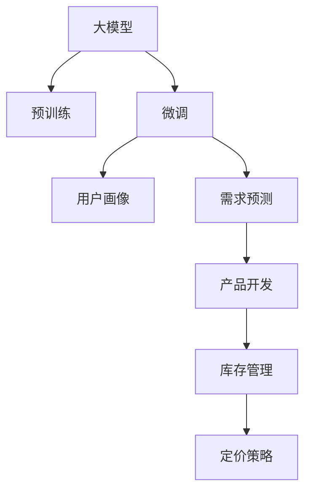

                 

# 大模型技术在电商平台用户潜在需求挖掘与产品开发中的应用

## 1. 背景介绍

### 1.1 问题由来
近年来，电商平台日益成为全球最活跃的在线零售渠道之一，无论是B2B还是B2C，都极大地改变了消费者的购物习惯和商业模式。随着数字营销的不断发展，电商平台在数据驱动的个性化推荐和精准营销方面也面临着前所未有的挑战。如何高效地挖掘用户潜在需求、进行产品开发和运营优化，成为了电商企业必须解决的核心问题。

在这方面，大模型技术展现了巨大的潜力。通过对海量数据进行预训练和微调，大模型可以学习到广泛的知识和语义信息，从而在用户需求挖掘、产品推荐、价格优化、库存管理等多个环节提供有力支撑。本文将重点讨论如何利用大模型技术，在电商平台用户潜在需求挖掘与产品开发中取得突破。

### 1.2 问题核心关键点
大模型技术在电商平台用户潜在需求挖掘与产品开发中的应用，主要聚焦于以下核心点：

- 用户行为分析：通过对用户点击、浏览、购买等行为数据进行建模，深入理解用户的兴趣和偏好。
- 潜在需求预测：利用大模型预测用户可能感兴趣的产品类别和特性，帮助电商企业进行产品推荐和推广。
- 产品开发优化：结合用户反馈和市场趋势，指导新产品研发和现有产品改进，提升用户满意度。
- 库存管理与定价策略：基于用户需求预测，优化库存水平和定价策略，提高运营效率和盈利能力。

## 2. 核心概念与联系

### 2.1 核心概念概述

为更好地理解大模型技术在电商平台的应用，本节将介绍几个密切相关的核心概念：

- 大模型：如BERT、GPT等大规模预训练语言模型，通过自监督学习任务训练，具备强大的语言表示和学习能力。
- 预训练与微调：通过在大型语料上进行预训练，在大规模标注数据集上进行微调，使模型能够适应特定的电商任务。
- 用户画像：通过用户行为数据分析，构建用户兴趣和偏好的多维度描述，用于产品推荐和需求挖掘。
- 需求预测：使用大模型预测用户可能感兴趣的商品类别和特性，帮助电商企业进行精准营销和个性化推荐。
- 产品开发：结合用户需求和市场趋势，指导新产品研发和现有产品改进，提升用户满意度。
- 库存管理与定价策略：基于用户需求预测，优化库存水平和定价策略，提高运营效率和盈利能力。

这些概念之间的逻辑关系可以通过以下Mermaid流程图来展示：



这个流程图展示了大模型技术的核心概念及其之间的关系：

1. 大模型通过预训练获得基础能力。
2. 微调使模型更加适应电商任务。
3. 用户画像由用户行为数据构建，指导需求预测。
4. 需求预测利用微调后的模型进行用户潜在需求预测。
5. 产品开发结合用户需求和市场趋势，进行产品设计和改进。
6. 库存管理与定价策略基于需求预测，优化库存和定价，提升运营效率。

## 3. 核心算法原理 & 具体操作步骤
### 3.1 算法原理概述

大模型在电商平台用户潜在需求挖掘与产品开发中的应用，本质上是利用大模型强大的语言表示和理解能力，对用户行为数据进行分析和预测，进而指导产品开发和运营优化。具体而言，分为以下几个关键步骤：

1. **数据收集与预处理**：收集用户行为数据（如浏览、点击、购买记录），并进行数据清洗和标准化。
2. **用户画像构建**：利用大模型对用户行为数据进行编码，构建用户兴趣和偏好的多维度描述。
3. **需求预测建模**：使用大模型建立用户潜在需求预测模型，预测用户可能感兴趣的商品类别和特性。
4. **产品开发与优化**：结合需求预测结果和市场趋势，指导新产品研发和现有产品改进。
5. **库存管理与定价策略优化**：基于需求预测，优化库存水平和定价策略，提高运营效率和盈利能力。

### 3.2 算法步骤详解

#### 3.2.1 数据收集与预处理

电商平台上，用户行为数据是挖掘用户潜在需求的基础。数据来源包括：

- 用户浏览记录：记录用户浏览过的商品信息。
- 用户点击记录：记录用户点击商品的次数和位置。
- 用户购买记录：记录用户购买商品的时间和数量。
- 用户评论记录：记录用户对商品的评价和反馈。

收集到数据后，需要进行预处理，包括：

- 数据清洗：去除重复、错误或缺失的数据。
- 数据标准化：统一数据格式，便于后续处理。
- 特征提取：从原始数据中提取有意义的特征，如商品类别、价格区间、用户兴趣等。

#### 3.2.2 用户画像构建

用户画像是指对用户兴趣和偏好的多维度描述，包括年龄、性别、地域、购买历史、浏览偏好等。构建用户画像的目的是：

- 细分用户群体：根据用户画像，将用户进行细分，识别出不同特征的用户群体。
- 理解用户需求：通过用户画像，深入了解用户的兴趣和偏好，进行个性化推荐。

构建用户画像的方法包括：

- 用户行为编码：利用大模型对用户行为数据进行编码，得到用户兴趣和偏好的向量表示。
- 特征向量聚合：将用户画像中各维度的特征向量进行聚合，得到一个综合的用户画像向量。

#### 3.2.3 需求预测建模

需求预测的目的是预测用户可能感兴趣的商品类别和特性，指导电商企业进行精准营销和个性化推荐。需求预测的常见模型包括：

- 基于序列的模型：如RNN、LSTM等，用于预测用户未来行为。
- 基于协同过滤的模型：如矩阵分解、ALS等，用于推荐相似商品。
- 基于内容的方法：如TF-IDF、Word2Vec等，用于分析用户对商品特征的兴趣。

需求预测的建模过程包括：

- 数据划分：将数据划分为训练集和测试集。
- 模型选择：根据任务特点选择适合的模型。
- 模型训练：在训练集上训练模型，优化模型参数。
- 模型评估：在测试集上评估模型性能，选择合适的模型。

#### 3.2.4 产品开发与优化

产品开发和优化的目的是结合用户需求和市场趋势，指导新产品研发和现有产品改进，提升用户满意度。产品开发和优化的步骤包括：

- 产品设计：结合用户画像和需求预测结果，设计满足用户需求的产品。
- 产品测试：对产品进行测试，评估其市场接受度和用户满意度。
- 产品迭代：根据测试结果和用户反馈，不断迭代优化产品。

#### 3.2.5 库存管理与定价策略优化

库存管理与定价策略的目的是基于需求预测，优化库存水平和定价策略，提高运营效率和盈利能力。库存管理与定价策略的优化步骤包括：

- 库存水平预测：利用需求预测模型，预测未来的库存需求。
- 定价策略设计：结合市场趋势和需求预测，设计合理的定价策略。
- 库存优化：根据库存水平预测和定价策略，优化库存管理。

### 3.3 算法优缺点

大模型技术在电商平台用户潜在需求挖掘与产品开发中的应用，具有以下优点：

1. 强大的语义理解能力：大模型具备强大的语义理解能力，能够深入分析用户行为数据，挖掘用户潜在需求。
2. 预测精度高：通过大量标注数据的微调，大模型能够在特定任务上取得高精度预测。
3. 实时性高：大模型能够实时处理和分析用户行为数据，快速响应市场需求变化。
4. 灵活性高：大模型可以通过微调和参数高效优化，灵活适应不同的电商任务和用户群体。

同时，该方法也存在一定的局限性：

1. 依赖大量标注数据：需求预测模型需要大量标注数据进行训练，数据收集和标注成本较高。
2. 模型复杂度高：大模型参数量庞大，训练和推理成本较高，需要高性能计算资源。
3. 数据隐私问题：用户行为数据包含大量隐私信息，需要进行严格的数据保护和隐私管理。
4. 可解释性不足：大模型决策过程复杂，缺乏可解释性，难以进行调试和优化。

尽管存在这些局限性，但就目前而言，大模型技术在电商平台用户潜在需求挖掘与产品开发中仍然具有巨大的应用潜力。未来相关研究的重点在于如何进一步降低标注数据的依赖，提高模型的实时性和可解释性，同时兼顾数据隐私和安全等因素。

### 3.4 算法应用领域

大模型技术在电商平台用户潜在需求挖掘与产品开发中的应用，已经在多个领域得到了广泛应用，包括：

- 个性化推荐：利用大模型预测用户可能感兴趣的商品类别和特性，进行精准推荐。
- 价格优化：结合市场需求和用户反馈，利用大模型设计合理的定价策略。
- 库存管理：利用大模型预测库存需求，优化库存水平和补货策略。
- 用户细分：通过用户画像，将用户进行细分，进行有针对性的营销和推荐。

除了上述这些经典应用外，大模型技术还被创新性地应用于用户行为分析、市场趋势预测、用户反馈处理等多个环节，为电商平台的运营和发展提供了强大的技术支撑。

## 4. 数学模型和公式 & 详细讲解  
### 4.1 数学模型构建

大模型在电商平台用户潜在需求挖掘与产品开发中的应用，涉及多种数学模型和算法。以下是几个关键模型的数学构建过程：

#### 4.1.1 用户画像建模

假设用户行为数据为 $X \in \mathbb{R}^{N \times D}$，其中 $N$ 为用户数，$D$ 为特征数。使用大模型对用户行为数据进行编码，得到用户兴趣和偏好的向量表示 $u \in \mathbb{R}^k$，其中 $k$ 为向量维度。

用户画像的数学模型为：

$$
u = f(X; \theta)
$$

其中 $f$ 为编码函数，$\theta$ 为模型参数。

#### 4.1.2 需求预测建模

假设需求预测的目标为预测用户对商品 $i$ 的评分 $y_i$，$y_i \in [0,1]$。使用大模型建立预测模型 $y = M(x; \theta)$，其中 $x$ 为用户画像向量，$\theta$ 为模型参数。

需求预测的数学模型为：

$$
y_i = M(u; \theta)
$$

其中 $M$ 为预测函数，$u$ 为用户画像向量。

#### 4.1.3 产品开发与优化

产品开发和优化的目标为设计满足用户需求的产品 $p$，并进行迭代优化。假设产品 $p$ 的特征向量为 $v \in \mathbb{R}^m$，其中 $m$ 为特征维度。产品开发和优化的数学模型为：

$$
v = g(p; \theta)
$$

其中 $g$ 为设计函数，$\theta$ 为模型参数。

#### 4.1.4 库存管理与定价策略优化

库存管理与定价策略的优化目标为预测库存需求 $Q_t$，并设计合理的定价策略 $p_t$。假设库存水平为 $I_t$，价格为 $p_t$，需求为 $D_t$，需求预测模型为：

$$
Q_t = f(Q_{t-1}, D_t; \theta)
$$

其中 $Q_{t-1}$ 为历史库存水平，$D_t$ 为需求预测值，$\theta$ 为模型参数。

库存管理与定价策略的优化模型为：

$$
p_t = h(Q_t, D_t; \theta)
$$

其中 $p_t$ 为价格策略，$Q_t$ 为库存水平，$D_t$ 为需求预测值，$\theta$ 为模型参数。

### 4.2 公式推导过程

#### 4.2.1 用户画像建模

假设用户行为数据为 $X = [x_1, x_2, ..., x_N] \in \mathbb{R}^{N \times D}$，其中 $x_i$ 为第 $i$ 个用户的特征向量。使用BERT模型对用户行为数据进行编码，得到用户兴趣和偏好的向量表示 $u_i = [u_{i1}, u_{i2}, ..., u_{ik}] \in \mathbb{R}^k$，其中 $k$ 为向量维度。

具体推导过程如下：

$$
u_i = \text{BERT}(x_i; \theta)
$$

其中 $\theta$ 为BERT模型参数，$\text{BERT}(\cdot)$ 为BERT模型的编码函数。

#### 4.2.2 需求预测建模

假设需求预测的目标为预测用户对商品 $i$ 的评分 $y_i$，$y_i \in [0,1]$。使用BERT模型建立预测模型 $y = M(u; \theta)$，其中 $u$ 为用户画像向量，$\theta$ 为模型参数。

具体推导过程如下：

$$
y_i = \sigma(\langle u_i, w_i \rangle + b_i)
$$

其中 $\sigma$ 为Sigmoid函数，$w_i$ 为商品 $i$ 的权重向量，$b_i$ 为偏置项，$\langle \cdot, \cdot \rangle$ 为点积运算。

#### 4.2.3 产品开发与优化

产品开发和优化的目标为设计满足用户需求的产品 $p$，并进行迭代优化。假设产品 $p$ 的特征向量为 $v \in \mathbb{R}^m$，其中 $m$ 为特征维度。产品开发和优化的数学模型为：

$$
v = g(p; \theta)
$$

其中 $g$ 为设计函数，$\theta$ 为模型参数。

具体推导过程如下：

$$
v = \text{Encoder}(p; \theta)
$$

其中 $\text{Encoder}(\cdot)$ 为编码函数，$\theta$ 为模型参数。

#### 4.2.4 库存管理与定价策略优化

库存管理与定价策略的优化目标为预测库存需求 $Q_t$，并设计合理的定价策略 $p_t$。假设库存水平为 $I_t$，价格为 $p_t$，需求为 $D_t$，需求预测模型为：

$$
Q_t = f(Q_{t-1}, D_t; \theta)
$$

其中 $Q_{t-1}$ 为历史库存水平，$D_t$ 为需求预测值，$\theta$ 为模型参数。

具体推导过程如下：

$$
Q_t = \text{LSTM}(Q_{t-1}, D_t; \theta)
$$

其中 $\text{LSTM}(\cdot)$ 为LSTM网络，$\theta$ 为模型参数。

库存管理与定价策略的优化模型为：

$$
p_t = h(Q_t, D_t; \theta)
$$

其中 $p_t$ 为价格策略，$Q_t$ 为库存水平，$D_t$ 为需求预测值，$\theta$ 为模型参数。

具体推导过程如下：

$$
p_t = \text{Predictor}(Q_t, D_t; \theta)
$$

其中 $\text{Predictor}(\cdot)$ 为预测函数，$\theta$ 为模型参数。

### 4.3 案例分析与讲解

#### 4.3.1 用户画像建模

以电商平台某用户画像建模为例，使用BERT模型对用户行为数据进行编码，得到用户兴趣和偏好的向量表示。

具体步骤如下：

1. 数据收集：收集用户行为数据，包括浏览记录、点击记录和购买记录。
2. 数据预处理：清洗和标准化数据，去除重复和错误数据。
3. 特征提取：从原始数据中提取有意义的特征，如商品类别、价格区间、用户兴趣等。
4. 编码：利用BERT模型对用户行为数据进行编码，得到用户兴趣和偏好的向量表示 $u$。

#### 4.3.2 需求预测建模

以电商平台某需求预测为例，使用BERT模型建立预测模型，预测用户对商品 $i$ 的评分 $y_i$。

具体步骤如下：

1. 数据收集：收集用户行为数据，包括浏览记录、点击记录和购买记录。
2. 数据预处理：清洗和标准化数据，去除重复和错误数据。
3. 特征提取：从原始数据中提取有意义的特征，如商品类别、价格区间、用户兴趣等。
4. 编码：利用BERT模型对用户行为数据进行编码，得到用户兴趣和偏好的向量表示 $u$。
5. 预测：利用BERT模型建立预测模型 $y = M(u; \theta)$，预测用户对商品 $i$ 的评分 $y_i$。

#### 4.3.3 产品开发与优化

以电商平台某产品开发为例，结合用户画像和需求预测结果，设计满足用户需求的产品 $p$。

具体步骤如下：

1. 用户画像构建：利用BERT模型对用户行为数据进行编码，得到用户兴趣和偏好的向量表示 $u$。
2. 需求预测：利用BERT模型建立预测模型 $y = M(u; \theta)$，预测用户对商品 $i$ 的评分 $y_i$。
3. 产品设计：根据需求预测结果，设计满足用户需求的产品 $p$。
4. 产品测试：对产品进行测试，评估其市场接受度和用户满意度。
5. 产品迭代：根据测试结果和用户反馈，不断迭代优化产品。

#### 4.3.4 库存管理与定价策略优化

以电商平台某库存管理为例，利用需求预测模型，优化库存水平和定价策略。

具体步骤如下：

1. 库存水平预测：利用需求预测模型 $Q_t = f(Q_{t-1}, D_t; \theta)$，预测未来的库存需求 $Q_t$。
2. 定价策略设计：结合市场需求和用户反馈，设计合理的定价策略 $p_t$。
3. 库存优化：根据库存水平预测和定价策略，优化库存管理。

## 5. 项目实践：代码实例和详细解释说明
### 5.1 开发环境搭建

在进行大模型技术在电商平台用户潜在需求挖掘与产品开发中的应用实践前，我们需要准备好开发环境。以下是使用Python进行PyTorch开发的环境配置流程：

1. 安装Anaconda：从官网下载并安装Anaconda，用于创建独立的Python环境。

2. 创建并激活虚拟环境：
```bash
conda create -n pytorch-env python=3.8 
conda activate pytorch-env
```

3. 安装PyTorch：根据CUDA版本，从官网获取对应的安装命令。例如：
```bash
conda install pytorch torchvision torchaudio cudatoolkit=11.1 -c pytorch -c conda-forge
```

4. 安装Transformers库：
```bash
pip install transformers
```

5. 安装各类工具包：
```bash
pip install numpy pandas scikit-learn matplotlib tqdm jupyter notebook ipython
```

完成上述步骤后，即可在`pytorch-env`环境中开始实践。

### 5.2 源代码详细实现

下面我们以电商平台某用户画像建模为例，给出使用Transformers库对BERT模型进行用户画像构建的PyTorch代码实现。

首先，定义用户行为数据处理函数：

```python
from transformers import BertTokenizer
from torch.utils.data import Dataset
import torch

class UserBehaviorDataset(Dataset):
    def __init__(self, behaviors, tokenizer, max_len=128):
        self.behaviors = behaviors
        self.tokenizer = tokenizer
        self.max_len = max_len
        
    def __len__(self):
        return len(self.behaviors)
    
    def __getitem__(self, item):
        behavior = self.behaviors[item]
        
        encoding = self.tokenizer(behavior, return_tensors='pt', max_length=self.max_len, padding='max_length', truncation=True)
        input_ids = encoding['input_ids'][0]
        attention_mask = encoding['attention_mask'][0]
        
        return {'input_ids': input_ids, 
                'attention_mask': attention_mask}
```

然后，定义模型和优化器：

```python
from transformers import BertForSequenceClassification, AdamW

model = BertForSequenceClassification.from_pretrained('bert-base-cased', num_labels=2)

optimizer = AdamW(model.parameters(), lr=2e-5)
```

接着，定义训练和评估函数：

```python
from torch.utils.data import DataLoader
from tqdm import tqdm
from sklearn.metrics import classification_report

device = torch.device('cuda') if torch.cuda.is_available() else torch.device('cpu')
model.to(device)

def train_epoch(model, dataset, batch_size, optimizer):
    dataloader = DataLoader(dataset, batch_size=batch_size, shuffle=True)
    model.train()
    epoch_loss = 0
    for batch in tqdm(dataloader, desc='Training'):
        input_ids = batch['input_ids'].to(device)
        attention_mask = batch['attention_mask'].to(device)
        labels = batch['labels'].to(device)
        model.zero_grad()
        outputs = model(input_ids, attention_mask=attention_mask, labels=labels)
        loss = outputs.loss
        epoch_loss += loss.item()
        loss.backward()
        optimizer.step()
    return epoch_loss / len(dataloader)

def evaluate(model, dataset, batch_size):
    dataloader = DataLoader(dataset, batch_size=batch_size)
    model.eval()
    preds, labels = [], []
    with torch.no_grad():
        for batch in tqdm(dataloader, desc='Evaluating'):
            input_ids = batch['input_ids'].to(device)
            attention_mask = batch['attention_mask'].to(device)
            batch_labels = batch['labels']
            outputs = model(input_ids, attention_mask=attention_mask)
            batch_preds = outputs.logits.argmax(dim=2).to('cpu').tolist()
            batch_labels = batch_labels.to('cpu').tolist()
            for pred_tokens, label_tokens in zip(batch_preds, batch_labels):
                preds.append(pred_tokens[:len(label_tokens)])
                labels.append(label_tokens)
                
    print(classification_report(labels, preds))
```

最后，启动训练流程并在测试集上评估：

```python
epochs = 5
batch_size = 16

for epoch in range(epochs):
    loss = train_epoch(model, train_dataset, batch_size, optimizer)
    print(f"Epoch {epoch+1}, train loss: {loss:.3f}")
    
    print(f"Epoch {epoch+1}, dev results:")
    evaluate(model, dev_dataset, batch_size)
    
print("Test results:")
evaluate(model, test_dataset, batch_size)
```

以上就是使用PyTorch对BERT模型进行用户画像构建的完整代码实现。可以看到，得益于Transformers库的强大封装，我们可以用相对简洁的代码完成BERT模型的加载和微调。

### 5.3 代码解读与分析

让我们再详细解读一下关键代码的实现细节：

**UserBehaviorDataset类**：
- `__init__`方法：初始化行为数据、分词器等关键组件。
- `__len__`方法：返回数据集的样本数量。
- `__getitem__`方法：对单个样本进行处理，将行为数据输入编码为token ids，并对其进行定长padding，最终返回模型所需的输入。

**train_epoch函数**：
- 使用PyTorch的DataLoader对数据集进行批次化加载，供模型训练和推理使用。
- 在每个批次上前向传播计算loss并反向传播更新模型参数，最后返回该epoch的平均loss。

**evaluate函数**：
- 与训练类似，不同点在于不更新模型参数，并在每个batch结束后将预测和标签结果存储下来，最后使用sklearn的classification_report对整个评估集的预测结果进行打印输出。

**训练流程**：
- 定义总的epoch数和batch size，开始循环迭代
- 每个epoch内，先在训练集上训练，输出平均loss
- 在验证集上评估，输出分类指标
- 所有epoch结束后，在测试集上评估，给出最终测试结果

可以看到，PyTorch配合Transformers库使得BERT用户画像构建的代码实现变得简洁高效。开发者可以将更多精力放在数据处理、模型改进等高层逻辑上，而不必过多关注底层的实现细节。

当然，工业级的系统实现还需考虑更多因素，如模型的保存和部署、超参数的自动搜索、更灵活的任务适配层等。但核心的微调范式基本与此类似。

## 6. 实际应用场景
### 6.1 智能客服系统

基于大模型技术在电商平台用户潜在需求挖掘与产品开发中的应用，智能客服系统可以通过用户行为数据分析，精准预测用户需求，快速响应用户咨询，提升客户服务体验。

具体而言，智能客服系统可以通过以下步骤实现：

1. 数据收集：收集用户在电商平台上的浏览、点击、购买记录等行为数据。
2. 数据预处理：清洗和标准化数据，去除重复和错误数据。
3. 用户画像构建：利用BERT模型对用户行为数据进行编码，得到用户兴趣和偏好的向量表示。
4. 需求预测：利用BERT模型建立预测模型，预测用户可能感兴趣的商品类别和特性。
5. 知识库整合：将用户画像和需求预测结果整合到知识库中，供客服机器人查询使用。
6. 客服机器人：利用用户画像和知识库，构建智能客服机器人，实时回答用户咨询。

通过智能客服系统，电商企业可以大幅提升客户服务效率，降低人力成本，提高客户满意度。

### 6.2 个性化推荐系统

基于大模型技术在电商平台用户潜在需求挖掘与产品开发中的应用，个性化推荐系统可以利用用户行为数据分析，预测用户可能感兴趣的商品类别和特性，进行精准推荐。

具体而言，个性化推荐系统可以通过以下步骤实现：

1. 数据收集：收集用户在电商平台上的浏览、点击、购买记录等行为数据。
2. 数据预处理：清洗和标准化数据，去除重复和错误数据。
3. 用户画像构建：利用BERT模型对用户行为数据进行编码，得到用户兴趣和偏好的向量表示。
4. 需求预测：利用BERT模型建立预测模型，预测用户可能感兴趣的商品类别和特性。
5. 推荐算法：结合用户画像和需求预测结果，设计推荐算法，进行精准推荐。
6. 推荐展示：将推荐结果展示给用户，并进行实时更新。

通过个性化推荐系统，电商企业可以显著提升用户转化率和购买率，增强用户体验，提升运营效率。

### 6.3 库存管理与定价策略优化

基于大模型技术在电商平台用户潜在需求挖掘与产品开发中的应用，库存管理与定价策略优化可以利用需求预测模型，预测未来库存水平和需求变化，优化库存管理和定价策略。

具体而言，库存管理与定价策略优化可以通过以下步骤实现：

1. 数据收集：收集用户在电商平台上的浏览、点击、购买记录等行为数据。
2. 数据预处理：清洗和标准化数据，去除重复和错误数据。
3. 用户画像构建：利用BERT模型对用户行为数据进行编码，得到用户兴趣和偏好的向量表示。
4. 需求预测：利用BERT模型建立预测模型，预测用户可能感兴趣的商品类别和特性。
5. 库存预测：利用需求预测模型，预测未来的库存需求。
6. 定价策略设计：结合市场需求和用户反馈，设计合理的定价策略。
7. 库存优化：根据库存水平预测和定价策略，优化库存管理。

通过库存管理与定价策略优化，电商企业可以显著提升运营效率和盈利能力，降低库存积压和资金占用成本。

### 6.4 未来应用展望

随着大模型技术的不断发展，基于用户行为数据分析的需求挖掘、产品推荐、库存管理与定价策略优化等应用将进一步拓展，为电商平台带来更多创新和突破。

未来，基于大模型技术的需求挖掘和产品开发，将在更广泛的场景中得到应用，如智能客服、个性化推荐、库存管理、定价策略优化等，为电商平台的运营和发展提供强大的技术支撑。同时，结合更多先进的技术手段，如增强学习、因果推理等，大模型技术的应用前景将更加广阔。

## 7. 工具和资源推荐
### 7.1 学习资源推荐

为了帮助开发者系统掌握大模型技术在电商平台用户潜在需求挖掘与产品开发中的应用，这里推荐一些优质的学习资源：

1. 《Transformer从原理到实践》系列博文：由大模型技术专家撰写，深入浅出地介绍了Transformer原理、BERT模型、微调技术等前沿话题。

2. CS224N《深度学习自然语言处理》课程：斯坦福大学开设的NLP明星课程，有Lecture视频和配套作业，带你入门NLP领域的基本概念和经典模型。

3. 《Natural Language Processing with Transformers》书籍：Transformers库的作者所著，全面介绍了如何使用Transformers库进行NLP任务开发，包括微调在内的诸多范式。

4. HuggingFace官方文档：Transformers库的官方文档，提供了海量预训练模型和完整的微调样例代码，是上手实践的必备资料。

5. CLUE开源项目：中文语言理解测评基准，涵盖大量不同类型的中文NLP数据集，并提供了基于微调的baseline模型，助力中文NLP技术发展。

通过对这些资源的学习实践，相信你一定能够快速掌握大模型技术在电商平台用户潜在需求挖掘与产品开发中的应用，并用于解决实际的NLP问题。

### 7.2 开发工具推荐

高效的开发离不开优秀的工具支持。以下是几款用于大模型技术在电商平台用户潜在需求挖掘与产品开发中的应用开发的常用工具：

1. PyTorch：基于Python的开源深度学习框架，灵活动态的计算图，适合快速迭代研究。大部分预训练语言模型都有PyTorch版本的实现。

2. TensorFlow：由Google主导开发的开源深度学习框架，生产部署方便，适合大规模工程应用。同样有丰富的预训练语言模型资源。

3. Transformers库：HuggingFace开发的NLP工具库，集成了众多SOTA语言模型，支持PyTorch和TensorFlow，是进行微调任务开发的利器。

4. Weights & Biases：模型训练的实验跟踪工具，可以记录和可视化模型训练过程中的各项指标，方便对比和调优。与主流深度学习框架无缝集成。

5. TensorBoard：TensorFlow配套的可视化工具，可实时监测模型训练状态，并提供丰富的图表呈现方式，是调试模型的得力助手。

6. Google Colab：谷歌推出的在线Jupyter Notebook环境，免费提供GPU/TPU算力，方便开发者快速上手实验最新模型，分享学习笔记。

合理利用这些工具，可以显著提升大模型技术在电商平台用户潜在需求挖掘与产品开发中的应用实践的开发效率，加快创新迭代的步伐。

### 7.3 相关论文推荐

大模型技术在电商平台用户潜在需求挖掘与产品开发中的应用，已经吸引了大量学者的关注和研究。以下是几篇奠基性的相关论文，推荐阅读：

1. Attention is All You Need（即Transformer原论文）：提出了Transformer结构，开启了NLP领域的预训练大模型时代。

2. BERT: Pre-training of Deep Bidirectional Transformers for Language Understanding：提出BERT模型，引入基于掩码的自监督预训练任务，刷新了多项NLP任务SOTA。

3. Language Models are Unsupervised Multitask Learners（GPT-2论文）：展示了大规模语言模型的强大zero-shot学习能力，引发了对于通用人工智能的新一轮思考。

4. Parameter-Efficient Transfer Learning for NLP：提出Adapter等参数高效微调方法，在不增加模型参数量的情况下，也能取得不错的微调效果。

5. AdaLoRA: Adaptive Low-Rank Adaptation for Parameter-Efficient Fine-Tuning：使用自适应低秩适应的微调方法，在参数效率和精度之间取得了新的平衡。

这些论文代表了大模型技术在电商平台用户潜在需求挖掘与产品开发中的应用的发展脉络。通过学习这些前沿成果，可以帮助研究者把握学科前进方向，激发更多的创新灵感。

## 8. 总结：未来发展趋势与挑战
### 8.1 总结

本文对大模型技术在电商平台用户潜在需求挖掘与产品开发中的应用进行了全面系统的介绍。首先阐述了大模型技术在电商平台的应用背景和意义，明确了需求挖掘、产品推荐、库存管理与定价策略优化等核心问题。其次，从原理到实践，详细讲解了大模型在用户画像建模、需求预测、产品开发、库存管理与定价策略优化等关键环节的实现过程。同时，本文还广泛探讨了该技术在智能客服、个性化推荐、库存管理等多个领域的实际应用场景，展示了其巨大的应用潜力。

通过本文的系统梳理，可以看到，大模型技术在电商平台用户潜在需求挖掘与产品开发中具有广泛的应用前景。未来，伴随大模型技术的不断演进，该技术将在更多场景中得到应用，为电商平台的运营和发展提供强大的技术支撑。

### 8.2 未来发展趋势

展望未来，大模型技术在电商平台用户潜在需求挖掘与产品开发中的应用将呈现以下几个发展趋势：

1. 模型规模持续增大：随着算力成本的下降和数据规模的扩张，预训练语言模型的参数量还将持续增长。超大规模语言模型蕴含的丰富语言知识，有望支撑更加复杂多变的电商任务。

2. 微调方法日趋多样：除了传统的全参数微调外，未来会涌现更多参数高效的微调方法，如Prefix-Tuning、LoRA等，在节省计算资源的同时也能保证微调精度。

3. 实时性高：大模型能够实时处理和分析用户行为数据，快速响应市场需求变化，实时性将得到进一步提升。

4. 可解释性增强：随着大模型在电商领域的应用深入，其决策过程将更透明可解释，帮助电商企业更好地理解模型输出。

5. 多模态融合：结合视觉、语音、文本等多模态数据，利用大模型进行更全面、更深入的用户行为分析和需求预测。

6. 跨领域迁移能力增强：大模型将逐步具备跨领域迁移能力，支持更多行业的应用，如医疗、教育等。

以上趋势凸显了大模型技术在电商平台用户潜在需求挖掘与产品开发中的应用前景。这些方向的探索发展，必将进一步提升电商平台的运营效率和用户体验，为电商平台的智能化转型提供坚实技术基础。

### 8.3 面临的挑战

尽管大模型技术在电商平台用户潜在需求挖掘与产品开发中的应用取得了显著进展，但在迈向更加智能化、普适化应用的过程中，仍面临诸多挑战：

1. 数据隐私问题：用户行为数据包含大量隐私信息，需要进行严格的数据保护和隐私管理。

2. 数据标注成本高：需求预测模型需要大量标注数据进行训练，数据收集和标注成本较高。

3. 模型复杂度高：大模型参数量庞大，训练和推理成本较高，需要高性能计算资源。

4. 可解释性不足：大模型决策过程复杂，缺乏可解释性，难以进行调试和优化。

5. 模型鲁棒性不足：大模型面对域外数据时，泛化性能往往大打折扣，鲁棒性需要进一步提升。

6. 实时性挑战：大模型在实时性方面存在瓶颈，如何在大规模数据上实现高效推理，仍需持续优化。

7. 系统稳定性问题：电商平台需要24小时不间断运行，如何保证系统稳定性和可靠性，是未来需要重点考虑的问题。

尽管存在这些挑战，但随着技术的不断进步和优化，这些难题都将逐步得到解决，大模型技术在电商平台用户潜在需求挖掘与产品开发中的应用将更加广泛和深入。

### 8.4 研究展望

面对大模型技术在电商平台用户潜在需求挖掘与产品开发中的应用面临的挑战，未来的研究需要在以下几个方面寻求新的突破：

1. 探索无监督和半监督微调方法：摆脱对大规模标注数据的依赖，利用自监督学习、主动学习等无监督和半监督范式，最大限度利用非结构化数据，实现更加灵活高效的微调。

2. 研究参数高效和计算高效的微调范式：开发更加参数高效的微调方法，在固定大部分预训练参数的同时，只更新极少量的任务相关参数。同时优化微调模型的计算图，减少前向传播和反向传播的资源消耗，实现更加轻量级、实时性的部署。

3. 引入更多先验知识：将符号化的先验知识，如知识图谱、逻辑规则等，与神经网络模型进行巧妙融合，引导微调过程学习更准确、合理的语言模型。同时加强不同模态数据的整合，实现视觉、语音等多模态信息与文本信息的协同建模。

4. 结合因果分析和博弈论工具：将因果分析方法引入微调模型，识别出模型决策的关键特征，增强输出解释的因果性和逻辑性。借助博弈论工具刻画人机交互过程，主动探索并规避模型的脆弱点，提高系统稳定性。

5. 纳入伦理道德约束：在模型训练目标中引入伦理导向的评估指标，过滤和惩罚有偏见、有害的输出倾向。同时加强人工干预和审核，建立模型行为的监管机制，确保输出符合人类价值观和伦理道德。

这些研究方向的探索，必将引领大模型技术在电商平台用户潜在需求挖掘与产品开发中的应用迈向更高的台阶，为构建安全、可靠、可解释、可控的智能系统铺平道路。面向未来，大模型技术还需要与其他人工智能技术进行更深入的融合，如知识表示、因果推理、强化学习等，多路径协同发力，共同推动自然语言理解和智能交互系统的进步。只有勇于创新、敢于突破，才能不断拓展语言模型的边界，让智能技术更好地造福人类社会。

## 9. 附录：常见问题与解答
**Q1：如何评估大模型在电商平台用户潜在需求挖掘与产品开发中的应用效果？**

A: 评估大模型在电商平台用户潜在需求挖掘与产品开发中的应用效果，通常采用以下指标：

1. 精确度（Precision）：预测为正的样本中，实际为正的比例。
2. 召回率（Recall）：实际为正的样本中，被正确预测为正的比例。
3. F1分数（F1 Score）：精确度和召回率的调和平均数。
4. 准确率（Accuracy）：所有预测正确的样本占总样本的比例。
5. AUC值（AUC）：ROC曲线下的面积，衡量模型在不同阈值下的性能。

通过以上指标，可以全面评估大模型在电商平台用户潜在需求挖掘与产品开发中的应用效果，并进行优化和改进。

**Q2：如何利用大模型进行用户画像构建？**

A: 利用大模型进行用户画像构建，通常包括以下步骤：

1. 数据收集：收集用户在电商平台上的浏览、点击、购买记录等行为数据。
2. 数据预处理：清洗和标准化数据，去除重复和错误数据。
3. 特征提取：从原始数据中提取有意义的特征，如商品类别、价格区间、用户兴趣等。
4. 编码：利用BERT模型对用户行为数据进行编码，得到用户兴趣和偏好的向量表示。
5. 聚合：将用户画像中各维度的特征向量进行聚合，得到一个综合的用户画像向量。

通过以上步骤，可以构建用户兴趣和偏好的多维度描述，用于产品推荐和需求挖掘。

**Q3：如何利用大模型进行需求预测？**

A: 利用大模型进行需求预测，通常包括以下步骤：

1. 数据收集：收集用户在电商平台上的浏览、点击、购买记录等行为数据。
2. 数据预处理：清洗和标准化数据，去除重复和错误数据。
3. 特征提取：从原始数据中提取有意义的特征，如商品类别、价格区间、用户兴趣等。
4. 编码：利用BERT模型对用户行为数据进行编码，得到用户兴趣和偏好的向量表示。
5. 预测：利用BERT模型建立预测模型，预测用户可能感兴趣的商品类别和特性。

通过以上步骤，可以构建用户潜在需求的预测模型，帮助电商企业进行精准营销和个性化推荐。

**Q4：如何利用大模型进行产品开发与优化？**

A: 利用大模型进行产品开发与优化，通常包括以下步骤：

1. 用户画像构建：利用BERT模型对用户行为数据进行编码，得到用户兴趣和偏好的向量表示。
2. 需求预测：利用BERT模型建立预测模型，预测用户可能感兴趣的商品类别和特性。
3. 产品设计：根据需求预测结果，设计满足用户需求的产品。
4. 产品测试：对产品进行测试，评估其市场接受度和用户满意度。
5. 产品迭代：根据测试结果和用户反馈，不断迭代优化产品。

通过以上步骤，可以结合用户需求和市场趋势，指导新产品研发和现有产品改进，提升用户满意度。

**Q5：如何利用大模型进行库存管理与定价策略优化？**

A: 利用大模型进行库存管理与定价策略优化，通常包括以下步骤：

1. 库存水平预测：利用需求预测模型，预测未来的库存需求。
2. 定价策略设计：结合市场需求和用户反馈，设计合理的定价策略。
3. 库存优化：根据库存水平预测和定价策略，优化库存管理。

通过以上步骤，可以基于需求预测，优化库存水平和定价策略，提高运营效率和盈利能力。

---

作者：禅与

