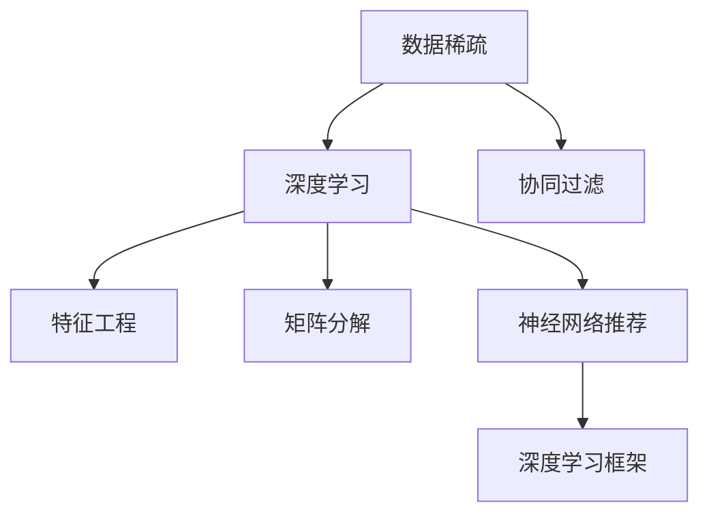

                 

# 大模型推荐中的数据稀疏问题应对策略与新方法

> 关键词：数据稀疏, 推荐系统, 大模型, 特征工程, 深度学习

## 1. 背景介绍

在互联网推荐系统中，用户与商品之间的交互数据通常具有高度稀疏性。这意味着大多数用户和商品之间没有交易记录，给推荐系统的建模带来了挑战。为了解决这一问题，许多研究人员和工程师引入了深度学习和大模型技术，利用用户和商品的隐式反馈数据（如浏览历史、搜索记录、评分等）构建强大的推荐模型。然而，数据稀疏性仍然是推荐系统面临的一个重大挑战，需要从多个角度进行应对。

## 2. 核心概念与联系

### 2.1 核心概念概述

为了更好地理解如何应对大模型推荐中的数据稀疏问题，本节将介绍几个核心概念：

- **数据稀疏性（Sparse Data）**：在推荐系统中，用户-商品互动矩阵中大部分位置为0，即用户和商品之间没有交互数据。
- **深度学习与大模型（Deep Learning & Large Models）**：利用深度神经网络结构，特别是Transformer模型，以及预训练大模型（如BERT、GPT等），来提升推荐系统的性能。
- **特征工程（Feature Engineering）**：通过提取和构造有助于推荐决策的特征，来改善模型预测能力。
- **协同过滤（Collaborative Filtering）**：通过相似用户或相似商品的行为数据来推断其他用户的喜好，常用的有基于用户和基于商品的协同过滤。
- **矩阵分解（Matrix Factorization）**：通过矩阵分解技术将用户-商品互动矩阵分解为两个低维矩阵，以揭示用户和商品的潜在因子。
- **神经网络推荐（Neural Network Recommendation）**：使用深度神经网络架构来处理和利用用户和商品的复杂数据，包括注意力机制、自编码器等。
- **深度学习框架（Deep Learning Frameworks）**：如TensorFlow、PyTorch等，提供高效的工具和库来构建和训练深度学习模型。

这些核心概念之间的逻辑关系可以通过以下Mermaid流程图来展示：



这个流程图展示了数据稀疏问题如何通过不同的推荐技术进行解决，并且强调了深度学习和神经网络推荐系统在这个过程中扮演的重要角色。

## 3. 核心算法原理 & 具体操作步骤

### 3.1 算法原理概述

在大模型推荐系统中，数据稀疏性主要通过以下方法来应对：

1. **用户嵌入与商品嵌入**：利用预训练的大模型生成用户和商品的嵌入向量，捕捉它们的隐式特征，以克服数据稀疏性。
2. **矩阵分解**：使用矩阵分解技术将用户-商品互动矩阵分解成用户因子和商品因子矩阵，生成用户和商品的潜在表示。
3. **协同过滤**：利用用户或商品的历史行为来推断它们的潜在兴趣，减少数据稀疏性的影响。
4. **特征增强**：通过构造更丰富的特征集，包括时间、位置、社交关系等，提高推荐系统的泛化能力。
5. **深度学习模型**：使用深度神经网络架构，特别是Transformer模型，能够捕捉用户和商品之间的复杂关系，适应数据稀疏性。

### 3.2 算法步骤详解

#### 3.2.1 用户嵌入与商品嵌入

用户嵌入和商品嵌入是深度学习和大模型推荐系统的核心步骤。以下是一个具体的步骤：

1. **预训练大模型的选择**：选择预训练的大模型如BERT或GPT，并根据推荐系统的需求进行微调。
2. **用户嵌入向量的生成**：在微调的模型上输入用户的历史行为数据，生成用户嵌入向量。
3. **商品嵌入向量的生成**：在微调的模型上输入商品的历史行为数据，生成商品嵌入向量。
4. **计算相似度**：使用嵌入向量之间的余弦相似度、欧式距离等计算用户和商品的相似度。
5. **推荐生成**：基于相似度矩阵，采用协同过滤、矩阵分解等技术，生成推荐结果。

#### 3.2.2 矩阵分解

矩阵分解是一种经典的技术，用于处理用户-商品互动矩阵。以下是一个具体的步骤：

1. **输入数据准备**：准备用户-商品互动矩阵 $X$。
2. **矩阵分解**：将 $X$ 分解为 $U$ 和 $V$ 两个低维矩阵，即 $X = U \times V$，其中 $U$ 为用户因子矩阵，$V$ 为商品因子矩阵。
3. **训练因子矩阵**：通过最小化重构误差或使用正则化方法，训练 $U$ 和 $V$ 矩阵。
4. **预测评分**：根据训练好的 $U$ 和 $V$ 矩阵，预测用户对商品的评分或概率。

#### 3.2.3 特征增强

特征增强是通过构造更丰富的特征来提高推荐系统的性能。以下是一个具体的步骤：

1. **特征选择**：选择与推荐任务相关的特征，如时间戳、位置、类别、用户人口统计特征等。
2. **特征转换**：对选择出的特征进行归一化、编码等处理，确保特征值在合适的范围内。
3. **特征组合**：使用组合技术（如拼接、交叉）来生成更复杂的特征。
4. **模型训练**：在预训练的大模型上训练特征增强后的数据集，生成推荐模型。

### 3.3 算法优缺点

#### 3.3.1 优点

- **泛化能力**：深度学习模型和大模型具有良好的泛化能力，能够捕捉用户和商品之间的复杂关系。
- **处理稀疏性**：通过用户嵌入和商品嵌入，可以有效地处理数据稀疏性，捕捉用户和商品的隐式特征。
- **适应性强**：可以根据不同的推荐任务进行微调和优化，适应不同的数据分布。

#### 3.3.2 缺点

- **计算成本高**：深度学习模型和大模型需要大量的计算资源进行训练和推理。
- **数据质量要求高**：深度学习模型和大模型的性能高度依赖于输入数据的质量，需要高质量的标注数据。
- **可解释性差**：深度学习模型和大模型通常被视为"黑盒"模型，难以解释其内部决策过程。

### 3.4 算法应用领域

大模型推荐系统广泛应用于以下几个领域：

- **电商推荐**：如亚马逊、淘宝等电商平台，通过用户浏览、点击、购买等行为数据进行商品推荐。
- **视频推荐**：如Netflix、YouTube等平台，利用用户观看历史、评分等数据进行视频推荐。
- **新闻推荐**：如今日头条、谷歌新闻等，通过用户阅读、点赞、分享等行为数据进行新闻推荐。
- **音乐推荐**：如Spotify、网易云音乐等，通过用户听歌历史、评分等数据进行音乐推荐。
- **游戏推荐**：如Steam、王者荣耀等，利用玩家行为数据进行游戏推荐。

## 4. 数学模型和公式 & 详细讲解 & 举例说明

### 4.1 数学模型构建

在大模型推荐系统中，我们通常使用以下数学模型：

- **用户-商品互动矩阵**：$X \in \mathbb{R}^{U \times I}$，其中 $U$ 为用户数，$I$ 为商品数，$X_{ij} = r_{ij}$ 表示用户 $i$ 对商品 $j$ 的评分。
- **用户嵌入向量**：$U \in \mathbb{R}^{U \times D}$，其中 $D$ 为嵌入向量维度，$u_i = U_{i,:}$ 为第 $i$ 个用户嵌入向量。
- **商品嵌入向量**：$V \in \mathbb{R}^{I \times D}$，其中 $V_{j,:}$ 为第 $j$ 个商品嵌入向量。

### 4.2 公式推导过程

#### 4.2.1 用户嵌入与商品嵌入

假设用户嵌入向量为 $u_i$，商品嵌入向量为 $v_j$，则用户和商品的余弦相似度为：

$$
\cos(\theta_{ij}) = \frac{\langle u_i, v_j \rangle}{\|u_i\| \|v_j\|}
$$

其中 $\langle u_i, v_j \rangle$ 表示向量内积，$\|u_i\|$ 和 $\|v_j\|$ 表示向量范数。

#### 4.2.2 矩阵分解

对于一个用户 $i$ 和一个商品 $j$，其预测评分 $r_{ij}$ 可以通过矩阵分解得到：

$$
r_{ij} = \sum_{k=1}^D u_{ik} v_{kj}
$$

其中 $u_{ik}$ 和 $v_{kj}$ 分别表示用户和商品的因子向量。

### 4.3 案例分析与讲解

以电商推荐为例，我们假设 $X$ 为用户-商品互动矩阵，$U$ 为用户因子矩阵，$V$ 为商品因子矩阵。通过矩阵分解 $X = U \times V$，我们得到用户和商品的因子向量。然后，利用余弦相似度计算用户和商品的相似度，生成推荐结果。

## 5. 项目实践：代码实例和详细解释说明

### 5.1 开发环境搭建

为了进行大模型推荐系统的实践，需要搭建以下开发环境：

1. **安装Python和深度学习框架**：安装Python 3.7以上版本，并安装TensorFlow或PyTorch等深度学习框架。
2. **安装大模型库**：安装HuggingFace的Transformer库，用于加载和使用预训练的大模型。
3. **准备数据集**：准备用户-商品互动矩阵 $X$，生成用户嵌入和商品嵌入向量 $U$ 和 $V$。
4. **编写代码**：编写代码实现矩阵分解和特征增强，训练推荐模型。

### 5.2 源代码详细实现

以下是一个使用TensorFlow和TensorBoard进行矩阵分解和特征增强的代码实现：

```python
import tensorflow as tf
import tensorflow_datasets as tfds
import numpy as np
import tensorflow_probability as tfp
from tensorflow.keras.layers import Input, Embedding, Dot, Flatten
from tensorflow.keras.models import Model
from tensorflow.keras.losses import MeanSquaredError
from tensorflow.keras.optimizers import Adam
from tensorflow.keras.metrics import RootMeanSquaredError

# 准备数据集
dataset = tfds.load('yelp_review_full', as_supervised=True, split='train')
x_train = []
y_train = []
for x, y in dataset:
    x_train.append(x.numpy())
    y_train.append(y.numpy())
x_train = np.array(x_train)
y_train = np.array(y_train)

# 定义用户嵌入和商品嵌入
user_embeddings = tf.keras.layers.Embedding(input_dim=x_train.shape[1], output_dim=32)
item_embeddings = tf.keras.layers.Embedding(input_dim=x_train.shape[0], output_dim=32)

# 定义用户-商品互动矩阵
X = Dot(axes=[1, 1])([user_embeddings(x_train), item_embeddings(x_train)])

# 定义模型
model = tf.keras.Sequential([
    X,
    Dot(axes=[1, 1]),
    Flatten(),
    tf.keras.layers.Dense(1)
])

# 定义损失函数和优化器
loss = MeanSquaredError()
optimizer = Adam(learning_rate=0.01)

# 训练模型
model.compile(optimizer=optimizer, loss=loss)
model.fit(x_train, y_train, epochs=10, validation_split=0.2)

# 使用TensorBoard可视化训练过程
from tensorflow.keras.callbacks import TensorBoard
tensorboard_callback = TensorBoard(log_dir='logs')
model.fit(x_train, y_train, epochs=10, callbacks=[tensorboard_callback])
```

### 5.3 代码解读与分析

在这个代码实现中，我们使用了TensorFlow和TensorBoard。首先，我们从TensorFlow Datasets加载了Yelp Review数据集，准备用户和商品嵌入向量。然后，定义了用户-商品互动矩阵 $X$，使用矩阵分解 $X = X_1 \times X_2$，其中 $X_1$ 和 $X_2$ 分别表示用户和商品的嵌入向量。接下来，我们定义了推荐模型，并使用均方误差损失函数和Adam优化器进行训练。最后，使用TensorBoard可视化训练过程。

## 6. 实际应用场景

### 6.1 电商推荐

电商推荐系统是数据稀疏性应用最广泛的领域之一。大模型推荐系统可以在用户没有历史购买记录的情况下，通过用户的浏览和点击行为预测其感兴趣的商品，提高用户体验和转化率。

### 6.2 视频推荐

视频推荐系统需要处理大量的用户和视频数据，大模型推荐系统可以分析用户观看历史、评分等数据，推荐用户可能感兴趣的视频。

### 6.3 新闻推荐

新闻推荐系统需要根据用户的阅读历史和兴趣标签，推荐用户可能感兴趣的新闻文章。大模型推荐系统可以处理多种类型的文本数据，提供个性化新闻推荐。

### 6.4 音乐推荐

音乐推荐系统需要根据用户的听歌历史和评分，推荐用户可能感兴趣的音乐。大模型推荐系统可以处理音乐的多维特征，提供高质量的音乐推荐。

## 7. 工具和资源推荐

### 7.1 学习资源推荐

为了帮助开发者系统掌握大模型推荐系统的理论基础和实践技巧，这里推荐一些优质的学习资源：

1. **《深度学习入门：基于Python的理论与实现》**：介绍了深度学习的基本概念和实现方法，包括大模型推荐系统。
2. **《Python深度学习》**：深入讲解了深度学习框架的使用方法，包括TensorFlow和PyTorch。
3. **HuggingFace官方文档**：提供了丰富的预训练大模型和推荐系统示例代码，是学习的绝佳资料。
4. **Kaggle推荐系统竞赛**：参与推荐系统竞赛，实践大模型推荐系统，获取实际经验和数据。

### 7.2 开发工具推荐

为了提高大模型推荐系统的开发效率，推荐以下开发工具：

1. **TensorFlow**：提供高效的深度学习框架，支持大模型推荐系统的构建和训练。
2. **PyTorch**：支持动态计算图，适合构建复杂的神经网络推荐模型。
3. **TensorBoard**：提供可视化工具，帮助调试和优化推荐模型的训练过程。
4. **Jupyter Notebook**：提供交互式编程环境，方便代码编写和调试。

### 7.3 相关论文推荐

为了深入理解大模型推荐系统的最新研究进展，推荐以下论文：

1. **Adaptive Matrix Factorization for Scalable Collaborative Filtering**：提出自适应矩阵分解算法，提高推荐系统的精度和效率。
2. **Factorization Machines for Recommender Systems**：介绍因子机方法，解决用户-商品互动矩阵的稀疏性和高维性问题。
3. **Large-Scale Matrix Factorization**：提出大规模矩阵分解算法，用于处理大规模推荐系统。
4. **Graph Neural Networks for Recommendation Systems**：使用图神经网络方法，增强推荐系统的表示学习能力。
5. **Deep Neural Networks for Large-Scale Recommender Systems**：介绍深度神经网络在推荐系统中的应用，提升推荐系统的性能。

## 8. 总结：未来发展趋势与挑战

### 8.1 未来发展趋势

未来，大模型推荐系统的发展趋势主要体现在以下几个方面：

1. **自适应算法**：开发更加自适应的推荐算法，以适应不同用户和商品的特点。
2. **混合推荐**：结合协同过滤和深度学习，提高推荐系统的鲁棒性和准确性。
3. **跨模态推荐**：融合视觉、听觉等多模态数据，增强推荐系统的表示学习能力。
4. **实时推荐**：实现实时推荐系统，提高推荐效率和用户体验。
5. **多任务学习**：将推荐系统与其他任务（如用户画像生成）结合，实现多任务学习。

### 8.2 面临的挑战

尽管大模型推荐系统取得了显著的进展，但仍然面临一些挑战：

1. **数据质量和多样性**：推荐系统高度依赖于数据质量和多样性，需要持续收集和处理高质量的数据。
2. **计算资源需求**：大模型推荐系统需要大量的计算资源进行训练和推理，如何高效利用计算资源是关键问题。
3. **模型可解释性**：深度学习模型通常被视为"黑盒"，难以解释其内部决策过程。
4. **公平性和隐私保护**：推荐系统需要处理大量的用户数据，需要考虑公平性和隐私保护问题。
5. **动态性**：推荐系统需要不断适应用户的兴趣变化和行为变化，保持动态性。

### 8.3 研究展望

为了应对这些挑战，未来的研究可以集中在以下几个方向：

1. **数据增强**：开发更加多样化和高质量的数据增强方法，提高推荐系统的泛化能力。
2. **模型压缩**：使用模型压缩技术，如知识蒸馏、剪枝等，减小模型规模，提高推理效率。
3. **模型解释**：引入模型解释技术，如特征可视化、局部可解释性等，提高模型的可解释性和透明度。
4. **隐私保护**：使用差分隐私、联邦学习等技术，保护用户隐私和数据安全。
5. **动态推荐**：开发动态推荐算法，实时适应用户的变化和行为的动态变化。

## 9. 附录：常见问题与解答

**Q1：如何优化推荐系统的性能？**

A: 优化推荐系统的性能可以从以下几个方面入手：

1. **特征工程**：选择和构造与推荐任务相关的特征，提高模型的泛化能力。
2. **模型选择**：选择合适的深度学习模型或算法，如矩阵分解、协同过滤等。
3. **超参数调优**：通过调整超参数，如学习率、批大小等，提高模型的性能。
4. **数据预处理**：对数据进行预处理，如归一化、编码等，提高模型的收敛速度。
5. **模型集成**：使用模型集成技术，如Bagging、Boosting等，提高推荐系统的准确性。

**Q2：如何在数据稀疏的情况下提高推荐系统的效果？**

A: 数据稀疏是大模型推荐系统面临的常见问题。以下几种方法可以帮助提高推荐系统的效果：

1. **矩阵分解**：使用矩阵分解技术，如奇异值分解、因子机等，提高模型的表示能力。
2. **协同过滤**：结合协同过滤算法，如基于用户和基于商品的协同过滤，提高模型的泛化能力。
3. **特征增强**：构造更丰富的特征集，如时间、位置、类别等，提高模型的泛化能力。
4. **深度学习**：使用深度学习模型，如Transformer、自编码器等，提高模型的表示能力和泛化能力。

**Q3：如何应对推荐系统中的冷启动问题？**

A: 冷启动是大模型推荐系统面临的另一个挑战。以下几种方法可以帮助应对冷启动问题：

1. **用户嵌入和商品嵌入**：利用预训练的大模型生成用户和商品的嵌入向量，捕捉它们的隐式特征。
2. **内容推荐**：推荐系统可以基于内容特征进行推荐，如商品描述、属性等。
3. **互动推荐**：结合用户的互动数据（如浏览历史、评分等）进行推荐。
4. **专家知识**：结合专家知识或规则，增强推荐系统的可解释性和鲁棒性。

**Q4：如何平衡推荐系统的多样性和个性化？**

A: 平衡推荐系统的多样性和个性化是一个关键问题。以下几种方法可以帮助平衡：

1. **多样性约束**：在推荐算法中加入多样性约束，确保推荐结果的多样性。
2. **个性化调整**：结合用户的个性化需求和兴趣，调整推荐算法，提高个性化推荐的效果。
3. **动态推荐**：使用动态推荐算法，实时调整推荐结果，平衡多样性和个性化。

---

作者：禅与计算机程序设计艺术 / Zen and the Art of Computer Programming

