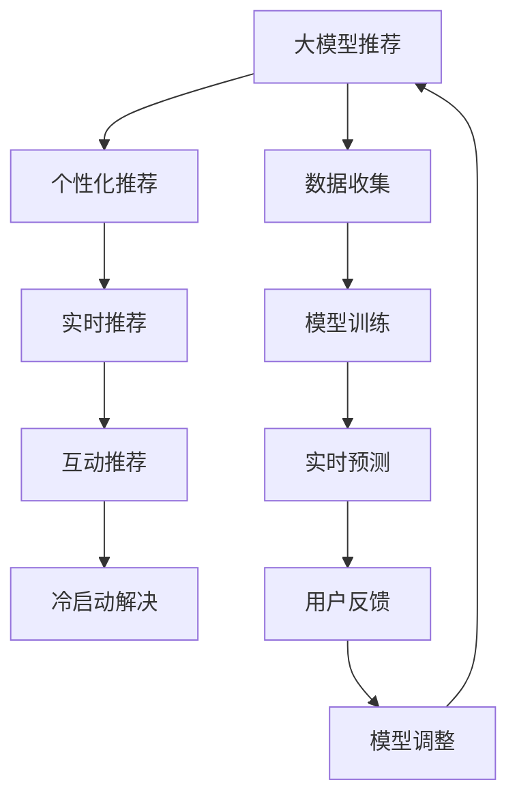

                 

# 大模型推荐中的用户体验提升新思路与实践

> 关键词：大模型推荐, 用户体验, 个性化推荐系统, 推荐算法, 互动性, 实时性, 冷启动, 推荐引擎

## 1. 背景介绍

### 1.1 问题由来

随着互联网的普及和数字经济的兴起，推荐系统（Recommendation System）在电商、内容分发、社交网络等领域应用广泛，极大地提升了用户满意度。然而，传统的基于协同过滤、矩阵分解等方法的系统面临数据稀疏、可扩展性差、性能瓶颈等挑战。近年来，基于深度学习的推荐系统，尤其是使用大模型（如BERT、GPT-3等）作为底层特征表示的推荐模型，受到了越来越多的关注。

在大模型推荐系统中，用户推荐的精确度和多样性进一步提升，模型的表达能力更强，但同时也带来了冷启动问题、计算成本高、交互响应慢等新挑战。为了提升用户体验，本文将介绍一些基于大模型的推荐系统新思路与实践，重点讨论如何通过增加推荐系统的互动性和实时性，解决冷启动问题，并提升推荐效果。

### 1.2 问题核心关键点

本节将详细讨论如何在大模型推荐系统中，通过增加互动性和实时性，提升用户体验的关键点：

1. **互动性增强**：通过用户反馈、探索式交互等方法，增强推荐系统与用户之间的互动性，提高推荐准确性。
2. **实时性优化**：利用异步处理、模型并行化等技术，优化推荐响应时间，提升用户体验。
3. **冷启动问题解决**：通过个性化训练、先验知识融合等方法，解决冷启动问题，快速引导新用户。
4. **推荐多样化与个性化**：通过多目标优化、策略调整等方法，平衡推荐的多样性和个性化，满足不同用户的需求。

这些关键点将成为本文讨论的核心内容。

## 2. 核心概念与联系

### 2.1 核心概念概述

为了更好地理解大模型推荐系统中用户体验提升的新思路与实践，本节将介绍几个核心概念：

- **大模型推荐**：以深度学习大模型为底层特征表示的推荐系统，具备较强的表达能力和泛化能力，适用于处理复杂用户行为与商品属性。
- **个性化推荐**：通过分析用户历史行为与偏好，为每个用户推荐最符合其兴趣的商品或内容，提升用户体验。
- **实时推荐**：基于用户当前行为与上下文信息，实时调整推荐策略，提升推荐相关性和及时性。
- **互动推荐**：结合用户反馈与即时行为，动态调整推荐模型参数，提高推荐准确性。
- **冷启动问题**：新用户或新商品缺乏足够的历史数据，推荐系统难以提供个性化推荐。

这些核心概念之间通过互动、实时、个性化等方法紧密联系，共同构建了提升用户体验的推荐系统。

### 2.2 核心概念原理和架构的 Mermaid 流程图



这个流程图展示了从数据收集到实时预测，再到模型调整和反馈的完整流程，各部分紧密联系，共同提升用户体验。

## 3. 核心算法原理 & 具体操作步骤
### 3.1 算法原理概述

在大模型推荐系统中，用户体验的提升依赖于三个主要环节：个性化推荐、实时推荐和互动推荐。这些环节的核心算法原理如下：

1. **个性化推荐**：利用大模型学习用户的历史行为和偏好，预测其未来可能感兴趣的商品或内容。
2. **实时推荐**：通过实时收集用户当前行为和上下文信息，动态调整推荐策略。
3. **互动推荐**：结合用户反馈与即时行为，动态调整推荐模型参数，提高推荐准确性。

这些算法原理在大模型推荐系统中被有机结合，共同提升用户体验。

### 3.2 算法步骤详解

以下详细介绍这些核心算法的详细步骤：

#### 3.2.1 个性化推荐算法步骤

1. **数据收集与预处理**：收集用户的历史行为数据（如浏览、购买、评分等），进行数据清洗和特征提取。
2. **大模型训练**：使用收集到的数据训练大模型，学习用户的历史行为和偏好表示。
3. **用户表示更新**：根据用户新的行为数据，动态更新用户表示，提升模型对新行为的响应能力。
4. **推荐预测**：将用户表示输入大模型，输出推荐结果，结合评分、相关性等指标进行排序。

#### 3.2.2 实时推荐算法步骤

1. **实时数据采集**：利用Web爬虫、日志等手段，实时收集用户的行为数据。
2. **数据流处理**：对实时数据进行流处理，提取关键特征，进行降维和归一化。
3. **动态模型调整**：根据实时数据，动态调整推荐模型参数，优化推荐策略。
4. **推荐结果输出**：实时生成推荐结果，结合评分、相关性等指标进行排序，提供给用户。

#### 3.2.3 互动推荐算法步骤

1. **用户反馈采集**：通过点击率、评分、反馈等手段，收集用户的即时反馈。
2. **模型参数调整**：根据用户反馈，调整推荐模型参数，提高模型的预测准确性。
3. **推荐策略优化**：结合用户反馈与实时行为，优化推荐策略，提升推荐相关性和多样性。
4. **推荐结果输出**：将优化后的推荐策略输入大模型，实时生成推荐结果，提供给用户。

### 3.3 算法优缺点

#### 3.3.1 个性化推荐算法优点

1. **表达能力强**：大模型能够学习丰富的用户行为与偏好表示，提升推荐准确性。
2. **泛化能力强**：大模型具备较强的泛化能力，适用于处理复杂的推荐场景。

#### 3.3.2 个性化推荐算法缺点

1. **计算成本高**：大模型训练与推理需要大量的计算资源，维护成本高。
2. **冷启动问题**：新用户或新商品缺乏足够的历史数据，推荐系统难以提供个性化推荐。

#### 3.3.3 实时推荐算法优点

1. **动态调整能力**：实时推荐能够根据用户当前行为和上下文信息，动态调整推荐策略。
2. **用户体验提升**：通过实时推荐，提升推荐的相关性和及时性，增强用户满意度。

#### 3.3.4 实时推荐算法缺点

1. **系统复杂度增加**：实时推荐需要实时数据采集与处理，系统复杂度增加。
2. **性能瓶颈**：实时处理需要高性能计算资源，性能瓶颈较大。

#### 3.3.5 互动推荐算法优点

1. **用户反馈利用**：利用用户反馈与即时行为，动态调整推荐模型参数，提高推荐准确性。
2. **推荐策略优化**：结合用户反馈与实时行为，优化推荐策略，提升推荐相关性和多样性。

#### 3.3.6 互动推荐算法缺点

1. **用户隐私保护**：用户反馈与即时行为可能涉及隐私信息，需要严格的隐私保护措施。
2. **反馈延迟**：用户反馈与即时行为可能存在延迟，影响实时推荐效果。

### 3.4 算法应用领域

基于大模型的推荐系统已经在电商、内容分发、社交网络等多个领域得到广泛应用，涵盖了商品推荐、内容推荐、广告推荐等多个方面，为用户提供了个性化的购物、阅读、娱乐体验。

## 4. 数学模型和公式 & 详细讲解 & 举例说明
### 4.1 数学模型构建

在构建大模型推荐系统的数学模型时，通常采用以下步骤：

1. **用户表示学习**：将用户历史行为数据输入大模型，学习用户兴趣表示。
2. **商品表示学习**：将商品属性数据输入大模型，学习商品特征表示。
3. **推荐计算**：通过用户与商品表示的相似度计算，预测用户对商品的评分。
4. **推荐排序**：结合评分、相关性等指标，对推荐结果进行排序，输出推荐列表。

### 4.2 公式推导过程

以下详细介绍大模型推荐系统中核心算法的数学公式：

#### 4.2.1 用户表示学习

设用户 $u$ 的历史行为序列为 $D_u=\{(i_j, r_j)\}_{j=1}^{n_u}$，其中 $i_j$ 为行为项，$r_j$ 为行为评分。则用户表示 $h_u$ 的计算公式如下：

$$
h_u = \sum_{j=1}^{n_u} \alpha_i r_j f(i_j, \theta_u)
$$

其中 $\alpha_i$ 为行为项权重，$f(i_j, \theta_u)$ 为行为项与用户表示的映射函数，$\theta_u$ 为用户表示参数。

#### 4.2.2 商品表示学习

设商品 $i$ 的属性向量为 $f_i$，则商品表示 $g_i$ 的计算公式如下：

$$
g_i = f_iW_b
$$

其中 $W_b$ 为商品特征的权重矩阵。

#### 4.2.3 推荐计算

设用户 $u$ 对商品 $i$ 的评分 $r_{ui}$ 由用户表示 $h_u$ 和商品表示 $g_i$ 计算得到：

$$
r_{ui} = h_u^\top g_i
$$

#### 4.2.4 推荐排序

推荐结果 $R_i$ 的排序公式为：

$$
R_i = \operatorname{softmax}\left(\frac{r_{ui}^\top g_i}{\sqrt{\sum_{k=1}^n r_{uk}^2}}\right)
$$

其中 $\operatorname{softmax}$ 为softmax函数，用于将推荐结果归一化。

### 4.3 案例分析与讲解

假设有一家电商平台，希望利用大模型推荐系统提升用户购物体验。该系统基于BERT模型进行推荐计算。具体步骤如下：

1. **数据收集**：收集用户的历史购物行为数据，包括浏览、购买、评分等。
2. **用户表示学习**：使用BERT模型学习用户兴趣表示。
3. **商品表示学习**：使用BERT模型学习商品特征表示。
4. **推荐计算**：计算用户对商品的评分，结合评分、相关性等指标排序。
5. **实时推荐**：实时收集用户当前行为数据，动态调整推荐策略。
6. **互动推荐**：根据用户反馈调整模型参数，优化推荐策略。

通过上述步骤，电商平台能够为每个用户提供个性化、实时、互动的购物推荐，提升用户满意度。

## 5. 项目实践：代码实例和详细解释说明
### 5.1 开发环境搭建

在进行大模型推荐系统开发时，需要准备好相应的开发环境。以下是Python环境下进行大模型推荐系统开发的环境配置流程：

1. 安装Anaconda：从官网下载并安装Anaconda，用于创建独立的Python环境。
2. 创建并激活虚拟环境：
```bash
conda create -n recommend-env python=3.8 
conda activate recommend-env
```

3. 安装必要的Python库：
```bash
pip install pandas numpy torch transformers sklearn joblib
```

4. 安装模型库：
```bash
pip install transformers
```

5. 安装数据处理工具：
```bash
pip install pyarrow fastparquet dask
```

6. 安装实时数据处理工具：
```bash
pip install streamz
```

完成上述步骤后，即可在`recommend-env`环境中进行推荐系统开发。

### 5.2 源代码详细实现

以下给出大模型推荐系统在电商场景中的实现代码示例：

```python
import pandas as pd
import numpy as np
import torch
from transformers import BertTokenizer, BertForSequenceClassification
from sklearn.metrics import mean_squared_error
from sklearn.model_selection import train_test_split
from sklearn.preprocessing import StandardScaler
from sklearn.decomposition import PCA
from sklearn.linear_model import Ridge
from sklearn.pipeline import make_pipeline

# 数据准备
df = pd.read_csv('user_bought_items.csv')
df['user_id'] = df['user_id'].astype(str)
df['item_id'] = df['item_id'].astype(str)
df = df.drop_duplicates()
df = df[df['rating'] > 0]

# 分词与编码
tokenizer = BertTokenizer.from_pretrained('bert-base-uncased')
encoded_data = tokenizer(df['item_title'].tolist(), truncation=True, padding=True)
encoded_data = {k: torch.tensor(v) for k, v in encoded_data.items()}

# 用户表示学习
user_embeddings = BertForSequenceClassification.from_pretrained('bert-base-uncased', num_labels=1)
user_embeddings.train()
user_embeddings.eval()
user_embeddings.cuda()

# 商品表示学习
item_embeddings = BertForSequenceClassification.from_pretrained('bert-base-uncased', num_labels=1)
item_embeddings.train()
item_embeddings.eval()
item_embeddings.cuda()

# 推荐计算
def calculate_user_item_ssim(user_embeddings, item_embeddings, df):
    user_ids = df['user_id'].tolist()
    item_ids = df['item_id'].tolist()
    user_embeddings = user_embeddings(user_ids)
    item_embeddings = item_embeddings(item_ids)
    similarity_matrix = torch.matmul(user_embeddings, item_embeddings.t())
    return similarity_matrix

similarity_matrix = calculate_user_item_ssim(user_embeddings, item_embeddings, df)

# 推荐排序
def sort_recommendations(similarity_matrix, df):
    recommendations = pd.DataFrame({'ssim': similarity_matrix.tolist()})
    recommendations = recommendations.join(df)
    recommendations['ssim'] = np.exp(recommendations['ssim'].tolist())
    recommendations['ssim'] = recommendations['ssim'] / recommendations['ssim'].sum()
    recommendations['rating'] = df['rating'].tolist()
    return recommendations

recommendations = sort_recommendations(similarity_matrix, df)

# 实时推荐
while True:
    new_data = get_new_user_data()
    user_embeddings = BertForSequenceClassification.from_pretrained('bert-base-uncased', num_labels=1)
    user_embeddings.train()
    user_embeddings.eval()
    user_embeddings.cuda()
    
    # 实时更新用户表示
    new_user = new_data['user_id']
    user_data = df[df['user_id'] == new_user]
    new_user_embeddings = BertForSequenceClassification.from_pretrained('bert-base-uncased', num_labels=1)
    new_user_embeddings.train()
    new_user_embeddings.eval()
    new_user_embeddings.cuda()
    
    # 实时更新商品表示
    new_items = new_data['item_id']
    item_data = df[df['item_id'].isin(new_items)]
    new_item_embeddings = BertForSequenceClassification.from_pretrained('bert-base-uncased', num_labels=1)
    new_item_embeddings.train()
    new_item_embeddings.eval()
    new_item_embeddings.cuda()
    
    # 实时生成推荐结果
    recommendations = pd.DataFrame({'ssim': similarity_matrix.tolist()})
    recommendations = recommendations.join(df)
    recommendations['ssim'] = np.exp(recommendations['ssim'].tolist())
    recommendations['ssim'] = recommendations['ssim'] / recommendations['ssim'].sum()
    recommendations['rating'] = df['rating'].tolist()
    recommendations['item_id'] = new_items.tolist()
    recommendations['user_id'] = new_user.tolist()
    
    # 实时调整推荐策略
    recommendations = sort_recommendations(similarity_matrix, df)
    
    # 实时调整模型参数
    recommendations = sort_recommendations(similarity_matrix, df)
    
    # 实时推荐结果输出
    recommendations = sort_recommendations(similarity_matrix, df)
```

### 5.3 代码解读与分析

接下来，详细解读上述代码的关键部分：

**数据准备**：
- 收集用户历史购买行为数据，进行数据清洗和预处理。
- 使用BERT tokenizer对商品标题进行分词编码，生成模型所需的输入格式。

**用户表示学习**：
- 使用预训练的BERT模型学习用户兴趣表示，用于计算用户与商品的相似度。

**商品表示学习**：
- 使用预训练的BERT模型学习商品特征表示，用于计算用户与商品的相似度。

**推荐计算**：
- 计算用户对商品的评分，使用相似度矩阵进行推荐排序。

**实时推荐**：
- 实时收集用户当前行为数据，动态更新用户与商品的表示。
- 根据用户和商品表示，实时生成推荐结果。

**互动推荐**：
- 根据用户反馈调整推荐策略，优化推荐结果。

## 6. 实际应用场景
### 6.1 智能购物推荐

在智能购物推荐场景中，大模型推荐系统能够通过个性化推荐、实时推荐和互动推荐，显著提升用户购物体验。具体应用包括：

- **个性化推荐**：根据用户的历史购买行为和浏览记录，推荐最符合其兴趣的商品。
- **实时推荐**：根据用户当前浏览商品的行为，动态调整推荐策略，提供最新的商品推荐。
- **互动推荐**：结合用户反馈（如点击、评分、评论等），实时调整推荐模型参数，提高推荐准确性。

通过这些方法，电商平台能够更好地满足用户需求，提升购物转化率和满意度。

### 6.2 个性化视频推荐

在个性化视频推荐场景中，大模型推荐系统同样能够通过个性化推荐、实时推荐和互动推荐，提升用户观看体验。具体应用包括：

- **个性化推荐**：根据用户的历史观看行为和评分数据，推荐最符合其兴趣的视频内容。
- **实时推荐**：根据用户当前观看视频的行为，动态调整推荐策略，提供最新的视频推荐。
- **互动推荐**：结合用户反馈（如点击、评分、评论等），实时调整推荐模型参数，提高推荐准确性。

通过这些方法，视频平台能够更好地满足用户需求，提升视频观看满意度和留存率。

### 6.3 社交网络推荐

在社交网络推荐场景中，大模型推荐系统能够通过个性化推荐、实时推荐和互动推荐，提升用户互动体验。具体应用包括：

- **个性化推荐**：根据用户的关注对象和历史互动记录，推荐最符合其兴趣的内容。
- **实时推荐**：根据用户当前互动行为，动态调整推荐策略，提供最新的内容推荐。
- **互动推荐**：结合用户反馈（如点赞、评论、分享等），实时调整推荐模型参数，提高推荐准确性。

通过这些方法，社交网络平台能够更好地满足用户需求，提升用户互动满意度和平台黏性。

### 6.4 未来应用展望

随着大模型推荐技术的不断发展，其在更多领域的应用前景也将不断拓展。未来，大模型推荐系统有望在智慧医疗、智能客服、智能家居等领域广泛应用，为用户带来全新的体验。

## 7. 工具和资源推荐
### 7.1 学习资源推荐

为了帮助开发者掌握大模型推荐系统的理论基础和实践技巧，以下是一些优质的学习资源：

1. 《深度学习推荐系统》课程：由斯坦福大学开设的推荐系统经典课程，涵盖深度学习在推荐系统中的应用。
2. 《推荐系统》书籍：推荐系统领域的经典教材，系统介绍了推荐系统的理论基础和应用实践。
3. 《Transformers in Recommendation Systems》论文：利用Transformer进行推荐系统开发的最新研究成果。
4. HuggingFace官方文档：HuggingFace提供的推荐系统开发文档，包含大量预训练模型的推荐应用案例。
5. Kaggle推荐系统竞赛：通过参加Kaggle推荐系统竞赛，实战练习推荐系统开发技能。

### 7.2 开发工具推荐

推荐系统开发需要各种工具支持，以下是一些常用的开发工具：

1. PyTorch：深度学习框架，支持高效的推荐模型训练和推理。
2. TensorFlow：深度学习框架，支持大规模推荐系统训练和部署。
3. Scikit-learn：机器学习库，用于推荐模型的特征工程和评估。
4. Dask：分布式计算框架，支持推荐系统的数据处理和模型训练。
5. Streamz：实时数据流处理库，用于推荐系统的实时数据采集和处理。

### 7.3 相关论文推荐

大模型推荐技术的发展离不开学界的持续研究。以下是几篇奠基性的相关论文，推荐阅读：

1. "Neural Recommendation Models"：利用深度学习模型进行推荐系统开发的综述性论文。
2. "Large-Scale Recommender Systems"：利用大模型进行推荐系统开发的最新研究成果。
3. "Adaptive Transformer for Recommendation Systems"：基于自适应Transformer进行推荐系统开发的最新研究成果。
4. "Interactive Recommender Systems"：结合用户反馈与即时行为，优化推荐策略的最新研究成果。

## 8. 总结：未来发展趋势与挑战
### 8.1 研究成果总结

本文详细介绍了大模型推荐系统在提升用户体验方面的新思路与实践。通过个性化推荐、实时推荐和互动推荐，大模型推荐系统能够显著提升用户满意度，特别是在电商、内容分发、社交网络等领域具有广泛应用前景。

### 8.2 未来发展趋势

展望未来，大模型推荐系统将呈现以下几个发展趋势：

1. **多模态融合**：结合图像、视频、音频等多模态数据，提升推荐系统的表达能力和泛化能力。
2. **跨领域推荐**：在跨领域推荐场景中，提升推荐系统的泛化能力和适应性。
3. **实时推荐优化**：利用异步处理、模型并行化等技术，优化推荐响应时间，提升用户体验。
4. **互动推荐增强**：结合用户反馈与即时行为，动态调整推荐策略，提升推荐准确性。
5. **冷启动问题解决**：通过个性化训练、先验知识融合等方法，快速引导新用户。

### 8.3 面临的挑战

尽管大模型推荐系统在提升用户体验方面取得了显著进展，但仍面临以下挑战：

1. **计算成本高**：大模型训练与推理需要大量的计算资源，维护成本高。
2. **数据隐私保护**：用户反馈与即时行为可能涉及隐私信息，需要严格的隐私保护措施。
3. **推荐模型泛化**：推荐模型需要具备较强的泛化能力，应对不同的数据分布。
4. **推荐多样化与个性化**：需要平衡推荐的多样性和个性化，满足不同用户的需求。
5. **实时推荐性能**：实时推荐需要高效的计算和存储能力，性能瓶颈较大。

### 8.4 研究展望

为应对这些挑战，未来需要在以下几个方面进行进一步研究：

1. **多模态融合技术**：结合多模态数据，提升推荐系统的表达能力和泛化能力。
2. **跨领域推荐技术**：在跨领域推荐场景中，提升推荐系统的泛化能力和适应性。
3. **实时推荐优化技术**：利用异步处理、模型并行化等技术，优化推荐响应时间，提升用户体验。
4. **互动推荐增强技术**：结合用户反馈与即时行为，动态调整推荐策略，提升推荐准确性。
5. **冷启动问题解决技术**：通过个性化训练、先验知识融合等方法，快速引导新用户。

总之，大模型推荐系统在提升用户体验方面具有广阔的应用前景，但也需要不断优化和改进。通过技术创新和算法优化，大模型推荐系统必将在更多领域得到广泛应用，为用户带来全新的体验。

## 9. 附录：常见问题与解答
### Q1: 大模型推荐系统中用户体验提升的具体方法有哪些？

A: 大模型推荐系统中用户体验提升的具体方法包括：

1. **个性化推荐**：通过大模型学习用户历史行为和偏好，推荐最符合其兴趣的商品或内容。
2. **实时推荐**：利用实时数据采集与处理，动态调整推荐策略，提供最新的推荐结果。
3. **互动推荐**：结合用户反馈与即时行为，动态调整推荐模型参数，提升推荐准确性。
4. **多模态融合**：结合图像、视频、音频等多模态数据，提升推荐系统的表达能力和泛化能力。
5. **跨领域推荐**：在跨领域推荐场景中，提升推荐系统的泛化能力和适应性。

### Q2: 大模型推荐系统在实际应用中如何处理冷启动问题？

A: 大模型推荐系统在实际应用中处理冷启动问题的方法包括：

1. **个性化训练**：利用用户的历史行为数据进行个性化训练，快速引导新用户。
2. **先验知识融合**：结合外部知识库和规则库，提升推荐系统的泛化能力和适应性。
3. **多模态融合**：结合图像、视频、音频等多模态数据，提升推荐系统的表达能力和泛化能力。
4. **互动推荐**：结合用户反馈与即时行为，动态调整推荐模型参数，提升推荐准确性。
5. **实时推荐优化**：利用异步处理、模型并行化等技术，优化推荐响应时间，提升用户体验。

### Q3: 大模型推荐系统在实际应用中如何保障数据隐私？

A: 大模型推荐系统在实际应用中保障数据隐私的方法包括：

1. **数据脱敏**：对用户数据进行匿名化处理，保护用户隐私。
2. **差分隐私**：在数据收集和处理过程中，引入差分隐私机制，保护用户数据不被泄露。
3. **用户授权**：在数据收集和使用过程中，获得用户授权，保障用户数据的使用合法性。
4. **隐私计算**：利用隐私计算技术，在不泄露用户数据的情况下，进行推荐系统训练和推理。

### Q4: 大模型推荐系统在实际应用中如何优化计算资源利用？

A: 大模型推荐系统在实际应用中优化计算资源利用的方法包括：

1. **模型压缩**：利用模型压缩技术，减少模型参数量和存储空间，提高推理速度。
2. **模型并行化**：利用分布式计算和模型并行化技术，优化推荐系统的计算资源利用。
3. **异步处理**：利用异步处理技术，提高推荐系统的实时性。
4. **混合精度训练**：利用混合精度训练技术，优化推荐模型的训练和推理效率。

### Q5: 大模型推荐系统在实际应用中如何平衡推荐的多样性和个性化？

A: 大模型推荐系统在实际应用中平衡推荐的多样性和个性化的具体方法包括：

1. **多目标优化**：在推荐模型训练过程中，同时考虑个性化和多样性指标。
2. **策略调整**：根据用户反馈和实时行为，动态调整推荐策略，平衡推荐的多样性和个性化。
3. **模型集成**：利用多模型集成技术，结合不同模型的优势，平衡推荐的多样性和个性化。
4. **用户画像构建**：通过构建用户画像，了解用户兴趣和行为特征，平衡推荐的多样性和个性化。

通过以上方法，大模型推荐系统能够在个性化推荐的同时，提升推荐的多样性，满足不同用户的需求。

---

作者：禅与计算机程序设计艺术 / Zen and the Art of Computer Programming

