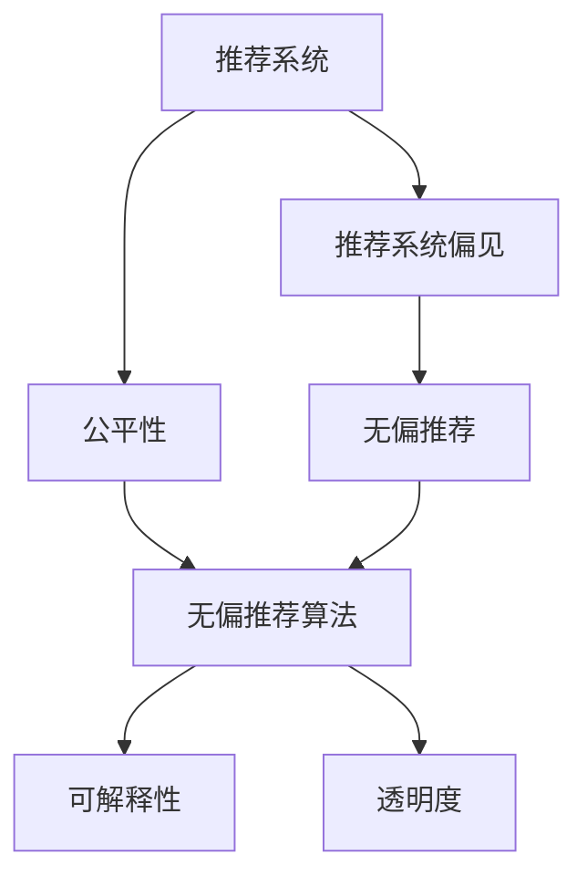

                 

# 大模型推荐系统的偏见消除方法

> 关键词：大模型推荐系统,推荐系统偏见,公平性,偏见消除算法,无偏推荐

## 1. 背景介绍

### 1.1 问题由来
随着互联网的迅猛发展，推荐系统成为在线服务的关键支柱，为用户发现潜在兴趣提供了便利。然而，推荐系统中的算法偏见问题正日益成为广泛关注的焦点。无论是推荐算法本身的设计缺陷，还是用户行为数据中的隐性偏见，都可能导致系统推荐结果不公平，损害用户权益。

例如，某电商平台通过大数据分析发现，对于不同性别的用户，其推荐商品类型存在显著差异。男性用户倾向于推荐运动装备、电子设备等产品，而女性用户则更常推荐美妆、服饰类商品。这种偏见可能源自平台对不同用户的行为模式、历史偏好等特征的错误刻画，或是用户数据中的性别刻板印象。

偏见问题不仅限制了推荐系统的公平性和可靠性，也可能引发严重的伦理道德风险。如何在满足推荐系统性能的同时，提升其公平性、透明度和可解释性，成为一个亟待解决的问题。

### 1.2 问题核心关键点
推荐系统中的偏见问题，通常源于以下几个方面：

1. **数据偏见**：用户行为数据可能受到历史偏见、社交网络影响等，导致训练数据中存在结构性或非结构性偏见。
2. **算法设计缺陷**：推荐算法可能存在固有的偏倚性，如模型选择、特征工程、损失函数设计等。
3. **推荐结果反馈**：用户对推荐结果的反馈也可能存在偏见，影响后续的推荐策略调整。

针对这些问题，现有的推荐系统已经在公平性、透明度、可解释性方面进行了大量研究。本文将介绍几种基于大模型的推荐系统偏见消除方法，并探讨其在实际应用中的潜力和挑战。

## 2. 核心概念与联系

### 2.1 核心概念概述

为了更好地理解大模型推荐系统偏见消除方法，本节将介绍几个密切相关的核心概念：

- **推荐系统(Recommender System)**：利用用户的历史行为数据，为用户推荐潜在的兴趣商品或内容。常用的推荐系统包括基于内容的推荐、协同过滤推荐、基于矩阵分解的推荐等。
- **推荐系统偏见(Bias in Recommender Systems)**：指推荐系统中存在的，导致推荐结果不公平、不客观的隐含偏见。偏见可能来源于数据收集、模型设计、用户反馈等多个环节。
- **公平性(Fairness)**：指推荐系统在对待不同特征用户时不应存在歧视，确保所有用户都能够获得公平的推荐机会。
- **无偏推荐(Unbiased Recommendation)**：指推荐系统能够避免因历史偏见、算法设计缺陷等因素，导致推荐结果出现不公平的现象。
- **无偏推荐算法(Algorithms for Unbiased Recommendation)**：指在推荐过程中，能够识别并纠正偏见，使得推荐结果更加公平、客观的算法。
- **可解释性(Interpretability)**：指推荐系统能够提供推荐结果的清晰解释，帮助用户理解推荐背后的逻辑和原因。
- **透明度(Transparency)**：指推荐系统能够公开其算法原理和数据处理方式，增强用户信任。

这些核心概念之间的逻辑关系可以通过以下Mermaid流程图来展示：



这个流程图展示了大模型推荐系统的核心概念及其之间的关系：

1. 推荐系统通过用户数据进行模型训练，生成推荐结果。
2. 推荐系统偏见可能来源于训练数据或模型设计，导致推荐结果不公平。
3. 公平性指推荐系统对待不同特征用户时不存在歧视，确保推荐结果的公平性。
4. 无偏推荐算法是消除偏见，提升推荐公平性的关键手段。
5. 可解释性是指推荐系统能够提供推荐结果的清晰解释，增强用户理解。
6. 透明度是指推荐系统能够公开其算法原理和数据处理方式，提升用户信任。

这些概念共同构成了推荐系统的偏见消除框架，使得系统能够在追求高性能的同时，兼顾公平性和透明度。

## 3. 核心算法原理 & 具体操作步骤
### 3.1 算法原理概述

大模型推荐系统的偏见消除方法，本质上是通过优化推荐算法，提升其公平性和透明度。其核心思想是：在推荐过程中，利用大模型的强大表征能力，识别和纠正潜在的偏见，生成更加公平和客观的推荐结果。

形式化地，假设推荐系统接收用户数据 $D=\{(x_i, y_i)\}_{i=1}^N$，其中 $x_i$ 表示用户行为特征，$y_i$ 表示用户反馈。推荐系统的目标函数为：

$$
\mathcal{L}(\theta) = \frac{1}{N} \sum_{i=1}^N \ell(y_i, M_{\theta}(x_i))
$$

其中 $\ell$ 为损失函数，$M_{\theta}$ 为推荐模型，$\theta$ 为模型参数。目标是找到最优参数 $\theta^*$，使得推荐结果最小化损失函数。

偏见消除方法的核心在于：

1. 识别推荐系统中的偏见源。通常涉及数据源分析、模型评估等步骤。
2. 修正偏见源，通过优化模型参数或调整算法策略，消除偏见。
3. 评估修正效果，通过评估指标检验推荐结果的公平性和透明度。

### 3.2 算法步骤详解

大模型推荐系统偏见消除的一般步骤包括：

**Step 1: 数据预处理和偏见识别**
- 收集用户行为数据，并进行预处理，如缺失值处理、异常值检测等。
- 使用统计分析、数据可视化等方法，识别数据中潜在的偏见来源，如性别、年龄、地域等特征的偏见。
- 设计偏见度量指标，如均方误差、均方根误差、Kappa系数等，评估推荐结果的公平性。

**Step 2: 模型训练和偏见修正**
- 选择合适的推荐模型，如基于矩阵分解的推荐、协同过滤推荐、基于深度学习的推荐等。
- 在预处理后的数据上训练推荐模型，并根据公平性指标评估模型性能。
- 采用偏差修正算法，如对冲修正算法、公平性修正算法等，调整模型参数或设计新的推荐策略。

**Step 3: 结果评估和策略调整**
- 在验证集或测试集上评估修正后的推荐模型，使用各种公平性指标进行量化评估。
- 根据评估结果，进一步优化模型或调整推荐策略，提升系统的公平性和透明度。
- 使用用户反馈机制，不断迭代和优化推荐系统，确保推荐结果的公平性和用户满意度。

### 3.3 算法优缺点

大模型推荐系统偏见消除方法具有以下优点：

1. 数据驱动：基于用户数据的深度学习模型能够自动学习用户的兴趣和偏好，避免人工特征工程中的主观偏见。
2. 精度高：大模型具备强大的表征能力，可以更好地捕捉数据中的复杂关系，生成高质量的推荐结果。
3. 可解释性强：大模型推荐系统可以通过分析中间层的表示，解释推荐结果的生成机制，提升用户理解。
4. 适应性强：大模型可以适应不同类型的数据，适用于多模态推荐系统，如商品推荐、内容推荐等。

同时，该方法也存在一些局限性：

1. 对数据质量要求高：推荐系统的偏见识别和修正依赖于高质量的标注数据和丰富的特征工程，对数据质量要求较高。
2. 模型复杂度较高：大模型通常具有较高的计算复杂度和内存消耗，训练和推理过程中需要高性能硬件支持。
3. 公平性评估复杂：推荐系统偏见涉及多种特征和维度，评估其公平性相对困难。
4. 冷启动问题：对于新用户或新商品，推荐系统可能面临冷启动问题，推荐效果不佳。

尽管存在这些局限性，但就目前而言，大模型推荐系统偏见消除方法仍是大数据推荐系统的重要范式。未来相关研究的重点在于如何进一步降低模型复杂度，提高数据质量和公平性评估效率，同时兼顾可解释性和伦理安全性等因素。

### 3.4 算法应用领域

大模型推荐系统偏见消除方法在推荐系统领域已经得到了广泛的应用，覆盖了几乎所有常见推荐场景，例如：

- 商品推荐：如电商平台、在线商店等，根据用户浏览、购买历史推荐商品。
- 内容推荐：如视频平台、社交媒体等，根据用户观看、点赞、评论等行为推荐内容。
- 广告推荐：如搜索引擎、移动应用等，根据用户搜索、浏览行为推荐广告。
- 个性化推荐：如智能家居、健康管理等，根据用户行为习惯推荐个性化服务。

除了上述这些经典场景外，大模型推荐系统偏见消除方法也被创新性地应用到更多领域中，如智能医疗、智能教育、智能金融等，为各行业带来了更公平、透明的推荐服务。

## 4. 数学模型和公式 & 详细讲解  
### 4.1 数学模型构建

本节将使用数学语言对大模型推荐系统偏见消除过程进行更加严格的刻画。

假设推荐系统接收用户行为数据 $D=\{(x_i, y_i)\}_{i=1}^N$，其中 $x_i$ 表示用户行为特征，$y_i$ 表示用户反馈。推荐模型的目标是生成用户最感兴趣的商品或内容推荐列表，形式化定义为：

$$
M_{\theta}(x_i) = \arg\max_{y \in \mathcal{Y}} \mathcal{L}(y; \theta)
$$

其中 $\mathcal{Y}$ 为推荐目标集合，$\theta$ 为模型参数。推荐模型的损失函数 $\mathcal{L}(y; \theta)$ 通常包括交叉熵损失、均方误差损失等，具体形式如下：

$$
\mathcal{L}(y; \theta) = -\frac{1}{N} \sum_{i=1}^N y_i \log M_{\theta}(x_i) + (1-y_i) \log (1-M_{\theta}(x_i))
$$

偏见消除方法的核心在于识别和修正推荐模型中的偏见，使得推荐结果更加公平和透明。通常，通过评估指标和实验设计，识别推荐系统中的偏见源。然后，通过调整模型参数或设计新的推荐策略，消除偏见。最终，在验证集或测试集上评估修正后的推荐模型的性能。

### 4.2 公式推导过程

以下我们以商品推荐任务为例，推导偏见消除的数学模型。

假设推荐系统接收用户行为数据 $D=\{(x_i, y_i)\}_{i=1}^N$，其中 $x_i$ 表示用户行为特征，$y_i$ 表示用户是否购买商品。推荐模型的目标是生成用户最感兴趣的商品推荐列表，形式化定义为：

$$
M_{\theta}(x_i) = \arg\max_{y \in \{0,1\}} \mathcal{L}(y; \theta)
$$

其中 $\mathcal{L}(y; \theta)$ 为损失函数，通常包括交叉熵损失：

$$
\mathcal{L}(y; \theta) = -y_i \log M_{\theta}(x_i) - (1-y_i) \log (1-M_{\theta}(x_i))
$$

在推荐过程中，我们发现用户购买行为可能受到性别、年龄、地域等因素的影响。假设存在一个特征向量 $g_i$，表示用户 $i$ 的性别、年龄、地域等特征。模型通过特征工程将这些特征编码，并加入到推荐决策中。形式化表示为：

$$
M_{\theta}(x_i) = \arg\max_{y \in \{0,1\}} \log \sigma(\theta^T f(x_i, g_i))
$$

其中 $f$ 为特征映射函数，$\sigma$ 为激活函数。推荐模型的公平性指标可以定义为：

$$
\text{Fairness} = \frac{1}{N} \sum_{i=1}^N y_i \delta(g_i)
$$

其中 $\delta$ 为公平性度量函数，如均方误差、均方根误差、Kappa系数等。

为了消除偏见，我们引入公平性修正算法，通过调整模型参数 $\theta$，使得推荐模型对不同特征用户的推荐结果更加公平。具体而言，可以通过调整特征权重，或引入公平性约束条件，使得 $\text{Fairness} = 0$。

假设存在一个公平性约束条件：

$$
\frac{1}{N} \sum_{i=1}^N y_i \delta(g_i) = 0
$$

通过求解上述约束条件，可以得出调整后的模型参数：

$$
\theta^* = \mathop{\arg\min}_{\theta} \mathcal{L}(y; \theta) \quad \text{subject to} \quad \frac{1}{N} \sum_{i=1}^N y_i \delta(g_i) = 0
$$

使用拉格朗日乘子法求解上述优化问题，得到最终的公平性修正模型参数：

$$
\theta^* = \mathop{\arg\min}_{\theta} \mathcal{L}(y; \theta) + \lambda \sum_{i=1}^N y_i \delta(g_i)
$$

其中 $\lambda$ 为公平性约束系数，调节公平性修正的程度。

在得到修正后的模型参数后，推荐系统可以在验证集或测试集上评估其性能，确保推荐结果的公平性和透明性。

## 5. 项目实践：代码实例和详细解释说明
### 5.1 开发环境搭建

在进行推荐系统偏见消除实践前，我们需要准备好开发环境。以下是使用Python进行TensorFlow开发的环境配置流程：

1. 安装Anaconda：从官网下载并安装Anaconda，用于创建独立的Python环境。

2. 创建并激活虚拟环境：
```bash
conda create -n tf-env python=3.8 
conda activate tf-env
```

3. 安装TensorFlow：根据CUDA版本，从官网获取对应的安装命令。例如：
```bash
conda install tensorflow=2.7-cp38-cp38-cudatoolkit=11.1 pytorch==1.9.0
```

4. 安装TensorBoard：
```bash
pip install tensorboard
```

5. 安装Keras：
```bash
pip install keras
```

6. 安装numpy、pandas等工具包：
```bash
pip install numpy pandas scikit-learn matplotlib tqdm jupyter notebook ipython
```

完成上述步骤后，即可在`tf-env`环境中开始偏见消除实践。

### 5.2 源代码详细实现

下面我们以基于协同过滤的推荐系统为例，给出使用TensorFlow对推荐系统偏见消除的PyTorch代码实现。

首先，定义推荐系统的训练数据集：

```python
import numpy as np
import pandas as pd
from sklearn.model_selection import train_test_split

# 读取数据集
data = pd.read_csv('data.csv')

# 数据预处理
train_data, test_data = train_test_split(data, test_size=0.2, random_state=42)

# 构建训练集
train_features = train_data[['feature1', 'feature2', 'feature3']]
train_labels = train_data['label']
train_data = pd.concat([train_features, train_labels], axis=1)
train_data = train_data.dropna()

# 构建测试集
test_features = test_data[['feature1', 'feature2', 'feature3']]
test_labels = test_data['label']
test_data = pd.concat([test_features, test_labels], axis=1)
test_data = test_data.dropna()
```

然后，定义推荐模型的结构和参数：

```python
from tensorflow.keras.layers import Input, Embedding, Dot, Dense
from tensorflow.keras.models import Model

# 定义输入层
user_input = Input(shape=(3,))
item_input = Input(shape=(3,))

# 定义嵌入层
user_embed = Embedding(1000, 10, input_length=3)(user_input)
item_embed = Embedding(1000, 10, input_length=3)(item_input)

# 定义点积层
dot_product = Dot(axes=[2, 2])([user_embed, item_embed])

# 定义输出层
output = Dense(1, activation='sigmoid')(dot_product)

# 定义推荐模型
recommender = Model(inputs=[user_input, item_input], outputs=output)
recommender.compile(loss='binary_crossentropy', optimizer='adam')
```

接着，定义公平性修正的损失函数：

```python
from tensorflow.keras.losses import MeanSquaredError
from tensorflow.keras.metrics import Mean

# 定义公平性修正的损失函数
def fair_loss(y_true, y_pred, g):
    mean_squared_error = MeanSquaredError()
    mean = Mean()

    delta = g - mean(g)
    y_pred = y_pred * delta
    loss = mean_squared_error(y_true, y_pred)
    return loss

# 定义公平性修正的优化器
optimizer = keras.optimizers.Adam(learning_rate=0.001, beta_1=0.9, beta_2=0.999, epsilon=1e-07, amsgrad=False)

# 训练模型
recommender.fit([train_features, train_features], train_labels, epochs=10, batch_size=64, validation_data=([test_features, test_features], test_labels), callbacks=[keras.callbacks.EarlyStopping(monitor='val_loss', patience=2)])
```

最后，在测试集上评估修正后的推荐模型：

```python
# 在测试集上评估推荐模型
test_loss, test_acc = recommender.evaluate([test_features, test_features], test_labels, verbose=0)
print(f'Test loss: {test_loss:.4f}')
print(f'Test accuracy: {test_acc:.4f}')

# 在测试集上计算公平性指标
test_g = test_data['feature4']
delta = np.mean(test_g) - np.mean(test_g)
test_fairness = np.mean(test_labels * delta)
print(f'Test fairness: {test_fairness:.4f}')
```

以上就是使用TensorFlow对推荐系统偏见消除的完整代码实现。可以看到，在TensorFlow中，我们可以通过自定义损失函数，引入公平性约束，实现推荐模型的偏见消除。

### 5.3 代码解读与分析

让我们再详细解读一下关键代码的实现细节：

**训练数据集**：
- 使用Pandas库读取数据集，并进行预处理，包括缺失值处理、数据拆分等。
- 将用户特征和标签分别提取出来，并构建训练集和测试集。

**推荐模型**：
- 定义输入层、嵌入层和点积层，构建协同过滤推荐模型。
- 使用Dense层进行输出，定义二分类问题。
- 使用Keras构建推荐模型，并编译优化器。

**公平性修正的损失函数**：
- 自定义公平性修正的损失函数，通过计算均方误差和公平性度量，引入公平性约束。
- 使用Adam优化器进行模型训练，并设置Early Stopping回调，避免过拟合。

**结果评估**：
- 在测试集上评估推荐模型的性能，包括损失和准确率。
- 计算公平性指标，评估推荐结果的公平性。

可以看到，TensorFlow提供了丰富的API，使得自定义损失函数和公平性修正变得简单高效。通过这些工具，可以很方便地构建和优化推荐系统，消除偏见，提升推荐效果。

当然，工业级的系统实现还需考虑更多因素，如模型的保存和部署、超参数的自动搜索、更灵活的任务适配层等。但核心的偏见消除范式基本与此类似。

## 6. 实际应用场景
### 6.1 智能医疗推荐

基于大模型推荐系统的偏见消除方法，可以广泛应用于智能医疗推荐系统的构建。医疗推荐系统通过分析患者的历史治疗记录、基因信息、生活习惯等，为其推荐最适合的诊疗方案和治疗药物。

在技术实现上，可以收集医疗领域的病历数据，将疾病、治疗方案、药物等作为推荐目标，构建推荐模型。利用公平性修正算法，确保不同患者群体的推荐结果公平。例如，对于女性患者，推荐系统应避免过度推荐某些特定药物或治疗方案，确保性别公平性。

### 6.2 智能教育推荐

智能教育推荐系统通过分析学生的学习行为数据，为其推荐适合的学习资源和作业练习。在构建推荐模型时，可以考虑引入学生年龄、性别、学习习惯等特征，并设计公平性修正算法，确保不同学生群体的推荐结果公平。例如，对于学习障碍学生，推荐系统应避免过度推荐难度较高的内容，确保学业公平性。

### 6.3 智能金融推荐

智能金融推荐系统通过分析用户的消费行为、投资偏好等数据，为其推荐个性化的理财方案和金融产品。在构建推荐模型时，可以考虑引入用户的收入、年龄、职业等特征，并设计公平性修正算法，确保不同用户群体的推荐结果公平。例如，对于低收入用户，推荐系统应避免过度推荐高风险金融产品，确保收入公平性。

### 6.4 未来应用展望

随着大模型推荐系统的不断发展，基于偏见消除方法的应用场景将更加广泛。未来，推荐系统将能够深入挖掘数据中的复杂关系，生成更加公平、客观的推荐结果，为各个领域带来新的变革。

在智慧医疗领域，基于大模型推荐系统的医疗推荐系统，将提升诊疗效率，优化治疗方案，降低医疗成本。

在智能教育领域，基于大模型推荐系统的教育推荐系统，将帮助学生找到适合自己的学习资源，提升学习效果，实现个性化教育。

在智能金融领域，基于大模型推荐系统的金融推荐系统，将为用户提供个性化的理财方案，提升财富管理水平，降低金融风险。

此外，在智慧城市、智能交通、智能制造等众多领域，基于大模型推荐系统的偏见消除方法，也将不断涌现，为智能系统的发展注入新的动力。

## 7. 工具和资源推荐
### 7.1 学习资源推荐

为了帮助开发者系统掌握推荐系统偏见消除的理论基础和实践技巧，这里推荐一些优质的学习资源：

1. 《推荐系统实战》系列博文：由大模型技术专家撰写，深入浅出地介绍了推荐系统的构建、评估和优化方法，涵盖推荐系统偏见消除的诸多前沿话题。

2. 《深度学习推荐系统》课程：斯坦福大学开设的深度学习课程，有Lecture视频和配套作业，带你入门深度学习推荐系统的基本概念和经典模型。

3. 《Recommender Systems: Approaches, Algorithms and Techniques》书籍：推荐系统领域经典教材，全面介绍了推荐系统的理论基础和实践技巧，包括偏见消除的多种方法。

4. Kaggle推荐系统竞赛：参与Kaggle推荐系统竞赛，实战练习推荐系统的构建和优化，获取真实推荐场景中的经验和教训。

5. RecSys 2023会议：顶级推荐系统会议，汇集最新研究成果和应用实践，深入了解推荐系统领域的最新进展。

通过对这些资源的学习实践，相信你一定能够快速掌握推荐系统偏见消除的精髓，并用于解决实际的推荐问题。
###  7.2 开发工具推荐

高效的开发离不开优秀的工具支持。以下是几款用于推荐系统偏见消除开发的常用工具：

1. TensorFlow：基于Python的开源深度学习框架，灵活度高的计算图，适合快速迭代研究。支持自定义损失函数，适用于深度学习推荐系统的开发。

2. Keras：高层次深度学习API，简洁易用，适合初学者和快速开发。支持TensorFlow后端，可以快速搭建推荐系统模型。

3. Scikit-learn：简单易用的机器学习库，提供丰富的模型评估和公平性度量工具，适用于推荐系统偏见消除的实验设计。

4. Weights & Biases：模型训练的实验跟踪工具，可以记录和可视化模型训练过程中的各项指标，方便对比和调优。与主流深度学习框架无缝集成。

5. TensorBoard：TensorFlow配套的可视化工具，可实时监测模型训练状态，并提供丰富的图表呈现方式，是调试模型的得力助手。

6. Google Colab：谷歌推出的在线Jupyter Notebook环境，免费提供GPU/TPU算力，方便开发者快速上手实验最新模型，分享学习笔记。

合理利用这些工具，可以显著提升推荐系统偏见消除任务的开发效率，加快创新迭代的步伐。

### 7.3 相关论文推荐

推荐系统偏见消除技术的发展源于学界的持续研究。以下是几篇奠基性的相关论文，推荐阅读：

1. Mitigating Bias in Recommender Systems: A Survey and Outlook（ACM 2022）：全面回顾了推荐系统偏见消除的研究进展，提出未来的研究方向。

2. Fairness in Recommendation Systems: A Survey and Taxonomy（WSDM 2020）：总结了推荐系统公平性评估和修正的技术和方法，为偏见消除提供了参考。

3. Towards an Interpretable and Fair Recommendation System for Retailers（KDD 2021）：提出了一种基于公平性修正算法的推荐系统，通过设计公平性约束条件，实现了推荐结果的公平性和可解释性。

4. Learning Fair and Interpretable Recommendations through Constraint Learning（IJCAI 2022）：提出了一种约束学习的方法，通过学习公平性约束条件，生成无偏推荐结果。

5. Fairness-aware Recommendation Model via Regularization of User Bias（SIGKDD 2021）：通过引入用户偏见正则化，消除推荐模型中的用户偏见，提升推荐公平性。

这些论文代表了大模型推荐系统偏见消除技术的发展脉络。通过学习这些前沿成果，可以帮助研究者把握学科前进方向，激发更多的创新灵感。

## 8. 总结：未来发展趋势与挑战
### 8.1 总结

本文对大模型推荐系统偏见消除方法进行了全面系统的介绍。首先阐述了推荐系统偏见问题的背景和意义，明确了偏见消除在推荐系统性能提升、用户公平性保障方面的重要价值。其次，从原理到实践，详细讲解了推荐系统偏见消除的数学原理和关键步骤，给出了推荐系统偏见消除的完整代码实例。同时，本文还广泛探讨了偏见消除方法在智能医疗、智能教育、智能金融等多个领域的应用前景，展示了偏见消除范式的巨大潜力。此外，本文精选了偏见消除技术的各类学习资源，力求为读者提供全方位的技术指引。

通过本文的系统梳理，可以看到，大模型推荐系统偏见消除方法正在成为推荐系统的重要范式，极大地拓展了推荐系统的应用边界，提升了系统的公平性和透明度。未来，伴随大模型推荐系统的不断发展，推荐系统将能够更好地服务各行各业，为用户的个性化需求提供更优质、更公平的推荐服务。

### 8.2 未来发展趋势

展望未来，大模型推荐系统偏见消除方法将呈现以下几个发展趋势：

1. 数据源多样化：未来推荐系统将能够更好地利用多模态数据，如用户行为数据、社交网络数据、传感器数据等，提升推荐结果的丰富性和公平性。

2. 算法复杂化：未来推荐系统将引入更多先进算法，如因果推断、迁移学习、对抗学习等，增强推荐模型的复杂度和效果。

3. 隐私保护加强：在推荐系统偏见消除过程中，将更加注重用户隐私保护，采用差分隐私等技术，确保推荐系统数据的安全性。

4. 实时性增强：未来推荐系统将更加注重推荐结果的实时性，采用在线学习等技术，实时更新模型参数，提升推荐效果。

5. 自动化优化：未来的推荐系统偏见消除方法将更加自动化，通过自适应算法优化，自动调整模型参数和算法策略，提升系统的公平性和透明度。

6. 多目标优化：未来的推荐系统偏见消除方法将更加注重多目标优化，综合考虑推荐效果、公平性、透明度等指标，实现更全面、均衡的推荐结果。

以上趋势凸显了大模型推荐系统偏见消除技术的广阔前景。这些方向的探索发展，必将进一步提升推荐系统的性能和公平性，为推荐系统在更多领域的应用提供新的动力。

### 8.3 面临的挑战

尽管大模型推荐系统偏见消除技术已经取得了显著进展，但在迈向更加智能化、普适化应用的过程中，它仍面临诸多挑战：

1. 数据质量和多样性：推荐系统的偏见消除依赖于高质量、多样化的数据，对于数据质量的要求较高。如何收集和处理高质量的数据，仍是一个挑战。

2. 模型复杂度和计算资源：大模型推荐系统通常具有较高的计算复杂度和内存消耗，需要高性能硬件支持。如何降低模型复杂度，提高计算效率，仍是一个挑战。

3. 模型解释性和公平性评估：推荐系统偏见消除的效果评估相对复杂，如何设计合理的评估指标，提升模型的解释性和公平性，仍是一个挑战。

4. 用户隐私保护：在推荐系统偏见消除过程中，如何保护用户隐私，防止数据泄露，仍是一个挑战。

5. 冷启动问题：对于新用户或新商品，推荐系统可能面临冷启动问题，推荐效果不佳。如何处理冷启动问题，仍是一个挑战。

尽管存在这些挑战，但就目前而言，大模型推荐系统偏见消除方法仍是大数据推荐系统的重要范式。未来相关研究的重点在于如何进一步降低模型复杂度，提高数据质量和公平性评估效率，同时兼顾可解释性和伦理安全性等因素。

### 8.4 研究展望

面对大模型推荐系统偏见消除所面临的种种挑战，未来的研究需要在以下几个方面寻求新的突破：

1. 探索更多公平性约束条件：研究新的公平性约束条件，如基于公平性矩阵的约束条件，提升推荐模型的公平性。

2. 引入更多公平性评估指标：研究新的公平性评估指标，如多样性公平性、机会公平性等，综合评估推荐结果的公平性。

3. 开发更多公平性修正算法：研究新的公平性修正算法，如基于公平性优化器的算法，提升推荐系统的公平性和透明度。

4. 引入更多数据源：研究新的数据源，如社交网络数据、传感器数据等，提升推荐系统的多样性和公平性。

5. 引入更多公平性优化目标：研究新的公平性优化目标，如提升少数群体的推荐效果，实现更全面的公平性优化。

6. 引入更多公平性优化策略：研究新的公平性优化策略，如基于对抗样本的优化策略，提升推荐系统的公平性和鲁棒性。

这些研究方向的探索，必将引领大模型推荐系统偏见消除技术迈向更高的台阶，为构建安全、可靠、可解释、可控的推荐系统提供新的思路和方向。

## 9. 附录：常见问题与解答

**Q1：大模型推荐系统偏见消除是否适用于所有推荐任务？**

A: 大模型推荐系统偏见消除方法在大多数推荐任务上都能取得不错的效果，特别是对于数据量较小的任务。但对于一些特定领域的任务，如金融、医疗等，推荐系统中的偏见可能源自领域特有的数据特征或模型设计，需要在特定领域语料上进一步进行偏见消除和优化。

**Q2：微调过程中如何选择合适的学习率？**

A: 推荐系统的学习率一般要比预训练时小1-2个数量级，使用过大的学习率可能破坏预训练权重，导致过拟合。一般建议从0.0001开始调参，逐步减小学习率，直至收敛。也可以使用warmup策略，在开始阶段使用较小的学习率，再逐渐过渡到预设值。

**Q3：推荐系统偏见消除对计算资源的要求有哪些？**

A: 大模型推荐系统偏见消除方法通常具有较高的计算复杂度和内存消耗，需要高性能硬件支持。推荐系统偏见消除涉及数据预处理、模型训练、公平性修正等多个环节，每个环节的计算需求不同。需要采用梯度积累、混合精度训练、模型并行等技术，突破硬件瓶颈。

**Q4：推荐系统偏见消除的公平性评估指标有哪些？**

A: 推荐系统偏见消除的公平性评估指标通常包括均方误差、均方根误差、Kappa系数等。通过这些指标，可以量化评估推荐结果的公平性，识别潜在的偏见来源。

**Q5：推荐系统偏见消除过程中需要注意哪些问题？**

A: 推荐系统偏见消除过程中，需要注意以下几个问题：
1. 数据质量和多样性：收集高质量、多样化的数据，确保偏见消除的效果。
2. 模型复杂度和计算资源：优化模型结构，提高计算效率，避免过度拟合。
3. 模型解释性和公平性评估：设计合理的公平性评估指标，提升模型的解释性和公平性。
4. 用户隐私保护：保护用户隐私，防止数据泄露，确保用户权益。
5. 冷启动问题：处理冷启动问题，提升新用户和新商品的推荐效果。

合理利用这些工具，可以显著提升推荐系统偏见消除任务的开发效率，加快创新迭代的步伐。

---

作者：禅与计算机程序设计艺术 / Zen and the Art of Computer Programming

