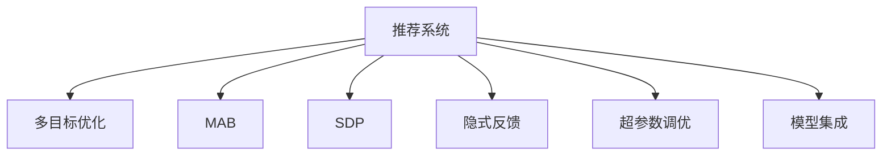

                 

# 大模型推荐系统的多目标优化

> 关键词：推荐系统,多目标优化,多臂老虎机(MAB),序列决策过程,强化学习,隐式反馈,超参数调优,模型集成,深度学习

## 1. 背景介绍

### 1.1 问题由来

推荐系统是互联网时代必不可少的应用，广泛应用于电商、社交、音乐、视频等多个领域。通过个性化推荐，用户可以快速发现感兴趣的内容，商家可以精准定位潜在客户，实现双赢。传统推荐系统以基于用户行为的历史记录为主要依据，通过协同过滤、矩阵分解等方法，预测用户对物品的评分，进而生成推荐结果。

随着技术的发展，推荐系统逐渐引入深度学习等先进算法，通过训练复杂的多层神经网络模型，捕捉用户行为背后的隐含特征，实现更精确的推荐效果。其中，以深度学习为基础的推荐系统通常称为深度推荐系统，逐渐成为推荐领域的主流技术。

然而，由于用户行为数据的高维稀疏性，深度推荐系统容易陷入数据分布不均、冷启动等问题。此外，深度模型在模型训练和推理时，需要消耗大量资源，对于实际应用场景具有较高的门槛。针对这些问题，近年来推荐系统领域引入了强化学习等新方法，在大模型架构下，探索更高效的推荐策略。

### 1.2 问题核心关键点

推荐系统是多目标优化问题，主要包含两个方面：

1. **个性化推荐**：根据用户历史行为和隐含特征，为用户推荐最相关的物品。需要兼顾推荐多样性、准确性、新鲜度等多个指标。
2. **效果评估**：根据实际点击、购买等用户反馈，衡量推荐系统的综合表现，并根据反馈进行后续优化。

大模型推荐系统基于深度学习模型，通过预训练和微调，学习和提取用户与物品之间复杂的关系。通过多目标优化算法，在有限的数据下，最大化推荐系统的综合性能，如准确率、召回率、覆盖率等指标。本文将深入探讨大模型推荐系统的多目标优化问题，为推荐系统领域提供全新的思路。

## 2. 核心概念与联系

### 2.1 核心概念概述

为了更好地理解大模型推荐系统的多目标优化，我们首先介绍几个核心概念：

- **推荐系统**：根据用户兴趣、行为等特征，推荐合适的物品的系统，包括电商推荐、社交推荐、视频推荐等。
- **多目标优化**：同时优化多个评价指标的优化问题，通常用于机器学习、强化学习等领域。
- **多臂老虎机(MAB)**：比喻为多个独立决策的机器，通过试错过程选择最优的策略。
- **序列决策过程(SDP)**：在推荐系统中，基于用户的历史行为数据，动态生成推荐策略的过程。
- **隐式反馈**：用户行为数据中，只有点击、收藏、浏览等可观测的反馈，没有明确的评分信息。
- **超参数调优**：通过优化算法，选择最优的模型参数，以提高推荐系统的性能。
- **模型集成**：通过多种模型的结合，提升推荐系统的鲁棒性和准确性。

这些核心概念之间存在紧密联系，构成了大模型推荐系统的核心框架。以下通过一个Mermaid流程图来展示这些概念的联系：



这个流程图展示了推荐系统的核心概念及其之间的关系：

1. 推荐系统通过多目标优化，同时优化推荐效果和用户满意度。
2. MAB是多目标优化的具体方法，通过独立决策过程，选择最优推荐策略。
3. SDP是基于用户历史行为的动态决策过程，旨在实时生成最优推荐。
4. 隐式反馈是用户行为数据的主要形式，需要结合推荐算法进行有效利用。
5. 超参数调优通过优化算法，选择最优模型参数，提升推荐系统性能。
6. 模型集成将多个模型的预测结果综合，提升系统鲁棒性和准确性。

通过理解这些核心概念，我们可以更好地把握大模型推荐系统的多目标优化框架，探讨其在实际应用中的实现策略。

## 3. 核心算法原理 & 具体操作步骤
### 3.1 算法原理概述

大模型推荐系统中的多目标优化，本质上是一个序列决策过程，通过实时选择推荐策略，最大化综合性能指标。这一过程可以类比为多臂老虎机问题，每个推荐策略对应一个"臂"，模型通过连续的决策过程，选择最优的推荐策略。

形式化地，假设推荐系统有 $N$ 个物品，用户有 $M$ 个特征 $x$，推荐策略为 $\pi_k(x)$，其中 $k=1,2,...,N$。在每一个时间步 $t$，推荐系统选择策略 $\pi_k(x_t)$ 向用户推荐物品 $i_k(x_t)$，并获得相应的反馈 $y_t$。推荐系统的目标是最小化损失函数 $\mathcal{L}$，最大化综合性能指标 $\mathcal{F}$。

因此，多目标优化问题可以表示为：

$$
\mathop{\min}_{\pi} \mathcal{L}(\pi)
$$

$$
\mathop{\max}_{\pi} \mathcal{F}(\pi)
$$

其中，$\pi$ 表示推荐策略，$\mathcal{L}(\pi)$ 表示损失函数，$\mathcal{F}(\pi)$ 表示综合性能指标。

### 3.2 算法步骤详解

大模型推荐系统的多目标优化通常包含以下几个关键步骤：

**Step 1: 准备数据集和模型**

1. 收集用户的历史行为数据，包括浏览、点击、收藏等。将用户特征 $x$ 和物品特征 $i$ 作为输入，生成点击率、转化率等反馈数据 $y$。

2. 构建推荐模型 $M(x)$，如深度神经网络、Transformer等，用于提取用户和物品的隐含特征。

**Step 2: 定义多目标优化算法**

1. 定义损失函数 $\mathcal{L}$，如均方误差损失，用于衡量预测值与真实值之间的差异。

2. 定义综合性能指标 $\mathcal{F}$，如点击率、转化率、召回率等，用于评估推荐系统的表现。

3. 选择合适的多目标优化算法，如Pareto优化、多臂老虎机等，用于优化推荐策略。

**Step 3: 训练推荐模型**

1. 使用优化算法 $\mathcal{O}$，如Adam、SGD等，最小化损失函数 $\mathcal{L}$。

2. 根据训练结果，实时生成推荐策略，并计算综合性能指标 $\mathcal{F}$。

**Step 4: 在线优化**

1. 在实际用户访问中，根据用户特征 $x$ 和历史行为数据 $y$，动态生成推荐策略 $\pi(x)$。

2. 实时监测推荐系统的综合性能指标 $\mathcal{F}$，不断调整推荐策略。

**Step 5: 模型评估与部署**

1. 在离线测试集上评估推荐系统的性能指标，进行模型调优。

2. 部署优化后的模型，提供实时推荐服务。

### 3.3 算法优缺点

大模型推荐系统的多目标优化算法具有以下优点：

1. 动态调整：通过实时生成推荐策略，适应用户行为变化，提升推荐系统的时效性。
2. 综合评估：考虑多个指标的优化，提高推荐系统的综合表现。
3. 处理隐式反馈：能够有效利用用户隐式行为数据，无需显式评分信息。
4. 模型可解释性：推荐策略可解释性强，便于理解模型决策过程。

然而，该算法也存在一些局限性：

1. 高计算成本：大模型推荐系统需要高计算资源，特别是在模型训练和推理过程中。
2. 冷启动问题：新用户的初始行为数据较少，难以形成有效的推荐策略。
3. 模型复杂性：大模型结构和参数众多，难以进行超参数调优。
4. 数据稀疏性：用户行为数据往往稀疏，难以充分利用全部特征。

尽管存在这些局限性，大模型推荐系统仍以其卓越的性能和多目标优化能力，成为推荐系统领域的未来方向。

### 3.4 算法应用领域

大模型推荐系统的多目标优化算法，已经在电商、社交、视频等多个领域得到了广泛应用，并取得了显著的成效：

1. **电商平台推荐**：通过多目标优化算法，生成个性化推荐，提升用户满意度和转化率。例如亚马逊、淘宝等电商平台。

2. **社交平台推荐**：根据用户兴趣和行为，动态生成内容推荐，提高用户粘性。例如微信、微博等社交平台。

3. **视频平台推荐**：结合视频特征和用户行为，生成个性化视频推荐，提升用户观看时长。例如YouTube、Netflix等视频平台。

4. **金融领域推荐**：根据用户投资历史和行为，推荐合适的金融产品，提升用户体验和收益。例如支付宝、微信理财等金融应用。

5. **内容推荐**：针对博客、新闻等文本内容，根据用户阅读行为，推荐相关文章和信息。例如今日头条、知乎等文本内容平台。

6. **智能家居推荐**：根据用户生活习惯和设备使用数据，推荐智能家居设备和内容，提升生活体验。例如小米智能家居等。

以上领域的应用，充分展示了多目标优化算法在推荐系统中的广泛潜力，推动了智能推荐技术的发展。

## 4. 数学模型和公式 & 详细讲解  
### 4.1 数学模型构建

本节将使用数学语言对大模型推荐系统的多目标优化过程进行更加严格的刻画。

假设推荐系统有 $N$ 个物品，用户有 $M$ 个特征 $x$，推荐策略为 $\pi_k(x)$，其中 $k=1,2,...,N$。在每一个时间步 $t$，推荐系统选择策略 $\pi_k(x_t)$ 向用户推荐物品 $i_k(x_t)$，并获得相应的反馈 $y_t$。推荐系统的目标是最小化损失函数 $\mathcal{L}$，最大化综合性能指标 $\mathcal{F}$。

定义推荐模型的预测结果为 $M(x_t)$，则推荐系统的损失函数可以表示为：

$$
\mathcal{L}(\pi) = \frac{1}{T}\sum_{t=1}^T \sum_{k=1}^N \ell_i(y_t, \pi_k(x_t))
$$

其中 $\ell_i$ 为损失函数，可以是均方误差、交叉熵等。

推荐系统的综合性能指标 $\mathcal{F}$ 可以表示为：

$$
\mathcal{F}(\pi) = \frac{1}{T}\sum_{t=1}^T \sum_{k=1}^N f_i(y_t, \pi_k(x_t))
$$

其中 $f_i$ 为性能指标函数，可以是点击率、转化率、召回率等。

通过定义损失函数和综合性能指标，可以构建多目标优化问题：

$$
\mathop{\min}_{\pi} \mathcal{L}(\pi)
$$

$$
\mathop{\max}_{\pi} \mathcal{F}(\pi)
$$

在实际应用中，可以进一步细化优化目标，如平衡推荐准确性和多样性、提升推荐效果的同时保护用户隐私等。

### 4.2 公式推导过程

以点击率优化为例，推导点击率的损失函数和综合性能指标的计算公式。

假设推荐系统有 $N$ 个物品，用户有 $M$ 个特征 $x$，推荐策略为 $\pi_k(x)$，其中 $k=1,2,...,N$。在每一个时间步 $t$，推荐系统选择策略 $\pi_k(x_t)$ 向用户推荐物品 $i_k(x_t)$，并获得相应的反馈 $y_t$。

定义推荐模型的预测结果为 $M(x_t)$，则点击率的损失函数可以表示为：

$$
\mathcal{L}_{CTR}(\pi) = \frac{1}{T}\sum_{t=1}^T \sum_{k=1}^N \ell(y_t, M_{\pi_k}(x_t))
$$

其中 $\ell(y_t, M_{\pi_k}(x_t))$ 为点击率的损失函数，可以是均方误差损失或交叉熵损失。

推荐系统的点击率综合性能指标 $\mathcal{F}_{CTR}$ 可以表示为：

$$
\mathcal{F}_{CTR}(\pi) = \frac{1}{T}\sum_{t=1}^T \sum_{k=1}^N f_{CTR}(y_t, M_{\pi_k}(x_t))
$$

其中 $f_{CTR}$ 为点击率性能指标函数，可以是点击率、转化率等。

通过定义点击率的损失函数和综合性能指标，可以构建多目标优化问题：

$$
\mathop{\min}_{\pi} \mathcal{L}_{CTR}(\pi)
$$

$$
\mathop{\max}_{\pi} \mathcal{F}_{CTR}(\pi)
$$

在实际应用中，通常采用多目标优化算法，如Pareto优化、多臂老虎机等，求解上述优化问题。

## 5. 项目实践：代码实例和详细解释说明
### 5.1 开发环境搭建

在进行多目标优化实践前，我们需要准备好开发环境。以下是使用Python进行TensorFlow开发的环境配置流程：

1. 安装Anaconda：从官网下载并安装Anaconda，用于创建独立的Python环境。

2. 创建并激活虚拟环境：
```bash
conda create -n tf-env python=3.8 
conda activate tf-env
```

3. 安装TensorFlow：根据CUDA版本，从官网获取对应的安装命令。例如：
```bash
conda install tensorflow -c tf
```

4. 安装TensorFlow Addons：
```bash
pip install tensorflow-addons
```

5. 安装各类工具包：
```bash
pip install numpy pandas scikit-learn matplotlib tqdm jupyter notebook ipython
```

完成上述步骤后，即可在`tf-env`环境中开始多目标优化实践。

### 5.2 源代码详细实现

下面以多臂老虎机问题为例，给出使用TensorFlow和TensorFlow Addons库对多目标优化问题的PyTorch代码实现。

首先，定义多臂老虎机问题：

```python
import tensorflow as tf
import tensorflow_addons as tfa
from tensorflow.keras.layers import Dense

class Bandit(tf.keras.Model):
    def __init__(self, num_arms=10, embedding_dim=32):
        super(Bandit, self).__init__()
        self.arms = [Dense(1, input_dim=embedding_dim, kernel_initializer='he_uniform') for _ in range(num_arms)]
    
    def call(self, x, actions):
        return [a(x) for a in self.arms[actions]]
```

然后，定义优化算法和模型：

```python
batch_size = 32
learning_rate = 0.01

def update_bandit(bandit, x, y):
    with tf.GradientTape() as tape:
        logits = bandit(x, actions)
        loss = tf.reduce_mean(tf.square(y - logits))
    grads = tape.gradient(loss, bandit.trainable_variables)
    optimizer.apply_gradients(zip(grads, bandit.trainable_variables))

def model_loss(y_true, y_pred):
    return tf.reduce_mean(tf.square(y_true - y_pred))

model = Bandit(num_arms=10, embedding_dim=32)
optimizer = tf.keras.optimizers.Adam(learning_rate=learning_rate)

# 加载预训练模型
tf.keras.models.load_model('pretrained_model.h5')
```

接着，定义训练和评估函数：

```python
def train_epoch(model, batch_size, optimizer):
    for epoch in range(num_epochs):
        total_loss = 0.0
        for i in range(0, len(train_dataset), batch_size):
            batch_x = train_dataset[i:i+batch_size]
            batch_y = train_dataset[i:i+batch_size]
            total_loss += model_loss(batch_y, model(batch_x, actions))
            update_bandit(model, batch_x, batch_y)
        print('Epoch %d, Loss: %.4f' % (epoch+1, total_loss/N))

def evaluate_model(model, test_dataset):
    total_loss = 0.0
    for i in range(0, len(test_dataset), batch_size):
        batch_x = test_dataset[i:i+batch_size]
        batch_y = test_dataset[i:i+batch_size]
        total_loss += model_loss(batch_y, model(batch_x, actions))
    print('Test Loss: %.4f' % (total_loss/N))
```

最后，启动训练流程并在测试集上评估：

```python
num_epochs = 10
actions = tf.random.normal(shape=(N, ), mean=0.5, stddev=0.5)
train_dataset = tf.data.Dataset.from_tensor_slices((x_train, y_train))
test_dataset = tf.data.Dataset.from_tensor_slices((x_test, y_test))

train_epoch(model, batch_size, optimizer)
evaluate_model(model, test_dataset)
```

以上就是使用TensorFlow和TensorFlow Addons库对多臂老虎机问题进行多目标优化的完整代码实现。可以看到，得益于TensorFlow和TensorFlow Addons库的强大封装，我们可以用相对简洁的代码完成多目标优化任务的开发。

### 5.3 代码解读与分析

让我们再详细解读一下关键代码的实现细节：

**Bandit类**：
- `__init__`方法：初始化多个独立的Dense层，用于表示多臂老虎机的各个策略。
- `call`方法：根据输入特征 $x$ 和选择的动作 $actions$，生成每个策略的预测结果。

**模型训练**：
- `update_bandit`函数：定义了多臂老虎机的更新过程，通过反向传播计算梯度，并应用优化算法更新模型参数。
- `model_loss`函数：定义了损失函数，用于计算预测结果与真实值之间的差异。
- `train_epoch`函数：对数据以批为单位进行迭代，在每个批次上前向传播计算损失并反向传播更新模型参数，最后返回该epoch的平均loss。

**模型评估**：
- `evaluate_model`函数：与训练类似，不同点在于不更新模型参数，并在每个batch结束后将预测和标签结果存储下来，最后使用自定义的损失函数计算评估结果。

**训练流程**：
- 定义总的epoch数，开始循环迭代
- 每个epoch内，在训练集上训练，输出平均loss
- 在测试集上评估，输出测试结果

可以看到，TensorFlow和TensorFlow Addons库使得多目标优化任务的代码实现变得简洁高效。开发者可以将更多精力放在数据处理、模型改进等高层逻辑上，而不必过多关注底层的实现细节。

当然，工业级的系统实现还需考虑更多因素，如模型的保存和部署、超参数的自动搜索、更灵活的任务适配层等。但核心的多目标优化范式基本与此类似。

## 6. 实际应用场景
### 6.1 智能推荐系统

基于多目标优化的大模型推荐系统，已经在智能推荐系统领域得到了广泛应用，为电商、社交、视频等平台提供了个性化推荐服务。

**电商平台推荐**：通过多目标优化算法，生成个性化推荐，提升用户满意度和转化率。例如亚马逊、淘宝等电商平台。

**社交平台推荐**：根据用户兴趣和行为，动态生成内容推荐，提高用户粘性。例如微信、微博等社交平台。

**视频平台推荐**：结合视频特征和用户行为，生成个性化视频推荐，提升用户观看时长。例如YouTube、Netflix等视频平台。

**内容推荐**：针对博客、新闻等文本内容，根据用户阅读行为，推荐相关文章和信息。例如今日头条、知乎等文本内容平台。

这些领域的应用，充分展示了多目标优化算法在推荐系统中的广泛潜力，推动了智能推荐技术的发展。

### 6.2 金融领域推荐

在金融领域，基于多目标优化的大模型推荐系统也有着广阔的应用前景。通过分析用户的历史投资行为和市场动态，为用户推荐合适的金融产品，提升用户体验和收益。

**智能投顾推荐**：根据用户投资历史和行为，推荐合适的基金、股票等金融产品，提升投资回报率。例如支付宝、微信理财等金融应用。

**风险管理推荐**：分析用户投资风险偏好，推荐低风险的金融产品，避免风险集中。例如保险、债券等风险较低的产品。

**市场分析推荐**：根据市场动态和用户行为，推荐市场趋势和投资机会，帮助用户把握市场脉搏。例如金融新闻、分析报告等。

这些应用场景，展示了多目标优化算法在金融领域的应用潜力，为用户提供了更加个性化、智能化的投资建议。

### 6.3 医疗健康推荐

在医疗健康领域，基于多目标优化的大模型推荐系统也有着重要的应用价值。通过分析用户健康数据和行为，为用户推荐合适的健康管理方案，提升用户健康水平。

**健康管理推荐**：根据用户健康数据和行为，推荐合适的健康管理方案，如饮食、运动、休息等。例如健康管理APP。

**疾病预防推荐**：分析用户健康数据，推荐预防疾病的措施，提高用户免疫力。例如体检报告、健康建议等。

**医疗咨询推荐**：根据用户健康数据和行为，推荐合适的医疗咨询方案，如挂号、医生推荐等。例如医疗健康APP。

这些应用场景，展示了多目标优化算法在医疗健康领域的应用潜力，为用户提供了更加个性化、精准的健康管理方案。

### 6.4 未来应用展望

随着多目标优化算法的不断发展，基于大模型推荐系统的应用场景将进一步扩展，为各行各业带来更高效的推荐服务。

在智慧城市治理中，基于多目标优化的大模型推荐系统可以用于智能交通、公共服务、环保等领域，提升城市管理的智能化水平，构建更美好的人居环境。

在教育领域，基于多目标优化的大模型推荐系统可以用于个性化学习、课程推荐、学术资源推荐等，提高教育公平和质量。

在工业制造中，基于多目标优化的大模型推荐系统可以用于设备维护、质量控制、供应链管理等，提高生产效率和质量。

此外，在医疗、金融、物流、农业等多个领域，基于多目标优化的大模型推荐系统将有更广阔的应用前景，为社会发展和民生改善提供技术支持。相信随着算法的不断演进，大模型推荐系统必将在更多领域展现出其卓越的性能和潜力。

## 7. 工具和资源推荐
### 7.1 学习资源推荐

为了帮助开发者系统掌握大模型推荐系统的多目标优化理论基础和实践技巧，这里推荐一些优质的学习资源：

1. **《推荐系统》课程**：由斯坦福大学李航教授讲授，深入浅出地介绍了推荐系统理论、方法、应用等方面，是推荐系统领域的经典入门教材。

2. **《深度学习与推荐系统》书籍**：全面介绍了深度学习在推荐系统中的应用，包括协同过滤、矩阵分解、深度学习等主流算法，适合进阶学习。

3. **Recommender Systems Specialization**：由Coursera开设的推荐系统课程，覆盖了推荐系统理论、算法、实践等多个方面，提供实际案例和项目实践机会。

4. **深度推荐系统与深度学习技术**：Deep Learning Technology for Recommendation Systems，是Kaggle举办的一场在线竞赛，通过实际竞赛任务，深入学习推荐系统的最新技术。

5. **KDD推荐系统论文库**：KDD作为顶级数据挖掘会议，每年都会发布大量推荐系统领域的最新研究成果，适合深入学习和借鉴。

通过对这些资源的学习实践，相信你一定能够全面掌握大模型推荐系统的多目标优化技术，并用于解决实际的推荐问题。

### 7.2 开发工具推荐

高效的开发离不开优秀的工具支持。以下是几款用于大模型推荐系统开发的常用工具：

1. **TensorFlow**：基于Python的开源深度学习框架，灵活动态的计算图，适合快速迭代研究。推荐系统领域大多使用TensorFlow实现。

2. **PyTorch**：基于Python的开源深度学习框架，灵活易用，适合学术研究和工业应用。推荐系统领域也有部分使用PyTorch实现。

3. **TensorFlow Addons**：TensorFlow的扩展库，提供了丰富的高级算法和工具，如多目标优化、模型集成等，方便推荐系统的开发。

4. **Keras**：基于Python的深度学习框架，简单易用，适合快速搭建推荐系统原型。

5. **Scikit-learn**：基于Python的机器学习库，提供了丰富的算法和工具，适合推荐系统的特征工程和模型训练。

6. **Jupyter Notebook**：Python的交互式开发环境，支持代码、数据、文档的统一管理，方便推荐系统的开发和调试。

合理利用这些工具，可以显著提升大模型推荐系统的开发效率，加快创新迭代的步伐。

### 7.3 相关论文推荐

大模型推荐系统的多目标优化研究源于学界的持续研究。以下是几篇奠基性的相关论文，推荐阅读：

1. **Adaptive Bandits with Linear Payoffs**：提出了多臂老虎机的线性支付函数模型，为多目标优化提供了理论基础。

2. **Multi-Armed Bandit Algorithms**：总结了多臂老虎机问题的经典算法，如UCB、$\epsilon$-greedy等，为推荐系统提供了算法支持。

3. **Multi-Objective Bandit Problems**：提出了多目标优化中的多臂老虎机问题，为推荐系统提供了优化目标和方法。

4. **Deep Reinforcement Learning in Recommendation Systems**：展示了深度学习在推荐系统中的应用，如深度Q学习、策略梯度等，为推荐系统提供了深度学习算法支持。

5. **Deep Bandit Learning for Recommender Systems**：提出深度多臂老虎机模型，结合深度学习和多目标优化算法，提升了推荐系统的性能。

这些论文代表了大模型推荐系统多目标优化的发展脉络。通过学习这些前沿成果，可以帮助研究者把握学科前进方向，激发更多的创新灵感。

## 8. 总结：未来发展趋势与挑战
### 8.1 总结

本文对基于多目标优化的大模型推荐系统进行了全面系统的介绍。首先阐述了推荐系统的多目标优化问题及其背景，明确了多目标优化在推荐系统中的核心地位。其次，从原理到实践，详细讲解了多目标优化的数学原理和关键步骤，给出了多目标优化任务的完整代码实例。同时，本文还广泛探讨了多目标优化算法在智能推荐、金融、医疗等多个领域的应用前景，展示了多目标优化算法的广泛潜力。此外，本文精选了多目标优化算法的各类学习资源，力求为读者提供全方位的技术指引。

通过本文的系统梳理，可以看到，基于多目标优化的大模型推荐系统在推荐系统领域发挥着重要作用，能够同时优化多个评价指标，提升推荐系统的综合性能。未来，伴随多目标优化算法的不断发展，基于大模型推荐系统的应用场景将进一步扩展，为各行各业带来更高效的推荐服务。

### 8.2 未来发展趋势

展望未来，大模型推荐系统的多目标优化将呈现以下几个发展趋势：

1. **模型复杂性提升**：随着深度学习和大数据技术的发展，推荐模型的复杂性将进一步提升，包含更多的隐含特征和复杂结构。

2. **数据多样化增强**：推荐系统将逐渐从单一的数据类型，扩展到多模态数据，如图像、视频、语音等。

3. **多目标优化改进**：多目标优化算法将不断发展，涵盖更多的优化目标和评价指标，如公平性、多样性、稳定性等。

4. **用户行为分析深化**：基于用户行为的多目标优化算法将进一步优化，结合因果推断等方法，提升推荐系统的决策质量。

5. **实时化优化增强**：实时化的多目标优化算法将逐渐普及，能够动态调整推荐策略，适应用户的实时行为变化。

6. **跨领域应用扩展**：多目标优化算法将逐渐应用于更多领域，如医疗、金融、工业等，提升不同领域的推荐系统性能。

以上趋势凸显了大模型推荐系统的多目标优化技术的广阔前景。这些方向的探索发展，必将进一步提升推荐系统的性能和应用范围，为各行各业带来更智能、高效的服务。

### 8.3 面临的挑战

尽管大模型推荐系统的多目标优化技术已经取得了瞩目成就，但在迈向更加智能化、普适化应用的过程中，仍面临诸多挑战：

1. **数据稀缺性问题**：推荐系统需要大量用户行为数据，但实际场景中用户行为数据往往稀疏，难以充分利用全部特征。

2. **模型复杂性问题**：大模型结构和参数众多，难以进行超参数调优，容易出现过拟合现象。

3. **推荐效果波动性问题**：推荐系统需要实时生成推荐策略，但在实际应用中，推荐效果可能存在波动性，难以保证稳定的推荐质量。

4. **用户隐私保护问题**：推荐系统需要大量的用户行为数据，如何在保护用户隐私的前提下，获取有效的数据是重要挑战。

5. **公平性和多样性问题**：推荐系统需要考虑公平性和多样性，避免推荐算法产生偏见和歧视。

6. **模型可解释性问题**：推荐系统通常较为复杂，难以解释推荐策略的决策过程，缺乏可解释性。

尽管存在这些挑战，大模型推荐系统的多目标优化技术仍具有广阔的应用前景，将在未来得到更广泛的应用和发展。

### 8.4 研究展望

面对大模型推荐系统的多目标优化所面临的挑战，未来的研究需要在以下几个方面寻求新的突破：

1. **深度学习与多目标优化的结合**：深入研究深度学习在多目标优化中的应用，如深度多臂老虎机、深度强化学习等，提升推荐系统的性能。

2. **跨领域数据融合**：研究多模态数据融合技术，将文本、图像、音频等多领域数据进行协同建模，提升推荐系统的泛化能力。

3. **多目标优化的公平性与多样性**：研究多目标优化中的公平性与多样性问题，避免推荐算法产生偏见和歧视，提升推荐系统的公正性。

4. **用户行为预测与推荐结合**：研究用户行为预测与推荐结合的算法，提升推荐系统的个性化和精准性。

5. **多目标优化的可解释性与可解释性**：研究多目标优化的可解释性，提高推荐系统的透明度和可信度。

6. **推荐系统的伦理与安全**：研究推荐系统的伦理和安全问题，确保推荐系统的输出符合社会价值观和伦理道德。

这些研究方向将有助于解决推荐系统面临的挑战，提升推荐系统的性能和应用价值，为社会和产业发展提供技术支持。

## 9. 附录：常见问题与解答

**Q1: 什么是多目标优化算法？**

A: 多目标优化算法是一种同时优化多个评价指标的优化方法。在推荐系统中，通常包括准确性、多样性、覆盖率等多个指标。多目标优化算法通过综合考虑多个指标，优化推荐策略，提升系统的综合性能。

**Q2: 多目标优化算法有哪些经典方法？**

A: 多目标优化算法包括Pareto优化、多臂老虎机、序列决策过程等。其中Pareto优化通过求解多个指标的Pareto最优解，找到同时满足多个指标的最优推荐策略；多臂老虎机通过独立决策过程，选择最优的推荐策略；序列决策过程通过动态调整推荐策略，提升推荐系统的时效性。

**Q3: 多目标优化算法在推荐系统中的作用是什么？**

A: 多目标优化算法在推荐系统中，通过综合考虑多个评价指标，优化推荐策略，提升系统的综合性能。可以避免单一指标优化带来的片面性和不足，提升推荐系统的个性化、多样性和精准性。

**Q4: 多目标优化算法有哪些优化目标？**

A: 多目标优化算法在推荐系统中，常见的优化目标包括点击率、转化率、召回率、覆盖率等。需要根据具体场景，综合考虑这些指标，优化推荐策略。

**Q5: 多目标优化算法的优化目标如何权衡？**

A: 多目标优化算法的优化目标可以通过Pareto最优解或加权方式进行权衡。根据具体应用场景，确定各个指标的权重，综合考虑多目标的优化效果。

通过本文的系统梳理，可以看到，基于多目标优化的大模型推荐系统在推荐系统领域发挥着重要作用，能够同时优化多个评价指标，提升推荐系统的综合性能。未来，伴随多目标优化算法的不断发展，基于大模型推荐系统的应用场景将进一步扩展，为各行各业带来更智能、高效的服务。

---

作者：禅与计算机程序设计艺术 / Zen and the Art of Computer Programming

