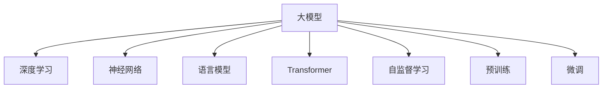

                 

# 大模型的定义与代表性模型

> 关键词：大模型,Transformer,BERT,GPT-3,语言模型,深度学习,神经网络

## 1. 背景介绍

随着人工智能技术的不断进步，大模型在计算机视觉、自然语言处理、语音识别等多个领域取得了令人瞩目的成果。大模型通常指具有庞大参数量、高复杂度、强泛化能力的深度学习模型，具有代表性的包括GPT系列、BERT、T5等。这些大模型在预训练阶段通过海量的无标签数据进行训练，学习到丰富的语言和图像特征，可以大幅提升模型在小样本学习、少样本学习和零样本学习等任务上的表现。

## 2. 核心概念与联系

### 2.1 核心概念概述

为更好地理解大模型的定义与代表性模型，本节将介绍几个核心概念及其相互联系：

- 大模型(-large model)：指参数量巨大的深度学习模型，通常具有数十亿甚至数百亿的参数量，能够处理复杂的多模态数据。常见的代表模型包括GPT、BERT、T5等。
- 深度学习(Deep Learning)：通过多层非线性神经网络，自动学习特征表示，实现复杂的模式识别和预测。深度学习技术包括卷积神经网络(CNN)、递归神经网络(RNN)、自编码器(AE)等。
- 神经网络(Neural Network)：一种仿生学习模型，通过大量神经元之间的连接，模拟人脑的计算和决策过程。常用的神经网络有前馈神经网络(Feedforward Neural Network)、循环神经网络(RNN)、卷积神经网络(CNN)等。
- 语言模型(Language Model)：用于预测文本序列的下一个单词或字符，常用模型包括n-gram模型、RNN语言模型等。BERT、GPT等大模型通过自监督语言模型预训练获得广泛的语言知识。
- Transformer：一种基于注意力机制的神经网络结构，通过多头自注意力机制捕获全局依赖，广泛应用于机器翻译、文本生成、自然语言理解等任务。
- 自监督学习(Self-Supervised Learning)：通过设计不需要标注的监督任务训练模型，学习数据的潜在语义和结构。BERT、GPT等大模型采用自监督学习训练获得语言知识。
- 预训练(Fine-tuning)：通过在大规模无标签数据上进行预训练，学习通用的特征表示，再在特定任务上进行微调，获得针对特定任务的优化。

这些概念之间的逻辑关系可以通过以下Mermaid流程图来展示：



这个流程图展示了从大模型到其核心技术成分的逻辑关系：

1. 大模型通过深度学习和神经网络实现复杂特征的自动提取。
2. 语言模型通过自监督学习学习文本数据的潜在结构。
3. Transformer通过注意力机制增强特征提取的效率和效果。
4. 自监督学习利用无标签数据提升模型的泛化能力。
5. 预训练在大规模数据上进行特征提取，为微调提供初始化权重。
6. 微调通过少量标注数据对特定任务进行优化。

这些概念共同构成了大模型定义和应用的基础框架，为其在实际应用中提供理论支撑。

## 3. 核心算法原理 & 具体操作步骤

### 3.1 算法原理概述

大模型的核心算法原理主要基于深度学习和神经网络技术，通过多层次的特征提取和表示学习，实现对数据的复杂建模和预测。以下介绍三种代表性的大模型算法原理：

1. Transformer：一种基于注意力机制的神经网络结构，通过多头自注意力机制捕获全局依赖，应用于自然语言处理任务。
2. BERT：一种预训练语言模型，通过自监督学习任务在大规模无标签数据上训练，学习到丰富的语言知识。
3. GPT-3：一种基于自回归模型的语言生成模型，通过大规模预训练和微调，实现高质量文本生成。

### 3.2 算法步骤详解

这里以BERT为例，详细介绍其预训练和微调的具体操作步骤：

**Step 1: 预训练过程**
1. 准备大规模无标签文本数据。BERT使用两组无标签文本数据进行预训练，一组是掩码语言模型(Masked Language Model, MLM)，另一组是下一句预测任务(Next Sentence Prediction, NSP)。
2. 使用随机掩码对输入文本进行掩码处理，并训练模型对掩码位置的预测。例如，输入文本为 "BERT is used to pre-train language models", 掩码位置为 ["BERT", "is", "used", "to", "pre-train"]。
3. 通过下一句预测任务训练模型学习句子间的关系。例如，输入两组句子 "BERT is used to pre-train language models", "BERT is used to fine-tune language models"，训练模型判断其是否为连续句子。

**Step 2: 微调过程**
1. 准备小规模标注数据。假设目标任务为情感分类，收集情感标注数据集，如电影评论、新闻文章等。
2. 对标注数据进行划分，分为训练集、验证集和测试集。
3. 将预训练模型作为初始化参数，设计任务适配层，例如，添加线性分类器、交叉熵损失函数等。
4. 使用小规模标注数据对模型进行微调，优化模型在特定任务上的性能。
5. 在验证集上评估模型性能，如果达到预设的性能指标，停止训练。

**Step 3: 优化超参数**
1. 选择合适的优化算法及其参数，如AdamW、SGD等，设置学习率、批大小、迭代轮数等。
2. 设置正则化技术及强度，包括权重衰减、Dropout、Early Stopping等。
3. 确定冻结预训练参数的策略，如仅微调顶层，或全部参数都参与微调。

**Step 4: 执行梯度训练**
1. 将训练集数据分批次输入模型，前向传播计算损失函数。
2. 反向传播计算参数梯度，根据设定的优化算法和学习率更新模型参数。
3. 周期性在验证集上评估模型性能，根据性能指标决定是否触发 Early Stopping。
4. 重复上述步骤直至满足预设的迭代轮数或 Early Stopping 条件。

### 3.3 算法优缺点

大模型的预训练和微调方法具有以下优点：

1. 通用适用：适用于各种NLP任务，包括分类、匹配、生成等，设计简单的任务适配层即可实现微调。
2. 参数高效：利用参数高效微调技术，在固定大部分预训练参数的情况下，仍可取得不错的微调效果。
3. 效果显著：在学术界和工业界的诸多任务上，基于微调的方法已经刷新了最先进的性能指标。
4. 高效训练：采用分布式训练等技术，可以实现快速的模型训练和推理。

同时，大模型的预训练和微调方法也存在一些缺点：

1. 依赖标注数据：微调的效果很大程度上取决于标注数据的质量和数量，获取高质量标注数据的成本较高。
2. 模型复杂：大模型参数量巨大，训练和推理需要较高的计算资源和存储空间。
3. 鲁棒性不足：预训练模型容易受到数据分布差异的影响，泛化性能可能受到限制。
4. 可解释性不足：大模型通常被视为"黑盒"系统，难以解释其内部工作机制和决策逻辑。
5. 训练时间长：大模型参数量巨大，训练和微调需要较长时间。

尽管存在这些局限性，但大模型的预训练和微调方法仍然是当前NLP领域最主流、最有效的方法之一。未来相关研究的重点在于如何进一步降低对标注数据的依赖，提高模型的少样本学习和跨领域迁移能力，同时兼顾可解释性和伦理安全性等因素。

### 3.4 算法应用领域

大模型的预训练和微调方法在NLP领域已经得到了广泛的应用，覆盖了几乎所有常见任务，例如：

- 文本分类：如情感分析、主题分类、意图识别等。通过微调使模型学习文本-标签映射。
- 命名实体识别：识别文本中的人名、地名、机构名等特定实体。通过微调使模型掌握实体边界和类型。
- 关系抽取：从文本中抽取实体之间的语义关系。通过微调使模型学习实体-关系三元组。
- 问答系统：对自然语言问题给出答案。将问题-答案对作为微调数据，训练模型学习匹配答案。
- 机器翻译：将源语言文本翻译成目标语言。通过微调使模型学习语言-语言映射。
- 文本摘要：将长文本压缩成简短摘要。将文章-摘要对作为微调数据，使模型学习抓取要点。
- 对话系统：使机器能够与人自然对话。将多轮对话历史作为上下文，微调模型进行回复生成。

除了上述这些经典任务外，大模型的预训练和微调也被创新性地应用到更多场景中，如可控文本生成、常识推理、代码生成、数据增强等，为NLP技术带来了全新的突破。

## 4. 数学模型和公式 & 详细讲解  
### 4.1 数学模型构建

大模型的数学模型构建主要基于深度学习框架，如TensorFlow、PyTorch等。以下以BERT为例，介绍其预训练和微调的数学模型。

**BERT预训练模型**：
- 输入文本 $x_i$ 的编码表示为 $x_i = (x_{i,1}, x_{i,2}, ..., x_{i,N})$。
- 输入文本 $x_i$ 的掩码表示为 $m_i = (m_{i,1}, m_{i,2}, ..., m_{i,N})$，其中 $m_{i,j} \in \{0, 1\}$。
- 输出表示为 $y_{i,1}, y_{i,2}, ..., y_{i,N}$，即掩码位置的预测结果。
- BERT的预训练任务为：最大化预测结果与真实掩码位置的交叉熵。

**BERT微调模型**：
- 输入文本 $x_i$ 的编码表示为 $x_i = (x_{i,1}, x_{i,2}, ..., x_{i,N})$。
- 输出表示为 $y_i \in \{0, 1\}$，即文本的情感分类结果。
- 输出表示为 $y_{i,1}, y_{i,2}, ..., y_{i,N}$，即文本的情感分类结果。
- BERT的微调任务为：最大化预测结果与真实标签的交叉熵。

**公式推导过程**：
- BERT的预训练损失函数为：
  $$
  L_{pre}(x, m) = -\sum_{i=1}^{N} (y_i * \log(y_i) + (1 - y_i) * \log(1 - y_i))
  $$
- BERT的微调损失函数为：
  $$
  L_{fine}(x, y) = -\sum_{i=1}^{N} (y_i * \log(y_i) + (1 - y_i) * \log(1 - y_i))
  $$

### 4.2 公式推导过程

在实际计算中，BERT的预训练和微调模型分别使用掩码语言模型和下一句预测任务进行训练。以下给出其具体的推导过程：

**掩码语言模型(Masked Language Model, MLM)**：
- 输入文本 $x_i$ 的掩码表示为 $m_i = (m_{i,1}, m_{i,2}, ..., m_{i,N})$，其中 $m_{i,j} \in \{0, 1\}$。
- 输出表示为 $y_{i,1}, y_{i,2}, ..., y_{i,N}$，即掩码位置的预测结果。
- 掩码语言模型的目标是最小化预测结果与真实掩码位置的交叉熵。

**下一句预测任务(Next Sentence Prediction, NSP)**：
- 输入两组句子 $x_i$ 和 $x_j$。
- 输出表示为 $y_{i,j} \in \{0, 1\}$，即两组句子是否为连续句子的预测结果。
- 下一句预测任务的目标是最小化预测结果与真实标签的交叉熵。

**BERT微调模型的数学模型**：
- 输入文本 $x_i$ 的编码表示为 $x_i = (x_{i,1}, x_{i,2}, ..., x_{i,N})$。
- 输出表示为 $y_i \in \{0, 1\}$，即文本的情感分类结果。
- BERT的微调任务为：最大化预测结果与真实标签的交叉熵。

### 4.3 案例分析与讲解

以情感分类为例，分析BERT在微调过程中的应用：

1. 数据准备：收集情感标注数据集，如电影评论、新闻文章等。
2. 模型初始化：使用预训练的BERT模型作为初始化参数。
3. 任务适配：添加线性分类器、交叉熵损失函数等任务适配层。
4. 微调训练：在标注数据集上使用小批量数据进行训练，优化模型参数。
5. 验证评估：在验证集上评估模型性能，根据性能指标决定是否停止训练。
6. 测试评估：在测试集上评估微调后模型的性能，对比微调前后的精度提升。

## 5. 项目实践：代码实例和详细解释说明
### 5.1 开发环境搭建

在进行BERT微调实践前，我们需要准备好开发环境。以下是使用Python进行TensorFlow开发的环境配置流程：

1. 安装Anaconda：从官网下载并安装Anaconda，用于创建独立的Python环境。

2. 创建并激活虚拟环境：
```bash
conda create -n tf-env python=3.8 
conda activate tf-env
```

3. 安装TensorFlow：从官网获取对应的安装命令。例如：
```bash
pip install tensorflow
```

4. 安装BertForSequenceClassification：
```bash
pip install transformers
```

5. 安装各类工具包：
```bash
pip install numpy pandas scikit-learn matplotlib tqdm jupyter notebook ipython
```

完成上述步骤后，即可在`tf-env`环境中开始微调实践。

### 5.2 源代码详细实现

这里我们以情感分类任务为例，给出使用TensorFlow和Transformers库对BERT模型进行微调的代码实现。

首先，定义情感分类任务的数据处理函数：

```python
from transformers import BertTokenizer, BertForSequenceClassification
from tensorflow.keras.datasets import imdb
from tensorflow.keras.utils import to_categorical

tokenizer = BertTokenizer.from_pretrained('bert-base-cased')
vocab_size = len(tokenizer.vocab)

# 加载IMDB电影评论数据集
imdb_train, imdb_test = imdb.load_data(num_words=vocab_size)

# 将文本转换为token ids
train_data = tokenizer.convert_tokens_to_ids(imdb_train.data)
test_data = tokenizer.convert_tokens_to_ids(imdb_test.data)

# 对token ids进行padding，使所有样本长度一致
max_len = 128
train_data = pad_sequences(train_data, maxlen=max_len, padding='post')
test_data = pad_sequences(test_data, maxlen=max_len, padding='post')

# 将标签转换为one-hot编码
train_labels = to_categorical(imdb_train.targets)
test_labels = to_categorical(imdb_test.targets)

# 创建TensorFlow数据集
train_dataset = tf.data.Dataset.from_tensor_slices((train_data, train_labels)).shuffle(1000).batch(16)
test_dataset = tf.data.Dataset.from_tensor_slices((test_data, test_labels)).batch(16)
```

然后，定义模型和优化器：

```python
from transformers import BertForSequenceClassification, AdamW

model = BertForSequenceClassification.from_pretrained('bert-base-cased', num_labels=2)
optimizer = AdamW(model.parameters(), lr=2e-5)
```

接着，定义训练和评估函数：

```python
import tensorflow as tf

def train_epoch(model, dataset, batch_size, optimizer):
    model.train()
    for batch in dataset:
        input_ids, labels = batch
        with tf.GradientTape() as tape:
            outputs = model(input_ids)
            loss = tf.keras.losses.categorical_crossentropy(labels, outputs.logits, from_logits=True)
        gradients = tape.gradient(loss, model.parameters())
        optimizer.apply_gradients(zip(gradients, model.parameters()))

def evaluate(model, dataset, batch_size):
    model.eval()
    correct_predictions, total_predictions = 0, 0
    for batch in dataset:
        input_ids, labels = batch
        outputs = model(input_ids)
        predictions = tf.argmax(outputs.logits, axis=1)
        correct_predictions += tf.reduce_sum(tf.cast(predictions == labels, tf.int32))
        total_predictions += tf.shape(predictions)[0]
    accuracy = correct_predictions / total_predictions
    print(f'Accuracy: {accuracy}')
```

最后，启动训练流程并在测试集上评估：

```python
epochs = 5
batch_size = 16

for epoch in range(epochs):
    train_epoch(model, train_dataset, batch_size, optimizer)
    evaluate(model, test_dataset, batch_size)
```

以上就是使用TensorFlow和Transformers库对BERT进行情感分类任务微调的完整代码实现。可以看到，得益于Transformers库的强大封装，我们可以用相对简洁的代码完成BERT模型的加载和微调。

### 5.3 代码解读与分析

让我们再详细解读一下关键代码的实现细节：

**数据处理函数**：
- 使用BertTokenizer对文本进行分词，转换为token ids。
- 使用pad_sequences对token ids进行padding，使所有样本长度一致。
- 将标签转换为one-hot编码，方便模型进行分类预测。
- 创建TensorFlow数据集，方便模型训练和评估。

**模型定义**：
- 使用BertForSequenceClassification从预训练模型中加载初始化权重。
- 设置AdamW优化器，优化模型参数。

**训练和评估函数**：
- 在训练过程中，对输入文本进行编码，计算loss，反向传播更新模型参数。
- 在评估过程中，对输入文本进行编码，计算预测结果和标签，计算准确率。

**训练流程**：
- 定义总的epoch数和batch size，开始循环迭代
- 每个epoch内，在训练集上进行模型训练
- 在测试集上评估模型性能
- 所有epoch结束后，输出最终测试结果

可以看到，TensorFlow配合Transformers库使得BERT微调的代码实现变得简洁高效。开发者可以将更多精力放在数据处理、模型改进等高层逻辑上，而不必过多关注底层的实现细节。

当然，工业级的系统实现还需考虑更多因素，如模型的保存和部署、超参数的自动搜索、更灵活的任务适配层等。但核心的微调范式基本与此类似。

## 6. 实际应用场景
### 6.1 智能客服系统

基于BERT微调的对话技术，可以广泛应用于智能客服系统的构建。传统客服往往需要配备大量人力，高峰期响应缓慢，且一致性和专业性难以保证。而使用微调后的对话模型，可以7x24小时不间断服务，快速响应客户咨询，用自然流畅的语言解答各类常见问题。

在技术实现上，可以收集企业内部的历史客服对话记录，将问题和最佳答复构建成监督数据，在此基础上对预训练对话模型进行微调。微调后的对话模型能够自动理解用户意图，匹配最合适的答案模板进行回复。对于客户提出的新问题，还可以接入检索系统实时搜索相关内容，动态组织生成回答。如此构建的智能客服系统，能大幅提升客户咨询体验和问题解决效率。

### 6.2 金融舆情监测

金融机构需要实时监测市场舆论动向，以便及时应对负面信息传播，规避金融风险。传统的人工监测方式成本高、效率低，难以应对网络时代海量信息爆发的挑战。基于BERT微调的文本分类和情感分析技术，为金融舆情监测提供了新的解决方案。

具体而言，可以收集金融领域相关的新闻、报道、评论等文本数据，并对其进行主题标注和情感标注。在此基础上对预训练语言模型进行微调，使其能够自动判断文本属于何种主题，情感倾向是正面、中性还是负面。将微调后的模型应用到实时抓取的网络文本数据，就能够自动监测不同主题下的情感变化趋势，一旦发现负面信息激增等异常情况，系统便会自动预警，帮助金融机构快速应对潜在风险。

### 6.3 个性化推荐系统

当前的推荐系统往往只依赖用户的历史行为数据进行物品推荐，无法深入理解用户的真实兴趣偏好。基于BERT微调的个性化推荐系统可以更好地挖掘用户行为背后的语义信息，从而提供更精准、多样的推荐内容。

在实践中，可以收集用户浏览、点击、评论、分享等行为数据，提取和用户交互的物品标题、描述、标签等文本内容。将文本内容作为模型输入，用户的后续行为（如是否点击、购买等）作为监督信号，在此基础上微调预训练语言模型。微调后的模型能够从文本内容中准确把握用户的兴趣点。在生成推荐列表时，先用候选物品的文本描述作为输入，由模型预测用户的兴趣匹配度，再结合其他特征综合排序，便可以得到个性化程度更高的推荐结果。

### 6.4 未来应用展望

随着BERT等大模型的不断发展，其应用领域也在不断拓展，为各行各业带来新的变革。

在智慧医疗领域，基于BERT的问答系统、病历分析、药物研发等应用将提升医疗服务的智能化水平，辅助医生诊疗，加速新药开发进程。

在智能教育领域，BERT微调技术可应用于作业批改、学情分析、知识推荐等方面，因材施教，促进教育公平，提高教学质量。

在智慧城市治理中，BERT微调模型可应用于城市事件监测、舆情分析、应急指挥等环节，提高城市管理的自动化和智能化水平，构建更安全、高效的未来城市。

此外，在企业生产、社会治理、文娱传媒等众多领域，基于BERT的微调方法也将不断涌现，为经济社会发展注入新的动力。相信随着技术的日益成熟，微调方法将成为人工智能技术落地应用的重要范式，推动人工智能技术在更多垂直行业的规模化落地。

## 7. 工具和资源推荐
### 7.1 学习资源推荐

为了帮助开发者系统掌握BERT等大模型的理论基础和实践技巧，这里推荐一些优质的学习资源：

1. 《Transformer从原理到实践》系列博文：由BERT技术专家撰写，深入浅出地介绍了Transformer原理、BERT模型、微调技术等前沿话题。

2. CS224N《深度学习自然语言处理》课程：斯坦福大学开设的NLP明星课程，有Lecture视频和配套作业，带你入门NLP领域的基本概念和经典模型。

3. 《Natural Language Processing with Transformers》书籍：BERT的作者所著，全面介绍了如何使用TensorFlow进行NLP任务开发，包括微调在内的诸多范式。

4. HuggingFace官方文档：BERT等预训练语言模型的官方文档，提供了海量预训练模型和完整的微调样例代码，是上手实践的必备资料。

5. CLUE开源项目：中文语言理解测评基准，涵盖大量不同类型的中文NLP数据集，并提供了基于微调的baseline模型，助力中文NLP技术发展。

通过对这些资源的学习实践，相信你一定能够快速掌握BERT等大模型的微调技术，并用于解决实际的NLP问题。
###  7.2 开发工具推荐

高效的开发离不开优秀的工具支持。以下是几款用于BERT微调开发的常用工具：

1. TensorFlow：基于Python的开源深度学习框架，灵活动态的计算图，适合快速迭代研究。BERT等大模型都有TensorFlow版本的实现。

2. PyTorch：基于Python的开源深度学习框架，灵活动态的计算图，适合快速实验和部署。BERT等大模型也有PyTorch版本的实现。

3. Transformers库：HuggingFace开发的NLP工具库，集成了BERT等预训练语言模型，支持PyTorch和TensorFlow，是进行微调任务开发的利器。

4. Weights & Biases：模型训练的实验跟踪工具，可以记录和可视化模型训练过程中的各项指标，方便对比和调优。与主流深度学习框架无缝集成。

5. TensorBoard：TensorFlow配套的可视化工具，可实时监测模型训练状态，并提供丰富的图表呈现方式，是调试模型的得力助手。

6. Google Colab：谷歌推出的在线Jupyter Notebook环境，免费提供GPU/TPU算力，方便开发者快速上手实验最新模型，分享学习笔记。

合理利用这些工具，可以显著提升BERT微调任务的开发效率，加快创新迭代的步伐。

### 7.3 相关论文推荐

BERT等大模型的发展源于学界的持续研究。以下是几篇奠基性的相关论文，推荐阅读：

1. Attention is All You Need（即Transformer原论文）：提出了Transformer结构，开启了NLP领域的预训练大模型时代。

2. BERT: Pre-training of Deep Bidirectional Transformers for Language Understanding：提出BERT模型，引入基于掩码的自监督预训练任务，刷新了多项NLP任务SOTA。

3. Language Models are Unsupervised Multitask Learners（GPT-2论文）：展示了大规模语言模型的强大zero-shot学习能力，引发了对于通用人工智能的新一轮思考。

4. Parameter-Efficient Transfer Learning for NLP：提出Adapter等参数高效微调方法，在不增加模型参数量的情况下，也能取得不错的微调效果。

5. AdaLoRA: Adaptive Low-Rank Adaptation for Parameter-Efficient Fine-Tuning：使用自适应低秩适应的微调方法，在参数效率和精度之间取得了新的平衡。

6. Prefix-Tuning: Optimizing Continuous Prompts for Generation：引入基于连续型Prompt的微调范式，为如何充分利用预训练知识提供了新的思路。

这些论文代表了大模型微调技术的发展脉络。通过学习这些前沿成果，可以帮助研究者把握学科前进方向，激发更多的创新灵感。

## 8. 总结：未来发展趋势与挑战

### 8.1 总结

本文对BERT等大模型的定义与代表性模型进行了全面系统的介绍。首先阐述了BERT等大模型的背景和定义，明确了其在自然语言处理领域的广泛应用和重要意义。其次，从原理到实践，详细讲解了BERT等大模型的数学模型和微调过程，给出了微调任务开发的完整代码实例。同时，本文还广泛探讨了BERT等大模型在智能客服、金融舆情、个性化推荐等多个行业领域的应用前景，展示了其巨大的潜力。

通过本文的系统梳理，可以看到，BERT等大模型在预训练和微调过程中展示了强大的语言建模能力，能够在小样本条件下取得优异的性能，推动了NLP技术的产业化进程。未来，随着预训练大模型的不断发展，BERT等大模型必将在更广泛的领域取得更多突破，为人类认知智能的进化带来深远影响。

### 8.2 未来发展趋势

展望未来，BERT等大模型的预训练和微调技术将呈现以下几个发展趋势：

1. 模型规模持续增大。随着算力成本的下降和数据规模的扩张，预训练语言模型的参数量还将持续增长。超大规模语言模型蕴含的丰富语言知识，有望支撑更加复杂多变的下游任务微调。

2. 微调方法日趋多样。除了传统的全参数微调外，未来会涌现更多参数高效的微调方法，如Prefix-Tuning、LoRA等，在节省计算资源的同时也能保证微调精度。

3. 持续学习成为常态。随着数据分布的不断变化，微调模型也需要持续学习新知识以保持性能。如何在不遗忘原有知识的同时，高效吸收新样本信息，将成为重要的研究课题。

4. 标注样本需求降低。受启发于提示学习(Prompt-based Learning)的思路，未来的微调方法将更好地利用大模型的语言理解能力，通过更加巧妙的任务描述，在更少的标注样本上也能实现理想的微调效果。

5. 多模态微调崛起。当前的微调主要聚焦于纯文本数据，未来会进一步拓展到图像、视频、语音等多模态数据微调。多模态信息的融合，将显著提升语言模型对现实世界的理解和建模能力。

6. 模型通用性增强。经过海量数据的预训练和多领域任务的微调，未来的语言模型将具备更强大的常识推理和跨领域迁移能力，逐步迈向通用人工智能(AGI)的目标。

以上趋势凸显了大模型预训练和微调技术的广阔前景。这些方向的探索发展，必将进一步提升NLP系统的性能和应用范围，为人类认知智能的进化带来深远影响。

### 8.3 面临的挑战

尽管BERT等大模型的预训练和微调方法已经取得了瞩目成就，但在迈向更加智能化、普适化应用的过程中，它仍面临着诸多挑战：

1. 标注成本瓶颈。虽然微调大大降低了标注数据的需求，但对于长尾应用场景，难以获得充足的高质量标注数据，成为制约微调性能的瓶颈。如何进一步降低微调对标注样本的依赖，将是一大难题。

2. 模型鲁棒性不足。当前微调模型面对域外数据时，泛化性能可能受到限制。对于测试样本的微小扰动，微调模型的预测也容易发生波动。如何提高微调模型的鲁棒性，避免灾难性遗忘，还需要更多理论和实践的积累。

3. 推理效率有待提高。BERT等大模型虽然精度高，但在实际部署时往往面临推理速度慢、内存占用大等效率问题。如何在保证性能的同时，简化模型结构，提升推理速度，优化资源占用，将是重要的优化方向。

4. 可解释性亟需加强。当前微调模型通常被视为"黑盒"系统，难以解释其内部工作机制和决策逻辑。对于医疗、金融等高风险应用，算法的可解释性和可审计性尤为重要。如何赋予微调模型更强的可解释性，将是亟待攻克的难题。

5. 安全性有待保障。BERT等大模型难免会学习到有偏见、有害的信息，通过微调传递到下游任务，产生误导性、歧视性的输出，给实际应用带来安全隐患。如何从数据和算法层面消除模型偏见，避免恶意用途，确保输出的安全性，也将是重要的研究课题。

6. 知识整合能力不足。现有的微调模型往往局限于任务内数据，难以灵活吸收和运用更广泛的先验知识。如何让微调过程更好地与外部知识库、规则库等专家知识结合，形成更加全面、准确的信息整合能力，还有很大的想象空间。

正视BERT等大模型预训练和微调所面临的这些挑战，积极应对并寻求突破，将是大模型微调走向成熟的必由之路。相信随着学界和产业界的共同努力，这些挑战终将一一被克服，BERT等大模型微调必将在构建人机协同的智能时代中扮演越来越重要的角色。

### 8.4 研究展望

面向未来，BERT等大模型的预训练和微调技术需要在以下几个方面寻求新的突破：

1. 探索无监督和半监督微调方法。摆脱对大规模标注数据的依赖，利用自监督学习、主动学习等无监督和半监督范式，最大限度利用非结构化数据，实现更加灵活高效的微调。

2. 研究参数高效和计算高效的微调范式。开发更加参数高效的微调方法，在固定大部分预训练参数的同时，只更新极少量的任务相关参数。同时优化微调模型的计算图，减少前向传播和反向传播的资源消耗，实现更加轻量级、实时性的部署。

3. 融合因果和对比学习范式。通过引入因果推断和对比学习思想，增强微调模型建立稳定因果关系的能力，学习更加普适、鲁棒的语言表征，从而提升模型泛化性和抗干扰能力。

4. 引入更多先验知识。将符号化的先验知识，如知识图谱、逻辑规则等，与神经网络模型进行巧妙融合，引导微调过程学习更准确、合理的语言模型。同时加强不同模态数据的整合，实现视觉、语音等多模态信息与文本信息的协同建模。

5. 结合因果分析和博弈论工具。将因果分析方法引入微调模型，识别出模型决策的关键特征，增强输出解释的因果性和逻辑性。借助博弈论工具刻画人机交互过程，主动探索并规避模型的脆弱点，提高系统稳定性。

6. 纳入伦理道德约束。在模型训练目标中引入伦理导向的评估指标，过滤和惩罚有偏见、有害的输出倾向。同时加强人工干预和审核，建立模型行为的监管机制，确保输出符合人类价值观和伦理道德。

这些研究方向的探索，必将引领BERT等大模型预训练和微调技术迈向更高的台阶，为构建安全、可靠、可解释、可控的智能系统铺平道路。面向未来，BERT等大模型预训练和微调技术还需要与其他人工智能技术进行更深入的融合，如知识表示、因果推理、强化学习等，多路径协同发力，共同推动自然语言理解和智能交互系统的进步。只有勇于创新、敢于突破，才能不断拓展BERT等大模型的边界，让智能技术更好地造福人类社会。

## 9. 附录：常见问题与解答

**Q1：大模型的预训练和微调有什么区别？**

A: 大模型的预训练和微调是两个不同的过程。预训练是在大规模无标签数据上进行的，目的是学习通用的语言特征表示，为微调提供初始化权重。微调是在预训练模型的基础上，使用下游任务的少量标注数据，通过有监督学习优化模型在特定任务上的性能。

**Q2：大模型预训练和微调需要多少数据？**

A: 大模型的预训练通常需要大规模的文本数据，数亿甚至数十亿个文本数据才能获得丰富的语言知识。微调则相对灵活，根据下游任务的特点和数据量，可能只需要几千到几万个标注样本即可。

**Q3：大模型预训练和微调的过程是否可以并行？**

A: 大模型的预训练和微调过程可以并行进行。预训练可以使用分布式训练加速，而微调也可以使用GPU/TPU等高性能设备进行高效的模型训练和推理。

**Q4：大模型预训练和微调需要注意哪些问题？**

A: 大模型的预训练和微调需要注意以下几个问题：
1. 标注数据的准备和清洗，保证数据质量和多样性。
2. 超参数的调优，包括学习率、批大小、迭代轮数等。
3. 正则化的应用，防止过拟合。
4. 硬件资源的优化，如GPU/TPU的使用、模型并行等。
5. 模型的评估和调试，选择合适的评估指标和调试方法。

**Q5：大模型的预训练和微调在实际应用中需要注意哪些问题？**

A: 大模型的预训练和微调在实际应用中需要注意以下几个问题：
1. 模型的保存和部署，选择合适的模型保存格式和部署方式。
2. 模型的推理速度和资源占用，优化模型的计算图和推理代码。
3. 模型的可解释性和可控性，加强模型的输出解释和行为监管。
4. 模型的安全和隐私，保护用户数据和模型免受攻击和滥用。

**Q6：大模型的预训练和微调是否有通用的框架和方法？**

A: 大模型的预训练和微调目前没有完全通用的框架和方法，需要根据具体任务和数据特点进行优化和调整。但一些通用的技巧和方法，如分布式训练、模型裁剪、参数共享等，可以应用于多个任务中。

---

作者：禅与计算机程序设计艺术 / Zen and the Art of Computer Programming

