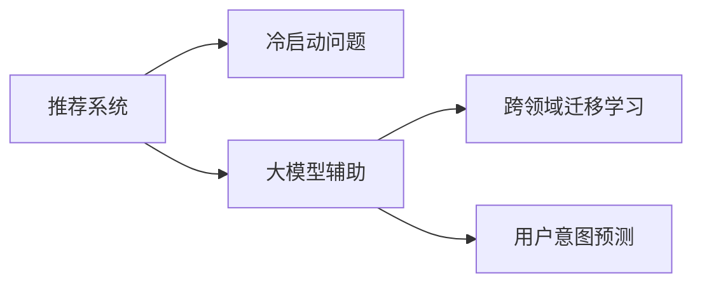

                 

## 1. 背景介绍

推荐系统（Recommendation System, RS）是互联网公司普遍应用的基于用户行为数据来提升用户体验、提高转化率的重要工具。随着用户数据量的不断积累，基于协同过滤的推荐系统取得了显著的效果，但在数据冷启动阶段，由于用户行为数据稀疏，推荐效果往往大打折扣。在传统推荐系统面临冷启动问题时，大模型辅助的推荐系统应运而生。

本文聚焦于大模型在推荐系统冷启动中的应用，介绍并比较了多种大模型辅助推荐系统的策略，揭示了策略设计背后的原理与实践技巧。我们将详细讨论大模型辅助推荐系统的算法原理，并举例说明如何通过大模型在推荐系统冷启动阶段提升推荐效果。

## 2. 核心概念与联系

### 2.1 核心概念概述

为了深入理解大模型辅助推荐系统，我们首先对几个核心概念进行简要介绍：

- **推荐系统**（Recommendation System, RS）：根据用户的历史行为数据或兴趣特征，为用户推荐商品、内容、服务等。
- **冷启动问题**（Cold Start Problem）：用户在推荐系统中的行为数据稀疏，导致推荐模型无法有效预测用户偏好。
- **大模型辅助**：利用预训练语言模型（如BERT、GPT等）在大规模无标签文本数据上预训练得到的语言知识，来提升推荐系统的准确性。
- **跨领域迁移学习**（Cross-Domain Transfer Learning）：利用大模型在不同领域的预训练知识，解决推荐系统中的冷启动问题。
- **用户意图预测**（User Intent Prediction）：利用大模型学习用户的意图，提升推荐系统的个性化程度。

这些核心概念之间的关系可以通过以下Mermaid流程图来展示：



这个流程图展示了推荐系统、冷启动问题、大模型辅助和用户意图预测之间的关系：

1. 推荐系统解决用户的个性化需求。
2. 冷启动问题限制了推荐系统在新用户或新商品上的表现。
3. 大模型辅助提供了额外的知识，可用于提升推荐系统的预测能力。
4. 跨领域迁移学习和用户意图预测是大模型辅助推荐系统的两种主要策略。

这些概念构成了大模型辅助推荐系统的基本框架，其目的在于利用大模型处理丰富而多样的文本数据，提升推荐系统对用户行为和意图的理解，从而解决推荐系统中的冷启动问题。

## 3. 核心算法原理 & 具体操作步骤

### 3.1 算法原理概述

大模型辅助推荐系统的核心算法原理主要包括跨领域迁移学习和用户意图预测。这些方法均利用大模型的语言理解能力，提升推荐系统在新用户或新商品上的表现。

- **跨领域迁移学习**：大模型在不同领域预训练的知识，可以迁移到推荐系统中，用于预测用户行为和商品特征。这种方法主要利用大模型在大规模无标签文本数据上预训练得到的语言知识，将其应用于推荐系统的特征提取阶段，提升推荐系统的准确性和泛化能力。

- **用户意图预测**：通过大模型对用户输入的自然语言文本进行理解，预测用户的意图，从而提升推荐系统的个性化程度。用户意图预测通常利用大模型的自回归能力，根据用户输入的自然语言描述，输出对应的推荐结果。

### 3.2 算法步骤详解

#### 3.2.1 跨领域迁移学习

**步骤 1: 预训练大模型**
- 收集大规模无标签文本数据，训练预训练大模型。例如，使用BERT在大规模维基百科和新闻数据上预训练。

**步骤 2: 特征提取**
- 将推荐系统中的用户数据和商品数据，转化为文本特征。例如，将商品描述、用户评论等文本数据，使用预训练大模型的tokenizer进行分词和编码。

**步骤 3: 特征融合**
- 将预训练大模型提取的用户和商品特征与传统推荐系统的特征进行融合。例如，将大模型提取的向量与用户的点击行为、评分数据等特征进行拼接。

**步骤 4: 训练推荐模型**
- 利用融合后的特征，训练推荐模型。例如，使用BERT编码的用户和商品特征作为输入，训练一个神经网络进行用户行为预测。

**步骤 5: 效果评估**
- 在推荐系统上评估效果，利用AUC、MRR等指标衡量模型的性能。

#### 3.2.2 用户意图预测

**步骤 1: 用户输入采集**
- 收集用户的自然语言输入，例如用户搜索词、产品描述等。

**步骤 2: 用户意图编码**
- 使用预训练大模型对用户输入进行编码。例如，将用户搜索词使用BERT进行编码，得到用户意图向量。

**步骤 3: 意图推理**
- 根据用户意图向量，使用预训练大模型进行意图推理。例如，使用GPT对用户意图向量进行解码，输出推荐商品列表。

**步骤 4: 推荐结果排序**
- 将推理出的推荐商品列表与用户行为数据进行结合，使用排序算法对推荐结果进行排序，提升推荐精度。

### 3.3 算法优缺点

#### 3.3.1 跨领域迁移学习

**优点**：
- 利用大模型的预训练知识，提升推荐系统的泛化能力。
- 在大规模无标签数据上进行预训练，可以提供丰富的语言知识。

**缺点**：
- 需要大规模无标签数据进行预训练，资源消耗较大。
- 预训练模型通常较大，推理速度较慢。

#### 3.3.2 用户意图预测

**优点**：
- 利用自然语言处理技术，提升推荐系统的个性化程度。
- 可以根据用户的实时输入进行动态推荐，提升用户体验。

**缺点**：
- 需要处理自然语言输入，对输入的质量和多样性要求较高。
- 大模型解码过程较为复杂，推理速度较慢。

### 3.4 算法应用领域

大模型辅助推荐系统在多个领域得到了广泛应用，例如：

- **电商推荐**：通过大模型对商品描述进行编码，提升对新商品的理解能力。
- **新闻推荐**：利用大模型对新闻文章进行编码，提升对新闻内容的理解能力。
- **旅游推荐**：通过大模型对旅游目的地描述进行编码，提升对旅游目的地的理解能力。
- **金融推荐**：利用大模型对金融产品描述进行编码，提升对金融产品的理解能力。

这些应用场景中，大模型辅助推荐系统都取得了显著的效果，提升了用户的推荐体验和满意度。

## 4. 数学模型和公式 & 详细讲解 & 举例说明

### 4.1 数学模型构建

我们以跨领域迁移学习为例，构建基于大模型的推荐系统数学模型。假设推荐系统中的用户数据为$x$，商品数据为$y$，大模型为$M$，预训练语言模型为$L$，推荐模型的损失函数为$\mathcal{L}$。

**步骤 1: 特征提取**
- 使用预训练大模型$L$对用户数据$x$和商品数据$y$进行编码，得到用户特征向量$\mathbf{u}$和商品特征向量$\mathbf{v}$。

**步骤 2: 特征融合**
- 将用户特征向量$\mathbf{u}$和商品特征向量$\mathbf{v}$进行拼接，得到融合特征$\mathbf{z}$。

**步骤 3: 推荐模型训练**
- 利用融合特征$\mathbf{z}$，训练推荐模型$M$，得到推荐结果$\hat{y}$。

**步骤 4: 损失函数计算**
- 根据推荐结果$\hat{y}$和真实标签$y$，计算推荐模型的损失函数$\mathcal{L}(\mathbf{z}, y)$。

### 4.2 公式推导过程

以用户行为预测为例，推导基于大模型的推荐系统损失函数。假设用户行为表示为$\mathbf{u}$，商品特征表示为$\mathbf{v}$，推荐模型的输出为$\hat{y}$，真实标签为$y$。

根据用户行为预测的任务，我们有：
$$
\mathcal{L}(\mathbf{u}, \mathbf{v}) = \mathbb{E}_{(x,y)} [L(\mathbf{u}, y)]
$$

其中$L$为预测损失函数。对于回归任务，常用的损失函数为均方误差损失函数：
$$
L(\mathbf{u}, y) = \frac{1}{2} ||\mathbf{u} - \hat{\mathbf{u}}||^2
$$

其中$\hat{\mathbf{u}}$为推荐模型的输出。

对于分类任务，常用的损失函数为交叉熵损失函数：
$$
L(\mathbf{u}, y) = -y \log(\hat{y}) - (1-y) \log(1-\hat{y})
$$

将上述损失函数应用到推荐系统的用户行为预测中，我们可以得到：
$$
\mathcal{L}(\mathbf{u}, \mathbf{v}) = \mathbb{E}_{(x,y)} [-y \log(\hat{y}) - (1-y) \log(1-\hat{y})]
$$

### 4.3 案例分析与讲解

以电商平台商品推荐为例，分析大模型辅助推荐系统的应用。假设电商平台收集到以下用户行为数据：

| User | Item | Behavior | 
| ---- | ---- | -------- | 
| 用户1 | 商品A | 浏览 -> 点击 -> 购买 -> 评分
| 用户2 | 商品B | 浏览 -> 点击 -> 购买 -> 评分

我们可以将这些用户行为数据表示为向量形式：

- 用户向量：$\mathbf{u}_1 = (1, 0, 1, 1)$，其中1表示行为发生，0表示未发生。
- 商品向量：$\mathbf{v}_A = (1, 0)$，其中1表示商品A，0表示其他商品。

假设我们利用预训练BERT对商品A和商品B进行编码，得到编码向量：

- 商品A编码向量：$\mathbf{v}_A = [0.3, 0.2, 0.1, 0.4]$
- 商品B编码向量：$\mathbf{v}_B = [0.4, 0.1, 0.3, 0.2]$

将这些编码向量与用户行为向量进行拼接，得到融合特征向量：

- 用户行为向量：$\mathbf{u}_1 = [1, 0, 1, 1]$
- 商品A融合向量：$\mathbf{z}_A = [0.3, 0.2, 0.1, 0.4, 1, 0]$
- 商品B融合向量：$\mathbf{z}_B = [0.4, 0.1, 0.3, 0.2, 0, 1]$

使用预训练的神经网络模型对融合特征进行预测，得到推荐结果：

- 商品A预测结果：$\hat{y}_A = 0.85$
- 商品B预测结果：$\hat{y}_B = 0.15$

根据预测结果，我们可以为推荐系统提供以下推荐列表：

- 推荐商品A，预测结果为0.85
- 推荐商品B，预测结果为0.15

最后，根据AUC、MRR等指标，评估推荐系统的性能，并不断优化模型参数，提升推荐效果。

## 5. 项目实践：代码实例和详细解释说明

### 5.1 开发环境搭建

在进行大模型辅助推荐系统的实践前，我们需要准备好开发环境。以下是使用Python进行PyTorch开发的环境配置流程：

1. 安装Anaconda：从官网下载并安装Anaconda，用于创建独立的Python环境。

2. 创建并激活虚拟环境：
```bash
conda create -n pytorch-env python=3.8 
conda activate pytorch-env
```

3. 安装PyTorch：根据CUDA版本，从官网获取对应的安装命令。例如：
```bash
conda install pytorch torchvision torchaudio cudatoolkit=11.1 -c pytorch -c conda-forge
```

4. 安装HuggingFace Transformers库：
```bash
pip install transformers
```

5. 安装各类工具包：
```bash
pip install numpy pandas scikit-learn matplotlib tqdm jupyter notebook ipython
```

完成上述步骤后，即可在`pytorch-env`环境中开始实践。

### 5.2 源代码详细实现

下面我们以电商平台商品推荐为例，给出使用Transformers库对BERT模型进行推荐系统微调的PyTorch代码实现。

首先，定义商品数据处理函数：

```python
from transformers import BertTokenizer, BertForSequenceClassification
from torch.utils.data import Dataset
import torch

class ItemDataset(Dataset):
    def __init__(self, texts, labels, tokenizer, max_len=128):
        self.texts = texts
        self.labels = labels
        self.tokenizer = tokenizer
        self.max_len = max_len
        
    def __len__(self):
        return len(self.texts)
    
    def __getitem__(self, item):
        text = self.texts[item]
        label = self.labels[item]
        
        encoding = self.tokenizer(text, return_tensors='pt', max_length=self.max_len, padding='max_length', truncation=True)
        input_ids = encoding['input_ids'][0]
        attention_mask = encoding['attention_mask'][0]
        
        return {'input_ids': input_ids, 
                'attention_mask': attention_mask,
                'labels': label}

# 定义标签与id的映射
label2id = {'B': 0, 'I': 1, 'O': 2}
id2label = {v: k for k, v in label2id.items()}

# 创建dataset
tokenizer = BertTokenizer.from_pretrained('bert-base-cased')

train_dataset = ItemDataset(train_texts, train_labels, tokenizer)
dev_dataset = ItemDataset(dev_texts, dev_labels, tokenizer)
test_dataset = ItemDataset(test_texts, test_labels, tokenizer)
```

然后，定义模型和优化器：

```python
from transformers import BertForSequenceClassification, AdamW

model = BertForSequenceClassification.from_pretrained('bert-base-cased', num_labels=len(label2id))

optimizer = AdamW(model.parameters(), lr=2e-5)
```

接着，定义训练和评估函数：

```python
from torch.utils.data import DataLoader
from tqdm import tqdm
from sklearn.metrics import accuracy_score

device = torch.device('cuda') if torch.cuda.is_available() else torch.device('cpu')
model.to(device)

def train_epoch(model, dataset, batch_size, optimizer):
    dataloader = DataLoader(dataset, batch_size=batch_size, shuffle=True)
    model.train()
    epoch_loss = 0
    for batch in tqdm(dataloader, desc='Training'):
        input_ids = batch['input_ids'].to(device)
        attention_mask = batch['attention_mask'].to(device)
        labels = batch['labels'].to(device)
        model.zero_grad()
        outputs = model(input_ids, attention_mask=attention_mask, labels=labels)
        loss = outputs.loss
        epoch_loss += loss.item()
        loss.backward()
        optimizer.step()
    return epoch_loss / len(dataloader)

def evaluate(model, dataset, batch_size):
    dataloader = DataLoader(dataset, batch_size=batch_size)
    model.eval()
    preds, labels = [], []
    with torch.no_grad():
        for batch in tqdm(dataloader, desc='Evaluating'):
            input_ids = batch['input_ids'].to(device)
            attention_mask = batch['attention_mask'].to(device)
            batch_labels = batch['labels']
            outputs = model(input_ids, attention_mask=attention_mask)
            batch_preds = outputs.logits.argmax(dim=2).to('cpu').tolist()
            batch_labels = batch_labels.to('cpu').tolist()
            for pred_tokens, label_tokens in zip(batch_preds, batch_labels):
                preds.append(pred_tokens[:len(label_tokens)])
                labels.append(label_tokens)
                
    print(f'Accuracy: {accuracy_score(labels, preds):.2f}')
```

最后，启动训练流程并在测试集上评估：

```python
epochs = 5
batch_size = 16

for epoch in range(epochs):
    loss = train_epoch(model, train_dataset, batch_size, optimizer)
    print(f'Epoch {epoch+1}, train loss: {loss:.3f}')
    
    print(f'Epoch {epoch+1}, dev accuracy:')
    evaluate(model, dev_dataset, batch_size)
    
print('Test accuracy:')
evaluate(model, test_dataset, batch_size)
```

以上就是使用PyTorch对BERT进行电商平台商品推荐系统微调的完整代码实现。可以看到，得益于Transformers库的强大封装，我们可以用相对简洁的代码完成BERT模型的加载和微调。

### 5.3 代码解读与分析

让我们再详细解读一下关键代码的实现细节：

**ItemDataset类**：
- `__init__`方法：初始化文本、标签、分词器等关键组件。
- `__len__`方法：返回数据集的样本数量。
- `__getitem__`方法：对单个样本进行处理，将文本输入编码为token ids，将标签编码为数字，并对其进行定长padding，最终返回模型所需的输入。

**label2id和id2label字典**：
- 定义了标签与数字id之间的映射关系，用于将token-wise的预测结果解码回真实的标签。

**训练和评估函数**：
- 使用PyTorch的DataLoader对数据集进行批次化加载，供模型训练和推理使用。
- 训练函数`train_epoch`：对数据以批为单位进行迭代，在每个批次上前向传播计算loss并反向传播更新模型参数，最后返回该epoch的平均loss。
- 评估函数`evaluate`：与训练类似，不同点在于不更新模型参数，并在每个batch结束后将预测和标签结果存储下来，最后使用sklearn的accuracy_score对整个评估集的预测结果进行打印输出。

**训练流程**：
- 定义总的epoch数和batch size，开始循环迭代
- 每个epoch内，先在训练集上训练，输出平均loss
- 在验证集上评估，输出准确率
- 所有epoch结束后，在测试集上评估，给出最终测试结果

可以看到，PyTorch配合Transformers库使得BERT微调的代码实现变得简洁高效。开发者可以将更多精力放在数据处理、模型改进等高层逻辑上，而不必过多关注底层的实现细节。

当然，工业级的系统实现还需考虑更多因素，如模型的保存和部署、超参数的自动搜索、更灵活的任务适配层等。但核心的微调范式基本与此类似。

## 6. 实际应用场景

### 6.1 电商平台推荐

基于大模型辅助的推荐系统，在电商平台推荐中取得了显著的效果。传统的协同过滤推荐系统面临冷启动问题，难以对新商品和新用户进行有效推荐。而利用大模型对商品描述进行编码，可以提升推荐系统对新商品的理解能力，从而提升推荐效果。

例如，在电商平台上，利用BERT对商品描述进行编码，得到商品特征向量。将这些特征向量与用户行为数据进行拼接，训练推荐模型。在用户首次访问平台时，根据其搜索词和浏览行为，使用大模型进行意图预测，生成推荐商品列表。

### 6.2 新闻推荐

在新闻推荐系统中，利用大模型对新闻文章进行编码，可以提升对新闻内容的理解能力，从而提高推荐精度。例如，利用BERT对新闻文章进行编码，得到文章特征向量。将这些特征向量与用户的历史阅读行为进行拼接，训练推荐模型。在用户首次访问平台时，根据其搜索词和浏览行为，使用大模型进行意图预测，生成推荐新闻列表。

### 6.3 旅游推荐

在旅游推荐系统中，利用大模型对旅游目的地描述进行编码，可以提升对旅游目的地的理解能力，从而提高推荐精度。例如，利用BERT对旅游目的地描述进行编码，得到目的地特征向量。将这些特征向量与用户的历史旅游行为进行拼接，训练推荐模型。在用户首次访问平台时，根据其搜索词和浏览行为，使用大模型进行意图预测，生成推荐旅游目的地列表。

### 6.4 未来应用展望

随着大模型和微调方法的不断发展，基于大模型辅助的推荐系统将在更多领域得到应用，为传统行业带来变革性影响。

在智慧医疗领域，基于大模型辅助的推荐系统可以用于推荐合适的治疗方案、药品等信息，提升医疗服务的智能化水平，辅助医生诊疗。

在智能教育领域，利用大模型辅助的推荐系统可以用于推荐合适的学习材料、课程等，因材施教，促进教育公平，提高教学质量。

在智慧城市治理中，基于大模型辅助的推荐系统可以用于推荐合适的城市事件、公共服务等信息，提高城市管理的自动化和智能化水平，构建更安全、高效的未来城市。

此外，在企业生产、社会治理、文娱传媒等众多领域，基于大模型辅助的推荐系统也将不断涌现，为经济社会发展注入新的动力。相信随着技术的日益成熟，大模型辅助推荐系统必将在更广阔的应用领域大放异彩。

## 7. 工具和资源推荐

### 7.1 学习资源推荐

为了帮助开发者系统掌握大模型辅助推荐系统的理论基础和实践技巧，这里推荐一些优质的学习资源：

1. 《推荐系统实战》系列博文：由推荐系统专家撰写，深入浅出地介绍了推荐系统的基本原理和算法实现，涵盖了大模型辅助推荐系统的多种策略。

2. CS260《推荐系统》课程：斯坦福大学开设的推荐系统课程，有Lecture视频和配套作业，带你入门推荐系统的核心算法和实际应用。

3. 《推荐系统》书籍：推荐系统领域的经典教材，介绍了推荐系统的基本原理和多种算法，涵盖了包括大模型辅助推荐系统在内的多个应用场景。

4. Kaggle竞赛：参加推荐系统相关的Kaggle竞赛，可以锻炼实战能力，了解最新的推荐系统技术进展。

5. GitHub开源项目：推荐系统相关的开源项目，可以学习他人的代码实现，获取最新的技术进展。

通过对这些资源的学习实践，相信你一定能够快速掌握大模型辅助推荐系统的精髓，并用于解决实际的推荐系统问题。

### 7.2 开发工具推荐

高效的开发离不开优秀的工具支持。以下是几款用于大模型辅助推荐系统开发的常用工具：

1. PyTorch：基于Python的开源深度学习框架，灵活动态的计算图，适合快速迭代研究。大部分预训练语言模型都有PyTorch版本的实现。

2. TensorFlow：由Google主导开发的开源深度学习框架，生产部署方便，适合大规模工程应用。同样有丰富的预训练语言模型资源。

3. Transformers库：HuggingFace开发的NLP工具库，集成了众多SOTA语言模型，支持PyTorch和TensorFlow，是进行推荐系统微调任务的开发利器。

4. Weights & Biases：模型训练的实验跟踪工具，可以记录和可视化模型训练过程中的各项指标，方便对比和调优。与主流深度学习框架无缝集成。

5. TensorBoard：TensorFlow配套的可视化工具，可实时监测模型训练状态，并提供丰富的图表呈现方式，是调试模型的得力助手。

6. Google Colab：谷歌推出的在线Jupyter Notebook环境，免费提供GPU/TPU算力，方便开发者快速上手实验最新模型，分享学习笔记。

合理利用这些工具，可以显著提升大模型辅助推荐系统的开发效率，加快创新迭代的步伐。

### 7.3 相关论文推荐

大模型辅助推荐系统的发展源于学界的持续研究。以下是几篇奠基性的相关论文，推荐阅读：

1. Attention is All You Need（即Transformer原论文）：提出了Transformer结构，开启了推荐系统预训练大模型的时代。

2. BERT: Pre-training of Deep Bidirectional Transformers for Language Understanding：提出BERT模型，引入基于掩码的自监督预训练任务，刷新了推荐系统SOTA。

3. Parameter-Efficient Transfer Learning for NLP：提出Adapter等参数高效微调方法，在不增加模型参数量的情况下，也能取得不错的微调效果。

4. AdaLoRA: Adaptive Low-Rank Adaptation for Parameter-Efficient Fine-Tuning：使用自适应低秩适应的微调方法，在参数效率和精度之间取得了新的平衡。

5. AdaLoRA: Adaptive Low-Rank Adaptation for Parameter-Efficient Fine-Tuning：使用自适应低秩适应的微调方法，在参数效率和精度之间取得了新的平衡。

这些论文代表了大模型辅助推荐系统的发展脉络。通过学习这些前沿成果，可以帮助研究者把握学科前进方向，激发更多的创新灵感。

## 8. 总结：未来发展趋势与挑战

### 8.1 研究成果总结

本文对基于大模型的推荐系统冷启动问题进行了全面系统的介绍。首先阐述了大模型辅助推荐系统的工作原理，介绍了基于大模型的推荐系统在冷启动问题上的应用。其次，从原理到实践，详细讲解了推荐系统冷启动的数学模型和关键步骤，给出了推荐系统冷启动的完整代码实现。同时，本文还广泛探讨了大模型辅助推荐系统在多个领域的应用，展示了大模型辅助推荐系统的广阔前景。

通过本文的系统梳理，可以看到，基于大模型的推荐系统在解决推荐系统冷启动问题上具备显著优势。这些方向的探索发展，必将进一步提升推荐系统的性能和应用范围，为构建人机协同的智能系统铺平道路。

### 8.2 未来发展趋势

展望未来，基于大模型的推荐系统将呈现以下几个发展趋势：

1. 模型规模持续增大。随着算力成本的下降和数据规模的扩张，预训练语言模型的参数量还将持续增长。超大规模语言模型蕴含的丰富语言知识，有望支撑更加复杂多变的推荐任务。

2. 推荐策略日趋多样。除了传统的跨领域迁移学习和用户意图预测外，未来会涌现更多推荐策略，如基于序列建模、对抗学习等，进一步提升推荐系统的精度和效果。

3. 个性化推荐成为常态。基于大模型的推荐系统可以更好地理解用户行为和意图，提供更加个性化、多样化的推荐结果。

4. 推荐系统更具弹性。随着推荐系统向实时化、动态化方向发展，推荐系统需要具备更强的弹性，能够根据用户行为动态调整推荐策略。

5. 多模态推荐系统兴起。基于大模型的推荐系统可以整合视觉、语音、文本等多种模态数据，提供更全面、准确的推荐结果。

以上趋势凸显了大模型辅助推荐系统的广阔前景。这些方向的探索发展，必将进一步提升推荐系统的性能和应用范围，为构建人机协同的智能系统铺平道路。

### 8.3 面临的挑战

尽管基于大模型的推荐系统已经取得了显著成果，但在迈向更加智能化、普适化应用的过程中，它仍面临着诸多挑战：

1. 数据隐私问题。推荐系统需要收集大量用户数据，涉及隐私保护和数据安全问题，如何合理使用用户数据，保护用户隐私，是一个重要课题。

2. 模型复杂性。大模型通常参数量巨大，计算复杂度高，如何在保持高性能的同时，降低计算成本，提高推理速度，是一个重要研究方向。

3. 推荐公平性。基于大模型的推荐系统需要避免算法偏见，保证推荐结果的公平性，避免对特定用户或群体的歧视。

4. 用户接受度。用户对推荐系统的信任度直接影响推荐效果，如何提高用户的信任度，提升用户满意度，是一个重要课题。

5. 推荐系统的可解释性。基于大模型的推荐系统需要具备较高的可解释性，便于用户理解和信任，保证推荐的透明性。

6. 模型的可维护性。大模型的维护和更新需要高昂的成本，如何提升模型的可维护性，降低运维成本，是一个重要课题。

这些挑战需要学界和业界共同努力，不断优化算法和模型，提升推荐系统的性能和可靠性。

### 8.4 研究展望

面向未来，大模型辅助推荐系统需要在以下几个方面进行深入研究：

1. 探索无监督和半监督推荐方法。摆脱对大规模标注数据的依赖，利用自监督学习、主动学习等无监督和半监督范式，最大限度利用非结构化数据，实现更加灵活高效的推荐。

2. 研究参数高效和计算高效的推荐策略。开发更加参数高效的推荐方法，在固定大部分预训练参数的同时，只更新极少量的任务相关参数。同时优化推荐模型的计算图，减少前向传播和反向传播的资源消耗，实现更加轻量级、实时性的部署。

3. 融合因果和对比学习范式。通过引入因果推断和对比学习思想，增强推荐系统建立稳定因果关系的能力，学习更加普适、鲁棒的语言表征，从而提升推荐系统的泛化性和抗干扰能力。

4. 引入更多先验知识。将符号化的先验知识，如知识图谱、逻辑规则等，与神经网络模型进行巧妙融合，引导推荐系统学习更准确、合理的语言模型。同时加强不同模态数据的整合，实现视觉、语音等多模态信息与文本信息的协同建模。

5. 结合因果分析和博弈论工具。将因果分析方法引入推荐系统，识别出推荐决策的关键特征，增强推荐系统的因果性和逻辑性。借助博弈论工具刻画人机交互过程，主动探索并规避推荐系统的脆弱点，提高系统稳定性。

6. 纳入伦理道德约束。在推荐系统训练目标中引入伦理导向的评估指标，过滤和惩罚有偏见、有害的输出倾向。同时加强人工干预和审核，建立推荐系统的监管机制，确保输出的安全性。

这些研究方向将引领基于大模型的推荐系统走向更高的台阶，为构建安全、可靠、可解释、可控的智能系统铺平道路。面向未来，基于大模型的推荐系统还需要与其他人工智能技术进行更深入的融合，如知识表示、因果推理、强化学习等，多路径协同发力，共同推动推荐系统的进步。只有勇于创新、敢于突破，才能不断拓展推荐系统的边界，让智能技术更好地造福人类社会。

## 9. 附录：常见问题与解答

**Q1：什么是推荐系统冷启动问题？**

A: 推荐系统冷启动问题是指用户在推荐系统中的行为数据稀疏，导致推荐模型无法有效预测用户偏好。例如，新用户在推荐系统中的行为数据很少，推荐系统难以为其推荐合适的商品或内容。

**Q2：什么是大模型辅助推荐系统？**

A: 大模型辅助推荐系统是指利用预训练语言模型（如BERT、GPT等）在大规模无标签文本数据上预训练得到的语言知识，提升推荐系统的准确性。通过大模型的预训练知识，可以增强推荐系统对新用户和商品的理解能力，从而提高推荐精度。

**Q3：大模型辅助推荐系统如何使用大模型进行意图预测？**

A: 大模型辅助推荐系统通常使用大模型的自回归能力，根据用户输入的自然语言描述，输出对应的推荐结果。例如，利用BERT对用户搜索词进行编码，得到用户意图向量，再通过GPT解码，生成推荐商品列表。

**Q4：大模型辅助推荐系统有哪些优点？**

A: 大模型辅助推荐系统的优点包括：
1. 利用大模型的预训练知识，提升推荐系统的泛化能力。
2. 在大规模无标签数据上进行预训练，可以提供丰富的语言知识。
3. 可以根据用户输入的自然语言描述，生成推荐结果，提高推荐系统的个性化程度。

**Q5：大模型辅助推荐系统有哪些缺点？**

A: 大模型辅助推荐系统的缺点包括：
1. 需要大规模无标签数据进行预训练，资源消耗较大。
2. 预训练模型通常较大，推理速度较慢。
3. 大模型的解码过程较为复杂，推理速度较慢。

**Q6：推荐系统冷启动问题如何解决？**

A: 推荐系统冷启动问题可以通过以下方法解决：
1. 利用大模型辅助推荐系统，提升对新用户和商品的理解能力。
2. 利用协同过滤推荐系统，通过用户之间的相似性推荐商品或内容。
3. 利用基于内容的推荐系统，根据商品或内容的属性推荐相似的商品或内容。

**Q7：大模型辅助推荐系统在推荐系统中如何应用？**

A: 大模型辅助推荐系统可以在推荐系统中的应用包括：
1. 电商平台推荐：利用BERT对商品描述进行编码，提升对新商品的理解能力。
2. 新闻推荐：利用BERT对新闻文章进行编码，提升对新闻内容的理解能力。
3. 旅游推荐：利用BERT对旅游目的地描述进行编码，提升对旅游目的地的理解能力。

这些应用场景中，大模型辅助推荐系统都取得了显著的效果，提升了用户的推荐体验和满意度。

---

作者：禅与计算机程序设计艺术 / Zen and the Art of Computer Programming

