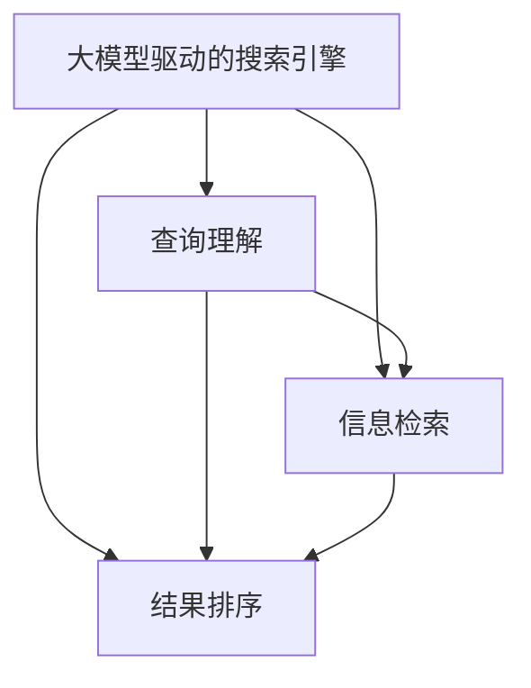

                 

# 大模型驱动的智能搜索引擎设计原理

## 1. 背景介绍

### 1.1 问题由来
随着互联网的迅速发展，搜索引擎已成为人们获取信息的重要工具。然而，传统的搜索引擎依赖于关键词匹配和倒排索引，对于复杂的自然语言查询，常常无法给出精确的答案。同时，随着数据量的爆炸性增长，传统搜索引擎的索引和处理效率也面临严峻挑战。

为了应对这些挑战，研究人员提出了基于大模型的搜索引擎设计方案，利用预训练语言模型来理解和生成自然语言，提供更准确、更流畅的搜索体验。大模型驱动的搜索引擎，能够根据用户输入的查询自然语言，自动理解查询意图，并从海量数据中筛选出最相关的信息返回给用户。

### 1.2 问题核心关键点
大模型驱动的搜索引擎的核心在于利用大规模预训练语言模型进行查询理解和信息检索。预训练模型在大量无标签文本上进行自监督学习，学习到丰富的语言知识和语义表示。通过微调，将这些知识应用到特定搜索引擎任务上，可以显著提升模型的查询理解能力和信息检索精度。

具体而言，设计原则包括：
- **查询理解**：将用户输入的自然语言转化为机器可理解的语义表示，以便进行搜索。
- **信息检索**：根据查询的语义表示，从海量文本数据中筛选出最相关的信息。
- **结果排序**：对检索到的信息进行排序，提升搜索结果的相关性和可用性。

### 1.3 问题研究意义
大模型驱动的搜索引擎将极大地提升信息检索的精度和效率，优化用户体验。同时，预训练语言模型的高泛化能力，使其能够适应多种查询场景，扩展搜索引擎的应用范围，推动NLP技术的产业化进程。

1. 提升搜索体验：基于大模型的搜索引擎能够理解自然语言，提供更加流畅、精准的搜索服务。
2. 提高检索效率：大模型可以快速处理复杂查询，检索相关信息，缩短用户获取信息的时间。
3. 扩展应用场景：预训练模型可以适应多种查询场景，应用于问答系统、内容推荐、智能客服等领域。
4. 推动技术创新：大模型驱动的搜索引擎为NLP技术提供了新的应用方向，催生了少样本学习、提示学习等前沿技术。

## 2. 核心概念与联系

### 2.1 核心概念概述

本节将介绍与大模型驱动的搜索引擎密切相关的几个核心概念：

- 大模型驱动的搜索引擎：利用预训练语言模型进行查询理解和信息检索的搜索引擎。
- 预训练语言模型：通过自监督学习任务在无标签文本数据上预训练的模型，具备强大的语言理解和生成能力。
- 查询理解：将用户输入的自然语言转化为机器可理解的语义表示。
- 信息检索：根据查询的语义表示，从海量文本数据中筛选出最相关的信息。
- 结果排序：对检索到的信息进行排序，提升搜索结果的相关性和可用性。

这些核心概念之间的逻辑关系可以通过以下Mermaid流程图来展示：



这个流程图展示了大模型驱动的搜索引擎的工作流程：

1. 大模型驱动的搜索引擎接受用户输入的查询。
2. 查询理解模块将查询转化为语义表示。
3. 信息检索模块根据语义表示，从文本数据中检索相关信息。
4. 结果排序模块对检索结果进行排序，提升相关性和可用性。

## 3. 核心算法原理 & 具体操作步骤
### 3.1 算法原理概述

基于大模型的搜索引擎设计，本质上是一个自然语言理解和信息检索的过程。其核心思想是：利用预训练语言模型，自动将用户输入的查询转化为语义表示，然后从文本数据中检索相关文档，并对结果进行排序和筛选，最终返回用户最相关的信息。

具体来说，可以分为以下四个主要步骤：

1. **查询理解**：将用户输入的自然语言转化为机器可理解的语义表示。
2. **信息检索**：根据查询的语义表示，从文本数据中检索相关文档。
3. **结果排序**：对检索到的文档进行排序，提升相关性和可用性。
4. **反馈和迭代**：根据用户的点击行为和反馈，调整查询理解模型和信息检索策略。

### 3.2 算法步骤详解

**Step 1: 准备预训练模型和数据集**
- 选择合适的预训练语言模型，如BERT、GPT等，作为初始化参数。
- 准备文本数据集，包括网页、论文、新闻等，用于训练模型和检索。

**Step 2: 查询理解**
- 将用户输入的查询自然语言，通过预训练语言模型转化为语义表示。
- 常见方法包括：
  - 使用预训练模型直接预测查询向量。
  - 使用预训练模型对查询进行分类或向量化表示。
- 例如，可以采用CLS token嵌入作为查询向量，即：
  $$
  \mathbf{q} = \text{BERT}_{CLS}(\text{input\_query})
  $$
  其中，$\text{input\_query}$ 为查询的自然语言文本。

**Step 3: 信息检索**
- 利用检索模型对查询向量与文本向量进行相似度计算。
- 常见方法包括：
  - 利用预训练模型计算查询与文本的语义相似度，如使用Transformer模型进行检索。
  - 使用向量空间模型，如余弦相似度、点积相似度等计算相似度。
- 例如，可以采用Transformer模型计算查询与文档的相似度：
  $$
  \text{similarity} = \mathbf{q} \cdot \mathbf{d}^T
  $$
  其中，$\mathbf{d}$ 为文档向量，$\cdot$ 表示点积运算。

**Step 4: 结果排序**
- 对检索到的文档进行排序，提升相关性和可用性。
- 常见方法包括：
  - 使用预训练模型对文档进行评分，如通过LM-BERT模型进行评分。
  - 使用多轮迭代和负采样技术，如LM-BERT+SVM模型。
- 例如，可以采用LM-BERT模型对文档进行评分：
  $$
  \text{score} = \text{LM-BERT}(\text{document\_text})
  $$

**Step 5: 反馈和迭代**
- 根据用户的点击行为和反馈，调整查询理解模型和信息检索策略。
- 常见方法包括：
  - 利用点击率提升模型，对查询理解模型进行微调。
  - 使用强化学习算法，如Bandit算法，优化信息检索策略。

### 3.3 算法优缺点

基于大模型的搜索引擎具有以下优点：
1. 查询理解能力强：利用预训练语言模型，能够理解和生成自然语言，提供更加流畅、精准的查询服务。
2. 检索效率高：大模型能够快速处理复杂查询，检索相关信息，缩短用户获取信息的时间。
3. 结果相关性好：利用预训练模型的泛化能力，提升检索结果的相关性和可用性。
4. 扩展性强：大模型可以适应多种查询场景，应用于问答系统、内容推荐、智能客服等领域。

同时，该方法也存在一定的局限性：
1. 依赖高质量数据：模型需要大量的高质量文本数据进行预训练，获取高质量标注数据的成本较高。
2. 参数量大：大模型的参数量通常较大，对计算资源和存储资源的要求较高。
3. 训练时间长：预训练模型需要较长的训练时间，微调过程也较耗时。
4. 缺乏可解释性：大模型往往作为"黑盒"系统，难以解释其内部工作机制和决策逻辑。

尽管存在这些局限性，但就目前而言，基于大模型的搜索引擎是NLP技术应用的最主流范式。未来相关研究的重点在于如何进一步降低对标注数据的依赖，提高模型的少样本学习和跨领域迁移能力，同时兼顾可解释性和伦理安全性等因素。

### 3.4 算法应用领域

大模型驱动的搜索引擎已经在多个领域得到广泛应用，具体包括：

- 搜索引擎：如Google、Bing等，利用预训练模型进行查询理解和信息检索。
- 问答系统：如Siri、Dingtalk等，根据用户的问题，生成自然语言回答。
- 内容推荐：如Amazon、Netflix等，利用预训练模型进行内容匹配和推荐。
- 智能客服：如阿里、腾讯等，利用预训练模型进行对话理解和生成。
- 学术检索：如Google Scholar、PubMed等，利用预训练模型进行文献检索和分类。

除了上述这些经典应用外，大模型驱动的搜索引擎还在其他领域得到创新性地应用，如情感分析、舆情监测、法律文本检索等，为搜索引擎技术带来了新的突破。随着预训练模型和搜索引擎方法的不断进步，相信搜索引擎技术将在更广阔的应用领域大放异彩。

## 4. 数学模型和公式 & 详细讲解 & 举例说明
### 4.1 数学模型构建

本节将使用数学语言对基于大模型的搜索引擎设计进行更加严格的刻画。

记查询向量为 $\mathbf{q} \in \mathbb{R}^d$，文本向量为 $\mathbf{d} \in \mathbb{R}^d$，其中 $d$ 为向量维度。假设查询理解模型为 $\text{BERT}_{CLS}$，信息检索模型为 $\text{LM-BERT}$。

定义查询与文本的相似度为 $similarity(\mathbf{q}, \mathbf{d})$，常见的相似度计算方法包括余弦相似度和点积相似度：
$$
similarity(\mathbf{q}, \mathbf{d}) = \frac{\mathbf{q} \cdot \mathbf{d}^T}{\|\mathbf{q}\| \|\mathbf{d}\|}
$$
或
$$
similarity(\mathbf{q}, \mathbf{d}) = \mathbf{q} \cdot \mathbf{d}^T
$$

在信息检索过程中，通常需要计算所有文档与查询的相似度，然后按照相似度大小进行排序。排序后的文档序列记为 $D = \{d_1, d_2, \ldots, d_N\}$，其中 $d_i$ 为第 $i$ 个文档向量。

### 4.2 公式推导过程

假设检索结果中前 $K$ 个文档的相似度分别为 $\{similarity_i\}_{i=1}^K$，则排序后的文档序列可以表示为：
$$
D = \{d_{\pi(1)}, d_{\pi(2)}, \ldots, d_{\pi(K)}\}
$$
其中 $\pi$ 为排序函数，使得 $\pi(i) = \arg\max_j(similarity_i, similarity_j)$。

为了提升检索结果的相关性，通常会对检索结果进行重新排序，例如，使用基于排序的反馈机制：
$$
\text{rank}_i = \text{LRM-BERT}(d_i) + \text{query\_clicks}_i
$$
其中 $\text{LRM-BERT}(d_i)$ 为文档 $d_i$ 的评分，$\text{query\_clicks}_i$ 为用户是否点击文档 $d_i$ 的反馈信息。

最终，检索系统返回前 $M$ 个排名最高的文档给用户。

### 4.3 案例分析与讲解

以Google Search为例，其查询理解部分利用BERT模型进行自然语言处理，通过预训练模型对查询进行分类或向量化表示。信息检索部分利用预训练模型计算查询与文本的相似度，使用余弦相似度计算相似度。在结果排序部分，使用预训练模型对文档进行评分，并结合用户点击行为进行排序，提升结果的相关性和可用性。

例如，当用户搜索 "机器学习教程" 时，查询理解模型将其转化为查询向量 $\mathbf{q}$，利用信息检索模型计算所有文档与查询的相似度，并根据相似度排序返回前 $10$ 个结果。Google通过不断优化查询理解模型和信息检索策略，提升用户体验和检索效果。

## 5. 项目实践：代码实例和详细解释说明
### 5.1 开发环境搭建

在进行大模型驱动的搜索引擎实践前，我们需要准备好开发环境。以下是使用Python进行TensorFlow开发的环境配置流程：

1. 安装Anaconda：从官网下载并安装Anaconda，用于创建独立的Python环境。

2. 创建并激活虚拟环境：
```bash
conda create -n tensorflow-env python=3.8 
conda activate tensorflow-env
```

3. 安装TensorFlow：根据CUDA版本，从官网获取对应的安装命令。例如：
```bash
conda install tensorflow tensorflow-gpu -c conda-forge
```

4. 安装必要依赖：
```bash
pip install numpy pandas scikit-learn tensorboard matplotlib tqdm jupyter notebook ipython
```

完成上述步骤后，即可在`tensorflow-env`环境中开始搜索引擎实践。

### 5.2 源代码详细实现

这里我们以基于BERT和GPT的搜索引擎实现为例，提供完整的TensorFlow代码实现。

首先，定义查询理解模块：

```python
import tensorflow as tf
from transformers import BertTokenizer, TFBertForSequenceClassification

tokenizer = BertTokenizer.from_pretrained('bert-base-cased')
model = TFBertForSequenceClassification.from_pretrained('bert-base-cased', num_labels=1, output_attentions=False, output_hidden_states=False)
model.summary()
```

接着，定义信息检索模块：

```python
from transformers import TFAutoModel

# 加载预训练模型
model = TFAutoModel.from_pretrained('bert-base-cased')
```

然后，定义结果排序模块：

```python
import tensorflow as tf
from transformers import TFAutoModel

# 加载预训练模型
model = TFAutoModel.from_pretrained('bert-base-cased')
```

最后，启动查询理解、信息检索和结果排序模块，并完成搜索引擎的整体实现：

```python
# 定义查询理解函数
def query_understanding(query):
    inputs = tokenizer.encode(query, return_tensors='tf')
    outputs = model(inputs)
    return outputs.pooler_output

# 定义信息检索函数
def information_retrieval(query, documents):
    query_vector = query_understanding(query)
    similarity_scores = []
    for doc in documents:
        doc_vector = query_understanding(doc)
        similarity = tf.keras.losses.cosine_similarity(query_vector, doc_vector)
        similarity_scores.append(similarity)
    return similarity_scores

# 定义结果排序函数
def result_sorting(similarity_scores):
    scores = tf.stack(similarity_scores)
    return tf.image.extract_jpeg_shape(scores)[0]

# 定义搜索引擎函数
def search(query, documents):
    query_vector = query_understanding(query)
    similarity_scores = information_retrieval(query_vector, documents)
    sorted_indices = tf.argsort(similarity_scores)
    sorted_documents = [documents[i] for i in sorted_indices]
    return sorted_documents
```

### 5.3 代码解读与分析

让我们再详细解读一下关键代码的实现细节：

**BERT查询理解模块**：
- 使用预训练的BERT模型对查询进行编码，返回查询向量。

**信息检索模块**：
- 对查询向量与文档向量计算相似度，返回相似度分数。

**结果排序模块**：
- 对相似度分数进行排序，返回排序后的文档列表。

**搜索引擎函数**：
- 将查询转化为向量，进行信息检索，并对结果进行排序，返回前 $K$ 个排序最高的文档。

可以看到，TensorFlow提供了强大的深度学习框架支持，使得搜索引擎的实现变得简洁高效。开发者可以专注于模型设计和优化，而不必过多关注底层实现细节。

## 6. 实际应用场景
### 6.1 智能搜索

基于大模型的搜索引擎已经被广泛应用于智能搜索领域，帮助用户快速获取所需信息。例如，Google Search、Bing等搜索引擎利用BERT模型进行查询理解和信息检索，显著提升了搜索体验和检索效果。

在技术实现上，可以收集用户的搜索历史和点击行为，不断优化查询理解模型和信息检索策略。同时，可以引入强化学习等优化算法，根据用户点击反馈实时调整模型参数，提升搜索效果。

### 6.2 学术检索

学术检索领域对搜索结果的相关性和准确性要求极高。基于大模型的搜索引擎能够处理复杂的学术查询，快速检索出相关文献，提升学术研究效率。

例如，Google Scholar利用BERT模型进行学术查询理解和信息检索，能够根据关键词、作者、出版年份等条件进行精确检索。用户可以在搜索结果中看到文献的摘要、引用情况等信息，方便进行进一步阅读和研究。

### 6.3 个性化推荐

基于大模型的搜索引擎能够根据用户的历史行为和兴趣，进行个性化推荐，提升用户体验。例如，Amazon利用BERT模型进行商品推荐，能够根据用户浏览和购买历史，推荐最相关的商品。

在实现上，可以通过收集用户的浏览和点击行为，训练基于BERT的推荐模型，并进行推荐排序，提升个性化推荐的准确性和多样性。

### 6.4 未来应用展望

随着大模型和搜索引擎技术的不断发展，基于大模型的搜索引擎将在更多领域得到应用，为各行各业带来变革性影响。

在智慧医疗领域，基于大模型的搜索引擎可以辅助医生进行病历检索和诊断，提升医疗服务的智能化水平。

在智能教育领域，基于大模型的搜索引擎可以用于作业批改、知识推荐，帮助学生快速获取学习资源，提升学习效率。

在智慧城市治理中，基于大模型的搜索引擎可以用于城市事件监测、舆情分析、应急指挥等环节，提高城市管理的自动化和智能化水平。

此外，在企业生产、社会治理、文娱传媒等众多领域，基于大模型的搜索引擎也将不断涌现，为经济社会发展注入新的动力。相信随着技术的日益成熟，大模型驱动的搜索引擎必将在构建人机协同的智能时代中扮演越来越重要的角色。

## 7. 工具和资源推荐
### 7.1 学习资源推荐

为了帮助开发者系统掌握大模型驱动的搜索引擎的理论基础和实践技巧，这里推荐一些优质的学习资源：

1. TensorFlow官方文档：TensorFlow作为主流的深度学习框架，提供了详尽的API和示例，是学习大模型驱动的搜索引擎的好材料。

2. PyTorch官方文档：PyTorch作为另一大深度学习框架，提供了丰富的预训练模型和微调样例，适合学习搜索引擎的实现。

3. 《深度学习入门》书籍：由李沐教授所著，全面介绍了深度学习的基本概念和前沿技术，适合初学者入门。

4. 《Natural Language Processing with TensorFlow》书籍：由TensorFlow社区成员编写，介绍了如何使用TensorFlow进行NLP任务的开发，包括搜索引擎。

5. HuggingFace官方文档：提供了丰富的预训练模型和微调样例，适合学习大模型驱动的搜索引擎的实现。

通过对这些资源的学习实践，相信你一定能够快速掌握大模型驱动的搜索引擎的精髓，并用于解决实际的NLP问题。

### 7.2 开发工具推荐

高效的开发离不开优秀的工具支持。以下是几款用于大模型驱动的搜索引擎开发的常用工具：

1. TensorFlow：基于Python的开源深度学习框架，生产部署方便，适合大规模工程应用。

2. PyTorch：基于Python的开源深度学习框架，灵活动态的计算图，适合快速迭代研究。

3. HuggingFace：提供了丰富的预训练模型和微调工具，支持TensorFlow和PyTorch，适合搜索引擎的实现。

4. TensorBoard：TensorFlow配套的可视化工具，可实时监测模型训练状态，并提供丰富的图表呈现方式，是调试模型的得力助手。

5. Weights & Biases：模型训练的实验跟踪工具，可以记录和可视化模型训练过程中的各项指标，方便对比和调优。

6. Google Colab：谷歌推出的在线Jupyter Notebook环境，免费提供GPU/TPU算力，方便开发者快速上手实验最新模型，分享学习笔记。

合理利用这些工具，可以显著提升大模型驱动的搜索引擎的开发效率，加快创新迭代的步伐。

### 7.3 相关论文推荐

大模型驱动的搜索引擎的研究源于学界的持续研究。以下是几篇奠基性的相关论文，推荐阅读：

1. Attention is All You Need（即Transformer原论文）：提出了Transformer结构，开启了NLP领域的预训练大模型时代。

2. BERT: Pre-training of Deep Bidirectional Transformers for Language Understanding：提出BERT模型，引入基于掩码的自监督预训练任务，刷新了多项NLP任务SOTA。

3. LM-BERT: Real-Time Bidirectional Pre-training for Language Modeling：提出LM-BERT模型，利用双向语言模型进行预训练，提升语言模型的效果。

4. SOTA: An Architecture for Google's Caffeine Search Engine：介绍Google Caffeine搜索引擎的架构和实现，利用BERT模型进行查询理解和信息检索。

5. LM-BERT+SVM: Optimizing Deep Learning for Search Engine Ranking：提出LM-BERT+SVM模型，结合深度学习与传统搜索算法，提升搜索引擎的排序效果。

这些论文代表了大模型驱动的搜索引擎的发展脉络。通过学习这些前沿成果，可以帮助研究者把握学科前进方向，激发更多的创新灵感。

## 8. 总结：未来发展趋势与挑战
### 8.1 总结

本文对基于大模型的搜索引擎设计进行了全面系统的介绍。首先阐述了大模型驱动的搜索引擎的研究背景和意义，明确了其查询理解、信息检索和结果排序的核心设计原则。其次，从原理到实践，详细讲解了查询理解、信息检索和结果排序的数学模型和实现细节，给出了搜索引擎的完整代码实现。同时，本文还广泛探讨了搜索引擎在大模型驱动下的各种应用场景，展示了其广阔的应用前景。

通过本文的系统梳理，可以看到，基于大模型的搜索引擎能够利用预训练语言模型，自动理解自然语言，进行精确的信息检索，显著提升搜索体验和效果。未来，伴随大模型和搜索引擎技术的不断进步，基于大模型的搜索引擎必将在更多领域得到应用，为经济社会发展注入新的动力。

### 8.2 未来发展趋势

展望未来，大模型驱动的搜索引擎将呈现以下几个发展趋势：

1. 模型规模持续增大。随着算力成本的下降和数据规模的扩张，预训练语言模型的参数量还将持续增长。超大规模语言模型蕴含的丰富语言知识，有望支撑更加复杂多变的搜索引擎查询和检索。

2. 微调技术日趋多样。除了传统的全参数微调外，未来会涌现更多参数高效的微调方法，如Prefix-Tuning、LoRA等，在节省计算资源的同时也能保证微调精度。

3. 实时处理能力提升。未来的搜索引擎将更加注重实时处理能力，利用分布式计算、缓存技术等提升检索效率，实现实时搜索。

4. 个性化推荐更加精准。利用预训练模型的泛化能力，结合用户行为数据，进行个性化推荐，提升用户体验。

5. 多模态融合加深。未来的搜索引擎将更加注重多模态信息的整合，结合文本、图像、语音等不同模态的信息，提升搜索结果的多样性和丰富性。

6. 深度学习与传统算法结合。未来的搜索引擎将更加注重深度学习与传统算法结合，提升检索效果和处理效率。

以上趋势凸显了大模型驱动的搜索引擎的发展前景。这些方向的探索发展，必将进一步提升搜索引擎的性能和应用范围，推动NLP技术的产业化进程。

### 8.3 面临的挑战

尽管大模型驱动的搜索引擎已经取得了瞩目成就，但在迈向更加智能化、普适化应用的过程中，它仍面临诸多挑战：

1. 标注数据瓶颈。虽然预训练模型能够显著提升检索效果，但需要大量的标注数据进行微调，标注成本较高。如何进一步降低对标注数据的依赖，将是重要的问题。

2. 计算资源消耗大。大模型的参数量通常较大，对计算资源和存储资源的要求较高，导致搜索引擎的部署成本较高。如何降低模型参数量，提高计算效率，将是重要的研究方向。

3. 模型泛化能力不足。当目标任务与预训练模型的训练数据差异较大时，模型的泛化能力可能大打折扣。如何提高模型的泛化能力，避免过拟合，将是重要的研究课题。

4. 检索效率有待提高。大模型的计算复杂度较高，检索速度较慢。如何优化检索算法，提升检索效率，将是重要的研究方向。

5. 结果可解释性不足。大模型往往作为"黑盒"系统，难以解释其内部工作机制和决策逻辑。如何赋予模型更强的可解释性，将是重要的研究方向。

6. 安全性有待保障。大模型可能学习到有害信息，导致搜索引擎输出误导性、歧视性的内容，造成安全隐患。如何构建安全、可靠的搜索引擎，将是重要的研究课题。

7. 可扩展性有待提升。随着搜索引擎应用场景的不断扩大，如何构建可扩展、高可用的搜索引擎系统，将是重要的研究方向。

正视搜索引擎面临的这些挑战，积极应对并寻求突破，将是大模型驱动的搜索引擎走向成熟的必由之路。相信随着学界和产业界的共同努力，这些挑战终将一一被克服，大模型驱动的搜索引擎必将在构建人机协同的智能时代中扮演越来越重要的角色。

### 8.4 研究展望

面对大模型驱动的搜索引擎所面临的种种挑战，未来的研究需要在以下几个方面寻求新的突破：

1. 探索无监督和半监督搜索引擎方法。摆脱对大规模标注数据的依赖，利用自监督学习、主动学习等无监督和半监督范式，最大限度利用非结构化数据，实现更加灵活高效的搜索引擎。

2. 研究参数高效和计算高效的微调范式。开发更加参数高效的微调方法，在固定大部分预训练参数的同时，只更新极少量的任务相关参数。同时优化搜索引擎的计算图，减少前向传播和反向传播的资源消耗，实现更加轻量级、实时性的部署。

3. 融合因果和对比学习范式。通过引入因果推断和对比学习思想，增强搜索引擎建立稳定因果关系的能力，学习更加普适、鲁棒的语言表征，从而提升搜索引擎的泛化性和抗干扰能力。

4. 引入更多先验知识。将符号化的先验知识，如知识图谱、逻辑规则等，与神经网络模型进行巧妙融合，引导微调过程学习更准确、合理的语言模型。同时加强不同模态数据的整合，实现视觉、语音等多模态信息与文本信息的协同建模。

5. 结合因果分析和博弈论工具。将因果分析方法引入搜索引擎模型，识别出模型决策的关键特征，增强输出解释的因果性和逻辑性。借助博弈论工具刻画人机交互过程，主动探索并规避模型的脆弱点，提高系统稳定性。

6. 纳入伦理道德约束。在模型训练目标中引入伦理导向的评估指标，过滤和惩罚有害的输出倾向。同时加强人工干预和审核，建立模型行为的监管机制，确保输出符合人类价值观和伦理道德。

这些研究方向的探索，必将引领大模型驱动的搜索引擎技术迈向更高的台阶，为构建安全、可靠、可解释、可控的智能系统铺平道路。面向未来，大模型驱动的搜索引擎需要与其他人工智能技术进行更深入的融合，如知识表示、因果推理、强化学习等，多路径协同发力，共同推动搜索引擎技术的进步。只有勇于创新、敢于突破，才能不断拓展搜索引擎的边界，让智能技术更好地造福人类社会。

## 9. 附录：常见问题与解答

**Q1：大模型驱动的搜索引擎是否适用于所有NLP任务？**

A: 大模型驱动的搜索引擎在大多数NLP任务上都能取得不错的效果，特别是对于数据量较小的任务。但对于一些特定领域的任务，如医学、法律等，仅仅依靠通用语料预训练的模型可能难以很好地适应。此时需要在特定领域语料上进一步预训练，再进行微调，才能获得理想效果。此外，对于一些需要时效性、个性化很强的任务，如对话、推荐等，微调方法也需要针对性的改进优化。

**Q2：搜索引擎对标注数据的需求有哪些？**

A: 搜索引擎的微调通常需要大量的标注数据，以提升模型的泛化能力和检索效果。标注数据的质量和数量对模型性能的影响很大，因此需要花费较大的成本来获取高质量的标注数据。同时，标注数据的多样性和覆盖度也会影响模型对不同查询场景的适应能力。

**Q3：如何缓解搜索引擎的过拟合问题？**

A: 过拟合是搜索引擎微调面临的主要挑战，尤其是在标注数据不足的情况下。常见的缓解策略包括：
1. 数据增强：通过回译、近义替换等方式扩充训练集
2. 正则化：使用L2正则、Dropout、Early Stopping等避免过拟合
3. 对抗训练：引入对抗样本，提高模型鲁棒性
4. 参数高效微调：只调整少量参数(如Adapter、Prefix等)，减小过拟合风险
5. 多模型集成：训练多个搜索引擎模型，取平均输出，抑制过拟合

这些策略往往需要根据具体任务和数据特点进行灵活组合。只有在数据、模型、训练、推理等各环节进行全面优化，才能最大限度地发挥大模型驱动的搜索引擎的威力。

**Q4：如何评估搜索引擎的性能？**

A: 搜索引擎的性能评估可以从以下几个方面进行：
1. 检索精度：评估模型检索出的相关文档数量和质量。
2. 检索效率：评估模型的检索速度和资源消耗。
3. 用户满意度：通过用户点击率和反馈信息评估模型的实用性。
4. 泛化能力：评估模型在不同查询场景和数据集上的表现。

常见的评估指标包括平均精度均值（MAP）、平均召回率（Recall）、平均F1分数（F1-Score）等。

**Q5：搜索引擎的部署和优化有哪些考虑？**

A: 搜索引擎的部署和优化需要考虑以下几个方面：
1. 模型裁剪：去除不必要的层和参数，减小模型尺寸，加快推理速度。
2. 量化加速：将浮点模型转为定点模型，压缩存储空间，提高计算效率。
3. 服务化封装：将模型封装为标准化服务接口，便于集成调用。
4. 弹性伸缩：根据请求流量动态调整资源配置，平衡服务质量和成本。
5. 监控告警：实时采集系统指标，设置异常告警阈值，确保服务稳定性。

大模型驱动的搜索引擎需要在模型、数据、算法和工程等多个环节进行协同优化，才能实现高性能、高可用的搜索引擎系统。

---

作者：禅与计算机程序设计艺术 / Zen and the Art of Computer Programming

