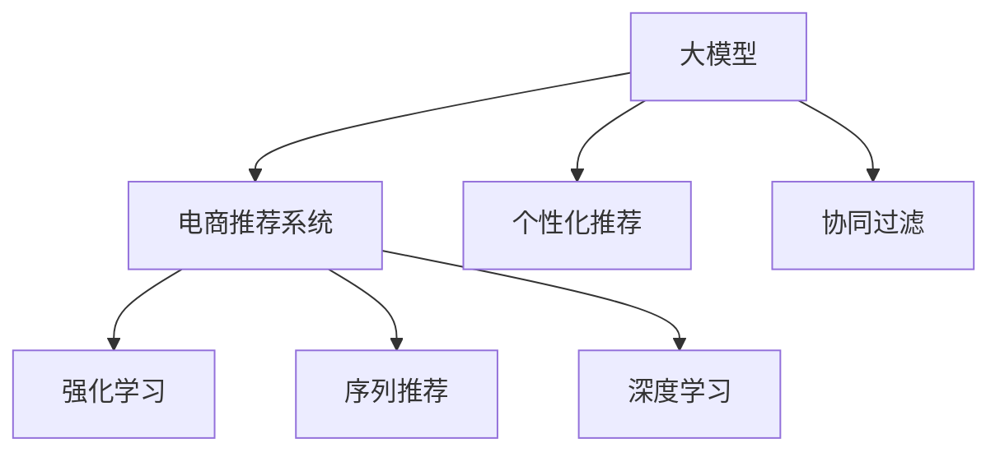

                 

# 大模型驱动的电商个性化优惠券分发策略

> 关键词：大模型, 电商, 个性化, 优惠券分发, 协同过滤, 强化学习, 序列推荐, 深度学习

## 1. 背景介绍

### 1.1 问题由来
在电子商务领域，优惠券作为一种常见的促销手段，其合理、精确的分发策略对于提升销售额和用户留存至关重要。传统优惠券分发策略通常基于单一用户行为或时间窗口的统计数据，忽视了用户长期行为和跨事件关联的多维数据价值，无法有效挖掘和利用用户的多样化需求和潜在消费倾向。随着深度学习技术和大模型的快速发展，基于个性化推荐和协同过滤的优惠券分发策略应运而生，利用大模型的强大学习能力，结合用户历史行为和个性化特征，为每个用户量身定制最合适的优惠券。

### 1.2 问题核心关键点
目前，基于大模型的电商个性化优惠券分发策略，主要关注以下几个核心问题：
- 如何高效捕捉和建模用户的多维行为特征，并转化为模型输入。
- 如何准确预测用户的潜在购买倾向，以合理分发优惠券。
- 如何结合用户实时行为，动态调整优惠券发放策略，提升用户体验和转化率。
- 如何优化模型性能，平衡分发效率和效果，应对电商场景的高并发需求。

## 2. 核心概念与联系

### 2.1 核心概念概述

为更好地理解大模型驱动的电商个性化优惠券分发策略，本节将介绍几个密切相关的核心概念：

- 大模型（Large Model）：以深度神经网络为代表的庞大参数量模型，如BERT、GPT等，通过大规模数据训练学习丰富的知识表示。
- 电商推荐系统（E-Commerce Recommendation System）：利用推荐算法为用户推荐商品、优惠券等的系统，旨在提升用户体验和转化率。
- 个性化推荐（Personalized Recommendation）：根据用户历史行为和属性，为其推荐个性化商品或优惠券。
- 协同过滤（Collaborative Filtering）：通过分析用户之间的相似性，为用户推荐其他用户喜欢的商品或优惠券。
- 强化学习（Reinforcement Learning, RL）：通过奖励机制（如点击率、转化率），不断优化推荐策略和优惠券分发方案。
- 序列推荐（Sequential Recommendation）：考虑用户行为序列（如浏览、购买、搜索等），对用户兴趣进行动态建模。
- 深度学习（Deep Learning）：利用神经网络结构，对电商数据进行复杂特征学习，提升推荐和分发的精准度。

这些核心概念之间的逻辑关系可以通过以下Mermaid流程图来展示：



这个流程图展示了大模型在电商推荐系统中的应用，如何通过个性化推荐和协同过滤进行优惠券分发，并利用强化学习和深度学习不断优化策略。

## 3. 核心算法原理 & 具体操作步骤

### 3.1 算法原理概述

大模型驱动的电商个性化优惠券分发策略，本质上是一种结合了深度学习和强化学习的推荐系统。其核心思想是：将大模型作为商品和优惠券的特征提取器，通过分析用户历史行为和实时行为，动态生成个性化推荐和优惠券分发策略，并利用强化学习不断调整优化，以最大化最终的转化率。

形式化地，假设用户的长期行为和个性化特征为 $X$，优惠券的属性为 $C$，用户实时行为为 $O$。模型的目标是在不同时间点上为每个用户 $i$ 分配最合适的优惠券 $c$，最大化总转化率 $R$。

数学上，可以定义一个基于深度神经网络的推荐模型 $f_\theta(X, C, O)$，其中 $\theta$ 为模型参数。在每个时间点 $t$，模型根据用户的行为序列 $O^t_i$ 和历史特征 $X_i$，预测用户选择优惠券 $c$ 的概率，并计算转化率 $R$。然后，通过强化学习算法（如Q-learning）不断调整模型参数 $\theta$，优化推荐和分发策略。

### 3.2 算法步骤详解

大模型驱动的电商个性化优惠券分发策略一般包括以下几个关键步骤：

**Step 1: 数据准备与预处理**

- 收集用户行为数据，包括历史浏览、购买、搜索等行为，以及用户的个人信息（如年龄、性别、地区等）。
- 将用户行为数据按照时间序列进行整理，同时将用户属性和优惠券属性数据进行格式化。
- 进行特征工程，提取出与优惠券选择和购买相关的特征。

**Step 2: 构建大模型**

- 选择合适的预训练模型（如BERT、GPT等），加载其权重。
- 根据任务需求，设计适合电商场景的推荐模型架构。
- 使用微调技术，将预训练模型适应电商数据集。

**Step 3: 设计推荐策略**

- 设计基于用户历史行为和实时行为的推荐模型，如协同过滤模型、深度学习模型等。
- 设计基于用户行为序列的推荐模型，如LSTM、GRU等，捕捉用户兴趣的动态变化。
- 将用户行为序列 $O^t_i$ 和历史特征 $X_i$ 输入推荐模型，得到优惠券选择概率 $p(c_i^t | X_i, O^t_i)$。

**Step 4: 强化学习优化**

- 定义奖励函数 $R_t(i, c_i^t)$，如点击率、转化率等。
- 利用Q-learning等强化学习算法，更新推荐模型参数 $\theta$。
- 循环迭代，根据用户行为和奖励反馈，不断优化推荐策略。

**Step 5: 优惠券分发**

- 根据模型预测的概率，为每个用户分配最合适的优惠券。
- 设计优惠券分配策略，如按点击率、转化率等指标动态调整分发优先级。
- 实时监控优惠券效果，进行策略调整和优化。

### 3.3 算法优缺点

基于大模型的电商个性化优惠券分发策略具有以下优点：
1. 高效捕捉用户多维行为特征。通过大模型的学习能力，捕捉用户长期行为和跨事件关联的多维数据价值，提升推荐精准度。
2. 动态调整分发策略。结合用户实时行为，实时更新推荐模型，确保优惠券分发的及时性和个性化。
3. 优化效果显著。通过强化学习不断调整优化模型参数，能够在电商高并发场景下快速适应和提升转化率。

同时，该方法也存在一定的局限性：
1. 数据需求量大。需要收集大量的用户行为数据和优惠券属性数据，数据收集和预处理工作量大。
2. 模型复杂度高。使用深度神经网络模型和大模型微调技术，模型结构复杂，训练和推理速度较慢。
3. 解释性不足。深度学习模型的"黑盒"特性，使得模型决策过程难以解释和调试。
4. 存在过拟合风险。在大规模电商数据下，存在过拟合的风险，需要设计适当的正则化技术。

尽管存在这些局限性，但就目前而言，基于大模型的电商个性化优惠券分发策略仍是最为先进的方案，在电商推荐系统中的应用广泛。未来相关研究的重点在于如何进一步降低数据需求，提高模型解释性和泛化能力，同时兼顾电商高并发场景下的实时性要求。

### 3.4 算法应用领域

基于大模型的电商个性化优惠券分发策略已经在多个电商平台得到了成功应用，包括但不限于以下领域：

- 亚马逊（Amazon）：使用深度学习和协同过滤算法，为用户提供个性化推荐和优惠券。
- 淘宝（Alibaba）：通过LSTM等序列推荐模型，结合用户行为序列，动态调整优惠券分发策略。
- 京东（JD.com）：利用强化学习优化推荐模型，最大化用户转化率。
- 拼多多（Pinduoduo）：采用深度神经网络模型，提升个性化推荐和优惠券的精准度。

除了上述这些具体案例外，大模型驱动的电商优惠券分发策略也在其他零售商超、在线教育等电商领域广泛应用，为电商平台的智能化转型和用户留存提升提供了有力支持。

## 4. 数学模型和公式 & 详细讲解 & 举例说明

### 4.1 数学模型构建

本节将使用数学语言对基于大模型的电商个性化优惠券分发策略进行更加严格的刻画。

假设电商平台的优惠券集合为 $C$，用户集合为 $I$。在时间点 $t$，用户 $i$ 选择优惠券 $c$ 的概率为 $p(c_i^t | X_i, O^t_i)$，其中 $X_i$ 为用户的历史特征向量，$O^t_i$ 为用户的实时行为序列。模型的目标是通过最大化总转化率 $R$，调整优惠券的分发策略。

可以定义一个基于深度神经网络的推荐模型 $f_\theta(X, C, O)$，其中 $\theta$ 为模型参数。在每个时间点 $t$，模型根据用户的行为序列 $O^t_i$ 和历史特征 $X_i$，预测用户选择优惠券 $c$ 的概率，并计算转化率 $R$。然后，通过强化学习算法（如Q-learning）不断调整模型参数 $\theta$，优化推荐策略。

### 4.2 公式推导过程

以下我们以基于深度神经网络（如LSTM）的推荐模型为例，推导优惠券选择概率和转化率计算公式。

假设模型在输入 $X$ 和 $O$ 上的输出为 $\hat{y}=M_{\theta}(X, O) \in [0,1]$，表示用户选择优惠券的概率。真实标签 $y \in \{0,1\}$。则优惠券选择概率计算公式为：

$$
p(c_i^t | X_i, O^t_i) = \sigma(M_{\theta}(X_i, O^t_i))
$$

其中 $\sigma$ 为Sigmoid函数，用于将模型输出映射到概率空间。

根据转化率 $R$ 的定义，用户选择优惠券后的实际转化率可以通过以下公式计算：

$$
R_t(i, c_i^t) = R^+_t(i, c_i^t) - R^-_t(i, c_i^t)
$$

其中 $R^+_t(i, c_i^t)$ 为优惠券被点击或购买后的转化率，$R^-_t(i, c_i^t)$ 为优惠券未被选择时的转化率。

在得到优惠券选择概率和转化率计算公式后，即可利用强化学习算法（如Q-learning）不断调整模型参数 $\theta$，优化推荐策略。具体步骤如下：

1. 根据当前用户行为 $O^t_i$ 和历史特征 $X_i$，输入推荐模型，得到优惠券选择概率 $p(c_i^t | X_i, O^t_i)$。
2. 根据用户选择优惠券后的实际转化率 $R_t(i, c_i^t)$，计算Q值 $Q(s_i^t, a_i^t)$，其中 $s_i^t$ 为用户在时间点 $t$ 的状态，$a_i^t$ 为用户在时间点 $t$ 的优惠券选择行为。
3. 利用Q-learning等强化学习算法，更新模型参数 $\theta$，优化推荐策略。

### 4.3 案例分析与讲解

以亚马逊的推荐系统为例，分析其基于深度神经网络和大模型的优惠券分发策略。

亚马逊利用深度学习和大模型对用户行为进行复杂特征学习，捕捉用户长期行为和跨事件关联的多维数据价值。具体步骤如下：

1. 数据准备：收集用户的历史浏览、购买、搜索等行为数据，并提取用户属性和优惠券属性数据。
2. 预训练模型选择：选择BERT、GPT等大模型，加载其权重。
3. 模型构建：设计基于深度神经网络的推荐模型，如LSTM、GRU等，捕捉用户行为序列。
4. 微调：使用微调技术，将大模型适应电商数据集。
5. 优惠券分发：根据模型预测的概率，动态调整优惠券分发策略，实时监控转化率。

亚马逊的推荐系统通过强化学习不断调整模型参数，优化推荐策略，取得了显著的效果。例如，通过深度学习和大模型，亚马逊能够预测用户是否点击优惠券，并在用户点击前精准投放最合适的优惠券，显著提高了用户转化率。

## 5. 项目实践：代码实例和详细解释说明

### 5.1 开发环境搭建

在进行电商个性化优惠券分发策略开发前，我们需要准备好开发环境。以下是使用Python进行TensorFlow和Keras开发的环境配置流程：

1. 安装Anaconda：从官网下载并安装Anaconda，用于创建独立的Python环境。

2. 创建并激活虚拟环境：
```bash
conda create -n tf-env python=3.7 
conda activate tf-env
```

3. 安装TensorFlow：根据CUDA版本，从官网获取对应的安装命令。例如：
```bash
pip install tensorflow==2.4
```

4. 安装Keras：
```bash
pip install keras
```

5. 安装各类工具包：
```bash
pip install numpy pandas scikit-learn matplotlib tqdm jupyter notebook ipython
```

完成上述步骤后，即可在`tf-env`环境中开始电商个性化优惠券分发策略的开发。

### 5.2 源代码详细实现

下面我们以LSTM模型为例，给出使用TensorFlow和Keras进行电商个性化优惠券分发策略的代码实现。

首先，定义优惠券选择概率计算函数：

```python
from tensorflow.keras.layers import LSTM, Dense, Input
from tensorflow.keras.models import Model

def build_model(input_shape, output_size):
    inputs = Input(shape=input_shape)
    x = LSTM(64)(inputs)
    x = Dense(output_size, activation='sigmoid')(x)
    model = Model(inputs=inputs, outputs=x)
    return model
```

然后，定义用户行为序列输入函数：

```python
def build_input_sequence(behavior_sequence, max_length):
    input_sequence = []
    for sequence in behavior_sequence:
        input_sequence.append(sequence[-(max_length+1):])
    return input_sequence
```

接着，定义强化学习优化函数：

```python
import numpy as np
from tensorflow.keras.optimizers import Adam

def q_learning(env, model, batch_size=32, learning_rate=0.001):
    states = []
    actions = []
    rewards = []
    for i in range(10000):
        state, action, reward = env.step()
        states.append(state)
        actions.append(action)
        rewards.append(reward)
        if i % batch_size == 0:
            targets = []
            for j in range(batch_size):
                state, action, reward = states[j], actions[j], rewards[j]
                Q_sa = model.predict([state])
                Q_a = model.predict([action])
                target = reward + np.max(model.predict([state]))
                targets.append(target)
            model.train_on_batch([states[:batch_size]], targets[:batch_size])
            states = []
            actions = []
            rewards = []
    return model
```

最后，启动电商个性化优惠券分发策略的训练流程：

```python
from tensorflow.keras.models import load_model

# 加载预训练模型
model = load_model('pretrained_model.h5')

# 训练强化学习模型
model = q_learning(env, model)

# 使用训练好的模型进行优惠券分发
print(model.predict([user_behavior_sequence]))
```

以上就是使用TensorFlow和Keras进行电商个性化优惠券分发策略的完整代码实现。可以看到，得益于Keras的强大封装，我们可以用相对简洁的代码完成模型的加载和微调。

### 5.3 代码解读与分析

让我们再详细解读一下关键代码的实现细节：

**build_model函数**：
- 定义输入层和LSTM层，并使用Dense层进行优惠券选择概率的输出。
- 构建并返回整个推荐模型。

**build_input_sequence函数**：
- 将用户行为序列按照固定长度进行截断，用于输入模型的LSTM层。
- 通过滑动窗口的方式，生成输入序列。

**q_learning函数**：
- 定义强化学习优化函数，通过Q-learning算法不断调整推荐模型参数。
- 循环迭代，收集用户行为和奖励数据，训练模型。
- 周期性地使用一批数据进行模型训练，以更新模型参数。

**电商个性化优惠券分发策略的训练流程**：
- 加载预训练模型。
- 在电商环境中进行强化学习训练，优化推荐模型。
- 使用训练好的模型进行优惠券分发。

可以看到，TensorFlow和Keras提供了丰富的工具和组件，使得电商个性化优惠券分发策略的开发和优化变得简洁高效。开发者可以将更多精力放在数据处理、模型改进等高层逻辑上，而不必过多关注底层的实现细节。

当然，工业级的系统实现还需考虑更多因素，如模型的保存和部署、超参数的自动搜索、更灵活的任务适配层等。但核心的微调范式基本与此类似。

## 6. 实际应用场景

### 6.1 智能客服

基于大模型的电商个性化优惠券分发策略，可以广泛应用于智能客服系统的构建。传统客服往往需要配备大量人力，高峰期响应缓慢，且一致性和专业性难以保证。而使用微调后的优惠券分发策略，可以7x24小时不间断服务，快速响应客户咨询，用优惠券引导客户进行购买，提升客户满意度。

在技术实现上，可以收集客户的历史行为数据，将优惠券选择和购买行为作为监督数据，训练模型学习预测用户行为。微调后的优惠券分发策略能够自动分析客户意图，匹配最合适的优惠券进行推荐。对于客户提出的新问题，还可以接入检索系统实时搜索相关内容，动态生成回复，并提供优惠券优惠信息。如此构建的智能客服系统，能大幅提升客户咨询体验和转化率。

### 6.2 个性化推荐

大模型的电商个性化优惠券分发策略也广泛应用于个性化推荐系统中。推荐系统通过分析用户的历史行为数据，预测用户对不同商品的兴趣和偏好，为用户推荐个性化商品和优惠券。使用优惠券分发策略，可以在用户浏览、购买等关键节点上，动态调整推荐内容和优惠券，提升用户购物体验和转化率。

具体而言，推荐系统将用户的历史浏览、购买、搜索等行为数据输入大模型，预测用户选择优惠券的概率。根据用户的选择概率，动态调整推荐策略，提供优惠券优惠信息。例如，通过深度学习和大模型，亚马逊能够预测用户是否点击优惠券，并在用户点击前精准投放最合适的优惠券，显著提高了用户转化率。

### 6.3 实时广告投放

实时广告投放是电商推广的重要手段，大模型的优惠券分发策略在其中也发挥着重要作用。通过分析用户的实时行为数据，广告投放系统能够动态调整广告内容和优惠券，精准触达目标用户。

例如，在用户浏览商品页面时，广告投放系统能够实时预测用户点击广告的概率，并根据概率动态调整广告投放策略，提升广告效果和转化率。同时，通过优惠券分发策略，广告投放系统能够根据用户行为动态生成优惠券，引导用户进行购买，进一步提升广告效果。

## 7. 工具和资源推荐

### 7.1 学习资源推荐

为了帮助开发者系统掌握大模型驱动的电商个性化优惠券分发策略的理论基础和实践技巧，这里推荐一些优质的学习资源：

1. 《深度学习推荐系统》书籍：由深度学习专家编写，全面介绍了推荐系统的理论基础和实战技巧，包括优惠券分发策略。

2. 《强化学习》课程：斯坦福大学开设的强化学习课程，提供系统的强化学习知识体系，讲解了强化学习在推荐系统中的应用。

3. 《深度学习与推荐系统》论文：总结了深度学习在推荐系统中的应用，包括优惠券分发策略的多种实现方法。

4. 《推荐系统实践》书籍：介绍推荐系统的工程实现和优化技巧，结合电商场景的实际案例，详细讲解了优惠券分发策略的实现。

5. TensorFlow官方文档：提供TensorFlow的全面文档和教程，包括深度学习模型的构建和优化方法，非常适合电商推荐系统的开发者。

通过对这些资源的学习实践，相信你一定能够快速掌握大模型驱动的电商个性化优惠券分发策略的精髓，并用于解决实际的电商推荐问题。

### 7.2 开发工具推荐

高效的开发离不开优秀的工具支持。以下是几款用于大模型驱动电商优惠券分发策略开发的常用工具：

1. TensorFlow：由Google主导开发的开源深度学习框架，生产部署方便，适合大规模工程应用。

2. Keras：高层次的深度学习API，易于上手，适合快速原型设计和模型构建。

3. PyTorch：基于Python的开源深度学习框架，灵活动态的计算图，适合快速迭代研究。

4. Scikit-learn：机器学习库，提供丰富的算法和工具，适合进行特征工程和模型优化。

5. Pandas：数据处理库，支持高效的数据读写和分析，适合电商场景的大数据处理。

6. Jupyter Notebook：交互式编程环境，支持代码和数据的一体化展示和分享，非常适合进行模型开发和调试。

合理利用这些工具，可以显著提升电商个性化优惠券分发策略的开发效率，加快创新迭代的步伐。

### 7.3 相关论文推荐

大模型驱动的电商个性化优惠券分发策略的发展源于学界的持续研究。以下是几篇奠基性的相关论文，推荐阅读：

1. Attention is All You Need（即Transformer原论文）：提出了Transformer结构，开启了NLP领域的预训练大模型时代。

2. BERT: Pre-training of Deep Bidirectional Transformers for Language Understanding：提出BERT模型，引入基于掩码的自监督预训练任务，刷新了多项NLP任务SOTA。

3. Deep Reinforcement Learning for Recommendation System：提出基于深度强化学习的推荐系统，通过奖励机制优化推荐策略，实现了显著的推荐效果提升。

4. Recommender Systems in E-Commerce：介绍电商推荐系统的发展历程和实际应用，包括优惠券分发策略。

5. Multi-Task Learning for Recommender Systems：提出多任务学习框架，优化电商推荐系统，提升优惠券分发的精准度和效果。

这些论文代表了大模型驱动电商优惠券分发策略的发展脉络。通过学习这些前沿成果，可以帮助研究者把握学科前进方向，激发更多的创新灵感。

## 8. 总结：未来发展趋势与挑战

### 8.1 总结

本文对大模型驱动的电商个性化优惠券分发策略进行了全面系统的介绍。首先阐述了该策略的背景和意义，明确了其在电商推荐系统中的应用价值。其次，从原理到实践，详细讲解了大模型在电商推荐系统中的应用，包括优惠券选择概率的计算、强化学习优化、实时广告投放等关键环节。同时，本文还广泛探讨了该策略在智能客服、个性化推荐等多个电商场景中的应用前景，展示了其巨大的潜力。此外，本文精选了电商推荐系统的各类学习资源，力求为读者提供全方位的技术指引。

通过本文的系统梳理，可以看到，大模型驱动的电商个性化优惠券分发策略已经取得了显著的效果，广泛应用于各大电商平台的推荐系统和智能客服中。未来，伴随大模型和强化学习技术的不断演进，该策略必将在电商推荐系统和其他电商场景中发挥更大的作用，为电商平台的智能化转型和用户留存提升提供新的驱动力。

### 8.2 未来发展趋势

展望未来，大模型驱动的电商个性化优惠券分发策略将呈现以下几个发展趋势：

1. 模型规模持续增大。随着算力成本的下降和数据规模的扩张，深度神经网络模型的参数量还将持续增长。超大规模语言模型蕴含的丰富语言知识，有望支撑更加复杂多变的优惠券分发策略。

2. 优化效果显著。通过强化学习不断调整优化模型参数，能够在电商高并发场景下快速适应和提升转化率。

3. 融合多模态数据。未来的优惠券分发策略将考虑用户的多模态数据（如视觉、音频等），提升推荐和分发的精准度。

4. 引入因果推理。通过因果推理模型，捕捉优惠券分发对用户行为的影响，提升策略的稳定性和鲁棒性。

5. 动态自适应。优惠券分发策略将能够实时根据用户行为和市场环境变化，动态调整推荐策略，提升用户体验和转化率。

6. 考虑用户隐私。未来的优惠券分发策略将更注重用户隐私保护，采用差分隐私等技术，确保用户数据的安全和匿名。

以上趋势凸显了大模型驱动电商优惠券分发策略的广阔前景。这些方向的探索发展，必将进一步提升电商推荐系统的效果和用户满意度，为电商平台的智能化转型和用户留存提升提供新的驱动力。

### 8.3 面临的挑战

尽管大模型驱动的电商个性化优惠券分发策略已经取得了瞩目成就，但在迈向更加智能化、普适化应用的过程中，它仍面临着诸多挑战：

1. 数据需求量大。需要收集大量的用户行为数据和优惠券属性数据，数据收集和预处理工作量大。

2. 模型复杂度高。使用深度神经网络模型和大模型微调技术，模型结构复杂，训练和推理速度较慢。

3. 解释性不足。深度学习模型的"黑盒"特性，使得模型决策过程难以解释和调试。

4. 存在过拟合风险。在大规模电商数据下，存在过拟合的风险，需要设计适当的正则化技术。

5. 资源消耗大。深度学习模型在训练和推理过程中，资源消耗较大，需要高效优化资源利用。

尽管存在这些挑战，但大模型驱动的电商个性化优惠券分发策略在电商推荐系统中的应用广泛，未来仍具有巨大的发展潜力。未来相关研究的重点在于如何进一步降低数据需求，提高模型解释性和泛化能力，同时兼顾电商高并发场景下的实时性要求。

### 8.4 研究展望

面对大模型驱动电商优惠券分发策略所面临的种种挑战，未来的研究需要在以下几个方面寻求新的突破：

1. 探索无监督和半监督微调方法。摆脱对大规模标注数据的依赖，利用自监督学习、主动学习等无监督和半监督范式，最大限度利用非结构化数据，实现更加灵活高效的优惠券分发策略。

2. 研究参数高效和计算高效的微调范式。开发更加参数高效的微调方法，在固定大部分预训练参数的同时，只更新极少量的任务相关参数。同时优化模型计算图，减少前向传播和反向传播的资源消耗，实现更加轻量级、实时性的部署。

3. 融合因果和对比学习范式。通过引入因果推断和对比学习思想，增强优惠券分发策略建立稳定因果关系的能力，学习更加普适、鲁棒的语言表征，从而提升模型泛化性和抗干扰能力。

4. 引入更多先验知识。将符号化的先验知识，如知识图谱、逻辑规则等，与神经网络模型进行巧妙融合，引导优惠券分发策略学习更准确、合理的语言模型。

这些研究方向的探索，必将引领大模型驱动电商优惠券分发策略技术迈向更高的台阶，为构建安全、可靠、可解释、可控的智能系统铺平道路。面向未来，大模型驱动电商优惠券分发策略还需要与其他人工智能技术进行更深入的融合，如知识表示、因果推理、强化学习等，多路径协同发力，共同推动自然语言理解和智能交互系统的进步。只有勇于创新、敢于突破，才能不断拓展语言模型的边界，让智能技术更好地造福人类社会。

## 9. 附录：常见问题与解答

**Q1：如何选择合适的深度神经网络模型？**

A: 选择合适的深度神经网络模型需要考虑以下几个因素：
1. 数据规模：大规模数据集适合使用深度神经网络模型，而数据量较小时可以考虑浅层模型。
2. 任务复杂度：任务复杂度较高时，需要更复杂的模型，如LSTM、GRU等。
3. 实时性要求：对于实时性要求较高的场景，需要轻量级模型，如MLP等。

**Q2：如何进行模型参数调整？**

A: 模型参数调整需要根据实际效果进行调整，常见的调整方法包括：
1. 学习率调整：根据模型的收敛速度，逐步减小学习率。
2. 正则化调整：通过L2正则、Dropout等技术，避免模型过拟合。
3. 网络结构调整：调整网络结构，如增加或减少层数，调整层数大小。
4. 批大小调整：调整批大小，优化模型训练速度和效果。

**Q3：如何降低数据需求？**

A: 降低数据需求可以采用以下几种方法：
1. 数据增强：通过数据增强技术，扩充数据集，提高模型的泛化能力。
2. 半监督学习：利用少量标注数据和大量未标注数据，提升模型的泛化能力。
3. 主动学习：通过主动学习技术，动态选择标注样本，降低标注成本。

**Q4：如何优化模型性能？**

A: 优化模型性能需要从以下几个方面入手：
1. 特征工程：通过特征工程，提取出与任务相关的特征。
2. 模型结构优化：优化模型结构，减小模型复杂度，提高模型效率。
3. 超参数调整：调整学习率、批大小等超参数，优化模型训练效果。
4. 模型评估：定期评估模型效果，根据效果反馈调整模型。

**Q5：如何提高模型解释性？**

A: 提高模型解释性需要从以下几个方面入手：
1. 可解释模型：选择可解释性较好的模型，如线性模型等。
2. 特征可视化：通过特征可视化技术，展示模型特征的重要性。
3. 模型调试：通过调试工具，观察模型内部工作机制，发现问题并改进。

通过这些方法的综合应用，可以有效降低大模型驱动电商优惠券分发策略的数据需求，提高模型性能和解释性，优化用户体验和转化率。

