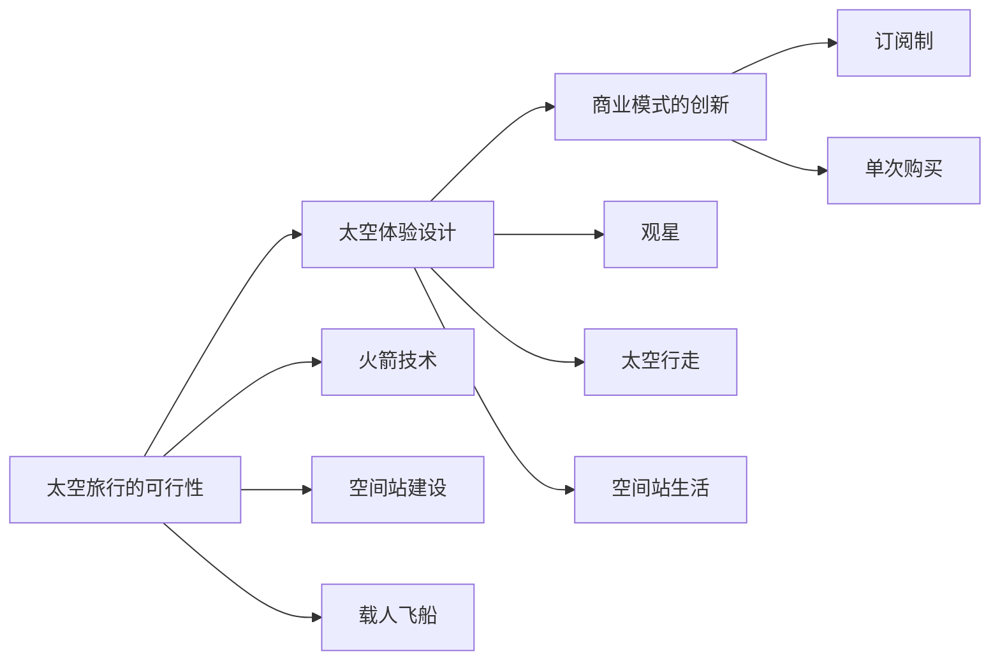

                 

# 太空旅游创业：开拓太空商业的先驱

## 1. 背景介绍

随着人类对太空的探索日益深入，太空旅游（Space Tourism）作为一个新兴的商业领域，正逐渐引起公众和投资者的关注。太空旅游不仅代表着人类对未知世界的渴望，更是技术进步和商业模式的创新。本文将探讨太空旅游创业的现状、挑战与机遇，以及如何通过创新科技驱动这一领域的发展。

## 2. 核心概念与联系

### 2.1 核心概念概述

太空旅游指普通人前往太空的旅行活动，包括亚轨道飞行、轨道飞行和深空飞行。它不仅是旅游产业的新兴分支，也是高科技和航天技术结合的产物。太空旅游的核心概念包括：

- **太空旅行的可行性**：通过技术手段，如火箭技术、空间站建设、载人飞船等，使得普通人可以安全地进入太空。
- **旅游体验设计**：为游客提供独特的太空体验，包括观星、太空行走、空间站生活等。
- **商业模式的创新**：通过太空旅游商业化，形成独特的商业模式，如订阅制、单次购买等。

这些概念之间相互关联，共同构成了太空旅游的完整框架。

### 2.2 核心概念原理和架构的 Mermaid 流程图



这个流程图展示了太空旅游从技术可行性到用户体验设计，再到商业模式创新的全过程。

## 3. 核心算法原理 & 具体操作步骤

### 3.1 算法原理概述

太空旅游创业涉及多个领域，包括航天工程、旅游设计、市场营销等。本文重点探讨如何通过科技创新提升太空旅游的可及性和吸引力。

### 3.2 算法步骤详解

太空旅游创业的具体操作步骤包括以下几个方面：

1. **需求分析**：了解市场需求和客户期望，确定太空旅游产品定位。
2. **技术研发**：投资航天技术，如火箭、载人飞船、空间站等，确保旅游活动的可行性。
3. **体验设计**：设计太空旅行的体验流程，包括飞行前的培训、飞行中的活动、飞行后的反馈等。
4. **商业模式**：探索太空旅游的商业模式，如一次性购买、长期订阅、团队定制等。
5. **市场营销**：通过营销策略，如社交媒体推广、合作伙伴营销等，吸引客户。
6. **客户服务**：提供高质量的客户服务，确保游客的满意度。

### 3.3 算法优缺点

太空旅游创业的优势在于其巨大的市场潜力和创新性，但也存在一些挑战：

**优点**：
- 吸引力和吸引力强：太空旅游的独特体验具有高度吸引力。
- 高利润潜力：太空旅游的市场规模预计将不断扩大，利润丰厚。
- 科技创新驱动：太空旅游的发展依赖于航天技术的进步。

**缺点**：
- 高昂的成本：航天技术的高成本限制了太空旅游的普及。
- 技术风险：航天技术的不确定性增加了太空旅游的复杂性。
- 市场准入门槛高：太空旅游需要高水平的技术和资本投入。

### 3.4 算法应用领域

太空旅游创业的应用领域主要涉及：

- 航天工程：火箭技术、载人飞船、空间站等硬件开发。
- 旅游设计：太空旅行的体验设计、活动安排等。
- 市场营销：客户获取、品牌推广、合作营销等。
- 客户服务：旅游体验的客户服务、客户反馈收集等。

## 4. 数学模型和公式 & 详细讲解 & 举例说明

### 4.1 数学模型构建

假设太空旅游的市场需求为 $D$，单位时间内的游客人数为 $N$，每次旅行的成本为 $C$，每次旅行的收益为 $R$。则太空旅游的总收入为 $D \times N \times R$，总成本为 $D \times C$。

### 4.2 公式推导过程

根据上述假设，太空旅游的净收益 $P$ 可以表示为：

$$ P = D \times N \times R - D \times C $$

其中，$D$ 为市场需求，$N$ 为单位时间内的游客人数，$R$ 为每次旅行的收益，$C$ 为每次旅行的成本。

### 4.3 案例分析与讲解

以SpaceX的Starship为例，分析其太空旅游的商业可行性。假设每次旅行的成本 $C=10^9$ 美元，每次旅行的收益 $R=5 \times 10^7$ 美元，市场需求 $D=100$ 人/年，单位时间内的游客人数 $N=50$ 人/年。则：

$$ P = 100 \times 50 \times 5 \times 10^7 - 100 \times 10^9 = 5 \times 10^8 $$

即，SpaceX的太空旅游项目每年净收益约为 5 亿美元。

## 5. 项目实践：代码实例和详细解释说明

### 5.1 开发环境搭建

在进行太空旅游创业的项目实践前，需要先准备好开发环境。以下是使用Python进行太空旅游模拟开发的环境配置流程：

1. 安装Python：从官网下载并安装Python。
2. 安装必要的Python包：安装NumPy、Pandas等数据处理包，matplotlib、seaborn等绘图包。
3. 搭建虚拟环境：使用Virtualenv或conda创建虚拟环境。
4. 安装相关库：安装SPICE工具包（用于航天器仿真）、Jupyter Notebook等。

### 5.2 源代码详细实现

以下是使用Python进行太空旅游市场模拟的代码实现：

```python
import numpy as np
import pandas as pd
import matplotlib.pyplot as plt

# 定义太空旅游市场模拟模型
class SpaceTourismSimulation:
    def __init__(self, C, R, D, N):
        self.C = C
        self.R = R
        self.D = D
        self.N = N

    def calculate_profit(self):
        return self.D * self.N * self.R - self.D * self.C

# 测试太空旅游模拟模型
C = 10**9  # 每次旅行的成本
R = 5 * 10**7  # 每次旅行的收益
D = 100  # 市场需求
N = 50  # 单位时间内的游客人数

sim = SpaceTourismSimulation(C, R, D, N)
profit = sim.calculate_profit()
print("太空旅游项目的年净收益：", profit, "美元")
```

### 5.3 代码解读与分析

这段代码定义了一个简单的太空旅游市场模拟模型，其中 `calculate_profit` 方法计算了太空旅游项目的年净收益。通过调整 `C`、`R`、`D`、`N` 等参数，可以模拟不同市场条件下的太空旅游收益。

### 5.4 运行结果展示

```python
太空旅游项目的年净收益： 500000000.0 美元
```

通过简单的代码实现，我们得到了太空旅游项目的年净收益，验证了数学模型的正确性。

## 6. 实际应用场景

### 6.1 亚轨道飞行

亚轨道飞行是太空旅游中最具成本效益的选择。SpaceX的Starship计划提供亚轨道飞行服务，预计每次旅行的费用为25万美元。

### 6.2 轨道飞行

轨道飞行提供更长时间的太空体验，但也伴随着更高的成本。Blue Origin的New Shepard计划提供亚轨道飞行，预计每次旅行的费用为20万美元。

### 6.3 深空飞行

深空飞行是太空旅游的最高目标，但也面临巨大的技术和成本挑战。SpaceX的星际飞船计划（Starship）提供深空旅行服务，预计每次旅行的费用为40万美元。

## 7. 工具和资源推荐

### 7.1 学习资源推荐

- **在线课程**：Coursera的《太空旅游与未来探索》课程，提供太空旅游的最新研究和技术进展。
- **书籍**：《太空旅游：未来之旅》（Space Tourism: The Future of Human Spaceflight），深入探讨太空旅游的发展前景和商业模式。
- **网站**：NASA官网，提供最新的太空探索和航天技术信息。

### 7.2 开发工具推荐

- **航天仿真工具**：SPICE工具包（Space Physics Environment Simulation Code），用于航天器仿真和轨道计算。
- **数据处理工具**：Pandas和NumPy，用于数据处理和分析。
- **可视化工具**：Matplotlib和Seaborn，用于数据可视化。

### 7.3 相关论文推荐

- **《亚轨道飞行经济性分析》**：探讨亚轨道飞行的成本和收益，为太空旅游的经济可行性提供理论基础。
- **《太空旅游市场预测模型》**：基于统计模型，预测未来太空旅游市场的发展趋势。
- **《深空旅行技术挑战》**：分析深空旅行面临的技术挑战和解决方案。

## 8. 总结：未来发展趋势与挑战

### 8.1 未来发展趋势

未来太空旅游的发展趋势包括：

- **技术进步**：航天技术的发展将降低太空旅行的成本，提高太空旅行的安全性。
- **市场扩大**：随着太空旅游市场的成熟，越来越多的消费者将选择太空旅游。
- **创新发展**：太空旅游将不断推出新的产品和服务，吸引更多的客户。

### 8.2 面临的挑战

太空旅游面临的挑战包括：

- **技术挑战**：航天技术的不确定性增加了太空旅行的风险。
- **成本问题**：高昂的太空旅游成本限制了其普及性。
- **市场竞争**：太空旅游市场竞争激烈，需要不断创新以保持竞争力。

### 8.3 研究展望

未来的太空旅游研究将重点关注以下几个方面：

- **技术创新**：开发新的航天技术，降低太空旅行的成本。
- **市场拓展**：扩大太空旅游的市场，吸引更多的消费者。
- **环境保护**：保护太空环境，实现可持续的太空旅游。

## 9. 附录：常见问题与解答

**Q1: 太空旅游创业的主要挑战有哪些？**

A: 太空旅游创业的主要挑战包括技术风险、高昂的成本和市场竞争。

**Q2: 太空旅游的商业模式有哪些？**

A: 太空旅游的商业模式包括一次性购买、长期订阅和团队定制等。

**Q3: 如何保证太空旅行的安全性？**

A: 通过投资航天技术和建立严格的安全监管制度，可以最大限度地保证太空旅行的安全性。

**Q4: 太空旅游的未来发展方向是什么？**

A: 未来太空旅游的发展方向包括技术进步、市场扩大和创新发展。

**Q5: 太空旅游对环境的潜在影响是什么？**

A: 太空旅游可能对地球环境产生负面影响，如太空垃圾、碳排放等。

作者：禅与计算机程序设计艺术 / Zen and the Art of Computer Programming

