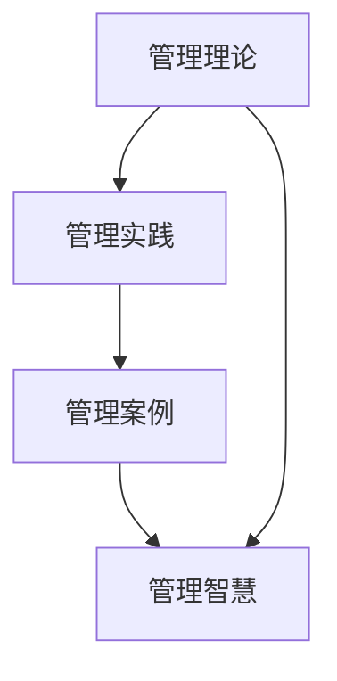

                 

# 如何从经典著作中提炼管理智慧

## 1. 背景介绍

### 1.1 问题由来

在现代社会，管理已经成为各个组织不可或缺的重要活动。然而，随着市场环境、技术进步、社会需求的变化，管理的实践和理论也在不断地演进。为了适应这种快速变化，管理者需要不断学习、不断更新自己的管理知识和技能。在这个过程中，经典管理著作往往能够提供深刻的洞察和实用的策略，帮助管理者解决实际问题，提升组织效率。

### 1.2 问题核心关键点

从经典管理著作中提炼管理智慧，主要需要关注以下几个核心关键点：

1. **理论基础**：理解经典管理理论的核心思想和方法，如组织结构设计、战略规划、绩效管理等。
2. **实践应用**：将理论知识转化为具体的管理实践，结合实际情境解决具体问题。
3. **案例分析**：通过研究经典案例，深入理解管理决策和实践过程。
4. **思维框架**：学习经典著作中的思维框架，如系统思考、战略思考等，提高管理决策的科学性和前瞻性。
5. **跨学科融合**：将管理理论与心理学、经济学、社会学等学科的知识相结合，拓展管理视野。

通过深入挖掘这些关键点，管理者可以从经典著作中获取丰富的管理智慧，提升自身和组织的竞争力。

## 2. 核心概念与联系

### 2.1 核心概念概述

为了更好地理解如何从经典著作中提炼管理智慧，本节将介绍几个密切相关的核心概念：

- **管理理论**：指用于指导和分析管理实践的系统化知识体系。包括泰勒的科学管理、法约尔的一般管理理论、梅奥的人际关系理论等。
- **管理实践**：指在管理理论指导下，实际应用中的具体行动和决策。如组织架构设计、绩效评估、团队协作等。
- **管理案例**：指从实际管理活动中选取的具有典型代表性和启示性的事件，用于分析和借鉴。
- **管理智慧**：指通过理论学习、实践经验、案例研究等综合形成的深刻洞见和实用策略。

这些核心概念之间的逻辑关系可以通过以下Mermaid流程图来展示：



这个流程图展示了管理理论、管理实践、管理案例和管理智慧之间的逻辑关系：

1. 管理理论为管理实践提供理论基础。
2. 管理实践通过应用管理理论解决具体问题。
3. 管理案例展示了成功或失败的管理实践，提供学习和借鉴的素材。
4. 管理智慧是理论、实践和案例的深度融合，是管理者应具备的洞察力和决策能力。

## 3. 核心算法原理 & 具体操作步骤
### 3.1 算法原理概述

从经典著作中提炼管理智慧，本质上是一个从理论到实践的转化过程。其核心思想是：通过深入学习管理理论，结合具体情境，运用管理实践中的成功经验和教训，以案例为载体，实现理论知识与实际操作的有机结合，形成具有可操作性的管理策略。

形式化地，假设经典管理著作中包含 $M$ 条理论，每条理论 $m_i$ 都有一套具体的实施步骤和操作指南。给定具体情境 $S$，目标是在 $M$ 条理论中选择最适用的理论 $m_k$，并按照 $m_k$ 的指导，在情境 $S$ 中进行管理实践 $P$。

具体步骤如下：

1. **理论筛选**：在经典著作中选择与情境 $S$ 相关的理论 $m_k$。
2. **操作指南**：按照 $m_k$ 的操作步骤，在情境 $S$ 中进行管理实践 $P$。
3. **结果评估**：对管理实践 $P$ 的效果进行评估，确定是否需要调整和改进。
4. **迭代优化**：根据评估结果，调整理论 $m_k$ 的应用策略，不断迭代优化，直至达到最佳效果。

### 3.2 算法步骤详解

基于上述原理，从经典著作中提炼管理智慧的步骤如下：

**Step 1: 理论准备**
- 选择经典管理著作，如《管理学原理》、《管理的实践》、《卓有成效的管理者》等。
- 确定需要解决的具体管理问题，如组织变革、绩效提升、团队协作等。

**Step 2: 理论筛选**
- 从选择的管理著作中筛选与问题相关的理论，如组织设计理论、激励理论、领导理论等。
- 分析这些理论的适用范围、操作步骤、操作指南等。

**Step 3: 操作指南**
- 按照筛选的理论的操作步骤，结合具体情境，设计实施方案。
- 明确实施步骤、关键人员、所需资源等。

**Step 4: 实践应用**
- 在组织中实施管理实践，观察和记录实施过程中的各种情况。
- 收集反馈信息，评估实践效果。

**Step 5: 结果评估**
- 根据反馈信息，评估管理实践的效果，如是否解决了问题、是否提升了效率、是否达成了目标等。
- 分析实践过程中的成功经验和不足之处。

**Step 6: 迭代优化**
- 根据评估结果，调整和改进管理实践，优化操作指南。
- 如果效果不佳，重新筛选理论，继续实践和优化。

### 3.3 算法优缺点

从经典著作中提炼管理智慧的方法具有以下优点：

1. **理论基础扎实**：经典管理理论经过时间的检验，具有较高的实用性和科学性。
2. **实践经验丰富**：经典管理案例展示了各种情境下的管理实践，具有很高的参考价值。
3. **系统性思考**：经典著作通常具备系统性的思考框架，有助于管理者全面分析和解决问题。
4. **跨学科融合**：经典著作中融合了心理学、经济学、社会学等多学科的知识，扩展了管理视野。

同时，该方法也存在一定的局限性：

1. **理论与实践脱节**：经典著作中的一些理论可能与当前市场环境、技术条件有所差异。
2. **情境适应性**：经典案例通常是特定情境下的产物，可能难以直接应用于不同情境。
3. **复杂度高**：理论筛选、操作指南设计、实践应用和评估等步骤较为复杂，需要较高的专业水平。
4. **效果不确定性**：管理实践的效果受到多种因素的影响，如管理者水平、组织文化等。

尽管存在这些局限性，但经典管理著作仍是大管理者获取管理智慧的重要资源。未来相关研究的重点在于如何更有效地将理论知识转化为实践行动，同时兼顾情境适应性和效果评估。

### 3.4 算法应用领域

从经典著作中提炼管理智慧的方法，在多个管理领域都得到了广泛应用，例如：

- **组织管理**：如组织结构设计、变革管理、绩效评估等。通过学习经典著作中的理论，结合实际情境进行组织设计和优化。
- **人力资源管理**：如招聘、培训、绩效管理等。通过分析经典案例，理解员工心理和行为，设计有效的人力资源策略。
- **财务管理**：如预算管理、成本控制、风险管理等。通过研究经典管理理论，优化财务管理流程，提升财务效率。
- **市场营销管理**：如品牌管理、市场分析、销售管理等。通过案例研究，掌握市场动态，制定有效的市场营销策略。
- **运营管理**：如供应链管理、生产管理、物流管理等。通过理论学习和实践分析，提升运营效率，降低运营成本。

除了上述这些经典管理领域外，从经典著作中提炼管理智慧的方法也被应用到更多新兴管理领域，如创新管理、数字化转型等，为管理实践提供了新的思路和方法。

## 4. 数学模型和公式 & 详细讲解  
### 4.1 数学模型构建

本节将使用数学语言对从经典著作中提炼管理智慧的过程进行更加严格的刻画。

假设经典管理著作中包含 $M$ 条理论，每条理论 $m_i$ 有一套操作步骤 $OP_{m_i}$，包含 $n_i$ 个步骤。给定具体情境 $S$，目标是在 $M$ 条理论中选择最适用的理论 $m_k$，并按照 $OP_{m_k}$ 的步骤在情境 $S$ 中进行管理实践 $P$。

管理实践 $P$ 的效果评估指标为 $E$，通过反馈信息 $F$ 计算得出。则目标函数为：

$$
\min_{m_k} \max_{F \in E} |F - P(m_k, OP_{m_k}, S)|
$$

其中 $P(m_k, OP_{m_k}, S)$ 表示在情境 $S$ 下，按照理论 $m_k$ 和操作步骤 $OP_{m_k}$ 进行管理实践的效果。

### 4.2 公式推导过程

以下我们以人力资源管理为例，推导招聘过程的数学模型。

假设人力资源管理中的招聘步骤为 $n$ 个，每个步骤的效果评估指标为 $E_i$，招聘过程的效果评估指标为 $E$。设招聘过程中的反馈信息为 $F$，则招聘效果评估模型为：

$$
E = \sum_{i=1}^n \alpha_i E_i
$$

其中 $\alpha_i$ 为各步骤的效果权重。

目标是最小化招聘效果与反馈信息的差异，即：

$$
\min_{m_k, OP_{m_k}} |F - P(m_k, OP_{m_k}, S)|
$$

在实践中，可以通过A/B测试、问卷调查等方式收集反馈信息，将招聘效果与实际效果进行对比，调整招聘策略。

### 4.3 案例分析与讲解

以《管理学原理》中关于招聘过程的章节为例，分析招聘策略的设计和优化。

《管理学原理》提出，招聘过程分为以下几个步骤：

1. **岗位分析**：明确岗位要求、职责、权限等，制定招聘标准。
2. **发布招聘信息**：通过各种渠道发布招聘广告，吸引应聘者。
3. **筛选简历**：根据岗位要求筛选出符合条件的简历。
4. **面试**：进行多轮面试，评估应聘者的综合素质。
5. **录用与培训**：选择最合适的应聘者，进行岗前培训。

通过分析这些步骤，可以发现招聘过程的关键因素包括岗位分析的合理性、招聘渠道的有效性、面试方法的科学性等。管理者可以结合实际情境，优化这些关键因素，提升招聘效果。例如，在面试环节中，可以增加心理测试、情景模拟等环节，全面评估应聘者的综合素质。

## 5. 项目实践：代码实例和详细解释说明
### 5.1 开发环境搭建

在进行管理智慧的实践应用前，我们需要准备好开发环境。以下是使用Python进行管理实践应用的环境配置流程：

1. 安装Python：从官网下载并安装Python，配置好环境变量。
2. 安装必要的库：如numpy、pandas、matplotlib等，用于数据分析和可视化。
3. 搭建数据平台：如Hadoop、Spark等，用于存储和管理数据。
4. 配置项目开发环境：如Jupyter Notebook、PyCharm等，提供代码编写和调试工具。

完成上述步骤后，即可在Python环境中开始管理智慧的实践应用。

### 5.2 源代码详细实现

下面以人力资源管理中的招聘过程为例，给出使用Python进行招聘效果评估的代码实现。

```python
import pandas as pd
from sklearn.model_selection import train_test_split
from sklearn.linear_model import LinearRegression
import matplotlib.pyplot as plt

# 读取招聘数据
data = pd.read_csv('recruitment_data.csv')

# 数据预处理
X = data[['教育背景', '工作经验', '技能水平']]
y = data['招聘效果']

# 划分训练集和测试集
X_train, X_test, y_train, y_test = train_test_split(X, y, test_size=0.2, random_state=42)

# 构建线性回归模型
model = LinearRegression()
model.fit(X_train, y_train)

# 预测招聘效果
y_pred = model.predict(X_test)

# 计算评估指标
rmse = np.sqrt(np.mean((y_test - y_pred) ** 2))
r2 = np.corrcoef(y_test, y_pred)[0][1]

# 输出评估结果
print(f"RMSE: {rmse}")
print(f"R2: {r2}")

# 可视化结果
plt.scatter(y_test, y_pred)
plt.plot(y_test, y_pred, color='red', label='Fitting Line')
plt.xlabel('Actual')
plt.ylabel('Predicted')
plt.title('Recruitment Effect Prediction')
plt.legend()
plt.show()
```

这段代码实现了基于线性回归模型的招聘效果评估，将招聘效果与应聘者的教育背景、工作经验、技能水平等特征进行建模，并计算出RMSE和R2等评估指标。管理者可以通过调整这些特征的权重，优化招聘策略。

### 5.3 代码解读与分析

让我们再详细解读一下关键代码的实现细节：

**数据预处理**：
- 使用Pandas库读取招聘数据，并进行数据清洗和特征提取。
- 使用Scikit-learn库进行数据划分，将数据划分为训练集和测试集。

**模型构建**：
- 使用Scikit-learn库构建线性回归模型，并进行模型训练。

**效果评估**：
- 使用RMSE和R2等评估指标，衡量模型预测效果与实际效果之间的差异。
- 使用Matplotlib库可视化模型预测结果。

**结论**：
- 这段代码展示了如何将管理理论应用于管理实践，通过数据分析和建模，评估招聘效果，优化招聘策略。

## 6. 实际应用场景
### 6.1 企业组织管理

从经典著作中提炼管理智慧，可以广泛应用于企业组织管理中。传统管理模式往往依赖于经验和直觉，难以应对复杂多变的环境。基于经典管理理论的管理实践，可以提升组织管理效率，优化组织结构设计，增强组织适应性。

在技术实现上，可以收集企业内部的组织结构变化、绩效评估数据，将经典管理理论如法约尔的一般管理理论、泰勒的科学管理理论等应用于组织管理实践。例如，根据法约尔的管理理论，可以设计科学的组织架构，明确职责分工，优化流程，提升组织效率。

### 6.2 项目进度管理

项目管理是企业运作中不可或缺的重要环节，然而传统项目管理的模式往往难以应对项目进度变化、资源配置等复杂问题。从经典著作中提炼管理智慧，可以提升项目管理水平，优化项目进度管理。

以《项目管理实践指南》为例，管理者可以学习其中的时间管理、成本控制、风险管理等理论，结合实际情境，设计科学的进度管理方案。例如，使用关键路径法、PERT图等工具，分析项目关键路径和风险点，制定科学的进度计划，确保项目按时完成。

### 6.3 供应链管理

供应链管理是企业运营中的重要环节，涉及供应商选择、库存管理、物流配送等多个方面。基于经典管理理论的管理实践，可以优化供应链管理流程，降低运营成本，提升供应链效率。

以《供应链管理》为例，管理者可以学习其中的库存管理、物流管理、供应商关系管理等理论，结合实际情境，设计科学的供应链管理策略。例如，使用ABC分析法进行库存分类管理，优化库存水平；使用精益物流管理方法，提升物流效率；使用供应商评估模型，选择优质供应商，建立长期合作关系。

### 6.4 未来应用展望

随着管理理论和实践的不断演进，基于经典著作的管理智慧也将不断拓展应用领域，为企业管理实践提供新的方向。

在智慧城市治理中，管理智慧可以应用于城市事件监测、舆情分析、应急指挥等环节，提高城市管理的自动化和智能化水平，构建更安全、高效的未来城市。

在智慧教育领域，管理智慧可以应用于课程设计、教学评估、学生管理等环节，因材施教，促进教育公平，提高教学质量。

在智慧医疗领域，管理智慧可以应用于医院管理、医患沟通、医疗资源分配等环节，提升医疗服务质量，优化医疗资源配置。

除了上述这些领域外，管理智慧在金融、制造业、公共事务管理等众多领域也将得到广泛应用，为企业管理实践带来新的思路和方法。

## 7. 工具和资源推荐
### 7.1 学习资源推荐

为了帮助管理者系统掌握管理智慧的理论基础和实践技巧，这里推荐一些优质的学习资源：

1. 《管理学原理》：由管理学大师彼得·德鲁克所著，系统介绍了管理学的基础理论和实践方法。
2. 《管理的实践》：由管理学先驱彼得·德鲁克所著，深入浅出地探讨了管理的核心问题和实践方法。
3. 《卓有成效的管理者》：由彼得·德鲁克所著，强调管理者在组织中的作用和责任，提供了实用的管理建议。
4. 《变革领导力》：由约翰·马克斯威尔所著，探讨了如何通过领导力推动组织变革，实现组织目标。
5. 《组织变革与组织设计》：由理查德·加纳姆所著，详细介绍了组织变革和设计的方法和技巧。

通过对这些资源的学习实践，相信管理者一定能够快速掌握管理智慧的核心内容，并将其应用于实际管理实践中。

### 7.2 开发工具推荐

高效的开发离不开优秀的工具支持。以下是几款用于管理实践开发的工具：

1. JIRA：项目管理工具，支持敏捷开发和任务管理，帮助管理者跟踪项目进度和问题。
2. Trello：项目管理工具，提供可视化看板，方便管理者安排任务和协调团队工作。
3. Microsoft Project：项目计划和进度管理工具，支持资源分配、进度跟踪和风险管理。
4. Google Sheets：数据分析工具，方便管理者进行数据汇总和分析。
5. Microsoft Excel：数据分析工具，提供强大的数据处理和可视化功能。

合理利用这些工具，可以显著提升管理实践的开发效率，加快创新迭代的步伐。

### 7.3 相关论文推荐

经典管理理论的研究始终处于前沿，以下是几篇奠基性的相关论文，推荐阅读：

1. "The Principles of Scientific Management" by Frederick W. Taylor：介绍了科学管理的核心思想和实践方法。
2. "The Elements of Style" by Strunk Jr. and White：探讨了写作风格和规范，对管理文书的撰写有重要参考价值。
3. "The Theory of the Lean Production System" by Toyota Production System Center：介绍了精益生产的核心概念和方法，对企业管理实践有重要借鉴意义。
4. "The Five Dysfunctions of a Team" by Patrick Lencioni：探讨了团队建设中的五个常见问题及其解决方法，对企业管理团队建设有重要启示。
5. "The Lean Startup" by Eric Ries：介绍了精益创业的理念和方法，对企业管理创新有重要参考价值。

这些论文代表了大管理理论的研究方向，通过学习这些前沿成果，可以帮助管理者把握学科前进方向，激发更多的创新灵感。

## 8. 总结：未来发展趋势与挑战

### 8.1 总结

本文对从经典著作中提炼管理智慧的方法进行了全面系统的介绍。首先阐述了管理智慧的理论基础和实践意义，明确了经典著作在提升管理者水平、优化管理实践方面的独特价值。其次，从理论到实践，详细讲解了管理智慧的构建过程，给出了管理实践应用的完整代码实例。同时，本文还广泛探讨了管理智慧在组织管理、项目进度管理、供应链管理等多个领域的应用前景，展示了管理智慧的广泛应用价值。此外，本文精选了管理智慧的学习资源，力求为管理者提供全方位的技术指引。

通过本文的系统梳理，可以看到，基于经典著作的管理智慧提炼方法正在成为企业管理的重要资源，极大地提升了管理者的水平和组织的竞争力。未来，伴随管理理论和实践的不断演进，基于经典著作的管理智慧提炼方法将更加丰富，为企业管理实践提供更强的指导和支持。

### 8.2 未来发展趋势

展望未来，管理智慧的提炼和应用将呈现以下几个发展趋势：

1. **智能化管理**：随着人工智能和大数据技术的发展，管理智慧的提炼将更加智能化、自动化，通过数据分析和模型优化，提升管理决策的科学性和效率。
2. **跨领域融合**：管理智慧将更加注重跨学科融合，如将心理学、经济学、社会学等学科的知识融入管理实践，提升管理智慧的综合性和前瞻性。
3. **数据驱动**：数据驱动的管理实践将成为主流，通过收集、分析和应用海量数据，提升管理决策的准确性和效果。
4. **人机协同**：管理智慧将更加注重人机协同，利用人工智能技术辅助管理者进行决策和执行，提升管理效率。
5. **文化建设**：管理智慧将更加注重企业文化建设，通过建立良好的组织文化，提升员工的凝聚力和执行力。

以上趋势凸显了管理智慧提炼方法的广阔前景。这些方向的探索发展，必将进一步提升企业管理水平，为组织带来更多的创新和机遇。

### 8.3 面临的挑战

尽管管理智慧提炼技术已经取得了瞩目成就，但在迈向更加智能化、普适化应用的过程中，它仍面临着诸多挑战：

1. **理论与实践脱节**：经典著作中的理论可能与当前市场环境、技术条件有所差异，难以直接应用于实际情境。
2. **数据获取困难**：获取高价值的、高质量的管理数据，尤其是跨领域、跨组织的数据，是管理智慧提炼的难点之一。
3. **文化差异**：不同组织文化和管理习惯的差异，可能影响管理智慧的应用效果。
4. **技术复杂性**：管理智慧的提炼和应用涉及多学科知识，需要较高的专业水平和实践经验。
5. **人员培训**：管理者需要具备一定的技术能力，才能有效应用管理智慧，因此需要进行相应的培训和引导。

尽管存在这些挑战，但经典著作仍是大管理者获取管理智慧的重要资源。未来相关研究的重点在于如何更有效地将理论知识转化为实践行动，同时兼顾情境适应性和效果评估。

### 8.4 研究展望

面对管理智慧提炼面临的挑战，未来的研究需要在以下几个方面寻求新的突破：

1. **数据融合**：开发更多跨领域数据融合方法，解决数据孤岛问题，提升管理数据的质量和可用性。
2. **智能模型**：开发更加智能化的管理模型，通过机器学习、深度学习等技术，提升管理决策的科学性和效率。
3. **知识图谱**：引入知识图谱等知识表示方法，增强管理智慧的逻辑性和系统性。
4. **人机协同**：研究人机协同方法，利用人工智能技术辅助管理者进行决策和执行，提升管理效率。
5. **文化适配**：研究文化适配方法，根据不同组织文化和管理习惯，设计适宜的管理智慧应用策略。

这些研究方向将引领管理智慧提炼技术迈向更高的台阶，为构建更加智能、高效、人性化的组织管理提供支持。面向未来，管理智慧提炼需要与其他人工智能技术进行更深入的融合，如知识表示、因果推理、强化学习等，多路径协同发力，共同推动管理智慧的进步。

## 9. 附录：常见问题与解答

**Q1：经典著作中的管理理论是否适用于所有情境？**

A: 经典著作中的管理理论具有普遍适用性，但不同的情境下可能需要结合实际情况进行适当的调整。管理者需要根据自身组织的特色和环境，灵活应用经典理论，避免生搬硬套。

**Q2：如何判断经典著作中的管理理论是否适用于当前情境？**

A: 首先需要对经典著作中的管理理论进行全面学习，理解其核心思想和实践方法。然后结合当前情境的特点，进行对比分析，评估理论的适用性。如果存在差异，可以进行适当的调整和优化，以适应当前情境。

**Q3：如何评估管理实践的效果？**

A: 可以通过多种方法评估管理实践的效果，如关键绩效指标(KPIs)、员工满意度调查、客户满意度调查等。管理者可以根据具体情况选择合适的方法，进行系统性的评估和改进。

**Q4：在管理实践中如何平衡短期和长期目标？**

A: 在管理实践中，需要明确短期和长期目标，进行合理的权衡和分配。可以通过目标分解、优先级排序等方法，制定科学的管理计划，确保短期目标和长期目标的平衡。

**Q5：经典著作中的管理理论如何与新兴技术结合？**

A: 经典著作中的管理理论可以与新兴技术进行有机结合，提升管理实践的效果。例如，可以结合大数据、人工智能等技术，进行数据驱动的管理决策，提升管理效率和效果。

这些问题的解答，可以帮助管理者更好地理解和应用管理智慧，提升管理实践的水平和效果。

---

作者：禅与计算机程序设计艺术 / Zen and the Art of Computer Programming

