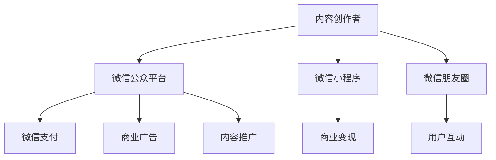

                 

# 如何利用微信生态圈实现知识变现

> 关键词：微信生态圈,知识变现,小程序,公众号,微信广告,微信流量,微信付费,知识付费,内容营销,知识型商业,数字内容,微信商业,内容增值

## 1. 背景介绍

在数字化转型的大潮中，知识和信息资源逐渐成为重要的生产要素和商业资产。如何高效地发掘和利用这些资源，实现知识的货币化，成为互联网时代的重要课题。

微信作为全球用户数最多的社交平台之一，拥有着庞大的用户基数和活跃的社交生态。通过深度利用微信生态圈的各种功能和服务，可以有效实现知识的变现，让优质内容创造者获得收益。

本文将详细探讨如何利用微信生态圈的多元化服务，构建知识变现的商业模式，帮助内容创作者将知识转化为可观的经济收益。

## 2. 核心概念与联系

### 2.1 核心概念概述

为了更好地理解如何在微信生态圈内实现知识变现，我们首先明确几个核心概念：

- **微信生态圈**：包括微信公众平台、微信小程序、微信朋友圈、微信支付等各类服务和功能，形成一个完整的闭环生态系统。
- **知识变现**：指通过分享、销售或服务提供等方式，将知识或信息转化为商业收益的过程。
- **微信小程序**：基于微信平台的轻量级应用，支持用户互动和商业化操作，是连接内容创作者与消费者的桥梁。
- **公众号**：微信内具有高曝光度的内容发布平台，适合发布高质量的原创文章和图文内容。
- **微信支付**：微信内提供的第三方支付功能，支持多种线上支付模式，便于创作者进行商业变现。

这些核心概念通过微信生态圈的有机结合，为知识变现提供了全方位的支持，构建起一个高效的变现平台。

### 2.2 核心概念原理和架构的 Mermaid 流程图



## 3. 核心算法原理 & 具体操作步骤

### 3.1 算法原理概述

知识变现的核心在于将优质内容与市场精准对接，利用微信生态圈的高曝光度和强大流量引擎，实现内容的商业化。

从算法角度看，知识变现的流程主要包括内容创作、平台推荐、用户互动和商业变现四个环节。其中，内容创作是基础，平台推荐是关键，用户互动是增强，商业变现是目标。

### 3.2 算法步骤详解

以下详细介绍在微信生态圈内实现知识变现的详细步骤：

**Step 1: 内容创作与优化**

- 定位目标受众，选择合适的内容主题和格式。内容应具备高价值、易理解、有传播性的特点。
- 使用SEO优化策略，提升内容的搜索排名，增加曝光量。包括合理使用标签、关键词，撰写高质量的标题和摘要。
- 定期更新内容，保持持续输出，增强用户粘性。利用数据反馈调整内容策略，提升质量。

**Step 2: 平台推荐与推广**

- 利用微信公众平台的分发机制，通过文章推荐、专题推送等方式提高内容的曝光度。
- 在微信公众号内设置专栏和订阅消息，引导用户订阅，增加稳定流量。
- 使用微信朋友圈分享机制，利用个人社交网络的影响力扩散内容。
- 借助微信广告平台，投放定向广告，精准触达目标用户。包括单次推广、投放周期、预算设置等。

**Step 3: 用户互动与反馈**

- 利用微信小程序和公众号的互动功能，如评论、点赞、转发、预约等功能，增强用户参与度和互动性。
- 定期收集用户反馈，了解用户需求和偏好，调整内容策略，提升用户满意度。
- 开展在线问答、直播讲座等互动活动，与用户建立深度连接，增强用户忠诚度。

**Step 4: 商业变现与盈利**

- 通过微信支付功能，开启内容付费、打赏、会员订阅等多种商业变现模式。
- 在微信公众号内设置付费阅读、付费下载、付费咨询等功能，增加变现渠道。
- 利用微信小程序进行电商销售、在线课程、咨询服务等商业活动，拓展盈利点。
- 参与微信流量分成，通过内容推广获得的流量收益分成，获得额外收入。

### 3.3 算法优缺点

微信生态圈内的知识变现方法具有以下优点：

- **高曝光度**：依托微信庞大的用户基础，内容可以快速触及大量用户，增加曝光量。
- **互动性强**：利用微信平台的各种互动功能，增强用户参与感，提升用户粘性。
- **变现方式多样**：支持多种变现模式，如付费阅读、在线课程、电商销售等，适应不同的内容和受众。
- **流量成本低**：利用微信生态圈的自然流量和广告投放机制，降低内容推广的营销成本。

同时，该方法也存在一些缺点：

- **依赖平台规则**：微信平台的规则变化可能影响内容推广和变现，需持续关注平台动态。
- **内容质量要求高**：要想获得高质量的用户流量和收益，内容质量必须达到一定标准，创作压力大。
- **竞争激烈**：微信生态圈内的内容创作者众多，市场竞争激烈，需具备较高的市场敏感度和营销能力。
- **用户粘性维护难**：保持用户长期互动和订阅，需不断创新和优化内容，投入较大。

### 3.4 算法应用领域

基于微信生态圈的知识变现方法，广泛适用于以下领域：

- **知识付费**：如在线课程、专题讲座、专业咨询等。通过付费阅读、付费下载等方式，获取稳定收益。
- **内容电商**：如微信小店的商品推荐、导购、客服等功能。借助微信流量和社交网络，提升电商转化率。
- **订阅服务**：如会员订阅、内容包月等。利用微信公众号的订阅消息，稳定获取用户订阅收入。
- **广告变现**：如商业广告投放、品牌合作等。通过广告流量分成，增加收入来源。
- **内容营销**：如内容推广、粉丝运营等。通过精准的定向投放，提高品牌曝光和市场影响力。

## 4. 数学模型和公式 & 详细讲解 & 举例说明

### 4.1 数学模型构建

为了定量分析微信生态圈内的知识变现过程，我们可以构建一个简单的数学模型。设内容创作者在某时间段内的内容曝光量为 $N$，用户点击率为 $\eta$，用户转化率为 $\alpha$，每次点击带来的收益为 $R$。

**总变现收益**：
$$
P = N \cdot \eta \cdot \alpha \cdot R
$$

其中，$N$ 为内容的曝光量，$\eta$ 为用户点击率，$\alpha$ 为用户转化率，$R$ 为每次点击带来的收益。

### 4.2 公式推导过程

1. **内容曝光量 $N$**：
   $$
   N = C \cdot E
   $$
   其中 $C$ 为内容的创意质量和吸引力，$E$ 为平台的推荐机制和曝光策略。

2. **用户点击率 $\eta$**：
   $$
   \eta = \frac{A}{S}
   $$
   其中 $A$ 为用户对内容的实际需求和兴趣，$S$ 为用户选择内容的竞争环境。

3. **用户转化率 $\alpha$**：
   $$
   \alpha = \frac{C'}{S'}
   $$
   其中 $C'$ 为用户通过内容获得的实际价值，$S'$ 为用户选择内容的成本和复杂性。

4. **每次点击收益 $R$**：
   $$
   R = P \cdot T
   $$
   其中 $P$ 为内容单价，$T$ 为用户购买的概率。

### 4.3 案例分析与讲解

以某微信公众号为例，分析其在微信生态圈内实现知识变现的过程：

- **内容创作**：某知名作家开设个人微信公众号，定期发布原创文章，涵盖情感、文化、历史等多个领域。
- **平台推荐**：通过微信公众号的专栏推送、专题报道等功能，增加内容的曝光量。借助微信广告平台，投放精准广告，进一步提升曝光度。
- **用户互动**：利用微信公众号的评论、点赞、转发功能，增强用户参与感。通过微信小程序的在线问答、直播讲座，与用户建立深度连接。
- **商业变现**：开启付费阅读、付费下载功能，增加变现渠道。通过微信支付，接收用户打赏和订阅费用。

## 5. 项目实践：代码实例和详细解释说明

### 5.1 开发环境搭建

在实际开发中，我们需要准备以下开发环境：

- **微信公众平台**：通过微信开发者工具，创建和管理公众号。
- **微信小程序**：在小程序开发平台上，创建和管理小程序应用。
- **微信广告平台**：使用广告投放工具，进行定向广告投放。
- **微信支付**：在微信支付平台上，申请并管理支付接口。

具体步骤如下：

1. 登录微信公众平台，创建公众号并完成认证。
2. 在小程序开发平台上，创建小程序应用，配置所需功能。
3. 登录微信广告平台，创建广告账户，进行定向广告投放。
4. 在微信支付平台上，申请微信支付商户号，配置支付接口。

### 5.2 源代码详细实现

以下是一段使用Python和Flask框架开发的小程序代码，用于实现微信小程序的电商销售功能：

```python
from flask import Flask, request, jsonify
import wechatpay  # 微信支付库

app = Flask(__name__)

@app.route('/payment', methods=['POST'])
def payment():
    # 处理微信支付回调
    xml = request.xml
    mp = wechatpay.Payment()

    # 生成支付二维码
    params = mp.create_qrpay(
        body='商品名称',
        out_trade_no='2020010100000000001',
        total_amount=100,
        spbill_create_ip='127.0.0.1'
    )

    # 返回支付二维码
    return jsonify(params)

if __name__ == '__main__':
    app.run(debug=True)
```

### 5.3 代码解读与分析

上述代码中，我们使用Flask框架创建了一个简单的API接口，用于处理微信支付的回调请求。其中，`create_qrpay`方法用于生成支付二维码，`out_trade_no`和`total_amount`参数分别表示交易单号和金额。

**支付过程**：
1. 用户在小程序中提交订单信息，调用`payment`接口。
2. 接口返回支付二维码，用户扫码支付。
3. 微信支付平台验证订单信息，生成支付交易单号。
4. 小程序返回支付结果，确认交易完成。

### 5.4 运行结果展示

在实际运行过程中，支付二维码会在用户提交订单后生成并展示。用户扫描二维码后，进入微信支付页面完成支付。支付完成后，小程序返回支付结果，确认交易成功。

## 6. 实际应用场景

### 6.1 教育培训

教育培训领域是知识变现的重要应用场景。通过微信小程序，可以实现在线课程、远程教学等功能，大幅降低教育培训的门槛。

例如，某知名大学开设在线课程平台，通过微信小程序发布课程信息，吸引学生报名。通过微信广告投放，增加课程曝光度。课程结业后，学生通过微信支付购买证书，获得官方认可。

### 6.2 心理咨询

心理咨询行业可以通过微信小程序，提供在线咨询、心理测评等功能，为有需要的用户提供便捷的情感支持服务。

例如，某心理咨询机构开设在线咨询平台，通过微信小程序发布咨询信息。用户在微信内预约咨询，支付咨询费用。通过微信支付功能，心理咨询师收取服务费用。

### 6.3 健康管理

健康管理领域可以通过微信小程序，提供健康监测、营养指导等功能，帮助用户保持健康生活方式。

例如，某健康管理平台开发微信小程序，提供健康监测数据。用户在微信内填写健康数据，获得个性化的健康建议。通过微信支付功能，平台收取健康咨询费用。

### 6.4 未来应用展望

未来，随着微信生态圈功能的不断丰富和技术的不断进步，知识变现的方式将更加多样化和智能化。以下是我们对未来应用场景的展望：

- **AI辅助内容创作**：利用AI技术自动生成高质量的内容，减少创作负担，提升内容创意。
- **个性化推荐系统**：基于用户行为数据，推荐个性化内容，提升用户粘性和互动性。
- **区块链技术应用**：利用区块链技术，确保内容版权和付费交易的透明性和安全性。
- **跨平台互动**：整合微信生态圈与外部平台（如QQ、微博、抖音等）的互动功能，提升用户覆盖率。

## 7. 工具和资源推荐

### 7.1 学习资源推荐

为了帮助开发者全面掌握微信生态圈的知识变现技术，推荐以下学习资源：

1. **微信开发者文档**：微信公众平台、小程序、广告平台等各类服务的官方文档，详细介绍了各平台的使用方法和API接口。
2. **微信公众号运营指南**：各类公众号运营的实战指南，涵盖内容创作、用户互动、商业变现等各个环节。
3. **微信小程序开发教程**：微信小程序的开发教程，包括开发环境搭建、基础功能实现、高级功能应用等。
4. **微信支付开发者文档**：微信支付的官方文档，详细介绍了支付接口的使用方法和示例代码。
5. **微信流量运营策略**：微信流量运营的实战策略，帮助内容创作者优化推广效果，提升变现能力。

通过这些资源的学习，可以帮助开发者深入理解微信生态圈的知识变现技术，提升开发实践能力。

### 7.2 开发工具推荐

为了方便开发者进行微信生态圈的知识变现开发，推荐以下开发工具：

1. **微信开发者工具**：官方提供的开发工具，支持微信公众号、小程序的创建和管理。
2. **Flask框架**：简单易用的Python Web框架，支持微信公众号API接口的开发。
3. **微信广告平台**：官方提供的广告投放平台，支持精准定向广告投放。
4. **微信支付SDK**：官方提供的微信支付SDK，支持微信支付接口的集成和调用。
5. **Visual Studio Code**：轻量级代码编辑器，支持Python和Flask框架的开发。

这些工具可以显著提升开发效率，降低开发门槛，帮助开发者快速构建微信生态圈内的知识变现应用。

### 7.3 相关论文推荐

微信生态圈的知识变现技术还在不断发展和演进中。以下推荐几篇相关论文，帮助开发者了解最新的研究和应用动态：

1. **《基于微信生态圈的知识变现研究》**：总结了微信生态圈在内容创作、平台推荐、用户互动和商业变现等方面的方法和案例，探讨了未来发展的方向。
2. **《微信小程序电商变现策略研究》**：分析了微信小程序在电商变现中的优势和不足，提出了优化策略和应用案例。
3. **《微信流量变现的创新与实践》**：介绍了微信流量变现的多元化方式，如内容推广、广告投放、流量分成等，探讨了流量变现的策略和实践。

## 8. 总结：未来发展趋势与挑战

### 8.1 研究成果总结

通过上述分析，我们可以看到，利用微信生态圈实现知识变现具有以下优势：

- **高曝光度**：依托微信庞大的用户基础，内容可以快速触及大量用户，增加曝光量。
- **互动性强**：利用微信平台的各种互动功能，增强用户参与感，提升用户粘性。
- **变现方式多样**：支持多种变现模式，如付费阅读、在线课程、电商销售等，适应不同的内容和受众。
- **流量成本低**：利用微信生态圈的自然流量和广告投放机制，降低内容推广的营销成本。

### 8.2 未来发展趋势

展望未来，微信生态圈内的知识变现将呈现以下几个发展趋势：

1. **多元化内容形态**：微信生态圈将支持更多元化的内容形态，如视频、直播、短视频等，满足不同用户需求。
2. **智能化推荐系统**：基于用户行为数据的智能化推荐系统将更加精准，提升用户互动和粘性。
3. **区块链技术应用**：利用区块链技术，确保内容版权和付费交易的透明性和安全性。
4. **跨平台互动**：整合微信生态圈与外部平台（如QQ、微博、抖音等）的互动功能，提升用户覆盖率。
5. **AI辅助创作**：利用AI技术自动生成高质量的内容，减少创作负担，提升内容创意。

### 8.3 面临的挑战

尽管微信生态圈内的知识变现方法具有诸多优势，但在实施过程中仍面临一些挑战：

1. **规则变化**：微信平台的规则变化可能影响内容推广和变现，需持续关注平台动态。
2. **内容质量要求高**：要想获得高质量的用户流量和收益，内容质量必须达到一定标准，创作压力大。
3. **竞争激烈**：微信生态圈内的内容创作者众多，市场竞争激烈，需具备较高的市场敏感度和营销能力。
4. **用户粘性维护难**：保持用户长期互动和订阅，需不断创新和优化内容，投入较大。

### 8.4 研究展望

未来，在内容创作、平台推荐、用户互动和商业变现等各个环节，需要不断创新和优化，提升知识变现的效率和效果。以下是我们对未来研究的展望：

1. **内容创作创新**：探索更多元化的内容形态，如视频、直播、短视频等，满足不同用户需求。
2. **平台推荐优化**：基于用户行为数据的智能化推荐系统将更加精准，提升用户互动和粘性。
3. **流量变现多样化**：除了传统的付费阅读、在线课程、电商销售等，探索更多新的变现模式，如知识订阅、内容包月等。
4. **区块链技术应用**：利用区块链技术，确保内容版权和付费交易的透明性和安全性。
5. **跨平台互动增强**：整合微信生态圈与外部平台（如QQ、微博、抖音等）的互动功能，提升用户覆盖率。

## 9. 附录：常见问题与解答

**Q1：如何提高内容创作的效率和质量？**

A: 提高内容创作的效率和质量，可以从以下几个方面入手：
1. **选题规划**：根据目标受众的兴趣和需求，制定选题计划，避免盲目创作。
2. **内容策划**：制定详细的创作计划，包括素材收集、内容结构、语言风格等，提升创作质量。
3. **工具辅助**：利用写作助手、内容管理系统等工具，提高创作效率，减少重复劳动。
4. **数据驱动**：根据数据分析结果调整内容策略，优化创作方向，提升用户满意度。

**Q2：如何进行精准的定向广告投放？**

A: 进行精准的定向广告投放，需注意以下几个方面：
1. **用户画像分析**：详细分析目标用户的兴趣、行为、特征等，构建用户画像。
2. **广告素材优化**：制作高质量的广告素材，确保用户点击率和转化率。
3. **多渠道投放**：在多个广告渠道上进行投放，增加曝光量和覆盖面。
4. **效果监控**：实时监控广告效果，根据反馈调整广告策略，提升投放效果。

**Q3：如何提升用户互动和粘性？**

A: 提升用户互动和粘性，可以从以下几个方面入手：
1. **内容多样化**：提供多样化的内容形式，满足不同用户的需求。
2. **互动功能优化**：增强微信小程序和公众号的互动功能，提升用户参与感。
3. **用户反馈机制**：建立用户反馈机制，及时收集用户意见和建议，优化内容策略。
4. **定期互动活动**：开展在线问答、直播讲座等互动活动，与用户建立深度连接。

通过这些方法，可以有效提升用户互动和粘性，增加用户粘性，提升知识变现的效果。

---

作者：禅与计算机程序设计艺术 / Zen and the Art of Computer Programming

