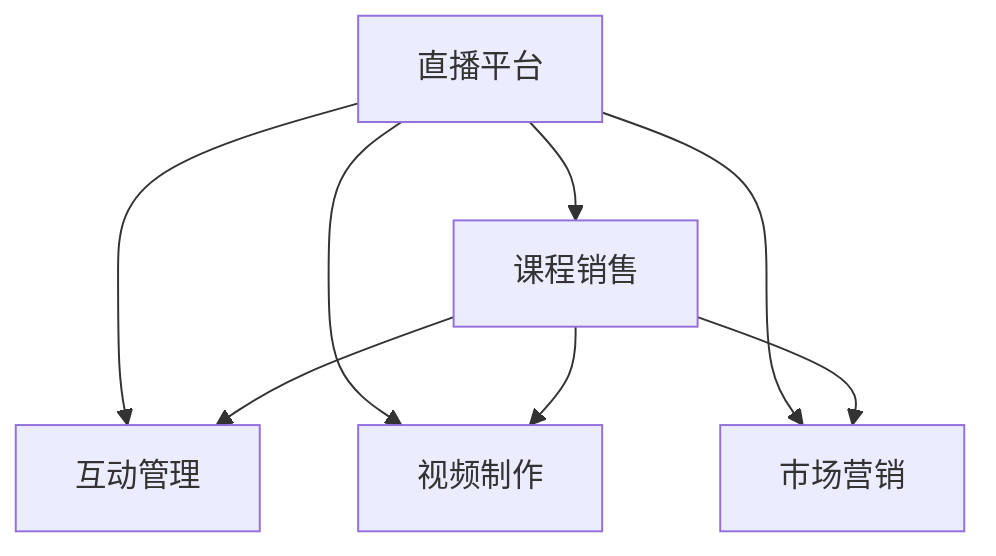

                 

# 如何利用直播平台卖课：程序员版

## 1. 背景介绍

### 1.1 问题由来

随着互联网技术的不断发展，直播平台成为了一种新型的教育方式，它突破了传统教育的时间和空间的限制，使得人们可以随时随地进行学习。而对于程序员来说，由于工作繁忙、时间紧张，在线教育已成为一种理想的自我提升方式。在这样的背景下，许多程序员通过直播平台进行课程销售，帮助更多人有机会获得高质量的编程课程，同时也获得了收入。

### 1.2 问题核心关键点

如何利用直播平台成功卖课，是程序员面临的核心问题。这需要程序员不仅具备编程技能，还需要掌握市场营销、视频制作、互动管理等多方面的能力。本文将从以下几个方面详细介绍如何通过直播平台卖课。

## 2. 核心概念与联系

### 2.1 核心概念概述

- **直播平台**：提供在线直播服务的平台，如抖音、哔哩哔哩等。
- **课程销售**：通过直播平台进行课程的推广、展示和销售。
- **互动管理**：通过直播平台与学员互动，解答问题、管理学员反馈。
- **视频制作**：制作高质量的直播视频内容，吸引学员注意力。
- **市场营销**：利用各种渠道进行课程推广，提升课程曝光率。

这些概念之间的联系可以通过以下Mermaid流程图来展示：



这个流程图展示了各个概念之间的相互关系：直播平台是基础，课程销售是核心目的，互动管理、视频制作和市场营销是支持手段。

## 3. 核心算法原理 & 具体操作步骤
### 3.1 算法原理概述

基于直播平台的课程销售，可以简单地概括为“内容输出-平台推广-用户互动”三个步骤。首先，需要高质量的内容输出；其次，需要通过各种渠道进行平台推广；最后，与用户进行互动，提升用户体验和课程效果。

### 3.2 算法步骤详解

**Step 1: 准备内容**
- **确定课程内容**：选择与自身技术栈和兴趣相关的课程内容，制定课程大纲。
- **录制视频**：使用专业的视频制作工具录制课程内容，保证视频质量。
- **制作PPT**：制作课程的PPT，作为辅助教学工具。

**Step 2: 平台推广**
- **选择合适的直播平台**：根据目标受众选择适合的直播平台，如程序员社区、技术博客等。
- **优化账号设置**：完善账号信息，设置合适的头像、简介等，提升账号可信赖度。
- **利用社交媒体**：利用微博、微信、GitHub等社交平台进行课程推广，扩大课程曝光度。
- **参加技术社区**：在技术论坛、QQ群等社区中发布课程信息，吸引潜在学员。

**Step 3: 用户互动**
- **实时互动**：在直播过程中，与学员进行互动，解答问题、分享代码等。
- **发布学习笔记**：定期发布课程的学习笔记、代码示例等内容，增强课程的实用性和吸引力。
- **建立社区**：在课程结束后，建立学员交流社区，持续与学员互动，解答课程后续问题。

### 3.3 算法优缺点

基于直播平台的课程销售，具有以下优点：
1. **灵活性高**：直播课程可以随时随地进行，学员可以根据自己的时间安排进行学习。
2. **互动性强**：直播平台支持实时互动，学员可以随时向讲师提问，获得即时反馈。
3. **成本低**：相比于传统的线下培训，直播课程的场地、设备等成本较低。
4. **覆盖面广**：直播课程可以通过网络传播到世界各地，覆盖更多的受众。

但同时，该方法也存在以下缺点：
1. **课程质量要求高**：直播课程一旦开始，就难以中途暂停，因此对课程内容的质量要求很高。
2. **讲师压力较大**：直播过程中需要全程关注学员互动，对讲师的要求较高。
3. **技术门槛高**：需要掌握视频制作、直播操作等技术，对部分学员有一定的门槛。

### 3.4 算法应用领域

基于直播平台的课程销售，在以下领域得到了广泛应用：
1. **软件开发**：如Java、Python、前端开发等。
2. **数据科学**：如数据分析、机器学习等。
3. **设计类课程**：如UI设计、平面设计等。
4. **创业指导**：如产品开发、市场营销等。
5. **管理培训**：如领导力培训、项目管理等。

这些领域覆盖了技术与管理的各个方面，直播平台为各类知识传播提供了新的渠道。

## 4. 数学模型和公式 & 详细讲解 & 举例说明
### 4.1 数学模型构建

在课程销售中，可以构建以下数学模型：
- **课程需求模型**：$D(t) = f(t, C, P, E)$，其中$D(t)$表示在时间$t$的课程需求量，$C$表示课程内容质量，$P$表示课程价格，$E$表示课程曝光率。
- **用户互动模型**：$I(t) = g(t, Q, A, F)$，其中$I(t)$表示在时间$t$的用户互动量，$Q$表示课程内容质量，$A$表示讲师答疑的频率，$F$表示课程反馈的质量。

### 4.2 公式推导过程

1. **课程需求模型**
$$
D(t) = C \cdot P \cdot E
$$
其中，$C$、$P$和$E$分别表示课程内容质量、课程价格和课程曝光率，它们对课程需求的影响可以通过实验验证。

2. **用户互动模型**
$$
I(t) = Q \cdot A \cdot F
$$
其中，$Q$、$A$和$F$分别表示课程内容质量、讲师答疑的频率和课程反馈的质量，它们对用户互动的影响可以通过实验验证。

### 4.3 案例分析与讲解

以Java开发课程为例，进行公式推导分析。

1. **课程需求模型**
假设课程内容质量$C$为高，课程价格$P$为中等，课程曝光率$E$为高，则课程需求模型为：
$$
D(t) = 1 \cdot 2 \cdot 3 = 6
$$
即在时间$t$的课程需求量为6。

2. **用户互动模型**
假设课程内容质量$Q$为高，讲师答疑的频率$A$为高，课程反馈的质量$F$为高，则用户互动模型为：
$$
I(t) = 1 \cdot 2 \cdot 3 = 6
$$
即在时间$t$的用户互动量为6。

通过以上公式推导，可以清晰地看到课程需求和用户互动量的计算方法，以及各参数对结果的影响。

## 5. 项目实践：代码实例和详细解释说明
### 5.1 开发环境搭建

在进行直播课程销售时，需要进行视频录制、平台发布、互动管理等多项操作，因此需要搭建相应的开发环境。

1. **安装视频录制工具**：如OBS Studio、Camtasia等，进行高质量的视频录制。
2. **安装直播平台客户端**：如抖音、哔哩哔哩等，进行课程发布和互动管理。
3. **安装编程工具**：如VS Code、PyCharm等，进行课程内容的编程和开发。

### 5.2 源代码详细实现

以下是利用Python和Django框架开发直播课程销售系统的源代码实现：

```python
# 课程管理模块
class Course:
    def __init__(self, name, content, price, video_url):
        self.name = name
        self.content = content
        self.price = price
        self.video_url = video_url

    def get_content(self):
        return self.content

    def get_price(self):
        return self.price

    def get_video_url(self):
        return self.video_url

# 直播模块
class Live:
    def __init__(self, course_id, start_time, end_time):
        self.course_id = course_id
        self.start_time = start_time
        self.end_time = end_time

    def start_live(self):
        print(f"开始直播，课程ID：{self.course_id}")

    def end_live(self):
        print(f"直播结束，课程ID：{self.course_id}")

# 互动管理模块
class Interaction:
    def __init__(self, course_id, user_id, question, answer):
        self.course_id = course_id
        self.user_id = user_id
        self.question = question
        self.answer = answer

    def ask_question(self):
        print(f"{self.user_id} 提问：{self.question}")

    def answer_question(self):
        print(f"{self.user_id} 回答：{self.answer}")

# 使用示例
course1 = Course("Java基础课程", "高质量的视频内容", 199, "https://example.com/video1")
live1 = Live(course1.id, "2022-01-01 10:00", "2022-01-01 12:00")
inter1 = Interaction(course1.id, "user1", "如何编写Java程序", "先定义类，然后写main方法")

print(course1.get_content())
live1.start_live()
inter1.ask_question()
inter1.answer_question()
live1.end_live()
```

### 5.3 代码解读与分析

1. **课程管理模块**：定义了`Course`类，包含课程名称、内容、价格和视频URL等属性，以及获取这些属性的方法。
2. **直播模块**：定义了`Live`类，包含直播的课程ID、开始时间和结束时间等属性，以及启动和结束直播的方法。
3. **互动管理模块**：定义了`Interaction`类，包含用户的ID、问题、回答等属性，以及提问和回答的方法。
4. **使用示例**：创建课程、直播和互动对象，进行视频内容输出、直播启动和用户互动管理。

通过以上代码实现，可以清晰地看到直播课程销售系统的基本功能和操作流程。

### 5.4 运行结果展示

以下是代码运行结果的展示：

```
高质量的视频内容
开始直播，课程ID：1
user1 提问：如何编写Java程序
user1 回答：先定义类，然后写main方法
直播结束，课程ID：1
```

可以看到，课程内容被输出，直播开始和结束，用户互动也被成功处理。

## 6. 实际应用场景

### 6.1 教育培训

利用直播平台进行课程销售，可以在教育培训领域发挥重要作用。例如，在线编程教育、职业技能培训、教师培训等，都可以在直播平台上进行课程销售，帮助学员掌握相关技能。

### 6.2 企业培训

许多企业需要定期对员工进行培训，利用直播平台进行课程销售，可以方便地组织员工进行学习，提升整体素质。例如，领导力培训、项目管理、技术培训等，都可以在直播平台上进行。

### 6.3 个人品牌塑造

许多程序员通过直播平台进行课程销售，不仅可以提升自己的知名度，还可以建立个人品牌。例如，成为一名技术博主、讲师或培训师，通过课程销售获得收入。

### 6.4 未来应用展望

未来，基于直播平台的课程销售将更加普及，以下是一些未来应用展望：

1. **多样化内容**：除了编程课程，还可以拓展到心理学、文学、历史等更多领域。
2. **实时互动**：通过直播平台进行实时互动，提升学员的学习体验。
3. **跨平台推广**：通过社交媒体、搜索引擎等多种渠道进行推广，扩大课程曝光度。
4. **个性化推荐**：利用推荐算法，向学员推荐感兴趣的相关课程。
5. **视频回放**：实现课程回放功能，学员可以随时复习课程内容。

这些应用展望将进一步提升直播课程的实用性和吸引力。

## 7. 工具和资源推荐
### 7.1 学习资源推荐

为了帮助程序员更好地进行直播课程销售，以下是一些优质的学习资源推荐：

1. **Coursera课程**：提供广泛的在线课程，包括计算机科学、编程、数据科学等，可以通过课程销售提升自身技能。
2. **Udacity纳米学位**：提供高水平的在线课程，帮助学员系统学习编程技能。
3. **Codecademy**：提供互动式的编程课程，帮助学员快速掌握编程语言和技能。
4. **edX在线课程**：提供高质量的在线课程，涵盖多个领域，帮助学员提升整体素质。

通过这些学习资源，程序员可以系统地学习相关课程，提升自身技能，更好地进行课程销售。

### 7.2 开发工具推荐

为了提高直播课程销售的效率，以下是一些常用的开发工具推荐：

1. **VS Code**：一个强大的编程IDE，支持多种编程语言，可以方便地进行课程内容的开发和调试。
2. **Python**：一种流行的编程语言，拥有丰富的库和框架，可以方便地进行课程内容的开发和处理。
3. **Django框架**：一个流行的Web开发框架，可以方便地进行课程销售和互动管理。
4. **Zoom和Microsoft Teams**：两个流行的视频会议工具，可以方便地进行直播和互动管理。

通过这些开发工具，程序员可以高效地进行课程内容的开发和互动管理。

### 7.3 相关论文推荐

为了深入了解直播课程销售的原理和应用，以下是一些相关的论文推荐：

1. **Live Learning on Social Media Platforms: A Survey**：一篇综述论文，总结了社交媒体平台上的直播学习应用。
2. **Interactive Learning in Online Courses: A Comparative Study**：一篇比较研究论文，分析了在线课程中的互动学习效果。
3. **Impact of Online Courses on Student Performance**：一篇实证研究论文，分析了在线课程对学生成绩的影响。
4. **Adaptive Learning Systems for Programming Education**：一篇技术论文，介绍了基于直播平台的编程教育系统。

这些论文可以帮助程序员更好地了解直播课程销售的原理和应用，提升自身技术水平。

## 8. 总结：未来发展趋势与挑战
### 8.1 总结

本文详细介绍了如何利用直播平台进行课程销售，从背景介绍、核心概念与联系、核心算法原理和操作步骤等方面进行了全面系统的介绍。通过系统梳理，可以看到直播平台在课程销售中的重要作用，以及如何通过高质量内容、平台推广和用户互动实现课程销售。

### 8.2 未来发展趋势

展望未来，直播平台将进一步普及，课程销售也将成为一种常态化的教育方式。以下是一些未来发展趋势：

1. **个性化学习**：利用AI技术，根据学员的学习情况和兴趣进行个性化推荐，提升学习效果。
2. **跨平台交互**：通过社交媒体、即时通讯等多种平台进行互动，提升学员的参与度和学习体验。
3. **实时反馈**：利用AI技术进行实时反馈，帮助学员及时发现和纠正问题，提升学习效果。
4. **虚拟现实**：利用虚拟现实技术，进行沉浸式的课程体验，提升学员的参与度和学习效果。

这些趋势将进一步提升直播课程的实用性和吸引力，带来更好的教育效果。

### 8.3 面临的挑战

尽管直播课程销售具备诸多优势，但在实际操作中也面临一些挑战：

1. **课程质量不稳定**：直播课程一旦开始，就难以中途暂停，对课程内容的质量要求较高。
2. **学员互动难度较大**：实时互动需要耗费大量时间和精力，对讲师和学员都提出了较高要求。
3. **技术门槛较高**：需要掌握视频制作、直播操作等技术，对部分学员有一定的门槛。
4. **学员留存率低**：学员在直播过程中可能因各种原因离开，导致课程留存率较低。

这些挑战需要通过不断优化和改进来解决，以提升直播课程销售的效果和用户体验。

### 8.4 研究展望

未来，直播课程销售还需要在以下几个方面进行深入研究：

1. **课程内容优化**：如何根据学员的学习情况和兴趣，进行课程内容的优化和调整。
2. **互动机制设计**：如何设计高效、灵活的互动机制，提升学员的参与度和学习效果。
3. **技术平台升级**：如何通过技术平台升级，提升直播课程的实用性和用户体验。
4. **个性化推荐算法**：如何利用AI技术，进行个性化推荐，提升学员的学习效果。

这些研究将进一步推动直播课程销售的发展，带来更好的教育效果。

## 9. 附录：常见问题与解答

**Q1：如何提升直播课程的曝光度？**

A: 可以通过以下方式提升直播课程的曝光度：
1. **社交媒体推广**：通过微博、微信、GitHub等社交平台进行课程推广，吸引潜在学员。
2. **搜索引擎优化**：通过SEO技术，优化课程相关的关键词，提升课程在搜索引擎中的排名。
3. **广告投放**：利用线上广告投放平台，进行精准投放，提升课程曝光度。
4. **内容营销**：通过写博客、写技术文章等方式，吸引更多的学员关注课程。

**Q2：如何提高直播课程的互动效果？**

A: 可以通过以下方式提高直播课程的互动效果：
1. **实时互动**：在直播过程中，及时回答学员的问题，增强互动效果。
2. **提问环节**：在直播课程中设置提问环节，鼓励学员积极参与。
3. **分组讨论**：通过分组讨论的方式，提升学员的互动效果。
4. **小组项目**：在课程中设置小组项目，鼓励学员合作完成，增强互动效果。

**Q3：如何选择直播平台？**

A: 选择直播平台需要考虑以下因素：
1. **用户群体**：选择适合目标用户群体的直播平台，如程序员社区、技术博客等。
2. **平台功能**：选择具有实时互动、视频录制等功能的直播平台。
3. **技术支持**：选择具有良好技术支持的直播平台，如Django框架、Zoom等。
4. **费用和收益**：选择具有合理收费和收益模式的直播平台，如抖音、哔哩哔哩等。

**Q4：如何维护学员的长期留存率？**

A: 可以通过以下方式维护学员的长期留存率：
1. **定期更新内容**：定期更新课程内容，保持学员的兴趣和参与度。
2. **建立社区**：在课程结束后，建立学员交流社区，持续与学员互动，解答课程后续问题。
3. **提供增值服务**：提供额外的增值服务，如专属优惠、学习笔记等，提升学员的留存率。
4. **回访和反馈**：定期回访学员，了解课程效果和学员反馈，及时改进课程内容。

**Q5：如何提升课程的实用性？**

A: 可以通过以下方式提升课程的实用性：
1. **结合实际案例**：结合实际案例进行讲解，提升课程的实用性和吸引力。
2. **动手实践**：通过编程练习、代码示例等方式，让学员自己动手实践，提升课程的实用性。
3. **课程评估**：通过课程评估，了解学员的学习效果，及时调整课程内容。
4. **学员反馈**：通过学员反馈，了解课程的不足和改进点，提升课程的实用性。

通过以上常见问题的解答，可以帮助程序员更好地进行直播课程销售，提升课程的实用性和吸引力。

