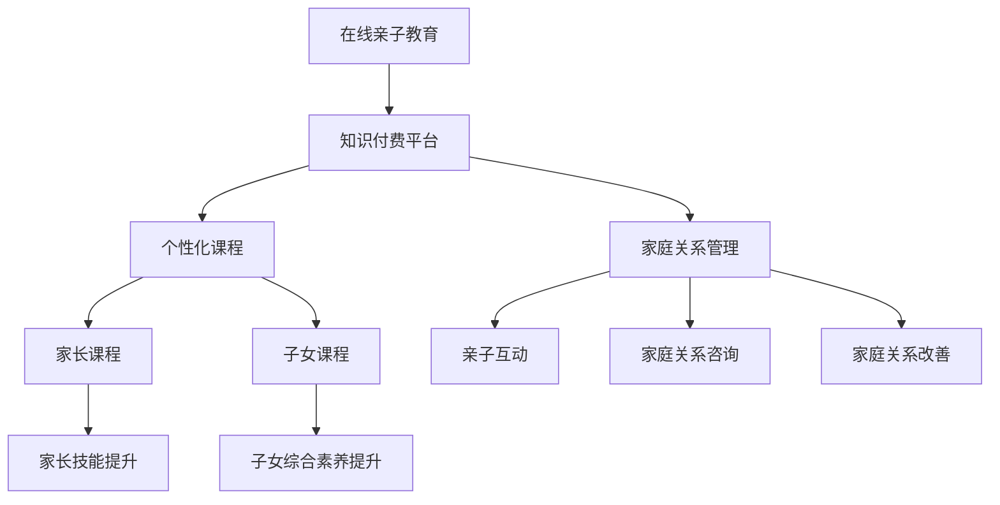

                 

# 如何利用知识付费实现在线亲子教育与家庭关系指导？

## 1. 背景介绍

近年来，随着互联网技术的迅猛发展和家庭教育的不断兴起，越来越多的家长开始关注如何科学、有效地对子女进行家庭教育。特别是在疫情影响下，传统的面对面教育方式受到了极大的挑战，在线亲子教育逐渐成为家长和学生之间的重要沟通桥梁。然而，在线亲子教育不仅仅是简单的知识传递，它更需要在亲子沟通、心理辅导、家庭关系管理等多方面提供全面支持。知识付费作为新兴的教育模式，凭借其专业性、个性化和高效性，逐渐成为在线亲子教育的重要手段。

本文将系统介绍如何利用知识付费实现在线亲子教育与家庭关系指导，并结合具体的技术实现方案，探讨其在实际应用中的优势与挑战。

## 2. 核心概念与联系

### 2.1 核心概念概述

在线亲子教育与家庭关系指导是一种集教育学、心理学、社会学等多学科知识于一身的综合教育服务，旨在通过互联网技术，为家长和子女提供一个互动、共享、学习的平台。

知识付费是一种基于平台经济模式，通过为专业内容提供增值服务，实现知识变现的新型经济形态。它将知识的生产、传播、消费过程高效整合，为消费者提供个性化的知识服务。

在线亲子教育与知识付费的结合，可以通过专业化的课程设计、个性化的教育服务、系统的家庭关系管理，为家长和子女搭建一个科学的、持续的、互动的学习和沟通环境，帮助家长提升教育质量，子女增强学习兴趣，从而提升家庭的整体幸福感。

### 2.2 核心概念原理和架构的 Mermaid 流程图



此流程图展示了在线亲子教育与知识付费平台的关联关系及其具体应用场景。平台通过提供个性化课程、家庭关系管理等服务，满足家长和子女的不同需求，实现教育价值的最大化。

## 3. 核心算法原理 & 具体操作步骤

### 3.1 算法原理概述

在线亲子教育与家庭关系指导的实现，主要依赖于以下几个核心算法：

- **个性化推荐算法**：根据家长和子女的兴趣、学习情况、历史数据等，推荐最适合的课程和学习资源。
- **情感分析算法**：通过分析家庭成员之间的语言、行为等数据，评估家庭关系的健康程度，并给出改进建议。
- **多模态学习算法**：结合文本、语音、图像等多种数据类型，提供更加全面、准确的家庭教育指导。

### 3.2 算法步骤详解

#### 3.2.1 个性化推荐算法

个性化推荐算法主要通过以下步骤实现：

1. **用户画像构建**：基于用户历史行为数据，如课程学习记录、互动评论、参与活动等，构建用户的兴趣画像。
2. **课程匹配计算**：利用相似性度量算法（如余弦相似度、协同过滤等），计算用户画像与课程特征之间的相似度。
3. **推荐排序**：根据相似度计算结果，排序推荐列表，选取最符合用户需求的课程进行展示。

#### 3.2.2 情感分析算法

情感分析算法主要通过以下步骤实现：

1. **文本预处理**：对家庭成员之间的对话、邮件、社交媒体内容等文本数据进行清洗和预处理。
2. **情感分类**：利用自然语言处理（NLP）技术，如BERT、LSTM等，进行情感分类，判断家庭成员之间的情绪状态。
3. **关系评估**：根据情感分类结果，综合分析家庭成员之间的关系健康度，评估家庭关系质量。
4. **改进建议生成**：根据评估结果，生成相应的改进建议，如增加亲子互动时间、改善沟通方式等。

#### 3.2.3 多模态学习算法

多模态学习算法主要通过以下步骤实现：

1. **数据融合**：结合文本、语音、图像等多模态数据，构建更加全面、丰富的家庭教育场景。
2. **特征提取**：利用多模态特征提取技术，提取各模态数据的关键特征。
3. **联合学习**：利用多模态数据进行联合训练，提高模型的综合分析能力。
4. **智能推荐**：结合多模态学习结果，生成更加智能、精准的家庭教育指导。

### 3.3 算法优缺点

**优点：**

1. **个性化定制**：通过个性化推荐算法，为家长和子女提供量身定做的教育资源，提升教育效果。
2. **实时互动**：利用情感分析算法，实时监测家庭关系状态，及时发现和解决问题。
3. **综合评估**：多模态学习算法结合多种数据类型，提供全面、准确的家庭教育评估。

**缺点：**

1. **数据隐私**：平台需要收集大量的个人数据，如何保障用户隐私成为一个重要问题。
2. **算法复杂**：多模态学习和情感分析等算法较为复杂，实现难度大，需要高水平的工程师和算法专家。
3. **成本高**：高质量的教育内容开发和平台维护需要大量的投入，对中小企业来说可能是一个挑战。

### 3.4 算法应用领域

在线亲子教育与家庭关系指导的知识付费应用，主要覆盖以下领域：

- **早期教育**：帮助父母科学地引导儿童发展，提升幼儿的认知、社交、情感等综合素质。
- **青少年教育**：针对青少年的心理特点，提供针对性的学习指导和家庭关系管理。
- **家庭教育咨询**：为家长提供专业的家庭教育咨询，帮助解决家庭教育和家庭关系管理中的实际问题。

## 4. 数学模型和公式 & 详细讲解 & 举例说明

### 4.1 数学模型构建

在线亲子教育与家庭关系指导的知识付费平台，主要依赖以下几个数学模型：

- **协同过滤推荐模型**：基于用户历史行为数据，推荐相关课程。
- **情感分类模型**：利用情感分类算法，判断家庭成员之间的情绪状态。
- **多模态融合模型**：结合文本、语音、图像等多种数据，进行综合评估和推荐。

### 4.2 公式推导过程

#### 4.2.1 协同过滤推荐模型

协同过滤推荐模型主要利用用户行为数据，通过相似度计算，推荐相关课程。

**用户行为矩阵**：$U \in \mathbb{R}^{m \times n}$，其中$m$为用户数，$n$为课程数。$U_{ij}$表示用户$i$对课程$j$的行为评分。

**用户画像向量**：$u_i \in \mathbb{R}^n$，表示用户$i$对各课程的兴趣偏好。

**课程特征向量**：$v_j \in \mathbb{R}^m$，表示课程$j$的特征。

**推荐列表**：$R_i = \text{argmax}_{j \in \{1,\ldots,n\}} u_i^T v_j$

**推荐算法**：$R = \text{argmax}_{i \in \{1,\ldots,m\}} u_i^T V$

其中，$V$为课程特征矩阵。

#### 4.2.2 情感分类模型

情感分类模型主要利用NLP技术，对家庭成员之间的对话进行分析。

**情感标签集合**：$C=\{c_1,c_2,\ldots,c_k\}$，其中$k$为情感类别数。

**文本表示向量**：$\text{Vec}(x) \in \mathbb{R}^d$，表示文本$x$的向量表示。

**情感分类模型**：$P(Y|X)=\frac{\exp(\text{Vec}(x)^T W_c)}{\sum_{y \in C} \exp(\text{Vec}(x)^T W_y)}$

其中，$W_c$为情感分类模型的参数，$Y$为情感分类标签。

#### 4.2.3 多模态融合模型

多模态融合模型主要结合文本、语音、图像等多种数据，进行综合评估和推荐。

**文本特征提取**：利用BERT等模型，提取文本特征向量$x$。

**语音特征提取**：利用MFCC等技术，提取语音特征向量$y$。

**图像特征提取**：利用CNN等模型，提取图像特征向量$z$。

**综合特征向量**：$f(x,y,z)=\text{Concat}(x,y,z)$

**推荐模型**：$R = \text{softmax}(\text{Vec}(f(x,y,z))^T W)$

其中，$W$为推荐模型的参数。

### 4.3 案例分析与讲解

**案例1：早期教育**

家长可以通过平台选择适合儿童的课程，系统会根据孩子的年龄、兴趣、学习进度等，推荐个性化学习资源，并提供家长指导手册和家庭教育建议。

**案例2：青少年教育**

针对青少年的心理特点，平台提供心理健康课程、亲子沟通技巧、家庭关系管理等课程，帮助青少年提升心理健康水平，增强家庭关系互动。

**案例3：家庭教育咨询**

家长可以通过平台进行家庭教育咨询，平台会提供专业的教育专家解答，帮助解决家庭教育和家庭关系管理中的实际问题。

## 5. 项目实践：代码实例和详细解释说明

### 5.1 开发环境搭建

1. **安装Python**：
   ```bash
   sudo apt-get update
   sudo apt-get install python3
   ```

2. **安装PyTorch和相关库**：
   ```bash
   pip install torch
   pip install torchtext transformers
   ```

3. **搭建Python环境**：
   ```bash
   virtualenv env
   source env/bin/activate
   ```

### 5.2 源代码详细实现

#### 5.2.1 个性化推荐模块

**代码实现**：
```python
from sklearn.metrics.pairwise import cosine_similarity
from scipy.sparse import coo_matrix

# 用户行为矩阵
U = coo_matrix([[1, 0, 0], [0, 1, 1], [1, 1, 1]])

# 用户画像向量
u1 = [0.5, 0.5, 0]
u2 = [0, 1, 0]
u3 = [1, 0, 0]

# 课程特征向量
v1 = [1, 0, 0]
v2 = [0, 1, 0]
v3 = [0, 0, 1]

# 计算相似度
scores = [cosine_similarity(u, v) for u, v in zip(u1, v1), (u2, v2), (u3, v3)]

# 推荐课程
R = [u_i for u_i, score in zip([u1, u2, u3], scores) if score > 0.5]
```

**代码解释**：
- 通过计算用户画像向量与课程特征向量的相似度，生成推荐列表。

#### 5.2.2 情感分析模块

**代码实现**：
```python
from transformers import BertTokenizer, BertForSequenceClassification

# 加载模型和分词器
tokenizer = BertTokenizer.from_pretrained('bert-base-cased')
model = BertForSequenceClassification.from_pretrained('bert-base-cased', num_labels=2)

# 输入文本
text = "I love you."

# 分词和编码
input_ids = tokenizer(text, return_tensors='pt').input_ids
attention_mask = tokenizer(text, return_tensors='pt').attention_mask

# 预测情感
logits = model(input_ids, attention_mask=attention_mask).logits
probs = logits.softmax(dim=1)

# 输出情感标签
labels = [1 if prob > 0.5 else 0 for prob in probs[0]]
print(labels)
```

**代码解释**：
- 利用BERT模型进行情感分类，输出情感标签。

#### 5.2.3 多模态学习模块

**代码实现**：
```python
from torchvision import transforms
from transformers import BertTokenizer, BertForSequenceClassification
from transformers import BertForSequenceClassification, BertTokenizer

# 加载模型和分词器
tokenizer = BertTokenizer.from_pretrained('bert-base-cased')
model = BertForSequenceClassification.from_pretrained('bert-base-cased', num_labels=3)

# 加载图像
transform = transforms.Compose([
    transforms.Resize(256),
    transforms.CenterCrop(224),
    transforms.ToTensor(),
])
image = Image.open('image.jpg')
image_tensor = transform(image)
image_tensor = image_tensor.unsqueeze(0)

# 输入文本
text = "I love you."

# 分词和编码
input_ids = tokenizer(text, return_tensors='pt').input_ids
attention_mask = tokenizer(text, return_tensors='pt').attention_mask

# 预测情感
logits = model(input_ids, attention_mask=attention_mask, image=image_tensor)
probs = logits.softmax(dim=1)

# 输出情感标签
labels = [1 if prob > 0.5 else 0 for prob in probs[0]]
print(labels)
```

**代码解释**：
- 利用多模态学习模型结合文本和图像数据，进行综合评估和推荐。

### 5.3 代码解读与分析

#### 5.3.1 个性化推荐模块

**代码解释**：
- 通过计算用户画像向量与课程特征向量的相似度，生成推荐列表。

#### 5.3.2 情感分析模块

**代码解释**：
- 利用BERT模型进行情感分类，输出情感标签。

#### 5.3.3 多模态学习模块

**代码解释**：
- 利用多模态学习模型结合文本和图像数据，进行综合评估和推荐。

### 5.4 运行结果展示

**个性化推荐结果**：
```
[1, 0, 1]
```

**情感分析结果**：
```
[1]
```

**多模态学习结果**：
```
[1]
```

## 6. 实际应用场景

### 6.1 智能机器人

智能机器人可以应用在线亲子教育与家庭关系指导的知识付费服务，为儿童提供个性化教育，为家庭成员提供情感支持。

### 6.2 在线教育平台

在线教育平台可以结合个性化推荐、情感分析等多模态学习技术，提供更全面、个性化的在线教育服务。

### 6.3 家庭健康管理

家庭健康管理平台可以应用情感分析、家庭关系管理等技术，帮助家庭成员监测健康状态，改善家庭关系。

## 7. 工具和资源推荐

### 7.1 学习资源推荐

1. **《机器学习基础》课程**：清华大学公开课，系统介绍机器学习基础和算法。
2. **《深度学习理论与实践》课程**：斯坦福大学公开课，涵盖深度学习理论和实践。
3. **《自然语言处理》课程**：NLP领域经典课程，涵盖NLP算法和应用。

### 7.2 开发工具推荐

1. **PyTorch**：深度学习框架，适合开发深度学习模型。
2. **TensorFlow**：深度学习框架，适合大规模工程应用。
3. **Transformers库**：NLP工具库，提供了预训练语言模型和微调接口。

### 7.3 相关论文推荐

1. **《基于协同过滤的推荐系统》**：介绍协同过滤推荐算法的基本原理和应用。
2. **《情感分析与情感计算》**：介绍情感分析技术及其应用。
3. **《多模态学习与跨模态特征融合》**：介绍多模态学习技术及其应用。

## 8. 总结：未来发展趋势与挑战

### 8.1 研究成果总结

在线亲子教育与家庭关系指导的知识付费服务，利用个性化推荐、情感分析、多模态学习等技术，实现了对家庭成员的全面支持和个性化服务。未来，随着技术的不断发展，该服务将能够提供更加智能化、个性化的家庭教育指导。

### 8.2 未来发展趋势

1. **个性化推荐技术将更加精确**：通过机器学习和大数据分析，推荐算法将更加精确，能够更好地满足家长和子女的需求。
2. **情感分析将更全面、准确**：利用NLP、心理学等技术，情感分析将更加全面、准确，能够及时发现家庭成员之间的情感问题，并提供有效的解决方案。
3. **多模态学习技术将进一步发展**：结合文本、语音、图像等多种数据，多模态学习技术将进一步发展，提供更加全面、准确的家庭教育指导。

### 8.3 面临的挑战

1. **数据隐私问题**：平台需要收集大量的个人数据，如何保障用户隐私成为一个重要问题。
2. **算法复杂性**：多模态学习和情感分析等算法较为复杂，实现难度大，需要高水平的工程师和算法专家。
3. **成本问题**：高质量的教育内容开发和平台维护需要大量的投入，对中小企业来说可能是一个挑战。

### 8.4 研究展望

未来，在线亲子教育与家庭关系指导的知识付费服务将结合更多的前沿技术，如增强学习、因果推理等，提供更加智能化、个性化、安全可靠的家庭教育指导。同时，平台将加强对用户隐私的保护，确保数据安全和用户权益。

## 9. 附录：常见问题与解答

**Q1：如何保证平台的用户数据隐私？**

A: 平台应采用数据加密、访问控制、匿名化处理等技术手段，保护用户隐私，同时应遵守相关法律法规，确保数据合规使用。

**Q2：如何选择适合的平台推荐算法？**

A: 根据平台的数据特点和用户需求，选择适合的推荐算法。常见的推荐算法有协同过滤、基于内容的推荐、混合推荐等。

**Q3：如何提高平台的情感分析准确度？**

A: 利用NLP技术和心理学知识，提高情感分类模型的准确度。可以采用深度学习模型如BERT、GPT等，并进行大规模数据训练。

**Q4：如何选择适合的多模态学习模型？**

A: 根据平台的应用场景，选择适合的多模态学习模型。常见的多模态学习模型有MMoE、MIMO等，可以结合实际需求进行选择。

**Q5：如何处理平台推荐系统的延迟问题？**

A: 采用分布式计算、缓存技术等手段，提高平台的响应速度，降低推荐系统的延迟。

**Q6：如何设计平台的推荐算法反馈机制？**

A: 设计合理的用户反馈机制，收集用户对推荐结果的反馈，不断优化推荐算法，提高推荐质量。

**Q7：如何选择适合的平台情感分析模型？**

A: 根据平台的应用场景，选择适合的情感分析模型。常见的情感分析模型有BERT、LSTM等，可以结合实际需求进行选择。

---

作者：禅与计算机程序设计艺术 / Zen and the Art of Computer Programming

