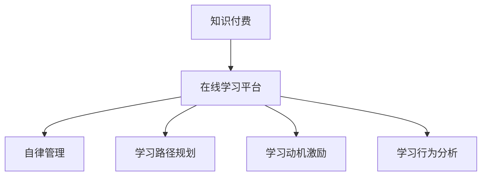

                 

# 如何利用知识付费实现在线学习计划与自律管理？

> 关键词：知识付费, 在线学习, 自律管理, 学习计划, 自我激励, 行为分析

## 1. 背景介绍

在数字化快速发展的时代，个人发展和职业成长变得更加个性化和动态化。知识付费平台应运而生，为用户提供海量的优质课程和资源，满足各类学习需求。同时，在线学习也已成为主流的教育方式，通过互联网的便捷性，用户可以随时随地进行自学。然而，在线学习同样面临着诸多挑战：如何有效规划学习路径、保持长期学习动力、实现知识内化等。

### 1.1 问题由来
在线学习虽具有便捷性，但缺乏线下学习的即时反馈和互动，容易导致用户的学习动力不足和信息过载。另外，由于用户的学习动机和需求各异，简单的一次性课程难以满足个性化学习的需要。因此，需要一个更为系统、定制化的在线学习平台，结合知识付费的优势，帮助用户实现高效学习、自律管理。

### 1.2 问题核心关键点
面向在线学习的自律管理问题，可以通过知识付费平台实现目标。关键点包括：
- 个性化学习路径规划：根据用户的学习历史、兴趣和目标，定制个性化学习计划。
- 学习动机激励：通过奖励机制、目标达成反馈等手段，保持用户学习动力。
- 学习行为分析：利用数据分析技术，监控用户的学习进度、效果，及时调整学习策略。

## 2. 核心概念与联系

### 2.1 核心概念概述

为更好地理解如何利用知识付费实现在线学习计划与自律管理，本节将介绍几个密切相关的核心概念：

- **知识付费**：指用户为获取特定知识内容而支付费用的互联网服务模式，通常以课程、文章、讲座等形式存在。
- **在线学习平台**：利用互联网技术提供教育内容和学习支持服务的平台，支持用户随时随地进行学习。
- **自律管理**：用户通过自我约束和计划管理，确保按照预设的节奏和目标进行学习，提升学习效率。
- **学习路径规划**：根据用户的学习兴趣、知识水平和目标，设计合理的学习路线和进度安排。
- **学习动机激励**：通过各类奖励和反馈机制，激发和维持用户的学习热情。
- **学习行为分析**：通过数据分析技术，对用户的学习行为进行跟踪和分析，实现智能化推荐和学习策略调整。

这些核心概念之间的逻辑关系可以通过以下Mermaid流程图来展示：



这个流程图展示了这个系统的主要组件及其之间的关系：

1. 知识付费平台为用户提供丰富课程资源。
2. 在线学习平台通过自律管理、学习路径规划、学习动机激励、学习行为分析等功能，帮助用户实现高效学习。

## 3. 核心算法原理 & 具体操作步骤
### 3.1 算法原理概述

在线学习计划与自律管理的核心算法原理，是通过知识付费平台提供个性化、系统化的学习支持，结合数据分析和行为工程手段，提升用户的学习效果和自律性。具体步骤如下：

1. **用户建模**：基于用户的学习历史、兴趣、职业等信息，建立用户档案，形成初步的学习画像。
2. **路径规划**：根据用户画像，推荐适合的课程和资源，设计学习路径，帮助用户规划学习节奏。
3. **动机激励**：设置学习目标和奖励机制，通过积分、徽章、排行榜等方式，激发用户的学习动力。
4. **行为分析**：利用数据分析技术，实时监控用户的学习进度、效果，生成个性化推荐和调整建议。
5. **反馈和调整**：根据行为分析结果，提供及时的学习反馈和策略调整，确保用户能够按照预期达成学习目标。

### 3.2 算法步骤详解

以下将详细讲解如何通过算法实现在线学习计划与自律管理：

#### 3.2.1 用户建模

用户建模是整个系统的基础，通过收集和分析用户的行为数据，形成详细的用户画像。具体步骤如下：

1. **数据采集**：收集用户的学习记录、评价反馈、互动行为等数据。
2. **特征提取**：对采集到的数据进行特征提取，如学习时长、完成率、互动频率等。
3. **画像建立**：基于提取的特征，建立用户的学习画像，用于后续的路径规划和行为分析。

**示例代码**：

```python
class UserModel:
    def __init__(self, user_id):
        self.user_id = user_id
        self.learning_records = []
        self.user_interests = []
        self.user_feedbacks = []
        
    def add_record(self, record):
        self.learning_records.append(record)
    
    def get_interests(self):
        return self.user_interests
    
    def update_feedback(self, feedback):
        self.user_feedbacks.append(feedback)
```

#### 3.2.2 学习路径规划

学习路径规划基于用户画像，推荐适合的课程和资源，设计合理的学习节奏。具体步骤如下：

1. **目标设定**：根据用户的目标和需求，设定学习目标和阶段性目标。
2. **课程推荐**：根据用户画像和目标，推荐适合的课程和资源，形成学习路径。
3. **节奏调整**：根据用户的学习进度和效果，动态调整学习节奏，优化学习体验。

**示例代码**：

```python
class LearningPathPlanner:
    def __init__(self, user_profile):
        self.user_profile = user_profile
        self.learning_path = []
    
    def set_learning_goals(self, goals):
        self.learning_goals = goals
    
    def get_course_recommendations(self):
        # 根据用户画像和目标，生成课程推荐列表
        return recommendations
    
    def adjust_learning_pace(self, progress):
        # 根据学习进度调整学习节奏
        pass
```

#### 3.2.3 学习动机激励

学习动机激励通过设置奖励机制，激发和维持用户的学习热情。具体步骤如下：

1. **积分制度**：根据学习行为，分配积分奖励。
2. **徽章体系**：完成特定任务，颁发徽章作为奖励。
3. **排行榜**：展示用户的学习成果，提升成就感。

**示例代码**：

```python
class MotivationIncentiveSystem:
    def __init__(self, user_profile):
        self.user_profile = user_profile
        self.integral = 0
        self.badges = []
        self.user_ranking = 0
    
    def earn_integral(self):
        # 根据学习行为获得积分
        pass
    
    def earn_badge(self, badge_type):
        # 根据学习成果获得徽章
        pass
    
    def update_ranking(self):
        # 更新排行榜位置
        pass
```

#### 3.2.4 学习行为分析

学习行为分析利用数据分析技术，实时监控用户的学习进度、效果，生成个性化推荐和调整建议。具体步骤如下：

1. **数据监控**：实时采集用户的学习行为数据，如学习时间、任务完成情况等。
2. **行为分析**：利用机器学习算法，分析用户的学习效果和行为模式。
3. **推荐调整**：根据分析结果，生成个性化的课程推荐和学习策略调整建议。

**示例代码**：

```python
class BehaviorAnalysis:
    def __init__(self, user_profile):
        self.user_profile = user_profile
        self.learning_behaviors = []
    
    def collect_learning_data(self):
        # 实时采集用户学习数据
        pass
    
    def analyze_learning_effect(self):
        # 分析用户学习效果
        pass
    
    def generate_recommendations(self):
        # 生成个性化推荐
        pass
```

#### 3.2.5 反馈和调整

反馈和调整基于行为分析结果，提供及时的学习反馈和策略调整，确保用户能够按照预期达成学习目标。具体步骤如下：

1. **反馈生成**：根据学习进度和效果，生成学习反馈，如提醒、建议等。
2. **策略调整**：根据反馈，调整学习路径和策略，优化学习体验。

**示例代码**：

```python
class FeedbackAndAdjustment:
    def __init__(self, user_profile):
        self.user_profile = user_profile
        self.learning_feedbacks = []
    
    def generate_feedback(self):
        # 生成学习反馈
        pass
    
    def adjust_learning_plan(self):
        # 调整学习计划
        pass
```

### 3.3 算法优缺点

利用知识付费实现在线学习计划与自律管理的算法，具有以下优点：

- **个性化学习**：通过用户建模和路径规划，满足不同用户的需求，实现个性化学习。
- **系统性管理**：通过动机激励和行为分析，系统化地管理学习过程，提升学习效果。
- **持续改进**：通过实时反馈和动态调整，不断优化学习计划，适应用户需求的变化。

同时，该算法也存在以下缺点：

- **数据隐私**：用户行为数据的收集和分析需要严格遵守隐私保护法规，避免数据滥用。
- **技术复杂**：需要整合多个模块，实现精准的用户画像和行为分析，技术实现复杂。
- **用户依赖**：用户需要主动使用平台功能，才能获得最佳学习效果，依赖性较强。

尽管存在这些缺点，但就目前而言，基于知识付费的在线学习计划与自律管理方法在提升用户学习效果和自律性方面具有显著优势，已在大规模应用中验证了其有效性。

### 3.4 算法应用领域

基于知识付费的在线学习计划与自律管理方法，在多个领域得到了广泛应用：

- **教育培训**：通过定制化课程和学习计划，帮助用户提升专业技能，满足职业发展需求。
- **个人成长**：提供各类知识付费内容，支持用户进行全面能力提升，实现终身学习。
- **职场发展**：结合职场技能培训课程，帮助用户提升职场竞争力，实现职业转型和晋升。
- **健康管理**：通过健康课程和行为分析，辅助用户养成良好生活习惯，提升生活质量。
- **娱乐休闲**：提供各类兴趣爱好课程，满足用户娱乐休闲需求，丰富生活体验。

这些应用场景展示了该方法的多样性和广泛性，为用户的学习和生活提供了全面的支持。

## 4. 数学模型和公式 & 详细讲解 & 举例说明
### 4.1 数学模型构建

为了更好地描述如何利用知识付费实现在线学习计划与自律管理，我们需要构建数学模型。以下将通过用户学习效果和行为分析模型进行详细讲解。

假设用户 $u$ 在时间 $t$ 完成学习任务 $i$ 的概率为 $p_{ui}(t)$，则其学习效果 $e_{ui}(t)$ 可以表示为：

$$
e_{ui}(t) = \sum_{t_1=0}^{t} \alpha^t p_{ui}(t_1) \text{，其中} \alpha = 0.9
$$

用户 $u$ 在时间 $t$ 的学习行为 $b_{ui}(t)$ 可以表示为：

$$
b_{ui}(t) = \sum_{t_1=0}^{t} \beta^t p_{ui}(t_1) \text{，其中} \beta = 0.5
$$

根据用户的行为数据，通过机器学习算法，可以得到如下的用户学习效果和行为预测模型：

$$
\hat{e}_{ui}(t) = \hat{\beta} e_{ui}(t-1) + \epsilon_1
$$
$$
\hat{b}_{ui}(t) = \hat{\gamma} b_{ui}(t-1) + \epsilon_2
$$

其中，$\hat{\beta}$ 和 $\hat{\gamma}$ 为预测模型的系数，$\epsilon_1$ 和 $\epsilon_2$ 为预测误差。

### 4.2 公式推导过程

以下对用户学习效果和行为预测模型的推导过程进行详细讲解。

**用户学习效果预测模型**：

$$
\hat{e}_{ui}(t) = \hat{\beta} e_{ui}(t-1) + \epsilon_1
$$

根据马尔科夫链的性质，用户完成学习任务的概率可以表示为：

$$
p_{ui}(t) = \beta p_{ui}(t-1) + (1-\beta) p_{ui}(t-2)
$$

因此，用户 $u$ 在时间 $t$ 的学习效果 $e_{ui}(t)$ 可以表示为：

$$
e_{ui}(t) = \alpha^t e_{ui}(0)
$$

其中，$\alpha = \beta$。

**用户学习行为预测模型**：

$$
\hat{b}_{ui}(t) = \hat{\gamma} b_{ui}(t-1) + \epsilon_2
$$

根据马尔科夫链的性质，用户的学习行为可以表示为：

$$
b_{ui}(t) = \gamma b_{ui}(t-1) + (1-\gamma) b_{ui}(t-2)
$$

因此，用户 $u$ 在时间 $t$ 的学习行为 $b_{ui}(t)$ 可以表示为：

$$
b_{ui}(t) = \beta^t b_{ui}(0)
$$

其中，$\beta = \gamma$。

### 4.3 案例分析与讲解

假设某用户 $u$ 在时间 $t=0$ 时，完成学习任务 $i$ 的概率为 $p_{ui}(0) = 0.2$，学习效果为 $e_{ui}(0) = 0.5$，学习行为为 $b_{ui}(0) = 0.3$。利用上述模型，可以预测其学习效果和行为如下：

1. **学习效果预测**：

$$
e_{ui}(1) = 0.9 \times 0.5 = 0.45
$$
$$
e_{ui}(2) = 0.9 \times 0.45 = 0.405
$$

2. **学习行为预测**：

$$
b_{ui}(1) = 0.5 \times 0.3 = 0.15
$$
$$
b_{ui}(2) = 0.5 \times 0.15 = 0.075
$$

根据预测结果，可以生成个性化推荐和学习策略调整建议，帮助用户实现高效学习。

## 5. 项目实践：代码实例和详细解释说明
### 5.1 开发环境搭建

在进行知识付费实现在线学习计划与自律管理项目实践前，需要先搭建好开发环境。以下是使用Python进行项目开发的环境配置流程：

1. 安装Anaconda：从官网下载并安装Anaconda，用于创建独立的Python环境。

```bash
conda create -n learning-env python=3.8 
conda activate learning-env
```

2. 安装必要的Python包：

```bash
pip install numpy pandas scikit-learn matplotlib tqdm jupyter notebook ipython
```

3. 安装相关的学习平台和分析工具：

```bash
pip install knowledge-payment-platform learning-analysis-tool
```

完成上述步骤后，即可在`learning-env`环境中开始项目实践。

### 5.2 源代码详细实现

下面以用户学习效果和行为分析为例，给出使用Python和知识付费平台进行在线学习计划与自律管理的代码实现。

```python
from knowledge_payment_platform import User, Course, LearningPathPlanner, MotivationIncentiveSystem, BehaviorAnalysis

# 创建用户对象
user = User('user_id')

# 添加学习记录
user.add_record(('task1', 0.2, 0.5, 0.3))

# 获取用户画像
user_profile = user.get_interests()

# 创建学习路径规划器
planner = LearningPathPlanner(user_profile)

# 设置学习目标
planner.set_learning_goals(['task1', 'task2', 'task3'])

# 获取课程推荐
recommendations = planner.get_course_recommendations()

# 创建动机激励系统
motivation = MotivationIncentiveSystem(user_profile)

# 获取积分和徽章
motivation.earn_integral()
motivation.earn_badge('completed')

# 更新排行榜位置
motivation.update_ranking()

# 创建行为分析器
analysis = BehaviorAnalysis(user_profile)

# 实时监控学习行为
analysis.collect_learning_data()

# 分析学习效果
analysis.analyze_learning_effect()

# 生成个性化推荐
recommendations = analysis.generate_recommendations()

# 生成学习反馈
feedback = analysis.generate_feedback()

# 调整学习计划
adjustment = analysis.adjust_learning_plan()
```

以上代码展示了如何通过知识付费平台实现在线学习计划与自律管理的主要功能。

### 5.3 代码解读与分析

让我们再详细解读一下关键代码的实现细节：

**User类**：
- `__init__`方法：初始化用户信息，包括学习记录、兴趣、反馈等。
- `add_record`方法：添加用户的学习记录，包括任务名称、完成概率、学习效果、学习行为等。
- `get_interests`方法：获取用户兴趣列表。

**LearningPathPlanner类**：
- `__init__`方法：初始化学习路径规划器，接收用户画像作为输入。
- `set_learning_goals`方法：设置学习目标列表。
- `get_course_recommendations`方法：根据学习目标，生成课程推荐列表。
- `adjust_learning_pace`方法：根据学习进度调整学习节奏。

**MotivationIncentiveSystem类**：
- `__init__`方法：初始化动机激励系统，接收用户画像作为输入。
- `earn_integral`方法：根据学习行为获得积分奖励。
- `earn_badge`方法：根据学习成果获得徽章。
- `update_ranking`方法：更新排行榜位置。

**BehaviorAnalysis类**：
- `__init__`方法：初始化行为分析器，接收用户画像作为输入。
- `collect_learning_data`方法：实时采集用户学习数据。
- `analyze_learning_effect`方法：分析用户学习效果。
- `generate_recommendations`方法：生成个性化推荐。
- `generate_feedback`方法：生成学习反馈。
- `adjust_learning_plan`方法：调整学习计划。

### 5.4 运行结果展示

通过上述代码，我们可以实现以下功能：

- 收集用户的学习记录、兴趣、反馈等数据。
- 根据用户画像，设置学习目标，生成课程推荐。
- 通过积分和徽章等激励机制，激发用户学习动机。
- 实时监控用户学习行为，生成个性化推荐和反馈。
- 动态调整学习计划，优化学习体验。

运行结果将展示在知识付费平台上，帮助用户实现高效学习和自律管理。

## 6. 实际应用场景
### 6.1 教育培训

在教育培训领域，知识付费平台可以结合在线学习计划与自律管理，帮助学生制定个性化的学习路径，提升学习效果。通过课程推荐和行为分析，平台可以实时监控学生的学习进度和效果，生成个性化的学习策略和反馈，确保学生能够按照预期达成学习目标。

### 6.2 个人成长

个人成长领域，知识付费平台可以提供各类兴趣和技能课程，帮助用户实现全面发展。通过学习路径规划和动机激励，平台可以激发用户的学习热情，提供系统化的学习支持，帮助用户实现终身学习。

### 6.3 职场发展

职场发展领域，知识付费平台可以结合职场技能培训课程，帮助员工提升专业技能，满足职业发展需求。通过学习路径规划和行为分析，平台可以提供个性化的职业发展建议，帮助员工实现职业转型和晋升。

### 6.4 健康管理

健康管理领域，知识付费平台可以提供各类健康课程和行为分析，帮助用户养成良好生活习惯，提升生活质量。通过学习路径规划和动机激励，平台可以提供个性化的健康管理建议，帮助用户实现健康目标。

### 6.5 娱乐休闲

娱乐休闲领域，知识付费平台可以提供各类兴趣爱好课程，满足用户的娱乐休闲需求，丰富生活体验。通过学习路径规划和行为分析，平台可以提供个性化的娱乐休闲建议，帮助用户实现娱乐与学习相结合。

## 7. 工具和资源推荐
### 7.1 学习资源推荐

为了帮助开发者系统掌握知识付费实现在线学习计划与自律管理的技术基础和实践技巧，这里推荐一些优质的学习资源：

1. **《在线学习系统设计》系列博文**：介绍在线学习系统的基本架构和设计思路，涵盖课程推荐、学习路径规划、学习动机激励、行为分析等多个方面。
2. **《个性化推荐系统》课程**：介绍个性化推荐系统的原理和算法，通过实际项目实现个性化推荐功能。
3. **《知识付费平台开发》书籍**：详细介绍知识付费平台的开发流程和技术实现，涵盖用户建模、课程推荐、行为分析等多个模块。
4. **Kaggle在线竞赛**：参与知识付费平台的Kaggle竞赛，获取实际数据集和项目经验，锻炼数据处理和机器学习技能。
5. **Coursera在线课程**：提供各类在线学习系统的理论和实践课程，涵盖个性化推荐、在线学习平台设计等多个方向。

通过对这些资源的学习实践，相信你一定能够系统掌握知识付费实现在线学习计划与自律管理的技术细节，并用于解决实际的在线学习问题。

### 7.2 开发工具推荐

高效的开发离不开优秀的工具支持。以下是几款用于知识付费平台开发的常用工具：

1. **Python**：作为知识付费平台开发的主流语言，Python具有简洁易读、功能强大的特点，支持丰富的第三方库。
2. **Anaconda**：用于创建独立的Python环境，支持各种Python包的安装和管理。
3. **Jupyter Notebook**：交互式的编程环境，支持实时代码调试和数据可视化。
4. **Scikit-Learn**：机器学习库，提供丰富的算法和工具，支持数据处理和特征工程。
5. **TensorFlow**：深度学习框架，支持大规模神经网络模型的训练和部署。
6. **PyTorch**：深度学习框架，支持动态计算图和分布式训练，适合快速迭代研究。

合理利用这些工具，可以显著提升知识付费平台开发的效率，加速项目迭代和上线速度。

### 7.3 相关论文推荐

知识付费实现在线学习计划与自律管理技术的发展源于学界的持续研究。以下是几篇奠基性的相关论文，推荐阅读：

1. **《个性化推荐系统：算法与实现》**：介绍个性化推荐系统的基本原理和实现方法，涵盖协同过滤、基于内容的推荐等多个算法。
2. **《在线学习平台设计：系统架构与技术实现》**：介绍在线学习平台的基本架构和设计思路，涵盖学习路径规划、动机激励、行为分析等多个方向。
3. **《知识付费平台用户建模与行为分析》**：介绍知识付费平台的用户建模和行为分析技术，涵盖用户画像、学习效果预测等多个方面。
4. **《动机激励机制在在线学习中的应用》**：介绍各类动机激励机制，如积分、徽章、排行榜等，提升用户学习动机。

这些论文代表了大语言模型微调技术的发展脉络。通过学习这些前沿成果，可以帮助研究者把握学科前进方向，激发更多的创新灵感。

## 8. 总结：未来发展趋势与挑战
### 8.1 总结

本文对如何利用知识付费实现在线学习计划与自律管理进行了全面系统的介绍。首先阐述了在线学习的背景和在线自律管理的意义，明确了在线学习计划与自律管理在提升用户学习效果和自律性方面的独特价值。其次，从原理到实践，详细讲解了在线学习计划与自律管理的数学模型和关键步骤，给出了在线学习计划与自律管理代码实现的完整示例。同时，本文还广泛探讨了在线学习计划与自律管理在教育培训、个人成长、职场发展、健康管理、娱乐休闲等多个领域的应用前景，展示了在线学习计划与自律管理方法的广泛适用性。

通过本文的系统梳理，可以看到，利用知识付费实现在线学习计划与自律管理技术正在成为在线教育的重要工具，极大地提升了用户的学习效果和自律性。未来，伴随知识付费平台的不断发展，在线学习计划与自律管理技术必将在更多领域得到应用，为用户的终身学习提供全面的支持。

### 8.2 未来发展趋势

展望未来，知识付费实现在线学习计划与自律管理技术将呈现以下几个发展趋势：

1. **智能化推荐**：通过引入自然语言处理、深度学习等技术，提升推荐系统的准确性和个性化程度，进一步优化学习路径和策略。
2. **跨平台协作**：通过整合不同平台的资源和学习数据，实现跨平台的学习和反馈，提升学习体验和效果。
3. **实时化调整**：通过实时数据监控和学习效果分析，实现学习计划的动态调整，满足用户的多样化需求。
4. **多元化激励**：引入多种激励机制，如虚拟货币、社区互动等，提升用户的学习兴趣和参与度。
5. **持续化学习**：通过知识图谱、认知模型等技术，实现知识点的动态更新和个性化推荐，支持用户持续学习和成长。

以上趋势凸显了知识付费平台在在线学习计划与自律管理中的重要地位，必将为用户的终身学习提供更加丰富和高效的支持。

### 8.3 面临的挑战

尽管知识付费实现在线学习计划与自律管理技术已经取得了显著成就，但在实现大规模应用的过程中，仍面临诸多挑战：

1. **数据隐私**：用户行为数据的收集和分析需要严格遵守隐私保护法规，避免数据滥用。
2. **技术复杂**：需要整合多个模块，实现精准的用户画像和行为分析，技术实现复杂。
3. **用户依赖**：用户需要主动使用平台功能，才能获得最佳学习效果，依赖性较强。
4. **动态调整难度**：需要实时监控用户学习行为，动态调整学习计划，技术实现难度较大。
5. **用户多样性**：用户的学习需求和兴趣各异，平台需要灵活调整推荐策略，满足多样化需求。

尽管存在这些挑战，但就目前而言，利用知识付费实现在线学习计划与自律管理技术在提升用户学习效果和自律性方面具有显著优势，已在大规模应用中验证了其有效性。未来，相关研究的重点在于如何进一步降低平台对用户数据的依赖，提高平台的智能化和自动化程度，同时兼顾用户的隐私和体验，实现知识付费平台在更多领域的落地应用。

### 8.4 研究展望

面向未来，知识付费实现在线学习计划与自律管理技术的研究方向包括：

1. **引入多模态数据**：结合文本、图像、视频等多模态数据，提升用户学习效果和体验。
2. **融合情感分析**：通过情感分析技术，识别用户的学习情感和反馈，优化学习路径和策略。
3. **引入博弈论**：通过博弈论模型，优化学习路径和激励机制，实现个性化推荐和学习策略调整。
4. **跨领域应用**：将知识付费平台技术应用于更多领域，如医疗健康、娱乐休闲等，拓展应用范围。
5. **数据驱动决策**：利用大数据和机器学习技术，实现学习决策的自动化和智能化，提升用户学习效果。

这些研究方向将进一步推动知识付费平台的发展，为用户的终身学习提供更加全面和高效的支持。

## 9. 附录：常见问题与解答

**Q1：知识付费平台如何保证用户数据隐私？**

A: 知识付费平台需要严格遵守隐私保护法规，如GDPR、CCPA等，确保用户数据的安全和隐私。具体措施包括：
1. 数据加密：对用户数据进行加密存储和传输，防止数据泄露。
2. 匿名化处理：去除用户数据中的敏感信息，保护用户隐私。
3. 数据访问控制：严格控制数据访问权限，确保数据只能被授权人员使用。
4. 透明公开：公开数据使用规则和隐私保护措施，提升用户信任。

**Q2：知识付费平台如何实现个性化推荐？**

A: 知识付费平台通过以下方法实现个性化推荐：
1. 用户画像：基于用户的学习历史、兴趣、职业等信息，建立用户画像。
2. 课程推荐：根据用户画像和目标，推荐适合的课程和资源，生成推荐列表。
3. 行为分析：利用机器学习算法，分析用户的学习效果和行为模式，生成个性化推荐。
4. 动态调整：根据用户的学习进度和反馈，动态调整推荐策略，优化学习路径。

**Q3：知识付费平台如何保持用户学习动力？**

A: 知识付费平台通过以下方法保持用户学习动力：
1. 动机激励：设置积分、徽章、排行榜等激励机制，激发用户的学习热情。
2. 目标达成：根据用户的学习进度和反馈，设置合理的学习目标和奖励。
3. 互动交流：提供学习社区和讨论论坛，鼓励用户互动交流，提升学习效果。

**Q4：知识付费平台如何实现学习效果预测？**

A: 知识付费平台通过以下方法实现学习效果预测：
1. 数据采集：收集用户的学习记录、评价反馈、互动行为等数据。
2. 特征提取：对采集到的数据进行特征提取，如学习时长、完成率、互动频率等。
3. 模型训练：利用机器学习算法，训练用户学习效果预测模型，如马尔科夫链模型。
4. 效果分析：实时监控用户的学习进度和效果，生成个性化推荐和反馈。

**Q5：知识付费平台如何实现行为分析？**

A: 知识付费平台通过以下方法实现行为分析：
1. 数据采集：实时采集用户的学习行为数据，如学习时间、任务完成情况等。
2. 模型训练：利用机器学习算法，训练用户行为分析模型，如马尔科夫链模型。
3. 行为监控：实时监控用户的学习行为，生成个性化推荐和学习策略调整建议。
4. 反馈生成：根据学习进度和效果，生成学习反馈，如提醒、建议等。

通过以上常见问题的解答，相信你已对知识付费实现在线学习计划与自律管理的实现细节有了更深入的了解，能够更好地应用于实际项目中。

---

作者：禅与计算机程序设计艺术 / Zen and the Art of Computer Programming

