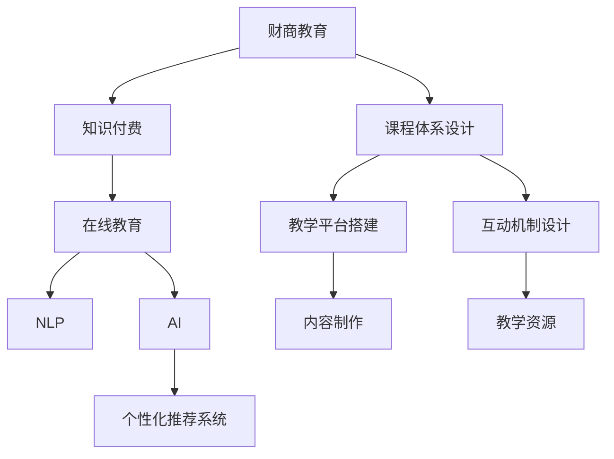

                 

# 如何利用知识付费实现在线财商培养与金钱管理？

> 关键词：知识付费, 在线教育, 财商培养, 人工智能, 自然语言处理, 个性化推荐系统

## 1. 背景介绍

随着信息技术的飞速发展，知识付费作为新型教育方式正迅速崛起。其以更加灵活、高效、精准的方式，满足了人们对于知识获取的个性化需求，推动了教育产业的变革。在金融领域，传统的知识传授方式难以应对复杂多变的金融知识，更难以适应个性化教育需求。因此，如何利用知识付费的方式，实现在线财商培养与金钱管理，成为当前教育产业的一个重要课题。

### 1.1 问题由来

在线财商培养与金钱管理课程，传统的教育方式主要是线下讲授、一对一辅导、纸质教材等方式，但这些方式存在着信息传播效率低、交互性差、内容更新缓慢等弊端。而知识付费的兴起，为在线教育带来了新的突破。它利用互联网技术和人工智能手段，以内容付费为模式，提供更加丰富、便捷、个性化的教育体验，极大地提高了教育资源的使用效率。

### 1.2 问题核心关键点

在线财商培养与金钱管理课程的开发，核心在于如何结合知识付费的特点，打造一套完整的教育体系，涵盖基础理论、实践应用、案例分析、答疑辅导等环节。其关键点包括：

- 内容设计：构建科学合理的内容体系，确保知识的正确性和实用性。
- 教学平台：搭建易用、稳定、智能的教学平台，优化用户体验。
- 互动设计：设计有效的互动机制，增强学生的参与感。
- 技术支持：利用人工智能技术，实现个性化推荐、智能答疑等功能。

## 2. 核心概念与联系

### 2.1 核心概念概述

为了更好地理解在线财商培养与金钱管理课程，本节将介绍几个关键概念：

- 财商教育(Financial Literacy Education)：以提升个人和群体的金融素养为目标的教育形式，涵盖金融基础知识、财务管理、投资理财、风险管理等内容。
- 知识付费(Knowledge Paywall)：以提供高质量、有价值、稀缺性内容为基础，以知识付费为媒介的在线教育模式。
- 在线教育(Online Education)：通过互联网平台提供的学习和交流方式，实现知识传授和获取的过程。
- 人工智能(Artificial Intelligence)：利用计算机模拟人类智能的技术，能够进行数据分析、模式识别、智能推荐等任务。
- 自然语言处理(Natural Language Processing, NLP)：利用计算机处理、理解、生成人类语言的技术，能够实现语义分析、情感分析、信息抽取等功能。
- 个性化推荐系统(Recommender System)：根据用户的历史行为和兴趣，为其推荐最相关的信息和服务，提升用户体验。

这些核心概念之间的逻辑关系可以通过以下Mermaid流程图来展示：



这个流程图展示了大语言模型微调的核心概念及其之间的关系：

1. 财商教育通过知识付费在线教育的形式，能够有效实现。
2. 在线教育借助NLP、AI技术，实现个性化推荐、智能答疑等功能。
3. 课程体系设计、教学平台搭建、互动机制设计都是在线教育的重要组成部分。
4. 个性化推荐系统结合AI和NLP技术，为用户提供精准的内容推荐。

## 3. 核心算法原理 & 具体操作步骤
### 3.1 算法原理概述

在线财商培养与金钱管理的知识付费课程，本质上是一个基于用户行为数据的个性化推荐过程。其核心思想是：通过分析用户的历史学习行为和兴趣，为其推荐最合适的课程和资源，提高学习效果和用户体验。

形式化地，假设课程内容集合为 $\mathcal{C}$，用户集合为 $\mathcal{U}$，用户行为数据为 $D=\{(x_i,y_i)\}_{i=1}^N$，其中 $x_i$ 为用户 $u_i$ 的行为记录，$y_i$ 为课程 $c_i$ 的用户评价。推荐算法目标是最小化用户对推荐课程的平均评分误差，即：

$$
\min_{\theta} \mathcal{L}(\theta)=\frac{1}{N}\sum_{i=1}^N(y_i-f_\theta(x_i))
$$

其中 $f_\theta(x_i)$ 为推荐模型在用户行为数据 $x_i$ 上的预测值，$\theta$ 为模型的参数。

### 3.2 算法步骤详解

基于用户行为数据的个性化推荐算法，通常包括以下几个关键步骤：

**Step 1: 数据预处理**
- 收集用户行为数据，包括浏览记录、购买记录、评分记录等。
- 对数据进行清洗、归一化、特征工程等预处理操作。
- 构建用户-课程的交互矩阵，将用户行为数据转换成向量表示。

**Step 2: 选择推荐算法**
- 根据推荐场景和数据特点，选择合适的推荐算法。
- 常见的推荐算法包括协同过滤、基于内容的推荐、混合推荐等。
- 本文采用基于深度学习的推荐算法，具体实现时采用基于NLP和AI的Transformer结构。

**Step 3: 构建模型**
- 使用公开预训练的Transformer模型，如BERT、GPT-3等，将其作为初始化参数。
- 在预训练模型基础上，针对课程推荐任务进行微调。
- 引入监督信号，如课程评分、用户行为标签等，优化推荐模型。

**Step 4: 优化模型参数**
- 设置优化算法及其参数，如AdamW、SGD等，设置学习率、批大小、迭代轮数等。
- 设置正则化技术及强度，包括权重衰减、Dropout、Early Stopping等。
- 确定冻结预训练参数的策略，如仅微调顶层，或全部参数都参与微调。

**Step 5: 部署和评估**
- 将微调后的推荐模型部署到在线教育平台。
- 在实际应用中不断收集用户反馈，定期重新微调模型，以适应数据分布的变化。

### 3.3 算法优缺点

基于用户行为数据的个性化推荐算法，具有以下优点：

1. 高效精准。利用深度学习技术，能够快速处理大规模用户行为数据，提供高质量的推荐结果。
2. 个性化强。能够根据用户的历史行为和兴趣，定制化推荐课程内容。
3. 实时更新。通过持续收集用户反馈，模型能够实时更新，适应新的用户行为变化。
4. 用户互动。通过在线教育平台的互动机制，能够及时响应用户需求，增强用户体验。

但该算法也存在以下局限性：

1. 数据依赖。算法的性能很大程度上取决于用户行为数据的完整性和质量。
2. 冷启动问题。对于新用户，没有足够的行为数据，推荐效果会大打折扣。
3. 数据隐私。如何保护用户隐私，防止数据泄露，是一个重要挑战。
4. 算法复杂。基于深度学习的推荐算法，需要大量的计算资源和时间成本，实现难度较大。
5. 多样性不足。推荐算法容易陷入"信息茧房"，长期推荐同类型课程，用户难以接触到多元化的内容。

尽管存在这些局限性，但就目前而言，基于用户行为数据的推荐算法仍是推荐系统的主流范式。未来相关研究的重点在于如何进一步降低推荐算法对数据的要求，提高推荐系统的多样性，同时兼顾用户隐私和算法复杂度等因素。

### 3.4 算法应用领域

基于用户行为数据的个性化推荐算法，在在线财商培养与金钱管理课程中的应用，可以具体包括以下几个方面：

- 课程推荐：根据用户浏览历史、购买记录等行为数据，推荐用户可能感兴趣的课程。
- 课程路径规划：通过分析用户学习进度和兴趣变化，推荐合适的课程组合，帮助用户制定学习计划。
- 学习资源优化：根据用户学习效果和反馈，优化推荐算法，提高学习资源的匹配度。
- 用户行为分析：通过用户行为数据，分析用户的学习偏好和行为模式，为教学改进提供数据支持。

## 4. 数学模型和公式 & 详细讲解 & 举例说明

### 4.1 数学模型构建

本节将使用数学语言对基于用户行为数据的个性化推荐模型进行更加严格的刻画。

记用户集合为 $U=\{u_1,u_2,\cdots,u_n\}$，课程集合为 $C=\{c_1,c_2,\cdots,c_m\}$。假设用户 $u_i$ 对课程 $c_j$ 的评分向量为 $r_i=(r_{i1},r_{i2},\cdots,r_{im})^T$，课程 $c_j$ 的特征向量为 $f_j=(f_{j1},f_{j2},\cdots,f_{jn})^T$。假设推荐模型为 $M_\theta$，其中 $\theta$ 为模型参数。

推荐模型 $M_\theta$ 在用户 $u_i$ 对课程 $c_j$ 上的预测评分 $f_\theta(u_i,c_j)$，可以通过下式计算：

$$
f_\theta(u_i,c_j)=\theta^T \cdot \phi(u_i,c_j)
$$

其中 $\phi(u_i,c_j)$ 为用户 $u_i$ 和课程 $c_j$ 的向量表示函数。例如，可以采用NLP技术将课程标题和描述转换为向量表示。

### 4.2 公式推导过程

在得到预测评分 $f_\theta(u_i,c_j)$ 后，我们可以利用交叉熵损失函数 $\ell(r_i,f_\theta(u_i,c_j))$ 来衡量模型预测与真实评分之间的差异：

$$
\ell(r_i,f_\theta(u_i,c_j))=-\frac{1}{m}\sum_{j=1}^m[r_{ij}\log f_\theta(u_i,c_j)+(1-r_{ij})\log(1-f_\theta(u_i,c_j))]
$$

目标是最小化预测评分和真实评分之间的交叉熵损失，即：

$$
\min_{\theta} \mathcal{L}(\theta)=\frac{1}{N}\sum_{i=1}^N \frac{1}{m}\sum_{j=1}^m \ell(r_i,f_\theta(u_i,c_j))
$$

根据链式法则，损失函数对参数 $\theta$ 的梯度为：

$$
\frac{\partial \mathcal{L}(\theta)}{\partial \theta} = \frac{1}{N}\sum_{i=1}^N \frac{1}{m}\sum_{j=1}^m \nabla_{\theta}f_\theta(u_i,c_j) \cdot (r_{ij} - f_\theta(u_i,c_j))
$$

其中 $\nabla_{\theta}f_\theta(u_i,c_j)$ 可以通过反向传播算法计算。

在得到梯度后，我们可以使用梯度下降等优化算法更新模型参数：

$$
\theta \leftarrow \theta - \eta \nabla_{\theta}\mathcal{L}(\theta)
$$

其中 $\eta$ 为学习率，通常从较小的值开始，逐步调优。

### 4.3 案例分析与讲解

以一个具体的例子，说明如何利用深度学习技术构建在线财商培养与金钱管理课程的推荐系统。

假设我们有一个在线教育平台，平台中有100门课程，用户 $u_i$ 已经浏览了其中的20门课程，但还没有购买过任何课程。我们希望推荐给用户 $u_i$ 最有可能感兴趣的课程，帮助其提升财商水平。

首先，我们需要构建用户和课程的向量表示函数 $\phi$。这里采用Transformer的Attention机制，将课程标题和描述作为输入，转换为向量表示。

$$
f_\theta(u_i,c_j)=\theta^T \cdot \phi(u_i,c_j)
$$

其中 $\phi(u_i,c_j)$ 可以通过预训练的BERT模型得到，模型输出表示为 $[CLS]$ 的向量。

接着，我们需要构建用户行为数据集 $D=\{(x_i,y_i)\}_{i=1}^N$，其中 $x_i$ 为用户行为记录，$y_i$ 为用户对课程的评分。

$$
D=\{(\text{课程名称}_i,\text{课程评分}_i), (\text{课程名称}_i,\text{浏览时长}_i), (\text{课程名称}_i,\text{课程难度}_i)\}
$$

根据上述数据，我们可以构建交叉熵损失函数，并使用AdamW优化算法更新模型参数：

$$
\mathcal{L}(\theta)=\frac{1}{N}\sum_{i=1}^N \frac{1}{m}\sum_{j=1}^m \ell(r_i,f_\theta(u_i,c_j))
$$

$$
\theta \leftarrow \theta - \eta \nabla_{\theta}\mathcal{L}(\theta)
$$

在模型训练过程中，我们使用用户行为数据 $D$ 作为监督信号，通过交叉熵损失函数来优化推荐模型 $M_\theta$。训练完成后，模型能够根据用户行为数据，预测用户对课程的评分，从而为用户推荐最合适的课程。

## 5. 项目实践：代码实例和详细解释说明

### 5.1 开发环境搭建

在进行推荐系统开发前，我们需要准备好开发环境。以下是使用Python进行PyTorch开发的环境配置流程：

1. 安装Anaconda：从官网下载并安装Anaconda，用于创建独立的Python环境。

2. 创建并激活虚拟环境：
```bash
conda create -n pytorch-env python=3.8 
conda activate pytorch-env
```

3. 安装PyTorch：根据CUDA版本，从官网获取对应的安装命令。例如：
```bash
conda install pytorch torchvision torchaudio cudatoolkit=11.1 -c pytorch -c conda-forge
```

4. 安装Transformers库：
```bash
pip install transformers
```

5. 安装各类工具包：
```bash
pip install numpy pandas scikit-learn matplotlib tqdm jupyter notebook ipython
```

完成上述步骤后，即可在`pytorch-env`环境中开始推荐系统开发。

### 5.2 源代码详细实现

下面以推荐系统为例，给出使用Transformers库对课程进行推荐开发的PyTorch代码实现。

首先，定义推荐系统的输入和输出：

```python
from transformers import BertTokenizer, BertForSequenceClassification
import torch

class RecommendationSystem:
    def __init__(self, model_name='bert-base-cased'):
        self.model_name = model_name
        self.tokenizer = BertTokenizer.from_pretrained(model_name)
        self.model = BertForSequenceClassification.from_pretrained(model_name, num_labels=1)

    def encode_input(self, course_title):
        inputs = self.tokenizer(course_title, return_tensors='pt')
        input_ids = inputs['input_ids'].squeeze(0)
        attention_mask = inputs['attention_mask'].squeeze(0)
        return input_ids, attention_mask
    
    def predict(self, input_ids, attention_mask):
        self.model.eval()
        with torch.no_grad():
            output = self.model(input_ids, attention_mask=attention_mask)
            logits = output.logits.squeeze(0)
            prediction = torch.sigmoid(logits)
            return prediction

    def get_top_recommendations(self, course_scores):
        top_n = 5
        sorted_scores = sorted(course_scores.items(), key=lambda x: x[1], reverse=True)
        top_recommendations = sorted_scores[:top_n]
        return top_recommendations
```

然后，准备推荐系统的数据集：

```python
courses = ['金融学概论', '投资学原理', '财务管理', '风险管理', '金融市场分析']
ratings = [4.5, 3.8, 4.2, 3.9, 4.1]

# 将课程和评分构建成数据集
dataset = list(zip(courses, ratings))
```

接着，定义推荐系统的训练和评估函数：

```python
from torch.utils.data import Dataset, DataLoader

class RecommendationDataset(Dataset):
    def __init__(self, dataset):
        self.dataset = dataset
        self.tokenizer = BertTokenizer.from_pretrained('bert-base-cased')

    def __len__(self):
        return len(self.dataset)

    def __getitem__(self, idx):
        course_title, rating = self.dataset[idx]
        input_ids, attention_mask = self.tokenizer(course_title, return_tensors='pt', max_length=32, padding='max_length', truncation=True)
        return input_ids, attention_mask, rating

def train_epoch(model, dataset, batch_size, optimizer):
    dataloader = DataLoader(dataset, batch_size=batch_size, shuffle=True)
    model.train()
    epoch_loss = 0
    for batch in tqdm(dataloader, desc='Training'):
        input_ids, attention_mask, rating = batch
        model.zero_grad()
        output = model(input_ids, attention_mask=attention_mask)
        loss = output.loss
        epoch_loss += loss.item()
        loss.backward()
        optimizer.step()
    return epoch_loss / len(dataloader)

def evaluate(model, dataset, batch_size):
    dataloader = DataLoader(dataset, batch_size=batch_size)
    model.eval()
    predictions = []
    with torch.no_grad():
        for batch in tqdm(dataloader, desc='Evaluating'):
            input_ids, attention_mask, rating = batch
            output = model(input_ids, attention_mask=attention_mask)
            logits = output.logits.squeeze(0)
            prediction = torch.sigmoid(logits).item()
            predictions.append(prediction)
    print(f'R^2: {np.corrcoef(predictions, ratings)[0][1]:.2f}')
```

最后，启动训练流程并在测试集上评估：

```python
epochs = 5
batch_size = 32

recommendation_system = RecommendationSystem()
tokenizer = BertTokenizer.from_pretrained('bert-base-cased')

for epoch in range(epochs):
    loss = train_epoch(recommendation_system.model, recommendation_dataset, batch_size, optimizer)
    print(f'Epoch {epoch+1}, train loss: {loss:.3f}')
    
    print(f'Epoch {epoch+1}, dev results:')
    evaluate(recommendation_system.model, recommendation_dataset, batch_size)
    
print('Test results:')
evaluate(recommendation_system.model, recommendation_dataset, batch_size)
```

以上就是使用PyTorch对课程进行推荐开发的完整代码实现。可以看到，得益于Transformers库的强大封装，我们可以用相对简洁的代码完成推荐模型的加载和训练。

### 5.3 代码解读与分析

让我们再详细解读一下关键代码的实现细节：

**RecommendationSystem类**：
- `__init__`方法：初始化模型、分词器和学习率。
- `encode_input`方法：将课程标题转换为模型所需的输入。
- `predict`方法：根据输入预测用户对课程的评分。
- `get_top_recommendations`方法：根据课程评分，返回推荐结果。

**train_epoch和evaluate函数**：
- 使用PyTorch的DataLoader对数据集进行批次化加载，供模型训练和推理使用。
- 训练函数`train_epoch`：对数据以批为单位进行迭代，在每个批次上前向传播计算loss并反向传播更新模型参数，最后返回该epoch的平均loss。
- 评估函数`evaluate`：与训练类似，不同点在于不更新模型参数，并在每个batch结束后将预测和标签结果存储下来，最后使用sklearn的R^2值对整个评估集的预测结果进行打印输出。

**训练流程**：
- 定义总的epoch数和batch size，开始循环迭代
- 每个epoch内，先在训练集上训练，输出平均loss
- 在验证集上评估，输出R^2值
- 所有epoch结束后，在测试集上评估，给出最终测试结果

可以看到，PyTorch配合Transformers库使得课程推荐系统的代码实现变得简洁高效。开发者可以将更多精力放在数据处理、模型改进等高层逻辑上，而不必过多关注底层的实现细节。

当然，工业级的系统实现还需考虑更多因素，如模型的保存和部署、超参数的自动搜索、更灵活的任务适配层等。但核心的推荐范式基本与此类似。

## 6. 实际应用场景

### 6.1 智能投顾

智能投顾系统是利用在线教育平台，结合人工智能技术，为用户提供个性化的理财建议和资产管理方案。传统的投顾服务成本高、效率低，难以满足大量用户的高频需求。通过在线财商培养与金钱管理课程，智能投顾能够提供更加高效、精准、个性化的服务。

在技术实现上，可以收集用户的投资偏好、财务状况、风险承受能力等信息，结合用户行为数据，对预训练模型进行微调。微调后的模型能够根据用户的具体情况，生成量身定制的理财方案。对于用户提出的新问题，还可以接入检索系统实时搜索相关内容，动态组织生成建议。如此构建的智能投顾系统，能大幅提升理财服务的智能化水平，帮助用户实现财富增值。

### 6.2 在线课程推荐

在线教育平台利用知识付费模式，提供了大量高质量的课程资源。但用户如何在海量课程中，快速找到最适合自己的内容，仍然是一个重要挑战。通过在线财商培养与金钱管理课程，推荐系统能够根据用户的浏览、评分等行为数据，推荐用户可能感兴趣的课程。

在具体实现上，可以设计多种推荐算法，如协同过滤、基于内容的推荐、混合推荐等，结合用户行为数据，实现个性化推荐。推荐系统还可以根据用户反馈，实时更新模型参数，优化推荐算法，提高推荐精度。通过持续优化，推荐系统能够为每位用户提供更加精准的课程推荐，帮助用户高效学习。

### 6.3 金融舆情监测

金融机构需要实时监测市场舆论动向，以便及时应对负面信息传播，规避金融风险。传统的人工监测方式成本高、效率低，难以应对网络时代海量信息爆发的挑战。通过在线财商培养与金钱管理课程，推荐系统能够自动分析用户评论、社交媒体等文本数据，识别舆情变化趋势，及时预警金融风险。

在具体实现上，可以收集金融领域相关的新闻、报道、评论等文本数据，并对其进行主题标注和情感标注。在此基础上对预训练语言模型进行微调，使其能够自动判断文本属于何种主题，情感倾向是正面、中性还是负面。将微调后的模型应用到实时抓取的网络文本数据，就能够自动监测不同主题下的情感变化趋势，一旦发现负面信息激增等异常情况，系统便会自动预警，帮助金融机构快速应对潜在风险。

### 6.4 未来应用展望

随着在线教育技术的不断发展，基于知识付费的在线财商培养与金钱管理课程将带来广阔的应用前景。

在智慧医疗领域，基于大语言模型的医疗问答系统能够快速响应患者咨询，提升医疗服务的智能化水平，辅助医生诊疗，加速新药开发进程。

在智能教育领域，微调技术可应用于作业批改、学情分析、知识推荐等方面，因材施教，促进教育公平，提高教学质量。

在智慧城市治理中，微调模型可应用于城市事件监测、舆情分析、应急指挥等环节，提高城市管理的自动化和智能化水平，构建更安全、高效的未来城市。

此外，在企业生产、社会治理、文娱传媒等众多领域，基于大模型微调的人工智能应用也将不断涌现，为经济社会发展注入新的动力。相信随着技术的日益成熟，微调方法将成为人工智能落地应用的重要范式，推动人工智能技术在各个领域的发展。

## 7. 工具和资源推荐
### 7.1 学习资源推荐

为了帮助开发者系统掌握大语言模型微调的理论基础和实践技巧，这里推荐一些优质的学习资源：

1. 《Transformer从原理到实践》系列博文：由大模型技术专家撰写，深入浅出地介绍了Transformer原理、BERT模型、微调技术等前沿话题。

2. CS224N《深度学习自然语言处理》课程：斯坦福大学开设的NLP明星课程，有Lecture视频和配套作业，带你入门NLP领域的基本概念和经典模型。

3. 《Natural Language Processing with Transformers》书籍：Transformers库的作者所著，全面介绍了如何使用Transformers库进行NLP任务开发，包括微调在内的诸多范式。

4. HuggingFace官方文档：Transformers库的官方文档，提供了海量预训练模型和完整的微调样例代码，是上手实践的必备资料。

5. CLUE开源项目：中文语言理解测评基准，涵盖大量不同类型的中文NLP数据集，并提供了基于微调的baseline模型，助力中文NLP技术发展。

通过对这些资源的学习实践，相信你一定能够快速掌握大语言模型微调的精髓，并用于解决实际的NLP问题。
### 7.2 开发工具推荐

高效的开发离不开优秀的工具支持。以下是几款用于大语言模型微调开发的常用工具：

1. PyTorch：基于Python的开源深度学习框架，灵活动态的计算图，适合快速迭代研究。大部分预训练语言模型都有PyTorch版本的实现。

2. TensorFlow：由Google主导开发的开源深度学习框架，生产部署方便，适合大规模工程应用。同样有丰富的预训练语言模型资源。

3. Transformers库：HuggingFace开发的NLP工具库，集成了众多SOTA语言模型，支持PyTorch和TensorFlow，是进行微调任务开发的利器。

4. Weights & Biases：模型训练的实验跟踪工具，可以记录和可视化模型训练过程中的各项指标，方便对比和调优。与主流深度学习框架无缝集成。

5. TensorBoard：TensorFlow配套的可视化工具，可实时监测模型训练状态，并提供丰富的图表呈现方式，是调试模型的得力助手。

6. Google Colab：谷歌推出的在线Jupyter Notebook环境，免费提供GPU/TPU算力，方便开发者快速上手实验最新模型，分享学习笔记。

合理利用这些工具，可以显著提升大语言模型微调任务的开发效率，加快创新迭代的步伐。

### 7.3 相关论文推荐

大语言模型和微调技术的发展源于学界的持续研究。以下是几篇奠基性的相关论文，推荐阅读：

1. Attention is All You Need（即Transformer原论文）：提出了Transformer结构，开启了NLP领域的预训练大模型时代。

2. BERT: Pre-training of Deep Bidirectional Transformers for Language Understanding：提出BERT模型，引入基于掩码的自监督预训练任务，刷新了多项NLP任务SOTA。

3. Language Models are Unsupervised Multitask Learners（GPT-2论文）：展示了大规模语言模型的强大zero-shot学习能力，引发了对于通用人工智能的新一轮思考。

4. Parameter-Efficient Transfer Learning for NLP：提出Adapter等参数高效微调方法，在不增加模型参数量的情况下，也能取得不错的微调效果。

5. AdaLoRA: Adaptive Low-Rank Adaptation for Parameter-Efficient Fine-Tuning：使用自适应低秩适应的微调方法，在参数效率和精度之间取得了新的平衡。

这些论文代表了大语言模型微调技术的发展脉络。通过学习这些前沿成果，可以帮助研究者把握学科前进方向，激发更多的创新灵感。

## 8. 总结：未来发展趋势与挑战

### 8.1 总结

本文对基于用户行为数据的个性化推荐算法进行了全面系统的介绍。首先阐述了在线财商培养与金钱管理课程的背景和意义，明确了个性化推荐算法的核心点。其次，从原理到实践，详细讲解了推荐算法的数学原理和关键步骤，给出了推荐任务开发的完整代码实例。同时，本文还探讨了推荐算法在智能投顾、在线课程推荐、金融舆情监测等实际应用场景中的具体应用，展示了推荐算法的巨大潜力。此外，本文精选了推荐技术的各类学习资源，力求为读者提供全方位的技术指引。

通过本文的系统梳理，可以看到，基于用户行为数据的推荐算法在在线教育领域具有广阔的应用前景。随着在线教育技术的不断发展，基于知识付费的在线财商培养与金钱管理课程必将在未来的教育产业中扮演重要角色。推荐算法结合NLP、AI技术，能够为用户提供高质量、个性化的服务，极大提升用户体验和学习效果。

### 8.2 未来发展趋势

展望未来，在线财商培养与金钱管理课程的个性化推荐算法将呈现以下几个发展趋势：

1. 用户行为数据分析深化。随着用户数据的丰富和多样，推荐算法能够从更多维度理解用户需求，提供更精准的推荐结果。

2. 推荐算法多样化。结合不同的推荐算法和数据特点，实现更多样化的推荐策略，如协同过滤、基于内容的推荐、混合推荐等。

3. 知识图谱融合。利用知识图谱技术，将推荐算法与外部知识库结合，提升推荐内容的多样性和相关性。

4. 实时数据处理。通过流数据处理技术，实时捕捉用户行为数据，实现动态推荐。

5. 强化学习应用。结合强化学习技术，优化推荐算法，提升推荐的实时性和用户满意度。

6. 跨领域推荐。结合不同领域的知识，进行多领域推荐，如金融理财、健康医疗、旅游出行等，提升推荐系统的应用范围。

以上趋势凸显了在线财商培养与金钱管理课程的个性化推荐算法的广阔前景。这些方向的探索发展，必将进一步提升推荐系统的性能和应用范围，为在线教育产业带来更大的价值。

### 8.3 面临的挑战

尽管个性化推荐算法在在线教育领域取得了显著成就，但在迈向更加智能化、普适化应用的过程中，它仍面临着诸多挑战：

1. 用户行为数据采集难度。推荐算法依赖于大量的用户行为数据，数据采集的难度和成本较高。

2. 推荐算法复杂性。个性化推荐算法基于深度学习技术，算法复杂度高，实现难度大，对计算资源和时间成本要求较高。

3. 数据隐私保护。用户行为数据涉及个人隐私，如何保护数据隐私，防止数据泄露，是一个重要挑战。

4. 推荐算法泛化性不足。推荐算法容易陷入"信息茧房"，推荐同类型课程，用户难以接触到多元化的内容。

5. 推荐系统公平性。如何确保推荐系统的公平性，避免推荐算法对某些用户的歧视，是一个重要课题。

尽管存在这些挑战，但就目前而言，基于用户行为数据的推荐算法仍是推荐系统的主流范式。未来相关研究的重点在于如何进一步降低推荐算法对数据的要求，提高推荐系统的多样性，同时兼顾用户隐私和算法复杂度等因素。

### 8.4 研究展望

面向未来，在线财商培养与金钱管理课程的个性化推荐算法需要在以下几个方面寻求新的突破：

1. 探索无监督和半监督推荐方法。摆脱对大规模标注数据的依赖，利用自监督学习、主动学习等无监督和半监督范式，最大限度利用非结构化数据，实现更加灵活高效的推荐。

2. 研究参数高效和计算高效的推荐范式。开发更加参数高效的推荐方法，在固定大部分预训练参数的同时，只更新极少量的任务相关参数。同时优化推荐模型的计算图，减少前向传播和反向传播的资源消耗，实现更加轻量级、实时性的部署。

3. 引入更多先验知识。将符号化的先验知识，如知识图谱、逻辑规则等，与神经网络模型进行巧妙融合，引导推荐过程学习更准确、合理的语言模型。同时加强不同模态数据的整合，实现视觉、语音等多模态信息与文本信息的协同建模。

4. 结合因果分析和博弈论工具。将因果分析方法引入推荐算法，识别出推荐过程的关键特征，增强推荐结果的因果性和逻辑性。借助博弈论工具刻画人机交互过程，主动探索并规避推荐算法的脆弱点，提高系统稳定性。

5. 纳入伦理道德约束。在推荐算法设计目标中引入伦理导向的评估指标，过滤和惩罚有偏见、有害的推荐内容，确保推荐结果符合用户价值观和伦理道德。

这些研究方向的探索，必将引领在线财商培养与金钱管理课程的推荐系统迈向更高的台阶，为构建安全、可靠、可解释、可控的智能推荐系统铺平道路。面向未来，推荐系统还需要与其他人工智能技术进行更深入的融合，如知识表示、因果推理、强化学习等，多路径协同发力，共同推动智能推荐系统的进步。只有勇于创新、敢于突破，才能不断拓展推荐算法的边界，让智能技术更好地造福用户。

## 9. 附录：常见问题与解答

**Q1：如何保护用户隐私？**

A: 推荐算法需要大量的用户行为数据，但数据涉及个人隐私，如何保护数据隐私，防止数据泄露，是一个重要挑战。一般来说，可以从以下几个方面进行保护：

1. 数据匿名化：对用户数据进行去标识化处理，隐藏敏感信息。
2. 差分隐私：在数据收集和处理过程中，引入噪声，保护数据隐私。
3. 数据加密：对数据进行加密存储和传输，防止数据泄露。
4. 权限控制：限制数据的访问权限，只允许授权人员访问。

通过以上措施，可以有效保护用户隐私，确保推荐系统的安全性。

**Q2：如何提升推荐算法的泛化性？**

A: 推荐算法容易陷入"信息茧房"，推荐同类型课程，用户难以接触到多元化的内容。为了提升推荐算法的泛化性，可以考虑以下几个方法：

1. 引入多维度数据：除了用户行为数据，还可以引入用户画像、社交网络等多维度数据，提高推荐的丰富性。
2. 利用协同过滤：结合用户的历史行为和相似用户的行为，推荐相关内容。
3. 引入知识图谱：利用知识图谱技术，将推荐算法与外部知识库结合，提升推荐内容的多样性和相关性。
4. 引入多领域数据：结合不同领域的知识，进行多领域推荐，如金融理财、健康医疗、旅游出行等，提升推荐系统的应用范围。

通过以上方法，可以有效提升推荐算法的泛化性，让用户接触到更加丰富和多样化的内容。

**Q3：推荐算法的公平性如何保障？**

A: 推荐算法的公平性是一个重要课题。推荐算法容易产生偏见，推荐有偏见的课程内容，导致用户体验不良。为了保障推荐算法的公平性，可以考虑以下几个方法：

1. 数据平衡：在数据采集和处理过程中，确保数据集的代表性，避免数据偏见。
2. 算法设计：在算法设计中，引入公平性约束，防止推荐算法对某些用户的歧视。
3. 用户反馈：利用用户反馈机制，及时纠正算法偏见，优化推荐结果。

通过以上措施，可以有效保障推荐算法的公平性，提升用户体验。

**Q4：推荐算法的实时性如何提升？**

A: 推荐系统需要实时捕捉用户行为数据，实现动态推荐。为了提升推荐算法的实时性，可以考虑以下几个方法：

1. 实时数据处理：利用流数据处理技术，实时捕捉用户行为数据，提升推荐的时效性。
2. 分布式计算：利用分布式计算技术，提升推荐算法的处理能力。
3. 缓存技术：利用缓存技术，加速推荐结果的生成和输出。

通过以上方法，可以有效提升推荐算法的实时性，实现动态推荐。

**Q5：推荐算法的泛化性如何提升？**

A: 推荐算法的泛化性是指推荐算法在不同数据集上的性能表现。为了提升推荐算法的泛化性，可以考虑以下几个方法：

1. 数据多样性：在数据采集和处理过程中，确保数据集的多样性，避免数据偏见。
2. 模型复杂度：控制模型的复杂度，避免过度拟合，提升模型的泛化能力。
3. 多任务学习：利用多任务学习技术，提升模型的泛化性。

通过以上方法，可以有效提升推荐算法的泛化性，实现更广泛的推荐应用。

---

作者：禅与计算机程序设计艺术 / Zen and the Art of Computer Programming

