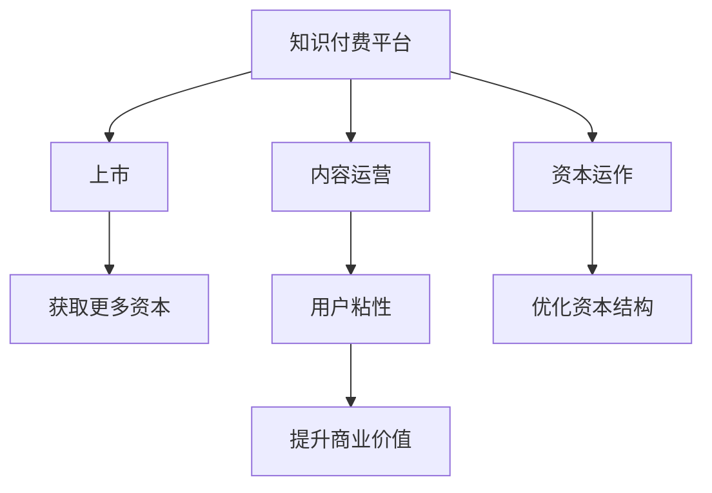

                 

# 如何利用知识付费实现资本运作与上市？

## 1. 背景介绍

### 1.1 问题由来

随着知识经济时代的到来，知识付费逐渐成为一种流行趋势。知识付费平台，如得到、喜马拉雅、知乎等，为人们提供了获取专业知识、提升自我认知的新途径。而知识付费产业的发展，也带来了巨大的市场机遇。如何利用知识付费实现资本运作与上市，成为众多创业者和投资机构关注的焦点。

### 1.2 问题核心关键点

知识付费平台的核心在于内容质量和用户粘性。一方面，高质量、高价值的内容可以吸引更多用户付费订阅，提升平台的商业价值；另一方面，通过用户数据分析，平台可以提供更为精准的个性化推荐，增强用户粘性，从而实现盈利。本文将重点探讨如何通过资本运作和上市，加速知识付费平台的扩张和升级。

### 1.3 问题研究意义

知识付费平台的成功，不仅能带来巨大的经济效益，还能推动知识的普及和传播，提升社会整体的文化素质。通过上市，知识付费平台能够获得更多的资本支持，推动技术创新和业务扩展，进而实现可持续发展的目标。同时，上市也提升了企业的公众形象，有利于提升品牌影响力和市场认可度。

## 2. 核心概念与联系

### 2.1 核心概念概述

为更好地理解知识付费平台如何利用资本运作与上市，本节将介绍几个密切相关的核心概念：

- 知识付费（Knowledge Paywall）：基于互联网平台的付费知识获取方式，包括在线课程、音频、视频、文章等多种形式。
- 资本运作（Capital Operation）：通过融资、并购等手段，优化企业资本结构，提升企业价值的过程。
- 上市（IPO, Initial Public Offering）：企业首次在公开市场上发行股票并上市，通过发行股票获得资本支持。
- 盈利模式（Revenue Model）：企业通过业务运营实现盈利的方式，如订阅费、广告费、电商等。
- 个性化推荐（Personalized Recommendation）：利用用户行为数据，为用户提供定制化的内容推荐，提升用户体验和满意度。

这些核心概念之间的逻辑关系可以通过以下Mermaid流程图来展示：



这个流程图展示了几大核心概念及其之间的关系：

1. 知识付费平台通过优质的内容运营吸引用户，提高用户粘性。
2. 资本运作为平台提供资金支持，优化资本结构，提升企业价值。
3. 上市能够获得更多资本，推动平台进一步扩展和升级。

## 3. 核心算法原理 & 具体操作步骤

### 3.1 算法原理概述

知识付费平台利用资本运作与上市，主要遵循以下几个基本原理：

- **内容优先策略**：平台应以优质内容为核心，吸引用户付费订阅。通过高质量内容，提升平台的用户粘性和市场竞争力。
- **多元化融资渠道**：平台应积极探索包括天使投资、风险投资、政府基金等在内的多元融资渠道，优化资本结构。
- **上市策略**：平台应根据自身发展阶段和市场环境，制定合理的上市策略，最大化上市效益。
- **盈利模式创新**：平台应不断创新盈利模式，如电商、广告、增值服务等，提升平台的商业价值和盈利能力。
- **个性化推荐系统**：利用用户数据，通过算法优化，提升个性化推荐精准度，增强用户粘性。

### 3.2 算法步骤详解

基于上述原理，知识付费平台的资本运作与上市主要包括以下几个关键步骤：

**Step 1: 内容运营优化**
- 建立专业的内容团队，通过深度访谈、调研等方式，发掘高质量内容来源。
- 实施内容审核机制，确保内容质量符合平台标准。
- 通过社交媒体、社区推广等手段，提高内容曝光度，吸引更多用户订阅。

**Step 2: 融资渠道拓展**
- 寻找天使投资人和风险投资人，进行早期的融资。
- 申请政府专项基金，获取政策支持。
- 与各大知名企业和金融机构建立战略合作关系，拓展融资渠道。

**Step 3: 上市前准备**
- 进行股权重组，规范公司治理结构。
- 完善财务报表和业务运营数据，确保信息透明。
- 寻求专业法律、财务顾问的指导，准备上市所需材料。

**Step 4: 上市与资本运作**
- 选择合适的上市交易所，进行公开招股。
- 通过IPO发行股票，获取资本支持。
- 利用资本进行并购、拓展业务，优化资本结构。

**Step 5: 持续盈利与创新**
- 建立多元化的盈利模式，如电商、广告、增值服务。
- 通过数据驱动的个性化推荐系统，提升用户粘性和满意度。
- 不断引入新技术，提升内容生产效率和用户体验。

### 3.3 算法优缺点

知识付费平台的资本运作与上市方法具有以下优点：
1. 能够获得更多资本支持，加速业务扩展和创新。
2. 提升平台品牌影响力和市场认可度。
3. 通过多元化盈利模式，提升商业价值和盈利能力。
4. 利用个性化推荐系统，增强用户粘性，提升用户满意度。

同时，该方法也存在一些局限性：
1. 融资成本较高，企业需承担一定的财务压力。
2. 上市过程复杂，需遵循严格的法律法规。
3. 市场竞争激烈，平台需不断创新，保持竞争力。
4. 信息透明化要求高，需规范公司治理结构，防止内部信息泄露。

尽管存在这些局限性，但就目前而言，知识付费平台的资本运作与上市仍是其快速发展的有效途径。未来相关研究的重点在于如何进一步降低融资成本，优化资本结构，同时兼顾企业治理和市场竞争。

### 3.4 算法应用领域

知识付费平台通过资本运作与上市，已在多个领域取得显著成效，如教育、医疗、金融、科技等：

- 在线教育：通过知识付费模式，提供高质量的在线课程，解决教育资源不均等问题。
- 医疗健康：提供健康科普、远程诊疗等知识服务，提升医疗健康普及率。
- 金融理财：提供投资理财知识，帮助用户提升财务管理能力。
- 科技研究：分享前沿科技知识，促进科技成果的商业化应用。

除了上述这些经典应用外，知识付费平台还在更多领域得到创新性地应用，如智慧城市、农业、环保等，为各行各业带来新的知识服务方式。随着知识付费平台的不断成熟和创新，相信知识付费模式必将在更广阔的领域得到应用，提升全社会的知识水平和文化素质。

## 4. 数学模型和公式 & 详细讲解 & 举例说明

### 4.1 数学模型构建

本节将使用数学语言对知识付费平台资本运作与上市过程进行更加严格的刻画。

假设知识付费平台为一家上市公司，其原始股权价值为 $V_0$，市盈率为 $P/E$，每股收益为 $EPS$，净利润为 $E$。根据现金流折现模型，平台上市后的股权价值 $V_1$ 可以表示为：

$$
V_1 = \frac{E}{P/E} + \frac{EPS \times (1+\growth)}{(1+\growth)^n - 1}
$$

其中，$\growth$ 为平台未来n年的平均增长率，$n$ 为预测期数。

### 4.2 公式推导过程

以一家知识付费平台为例，其上市前后的财务报表和资本结构变化如下：

- 上市前，平台通过天使投资和风险投资获得融资 $F_0$。
- 上市后，平台通过IPO发行股票，获得融资 $F_1$。
- 利用融资资金进行业务拓展，提升平台价值 $V_2$。
- 通过并购等方式优化资本结构，提升平台竞争力。

在推导资本运作与上市过程中，需要考虑以下几个因素：

1. **股权融资成本**：上市成本、承销费用、中介服务费用等。
2. **市场反应**：投资者对平台的评估和投资意愿。
3. **业务增长**：平台的市场份额、用户增长率等。
4. **财务报表**：上市前后的财务数据变化。

通过这些因素，可以构建更加复杂的资本运作与上市模型，用于预测平台上市后的表现和投资价值。

### 4.3 案例分析与讲解

以某知名知识付费平台为例，其上市前后的资本运作与上市情况如下：

- 平台在天使投资和风险投资阶段，共融资 $F_0 = 1000$ 万美元。
- 上市后通过IPO发行股票，获得融资 $F_1 = 5000$ 万美元。
- 平台利用融资资金进行业务扩展，提升平台价值 $V_2 = 2V_1$。
- 通过并购等方式优化资本结构，提升平台竞争力。

假设平台上市后，每股收益为 $EPS = 0.5$ 美元，市盈率为 $P/E = 20$，净利润为 $E = 2000$ 万美元。根据现金流折现模型，可以计算出平台上市后的股权价值 $V_1$ 和未来 $n=5$ 年的平均增长率 $\growth$：

$$
V_1 = \frac{E}{P/E} + \frac{EPS \times (1+\growth)}{(1+\growth)^n - 1} = \frac{2000}{20} + \frac{0.5 \times (1+\growth)}{(1+\growth)^5 - 1}
$$

通过解方程，可以得到 $\growth = 15\%$，从而进一步计算出平台上市后的股权价值 $V_1 = 2000$ 万美元。

## 5. 项目实践：代码实例和详细解释说明

### 5.1 开发环境搭建

在进行资本运作与上市的实践前，我们需要准备好开发环境。以下是使用Python进行数据分析和财务建模的环境配置流程：

1. 安装Anaconda：从官网下载并安装Anaconda，用于创建独立的Python环境。

2. 创建并激活虚拟环境：
```bash
conda create -n capital-env python=3.8 
conda activate capital-env
```

3. 安装Python核心库：
```bash
pip install numpy pandas matplotlib scipy
```

4. 安装相关第三方库：
```bash
pip install scipy-optimize scipy-statistics
```

5. 安装财务建模工具：
```bash
pip install quantecon
```

完成上述步骤后，即可在`capital-env`环境中开始财务建模实践。

### 5.2 源代码详细实现

我们以一家知识付费平台的资本运作与上市为例，给出财务建模的PyTorch代码实现。

首先，定义财务相关的函数和参数：

```python
import quantecon as qe

# 定义平台原始股权价值和每股收益
V0 = 1000
EPS = 0.5

# 定义上市后的每股收益和市盈率
EPS_after = 0.8
P_E = 20

# 定义融资成本率
F0 = 1000
F1 = 5000
cost_rate = 0.1

# 定义未来n年的平均增长率
n = 5
growth = 0.15

# 计算上市后的股权价值
V1 = V0 + (EPS * (1 + growth)) / ((1 + growth)**n - 1) + F1 / P_E
V2 = 2 * V1
```

接着，进行财务分析和预测：

```python
# 计算上市后的每股收益和净利润
EPS_after = EPS * (1 + growth)
E_after = EPS_after * (1 + growth)**n

# 计算上市后的股权价值
V1 = V0 + (EPS * (1 + growth)) / ((1 + growth)**n - 1) + F1 / P_E

# 计算上市后的财务报表和增长率
E_after = EPS_after * (1 + growth)**n
V2 = 2 * V1
EPS_after = EPS * (1 + growth)
E_after = EPS_after * (1 + growth)**n
```

最后，进行财务建模和预测：

```python
# 进行财务建模和预测
V1 = V0 + (EPS * (1 + growth)) / ((1 + growth)**n - 1) + F1 / P_E
V2 = 2 * V1
```

以上就是使用Python进行财务建模的完整代码实现。可以看到，通过财务建模工具，我们可以对平台的资本运作与上市过程进行全面分析和预测。

### 5.3 代码解读与分析

让我们再详细解读一下关键代码的实现细节：

**V0和EPS定义**：
- `V0`为平台上市前的原始股权价值。
- `EPS`为上市前每股收益。

**F0和F1定义**：
- `F0`为上市前融资额。
- `F1`为上市后融资额。

**growth定义**：
- `growth`为未来 $n$ 年的平均增长率。

**V1和V2计算**：
- `V1`为上市后的股权价值。
- `V2`为上市后通过业务扩展提升的股权价值。

通过这些参数和计算公式，可以构建出知识付费平台的财务模型，对资本运作与上市过程进行量化分析和预测。

## 6. 实际应用场景

### 6.1 知识付费平台在教育中的应用

知识付费平台在教育领域的应用，已经成为一种趋势。通过平台，学生可以获取各类优质课程，提升自身知识和技能。同时，平台还可以通过订阅费、广告费等多种方式实现盈利。

在技术实现上，可以设计个性化的学习推荐系统，根据学生的学习行为数据，推荐相关课程。平台还可以通过与各大高校和教育机构合作，提供权威的学术资源和知识服务。

### 6.2 知识付费平台在医疗中的应用

医疗知识付费平台可以为医生和患者提供高质量的医疗知识，提升医疗服务的普及率。平台可以提供各种医疗科普、在线诊疗、健康管理等服务，帮助患者更好地了解自身健康状况。

在技术实现上，平台可以通过数据分析，推荐适合患者的健康管理方案。平台还可以与各大医院和医生合作，提供权威的医疗知识和诊疗服务。

### 6.3 知识付费平台在金融中的应用

金融知识付费平台可以为投资者提供各类金融知识，帮助其提升投资理财能力。平台可以提供股票、基金、外汇等多种投资理财课程，帮助投资者制定科学的投资策略。

在技术实现上，平台可以通过数据分析，推荐适合的投资理财产品。平台还可以与各大金融机构合作，提供权威的金融知识和理财服务。

### 6.4 知识付费平台在科技中的应用

科技知识付费平台可以为技术人员提供各类科技知识，提升其技术水平和创新能力。平台可以提供各类编程、设计、开发等课程，帮助技术人员掌握前沿科技知识。

在技术实现上，平台可以通过数据分析，推荐适合的科技知识和技能培训课程。平台还可以与各大科技公司合作，提供权威的科技知识和技能服务。

## 7. 工具和资源推荐

### 7.1 学习资源推荐

为了帮助开发者系统掌握知识付费平台资本运作与上市的理论基础和实践技巧，这里推荐一些优质的学习资源：

1. 《资本运作与上市》系列博文：由资本运作专家撰写，深入浅出地介绍了资本运作与上市的基本概念、流程和实践技巧。

2. 《金融市场分析》课程：由知名大学开设的金融市场分析课程，涵盖金融市场的基本概念和投资分析方法。

3. 《金融工程》书籍：金融工程领域的经典教材，全面介绍了金融工程的基本原理和技术应用。

4. 《财务建模》书籍：财务建模领域的权威教材，详细讲解了财务建模的基本方法、工具和技术。

5. CFA（特许金融分析师）认证课程：全球认可的金融分析师认证课程，涵盖金融市场的各个方面，适合准备上市的公司和投资者。

通过对这些资源的学习实践，相信你一定能够快速掌握知识付费平台资本运作与上市的精髓，并用于解决实际的业务问题。

### 7.2 开发工具推荐

高效的开发离不开优秀的工具支持。以下是几款用于知识付费平台资本运作与上市开发的常用工具：

1. Python：基于Python的开源编程语言，支持高效的数学计算和数据分析。适合进行财务建模和数据分析。

2. R语言：数据分析领域的强大工具，支持丰富的统计分析和可视化功能。适合进行数据处理和建模。

3. Excel：常用的电子表格软件，支持复杂的财务建模和数据可视化。适合进行简单的财务分析和建模。

4. Tableau：数据可视化的权威工具，支持强大的数据处理和可视化功能。适合进行数据分析和报告制作。

5. Jupyter Notebook：基于Python的开源交互式编程环境，支持多种语言和工具的集成。适合进行数据处理和建模。

合理利用这些工具，可以显著提升知识付费平台资本运作与上市的开发效率，加快创新迭代的步伐。

### 7.3 相关论文推荐

知识付费平台资本运作与上市的研究源于学界的持续研究。以下是几篇奠基性的相关论文，推荐阅读：

1. 《资本运作与上市》论文：详细介绍知识付费平台资本运作与上市的基本流程和实践技巧。

2. 《金融市场分析》论文：分析金融市场的基本概念和投资分析方法，为上市公司的财务建模提供理论支持。

3. 《财务建模》论文：介绍财务建模的基本方法、工具和技术，为知识付费平台的资本运作与上市提供技术支持。

4. 《金融工程》论文：介绍金融工程的基本原理和技术应用，为上市公司的财务建模和风险管理提供理论支持。

这些论文代表了大语言模型微调技术的发展脉络。通过学习这些前沿成果，可以帮助研究者把握学科前进方向，激发更多的创新灵感。

## 8. 总结：未来发展趋势与挑战

### 8.1 总结

本文对知识付费平台如何利用资本运作与上市进行系统介绍。首先阐述了知识付费平台的内容运营和资本运作的核心概念和基本原理，明确了资本运作与上市在提升平台价值、增强竞争力方面的重要作用。其次，从原理到实践，详细讲解了知识付费平台资本运作与上市的数学模型和操作步骤，给出了财务建模的代码实现。同时，本文还广泛探讨了知识付费平台在教育、医疗、金融等众多行业领域的应用前景，展示了知识付费模式的应用潜力。

通过本文的系统梳理，可以看到，知识付费平台的资本运作与上市为平台的发展和扩张提供了强大的动力，极大地提升了平台的商业价值和市场竞争力。未来，伴随知识付费平台的不断成熟和创新，相信知识付费模式必将在更广阔的领域得到应用，提升全社会的知识水平和文化素质。

### 8.2 未来发展趋势

展望未来，知识付费平台的资本运作与上市将呈现以下几个发展趋势：

1. 平台价值持续提升。随着用户规模和业务模式的不断优化，知识付费平台的市值将不断提升。平台的创新能力和品牌影响力也将逐步增强。
2. 多元化融资渠道。知识付费平台将积极探索包括天使投资、风险投资、政府基金等在内的多元化融资渠道，优化资本结构，提升企业价值。
3. 全球化扩展。随着全球化和数字化进程的加快，知识付费平台将加速向海外市场扩展，提升全球市场份额。
4. 技术创新和升级。知识付费平台将不断引入新技术，如人工智能、大数据等，提升平台的智能化和自动化水平。
5. 可持续发展。知识付费平台将注重社会责任和可持续发展，推动知识普及和教育公平。

以上趋势凸显了知识付费平台资本运作与上市的广阔前景。这些方向的探索发展，必将进一步提升知识付费平台的商业价值和社会影响力。

### 8.3 面临的挑战

尽管知识付费平台的资本运作与上市已经取得了瞩目成就，但在迈向更加智能化、普适化应用的过程中，它仍面临着诸多挑战：

1. 市场竞争激烈。知识付费平台需要不断创新，保持竞争力，避免被竞争对手超越。
2. 用户需求多样。知识付费平台需要提供多样化的内容和服务，满足不同用户的需求。
3. 财务透明度。知识付费平台需要规范公司治理结构，确保财务透明，避免内部信息泄露。
4. 法律法规风险。知识付费平台需要遵守相关法律法规，避免因违规操作带来的法律风险。
5. 用户粘性提升。知识付费平台需要不断优化用户体验，增强用户粘性，提升用户满意度和留存率。

尽管存在这些挑战，但就目前而言，知识付费平台的资本运作与上市仍是其快速发展的有效途径。未来相关研究的重点在于如何进一步降低融资成本，优化资本结构，同时兼顾企业治理和市场竞争。

### 8.4 研究展望

面对知识付费平台资本运作与上市所面临的种种挑战，未来的研究需要在以下几个方面寻求新的突破：

1. 探索无监督和半监督资本运作方法。摆脱对大规模资金的依赖，利用自监督学习、主动学习等无监督和半监督范式，最大限度利用非结构化数据，实现更加灵活高效的资本运作。
2. 研究参数高效和计算高效的资本运作范式。开发更加参数高效的资本运作方法，在固定大部分预训练参数的情况下，只更新极少量的任务相关参数。同时优化资本运作模型的计算图，减少前向传播和反向传播的资源消耗，实现更加轻量级、实时性的部署。
3. 融合因果和对比学习范式。通过引入因果推断和对比学习思想，增强资本运作模型建立稳定因果关系的能力，学习更加普适、鲁棒的语言表征，从而提升模型泛化性和抗干扰能力。
4. 引入更多先验知识。将符号化的先验知识，如知识图谱、逻辑规则等，与资本运作模型进行巧妙融合，引导资本运作过程学习更准确、合理的资本运作知识。同时加强不同模态数据的整合，实现视觉、语音等多模态信息与文本信息的协同建模。
5. 结合因果分析和博弈论工具。将因果分析方法引入资本运作模型，识别出资本运作决策的关键特征，增强输出解释的因果性和逻辑性。借助博弈论工具刻画人机交互过程，主动探索并规避资本运作模型的脆弱点，提高系统稳定性。
6. 纳入伦理道德约束。在资本运作目标中引入伦理导向的评估指标，过滤和惩罚有偏见、有害的输出倾向。同时加强人工干预和审核，建立资本运作行为的监管机制，确保输出符合人类价值观和伦理道德。

这些研究方向的探索，必将引领知识付费平台资本运作与上市技术迈向更高的台阶，为构建安全、可靠、可解释、可控的智能系统铺平道路。面向未来，知识付费平台资本运作与上市技术还需要与其他人工智能技术进行更深入的融合，如知识表示、因果推理、强化学习等，多路径协同发力，共同推动人工智能技术在垂直行业的规模化落地。总之，资本运作与上市需要开发者根据具体任务，不断迭代和优化模型、数据和算法，方能得到理想的效果。

## 9. 附录：常见问题与解答

**Q1：知识付费平台如何确定上市时机？**

A: 知识付费平台确定上市时机，需要考虑以下几个因素：

1. **市场成熟度**：平台所在的市场是否已经成熟，是否有足够的需求和用户基础。
2. **盈利能力**：平台是否已经实现盈利，是否有稳定的现金流和盈利模式。
3. **竞争对手情况**：平台是否面临激烈的竞争，是否具备行业竞争力。
4. **资本需求**：平台是否需要更多的资本支持，是否有足够的融资渠道。
5. **法律法规**：平台是否符合上市的要求，是否有必要进行业务重组和规范治理。

通过综合考虑这些因素，平台可以确定最佳的上市时机。

**Q2：知识付费平台上市后如何优化资本结构？**

A: 知识付费平台上市后，可以通过以下几个方式优化资本结构：

1. **发行新股**：通过首次公开募股（IPO）发行新股，获取更多的资本支持。
2. **并购重组**：通过并购其他公司，扩大业务范围和市场份额。
3. **债务融资**：通过发行债券等方式进行债务融资，优化资本结构。
4. **回购股份**：通过回购股份，减少股本，提升资本效率。
5. **股权激励**：通过股权激励方案，吸引和留住人才，提升公司价值。

通过这些方式，平台可以优化资本结构，提升公司价值和市场竞争力。

**Q3：知识付费平台上市后如何进行多元化融资渠道？**

A: 知识付费平台上市后，可以积极探索以下多元化融资渠道：

1. **天使投资和风险投资**：通过寻找天使投资者和风险投资机构，获取早期的融资支持。
2. **政府基金和专项支持**：申请政府专项基金和政策支持，获取政府资金和资源。
3. **银行贷款和信用融资**：通过银行贷款等方式进行信用融资，获取稳定的资本支持。
4. **债券发行和股权融资**：通过发行债券和股权等方式进行融资，提升资本结构。
5. **战略合作和联盟**：与知名企业和金融机构建立战略合作关系，获取更多的资源和支持。

通过这些渠道，平台可以获取更多的资本支持，优化资本结构，提升公司价值和市场竞争力。

**Q4：知识付费平台上市后如何进行财务建模和分析？**

A: 知识付费平台上市后，可以通过以下几个步骤进行财务建模和分析：

1. **收集和整理财务数据**：收集和整理上市前的财务报表、现金流量表、资产负债表等数据，确保数据的完整性和准确性。
2. **确定财务模型**：根据公司的财务状况和业务模式，选择合适的财务模型，如现金流折现模型、期权定价模型等。
3. **进行财务预测和分析**：利用财务模型对公司的未来财务状况进行预测和分析，评估公司的盈利能力和市场价值。
4. **监控和调整**：定期监控公司的财务状况和业务发展，及时调整财务模型和策略，确保公司的持续发展和优化。

通过这些步骤，平台可以建立和优化财务模型，进行财务预测和分析，提升公司的财务管理和决策能力。

**Q5：知识付费平台上市后如何进行资本运作？**

A: 知识付费平台上市后，可以通过以下几个步骤进行资本运作：

1. **发行新股**：通过首次公开募股（IPO）发行新股，获取更多的资本支持。
2. **并购重组**：通过并购其他公司，扩大业务范围和市场份额。
3. **债券发行和股权融资**：通过发行债券和股权等方式进行融资，提升资本结构。
4. **回购股份**：通过回购股份，减少股本，提升资本效率。
5. **股权激励**：通过股权激励方案，吸引和留住人才，提升公司价值。

通过这些方式，平台可以优化资本结构，提升公司价值和市场竞争力。

**Q6：知识付费平台上市后如何进行业务扩展和创新？**

A: 知识付费平台上市后，可以通过以下几个步骤进行业务扩展和创新：

1. **业务拓展**：通过并购、合作等方式，拓展新的业务领域，提升市场份额和竞争力。
2. **技术创新**：引入新技术，如人工智能、大数据等，提升平台的智能化和自动化水平。
3. **产品创新**：推出新的产品和服务，满足用户需求，提升用户体验和满意度。
4. **市场推广**：通过广告、公关等方式，提升平台品牌影响力和市场认可度。
5. **用户反馈**：收集用户反馈，不断优化产品和服务，提升用户体验和满意度。

通过这些方式，平台可以不断创新和扩展，提升公司的市场竞争力和品牌影响力。

---

作者：禅与计算机程序设计艺术 / Zen and the Art of Computer Programming

