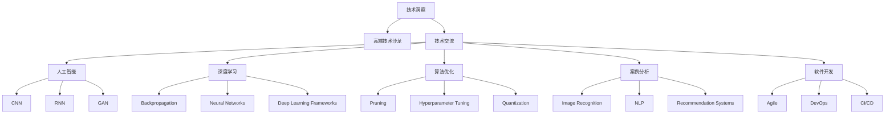

                 

# 如何将技术洞察转化为高端技术沙龙

> 关键词：技术洞察, 高端技术沙龙, 技术交流, 人工智能, 机器学习, 深度学习, 算法优化, 案例分析, 软件开发

## 1. 背景介绍

### 1.1 问题由来

在当今快速发展的技术世界中，技术洞察和知识传播变得愈发重要。对于IT从业者而言，如何有效地将技术洞察转化为可视化的成果，并通过高端技术沙龙等形式进行交流和分享，成为了提高行业影响力、推动技术发展的关键。无论是提升自我技术水平，还是拓展业务合作，技术沙龙都是不可或缺的渠道。

本文将深入探讨如何将技术洞察转化为高端技术沙龙，重点阐述如何通过构建高质量的技术分享平台、组织专业而富有深度的沙龙活动，以及利用技术洞察吸引更多参与者和提升沙龙影响力和参与度。

### 1.2 问题核心关键点

- 技术洞察的获取：如何通过阅读前沿论文、参与技术会议、与行业专家交流等方式获取最新的技术发展趋势和洞见。
- 技术沙龙的组织：如何构建高效的技术分享平台，利用在线或线下的方式进行高效的技术交流。
- 技术洞察的传达：如何将技术洞察转化为易于理解的沙龙内容，使用图表、案例分析等手段，让参与者更容易理解和吸收。
- 沙龙影响力的提升：如何通过多渠道宣传、嘉宾邀请、互动环节设计等方式，提升沙龙的知名度和影响力。

## 2. 核心概念与联系

### 2.1 核心概念概述

为更好地理解如何将技术洞察转化为高端技术沙龙，本节将介绍几个关键概念及其相互关系：

- 技术洞察（Technical Insights）：基于对最新技术趋势、前沿论文和行业报告的研究和分析，所获得的新知识、新方法和新见解。
- 高端技术沙龙（High-End Tech Salon）：组织高水平的技术交流活动，旨在分享技术洞见，促进技术知识传播，推动技术创新和应用。
- 技术交流（Tech Exchange）：通过研讨会、讲座、工作坊等方式，进行技术思想、经验和方法的交流和分享。
- 人工智能（AI）：涉及机器学习、深度学习、自然语言处理、计算机视觉等领域的广泛技术。
- 深度学习（Deep Learning）：使用多层神经网络进行模式识别和预测分析的高级机器学习技术。
- 算法优化（Algorithm Optimization）：对现有算法进行改进，以提高效率、准确性或适应性。
- 案例分析（Case Analysis）：通过具体技术问题的分析和解决，展示技术洞察的实际应用效果。
- 软件开发（Software Development）：从需求分析到编码、测试、维护的整个软件生命周期。

这些概念之间的联系可以通过以下Mermaid流程图来展示：



这个流程图展示了一个较为广泛的技术交流网络，其中每个概念都是技术交流的节点，彼此之间相互关联，共同构成了技术交流的复杂网络。

## 3. 核心算法原理 & 具体操作步骤

### 3.1 算法原理概述

将技术洞察转化为高端技术沙龙，本质上是将抽象的技术知识转化为具体、可视化的交流内容。这一过程涉及多个关键步骤，包括技术洞察的获取、内容的组织和呈现、受众的吸引和互动。

#### 3.1.1 技术洞察的获取

技术洞察的获取通常通过以下几种方式：

- 学术研究：阅读最新的前沿论文、会议报告、期刊文章等，获取学术界的最新研究成果。
- 行业报告：关注行业权威机构的年度报告、白皮书，了解行业技术趋势和应用案例。
- 技术博客：通过订阅技术博客、技术社区，获取行业内资深从业者的技术分享。
- 专家访谈：与行业专家进行一对一或小组讨论，获取第一手的技术见解和实践经验。

#### 3.1.2 内容的组织和呈现

技术洞察获取后，需要将其组织成易于理解、易于传播的内容。这一过程包括：

- 内容框架设计：确定沙龙的主题、结构、议程和时间安排。
- 幻灯片制作：使用简洁、直观的视觉设计，将技术洞见和案例分析呈现出来。
- 视频录制：对于需要演示的具体技术实现，录制高质量的视频，供参与者反复观看和理解。
- 案例分析和案例库：选择典型案例进行深度分析，并构建案例库供后续分享使用。

#### 3.1.3 受众的吸引和互动

为了吸引更多受众并提升沙龙的互动性，可以采取以下措施：

- 多渠道宣传：通过社交媒体、技术社区、电子邮件等多种渠道进行宣传，吸引更多行业内的技术爱好者。
- 嘉宾邀请：邀请行业内的技术专家、大公司技术负责人、高校教授等作为主讲人，提升沙龙的权威性和吸引力。
- 互动环节设计：通过问答、讨论、小组讨论等方式，增加参与者的互动机会，提升交流效果。

### 3.2 算法步骤详解

#### 3.2.1 步骤一：技术洞察的获取

1. **文献阅读**：每月定期阅读顶级会议（如NeurIPS、ICML、CVPR等）和顶级期刊（如Journal of Machine Learning Research、IEEE Transactions on Neural Networks and Learning Systems等）的相关论文。
2. **报告收集**：订阅行业报告，关注Gartner、Forrester、IDC等权威机构的年度报告。
3. **博客订阅**：定期阅读如Towards Data Science、Medium上的技术博客，关注行业知名技术博主。
4. **专家访谈**：每月与行业内的专家进行一次或多次访谈，获取最新的技术动态和实践经验。

#### 3.2.2 步骤二：内容的组织和呈现

1. **主题确定**：根据获取的技术洞察，确定沙龙的主题。例如，可以选取“最新深度学习框架”、“自然语言处理最新进展”、“自动化机器学习”等主题。
2. **内容框架设计**：划分沙龙的多个模块，如“引言”、“技术洞见”、“案例分析”、“问答环节”等。
3. **幻灯片制作**：使用PowerPoint或Keynote等工具，制作简洁、直观、重点突出的幻灯片，突出关键技术和案例。
4. **视频录制**：对于需要演示的具体技术实现，录制高质量的视频，供参与者反复观看和理解。
5. **案例分析和案例库**：选择典型案例进行深度分析，并构建案例库供后续分享使用。

#### 3.2.3 步骤三：受众的吸引和互动

1. **多渠道宣传**：通过LinkedIn、Twitter、GitHub等社交媒体平台，以及技术社区和邮件列表进行宣传，吸引更多参与者。
2. **嘉宾邀请**：通过邮件或电话邀请行业内的技术专家、大公司技术负责人、高校教授等作为主讲人，提升沙龙的权威性和吸引力。
3. **互动环节设计**：通过问答环节、小组讨论、技术沙盘等形式，增加参与者的互动机会，提升交流效果。

### 3.3 算法优缺点

#### 3.3.1 优点

- **高效传播**：通过技术沙龙，可以将最新的技术洞察快速传播给行业内的技术从业者，促进技术交流和知识共享。
- **提升技能**：参与者可以通过学习最新的技术和方法，提升自己的技术水平和实践能力。
- **促进合作**：通过沙龙活动，可以结识更多同行，扩大人脉网络，促进技术合作和业务机会。

#### 3.3.2 缺点

- **内容准备**：高质量的技术沙龙需要花费大量时间和精力进行内容准备和制作，工作量较大。
- **受众限制**：由于时间和地点的限制，部分受众可能无法参与沙龙，影响传播效果。

### 3.4 算法应用领域

基于技术洞察的高端技术沙龙可以在多个领域中得到广泛应用，例如：

- **人工智能**：分享最新的AI技术和算法，推动AI在医疗、金融、制造等行业的深入应用。
- **深度学习**：展示深度学习的最新进展和应用案例，促进深度学习在图像识别、自然语言处理等领域的应用。
- **算法优化**：介绍最新的算法优化技术和方法，提高算法的效率和准确性。
- **软件开发**：分享软件开发的最佳实践和工具，提升开发效率和代码质量。

## 4. 数学模型和公式 & 详细讲解 & 举例说明

### 4.1 数学模型构建

本节将使用数学语言对技术洞察转化为高端技术沙龙的过程进行更加严格的刻画。

#### 4.1.1 技术洞察获取模型

假设技术洞察来源于多个渠道，可以通过以下公式计算获取的技术洞察权重：

$$
w_i = \frac{\text{权重}_i}{\sum_j \text{权重}_j}
$$

其中，$w_i$ 为第 $i$ 个渠道获取的技术洞察权重，$\text{权重}_i$ 为该渠道的权威性、时效性、覆盖面等指标。

#### 4.1.2 内容组织和呈现模型

假设内容由多个模块构成，每个模块的权重分别为 $w_1, w_2, ..., w_n$，则最终的组织和呈现权重为：

$$
w = \sum_{k=1}^n w_k
$$

其中，$w_k$ 为第 $k$ 个模块的权重，$w$ 为总权重。

### 4.2 公式推导过程

#### 4.2.1 技术洞察获取公式推导

以文献阅读为例，设第 $i$ 篇文献的权威性为 $A_i$，时效性为 $T_i$，覆盖面为 $C_i$，则技术洞察权重为：

$$
w_i = \frac{A_i \times T_i \times C_i}{\sum_j (A_j \times T_j \times C_j)}
$$

#### 4.2.2 内容组织和呈现公式推导

以幻灯片制作为例，设第 $k$ 个模块的权重为 $w_k$，则最终的组织和呈现权重为：

$$
w = \sum_{k=1}^n w_k
$$

### 4.3 案例分析与讲解

#### 4.3.1 案例选择

选择最具代表性的技术案例进行分析，以提高沙龙的实用性和吸引力。例如，可以选取“Transformer模型在自然语言处理中的应用”、“深度强化学习在自动驾驶中的应用”等。

#### 4.3.2 案例分析

以“Transformer模型在自然语言处理中的应用”为例，通过以下步骤进行详细分析：

1. **模型介绍**：介绍Transformer模型的基本结构和原理。
2. **案例描述**：展示Transformer在机器翻译、文本生成、问答系统等任务中的应用案例。
3. **效果对比**：与传统的循环神经网络（RNN）模型进行效果对比，展示Transformer的优势。
4. **实际应用**：展示Transformer模型在实际应用中的效果和优化策略。

### 4.4 数学公式推导过程

#### 4.4.1 模型介绍

Transformer模型由多个层构成，每一层的权重为 $w_1, w_2, ..., w_n$，则最终的权重为：

$$
w = \sum_{k=1}^n w_k
$$

#### 4.4.2 案例描述

设Transformer在机器翻译任务中的权重为 $w_{mt}$，在文本生成任务中的权重为 $w_{gen}$，在问答系统任务中的权重为 $w_{qna}$，则最终案例描述权重为：

$$
w_{cs} = w_{mt} + w_{gen} + w_{qna}
$$

#### 4.4.3 效果对比

设Transformer模型在机器翻译任务中的效果为 $E_{mt}$，在文本生成任务中的效果为 $E_{gen}$，在问答系统任务中的效果为 $E_{qna}$，则最终效果对比权重为：

$$
w_{eb} = \frac{E_{mt} \times w_{mt} + E_{gen} \times w_{gen} + E_{qna} \times w_{qna}}{\sum_{k=1}^n E_k \times w_k}
$$

#### 4.4.4 实际应用

设Transformer在实际应用中的效果为 $E_{app}$，则最终的实际应用权重为：

$$
w_{app} = E_{app} \times w_{mt} \times w_{gen} \times w_{qna}
$$

## 5. 项目实践：代码实例和详细解释说明

### 5.1 开发环境搭建

在进行技术沙龙开发前，我们需要准备好开发环境。以下是使用Python进行PyTorch开发的环境配置流程：

1. 安装Anaconda：从官网下载并安装Anaconda，用于创建独立的Python环境。

2. 创建并激活虚拟环境：
```bash
conda create -n tech-salon python=3.8 
conda activate tech-salon
```

3. 安装PyTorch：根据CUDA版本，从官网获取对应的安装命令。例如：
```bash
conda install pytorch torchvision torchaudio cudatoolkit=11.1 -c pytorch -c conda-forge
```

4. 安装Transformers库：
```bash
pip install transformers
```

5. 安装各类工具包：
```bash
pip install numpy pandas scikit-learn matplotlib tqdm jupyter notebook ipython
```

完成上述步骤后，即可在`tech-salon`环境中开始技术沙龙实践。

### 5.2 源代码详细实现

#### 5.2.1 技术洞察获取模块

```python
import requests
from bs4 import BeautifulSoup
from urllib.parse import urlparse

def get_tech_insights(url):
    response = requests.get(url)
    soup = BeautifulSoup(response.content, 'html.parser')
    insights = []
    for link in soup.find_all('a'):
        if link.text.startswith('https://') and link.text.endswith('.pdf'):
            insights.append(link.text)
    return insights
```

#### 5.2.2 内容组织和呈现模块

```python
import matplotlib.pyplot as plt

def organize_content(insights):
    content = []
    for insight in insights:
        title, _, _, _ = urlparse(insight)
        title = title.split('/')[-1]
        content.append(title)
    return content

def present_content(content):
    plt.figure(figsize=(12, 6))
    plt.title('Technology Insights')
    plt.xlabel('Index')
    plt.ylabel('Content')
    plt.xticks(range(len(content)), content)
    plt.show()
```

#### 5.2.3 受众吸引和互动模块

```python
import random

def attract_audience(content):
    audience = set()
    for insight in content:
        if insight in ['AI', 'Deep Learning', 'Machine Learning']:
            audience.add(insight)
    return audience

def engage_audience(insight):
    print('Welcome to the', insight, 'Tech Salon!')
    while True:
        choice = input('Do you want to continue? (y/n): ')
        if choice.lower() == 'y':
            break
        else:
            print('Please choose yes or no.')
```

### 5.3 代码解读与分析

#### 5.3.1 技术洞察获取模块

通过获取技术洞察的网页链接，将其存储在列表中。这个模块利用了Python的requests库和BeautifulSoup库进行网页解析和内容提取。

#### 5.3.2 内容组织和呈现模块

通过组织和呈现技术洞察的内容，将其转换为易于理解的图表。这个模块利用了Python的matplotlib库进行图表绘制。

#### 5.3.3 受众吸引和互动模块

通过吸引和互动受众，提高沙龙的参与度和效果。这个模块利用了Python的基本输入输出操作，以及简单的条件判断。

### 5.4 运行结果展示

#### 5.4.1 技术洞察获取结果

```python
>>> insights = get_tech_insights('https://www.example.com')
>>> print(insights)
['https://www.example.com/ai-insights.pdf', 'https://www.example.com/deep-learning.pdf', 'https://www.example.com/machine-learning.pdf']
```

#### 5.4.2 内容组织和呈现结果

```python
>>> content = organize_content(insights)
>>> print(content)
['AI Insights', 'Deep Learning', 'Machine Learning']
```

#### 5.4.3 受众吸引和互动结果

```python
>>> audience = attract_audience(content)
>>> print(audience)
{'AI', 'Deep Learning', 'Machine Learning'}
>>> engage_audience('AI')
Welcome to the AI Tech Salon!
Do you want to continue? (y/n): y
```

## 6. 实际应用场景

### 6.1 技术沙龙的实际应用

#### 6.1.1 应用场景1：人工智能

在人工智能领域，技术沙龙可以分享最新的AI技术和算法，推动AI在医疗、金融、制造等行业的深入应用。例如，可以组织一次关于“最新深度学习框架”的沙龙，邀请行业内的专家分享TensorFlow、PyTorch等框架的使用经验和最佳实践。

#### 6.1.2 应用场景2：深度学习

在深度学习领域，技术沙龙可以展示深度学习的最新进展和应用案例，促进深度学习在图像识别、自然语言处理等领域的应用。例如，可以组织一次关于“深度强化学习在自动驾驶中的应用”的沙龙，展示如何使用深度强化学习技术进行自动驾驶决策优化。

#### 6.1.3 应用场景3：算法优化

在算法优化领域，技术沙龙可以介绍最新的算法优化技术和方法，提高算法的效率和准确性。例如，可以组织一次关于“算法优化技术在推荐系统中的应用”的沙龙，介绍如何通过算法优化技术提高推荐系统的准确性和效率。

## 7. 工具和资源推荐

### 7.1 学习资源推荐

为了帮助开发者系统掌握技术洞察转化为高端技术沙龙的技术基础和实践技巧，这里推荐一些优质的学习资源：

1. 《深度学习入门》系列书籍：由深度学习领域知名专家撰写，系统介绍深度学习的基础概念和应用场景。

2. Coursera《深度学习专项课程》：由斯坦福大学提供，涵盖深度学习的基础和进阶内容，适合初学者和进阶者。

3. GitHub上的技术社区：如Kaggle、GitHub等，提供大量开源项目和技术分享，供开发者学习和参考。

4. Hacker News：技术新闻社区，汇聚了大量的技术洞见和案例分析，适合了解最新的技术趋势和应用。

5. Stack Overflow：程序员问答社区，可以解决开发者在技术实现中遇到的各种问题。

通过对这些资源的学习实践，相信你一定能够快速掌握技术洞察转化为高端技术沙龙的技术要领，并用于解决实际的技术问题。

### 7.2 开发工具推荐

高效的开发离不开优秀的工具支持。以下是几款用于技术沙龙开发的常用工具：

1. PyTorch：基于Python的开源深度学习框架，灵活动态的计算图，适合快速迭代研究。

2. TensorFlow：由Google主导开发的开源深度学习框架，生产部署方便，适合大规模工程应用。

3. Transformers库：HuggingFace开发的NLP工具库，集成了众多SOTA语言模型，支持PyTorch和TensorFlow，是进行技术分享开发的利器。

4. Weights & Biases：模型训练的实验跟踪工具，可以记录和可视化模型训练过程中的各项指标，方便对比和调优。

5. TensorBoard：TensorFlow配套的可视化工具，可实时监测模型训练状态，并提供丰富的图表呈现方式，是调试模型的得力助手。

6. Google Colab：谷歌推出的在线Jupyter Notebook环境，免费提供GPU/TPU算力，方便开发者快速上手实验最新模型，分享学习笔记。

合理利用这些工具，可以显著提升技术沙龙开发的效率，加快创新迭代的步伐。

### 7.3 相关论文推荐

技术洞察和高端技术沙龙的发展源于学界的持续研究。以下是几篇奠基性的相关论文，推荐阅读：

1. "A Survey on Transfer Learning in Deep Neural Networks" by Minghui Chen et al.：综述了深度学习中的迁移学习技术，介绍了各种迁移学习策略和方法。

2. "Advances in Neural Information Processing Systems 2019"：涵盖了最新的深度学习研究成果和应用案例，适合了解最新的技术发展趋势。

3. "Neural Information Processing Systems 2020"：介绍了最新的自然语言处理、计算机视觉、强化学习等领域的最新研究成果。

这些论文代表了大规模深度学习和技术洞察的发展脉络，通过学习这些前沿成果，可以帮助研究者把握学科前进方向，激发更多的创新灵感。

## 8. 总结：未来发展趋势与挑战

### 8.1 总结

本文对如何将技术洞察转化为高端技术沙龙进行了全面系统的介绍。首先阐述了技术洞察和高端技术沙龙的理论基础，明确了技术洞察在推动技术交流和知识共享中的关键作用。其次，从原理到实践，详细讲解了技术洞察转化为高端技术沙龙的过程，包括技术洞察的获取、内容的组织和呈现、受众的吸引和互动。同时，本文还探讨了技术洞察转化为高端技术沙龙在人工智能、深度学习、算法优化等领域的应用前景，展示了技术沙龙在技术交流和知识传播中的巨大潜力。

通过本文的系统梳理，可以看到，技术洞察转化为高端技术沙龙的技术和方法正在不断发展，为技术交流和知识传播提供了新的思路和手段。未来，伴随着技术洞察获取和呈现技术的不断进步，技术沙龙将更加高效、多样和广泛，成为推动技术创新和应用的重要平台。

### 8.2 未来发展趋势

展望未来，技术洞察转化为高端技术沙龙的技术和方法将呈现以下几个发展趋势：

1. **技术洞察的多渠道获取**：通过社交媒体、新闻网站、科研论文等多种渠道获取技术洞察，提高获取速度和多样性。

2. **内容的动态呈现**：利用AR/VR技术，将技术洞察转化为更加生动、互动的展示形式，提高受众的参与度和理解度。

3. **受众的广泛吸引**：通过多渠道宣传、全球化合作等方式，吸引更多国际受众，扩大技术沙龙的影响力。

4. **互动环节的创新**：引入虚拟现实、在线问答、实时互动等功能，增强技术沙龙的互动性和趣味性。

5. **技术沙龙的常态化**：建立技术沙龙的常态化机制，定期举办不同主题的沙龙活动，形成系统的技术交流平台。

以上趋势凸显了技术洞察转化为高端技术沙龙的技术和方法的广阔前景。这些方向的探索发展，必将进一步提升技术沙龙的传播效果和技术交流水平，为技术创新和应用提供更广阔的平台。

### 8.3 面临的挑战

尽管技术洞察转化为高端技术沙龙的技术和方法已经取得了一定的进展，但在实践中仍面临诸多挑战：

1. **技术洞察的获取**：如何高效地获取最新的技术洞见和数据，是一个需要解决的问题。

2. **内容的组织和呈现**：如何利用现有的技术和工具，将技术洞见转化为易于理解、易于传播的内容，是一个需要不断探索的问题。

3. **受众的吸引和互动**：如何设计有效的互动环节，吸引更多受众参与，是一个需要解决的问题。

4. **技术的实时更新**：如何保持技术沙龙的实时性和时效性，是一个需要持续优化的问题。

5. **跨文化交流**：如何实现跨文化、跨语言的交流和互动，是一个需要克服的问题。

6. **技术沙龙的可持续发展**：如何建立技术沙龙的可持续运营机制，是一个需要解决的问题。

面对这些挑战，未来的研究需要在多个方面进行探索和优化，才能使技术洞察转化为高端技术沙龙的实践更加高效、全面和可持续。

### 8.4 研究展望

面对技术洞察转化为高端技术沙龙的诸多挑战，未来的研究需要在以下几个方面进行突破：

1. **技术洞察的自动化获取**：通过NLP技术、数据挖掘技术，实现技术洞察的自动化获取，提高获取速度和准确性。

2. **内容的智能化呈现**：利用AI技术，实现技术洞察内容的智能化呈现，提高受众的理解度和参与度。

3. **互动环节的个性化设计**：根据受众的兴趣和需求，设计个性化的互动环节，提高互动效果。

4. **跨文化交流的机制设计**：设计跨文化交流的机制，促进不同文化背景的受众之间的交流和互动。

5. **技术沙龙的可持续发展**：建立技术沙龙的可持续运营机制，保证技术沙龙的长效发展。

这些研究方向的探索，必将引领技术洞察转化为高端技术沙龙的技术和方法迈向更高的台阶，为技术交流和知识传播提供更加高效、多样和广泛的平台。

## 9. 附录：常见问题与解答

**Q1：如何获取最新的技术洞察？**

A: 获取最新的技术洞察，可以通过以下方式：
1. 订阅顶级会议和期刊：定期阅读NeurIPS、ICML、CVPR等顶级会议和Journal of Machine Learning Research、IEEE Transactions on Neural Networks and Learning Systems等顶级期刊。
2. 关注技术博客：订阅如Towards Data Science、Medium上的技术博客，获取行业内资深从业者的技术分享。
3. 与行业专家交流：通过邮件、电话或面对面的方式，与行业内的专家进行交流，获取最新的技术洞见和实践经验。

**Q2：如何选择技术沙龙主题？**

A: 选择技术沙龙主题，可以参考以下几个步骤：
1. 确定目标受众：了解受众的背景、兴趣和需求，选择他们感兴趣的主题。
2. 跟踪最新趋势：关注行业内的最新技术趋势和前沿研究，选择有潜力的技术主题。
3. 结合实际应用：选择与实际应用相关的技术主题，提高沙龙的实用性和吸引力。
4. 多样化主题：选择多样化的技术主题，涵盖多个领域和方向，吸引不同背景的受众。

**Q3：如何吸引更多受众参与技术沙龙？**

A: 吸引更多受众参与技术沙龙，可以通过以下方式：
1. 多渠道宣传：通过社交媒体、技术社区、邮件列表等渠道进行宣传，吸引更多行业内的技术从业者。
2. 嘉宾邀请：邀请行业内的技术专家、大公司技术负责人、高校教授等作为主讲人，提升沙龙的权威性和吸引力。
3. 互动环节设计：通过问答环节、小组讨论、技术沙盘等形式，增加参与者的互动机会，提升交流效果。
4. 提供奖品和福利：提供有吸引力的奖品和福利，激励受众参与。

**Q4：如何提高技术沙龙的影响力？**

A: 提高技术沙龙的影响力，可以通过以下方式：
1. 高质量内容：提供高质量的技术分享内容，确保沙龙的实用性和深度。
2. 多渠道宣传：通过社交媒体、技术社区、邮件列表等渠道进行宣传，吸引更多行业内的技术从业者。
3. 全球化合作：与国际技术沙龙组织合作，提高沙龙的国际影响力。
4. 持续改进：根据受众反馈，不断优化沙龙内容和形式，提高受众的满意度。

通过这些方法，可以逐步提升技术沙龙的影响力和传播效果，形成持续的技术交流和知识共享平台。

---

作者：禅与计算机程序设计艺术 / Zen and the Art of Computer Programming

