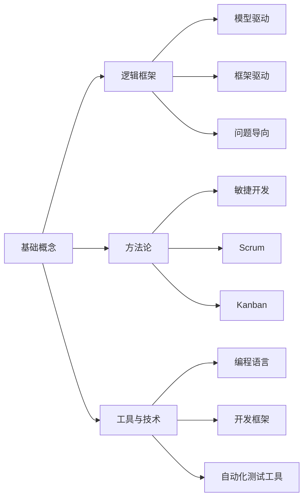

                 

# 如何建立个人的思维体系

## 1. 背景介绍

### 1.1 问题由来

在当今这个信息爆炸的时代，科技的发展日新月异，全球化的影响日益加深，人们的生活节奏不断加快，面对复杂多变的环境，如何建立一套高效、系统的思维体系，以应对各种挑战，成为了我们每个人都必须面对的问题。

### 1.2 问题核心关键点

构建个人思维体系的核心在于理解、应用和创新，需要从基础概念、逻辑框架、方法论等多个维度进行系统的思考与整合。核心概念的掌握与理解是基础，逻辑框架的构建与应用是核心，而方法论的创新与实践则是最终目的。

## 2. 核心概念与联系

### 2.1 核心概念概述

构建个人思维体系的关键概念包括但不限于：

- **基础概念**：如计算思维、批判性思维、系统性思维、逻辑推理等。
- **逻辑框架**：如模型驱动、框架驱动、问题导向等。
- **方法论**：如敏捷开发、Scrum、Kanban等。
- **工具与技术**：如编程语言、开发框架、自动化测试工具等。

### 2.2 核心概念原理和架构的 Mermaid 流程图



这个流程图展示了基础概念、逻辑框架、方法论、工具与技术之间的相互联系与支持关系。

## 3. 核心算法原理 & 具体操作步骤

### 3.1 算法原理概述

建立个人思维体系并非一蹴而就，而是一个不断学习、实践与迭代的过程。这其中涉及到了知识的获取、理解与应用，以及将知识系统化、结构化的能力。

### 3.2 算法步骤详解

1. **知识获取与理解**：通过阅读、学习、讨论等方式，获取新的知识和技能。理解这些知识背后的原理与逻辑，并能够将其应用于实践。

2. **知识整合与系统化**：将获取的知识整合到已有的知识体系中，构建起自己的知识网络。这一过程需要不断地审视、调整与优化，以确保知识体系的完整性与逻辑性。

3. **实践与应用**：将整合后的知识应用于实际问题解决过程中，通过实践验证知识的有效性，并不断进行迭代与优化。

### 3.3 算法优缺点

**优点**：

- 能够将知识系统化、结构化，便于检索与应用。
- 通过不断的实践与迭代，能够提升自身的综合能力。

**缺点**：

- 构建知识体系的过程可能需要较长的时间，且需要持续的投入与努力。
- 构建的知识体系可能过于复杂，难以在实际应用中进行快速应用。

### 3.4 算法应用领域

建立个人思维体系的方法论不仅适用于技术领域，同样适用于管理、教育、生活等多个领域。其核心思想是通用的，可以用于提升各种职业与生活中的效率与效果。

## 4. 数学模型和公式 & 详细讲解 & 举例说明

### 4.1 数学模型构建

建立个人思维体系的过程可以用一个简单的数学模型来描述：

$$
\text{知识体系} = \text{知识获取} \times \text{知识整合} \times \text{知识应用}
$$

### 4.2 公式推导过程

- **知识获取**：可以通过阅读、课程学习、项目实践等方式获取知识，可以表示为 $K_{获取}$。
- **知识整合**：需要将获取的知识整合并形成系统化的知识体系，可以表示为 $K_{整合}$。
- **知识应用**：将系统化的知识应用于实际问题解决中，可以表示为 $K_{应用}$。

因此，建立知识体系的公式可以表示为：

$$
K_{体系} = K_{获取} \times K_{整合} \times K_{应用}
$$

### 4.3 案例分析与讲解

假设你是一名软件工程师，通过阅读最新的技术博客、参加在线课程、参与开源项目等方式获取新的编程知识。

- **知识获取**：阅读最新的技术博客，获取新的编程技巧与工具。
- **知识整合**：将获取的知识整合到自己的技术栈中，形成系统的编程知识体系。
- **知识应用**：将这些知识应用于实际的项目开发中，提升项目开发效率与质量。

通过这一过程，你的技术水平不断提升，并逐渐成为团队中的技术骨干。

## 5. 项目实践：代码实例和详细解释说明

### 5.1 开发环境搭建

假设你是一名软件工程师，以下是开发环境的搭建步骤：

1. **安装IDE**：选择一个适合自己的集成开发环境，如Visual Studio Code、PyCharm等。
2. **配置环境变量**：设置Java环境变量、Python环境变量等。
3. **安装依赖包**：安装所需的依赖包，如Git、GitHub、JDK等。

### 5.2 源代码详细实现

以下是一个简单的Python项目实践示例：

```python
# 定义一个简单的函数，用于计算两个数的和
def add_numbers(x, y):
    return x + y

# 测试函数
result = add_numbers(3, 5)
print(result)
```

### 5.3 代码解读与分析

- **函数定义**：定义了一个名为`add_numbers`的函数，接收两个参数，返回它们的和。
- **函数调用**：通过调用`add_numbers(3, 5)`计算了3和5的和，并将结果赋值给变量`result`。
- **输出结果**：使用`print`函数输出计算结果。

### 5.4 运行结果展示

运行上述代码，输出结果为：

```
8
```

这表明函数计算正确，将3和5相加得到了8。

## 6. 实际应用场景

### 6.1 软件开发

在软件开发过程中，建立个人思维体系可以提升软件开发生命周期各个阶段的工作效率，包括需求分析、设计、编码、测试、维护等。通过系统化的知识体系，可以有效应对各种复杂的技术问题。

### 6.2 项目管理

在项目管理中，通过建立系统化的知识体系，可以更好地理解和应用项目管理工具与方法，如敏捷开发、Scrum、Kanban等。这将有助于提高项目的成功率，提升团队的整体工作效率。

### 6.3 教学与培训

在教学与培训过程中，建立系统化的知识体系可以更好地组织课程内容，设计教学方法，提升学生的学习效果。同时，教师也可以通过不断学习和实践，提升自己的教学水平。

### 6.4 未来应用展望

未来，建立个人思维体系的方法将进一步与人工智能、大数据、云计算等新兴技术相结合，为个人能力提升带来更多可能性。通过构建智能化的知识体系，可以更高效地处理大量数据，发现知识间的关联，提升决策质量。

## 7. 工具和资源推荐

### 7.1 学习资源推荐

- **书籍**：《系统思考》、《创新者的窘境》、《设计思维》等。
- **在线课程**：Coursera、Udacity、edX等平台上的计算机科学、项目管理、设计思维等课程。
- **社区**：Stack Overflow、GitHub、Kaggle等技术社区，可以帮助你获取最新的技术动态和资源。

### 7.2 开发工具推荐

- **IDE**：Visual Studio Code、PyCharm、IntelliJ IDEA等。
- **版本控制**：Git、GitHub等。
- **项目管理**：JIRA、Trello、Asana等。

### 7.3 相关论文推荐

- **系统思考**：《System Dynamics: Foundations and Applications》。
- **设计思维**：《Design Thinking: Integrating Innovation, Customer Experience, and Brand Value》。
- **敏捷开发**：《Agile Software Development: Principles, Patterns, and Practices》。

## 8. 总结：未来发展趋势与挑战

### 8.1 研究成果总结

建立个人思维体系是一个持续的过程，需要不断地学习和实践。通过不断的积累与迭代，可以逐步构建起系统化的知识体系，提升自身的能力与效率。

### 8.2 未来发展趋势

- **人工智能与知识体系结合**：未来的知识体系将更多地与人工智能、大数据等新兴技术相结合，通过智能化工具提升知识获取与整合的效率。
- **跨领域应用**：知识体系的应用将不再局限于技术领域，更多地扩展到管理、教育、生活等多个领域。
- **个性化定制**：未来的知识体系将更多地关注个性化需求，通过智能化的推荐系统，提供更加个性化的学习路径与资源。

### 8.3 面临的挑战

- **时间与精力的投入**：建立知识体系需要投入大量的时间与精力，可能对日常工作生活造成一定的影响。
- **知识体系的复杂性**：构建的知识体系可能过于复杂，难以在实际应用中进行快速应用。
- **技术的变化**：随着技术的发展，原有的知识体系可能不再适用，需要不断更新与调整。

### 8.4 研究展望

未来的研究将继续关注知识体系的构建与优化，探索更多智能化工具的应用，提升知识获取与整合的效率。同时，也将关注跨领域应用，提供更多的学习资源与工具，帮助更多的人构建高效的系统化知识体系。

## 9. 附录：常见问题与解答

### Q1: 建立个人思维体系需要多长时间？

A: 建立个人思维体系需要的时间因人而异，取决于个人的学习能力和投入程度。一般来说，需要长期持续的学习与实践，才能逐步构建起系统的知识体系。

### Q2: 如何平衡工作与学习？

A: 可以通过时间管理与优先级排序，将学习时间纳入日常工作生活中。例如，可以利用通勤时间、午休时间等零碎时间进行学习。

### Q3: 如何选择合适的学习资源？

A: 可以根据个人兴趣与需求，选择适合的书籍、在线课程、社区等资源。同时，可以通过向同事、朋友咨询，获取推荐。

### Q4: 如何保持学习的动力？

A: 可以通过设定学习目标、加入学习小组、参与学习竞赛等方式，保持学习的动力。同时，定期回顾学习成果，总结经验教训，也是提升学习效果的重要方法。

### Q5: 如何应用所学知识？

A: 通过项目实践、技术博客、教学等方式，将所学知识应用于实际问题解决中。同时，不断反思与改进，提升知识的实际应用效果。

---

作者：禅与计算机程序设计艺术 / Zen and the Art of Computer Programming

