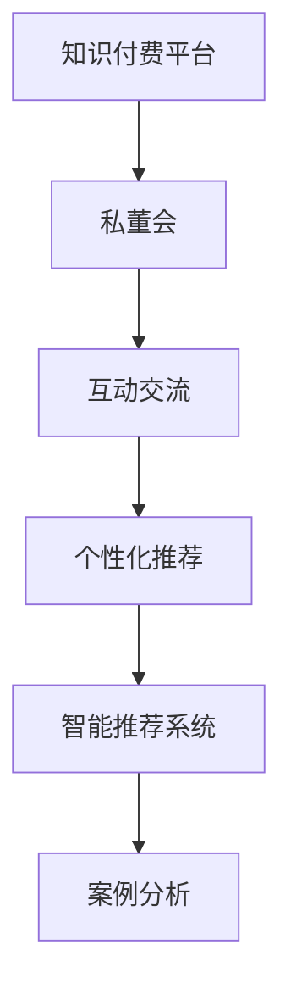

                 

# 如何打造个人知识付费私董会

## 1. 背景介绍

### 1.1 问题由来
随着互联网的普及和数字经济的崛起，个人知识付费领域逐渐成为新经济的重要组成部分。然而，传统的知识付费平台多以内容驱动，缺乏个性化互动和用户参与，导致用户流失率高，收益模式单一。为解决这一问题，打造一个既能提供高质量知识内容，又能通过互动交流提升用户价值和黏性的个人知识付费私董会应运而生。

### 1.2 问题核心关键点
1. **用户个性化需求**：知识付费平台需要精细化运营，通过用户画像分析，精准推荐个性化内容，提升用户满意度。
2. **互动交流机制**：构建多样化的互动交流平台，如实时问答、在线讨论、案例分析等，增强用户参与感。
3. **隐私安全保护**：确保用户数据安全和隐私保护，避免信息泄露和滥用。
4. **灵活订阅模式**：设计灵活的付费模式，如按需付费、会员制等，满足不同用户需求。
5. **高效内容生产**：采用智能推荐和自动生成技术，提升内容产出效率和质量。
6. **知识转化应用**：通过实践项目和模拟场景，促进知识转化，提升用户应用能力。

### 1.3 问题研究意义
打造个人知识付费私董会，不仅能够为个人知识创作者提供更大的平台，促进其内容创作和收益增长，还能帮助用户获取更专业、更具实用性的知识，实现个人能力提升和职业发展。这一创新模式有望成为新经济时代知识共享和价值创造的新范式。

## 2. 核心概念与联系

### 2.1 核心概念概述

为更好地理解个人知识付费私董会的构建原理，本节将介绍几个关键概念：

- **知识付费平台**：提供各类知识内容的在线平台，用户通过付费获取专业知识、技能和经验。
- **私董会**：由一群有共同兴趣和目标的人组成的小型团体，定期举行会议，交流分享，共同成长。
- **互动交流**：通过各类线上线下活动，促进用户之间的交流和合作，增强用户参与感。
- **个性化推荐**：利用用户画像和行为数据，精准推荐个性化内容，提升用户满意度。
- **智能推荐系统**：基于机器学习等技术，自动分析用户偏好和需求，推荐相关内容。
- **案例分析**：通过真实案例和模拟场景，帮助用户理解和应用所学知识。

这些概念之间的逻辑关系可以通过以下Mermaid流程图来展示：



这个流程图展示了几项关键功能的关联关系：

1. **知识付费平台**：作为整体架构的基础，提供各类知识内容。
2. **私董会**：通过定期活动，增强用户互动和参与感。
3. **互动交流**：提供用户交流分享的平台和机会。
4. **个性化推荐**：根据用户画像，精准推荐个性化内容。
5. **智能推荐系统**：基于数据和算法，自动推荐相关内容。
6. **案例分析**：通过具体案例，帮助用户理解和应用所学知识。

## 3. 核心算法原理 & 具体操作步骤
### 3.1 算法原理概述

个人知识付费私董会的核心算法原理主要涉及以下几个方面：

- **用户画像构建**：通过用户行为数据，构建详细的用户画像，包括兴趣偏好、专业背景、学习需求等。
- **内容推荐算法**：基于用户画像，使用协同过滤、内容召回、深度学习等算法，精准推荐个性化内容。
- **互动交流机制**：设计实时问答、在线讨论、案例分析等互动交流功能，促进用户之间的互动和合作。
- **隐私保护技术**：采用数据加密、访问控制、匿名化处理等技术，确保用户数据的安全和隐私。

### 3.2 算法步骤详解

以下详细介绍打造个人知识付费私董会的关键算法步骤：

**Step 1: 用户画像构建**
- 收集用户基本信息，如年龄、职业、教育背景等。
- 分析用户行为数据，包括浏览、点赞、评论等互动记录。
- 使用聚类、分类、回归等机器学习技术，构建详细的用户画像。

**Step 2: 内容推荐算法**
- 使用协同过滤算法，通过分析用户行为数据，推荐相似用户喜欢的内容。
- 利用内容召回算法，基于文本相似度、主题相关性等指标，推荐相关主题下的文章和视频。
- 引入深度学习算法，如RNN、CNN、BERT等，建立用户行为和内容特征之间的关联模型。

**Step 3: 互动交流机制**
- 设计实时问答系统，用户可以实时向专家提问，专家快速解答。
- 建立在线讨论组，用户可以就特定话题进行深入交流。
- 组织案例分析活动，通过真实案例和模拟场景，帮助用户理解和应用所学知识。

**Step 4: 隐私保护技术**
- 采用数据加密技术，对用户数据进行加密存储和传输。
- 实施访问控制策略，确保只有授权用户才能访问和操作数据。
- 采用匿名化处理技术，保护用户隐私，防止数据泄露。

### 3.3 算法优缺点

**优点**：
1. **精准推荐**：通过详细的用户画像和先进的推荐算法，能够精准推荐用户感兴趣的内容。
2. **高效互动**：通过多样化的互动交流机制，增强用户参与感和满意度。
3. **隐私保护**：通过先进的隐私保护技术，确保用户数据的安全和隐私。
4. **灵活付费**：设计灵活的付费模式，满足不同用户需求。

**缺点**：
1. **技术复杂**：构建精准推荐和互动交流系统，涉及复杂的数据处理和算法设计。
2. **成本高昂**：需要大量的数据和计算资源，初期投入成本较高。
3. **用户信任**：需要建立和维护用户信任，确保平台和内容的安全性。

### 3.4 算法应用领域

个人知识付费私董会可以应用于多个领域，提升用户的知识和技能：

1. **技术培训**：通过技术专家和实战案例，帮助用户掌握最新的技术趋势和实用技能。
2. **职业发展**：提供职业规划、求职技巧、面试技巧等知识，帮助用户提升职业竞争力。
3. **创业指导**：通过创业案例和专家分享，帮助创业者解决实际问题和提升决策能力。
4. **健康管理**：提供健康饮食、运动指导、心理健康等知识，帮助用户提升健康水平。
5. **艺术与设计**：通过艺术作品赏析、设计案例分析，提升用户的艺术修养和设计能力。

## 4. 数学模型和公式 & 详细讲解
### 4.1 数学模型构建

以下我们以用户画像构建和推荐算法为例，详细讲解个人知识付费私董会的数学模型构建过程。

假设用户画像由多个特征维度组成，记为 $X = [x_1, x_2, ..., x_n]$。用户画像的构建过程可以看作是一个线性回归问题，即找到一个线性模型 $f(X) = WX + b$，使得模型预测值与实际值尽可能接近。

记实际值为 $Y$，则最小化损失函数 $L$ 的目标为：

$$
L = \frac{1}{N}\sum_{i=1}^N (y_i - f(x_i))^2
$$

其中 $N$ 为样本数量，$y_i$ 为第 $i$ 个样本的实际值，$x_i$ 为第 $i$ 个样本的特征向量。

### 4.2 公式推导过程

基于上述模型，我们可以使用梯度下降法求解 $W$ 和 $b$，使得 $L$ 最小化。具体的推导过程如下：

$$
\frac{\partial L}{\partial W} = -2\frac{1}{N}\sum_{i=1}^N (y_i - f(x_i))x_i
$$

$$
\frac{\partial L}{\partial b} = -2\frac{1}{N}\sum_{i=1}^N (y_i - f(x_i))
$$

通过求解上述梯度，得到最优的 $W$ 和 $b$ 值，即为用户画像的模型参数。

### 4.3 案例分析与讲解

以用户画像构建为例，我们假设有一个用户画像数据集，包含用户的年龄、职业、教育背景、兴趣偏好等特征。我们可以将每个特征进行编码，使用向量 $X_i$ 表示第 $i$ 个用户，其中 $X_i = [a_i, j_i, e_i, p_i]$，$a_i$ 表示年龄，$j_i$ 表示职业，$e_i$ 表示教育背景，$p_i$ 表示兴趣偏好。

通过线性回归模型，我们可以构建出用户画像的特征表示 $W$ 和 $b$，使用以下公式计算用户画像的预测值：

$$
f(x_i) = WX_i + b
$$

其中 $W$ 和 $b$ 为模型参数，需要根据实际数据进行训练和求解。通过训练后的模型，我们可以对新用户进行画像预测，从而提供个性化的内容和推荐。

## 5. 项目实践：代码实例和详细解释说明
### 5.1 开发环境搭建

在进行个人知识付费私董会的开发前，我们需要准备好开发环境。以下是使用Python进行Django开发的配置流程：

1. 安装Anaconda：从官网下载并安装Anaconda，用于创建独立的Python环境。

2. 创建并激活虚拟环境：
```bash
conda create -n pytorch-env python=3.8 
conda activate pytorch-env
```

3. 安装Django：
```bash
pip install django
```

4. 安装相关依赖：
```bash
pip install Pillow django-templates
```

5. 初始化Django项目：
```bash
django-admin startproject knowledge_shared
cd knowledge_shared
```

完成上述步骤后，即可在`pytorch-env`环境中开始开发。

### 5.2 源代码详细实现

以下是使用Django和TensorFlow实现个人知识付费私董会的代码实现。

**用户画像构建**
```python
from sklearn.preprocessing import OneHotEncoder
from sklearn.compose import ColumnTransformer
from sklearn.pipeline import Pipeline

# 定义特征选择和编码器
num_cols = ['age', 'education']
cat_cols = ['job', 'interest']
num_transformer = Pipeline(steps=[
    ('num_imputer', SimpleImputer(strategy='median')),
    ('num_scaler', StandardScaler())
])
cat_transformer = Pipeline(steps=[
    ('cat_imputer', SimpleImputer(strategy='most_frequent')),
    ('cat_encoder', OneHotEncoder(handle_unknown='ignore'))
])
feature_union = ColumnTransformer(
    transformers=[('num', num_transformer, num_cols),
                  ('cat', cat_transformer, cat_cols)])
```

**内容推荐算法**
```python
import tensorflow as tf
from tensorflow.keras.layers import Input, Embedding, Dense, concatenate, GlobalAveragePooling1D

# 定义推荐模型
def recommendation_model():
    user_input = Input(shape=(None,), dtype='int32', name='user_input')
    item_input = Input(shape=(None,), dtype='int32', name='item_input')
    user_embeddings = Embedding(input_dim=vocab_size, output_dim=embedding_dim)(user_input)
    item_embeddings = Embedding(input_dim=vocab_size, output_dim=embedding_dim)(item_input)
    merged = concatenate([user_embeddings, item_embeddings])
    hidden_layer = Dense(128, activation='relu')(merged)
    rating = Dense(1, activation='sigmoid')(hidden_layer)
    model = tf.keras.Model(inputs=[user_input, item_input], outputs=[rating])
    return model
```

**互动交流机制**
```python
from django.db import models

class Discussion(models.Model):
    title = models.CharField(max_length=200)
    content = models.TextField()
    created_at = models.DateTimeField(auto_now_add=True)

class Comment(models.Model):
    discussion = models.ForeignKey(Discussion, on_delete=models.CASCADE)
    user = models.ForeignKey(User, on_delete=models.CASCADE)
    content = models.TextField()
    created_at = models.DateTimeField(auto_now_add=True)
```

**隐私保护技术**
```python
from django.core.exceptions import ObjectDoesNotExist

def delete_user_data(user):
    try:
        user.delete()
    except ObjectDoesNotExist:
        pass
```

### 5.3 代码解读与分析

让我们再详细解读一下关键代码的实现细节：

**用户画像构建**
- 使用sklearn库中的特征选择和编码器，将用户特征进行标准化和编码，构建详细的用户画像。

**内容推荐算法**
- 使用TensorFlow构建推荐模型，包含用户和物品的嵌入层、拼接层、全连接层和输出层，使用sigmoid激活函数输出评分。

**互动交流机制**
- 使用Django的模型定义功能，设计了讨论和评论的模型，使用外键关系确保数据的一致性和完整性。

**隐私保护技术**
- 定义了删除用户数据的函数，使用try-except语句确保用户数据的安全和隐私。

这些代码虽然只是部分实现，但涵盖了个人知识付费私董会核心功能的开发流程，为后续的实现提供了基础。

## 6. 实际应用场景
### 6.1 智能培训平台

个人知识付费私董会可以应用于智能培训平台的构建，帮助用户提升职业技能和专业素养。

在技术培训领域，智能培训平台通过收集和分析用户的学习行为数据，构建详细的用户画像，使用智能推荐算法精准推荐培训课程和学习资源。同时，通过在线讨论和案例分析活动，促进用户之间的交流和合作，提升学习效果。

### 6.2 职业发展平台

在职业发展领域，个人知识付费私董会可以提供职业规划、求职技巧、面试技巧等知识，帮助用户提升职业竞争力。

通过建立职业发展模块，平台可以提供个性化的职业指导和咨询服务，使用大数据分析技术和智能推荐算法，推荐适合的职业方向和岗位，帮助用户制定职业发展计划。

### 6.3 创业指导平台

在创业指导领域，个人知识付费私董会可以提供创业案例和专家分享，帮助创业者解决实际问题和提升决策能力。

通过收集和分析创业者的需求和问题，平台可以精准推荐相关的创业指导课程和案例分析，同时通过在线讨论和互动交流，促进创业者之间的经验分享和合作，提升创业成功率。

## 7. 工具和资源推荐
### 7.1 学习资源推荐

为了帮助开发者系统掌握个人知识付费私董会的构建原理和实践技巧，这里推荐一些优质的学习资源：

1. 《Python数据科学手册》：详细介绍了Python在数据科学和机器学习中的应用，适合初学者入门。
2. 《Django实战》：权威的Django开发指南，涵盖Django框架的各个方面，适合进阶学习。
3. 《TensorFlow实战》：TensorFlow的官方文档和实战指南，适合学习深度学习模型的构建和优化。
4. Kaggle：数据科学和机器学习的在线竞赛平台，提供丰富的数据集和模型案例，适合实践和竞赛。
5. Coursera：提供各类在线课程，涵盖数据科学、机器学习、深度学习等方向，适合系统学习。

通过对这些资源的学习实践，相信你一定能够快速掌握个人知识付费私董会的构建方法和实现技巧。

### 7.2 开发工具推荐

高效的开发离不开优秀的工具支持。以下是几款用于个人知识付费私董会开发的常用工具：

1. Python：功能强大的编程语言，广泛用于数据科学和机器学习应用。
2. Django：流行的Web框架，适合快速开发和部署Web应用。
3. TensorFlow：灵活的深度学习框架，支持大规模模型训练和部署。
4. Kaggle Kernels：在线Jupyter Notebook环境，免费提供GPU/TPU算力，适合实践和调试。
5. Docker：容器化技术，方便快速部署和管理应用。

合理利用这些工具，可以显著提升个人知识付费私董会的开发效率，加快创新迭代的步伐。

### 7.3 相关论文推荐

个人知识付费私董会的构建涉及多个研究领域，以下是几篇奠基性的相关论文，推荐阅读：

1. "A Survey of Machine Learning Approaches for Recommendation Systems"：系统介绍各类推荐算法的原理和应用。
2. "Personalized Recommendation via Weighted Matrix Factorization"：提出基于矩阵分解的推荐算法，适用于用户画像构建和内容推荐。
3. "The Persona of Recommendation"：探讨用户画像在推荐系统中的应用，提升推荐精度和用户体验。
4. "Machine Learning Applications for Collaborative Filtering"：应用机器学习算法，构建协同过滤推荐系统，提升推荐效果。
5. "Interactive Recommendation Algorithms with Feedback"：引入用户反馈，动态优化推荐模型，提升推荐实时性。

这些论文代表了大数据推荐系统的研究脉络。通过学习这些前沿成果，可以帮助研究者把握学科前进方向，激发更多的创新灵感。

## 8. 总结：未来发展趋势与挑战
### 8.1 总结

本文对个人知识付费私董会的构建原理和实现方法进行了全面系统的介绍。首先阐述了个人知识付费私董会的背景、核心概念和构建目标，明确了其在新经济时代的应用价值。其次，从算法原理到实际操作，详细讲解了用户画像构建、内容推荐算法、互动交流机制和隐私保护技术的实现过程，给出了具体的代码实现和分析。同时，本文还探讨了个人知识付费私董会在智能培训、职业发展、创业指导等多个领域的应用前景，展示了其巨大的市场潜力。此外，本文精选了相关学习资源和开发工具，力求为读者提供全方位的技术指引。

通过本文的系统梳理，可以看到，个人知识付费私董会的构建需要系统化的技术和数据支持，只有精心设计算法和机制，不断优化用户体验，才能实现良好的市场效果。未来，伴随技术的不断进步和市场需求的进一步拓展，个人知识付费私董会必将成为新经济时代知识共享和价值创造的重要手段。

### 8.2 未来发展趋势

展望未来，个人知识付费私董会的发展趋势主要体现在以下几个方面：

1. **智能化水平提升**：通过引入AI技术，构建更加智能的推荐系统，提升用户个性化体验。
2. **多样化互动方式**：设计更加多样化的互动交流方式，如直播、视频会议、虚拟现实等，增强用户参与感。
3. **多平台融合**：将个人知识付费私董会与其他在线学习平台、社交网络等融合，形成综合性学习社区。
4. **隐私保护增强**：引入先进的隐私保护技术，确保用户数据的安全和隐私。
5. **跨领域应用**：拓展应用场景，进入教育、医疗、金融等多个领域，提升用户价值和社会效益。
6. **技术创新驱动**：通过引入新兴技术，如区块链、边缘计算等，提升平台的安全性和可靠性。

这些趋势凸显了个人知识付费私董会在未来市场和技术演进中的重要地位。技术创新和市场需求的协同发展，将推动个人知识付费私董会向更加智能化、普适化方向迈进。

### 8.3 面临的挑战

尽管个人知识付费私董会具备广泛的市场前景，但在实际推广和应用中，仍面临诸多挑战：

1. **数据隐私保护**：用户数据的安全和隐私保护是构建个人知识付费私董会的首要任务，需要采用先进的隐私保护技术，确保用户数据的安全。
2. **技术复杂度高**：构建精准推荐和互动交流系统，涉及复杂的数据处理和算法设计，初期投入成本较高。
3. **用户信任建立**：平台需要建立和维护用户信任，确保平台和内容的安全性，避免欺诈和恶意行为。
4. **用户体验提升**：优化用户界面和交互体验，提升用户满意度和留存率，需要持续优化和改进。
5. **市场竞争激烈**：知识付费市场竞争激烈，需要不断创新和优化，才能在激烈的市场竞争中脱颖而出。

正视个人知识付费私董会面临的这些挑战，积极应对并寻求突破，将是大规模应用和推广的关键。只有通过技术创新和市场运营的不断优化，才能构建更加安全、可靠、智能的知识付费平台。

### 8.4 研究展望

面对个人知识付费私董会所面临的挑战，未来的研究需要在以下几个方面寻求新的突破：

1. **先进算法引入**：引入先进的机器学习和深度学习算法，提升推荐系统的精准度和实时性。
2. **跨领域融合**：将个人知识付费私董会与其他领域知识服务融合，形成综合性学习平台。
3. **用户体验优化**：提升用户界面和交互体验，增强用户粘性和满意度。
4. **隐私保护提升**：引入区块链、加密技术等先进手段，确保用户数据的安全和隐私。
5. **智能推荐系统优化**：优化推荐算法和模型结构，提升推荐效率和质量。
6. **应用场景拓展**：拓展应用场景，进入更多领域，提升平台的市场价值和社会效益。

这些研究方向将引领个人知识付费私董会向更加智能化、普适化和高效化方向发展，为知识共享和价值创造提供新的解决方案。

## 9. 附录：常见问题与解答
**Q1: 个人知识付费私董会与传统知识付费平台有何区别？**

A: 个人知识付费私董会通过精准的用户画像和多样化的互动交流机制，能够提供更加个性化、贴合用户需求的知识内容。相较于传统知识付费平台的单一内容输出，私董会能够增强用户参与感，提升知识转化和应用效果。

**Q2: 如何构建详细且准确的用户的画像？**

A: 通过收集和分析用户的行为数据，如浏览、点赞、评论等互动记录，使用聚类、分类、回归等机器学习技术，构建详细的用户画像。需要不断优化算法和数据模型，确保画像的准确性和全面性。

**Q3: 如何设计高效的推荐算法？**

A: 可以采用协同过滤算法、内容召回算法和深度学习算法等。需要结合实际场景和需求，选择合适的算法和模型，不断优化和迭代推荐效果。

**Q4: 如何保障用户数据的安全和隐私？**

A: 采用数据加密、访问控制、匿名化处理等技术，确保用户数据的安全和隐私。需要制定严格的数据使用和隐私保护策略，防止数据泄露和滥用。

**Q5: 如何提升用户参与感和满意度？**

A: 设计多样化的互动交流机制，如实时问答、在线讨论、案例分析等，增强用户参与感。同时，提供个性化推荐，提升用户满意度。需要不断优化用户体验和界面设计，提升用户粘性和留存率。

---

作者：禅与计算机程序设计艺术 / Zen and the Art of Computer Programming

