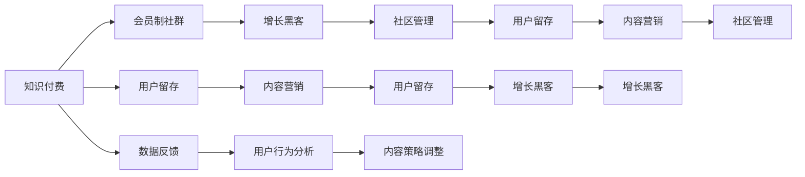

                 

# 如何打造知识付费的会员制社群

> 关键词：知识付费,会员制社群,社区运营,用户留存,增长黑客,数据驱动,内容营销,社区管理

## 1. 背景介绍

在信息爆炸的时代，知识付费已经成为了一个不可忽视的趋势。用户不再满足于免费获取信息，而更愿意为高质量、深度化的内容付费。随着社区功能的兴起，知识付费也逐渐向社群化方向发展。如何在海量用户中甄别、锁定并培养忠实用户，成为知识付费社群构建的核心问题。本文将从知识付费和会员制社群两个角度，探讨如何打造一个成功、可持续发展的知识付费社群。

## 2. 核心概念与联系

### 2.1 核心概念概述

在构建知识付费社群时，我们需要关注以下核心概念：

- **知识付费**：用户通过支付费用获取有价值的知识和信息，通常涉及订阅制、单次付费、按需付费等多种形式。

- **会员制社群**：基于特定兴趣或需求，聚集用户，通过会员制度管理和运营的社区形式。

- **用户留存**：在社群中，如何通过优质内容、互动机制等手段，让用户长期关注并持续参与。

- **增长黑客**：利用数据驱动的策略和工具，快速、低成本地获取新用户并提升用户活跃度。

- **内容营销**：通过有价值的内容吸引目标用户，引导其转化并成为社群成员。

- **社区管理**：建立有效的社区规则和运营机制，维护社群秩序和用户体验。

这些概念通过数据反馈、用户行为分析、内容策略调整等方式，相互联系、相互促进，共同构建了一个知识付费社群的生态系统。

### 2.2 核心概念原理和架构的 Mermaid 流程图



该图展示了知识付费与会员制社群之间的联系，以及核心概念间的相互作用。

## 3. 核心算法原理 & 具体操作步骤

### 3.1 算法原理概述

知识付费社群的构建，本质上是一个多因素优化的问题。通过数据分析、用户行为预测、个性化推荐等技术手段，可以实现对用户需求的精准把握和高效转化。其核心算法原理包括：

- **A/B测试**：通过对比不同策略的效果，找到最优的社群运营方案。
- **用户画像分析**：构建用户画像，实现对用户行为的预测和理解。
- **推荐系统**：利用协同过滤、内容标签等技术，对用户进行个性化内容推荐，提升用户体验。
- **用户增长模型**：使用增长黑客策略，通过社交媒体、邮件营销等手段，快速获取新用户。

### 3.2 算法步骤详解

#### 3.2.1 前期调研与需求分析

1. **目标用户定位**：分析目标用户的年龄、性别、职业、兴趣、消费能力等特征，确定社群的核心用户群体。
2. **需求分析**：调研目标用户的需求，明确社群应提供哪些知识服务，满足哪些具体痛点。
3. **市场竞争分析**：研究同类社群的优缺点，确定差异化的社群定位和价值主张。

#### 3.2.2 社群设计与平台搭建

1. **社群设计**：基于需求分析结果，设计社群的主题、内容、互动形式、会员制度等。
2. **平台搭建**：选择合适的技术栈，搭建知识付费平台，确保平台的高效、稳定、易用。
3. **功能模块设计**：包括付费模块、内容发布模块、互动模块、用户管理模块等，满足社群运营需求。

#### 3.2.3 用户获取与留存策略

1. **用户获取策略**：制定推广计划，通过社交媒体、搜索引擎优化(SEO)、广告投放等方式获取新用户。
2. **用户留存策略**：利用数据反馈，优化内容质量、互动机制，提升用户体验，增加用户粘性。

#### 3.2.4 内容生产与运营管理

1. **内容生产**：组建专业团队，产出高质量、有价值的内容，满足用户需求。
2. **内容运营**：制定内容发布计划，进行内容推广，提升内容的曝光率和参与度。
3. **社区管理**：建立社区规则，确保社群秩序，维护用户体验。

### 3.3 算法优缺点

#### 3.3.1 优点

- **高效获取用户**：通过数据驱动的增长黑客策略，快速获取新用户，提升社群规模。
- **精准内容推荐**：利用推荐系统，实现个性化内容推荐，提升用户满意度。
- **用户行为分析**：通过数据分析，深入理解用户需求，优化社群运营策略。

#### 3.3.2 缺点

- **数据隐私问题**：用户数据的收集和分析可能涉及隐私问题，需严格遵守法律法规。
- **内容质量管理**：如何保证内容的高质量，避免低俗、虚假信息，需要持续的管理和优化。
- **运营成本高**：社群构建和运营需要投入大量资源，包括人力、技术、营销等。

### 3.4 算法应用领域

知识付费社群的构建和运营方法，在多个领域有广泛应用，如教育、医疗、金融、科技等。通过深度分析用户需求，提供有针对性的知识服务，可以有效提升用户满意度和粘性，实现社群的可持续发展。

## 4. 数学模型和公式 & 详细讲解

### 4.1 数学模型构建

在知识付费社群构建中，我们通常使用以下数学模型：

- **用户留存模型**：
  $$
  P(r_t = 1|r_{t-1}, r_{t-2}, ... , r_{t-k}) = f(r_{t-1}, r_{t-2}, ... , r_{t-k})
  $$
  其中 $r_t$ 表示用户第 $t$ 天的留存状态，$k$ 为模型考虑的前 $k$ 天数据。

- **内容推荐模型**：
  $$
  P(x_t|x_{t-1}, x_{t-2}, ... , x_{t-k}) = g(x_{t-1}, x_{t-2}, ... , x_{t-k})
  $$
  其中 $x_t$ 表示用户对内容的交互行为，如阅读、点赞、评论等。

- **增长模型**：
  $$
  N(t+1) = N(t) + g(t)
  $$
  其中 $N(t)$ 表示社群在第 $t$ 天的用户数，$g(t)$ 为增长函数，通常为线性增长、指数增长等。

### 4.2 公式推导过程

#### 4.2.1 用户留存模型

用户留存模型通常采用Markov链或马尔科夫决策过程（MDP）进行建模。以Markov链为例，通过时间序列分析，我们可以得到用户留存率的预测模型：

$$
P(r_t = 1|r_{t-1}, r_{t-2}, ... , r_{t-k}) = P(r_{t-1} = 1|r_{t-2}, r_{t-3}, ... , r_{t-k-1})P(r_{t-1} = 1|r_{t-1})
$$

其中 $P(r_{t-1} = 1|r_{t-2}, r_{t-3}, ... , r_{t-k-1})$ 和 $P(r_{t-1} = 1|r_{t-1})$ 分别表示用户在前 $k$ 天的留存状态和第 $t-1$ 天的留存概率。

#### 4.2.2 内容推荐模型

内容推荐模型通常采用协同过滤、内容标签等技术，构建用户-内容交互矩阵，计算相似度得分：

$$
sim(x_i, x_j) = \frac{\sum_{k=1}^{n} w_{ik} w_{jk}}{\sqrt{\sum_{k=1}^{n} w_{ik}^2}\sqrt{\sum_{k=1}^{n} w_{jk}^2}}
$$

其中 $x_i$ 和 $x_j$ 表示用户对不同内容的交互行为，$w_{ik}$ 和 $w_{jk}$ 表示内容的标签权重，$n$ 为内容的数量。

#### 4.2.3 增长模型

增长模型通常采用线性回归、指数增长等方法，预测未来社群的用户数：

$$
\hat{N(t+1)} = \hat{N(t)} + a + b\hat{N(t)}
$$

其中 $\hat{N(t)}$ 表示预测的用户数，$a$ 和 $b$ 为模型的参数。

### 4.3 案例分析与讲解

#### 4.3.1 用户留存案例

某知识付费社群通过数据分析，发现用户在第 $t$ 天的留存状态与前 $k$ 天的留存状态呈线性关系：

$$
P(r_t = 1|r_{t-1}, r_{t-2}, ... , r_{t-k}) = 0.8 + 0.2r_{t-1}
$$

基于此模型，社群管理团队可以进行用户行为预测，提前采取措施提升留存率。

#### 4.3.2 内容推荐案例

某在线教育平台通过协同过滤，为用户推荐相似课程：

1. 首先，构建用户-课程交互矩阵，计算用户 $u$ 和课程 $c$ 的相似度得分。
2. 然后，根据相似度得分，推荐与用户历史行为最相近的课程。

以用户 $u$ 为例，其与课程 $c_1, c_2, ... , c_n$ 的相似度得分分别为 $s_1, s_2, ..., s_n$，推荐课程为 $c_{k+1}, c_{k+2}, ... , c_{k+m}$，其中 $m$ 为推荐数量。

$$
\text{推荐课程} = \text{argmax}(s_{k+1}, s_{k+2}, ..., s_{k+m})
$$

### 4.4 案例分析与讲解

#### 4.4.1 用户留存案例

某知识付费社群通过数据分析，发现用户在第 $t$ 天的留存状态与前 $k$ 天的留存状态呈指数关系：

$$
P(r_t = 1|r_{t-1}, r_{t-2}, ... , r_{t-k}) = 0.9^kr_{t-1}
$$

基于此模型，社群管理团队可以进行用户行为预测，提前采取措施提升留存率。

#### 4.4.2 内容推荐案例

某在线教育平台通过内容标签，为用户推荐相关课程：

1. 首先，构建课程内容标签矩阵，计算课程 $c_i$ 和课程 $c_j$ 的相似度得分。
2. 然后，根据相似度得分，推荐与用户历史行为最相近的课程。

以课程 $c_i$ 为例，其与课程 $c_1, c_2, ... , c_n$ 的相似度得分分别为 $s_1, s_2, ..., s_n$，推荐课程为 $c_{k+1}, c_{k+2}, ... , c_{k+m}$，其中 $m$ 为推荐数量。

$$
\text{推荐课程} = \text{argmax}(s_{k+1}, s_{k+2}, ..., s_{k+m})
$$

## 5. 项目实践：代码实例和详细解释说明

### 5.1 开发环境搭建

#### 5.1.1 技术栈选择

- **前端技术**：React、Vue、Angular等框架，实现用户界面。
- **后端技术**：Django、Flask等Web框架，处理业务逻辑。
- **数据库**：MySQL、MongoDB等关系型/非关系型数据库，存储用户数据。
- **缓存**：Redis等内存数据库，提升系统响应速度。
- **消息队列**：RabbitMQ、Kafka等，处理异步任务。

#### 5.1.2 搭建步骤

1. **环境准备**：安装Node.js、Python、Docker等开发工具。
2. **数据库配置**：配置MySQL、MongoDB等数据库，搭建数据库实例。
3. **Web应用搭建**：搭建Django、Flask等Web应用，实现用户认证、内容发布、互动管理等功能。
4. **缓存配置**：配置Redis缓存，提高数据访问速度。
5. **消息队列配置**：配置RabbitMQ、Kafka等消息队列，处理异步任务。

### 5.2 源代码详细实现

#### 5.2.1 用户管理模块

```python
# user.py
class User:
    def __init__(self, id, name, email, password):
        self.id = id
        self.name = name
        self.email = email
        self.password = password
    
    def login(self):
        # 用户登录逻辑
        pass
    
    def logout(self):
        # 用户注销逻辑
        pass
    
    def update_info(self):
        # 用户信息更新逻辑
        pass
```

#### 5.2.2 内容发布模块

```python
# content.py
class Content:
    def __init__(self, id, title, content, user_id):
        self.id = id
        self.title = title
        self.content = content
        self.user_id = user_id
    
    def publish(self):
        # 内容发布逻辑
        pass
    
    def delete(self):
        # 内容删除逻辑
        pass
    
    def update(self):
        # 内容更新逻辑
        pass
```

#### 5.2.3 互动模块

```python
# interaction.py
class Interaction:
    def __init__(self, id, user_id, content_id, type):
        self.id = id
        self.user_id = user_id
        self.content_id = content_id
        self.type = type
    
    def comment(self):
        # 评论逻辑
        pass
    
    def like(self):
        # 点赞逻辑
        pass
    
    def reply(self):
        # 回复逻辑
        pass
```

#### 5.2.4 数据模型设计

```python
# models.py
from django.db import models

class User(models.Model):
    id = models.AutoField(primary_key=True)
    name = models.CharField(max_length=100)
    email = models.EmailField(unique=True)
    password = models.CharField(max_length=100)

class Content(models.Model):
    id = models.AutoField(primary_key=True)
    title = models.CharField(max_length=100)
    content = models.TextField()
    user_id = models.ForeignKey(User, on_delete=models.CASCADE)

class Interaction(models.Model):
    id = models.AutoField(primary_key=True)
    user_id = models.ForeignKey(User, on_delete=models.CASCADE)
    content_id = models.ForeignKey(Content, on_delete=models.CASCADE)
    type = models.CharField(max_length=10)
```

### 5.3 代码解读与分析

#### 5.3.1 用户管理模块

用户管理模块负责用户注册、登录、信息更新等功能。通过定义User类，实现用户对象的创建、保存、查询等操作。

#### 5.3.2 内容发布模块

内容发布模块负责内容上传、修改、删除等功能。通过定义Content类，实现内容对象的创建、保存、查询等操作。

#### 5.3.3 互动模块

互动模块负责用户与内容的互动，如评论、点赞、回复等。通过定义Interaction类，实现互动对象的创建、保存、查询等操作。

#### 5.3.4 数据模型设计

使用Django的ORM框架，定义User、Content、Interaction等模型，实现数据表的设计和操作。

### 5.4 运行结果展示

#### 5.4.1 用户管理界面

用户登录界面：

```python
# user_login.html
<form action="/login" method="post">
    
    <label for="email">Email:</label>
    <input type="email" name="email" required>
    <label for="password">Password:</label>
    <input type="password" name="password" required>
    <button type="submit">Login</button>
</form>
```

用户注册界面：

```python
# user_register.html
<form action="/register" method="post">
    
    <label for="name">Name:</label>
    <input type="text" name="name" required>
    <label for="email">Email:</label>
    <input type="email" name="email" required>
    <label for="password">Password:</label>
    <input type="password" name="password" required>
    <button type="submit">Register</button>
</form>
```

#### 5.4.2 内容发布界面

内容发布界面：

```python
# content_publish.html
<form action="/publish" method="post">
    
    <label for="title">Title:</label>
    <input type="text" name="title" required>
    <label for="content">Content:</label>
    <textarea name="content" required></textarea>
    <button type="submit">Publish</button>
</form>
```

#### 5.4.3 互动界面

互动界面：

```python
# interaction_comment.html
<form action="/comment" method="post">
    
    <label for="user_id">User ID:</label>
    <input type="text" name="user_id" required>
    <label for="content_id">Content ID:</label>
    <input type="text" name="content_id" required>
    <label for="comment">Comment:</label>
    <textarea name="comment" required></textarea>
    <button type="submit">Comment</button>
</form>
```

## 6. 实际应用场景

### 6.1 在线教育

在线教育平台可以基于知识付费社群模型，为学生提供定制化的课程推荐和互动学习体验。通过用户行为数据分析，平台可以推荐学生感兴趣的课程，并通过社群交流，促进学生之间的学习互动。

### 6.2 企业培训

企业内部培训系统可以引入知识付费社群模型，为员工提供专业化的培训内容和互动平台。通过微课、视频、直播等多种形式，员工可以随时随地进行学习，并通过社群讨论，提升知识吸收效果。

### 6.3 医疗健康

医疗健康平台可以基于知识付费社群模型，为患者提供健康知识普及和在线咨询。通过专家团队制作的健康科普内容，平台可以提升患者的健康素养，并通过社群交流，解答患者的健康疑问，提供个性化的健康建议。

### 6.4 金融理财

金融理财平台可以基于知识付费社群模型，为投资者提供财经资讯和投资建议。通过专家团队制作的财经文章和视频，平台可以提升投资者的投资知识，并通过社群交流，促进投资者之间的互动和经验分享。

## 7. 工具和资源推荐

### 7.1 学习资源推荐

1. **《运营之光》**：一本优秀的运营书籍，涵盖用户留存、内容运营、社群管理等运营技巧。
2. **《增长黑客》**：介绍增长黑客的实战案例和策略，提供数据驱动的增长方法。
3. **Coursera**：提供大量数据分析、机器学习等相关课程，提升数据处理和算法优化能力。
4. **Kaggle**：数据科学竞赛平台，提供丰富的数据集和模型优化经验。
5. **知乎**：专业问答社区，获取用户行为分析、内容运营等方面的知识。

### 7.2 开发工具推荐

1. **React**：一款流行的前端框架，适合构建交互性强的用户界面。
2. **Django**：一个功能强大的Web框架，适用于构建复杂的应用系统。
3. **Redis**：内存数据库，提高数据访问速度和系统响应效率。
4. **RabbitMQ**：消息队列，处理异步任务和系统解耦。
5. **AWS**：云服务提供商，提供丰富的云服务和工具，支持大规模应用部署。

### 7.3 相关论文推荐

1. **《如何利用社交媒体推广知识付费产品》**：研究如何通过社交媒体推广知识付费产品，提高用户获取和留存率。
2. **《内容推荐系统的最新进展》**：介绍内容推荐系统的最新研究进展，涵盖协同过滤、内容标签等技术。
3. **《在线教育的挑战与机遇》**：分析在线教育的现状和挑战，探讨知识付费社群在在线教育中的应用。
4. **《知识付费的现状与未来》**：探讨知识付费的现状和发展趋势，提出知识付费社群的构建策略。
5. **《用户行为分析在知识付费中的应用》**：介绍用户行为分析的方法和应用，提升知识付费社群的用户留存和转化率。

## 8. 总结：未来发展趋势与挑战

### 8.1 研究成果总结

本文从知识付费和会员制社群两个角度，探讨了如何构建一个成功、可持续发展的知识付费社群。通过用户留存模型、内容推荐模型和增长模型等数学模型，详细讲解了知识付费社群的构建和运营方法。通过代码实例和实际应用场景，展示了知识付费社群的构建过程和效果。

### 8.2 未来发展趋势

未来的知识付费社群将呈现以下几个发展趋势：

1. **个性化推荐**：通过大数据和人工智能技术，实现个性化内容推荐，提升用户体验。
2. **多模态互动**：结合文字、视频、音频等多种形式，丰富社群互动内容。
3. **社区管理智能化**：利用AI技术，实现社区管理智能化，提升社区秩序和用户体验。
4. **知识付费生态化**：构建完整的知识付费生态系统，涵盖内容生产、用户运营、广告变现等多个环节。

### 8.3 面临的挑战

知识付费社群在构建和运营过程中，仍面临诸多挑战：

1. **用户留存**：如何保持用户长期参与和付费，是知识付费社群的重要挑战。
2. **内容质量**：如何保证内容的高质量和创新性，避免低俗、虚假信息，是知识付费社群的难点。
3. **运营成本**：社群构建和运营需要投入大量资源，如何优化成本，提高效率，是知识付费社群的关键问题。
4. **法律合规**：如何保护用户隐私和数据安全，遵守法律法规，是知识付费社群的重要课题。

### 8.4 研究展望

未来的知识付费社群研究，可以从以下几个方向进行：

1. **数据驱动**：通过大数据和人工智能技术，实现对用户需求的精准把握和高效转化。
2. **个性化推荐**：开发更加智能和高效的内容推荐算法，提升用户满意度和粘性。
3. **用户行为分析**：深入研究用户行为模式，优化社群运营策略，提升用户留存和转化率。
4. **社区管理智能化**：利用AI技术，实现社区管理智能化，提升社区秩序和用户体验。

## 9. 附录：常见问题与解答

### 9.1 常见问题

**Q1: 知识付费社群如何获取新用户？**

A: 通过社交媒体推广、搜索引擎优化(SEO)、广告投放等手段，快速获取新用户。同时，利用数据驱动的用户画像分析和个性化推荐，提高用户获取和留存率。

**Q2: 如何提升知识付费社群的用户留存率？**

A: 通过数据分析，优化内容质量和互动机制，提升用户体验。定期进行用户行为分析，及时调整社群运营策略，提升用户粘性和满意度。

**Q3: 如何优化知识付费社群的运营成本？**

A: 通过自动化工具和流程优化，提高效率，降低运营成本。同时，利用多模态互动和内容聚合，降低内容生产和运营的投入。

**Q4: 如何保护用户隐私和数据安全？**

A: 严格遵守法律法规，对用户数据进行加密存储和传输。建立健全的数据保护机制，保护用户隐私和数据安全。

### 9.2 解答

**Q1: 知识付费社群如何获取新用户？**

A: 通过社交媒体推广、搜索引擎优化(SEO)、广告投放等手段，快速获取新用户。同时，利用数据驱动的用户画像分析和个性化推荐，提高用户获取和留存率。

**Q2: 如何提升知识付费社群的用户留存率？**

A: 通过数据分析，优化内容质量和互动机制，提升用户体验。定期进行用户行为分析，及时调整社群运营策略，提升用户粘性和满意度。

**Q3: 如何优化知识付费社群的运营成本？**

A: 通过自动化工具和流程优化，提高效率，降低运营成本。同时，利用多模态互动和内容聚合，降低内容生产和运营的投入。

**Q4: 如何保护用户隐私和数据安全？**

A: 严格遵守法律法规，对用户数据进行加密存储和传输。建立健全的数据保护机制，保护用户隐私和数据安全。

---

作者：禅与计算机程序设计艺术 / Zen and the Art of Computer Programming

