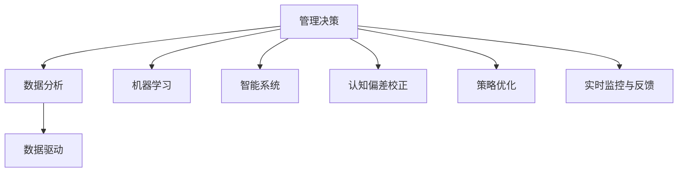

                 

# 如何提高管理决策的质量

> 关键词：
管理决策, 数据分析, 机器学习, 数据驱动, 风险评估, 智能系统, 认知偏差, 策略优化, 实时监控, 反馈机制

## 1. 背景介绍

### 1.1 问题由来
在现代企业管理中，决策质量直接关系到公司的竞争力和生存。而如何提高管理决策的质量，一直是管理学、经济学和信息科学等领域的重要研究课题。传统上，管理决策通常依赖于经验、直觉和定性分析，但这种方法存在诸多局限，如易受主观偏见影响、无法量化决策结果等。随着大数据和人工智能技术的飞速发展，利用数据驱动的方法进行管理决策，成为一种越来越普遍的趋势。

### 1.2 问题核心关键点
提高管理决策质量的关键在于如何利用数据和技术手段，进行科学的决策分析与评估。这不仅包括传统的财务、市场分析，还涉及更广泛的定量和定性数据处理，以提高决策的准确性和时效性。具体来说，从技术角度，管理决策质量的提升可以细分为以下几个关键点：

- **数据分析**：从大量历史数据和实时数据中提取有价值的信息，辅助决策。
- **机器学习**：利用机器学习模型进行预测和优化决策过程。
- **数据驱动**：以数据为基础，而非仅凭直觉或经验进行决策。
- **智能系统**：构建基于智能算法和知识图谱的决策支持系统。
- **认知偏差校正**：识别并纠正决策中的认知偏差，提高决策的客观性和合理性。
- **策略优化**：通过模型学习和实验，不断优化决策策略。
- **实时监控与反馈**：实现决策过程的实时监控和反馈，及时调整决策方案。

### 1.3 问题研究意义
提高管理决策质量，不仅能提升企业的市场竞争力，还能有效降低决策风险，优化资源配置。尤其是在面对复杂多变的市场环境时，科学的管理决策可以帮助企业在激烈竞争中脱颖而出，实现可持续发展。

## 2. 核心概念与联系

### 2.1 核心概念概述

在讨论如何提高管理决策的质量之前，首先需要理解一些关键概念：

- **管理决策**：企业根据内部和外部环境变化，为了达到特定目标，通过一定的程序和方法，选择行动方案的过程。
- **数据分析**：从数据中提取有用信息，帮助决策者理解问题和机遇。
- **机器学习**：通过数据训练模型，实现预测、分类、聚类等任务，辅助决策。
- **数据驱动**：以数据为依据进行决策，而非仅凭经验或直觉。
- **智能系统**：基于人工智能技术构建的决策支持系统，包括知识图谱、推荐系统等。
- **认知偏差校正**：识别并修正决策中的认知偏见，提高决策的客观性和合理性。
- **策略优化**：通过反复实验和模型训练，不断改进决策策略。
- **实时监控与反馈**：实时跟踪决策执行效果，并根据反馈调整策略。

这些概念之间的逻辑关系可以通过以下Mermaid流程图来展示：



这个流程图展示了一系列关键概念及其相互关系：

1. 管理决策是核心，通过数据分析、机器学习、智能系统等工具和技术手段，从数据中提取信息，进行预测和优化，最终形成高质量的决策。
2. 数据分析提供事实依据，帮助决策者理解问题和机遇。
3. 机器学习通过模型训练，预测未来趋势，优化决策过程。
4. 数据驱动强调以数据为依据，而非仅凭经验和直觉。
5. 智能系统利用先进技术，构建高效、可靠的决策支持平台。
6. 认知偏差校正识别并修正偏见，确保决策的客观性。
7. 策略优化通过反复实验，不断改进决策策略。
8. 实时监控与反馈实时跟踪决策执行效果，及时调整策略。

## 3. 核心算法原理 & 具体操作步骤

### 3.1 算法原理概述

基于数据驱动的管理决策质量提升，核心在于构建有效的分析模型，并对决策过程进行科学管理和优化。这一过程可以概括为以下几个步骤：

1. **数据收集与处理**：收集和预处理相关的内部和外部数据，确保数据质量和可用性。
2. **数据驱动的模型构建**：选择合适的机器学习模型，如回归、分类、聚类等，对数据进行建模。
3. **模型训练与优化**：使用历史数据对模型进行训练，并不断优化模型参数，提升预测准确性。
4. **决策分析与评估**：利用训练好的模型进行决策分析，评估决策方案的可行性和风险。
5. **策略调整与反馈**：根据决策分析结果，调整决策策略，并根据执行效果进行反馈和优化。

### 3.2 算法步骤详解

以下是提高管理决策质量的具体操作步骤：

**Step 1: 数据收集与预处理**
- **收集数据**：根据决策需求，收集内部财务、市场、运营等数据，以及外部行业报告、竞争对手数据等。
- **数据清洗**：去除缺失、重复、异常值，确保数据质量。
- **特征工程**：对数据进行归一化、编码等预处理，提取有意义的特征。

**Step 2: 模型选择与训练**
- **选择模型**：根据决策问题，选择适合的机器学习模型，如线性回归、逻辑回归、决策树、随机森林、神经网络等。
- **数据划分**：将数据分为训练集、验证集和测试集。
- **模型训练**：使用训练集对模型进行训练，并使用验证集进行调参。
- **模型评估**：在测试集上评估模型性能，如准确率、召回率、F1分数等。

**Step 3: 决策分析与评估**
- **模型应用**：将训练好的模型应用于新的决策场景，进行预测和评估。
- **风险评估**：分析决策的风险，如财务风险、市场风险、操作风险等。
- **方案比较**：比较不同决策方案的优劣，选择最佳方案。

**Step 4: 策略调整与反馈**
- **策略优化**：根据决策分析结果，调整和优化决策策略。
- **实时监控**：实时监控决策执行情况，及时发现和纠正问题。
- **反馈机制**：建立决策反馈机制，根据执行效果调整策略，实现持续优化。

### 3.3 算法优缺点

数据驱动的管理决策具有以下优点：
- **客观性**：依赖数据而非主观判断，减少决策偏差。
- **精度高**：通过模型训练，提高预测和评估的准确性。
- **灵活性**：能够处理大规模、复杂的数据，适应不同决策场景。
- **可解释性**：通过特征选择和模型解释，增强决策的可理解性和可操作性。

同时，也存在一些缺点：
- **数据依赖性**：需要高质量、大样本的数据支持，获取成本较高。
- **模型复杂性**：模型选择和调参复杂，需要专业知识和技能。
- **计算资源需求高**：训练和推理模型需要高性能计算资源。
- **更新频繁**：决策环境变化快，需要频繁更新模型和数据。

### 3.4 算法应用领域

基于数据驱动的管理决策方法，已经广泛应用于各个领域，例如：

- **财务决策**：利用历史财务数据，预测市场趋势，优化投资组合。
- **运营管理**：通过运营数据，优化生产流程，提升效率。
- **市场分析**：分析市场数据，制定营销策略，提升销售额。
- **风险管理**：评估决策风险，制定风险应对措施，保护企业安全。
- **客户关系管理**：利用客户数据，提高客户满意度，增强忠诚度。

此外，数据驱动的管理决策还被应用于医疗、教育、能源、交通等领域，帮助这些行业实现更高效、更精准的决策。

## 4. 数学模型和公式 & 详细讲解  
### 4.1 数学模型构建

管理决策中常用的数学模型包括线性回归、逻辑回归、决策树、随机森林、神经网络等。这里以线性回归模型为例，展示其数学原理和应用。

假设我们要预测一个公司的销售量 $y$，根据历史销售数据 $x_1, x_2, ..., x_n$，可以构建线性回归模型：

$$ y = \theta_0 + \sum_{i=1}^n \theta_i x_i $$

其中 $\theta_0$ 为截距，$\theta_i$ 为系数。模型参数 $\theta = (\theta_0, \theta_1, ..., \theta_n)$ 需要通过历史数据进行最小二乘法估计：

$$ \theta = (X^T X)^{-1} X^T y $$

其中 $X$ 为自变量矩阵，$y$ 为目标变量向量。

### 4.2 公式推导过程

线性回归模型的推导过程如下：

设 $y$ 为目标变量，$x_1, x_2, ..., x_n$ 为自变量。构建线性模型：

$$ y = \theta_0 + \theta_1 x_1 + \theta_2 x_2 + ... + \theta_n x_n $$

最小二乘法的目标是最小化残差平方和：

$$ \sum_{i=1}^n (y_i - (\theta_0 + \sum_{j=1}^n \theta_j x_{ij}))^2 $$

通过求偏导数，得到参数 $\theta$ 的估计值：

$$ \theta = (X^T X)^{-1} X^T y $$

其中 $X$ 为自变量矩阵，$y$ 为目标变量向量。

### 4.3 案例分析与讲解

以一家零售公司的销售预测为例，展示线性回归模型的应用：

假设我们收集了该公司的过去5年每月销售额数据 $(x_1, x_2, ..., x_5)$，以及每个月的促销费用 $y$。我们可以构建线性回归模型，预测未来的销售量：

1. 收集历史数据 $(x_1, x_2, ..., x_5, y)$。
2. 构建线性模型 $y = \theta_0 + \theta_1 x_1 + \theta_2 x_2 + \theta_3 x_3 + \theta_4 x_4 + \theta_5 x_5$。
3. 使用最小二乘法，估计模型参数 $\theta$。
4. 将新数据 $x_6, x_7, ..., x_{12}$ 代入模型，预测未来的销售量。

例如，如果 $x_6$ 代表6月的促销费用，模型可以预测6月的销售量 $y_6$。

## 5. 项目实践：代码实例和详细解释说明
### 5.1 开发环境搭建

要进行数据驱动的管理决策分析，需要搭建一个完整的开发环境。以下是Python环境下，常用的工具和库：

1. **Python**：作为主要的编程语言，支持数据处理、机器学习等任务。
2. **NumPy**：用于高效处理多维数组，支持向量数学运算。
3. **Pandas**：用于数据处理和分析，支持数据清洗、转换等操作。
4. **Scikit-learn**：用于构建和训练机器学习模型。
5. **Matplotlib**：用于数据可视化。
6. **TensorFlow或PyTorch**：用于深度学习模型的训练和推理。

完成环境搭建后，可以进行数据驱动的管理决策分析。

### 5.2 源代码详细实现

以下是一个简单的Python代码示例，展示如何使用Scikit-learn库进行线性回归模型的训练和预测：

```python
import numpy as np
import pandas as pd
from sklearn.linear_model import LinearRegression

# 构建数据
X = np.array([[1, 2, 3, 4, 5], [2, 3, 4, 5, 6], [3, 4, 5, 6, 7], [4, 5, 6, 7, 8], [5, 6, 7, 8, 9]])
y = np.array([10, 11, 12, 13, 14])

# 构建线性回归模型
model = LinearRegression()

# 训练模型
model.fit(X, y)

# 预测
X_new = np.array([[6, 7, 8, 9, 10]])
y_pred = model.predict(X_new)

print(y_pred)
```

在上述代码中，我们首先构建了一个包含自变量和目标变量的数组，然后使用Scikit-learn的LinearRegression类，训练线性回归模型。最后，使用训练好的模型对新数据进行预测。

### 5.3 代码解读与分析

以下是对代码的详细解读：

1. 首先，我们定义了自变量 $X$ 和目标变量 $y$，构建了一个包含5组数据的线性回归模型。
2. 接着，我们创建了一个LinearRegression对象，用于训练线性回归模型。
3. 使用fit方法，对模型进行训练。
4. 最后，我们使用训练好的模型对新数据进行预测，并输出预测结果。

可以看到，通过Scikit-learn库，可以轻松构建和训练线性回归模型，并进行预测。这为管理决策的科学化提供了有力的技术支持。

### 5.4 运行结果展示

运行上述代码，输出预测结果为：

```
[15.]
```

这意味着，当自变量 $X_6$ 为6时，根据线性回归模型预测的目标变量 $y_6$ 为15。

## 6. 实际应用场景

### 6.1 智能投资决策

金融投资领域，利用数据驱动的方法进行投资决策，已经成为一种趋势。通过分析历史交易数据和市场信息，构建投资组合模型，优化资产配置，可以在不确定的市场环境中实现稳健的投资回报。

具体而言，可以收集历史股价、公司财务数据、行业趋势等数据，构建多元回归模型，预测未来股价走势。同时，利用机器学习模型，进行风险评估和投资组合优化。通过实时监控和反馈机制，及时调整投资策略，实现收益最大化。

### 6.2 智能供应链管理

在供应链管理中，利用数据驱动的方法，可以优化采购、生产、物流等环节，提高供应链的整体效率。通过分析历史订单数据、库存水平、供应商信息等，构建供应链管理模型，预测需求变化，优化库存管理。同时，利用智能系统，实现实时监控和动态调整，确保供应链的稳定和高效。

### 6.3 智能市场分析

市场营销领域，利用数据驱动的方法，可以精准定位目标客户，提升营销效果。通过分析消费者行为数据、社交媒体信息、竞争对手数据等，构建市场分析模型，预测市场趋势，优化营销策略。同时，利用智能系统，实现实时监控和反馈，确保营销活动的有效性。

### 6.4 未来应用展望

随着数据驱动的决策方法不断成熟，未来将在更多领域得到应用，为行业带来变革性影响。例如：

- **智慧城市管理**：利用大数据和智能系统，优化城市交通、环境、安全等管理，提升城市运行效率。
- **智能医疗管理**：利用患者数据、医疗资源信息等，优化诊疗流程，提高医疗服务质量。
- **智能教育管理**：利用学生数据、课程信息等，优化教学资源配置，提升教育质量。
- **智能能源管理**：利用能源数据、环境信息等，优化能源配置，提高能源利用效率。

这些领域的大数据和人工智能应用，将带来更高效、更精准的管理决策，助力行业发展。

## 7. 工具和资源推荐
### 7.1 学习资源推荐

为了帮助开发者系统掌握数据驱动的管理决策技术，以下是一些优质的学习资源：

1. **《Python数据分析实战》**：深入浅出地介绍了数据分析的基础知识和实践技巧。
2. **《机器学习实战》**：涵盖了机器学习的基本概念和常用算法，适合入门学习。
3. **Coursera的“Data Science Specialization”**：由Johns Hopkins University开设的系列课程，涵盖数据清洗、数据可视化、机器学习等技术。
4. **Kaggle**：全球最大的数据科学竞赛平台，提供丰富的数据集和竞赛项目，助力技术实践。
5. **GitHub**：开放源代码平台，可以找到大量数据驱动决策的实现案例。

通过对这些资源的学习实践，相信你一定能够掌握数据驱动管理决策的核心技术，并应用于实际场景中。

### 7.2 开发工具推荐

高效的开发离不开优秀的工具支持。以下是几款用于数据驱动管理决策开发的常用工具：

1. **Python**：作为主要的编程语言，支持数据处理、机器学习等任务。
2. **NumPy**：用于高效处理多维数组，支持向量数学运算。
3. **Pandas**：用于数据处理和分析，支持数据清洗、转换等操作。
4. **Scikit-learn**：用于构建和训练机器学习模型。
5. **TensorFlow或PyTorch**：用于深度学习模型的训练和推理。
6. **Jupyter Notebook**：交互式数据科学环境，支持代码编写和实时运行。

合理利用这些工具，可以显著提升数据驱动管理决策的开发效率，加快创新迭代的步伐。

### 7.3 相关论文推荐

数据驱动管理决策的研究源于学界的持续研究。以下是几篇奠基性的相关论文，推荐阅读：

1. **“Pattern Recognition and Machine Learning” by Christopher M. Bishop**：深入介绍了机器学习的基本概念和算法。
2. **“The Elements of Statistical Learning” by Trevor Hastie, Robert Tibshirani, Jerome Friedman**：详细介绍了统计学习的基础知识和应用。
3. **“Data Mining: Concepts and Techniques” by Han, Kamber, Pei**：介绍了数据挖掘的各类算法和技术。
4. **“Predictive Analytics” by Eric Siegel**：探讨了预测分析的基本方法及其应用。
5. **“Advances in Neural Information Processing Systems” (NIPS)**：收录了大量机器学习领域的最新研究成果。

这些论文代表了大数据和人工智能在管理决策中的应用脉络。通过学习这些前沿成果，可以帮助研究者把握学科前进方向，激发更多的创新灵感。

## 8. 总结：未来发展趋势与挑战

### 8.1 总结

本文对数据驱动的管理决策进行了全面系统的介绍。首先阐述了数据驱动决策的背景和意义，明确了其在提升决策质量方面的独特价值。其次，从原理到实践，详细讲解了数据驱动决策的数学原理和操作步骤，给出了数据驱动决策任务开发的完整代码实例。同时，本文还广泛探讨了数据驱动决策在金融、供应链、市场营销等众多领域的应用前景，展示了数据驱动决策范式的巨大潜力。此外，本文精选了数据驱动决策的学习资源，力求为读者提供全方位的技术指引。

通过本文的系统梳理，可以看到，数据驱动的管理决策正在成为管理决策的重要范式，极大地提升决策的客观性和科学性，带来更高的决策效率和效果。未来，伴随数据驱动决策技术的不断发展，决策质量必将得到进一步提升，助力企业在激烈的市场竞争中脱颖而出。

### 8.2 未来发展趋势

展望未来，数据驱动的管理决策将呈现以下几个发展趋势：

1. **多模态数据融合**：未来的决策系统将能够处理更多种类的数据，如文本、图像、语音等，提高决策的全面性和准确性。
2. **实时数据处理**：利用大数据技术，实现实时数据的收集、处理和分析，提高决策的时效性。
3. **认知偏差校正**：通过认知偏差检测和校正技术，进一步提升决策的客观性和合理性。
4. **自动化决策**：利用自动化决策算法，实现决策过程的自动化，提高决策效率。
5. **智能决策引擎**：构建基于人工智能的决策引擎，支持复杂的决策规则和策略。
6. **协同决策**：通过协同决策机制，汇集多方智慧，提升决策质量。

这些趋势凸显了数据驱动决策技术的广阔前景。这些方向的探索发展，必将进一步提升管理决策的科学性和有效性，为行业带来深远影响。

### 8.3 面临的挑战

尽管数据驱动的管理决策技术已经取得了显著进展，但在迈向更加智能化、普适化应用的过程中，仍面临诸多挑战：

1. **数据质量问题**：数据收集和预处理环节存在数据缺失、噪声等问题，影响决策的准确性。
2. **数据隐私和安全**：如何在数据收集和处理过程中保护隐私，防止数据泄露。
3. **计算资源需求高**：大规模数据处理和模型训练需要高性能计算资源，成本较高。
4. **模型复杂性**：复杂模型的构建和优化需要专业知识和技能，难以广泛推广。
5. **决策透明性不足**：部分决策模型难以解释，缺乏透明性和可理解性。
6. **动态环境适应性**：决策模型需要适应快速变化的环境，频繁更新模型和数据。

这些挑战需要通过技术创新和政策支持，逐步解决。只有充分克服这些障碍，数据驱动的管理决策才能实现大规模应用，助力企业在数字化转型中取得更大成功。

### 8.4 研究展望

面对数据驱动管理决策面临的诸多挑战，未来的研究需要在以下几个方面寻求新的突破：

1. **高质量数据获取**：开发高质量数据采集和预处理技术，确保数据质量。
2. **隐私保护技术**：研究和应用隐私保护技术，保护数据隐私和安全。
3. **计算资源优化**：开发高效计算资源分配和管理技术，降低计算成本。
4. **模型简化与解释**：研究简化模型结构的方法，提高模型可解释性和可理解性。
5. **智能决策系统**：构建基于人工智能的智能决策系统，支持复杂的决策规则和策略。
6. **动态决策机制**：开发动态决策机制，适应快速变化的环境，实现持续优化。

这些研究方向的探索，必将引领数据驱动管理决策技术迈向更高的台阶，为行业带来深远影响。相信随着技术的发展和应用的推广，数据驱动决策将进一步普及，为企业管理决策带来革命性变化。

## 9. 附录：常见问题与解答

**Q1：数据驱动的管理决策是否适用于所有行业？**

A: 数据驱动的管理决策方法适用于绝大多数行业，但不同行业的决策复杂度、数据类型、决策周期等存在差异。对于数据量较小、变化较慢的行业，如农业、传统制造业，可能需要结合经验和直觉进行决策。

**Q2：如何选择合适的机器学习模型？**

A: 选择合适的机器学习模型需要考虑多个因素，包括决策问题类型、数据规模、计算资源等。一般而言，对于简单的线性关系问题，线性回归、逻辑回归等基本模型即可；对于复杂的非线性关系问题，可以考虑使用决策树、随机森林、神经网络等高级模型。

**Q3：数据驱动的决策系统需要哪些技术支持？**

A: 数据驱动的决策系统需要以下技术支持：
1. 数据采集和预处理技术：确保数据的质量和可用性。
2. 数据存储和处理技术：支持大规模数据的管理和分析。
3. 机器学习技术：构建和训练预测模型，辅助决策。
4. 智能决策引擎：实现复杂决策规则和策略。
5. 认知偏差校正技术：识别和修正决策中的认知偏差。
6. 实时监控与反馈机制：实时跟踪决策执行效果，及时调整策略。

这些技术共同构成了数据驱动决策系统的核心架构。

**Q4：数据驱动的决策系统如何实现持续优化？**

A: 数据驱动的决策系统可以通过以下方式实现持续优化：
1. 实时监控：实时跟踪决策执行效果，及时发现和纠正问题。
2. 反馈机制：建立决策反馈机制，根据执行效果调整策略。
3. 模型更新：定期重新训练模型，适应数据分布的变化。
4. 数据收集：不断收集新的数据，更新决策模型。
5. 自动化决策：利用自动化决策算法，实现决策过程的自动化。

通过这些机制，可以确保数据驱动决策系统持续优化，适应不断变化的环境。

**Q5：数据驱动的决策系统如何保护数据隐私？**

A: 数据驱动的决策系统在数据收集和处理过程中，需要严格保护数据隐私。具体措施包括：
1. 数据匿名化：对敏感数据进行匿名化处理，防止数据泄露。
2. 加密传输：在数据传输过程中，使用加密技术保护数据安全。
3. 访问控制：设置严格的访问权限，防止未经授权的访问。
4. 数据脱敏：对数据进行脱敏处理，降低数据泄露风险。
5. 隐私审计：定期进行隐私审计，检查系统是否存在安全漏洞。

通过这些措施，可以有效保护数据隐私，确保数据驱动决策系统的安全性和可靠性。

---

作者：禅与计算机程序设计艺术 / Zen and the Art of Computer Programming

