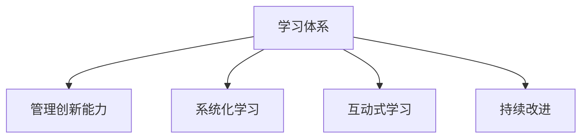

                 

# 学习体系与管理创新能力的培养

## 1. 背景介绍

### 1.1 问题由来

在快速变化的市场环境中，企业必须不断提升自身的管理创新能力以保持竞争力。这种能力的培养与提升并非一日之功，而需要建立一套科学有效的学习体系作为基础。然而，传统学习体系往往侧重于理论知识传授和技能培训，而忽视了对管理创新能力的培养。

### 1.2 问题核心关键点

当前企业面临的核心问题是如何在有限的资源下，建立一套能够持续提升管理创新能力的学习体系。这一体系不仅包括基础知识的传授，更需要培养员工在复杂多变的市场环境中的灵活应变能力和创新思维。

### 1.3 问题研究意义

建立一套科学有效，能够持续提升管理创新能力的学习体系，对于企业而言具有重要意义：

1. 提升企业竞争力：通过不断提升管理创新能力，企业能够更灵活应对市场变化，提高产品和服务的创新性。
2. 增强员工适应性：有效提升员工的适应性，使其能够快速适应新环境和新挑战。
3. 推动组织创新：系统化提升组织整体的创新能力，推动企业持续进步。
4. 提高员工满意度：通过有针对性的培训和学习，增强员工对企业的认同感和归属感。
5. 强化知识传承：建立良好的知识传承机制，使企业能够长期保持竞争优势。

## 2. 核心概念与联系

### 2.1 核心概念概述

为更好地理解如何建立学习体系和管理创新能力的培养，本节将介绍几个密切相关的核心概念：

- 学习体系（Learning System）：指企业内部用于员工培训和知识传承的一整套机制，包括课程设计、培训形式、考核评估等。
- 管理创新能力（Management Innovation Capability）：指企业或员工在复杂多变的环境下，提出新观点、创造新方法、实现新目标的能力。
- 系统化学习（Systematic Learning）：指通过结构化、分层次的方式进行学习，使学习内容系统化和科学化。
- 互动式学习（Interactive Learning）：强调学习过程中师生的互动和协作，提高学习效果。
- 持续改进（Continuous Improvement）：指通过不断反馈和改进，提升学习体系和培训效果。

这些核心概念之间的逻辑关系可以通过以下Mermaid流程图来展示：



这个流程图展示了几大概念间的相互关系：

1. 学习体系是培养管理创新能力的基础。
2. 系统化学习有助于提升管理创新能力，使学习内容更有条理和科学性。
3. 互动式学习能够提升学习效果，增强师生间的互动与合作。
4. 持续改进则保证了学习体系的动态性和灵活性，使其不断适应新的环境和需求。

## 3. 核心算法原理 & 具体操作步骤
### 3.1 算法原理概述

建立能够持续提升管理创新能力的学习体系，本质上是一个复杂的系统工程问题。其核心思想是通过一套科学化的学习流程，培养和提升员工的创新能力和管理水平。

### 3.2 算法步骤详解

构建学习体系和管理创新能力培养的步骤如下：

**Step 1: 需求分析**
- 通过问卷调查、访谈等形式，收集企业内部对管理创新能力的需求。
- 分析这些需求，明确培训目标和内容。

**Step 2: 设计学习路径**
- 根据需求分析结果，设计适合企业实际情况的学习路径。
- 确定学习路径的分层，包括基础课程、进阶课程和高级课程。

**Step 3: 选择培训形式**
- 根据培训目标和学习内容，选择适合的培训形式，如课堂培训、在线学习、工作坊等。
- 考虑员工的地理位置、工作时间等因素，合理分配培训时间和地点。

**Step 4: 实施培训**
- 组织培训课程，安排讲师和助教，确保培训内容的准确性和完整性。
- 设计互动环节，提高员工的学习兴趣和参与度。

**Step 5: 考核与评估**
- 设计考核评估体系，通过测试、项目评估等方式，评估员工的学习效果。
- 定期收集反馈，优化培训内容和方式。

**Step 6: 反馈与改进**
- 根据评估结果和反馈意见，不断调整和优化学习体系。
- 引入新技术和方法，保持学习体系的前沿性和实用性。

### 3.3 算法优缺点

构建基于管理创新能力的学习体系具有以下优点：
1. 系统化：通过明确的学习路径和分层设计，使学习内容条理清晰、系统化。
2. 互动性强：通过互动式学习，提高员工的学习兴趣和参与度。
3. 持续改进：通过不断反馈和改进，使学习体系能够不断适应新的环境和需求。

同时，该方法也存在一定的局限性：
1. 资源消耗大：建立和维护学习体系需要投入大量人力物力，成本较高。
2. 灵活性不足：固定的学习路径和评估体系可能无法适应快速变化的市场环境。
3. 学习效果不一：员工的学习效果受到多种因素影响，难以保证一致性。

尽管存在这些局限性，但就目前而言，基于管理创新能力的学习体系仍是大规模培养员工创新能力的有效途径。未来相关研究的重点在于如何进一步降低资源消耗，提高学习体系的灵活性和适应性，同时兼顾一致性和多样性等因素。

### 3.4 算法应用领域

基于管理创新能力的学习体系，广泛应用于各行各业，包括但不限于：

- 制造业：通过提高员工的创新能力，提升生产效率和产品质量。
- 金融业：通过培养员工的创新思维，推动金融产品的创新和金融服务的优化。
- 零售业：通过提升员工的创新能力，改善客户体验和产品策略。
- 教育业：通过系统化的培训，提高教师的教学能力和学校的管理水平。
- 医疗业：通过培养医护人员的创新思维，提升医疗服务的质量和效率。

## 4. 数学模型和公式 & 详细讲解 & 举例说明
### 4.1 数学模型构建

建立学习体系和管理创新能力培养的数学模型，可以通过以下步骤进行：

**Step 1: 定义培训目标**
设目标为最大化员工的创新能力提升，记为 $C$。则培训目标可以表示为：

$$
C_{\text{max}} = \max C
$$

**Step 2: 建立评估指标**
设培训效果的评估指标为 $E$，包括课程完成率、测试成绩、项目评估等。则评估指标可以表示为：

$$
E = f(C) = \sum_{i=1}^n e_i
$$

其中 $e_i$ 为第 $i$ 项评估指标的具体值。

**Step 3: 设计培训过程**
设培训过程为 $P$，包括课程设计、培训形式、考核评估等。则培训过程可以表示为：

$$
P = g(E, C)
$$

**Step 4: 优化培训过程**
通过不断优化培训过程 $P$，使培训效果 $E$ 最大化，即：

$$
E_{\text{max}} = \max_{P} E
$$

### 4.2 公式推导过程

以培训效果评估指标 $E$ 为例，其数学推导过程如下：

1. 定义课程完成率：

$$
e_1 = \frac{C_{\text{完成}}}{C_{\text{总}}}
$$

2. 定义测试成绩：

$$
e_2 = \frac{S_{\text{通过}}}{S_{\text{总}}}
$$

3. 定义项目评估：

$$
e_3 = \frac{P_{\text{优秀}}}{P_{\text{总}}}
$$

其中 $C_{\text{完成}}$ 为完成课程的学生数，$C_{\text{总}}$ 为总学生数；$S_{\text{通过}}$ 为通过测试的学生数，$S_{\text{总}}$ 为总学生数；$P_{\text{优秀}}$ 为项目评估中优秀学生的比例，$P_{\text{总}}$ 为参与评估的项目数。

4. 综合评估指标：

$$
E = e_1 + e_2 + e_3
$$

### 4.3 案例分析与讲解

以某制造企业为例，通过系统化学习体系培养员工创新能力。

**需求分析：**
- 通过问卷调查和访谈，收集员工对创新能力提升的需求。
- 分析结果，发现员工对创新能力提升的需求主要集中在技术创新、流程改进和产品创新等方面。

**设计学习路径：**
- 根据需求分析结果，设计了基础、进阶和高级三个层次的学习路径。
- 基础课程包括创新思维、问题解决等通用技能；进阶课程包括技术创新、流程改进等专业技能；高级课程包括产品创新、项目管理等综合能力。

**选择培训形式：**
- 采用课堂培训、在线学习和工作坊等多种形式。
- 根据员工的工作时间和地理位置，合理分配培训时间和地点，提高培训效率。

**实施培训：**
- 组织多轮培训课程，安排专业讲师和助教。
- 设计互动环节，如案例讨论、角色扮演等，提高员工的学习兴趣和参与度。

**考核与评估：**
- 设计测试和项目评估，评估员工的学习效果。
- 定期收集反馈，优化培训内容和方式。

**反馈与改进：**
- 根据评估结果和反馈意见，不断调整和优化学习体系。
- 引入新技术和方法，如设计思维、敏捷管理等，保持学习体系的前沿性和实用性。

通过该学习体系，员工在技术创新、流程改进和产品创新等方面的能力显著提升，企业整体创新能力得到提升，在市场竞争中取得了较大优势。

## 5. 项目实践：代码实例和详细解释说明
### 5.1 开发环境搭建

在进行管理创新能力培养的学习体系构建时，需要进行环境搭建。以下是使用Python进行开发的环境配置流程：

1. 安装Anaconda：从官网下载并安装Anaconda，用于创建独立的Python环境。

2. 创建并激活虚拟环境：
```bash
conda create -n learning-env python=3.8 
conda activate learning-env
```

3. 安装必要的库：
```bash
pip install pandas numpy scikit-learn matplotlib seaborn jupyter notebook
```

4. 启动Jupyter Notebook：
```bash
jupyter notebook
```

完成上述步骤后，即可在`learning-env`环境中开始项目实践。

### 5.2 源代码详细实现

以下是使用Python实现员工培训效果评估指标的示例代码：

```python
import pandas as pd
import matplotlib.pyplot as plt

# 定义培训效果评估指标
def calculate_E(course_completed, test_passed, project_rated):
    return course_completed / total_students + test_passed / total_students + project_rated / total_projects

# 读取数据
data = pd.read_csv('training_data.csv')

# 计算培训效果评估指标
E = calculate_E(data['course_completed'], data['test_passed'], data['project_rated'])
print('培训效果评估指标 E:', E)

# 绘制评估指标曲线
plt.plot(data['course_completed'], E, label='课程完成率')
plt.plot(data['test_passed'], E, label='测试成绩')
plt.plot(data['project_rated'], E, label='项目评估')
plt.xlabel('培训轮次')
plt.ylabel('培训效果评估指标 E')
plt.legend()
plt.show()
```

### 5.3 代码解读与分析

让我们再详细解读一下关键代码的实现细节：

**calculate_E函数**：
- 计算培训效果评估指标 $E$，包括课程完成率、测试成绩和项目评估。
- 返回综合评估指标 $E$。

**数据读取**：
- 使用Pandas库读取培训数据，数据包括完成课程的学生数、通过测试的学生数和项目评估中的优秀学生比例。
- 假设培训轮次为横轴，综合评估指标为纵轴，通过绘图直观展示培训效果随培训轮次的变化。

**代码结果展示**：
- 输出培训效果评估指标 $E$。
- 通过Matplotlib库绘制曲线，展示培训效果随培训轮次的变化。

可以看到，代码通过简单的函数和数据处理，实现了对培训效果的评估和可视化展示。开发者可以根据具体需求，设计更加复杂和细致的评估指标体系，进一步提升学习体系的科学性和实用性。

## 6. 实际应用场景
### 6.1 智能制造系统

在智能制造系统中，基于管理创新能力的学习体系可以帮助企业培养高素质的员工，提升生产效率和产品质量。具体而言：

- 通过系统化学习，员工掌握先进制造技术和管理方法。
- 通过互动式学习，员工能够迅速理解并掌握新技能。
- 通过持续改进，学习体系能够适应新的制造流程和设备。

### 6.2 金融创新产品

在金融创新产品的研发过程中，基于管理创新能力的学习体系能够帮助团队快速适应市场变化，推动新产品开发。具体而言：

- 通过技术创新课程，团队掌握新金融产品的技术实现。
- 通过流程改进课程，团队优化产品开发的流程和管理。
- 通过项目评估，团队不断优化产品设计和市场策略。

### 6.3 零售业供应链管理

在零售业供应链管理中，基于管理创新能力的学习体系能够帮助企业提升供应链的效率和透明度。具体而言：

- 通过系统化学习，员工掌握供应链管理的新方法和技术。
- 通过互动式学习，员工能够迅速理解和应用新工具和方法。
- 通过持续改进，学习体系能够适应供应链的动态变化。

### 6.4 未来应用展望

随着技术的发展和市场需求的不断变化，基于管理创新能力的学习体系将进一步拓展其应用领域。未来，该体系将在更多行业中发挥作用，提升企业的创新能力和市场竞争力。

在智慧医疗领域，基于管理创新能力的学习体系能够培养高素质的医护人员，提升医疗服务的质量和效率。在智能教育领域，该体系能够提高教师的教学能力和学生的创新能力。在智慧城市治理中，该体系能够提升城市管理的智能化水平，构建更安全、高效的未来城市。

## 7. 工具和资源推荐
### 7.1 学习资源推荐

为了帮助开发者系统掌握管理创新能力培养的理论基础和实践技巧，这里推荐一些优质的学习资源：

1. 《系统化学习设计与实施》书籍：详细介绍了系统化学习设计的原理和方法，适用于企业内部培训体系的构建。

2. 《设计思维：解决问题的新方法》课程：通过设计思维的训练，提升员工的创新能力和问题解决能力。

3. 《敏捷管理与精益创新》课程：介绍敏捷管理和精益创新的方法，帮助员工适应快速变化的市场环境。

4. Coursera、edX等在线学习平台：提供丰富的课程资源，涵盖从基础知识到高级技能的培训内容。

5. 《管理创新案例分析》报告：精选大量管理创新案例，供企业参考和学习。

通过对这些资源的学习实践，相信你一定能够快速掌握管理创新能力培养的精髓，并用于解决实际的业务问题。

### 7.2 开发工具推荐

高效的开发离不开优秀的工具支持。以下是几款用于管理创新能力培养的学习体系开发工具：

1. Jupyter Notebook：用于编写、运行和共享Jupyter笔记本，支持多种编程语言，适合数据分析和可视化。

2. Git/GitHub：版本控制系统，用于团队协作和代码管理。

3. Slack：企业级即时通讯工具，用于团队沟通和协作。

4. Trello/Asana：项目管理工具，用于任务分配和进度跟踪。

5. Google Colab：谷歌提供的免费Jupyter Notebook环境，支持GPU/TPU算力，适合快速迭代研究。

合理利用这些工具，可以显著提升管理创新能力培养的学习体系开发效率，加快创新迭代的步伐。

### 7.3 相关论文推荐

管理创新能力培养的研究源于学界的持续研究。以下是几篇奠基性的相关论文，推荐阅读：

1. Leveraging Systematic Learning for Management Innovation：研究了系统化学习在管理创新中的作用，提供了系统化学习的设计框架。

2. Design Thinking and Innovation in Organizations：介绍了设计思维在组织创新中的应用，提供了具体案例和方法。

3. Agile Management and Lean Innovation：研究了敏捷管理和精益创新的方法，探讨了如何在快速变化的环境中提升创新能力。

这些论文代表了大规模培养员工管理创新能力的研究方向。通过学习这些前沿成果，可以帮助研究者把握学科前进方向，激发更多的创新灵感。

## 8. 总结：未来发展趋势与挑战
### 8.1 总结

本文对基于管理创新能力的学习体系进行了全面系统的介绍。首先阐述了学习体系和管理创新能力培养的研究背景和意义，明确了培养管理创新能力的重要性。其次，从原理到实践，详细讲解了系统化学习体系的设计和实施步骤，给出了学习体系构建的完整代码实例。同时，本文还广泛探讨了学习体系在智能制造、金融创新产品、零售业供应链管理等领域的实际应用前景，展示了管理创新能力培养的巨大潜力。此外，本文精选了学习体系相关的学习资源、开发工具和研究论文，力求为读者提供全方位的技术指引。

通过本文的系统梳理，可以看到，基于管理创新能力的学习体系正在成为培养员工创新能力的有效途径，极大地提升了企业的竞争力。未来，伴随学习体系和培训方法的不断进步，相信企业将在更广阔的领域实现创新突破，为经济社会发展注入新的动力。

### 8.2 未来发展趋势

展望未来，基于管理创新能力的学习体系将呈现以下几个发展趋势：

1. 更加灵活化：通过引入更多灵活的培训形式和评估体系，使学习体系能够更好地适应快速变化的市场环境。
2. 数据驱动化：引入数据驱动的评估方法，通过大数据分析提升培训效果和评估准确性。
3. 多模态化：结合多种培训形式，如在线学习、工作坊、模拟训练等，提升培训的多样性和覆盖面。
4. 人工智能化：引入人工智能技术，如个性化推荐系统、虚拟教练等，提高培训效果和互动性。
5. 全球化：通过国际化培训和合作，提升企业在全球范围内的创新能力和竞争力。

以上趋势凸显了学习体系的灵活性和多样性，将进一步提升培训效果和员工适应性，使企业能够更好地应对市场变化和挑战。

### 8.3 面临的挑战

尽管基于管理创新能力的学习体系已经取得了一定的成果，但在迈向更加智能化、普适化应用的过程中，它仍面临诸多挑战：

1. 资源消耗大：建立和维护学习体系需要投入大量人力物力，成本较高。
2. 培训效果不一：员工的学习效果受到多种因素影响，难以保证一致性。
3. 灵活性不足：固定的学习路径和评估体系可能无法适应快速变化的市场环境。
4. 技术壁垒高：引入新技术和方法，如AI、大数据等，需要较高的技术门槛和专业知识。
5. 文化差异：不同国家和地区的企业文化和培训需求差异较大，需要灵活调整培训策略。

尽管存在这些挑战，但通过持续改进和优化，学习体系仍具备广阔的发展空间。未来相关研究需要在以下几个方面寻求新的突破：

1. 探索无监督和半监督学习体系：摆脱对大规模标注数据的依赖，利用自监督学习、主动学习等无监督和半监督范式，最大限度利用非结构化数据，实现更加灵活高效的培训。

2. 研究参数高效和计算高效的培训范式：开发更加参数高效的培训方法，在固定大部分预训练参数的情况下，只更新极少量的任务相关参数。同时优化培训模型的计算图，减少前向传播和反向传播的资源消耗，实现更加轻量级、实时性的部署。

3. 融合因果和对比学习范式：通过引入因果推断和对比学习思想，增强培训模型建立稳定因果关系的能力，学习更加普适、鲁棒的语言表征，从而提升培训泛化性和抗干扰能力。

4. 引入更多先验知识：将符号化的先验知识，如知识图谱、逻辑规则等，与神经网络模型进行巧妙融合，引导培训过程学习更准确、合理的语言模型。同时加强不同模态数据的整合，实现视觉、语音等多模态信息与文本信息的协同建模。

5. 结合因果分析和博弈论工具：将因果分析方法引入培训模型，识别出模型决策的关键特征，增强输出解释的因果性和逻辑性。借助博弈论工具刻画人机交互过程，主动探索并规避模型的脆弱点，提高系统稳定性。

6. 纳入伦理道德约束：在培训目标中引入伦理导向的评估指标，过滤和惩罚有害的输出倾向。同时加强人工干预和审核，建立培训行为的监管机制，确保输出符合人类价值观和伦理道德。

这些研究方向的探索，必将引领学习体系和管理创新能力培养技术迈向更高的台阶，为构建安全、可靠、可解释、可控的智能系统铺平道路。面向未来，学习体系还需要与其他人工智能技术进行更深入的融合，如知识表示、因果推理、强化学习等，多路径协同发力，共同推动管理创新能力培养的发展。只有勇于创新、敢于突破，才能不断拓展管理创新能力培养的边界，让智能技术更好地造福人类社会。

## 9. 附录：常见问题与解答

**Q1：如何衡量员工培训效果？**

A: 员工培训效果的衡量可以从多个角度进行，包括课程完成率、测试成绩、项目评估、工作绩效等。综合考虑这些指标，可以全面评估员工的学习效果。

**Q2：如何提高员工培训的参与度？**

A: 提高员工培训的参与度，可以从以下几个方面入手：
1. 设计互动环节：通过案例讨论、角色扮演等方式，增加员工参与感。
2. 引入激励机制：通过奖励、评优等方式，激励员工积极参与培训。
3. 个性化培训：根据员工兴趣和需求，提供个性化的培训内容。

**Q3：如何保证培训内容的有效性？**

A: 保证培训内容的有效性，需要从以下几个方面入手：
1. 培训前调研：通过问卷调查、访谈等方式，了解员工的学习需求和背景。
2. 课程设计科学化：根据培训需求，设计科学合理的培训内容。
3. 持续反馈与改进：定期收集员工反馈，及时调整和优化培训内容。

**Q4：如何在全球范围内推广培训体系？**

A: 在全球范围内推广培训体系，需要考虑以下几个方面：
1. 文化适应性：根据不同国家和地区的文化差异，灵活调整培训策略。
2. 国际化培训资源：通过国际合作，引进先进的培训资源和方法。
3. 本地化培训：根据本地市场需求，设计适合本地的培训课程和方式。

通过综合考虑以上因素，可以更有效地推广培训体系，提升全球范围内的管理创新能力。

**Q5：如何应对培训成本高的问题？**

A: 应对培训成本高的问题，可以从以下几个方面入手：
1. 培训外包：通过外包培训，利用第三方资源降低培训成本。
2. 在线培训：通过在线课程，减少培训时间和地点成本。
3. 自建培训资源：通过自主开发课程，降低外部资源采购成本。

通过合理利用各种资源，可以有效地降低培训成本，提高培训效果。

---

作者：禅与计算机程序设计艺术 / Zen and the Art of Computer Programming

