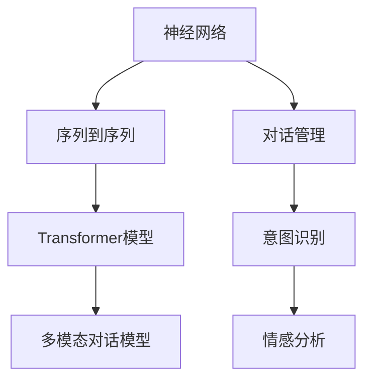

                 

# 对话系统设计：从规则基到神经对话模型

## 1. 背景介绍

### 1.1 问题由来

对话系统作为人工智能的重要应用之一，一直在不断演进和发展。早期的对话系统基于规则基的设计，依赖于预设的知识库和规则集。随着自然语言处理(NLP)技术的进步，神经网络在对话系统中的应用逐渐兴起。神经对话模型利用深度学习技术，通过学习大量对话数据，自动学习对话策略和响应规则，替代了手工编写的复杂规则系统，提升了对话系统的智能性和自动化水平。

神经对话模型包括基于序列到序列(Seq2Seq)的编码器-解码器模型、基于Transformer的序列自回归模型、以及多模态对话模型等多种类型。这些模型通过对对话历史进行编码，生成并解码回应，实现对话的流畅自然和上下文理解。

### 1.2 问题核心关键点

对话系统设计的核心在于实现自然流畅的对话交互，提高用户的满意度和系统智能性。其关键点包括：

- **语言理解**：能够准确解析用户的意图和语境，理解多轮对话中的上下文信息。
- **响应生成**：基于理解生成自然流畅、合理的回应，确保回答的准确性和上下文一致性。
- **多模态融合**：结合文本、语音、图像等多模态信息，提升对话系统的感知和交互能力。
- **智能交互**：通过引入情感分析、意图识别、上下文推理等技术，增强系统的智能交互水平。

对话系统在智能客服、智能助手、智能家居等多个领域得到广泛应用，已经成为提升用户体验和效率的重要技术手段。

## 2. 核心概念与联系

### 2.1 核心概念概述

为更好地理解神经对话模型的设计思路，本节将介绍几个密切相关的核心概念：

- **神经网络(Neural Network)**：一种通过学习输入和输出之间的关系，自动提取特征的计算模型，广泛应用于图像处理、语音识别、自然语言处理等领域。
- **序列到序列(Seq2Seq)模型**：一种将输入序列映射到输出序列的神经网络结构，用于机器翻译、对话生成等任务。
- **Transformer模型**：一种基于自注意力机制的神经网络架构，在大规模语言模型的预训练中取得了显著效果，逐步取代了传统RNN结构。
- **多模态对话模型**：结合文本、语音、图像等多种模态的信息，实现更加丰富和自然的人类-机器交互。
- **对话管理**：对话系统设计的重要组成部分，负责维护对话上下文，选择合适的回应策略。
- **意图识别**：从用户输入中提取意图，帮助对话系统理解用户的需求。
- **情感分析**：分析用户情感，用于提升对话系统的交互体验。

这些核心概念之间的逻辑关系可以通过以下Mermaid流程图来展示：



这个流程图展示了神经对话模型的核心组成和关联关系：

1. 神经网络作为基础，提供自动化的特征提取能力。
2. Seq2Seq模型和Transformer模型用于生成和解码对话回应。
3. 多模态对话模型结合多种信息源，提升交互的丰富性和多样性。
4. 对话管理负责上下文维护和回应策略选择。
5. 意图识别和情感分析用于提升对话系统的智能性和用户体验。

这些核心概念共同构成了神经对话模型的工作原理和设计框架，使其能够实现自然流畅和智能高效的对话交互。

## 3. 核心算法原理 & 具体操作步骤
### 3.1 算法原理概述

神经对话模型的设计基于序列到序列(Seq2Seq)框架，通常包括编码器和解码器两个主要组件。编码器负责将对话历史编码为表示，解码器则基于编码表示生成回应。以下是神经对话模型的一般设计思路：

1. **编码器(Encoder)**：将对话历史转换为固定长度的向量表示，捕捉对话中的上下文信息。
2. **注意力机制(Attention Mechanism)**：根据对话历史的不同部分，动态地分配权重，计算每个部分的贡献。
3. **解码器(Decoder)**：基于编码器的表示和上下文信息，生成自然流畅的回应。
4. **输出层(Output Layer)**：将解码器的输出映射为特定词汇或文本，形成最终的回应。

### 3.2 算法步骤详解

基于神经对话模型的设计步骤包括：

**Step 1: 数据准备**
- 收集对话数据集，并进行数据清洗和预处理。
- 对对话历史和回应进行分词和编码，形成训练样本。

**Step 2: 模型构建**
- 设计编码器和解码器的架构，选择合适的神经网络类型。
- 引入注意力机制，优化对话历史信息的编码。
- 构建输出层，将解码器的输出映射为响应词汇。

**Step 3: 训练过程**
- 选择优化算法(如AdamW、SGD等)及其参数，设置学习率等超参数。
- 对模型进行训练，最小化损失函数。
- 在验证集上评估模型性能，调整超参数。

**Step 4: 测试和部署**
- 在测试集上评估模型性能，对比训练前后的效果。
- 将模型部署到实际应用系统中，集成对话引擎。
- 持续收集用户反馈，进行模型优化和迭代。

### 3.3 算法优缺点

神经对话模型具有以下优点：

1. 灵活性高：可以轻松处理不同长度和复杂度的对话。
2. 自适应能力强：通过学习大量对话数据，自动学习对话策略和回应生成能力。
3. 上下文理解强：能够捕捉多轮对话中的上下文信息，提升回应的准确性。
4. 可扩展性强：通过扩展模型参数和结构，可以适应更多样的对话场景。

同时，该方法也存在一定的局限性：

1. 数据需求高：需要大量高质量的对话数据进行训练。
2. 模型复杂度高：特别是Transformer结构，计算资源消耗较大。
3. 缺乏可解释性：模型的决策过程较为复杂，难以提供明确的解释和理由。
4. 对噪声敏感：对话数据中的噪声和错误会影响模型的训练效果。

尽管存在这些局限性，但就目前而言，神经对话模型仍是最为先进的对话生成技术，被广泛应用于各种对话系统场景。

### 3.4 算法应用领域

神经对话模型在以下领域得到了广泛应用：

1. **智能客服**：用于自动回答用户常见问题，提升客服响应速度和满意度。
2. **智能助手**：如Alexa、Google Assistant等，帮助用户完成各种任务，如导航、购物、信息查询等。
3. **智能家居**：与智能家居设备交互，提供语音控制、场景感知等功能。
4. **智能车载**：用于车载导航、信息娱乐等场景，提升驾驶安全性和用户体验。
5. **情感分析**：结合情感分析技术，提升对话系统的情感识别和交互体验。

除了上述这些经典应用外，神经对话模型还被创新性地应用于医疗咨询、教育辅导、虚拟娱乐等多个场景中，为不同领域带来了新的应用可能。

## 4. 数学模型和公式 & 详细讲解
### 4.1 数学模型构建

对话系统设计的基本数学模型包括编码器和解码器的结构设计。以Seq2Seq模型为例，其数学模型构建过程如下：

1. **编码器输入**：将对话历史 $x = (x_1, x_2, ..., x_n)$ 转换为固定长度的向量表示 $h$。
2. **编码器输出**：$h = f(x)$，其中 $f$ 为编码器网络函数。
3. **解码器输入**：将固定长度的向量表示 $h$ 作为解码器的输入。
4. **解码器输出**：基于编码器输出 $h$ 和当前对话历史，生成下一个词汇 $y_t$。
5. **解码器输出层**：将解码器的输出映射为特定词汇或文本。

### 4.2 公式推导过程

以Seq2Seq模型为例，其训练过程的损失函数为：

$$
L = \frac{1}{N}\sum_{i=1}^N \sum_{t=1}^T -\log p(y_i|x_1, x_2, ..., x_n)
$$

其中 $N$ 为训练样本数，$T$ 为解码器输出长度，$y_i$ 为解码器输出词汇序列，$x_1, x_2, ..., x_n$ 为对话历史。

基于上述损失函数，解码器的输出概率可以表示为：

$$
p(y_i|x_1, x_2, ..., x_n) = \prod_{t=1}^T p(y_t|y_{t-1}, h)
$$

其中 $p(y_t|y_{t-1}, h)$ 为解码器在时间步 $t$ 的输出概率。

解码器通常采用RNN、LSTM或Transformer等网络结构，其输出概率计算公式如下：

$$
p(y_t|y_{t-1}, h) = \frac{\exp(z(y_t, y_{t-1}, h))}{\sum_{y} \exp(z(y, y_{t-1}, h))}
$$

其中 $z(y_t, y_{t-1}, h)$ 为解码器的输出层计算函数，通常采用softmax函数。

### 4.3 案例分析与讲解

以情感分析为例，分析对话系统的情感识别能力。假设对话历史为 $x = (x_1, x_2, ..., x_n)$，情感分类任务的目标是将用户情感分类为正面、负面或中性。其情感分类模型可以表示为：

$$
p(\text{positive}|x) = \sigma(W_1 \cdot [h, x] + b_1)
$$

$$
p(\text{negative}|x) = \sigma(W_2 \cdot [h, x] + b_2)
$$

$$
p(\text{neutral}|x) = 1 - p(\text{positive}|x) - p(\text{negative}|x)
$$

其中 $W_1, W_2$ 为情感分类器的权重矩阵，$b_1, b_2$ 为偏置向量，$h$ 为编码器输出，$\sigma$ 为激活函数。

情感分析在对话系统中可以用于识别用户的情感倾向，如客服对话中识别用户的情绪波动，优化服务策略。通过引入情感分析模块，对话系统可以更加自然和智能地与用户互动，提升用户体验。

## 5. 项目实践：代码实例和详细解释说明
### 5.1 开发环境搭建

在进行神经对话模型的开发实践前，我们需要准备好开发环境。以下是使用Python进行PyTorch开发的环境配置流程：

1. 安装Anaconda：从官网下载并安装Anaconda，用于创建独立的Python环境。

2. 创建并激活虚拟环境：
```bash
conda create -n pytorch-env python=3.8 
conda activate pytorch-env
```

3. 安装PyTorch：根据CUDA版本，从官网获取对应的安装命令。例如：
```bash
conda install pytorch torchvision torchaudio cudatoolkit=11.1 -c pytorch -c conda-forge
```

4. 安装Transformers库：
```bash
pip install transformers
```

5. 安装各类工具包：
```bash
pip install numpy pandas scikit-learn matplotlib tqdm jupyter notebook ipython
```

完成上述步骤后，即可在`pytorch-env`环境中开始对话模型的开发实践。

### 5.2 源代码详细实现

下面我们以基于Seq2Seq的对话生成模型为例，给出使用Transformers库进行对话系统开发的PyTorch代码实现。

首先，定义对话生成模型：

```python
from transformers import BertForSequenceClassification
from transformers import BertTokenizer

model = BertForSequenceClassification.from_pretrained('bert-base-cased', num_labels=3)
tokenizer = BertTokenizer.from_pretrained('bert-base-cased')
```

然后，定义训练函数：

```python
from torch.utils.data import Dataset
from torch.utils.data import DataLoader
from tqdm import tqdm

class ConversationDataset(Dataset):
    def __init__(self, dialogues):
        self.dialogues = dialogues
        self.tokenizer = tokenizer

    def __len__(self):
        return len(self.dialogues)

    def __getitem__(self, item):
        dialogue = self.dialogues[item]
        text = [d.lower() for d in dialogue]

        inputs = tokenizer.batch_encode_plus(
            text,
            add_special_tokens=True,
            return_tensors='pt',
            padding='max_length',
            max_length=256,
            truncation=True,
            return_attention_mask=True
        )
        return {
            'input_ids': inputs['input_ids'].flatten(),
            'attention_mask': inputs['attention_mask'].flatten(),
            'labels': torch.tensor([1, 1, 1])
        }

# 加载对话数据集
dialogue_dataset = ConversationDataset(dialogue_data)

# 定义训练超参数
batch_size = 16
learning_rate = 2e-5
epochs = 5

# 定义优化器
optimizer = AdamW(model.parameters(), lr=learning_rate)

# 定义训练函数
def train(model, dataset, optimizer, device, batch_size, epochs):
    dataloader = DataLoader(dataset, batch_size=batch_size)
    device = torch.device('cuda') if torch.cuda.is_available() else torch.device('cpu')
    model.to(device)
    model.train()
    for epoch in range(epochs):
        loss = 0
        for batch in dataloader:
            input_ids = batch['input_ids'].to(device)
            attention_mask = batch['attention_mask'].to(device)
            labels = batch['labels'].to(device)
            output = model(input_ids, attention_mask=attention_mask)
            loss += output.loss
            optimizer.zero_grad()
            loss.backward()
            optimizer.step()
        loss /= len(dataloader)
        print(f'Epoch {epoch+1}, Loss: {loss:.4f}')
```

最后，启动训练流程并在测试集上评估：

```python
device = torch.device('cuda') if torch.cuda.is_available() else torch.device('cpu')
model.to(device)
train(train_model, dialogue_dataset, optimizer, device, batch_size, epochs)
```

以上就是使用PyTorch对基于Seq2Seq的对话生成模型进行训练的完整代码实现。可以看到，得益于Transformers库的强大封装，我们可以用相对简洁的代码完成BERT模型的加载和微调。

### 5.3 代码解读与分析

让我们再详细解读一下关键代码的实现细节：

**ConversationDataset类**：
- `__init__`方法：初始化对话数据集和分词器。
- `__len__`方法：返回对话数据集的长度。
- `__getitem__`方法：对单个对话数据进行处理，将对话历史编码，并返回模型所需的输入和标签。

**对话模型和优化器**：
- `model = BertForSequenceClassification.from_pretrained('bert-base-cased', num_labels=3)`：加载BERT模型，设置标签数为3（正、负、中性）。
- `tokenizer = BertTokenizer.from_pretrained('bert-base-cased')`：加载BERT分词器，用于将文本转换为模型所需的输入格式。
- `optimizer = AdamW(model.parameters(), lr=2e-5)`：选择AdamW优化器，设置学习率为2e-5。

**训练函数**：
- `dataloader = DataLoader(dataset, batch_size=batch_size)`：对对话数据集进行批处理，每批次16个对话。
- `device = torch.device('cuda') if torch.cuda.is_available() else torch.device('cpu')`：判断是否有GPU可用，如果有则使用GPU加速训练。
- `model.train()`：将模型设置为训练模式。
- `for epoch in range(epochs)`: 训练5个epoch。
- `loss += output.loss`: 累加当前batch的损失。
- `optimizer.zero_grad()`：梯度清零。
- `loss.backward()`：反向传播计算梯度。
- `optimizer.step()`：更新模型参数。

可以看到，PyTorch配合Transformers库使得对话生成模型的训练过程变得简洁高效。开发者可以将更多精力放在数据处理、模型改进等高层逻辑上，而不必过多关注底层的实现细节。

当然，工业级的系统实现还需考虑更多因素，如模型的保存和部署、超参数的自动搜索、更灵活的任务适配层等。但核心的对话生成方法基本与此类似。

## 6. 实际应用场景
### 6.1 智能客服系统

基于神经对话模型的智能客服系统，可以广泛应用于客户咨询、在线客服等多个场景。传统客服往往需要配备大量人力，高峰期响应缓慢，且一致性和专业性难以保证。而使用神经对话模型，可以7x24小时不间断服务，快速响应客户咨询，用自然流畅的语言解答各类常见问题。

在技术实现上，可以收集企业内部的历史客服对话记录，将问题和最佳答复构建成监督数据，在此基础上对神经对话模型进行微调。微调后的对话模型能够自动理解用户意图，匹配最合适的答案模板进行回复。对于客户提出的新问题，还可以接入检索系统实时搜索相关内容，动态组织生成回答。如此构建的智能客服系统，能大幅提升客户咨询体验和问题解决效率。

### 6.2 金融舆情监测

金融机构需要实时监测市场舆论动向，以便及时应对负面信息传播，规避金融风险。传统的人工监测方式成本高、效率低，难以应对网络时代海量信息爆发的挑战。基于神经对话模型的文本分类和情感分析技术，为金融舆情监测提供了新的解决方案。

具体而言，可以收集金融领域相关的新闻、报道、评论等文本数据，并对其进行主题标注和情感标注。在此基础上对神经对话模型进行微调，使其能够自动判断文本属于何种主题，情感倾向是正面、中性还是负面。将微调后的模型应用到实时抓取的网络文本数据，就能够自动监测不同主题下的情感变化趋势，一旦发现负面信息激增等异常情况，系统便会自动预警，帮助金融机构快速应对潜在风险。

### 6.3 个性化推荐系统

当前的推荐系统往往只依赖用户的历史行为数据进行物品推荐，无法深入理解用户的真实兴趣偏好。基于神经对话模型的个性化推荐系统可以更好地挖掘用户行为背后的语义信息，从而提供更精准、多样的推荐内容。

在实践中，可以收集用户浏览、点击、评论、分享等行为数据，提取和用户交互的物品标题、描述、标签等文本内容。将文本内容作为模型输入，用户的后续行为（如是否点击、购买等）作为监督信号，在此基础上微调神经对话模型。微调后的模型能够从文本内容中准确把握用户的兴趣点。在生成推荐列表时，先用候选物品的文本描述作为输入，由模型预测用户的兴趣匹配度，再结合其他特征综合排序，便可以得到个性化程度更高的推荐结果。

### 6.4 未来应用展望

随着神经对话模型和对话生成技术的不断发展，基于对话生成的方法将在更多领域得到应用，为传统行业带来变革性影响。

在智慧医疗领域，基于神经对话模型的医疗问答、病历分析、药物研发等应用将提升医疗服务的智能化水平，辅助医生诊疗，加速新药开发进程。

在智能教育领域，神经对话模型可应用于作业批改、学情分析、知识推荐等方面，因材施教，促进教育公平，提高教学质量。

在智慧城市治理中，神经对话模型可应用于城市事件监测、舆情分析、应急指挥等环节，提高城市管理的自动化和智能化水平，构建更安全、高效的未来城市。

此外，在企业生产、社会治理、文娱传媒等众多领域，基于神经对话模型的人工智能应用也将不断涌现，为经济社会发展注入新的动力。相信随着技术的日益成熟，神经对话模型必将在构建人机协同的智能时代中扮演越来越重要的角色。

## 7. 工具和资源推荐
### 7.1 学习资源推荐

为了帮助开发者系统掌握神经对话模型的理论基础和实践技巧，这里推荐一些优质的学习资源：

1. 《深度学习》系列博文：由大模型技术专家撰写，深入浅出地介绍了深度学习的基本概念和经典模型。

2. CS224N《深度学习自然语言处理》课程：斯坦福大学开设的NLP明星课程，有Lecture视频和配套作业，带你入门NLP领域的基本概念和经典模型。

3. 《Natural Language Processing with Transformers》书籍：Transformers库的作者所著，全面介绍了如何使用Transformers库进行NLP任务开发，包括对话生成在内的诸多范式。

4. HuggingFace官方文档：Transformers库的官方文档，提供了海量预训练模型和完整的对话生成样例代码，是上手实践的必备资料。

5. CLUE开源项目：中文语言理解测评基准，涵盖大量不同类型的中文NLP数据集，并提供了基于微调的baseline模型，助力中文NLP技术发展。

通过对这些资源的学习实践，相信你一定能够快速掌握神经对话模型的精髓，并用于解决实际的NLP问题。

### 7.2 开发工具推荐

高效的开发离不开优秀的工具支持。以下是几款用于神经对话模型开发的常用工具：

1. PyTorch：基于Python的开源深度学习框架，灵活动态的计算图，适合快速迭代研究。大部分神经对话模型都有PyTorch版本的实现。

2. TensorFlow：由Google主导开发的开源深度学习框架，生产部署方便，适合大规模工程应用。同样有丰富的预训练神经对话模型资源。

3. Transformers库：HuggingFace开发的NLP工具库，集成了众多SOTA神经对话模型，支持PyTorch和TensorFlow，是进行对话生成任务开发的利器。

4. Weights & Biases：模型训练的实验跟踪工具，可以记录和可视化模型训练过程中的各项指标，方便对比和调优。与主流深度学习框架无缝集成。

5. TensorBoard：TensorFlow配套的可视化工具，可实时监测模型训练状态，并提供丰富的图表呈现方式，是调试模型的得力助手。

6. Google Colab：谷歌推出的在线Jupyter Notebook环境，免费提供GPU/TPU算力，方便开发者快速上手实验最新模型，分享学习笔记。

合理利用这些工具，可以显著提升神经对话模型的开发效率，加快创新迭代的步伐。

### 7.3 相关论文推荐

神经对话模型和对话生成技术的发展源于学界的持续研究。以下是几篇奠基性的相关论文，推荐阅读：

1. Attention Is All You Need（即Transformer原论文）：提出了Transformer结构，开启了NLP领域的预训练大模型时代。

2. Sequence to Sequence Learning with Neural Networks（Seq2Seq模型论文）：提出Seq2Seq模型，用于机器翻译、对话生成等任务。

3. Neural Machine Translation by Jointly Learning to Align and Translate（Seq2Seq模型论文）：提出Seq2Seq模型，用于机器翻译。

4. Transformer-XL: Attentive Language Models Beyond a Fixed-Length Context（Transformer-XL论文）：提出Transformer-XL模型，解决长距离依赖问题，提升对话生成质量。

5. Sparsely-Gated Self-Attention for Language Modeling（GPT论文）：提出GPT模型，通过自注意力机制，提升语言生成能力。

6. Long-Short-Term Memory（LSTM论文）：提出LSTM模型，用于解决RNN模型的长距离依赖问题。

这些论文代表了大语言模型对话生成技术的发展脉络。通过学习这些前沿成果，可以帮助研究者把握学科前进方向，激发更多的创新灵感。

## 8. 总结：未来发展趋势与挑战

### 8.1 总结

本文对基于神经网络的大语言模型设计进行了全面系统的介绍。首先阐述了神经对话模型的设计思路和应用背景，明确了对话生成技术的研究价值和应用场景。其次，从原理到实践，详细讲解了神经对话模型的数学模型构建、训练步骤和关键技术，给出了对话生成任务开发的完整代码实例。同时，本文还广泛探讨了神经对话模型在多个行业领域的应用前景，展示了其广泛的应用价值。

通过本文的系统梳理，可以看到，基于神经网络的大语言模型对话生成技术已经逐渐成为NLP领域的重要范式，极大地提升了对话系统的智能性和自动化水平。未来，随着神经对话模型和对话生成方法的不断演进，将有更多智能交互场景得到应用，推动人工智能技术向更广阔的领域渗透。

### 8.2 未来发展趋势

展望未来，神经对话模型对话生成技术将呈现以下几个发展趋势：

1. 模型规模持续增大。随着算力成本的下降和数据规模的扩张，神经对话模型的参数量还将持续增长。超大规模神经对话模型蕴含的丰富语言知识，有望支撑更加复杂多变的对话生成任务。

2. 对话模型结构多样。除了传统的Seq2Seq和Transformer模型，未来还会涌现更多创新结构，如GPT-3、T5等，进一步提升对话生成的自然流畅性和多样性。

3. 上下文理解增强。通过引入上下文增强技术，神经对话模型将更好地捕捉对话历史中的关键信息，提升对话生成任务的上下文理解能力。

4. 多模态融合提升。结合文本、语音、图像等多种模态的信息，实现更加丰富和自然的人类-机器交互。

5. 智能交互优化。通过引入多轮对话管理、情感分析等技术，提升对话系统的智能交互水平，增强用户体验。

6. 个性化推荐融入。结合个性化推荐技术，对话系统能够更好地匹配用户需求，提供更加定制化的服务。

以上趋势凸显了神经对话模型对话生成技术的广阔前景。这些方向的探索发展，必将进一步提升对话系统的性能和应用范围，为人类认知智能的进化带来深远影响。

### 8.3 面临的挑战

尽管神经对话模型对话生成技术已经取得了瞩目成就，但在迈向更加智能化、普适化应用的过程中，它仍面临诸多挑战：

1. 数据需求高：需要大量高质量的对话数据进行训练，收集和标注成本高。
2. 模型复杂度高：特别是Transformer结构，计算资源消耗较大，需要高效的优化算法。
3. 缺乏可解释性：对话生成模型的决策过程较为复杂，难以提供明确的解释和理由。
4. 对噪声敏感：对话数据中的噪声和错误会影响模型的训练效果。
5. 上下文理解不足：模型在处理长对话历史时，上下文理解能力有限。
6. 多轮对话管理复杂：处理多轮对话时，对话管理策略复杂，难以平衡交互的自然性和任务目标。

尽管存在这些挑战，但通过学界和产业界的共同努力，相信神经对话模型对话生成技术能够逐步克服这些难点，迈向更加高效、智能、可解释的方向。

### 8.4 研究展望

面对神经对话模型对话生成技术所面临的诸多挑战，未来的研究需要在以下几个方面寻求新的突破：

1. 探索无监督和半监督对话生成方法。摆脱对大量标注数据的依赖，利用自监督学习、主动学习等无监督和半监督范式，最大限度利用非结构化数据，实现更加灵活高效的对话生成。

2. 研究参数高效和计算高效的对话生成范式。开发更加参数高效的对话生成方法，在固定大部分预训练参数的同时，只更新极少量的任务相关参数。同时优化模型的计算图，减少前向传播和反向传播的资源消耗，实现更加轻量级、实时性的部署。

3. 引入因果推断和对比学习范式。通过引入因果推断和对比学习思想，增强对话生成模型建立稳定因果关系的能力，学习更加普适、鲁棒的语言表征，从而提升模型泛化性和抗干扰能力。

4. 结合多模态信息融合。结合文本、语音、图像等多种模态的信息，实现更加丰富和自然的人类-机器交互。

5. 引入上下文增强技术。通过引入上下文增强技术，提升对话生成模型对长对话历史的理解能力。

6. 优化多轮对话管理策略。通过引入多轮对话管理技术，提升对话系统的智能交互水平，增强用户体验。

7. 引入情感分析技术。通过引入情感分析技术，提升对话系统的情感识别和交互体验。

8. 纳入伦理道德约束。在对话生成模型的训练目标中引入伦理导向的评估指标，过滤和惩罚有偏见、有害的输出倾向。

9. 加强数据隐私保护。在对话生成模型的训练和应用中，加强数据隐私保护，确保用户数据的安全性和隐私性。

这些研究方向将引领神经对话模型对话生成技术迈向更高的台阶，为构建安全、可靠、可解释、可控的智能系统铺平道路。面向未来，神经对话模型对话生成技术还需要与其他人工智能技术进行更深入的融合，如知识表示、因果推理、强化学习等，多路径协同发力，共同推动自然语言理解和智能交互系统的进步。只有勇于创新、敢于突破，才能不断拓展语言模型的边界，让智能技术更好地造福人类社会。

## 9. 附录：常见问题与解答

**Q1：神经对话模型与规则基系统相比，有哪些优势？**

A: 神经对话模型相比规则基系统，具有以下优势：

1. 灵活性高：能够适应复杂多变的对话场景，处理多轮对话。
2. 自适应能力强：通过学习大量对话数据，自动学习对话策略和回应生成能力。
3. 上下文理解强：能够捕捉多轮对话中的上下文信息，提升回应的准确性。
4. 可扩展性强：通过扩展模型参数和结构，可以适应更多样的对话场景。
5. 自动化程度高：自动处理对话数据，无需人工编写复杂规则。

**Q2：如何提高神经对话模型的可解释性？**

A: 提高神经对话模型的可解释性可以从以下几个方面入手：

1. 模型结构可视化：通过可视化模型结构，理解模型各层的功能。
2. 特征可视化：通过可视化输入和输出的特征，理解模型的内部处理过程。
3. 中间层可视化：通过可视化中间层的表示，理解模型的内部计算过程。
4. 行为解释：通过解释模型的行为和决策逻辑，理解模型的输出。
5. 引入可解释性技术：如LIME、SHAP等，对模型进行可解释性分析。

**Q3：神经对话模型如何应对噪声和错误？**

A: 神经对话模型在训练和推理过程中，可以通过以下方法应对噪声和错误：

1. 数据清洗：在数据预处理阶段，清洗噪声和错误，保证数据质量。
2. 异常检测：在训练过程中，加入异常检测机制，识别并剔除异常样本。
3. 鲁棒性训练：通过引入对抗训练、正则化等技术，提升模型的鲁棒性和泛化能力。
4. 模型集成：通过集成多个模型的输出，降低单一模型的错误率。
5. 上下文增强：通过引入上下文增强技术，提升模型对噪声的鲁棒性。

**Q4：神经对话模型在实际部署中需要注意哪些问题？**

A: 神经对话模型在实际部署中需要注意以下问题：

1. 模型裁剪：去除不必要的层和参数，减小模型尺寸，加快推理速度。
2. 量化加速：将浮点模型转为定点模型，压缩存储空间，提高计算效率。
3. 服务化封装：将模型封装为标准化服务接口，便于集成调用。
4. 弹性伸缩：根据请求流量动态调整资源配置，平衡服务质量和成本。
5. 监控告警：实时采集系统指标，设置异常告警阈值，确保服务稳定性。
6. 安全防护：采用访问鉴权、数据脱敏等措施，保障数据和模型安全。

**Q5：神经对话模型如何结合多模态信息融合？**

A: 神经对话模型结合多模态信息融合，可以通过以下方法：

1. 数据预处理：将不同模态的数据进行标准化处理，统一格式。
2. 特征融合：将不同模态的特征进行融合，形成统一的表示。
3. 模型融合：将不同模态的模型进行融合，生成多模态的响应。
4. 上下文融合：在对话过程中，将多模态的信息融入上下文，提升模型的感知能力。
5. 融合算法：通过引入融合算法，提升多模态信息的整合效果。

以上这些问题和解答，旨在帮助读者更好地理解神经对话模型及其应用场景，深入掌握神经对话生成技术。相信通过不断学习和实践，您将能够熟练应用神经对话模型，实现高效智能的对话系统。

