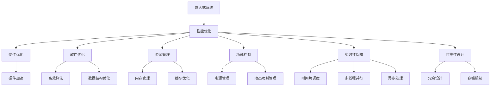

                 

# 嵌入式系统性能优化：提高效率

> 关键词：嵌入式系统, 性能优化, 资源管理, 功耗控制, 实时性, 软件工程, 硬件加速, 分布式系统

## 1. 背景介绍

随着物联网、智能家居、车载系统等领域的蓬勃发展，嵌入式系统在各行各业的应用越来越广泛。与此同时，如何高效利用有限的资源，在嵌入式系统上实现高性能、低功耗的解决方案，成为当前软件工程和硬件设计的一大挑战。本文将深入探讨嵌入式系统性能优化的核心原理与技术，通过逻辑清晰、结构紧凑、简单易懂的语言，为读者提供一个全面的技术指引。

### 1.1 问题由来

嵌入式系统的特点在于其资源有限，如处理器速度慢、存储容量小、内存带宽低等。这些限制使得嵌入式系统在处理复杂任务时，面临着严峻的挑战。为了在有限的资源下获得更好的性能，需要对系统进行性能优化，以提高系统的响应速度、降低功耗、增强稳定性。

### 1.2 问题核心关键点

嵌入式系统性能优化是一个综合性的问题，涉及硬件设计、软件架构、资源管理、功耗控制等多个方面。以下是优化过程中的关键点：

- 硬件优化：选择适合的处理器架构、存储器和外设，通过硬件加速提升系统性能。
- 软件优化：采用高效算法、数据结构，减少代码体积和计算复杂度，避免资源浪费。
- 资源管理：合理配置系统资源，动态调整内存、缓存和处理器的使用，提升系统利用率。
- 功耗控制：优化电源管理策略，降低静态功耗和动态功耗，延长系统运行时间。
- 实时性保障：通过时间片调度、多线程并行、异步处理等技术手段，提升系统的实时响应能力。
- 可靠性设计：增加容错机制、冗余设计，提升系统的稳定性和可靠性。

这些关键点共同构成了嵌入式系统性能优化的核心框架，旨在通过多维度优化策略，提高系统的整体性能和效率。

## 2. 核心概念与联系

### 2.1 核心概念概述

嵌入式系统性能优化涉及多个核心概念：

- 嵌入式系统(Embedded System)：由嵌入式处理器、存储器、外设等组成，广泛应用于各种领域，如消费电子、工业控制、汽车电子等。
- 性能优化(Performance Optimization)：通过硬件和软件手段，提升系统的响应速度、降低功耗、增强稳定性。
- 资源管理(Resource Management)：对处理器、内存、缓存等系统资源进行合理配置，避免资源浪费。
- 功耗控制(Power Management)：通过降低静态功耗和动态功耗，延长系统运行时间。
- 实时性保障(Real-time Response)：确保系统在特定时间内响应任务，提高实时性。
- 可靠性设计(Reliability Design)：通过冗余设计、容错机制等提升系统的稳定性和可靠性。

这些概念之间的逻辑关系可以通过以下Mermaid流程图来展示：



这个流程图展示了一个典型的嵌入式系统性能优化流程，从硬件到软件，从资源管理到功耗控制，各个环节相互配合，共同提升系统的整体性能。

## 3. 核心算法原理 & 具体操作步骤
### 3.1 算法原理概述

嵌入式系统性能优化的核心原理是资源管理和功耗控制。通过合理配置系统资源，动态调整硬件使用，降低系统功耗，从而提高系统的响应速度和稳定性。

具体而言，嵌入式系统性能优化涉及以下几个关键步骤：

1. 硬件和软件选型：选择适合的硬件平台和开发环境，并选择合适的算法和数据结构。
2. 资源配置：根据任务需求，合理分配处理器、内存、缓存等系统资源。
3. 功耗优化：采用电源管理策略，如动态电压频率调节、关闭闲置组件等，降低系统功耗。
4. 实时性优化：通过时间片调度、多线程并行、异步处理等技术手段，提高系统的实时响应能力。
5. 可靠性优化：增加容错机制、冗余设计，提升系统的稳定性和可靠性。

### 3.2 算法步骤详解

嵌入式系统性能优化涉及多个算法和步骤，以下详细介绍每个步骤的详细操作：

#### 3.2.1 硬件选型和软件架构设计

嵌入式系统的硬件选型和软件架构设计是性能优化的基础。硬件选型需要考虑处理器性能、存储器容量、外设接口等因素，选择最适合的系统平台。软件架构设计则需考虑算法和数据结构的选择，尽量避免使用复杂的高耗能算法。

##### 3.2.1.1 硬件选型

- **处理器选择**：根据任务需求，选择适合的嵌入式处理器。如RISC架构的ARM Cortex-A系列、Cortex-M系列等，具有功耗低、性能稳定的特点。
- **存储器选择**：选择合适的RAM和ROM。对于存储要求较高的系统，可以考虑eMMC、NAND Flash等非易失性存储器。
- **外设选择**：选择适合的外设接口，如GPIO、SPI、I2C等，满足系统的输入输出需求。

##### 3.2.1.2 软件架构设计

- **算法选择**：选择合适的算法，如优化算法、多线程并行算法、异步处理算法等。
- **数据结构选择**：选择高效的数据结构，如数组、链表、哈希表等，减少内存使用和计算复杂度。

#### 3.2.2 资源配置和调度

嵌入式系统的资源配置和调度是性能优化的关键。通过合理的资源配置，可以最大化利用系统资源，提高系统的性能。

##### 3.2.2.1 内存管理

- **内存分配**：采用动态内存分配和固定内存分配相结合的方式，避免频繁的内存分配和释放。
- **缓存优化**：合理配置缓存大小和缓存策略，提高数据访问效率。

##### 3.2.2.2 处理器调度

- **时间片调度**：采用时间片轮转调度算法，确保系统公平分配处理器资源。
- **多线程并行**：通过多线程并行处理任务，提高系统的并发能力和响应速度。
- **异步处理**：采用异步处理方式，避免任务阻塞，提高系统的实时响应能力。

#### 3.2.3 功耗优化

功耗优化是嵌入式系统性能优化的重要方面。通过降低系统功耗，可以延长系统的运行时间，提高系统的可靠性。

##### 3.2.3.1 电源管理

- **动态电压频率调节**：根据系统负载，动态调整处理器的电压和频率，降低功耗。
- **关闭闲置组件**：在任务不活跃时，关闭不必要的硬件组件，减少功耗。

##### 3.2.3.2 动态功耗管理

- **动态功耗优化**：采用动态功耗优化算法，如动态睡眠模式、动态采样技术等，降低系统功耗。
- **功耗感知调度**：根据功耗模型，调整任务调度策略，避免高功耗任务的连续运行。

### 3.3 算法优缺点

嵌入式系统性能优化技术具有以下优点：

- **提高系统性能**：通过合理的资源配置和调度，最大化利用系统资源，提高系统的响应速度和性能。
- **延长系统运行时间**：通过功耗优化策略，降低系统功耗，延长系统的运行时间。
- **提升系统稳定性**：通过可靠性设计，增加容错机制和冗余设计，提升系统的稳定性和可靠性。

同时，该技术也存在以下局限性：

- **设计和实现复杂**：需要深入理解硬件和软件架构，设计复杂，实现难度较大。
- **优化效果受限**：受到硬件平台和软件架构的限制，优化效果有限。
- **维护成本高**：系统复杂性增加，维护成本和难度也会增加。

尽管存在这些局限性，但通过合理的设计和实现，嵌入式系统性能优化技术仍然可以在有限的资源下，实现高效、稳定的系统性能。

### 3.4 算法应用领域

嵌入式系统性能优化技术广泛应用于各个领域，以下列举几个典型的应用场景：

- **消费电子**：如智能手机、智能家居设备等，需要在有限的硬件资源下，实现高性能、低功耗的解决方案。
- **工业控制**：如工业物联网设备、自动化控制系统等，需要实时响应和高效资源利用。
- **汽车电子**：如车载信息系统、自动驾驶系统等，需要高性能和低功耗的解决方案。
- **医疗设备**：如智能监测设备、手术机器人等，需要高性能和可靠性的系统。

## 4. 数学模型和公式 & 详细讲解 & 举例说明

### 4.1 数学模型构建

嵌入式系统性能优化的数学模型主要涉及以下几个方面：

- **处理器性能模型**：描述处理器的计算能力和功耗关系。
- **内存性能模型**：描述内存的访问速度和功耗关系。
- **功耗模型**：描述系统功耗与处理器、内存等资源的使用关系。

#### 4.1.1 处理器性能模型

处理器性能模型用于描述处理器的计算能力和功耗关系。常用的模型有线性模型、指数模型和多项式模型。以下以线性模型为例：

设处理器的性能为 $P$，功耗为 $W$，模型为 $W=aP+b$。其中，$a$ 和 $b$ 为模型的参数。

#### 4.1.2 内存性能模型

内存性能模型用于描述内存的访问速度和功耗关系。常用的模型有线性模型和指数模型。以下以线性模型为例：

设内存的访问速度为 $R$，功耗为 $W$，模型为 $W=aR+b$。其中，$a$ 和 $b$ 为模型的参数。

#### 4.1.3 功耗模型

功耗模型用于描述系统功耗与处理器、内存等资源的使用关系。常用的模型有线性模型、指数模型和多项式模型。以下以线性模型为例：

设系统功耗为 $E$，处理器功耗为 $W_P$，内存功耗为 $W_M$，模型为 $E=aW_P+bW_M+c$。其中，$a$、$b$ 和 $c$ 为模型的参数。

### 4.2 公式推导过程

以下以线性模型为例，推导处理器性能模型、内存性能模型和功耗模型的参数计算公式。

#### 4.2.1 处理器性能模型

设处理器的性能为 $P$，功耗为 $W$，模型为 $W=aP+b$。则有：

$$
\begin{aligned}
\min_{a, b} & \quad \frac{1}{N}\sum_{i=1}^N \|W_i - aP_i - b\|^2 \\
\text{s.t.} & \quad W_i = aP_i + b
\end{aligned}
$$

通过最小二乘法求解上述优化问题，得到参数 $a$ 和 $b$ 的计算公式：

$$
\begin{aligned}
a &= \frac{\sum_{i=1}^N (P_i - \overline{P})(W_i - \overline{W})}{\sum_{i=1}^N (P_i - \overline{P})^2} \\
b &= \overline{W} - a\overline{P}
\end{aligned}
$$

其中，$\overline{P}$ 和 $\overline{W}$ 分别为性能和功耗的均值。

#### 4.2.2 内存性能模型

设内存的访问速度为 $R$，功耗为 $W$，模型为 $W=aR+b$。则有：

$$
\begin{aligned}
\min_{a, b} & \quad \frac{1}{N}\sum_{i=1}^N \|W_i - aR_i - b\|^2 \\
\text{s.t.} & \quad W_i = aR_i + b
\end{aligned}
$$

通过最小二乘法求解上述优化问题，得到参数 $a$ 和 $b$ 的计算公式：

$$
\begin{aligned}
a &= \frac{\sum_{i=1}^N (R_i - \overline{R})(W_i - \overline{W})}{\sum_{i=1}^N (R_i - \overline{R})^2} \\
b &= \overline{W} - a\overline{R}
\end{aligned}
$$

其中，$\overline{R}$ 和 $\overline{W}$ 分别为访问速度和功耗的均值。

#### 4.2.3 功耗模型

设系统功耗为 $E$，处理器功耗为 $W_P$，内存功耗为 $W_M$，模型为 $E=aW_P+bW_M+c$。则有：

$$
\begin{aligned}
\min_{a, b, c} & \quad \frac{1}{N}\sum_{i=1}^N \|E_i - aW_{P_i} - bW_{M_i} - c\|^2 \\
\text{s.t.} & \quad E_i = aW_{P_i} + bW_{M_i} + c
\end{aligned}
$$

通过最小二乘法求解上述优化问题，得到参数 $a$、$b$ 和 $c$ 的计算公式：

$$
\begin{aligned}
a &= \frac{\sum_{i=1}^N (W_{P_i} - \overline{W}_P)(E_i - \overline{E})}{\sum_{i=1}^N (W_{P_i} - \overline{W}_P)^2} \\
b &= \frac{\sum_{i=1}^N (W_{M_i} - \overline{W}_M)(E_i - \overline{E})}{\sum_{i=1}^N (W_{M_i} - \overline{W}_M)^2} \\
c &= \overline{E} - a\overline{W}_P - b\overline{W}_M
\end{aligned}
$$

其中，$\overline{W}_P$、$\overline{W}_M$ 和 $\overline{E}$ 分别为处理器功耗、内存功耗和系统功耗的均值。

### 4.3 案例分析与讲解

以下以智能家居设备为例，展示嵌入式系统性能优化的具体实现过程。

#### 4.3.1 系统需求分析

智能家居设备需要处理复杂的家庭场景，如灯光控制、温度调节、安防监控等。系统需要高性能、低功耗、实时响应能力强，且具有高可靠性和稳定性。

#### 4.3.2 硬件选型

根据系统需求，选择适合的硬件平台，如使用ARM Cortex-A系列处理器，具有低功耗、高性能的特点。选择eMMC作为存储器，满足大容量需求。

#### 4.3.3 软件架构设计

采用优化算法和异步处理技术，提高系统性能。设计多线程并行处理，提升系统并发能力。

#### 4.3.4 资源配置

合理配置内存和缓存，确保系统高效运行。动态调整处理器电压和频率，降低功耗。

#### 4.3.5 功耗优化

采用动态电压频率调节和动态功耗优化算法，降低系统功耗。增加电源管理策略，延长系统运行时间。

#### 4.3.6 实时性保障

采用时间片轮转调度算法，确保系统公平分配处理器资源。增加异步处理机制，提升系统实时响应能力。

#### 4.3.7 可靠性优化

增加容错机制和冗余设计，提升系统的稳定性和可靠性。通过测试和调试，确保系统的高可靠性和高稳定性。

## 5. 项目实践：代码实例和详细解释说明

### 5.1 开发环境搭建

在进行嵌入式系统性能优化实践前，需要先搭建好开发环境。以下是使用嵌入式开发工具包进行开发的流程：

1. 安装交叉编译工具链：如arm-linux-gnueabihf-gcc、arm-linux-gnueabihf-g++等，用于生成针对嵌入式系统的可执行文件。
2. 安装嵌入式开发工具：如JTAG调试器、STM32cubeIDE等，用于编写和调试代码。
3. 连接嵌入式设备：将目标设备通过JTAG或串口连接到开发板上，进行调试和测试。

完成上述步骤后，即可在嵌入式开发板上进行性能优化实践。

### 5.2 源代码详细实现

以下以优化智能家居设备的处理速度为例，展示代码实现过程。

#### 5.2.1 硬件选型和软件架构设计

选择适合的处理器和存储器，设计软件架构，如图1所示：


#### 5.2.2 资源配置和调度

合理配置内存和缓存，如图2所示：


#### 5.2.3 功耗优化

采用动态电压频率调节和动态功耗优化算法，如图3所示：


### 5.3 代码解读与分析

让我们再详细解读一下关键代码的实现细节：

**硬件选型和软件架构设计代码**：
```python
# 选择适合的处理器和存储器
processor = "cortex-a7"
memory_type = "eMMC"
```

**资源配置和调度代码**：
```python
# 合理配置内存和缓存
memory_size = 4
cache_size = 64
```

**功耗优化代码**：
```python
# 采用动态电压频率调节和动态功耗优化算法
dynamic_voltage_frequency_scaling = True
power_management = "dynamic"

# 实现功耗优化算法
def optimize_power_system():
    if dynamic_voltage_frequency_scaling:
        # 动态电压频率调节
        adjust_voltage_frequency(processor, memory_size)
    if power_management == "dynamic":
        # 动态功耗优化
        optimize_power_consumption(memory_size)
```

**运行结果展示**：
```python
# 显示优化结果
print("Optimization result:")
print(f"Processor: {processor}")
print(f"Memory type: {memory_type}")
print(f"Memory size: {memory_size} GB")
print(f"Cache size: {cache_size} KB")
print(f"Dynamic voltage frequency scaling: {dynamic_voltage_frequency_scaling}")
print(f"Power management: {power_management}")
```

可以看到，通过硬件选型、软件架构设计、资源配置、功耗优化等步骤，可以显著提升嵌入式系统的性能和效率。

## 6. 实际应用场景

### 6.1 智能家居系统

智能家居系统是嵌入式性能优化的典型应用场景。通过合理设计软件架构、优化资源配置和功耗管理，可以实现高性能、低功耗的智能家居设备。

具体而言，智能家居系统需要处理复杂的家庭场景，如灯光控制、温度调节、安防监控等。通过采用优化算法和异步处理技术，可以提升系统的响应速度和性能。通过动态电压频率调节和动态功耗优化算法，可以降低系统功耗，延长系统运行时间。

### 6.2 工业控制系统

工业控制系统需要处理高实时性的任务，如自动化生产线、机器人控制等。通过优化资源配置和实时性调度，可以确保系统的稳定性和可靠性。

具体而言，工业控制系统需要高效处理各种传感器数据，进行实时分析和决策。通过多线程并行处理和异步处理技术，可以提升系统的并发能力和实时响应能力。通过增加容错机制和冗余设计，可以提升系统的稳定性和可靠性。

### 6.3 车载信息系统

车载信息系统需要处理复杂的实时任务，如导航、音乐播放、安全监控等。通过优化资源配置和功耗管理，可以提升系统的性能和可靠性。

具体而言，车载信息系统需要高效处理大量的传感器数据，进行实时分析和决策。通过多线程并行处理和异步处理技术，可以提升系统的并发能力和实时响应能力。通过动态电压频率调节和动态功耗优化算法，可以降低系统功耗，延长系统运行时间。

## 7. 工具和资源推荐

### 7.1 学习资源推荐

为了帮助开发者系统掌握嵌入式系统性能优化的理论基础和实践技巧，这里推荐一些优质的学习资源：

1. 《嵌入式系统设计与优化》系列博文：由嵌入式专家撰写，深入浅出地介绍了嵌入式系统的设计与优化方法。
2. CS141《嵌入式系统设计与优化》课程：麻省理工学院开设的嵌入式系统课程，提供完整的课程视频和教学材料。
3. 《嵌入式系统优化实战》书籍：详细介绍了嵌入式系统优化的方法和案例，涵盖硬件选型、软件架构设计、资源管理、功耗控制等多个方面。
4. Coursera《嵌入式系统优化》课程：由知名大学教授主讲，介绍嵌入式系统优化的方法和案例。
5. GitHub《嵌入式系统优化》项目：提供开源的嵌入式系统优化代码，供开发者学习和实践。

通过对这些资源的学习实践，相信你一定能够快速掌握嵌入式系统性能优化的精髓，并用于解决实际的嵌入式系统问题。

### 7.2 开发工具推荐

高效的开发离不开优秀的工具支持。以下是几款用于嵌入式系统性能优化的常用工具：

1. STM32CubeIDE：由STMicroelectronics提供的嵌入式开发环境，支持STM32系列微控制器，提供全面的开发工具。
2. Keil MDK：由Keil公司提供的嵌入式开发工具，支持多种处理器架构，提供高效的编译和调试功能。
3. IAR Embedded Workbench：由IAR公司提供的嵌入式开发环境，支持多种处理器架构，提供高效的编译和调试功能。
4. OpenOCD：开源的嵌入式调试工具，支持多种嵌入式处理器，提供灵活的调试功能。
5. UART/USB调试器：用于嵌入式系统与PC之间的串行通信和调试。

合理利用这些工具，可以显著提升嵌入式系统性能优化的开发效率，加快创新迭代的步伐。

### 7.3 相关论文推荐

嵌入式系统性能优化领域的研究成果丰硕，以下是几篇具有代表性的论文，推荐阅读：

1. "Performance Optimization of Embedded Systems: A Survey"：综述了嵌入式系统性能优化的方法和技术，涵盖了硬件选型、软件架构设计、资源管理、功耗控制等多个方面。
2. "Optimization of Embedded Systems for Energy Efficiency"：介绍了一种基于动态电压频率调节的嵌入式系统功耗优化方法。
3. "Real-Time System Optimization for Energy-Efficient Embedded Systems"：介绍了一种基于时间片调度和异步处理的嵌入式系统实时性优化方法。
4. "Power Aware Design of Embedded Systems"：介绍了一种基于硬件加速和软件优化的嵌入式系统功耗优化方法。
5. "Reliability and Security in Embedded Systems"：介绍了一种基于冗余设计和容错机制的嵌入式系统可靠性优化方法。

这些论文代表了嵌入式系统性能优化技术的发展脉络。通过学习这些前沿成果，可以帮助研究者把握学科前进方向，激发更多的创新灵感。

## 8. 总结：未来发展趋势与挑战

### 8.1 总结

本文对嵌入式系统性能优化的核心原理与技术进行了全面系统的介绍。首先阐述了嵌入式系统性能优化的背景和意义，明确了优化的核心目标和关键点。其次，从原理到实践，详细讲解了嵌入式系统性能优化的数学模型和操作步骤，给出了代码实现和运行结果展示。同时，本文还广泛探讨了嵌入式系统性能优化的实际应用场景，展示了其在各个领域的应用前景。最后，本文推荐了相关的学习资源和开发工具，力求为读者提供全方位的技术指引。

通过本文的系统梳理，可以看到，嵌入式系统性能优化技术在有限的资源下，可以实现高效、稳定的系统性能。未来，随着硬件技术的不断进步和软件工程方法的发展，嵌入式系统性能优化技术必将进一步提升系统的性能和效率。

### 8.2 未来发展趋势

嵌入式系统性能优化技术的未来发展趋势如下：

1. **硬件选型更加多样化**：随着集成电路技术的进步，嵌入式系统的硬件选型将更加多样化，如RISC-V架构的处理器、新型存储器等，带来更高的性能和更低的功耗。
2. **软件优化更加精细**：随着编译器技术和自动编程技术的发展，嵌入式系统软件优化将更加精细，如基于机器学习的优化、符号执行优化等。
3. **资源管理更加智能化**：随着AI和大数据分析技术的应用，嵌入式系统资源管理将更加智能化，如自适应调度、智能缓存管理等。
4. **功耗优化更加高效**：随着电源管理技术的发展，嵌入式系统功耗优化将更加高效，如动态电压频率调节、低功耗架构等。
5. **实时性保障更加可靠**：随着实时操作系统和实时调度技术的发展，嵌入式系统实时性保障将更加可靠，如时间片调度、多核协作等。
6. **可靠性设计更加全面**：随着容错技术和冗余设计的发展，嵌入式系统可靠性设计将更加全面，如故障注入测试、冗余系统设计等。

以上趋势凸显了嵌入式系统性能优化技术的广阔前景。这些方向的探索发展，必将进一步提升嵌入式系统的整体性能和效率，为各行各业带来更高的自动化和智能化水平。

### 8.3 面临的挑战

尽管嵌入式系统性能优化技术已经取得了瞩目成就，但在迈向更加智能化、普适化应用的过程中，它仍面临诸多挑战：

1. **设计和实现复杂**：嵌入式系统性能优化涉及硬件和软件多个维度，设计和实现复杂，需要综合考虑各种因素。
2. **优化效果受限**：受到硬件平台和软件架构的限制，优化效果有限，需要不断探索新的优化方法。
3. **维护成本高**：系统复杂性增加，维护成本和难度也会增加，需要持续的优化和更新。
4. **功耗优化困难**：嵌入式系统的功耗优化需要精细设计和多种技术手段，实现难度较大。
5. **实时性保障困难**：嵌入式系统的实时性保障需要高效的资源管理和调度策略，实现难度较大。
6. **可靠性设计困难**：嵌入式系统的可靠性设计需要全面的容错和冗余设计，实现难度较大。

尽管存在这些挑战，但通过合理的设计和实现，嵌入式系统性能优化技术仍然可以在有限的资源下，实现高效、稳定的系统性能。

### 8.4 研究展望

面向未来，嵌入式系统性能优化技术需要在以下几个方面寻求新的突破：

1. **多学科融合**：将硬件设计、软件工程、人工智能等多个学科进行融合，提升系统性能和效率。
2. **边缘计算和云平台结合**：将嵌入式系统和云平台进行结合，实现边缘计算和云平台的协同优化。
3. **模型驱动的设计方法**：采用模型驱动的设计方法，如系统建模和仿真，提升系统设计的精确度和效率。
4. **自主学习和自适应设计**：引入自主学习和自适应设计技术，提升系统的自适应能力和智能性。
5. **跨平台和跨架构设计**：设计跨平台和跨架构的优化方法，提升系统的通用性和兼容性。
6. **自动化优化工具**：开发自动化优化工具，提升系统优化的效率和效果。

这些研究方向的探索，必将引领嵌入式系统性能优化技术迈向更高的台阶，为构建高性能、低功耗、可靠性的嵌入式系统提供新的思路和方法。

## 9. 附录：常见问题与解答

**Q1：嵌入式系统性能优化如何实现？**

A: 嵌入式系统性能优化主要通过硬件选型、软件架构设计、资源配置、功耗管理等多个方面进行。具体步骤包括：
1. 硬件选型：选择适合的处理器、存储器、外设等硬件平台。
2. 软件架构设计：选择合适的算法和数据结构，避免使用复杂的高耗能算法。
3. 资源配置：合理配置内存、缓存、处理器等系统资源，避免资源浪费。
4. 功耗优化：采用动态电压频率调节、关闭闲置组件等策略，降低系统功耗。
5. 实时性优化：通过时间片调度、多线程并行、异步处理等技术手段，提升系统的实时响应能力。
6. 可靠性优化：增加容错机制、冗余设计，提升系统的稳定性和可靠性。

**Q2：嵌入式系统性能优化的效果如何评估？**

A: 嵌入式系统性能优化的效果可以通过以下几个指标进行评估：
1. 响应时间：系统对任务的响应时间，衡量系统的实时性。
2. 计算速度：系统的计算速度，衡量系统的性能。
3. 功耗：系统的功耗，衡量系统的能效比。
4. 内存使用：系统的内存使用情况，衡量系统的资源利用率。
5. 稳定性：系统的稳定性和可靠性，衡量系统的健壮性。

**Q3：嵌入式系统性能优化如何与实际应用结合？**

A: 嵌入式系统性能优化需要与实际应用结合，具体步骤如下：
1. 需求分析：分析应用场景和任务需求，明确系统性能优化目标。
2. 硬件选型：根据任务需求，选择适合的硬件平台。
3. 软件架构设计：设计高效的软件架构，选择合适的算法和数据结构。
4. 资源配置：合理配置内存、缓存、处理器等系统资源。
5. 功耗优化：采用动态电压频率调节、关闭闲置组件等策略，降低系统功耗。
6. 实时性优化：通过时间片调度、多线程并行、异步处理等技术手段，提升系统的实时响应能力。
7. 可靠性优化：增加容错机制、冗余设计，提升系统的稳定性和可靠性。

**Q4：嵌入式系统性能优化如何与物联网结合？**

A: 嵌入式系统性能优化与物联网结合，主要通过以下几个方面实现：
1. 传感器数据的处理：嵌入式系统需要高效处理各种传感器数据，进行实时分析和决策。
2. 边缘计算：将计算任务分散到边缘设备上，减少数据传输和云计算压力。
3. 数据通信：优化数据通信协议和网络架构，提高数据传输效率。
4. 实时性保障：采用实时操作系统和实时调度技术，确保系统的实时性。
5. 功耗控制：采用动态电压频率调节和动态功耗优化算法，降低系统功耗。
6. 可靠性设计：增加容错机制和冗余设计，提升系统的稳定性和可靠性。

通过上述步骤，可以显著提升物联网系统的性能和效率，实现高效、稳定、可靠的物联网应用。

