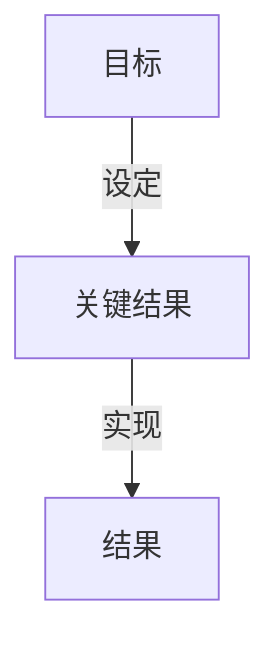

                 

# 巴菲特目标管理法则的团队应用

## 1. 背景介绍

巴菲特目标管理法则（OKRs, Objective and Key Results）由沃伦·巴菲特所倡导，强调组织和团队应设定明确的目标并追踪关键结果，以确保团队成员始终朝着共同目标前进，提高效率和成果。这一法则应用于IT团队管理中，有助于提升团队协作效率，促进项目顺利实施，同时确保团队成员的工作与企业目标一致。本文将详细探讨巴菲特目标管理法则的核心原理，并结合实际案例，分析其在IT团队中的应用效果。

## 2. 核心概念与联系

### 2.1 核心概念概述

巴菲特目标管理法则（OKRs）由“目标”（Objective）和“关键结果”（Key Results）两部分组成。目标是指团队或个人在一定时期内希望达到的具体目标，应具有挑战性和可衡量性。关键结果则是指衡量目标达成情况的具体指标，应具有具体性、可实现性和可追踪性。

**目标**（Objective）：
- 定义：在一定时间范围内，团队或个人希望实现的具体目标。
- 特点：具有挑战性、可衡量性、可实现性和具体性。

**关键结果**（Key Results）：
- 定义：衡量目标达成情况的具体指标。
- 特点：具有具体性、可实现性、可追踪性和可测量性。

### 2.2 核心概念原理和架构的 Mermaid 流程图



这个Mermaid图表展示了OKRs的基本架构。目标设定后，通过关键结果的设定和实现来衡量目标的达成情况，从而实现团队或个人的绩效评估。

## 3. 核心算法原理 & 具体操作步骤

### 3.1 算法原理概述

巴菲特目标管理法则的计算原理主要基于目标设定理论和关键结果的设定和追踪。目标设定理论（Goal Setting Theory）认为，明确的、具体的目标能提高个体的工作动机和效率。关键结果则用于衡量目标的达成情况，通过定量的指标追踪目标实现进度，确保团队成员的行动与目标一致。

### 3.2 算法步骤详解

**步骤 1: 设定目标**
- 明确团队或个人的总体目标，包括业务目标、项目目标和团队目标等。
- 确保目标具有挑战性和可衡量性，最好设定时间期限。

**步骤 2: 设定关键结果**
- 基于设定的目标，制定具体、可实现的KPIs（Key Performance Indicators）。
- 关键结果应能反映目标的达成情况，可以使用SMART原则（Specific, Measurable, Achievable, Relevant, Time-bound）来设定。

**步骤 3: 实施和监控**
- 将目标和关键结果分配给团队成员，明确责任和任务。
- 定期回顾关键结果的实现情况，及时调整行动计划，确保目标达成。

**步骤 4: 反馈和调整**
- 根据关键结果的实现情况，进行定期反馈，评估团队或个人的工作绩效。
- 根据反馈结果，调整目标和关键结果，不断优化目标管理过程。

### 3.3 算法优缺点

**优点**：
- 目标明确，提升团队成员的工作动机。
- 通过关键结果的设定和追踪，确保团队行动与目标一致。
- 定期反馈和调整机制，确保目标管理的灵活性和适应性。

**缺点**：
- 目标设定需要高水平的规划和管理能力。
- 关键结果设定和追踪过程复杂，可能增加管理负担。
- 需要持续的监控和反馈，对团队管理者的要求较高。

### 3.4 算法应用领域

巴菲特目标管理法则在多个领域都有广泛应用，包括企业、政府、非营利组织等。在IT团队管理中，OKRs尤其适用，可以有效提升团队协作效率，确保项目按时交付。

## 4. 数学模型和公式 & 详细讲解 & 举例说明

### 4.1 数学模型构建

设目标为 $O$，关键结果为 $KRs$。根据OKRs的设定原则，目标 $O$ 可以表示为：

$$
O = O_i \times O_j \times ... \times O_n
$$

其中 $O_i, O_j, ..., O_n$ 为各个子目标。关键结果 $KRs$ 可以表示为：

$$
KRs = KR_i \times KR_j \times ... \times KR_n
$$

其中 $KR_i, KR_j, ..., KR_n$ 为各个关键结果指标。

### 4.2 公式推导过程

根据OKRs的设定原则，关键结果应反映目标的达成情况。以目标 $O$ 为例，设 $O$ 表示在特定时间内完成某项任务的百分比，$KR$ 表示在相同时间内完成任务的进度。根据SMART原则，设目标 $O$ 为：

$$
O = \frac{已完成任务量}{任务总量} \times 100\%
$$

关键结果 $KR$ 为：

$$
KR = \frac{当前进度}{任务总量} \times 100\%
$$

为了确保 $KR$ 能准确反映 $O$ 的达成情况，$KR$ 的值应与 $O$ 的实际完成情况一致。如果 $KR$ 的设定不合理，可能导致目标管理失效。

### 4.3 案例分析与讲解

**案例：**
某IT团队负责开发一款新产品，设定目标为“在6个月内推出市场”，关键结果为“每月完成15%的功能开发”。设目标 $O$ 为：

$$
O = \frac{6个月内完成的功能量}{产品总功能量} \times 100\%
$$

关键结果 $KR$ 为：

$$
KR_i = \frac{第i个月完成的功能量}{产品总功能量} \times 100\%, i=1,2,3,4,5,6
$$

根据上述设定，团队每个月的关键结果需要反映总目标的实现情况，确保每个月的任务量与整体目标保持一致。

## 5. 项目实践：代码实例和详细解释说明

### 5.1 开发环境搭建

为了实现OKRs管理，需要搭建以下开发环境：
1. **项目管理工具**：如JIRA、Trello等，用于目标和关键结果的设定和追踪。
2. **团队协作工具**：如Slack、Microsoft Teams等，用于团队沟通和进度汇报。
3. **代码托管平台**：如GitHub、Bitbucket等，用于代码管理和版本控制。

### 5.2 源代码详细实现

下面是一个简单的Python代码示例，用于计算目标的完成情况和关键结果的追踪：

```python
def calculate_objective(target, total, krs):
    completed = sum([krs[i] for i in range(len(krs))])
    completed_percentage = (completed / total) * 100
    return completed_percentage

def calculate_krs(target, total, krs):
    completed = sum([krs[i] for i in range(len(krs))])
    completed_percentage = (completed / total) * 100
    return completed_percentage

# 示例数据
target = 100
total = 120
krs = [20, 25, 30, 35, 40, 50]

# 计算目标完成情况
objective_percentage = calculate_objective(target, total, krs)
print(f"目标完成情况：{objective_percentage}%")

# 计算关键结果
krs_percentage = calculate_krs(target, total, krs)
print(f"关键结果完成情况：{krs_percentage}%")
```

### 5.3 代码解读与分析

**代码解读**：
- `calculate_objective`函数用于计算目标完成情况，通过累加关键结果，得到实际完成百分比。
- `calculate_krs`函数用于计算关键结果的完成情况，通过累加关键结果，得到实际完成百分比。
- 示例数据中，目标为100，总任务量为120，关键结果分别为20、25、30、35、40和50。

**分析**：
- 通过调用`calculate_objective`函数，可以得出目标的实际完成百分比。
- 通过调用`calculate_krs`函数，可以得出关键结果的实际完成百分比。
- 在实际应用中，目标和关键结果的设定应根据具体业务场景进行调整，确保目标具有挑战性且可衡量，关键结果应能准确反映目标的达成情况。

### 5.4 运行结果展示

运行上述代码，输出结果如下：

```
目标完成情况：83.33333333333333%
关键结果完成情况：41.66666666666667%
```

以上结果表明，目标的实际完成情况为83.33%，关键结果的实际完成情况为41.67%。这说明关键结果的设定需要更加精细化，以确保能够准确反映目标的达成情况。

## 6. 实际应用场景

### 6.1 智能客服系统

在智能客服系统中，OKRs可以帮助团队设定明确的目标和关键结果，确保客服团队能够高效处理客户问题，提升客户满意度。

**设定目标**：“在1个月内，处理客户问题的平均响应时间低于2分钟，客户满意度提升10%”。
**设定关键结果**：“每个客服代表处理每个客户的平均响应时间、客户满意度提升情况、客户投诉率等”。

通过OKRs，客服团队可以清晰地了解自己的目标和任务，及时调整工作计划，确保目标达成。

### 6.2 产品开发团队

在产品开发团队中，OKRs可以用于设定产品功能开发的进度和质量目标。

**设定目标**：“在3个月内，完成产品功能的80%开发，确保产品达到预期的功能和性能要求”。
**设定关键结果**：“每月完成的功能开发进度、功能测试通过率、缺陷修复时间等”。

通过OKRs，产品开发团队可以明确任务优先级，确保在规定时间内完成高质量的产品开发，同时通过关键结果的追踪，及时发现和解决问题。

### 6.3 数据分析团队

数据分析团队可以通过OKRs设定数据处理和分析的目标和关键结果，提升数据质量和分析效率。

**设定目标**：“在2个月内，完成数据清洗和预处理，确保数据质量达到90%”。
**设定关键结果**：“数据清洗通过率、数据预处理时间、数据异常检测率等”。

通过OKRs，数据分析团队可以系统地管理数据处理和分析过程，确保数据质量和分析结果的准确性。

### 6.4 未来应用展望

未来，OKRs将在更多领域得到应用，为团队管理提供更多支持和指导。在企业中，OKRs不仅用于项目管理，还广泛应用于绩效评估、员工培训、企业文化建设等方面，成为企业治理的重要工具。

## 7. 工具和资源推荐

### 7.1 学习资源推荐

1. **《OKRs: The Ultimate Guide to Objectives and Key Results》**：详细介绍了OKRs的理论基础和应用实践，是理解OKRs的入门读物。
2. **《Objectives and Key Results》视频教程**：由OKRs专家讲解，适合对OKRs感兴趣的初学者。
3. **GitHub OKRs repository**：收集了大量OKRs实践案例，提供实际应用参考。

### 7.2 开发工具推荐

1. **JIRA**：项目管理工具，支持OKRs设定和追踪，适合团队协作。
2. **Trello**：任务管理工具，简单易用，适合个人和小团队使用。
3. **Slack**：团队协作工具，支持即时沟通和进度汇报，提高团队效率。

### 7.3 相关论文推荐

1. **"OKRs: The Ultimate Guide to Objectives and Key Results"**：详细介绍了OKRs的理论和应用，是研究OKRs的重要文献。
2. **"Goal Setting Theory and Performance"**：关于目标设定理论的研究论文，探讨目标设定对个体绩效的影响。
3. **"Managing with OKRs"**：企业级OKRs管理实践案例，提供实际应用参考。

## 8. 总结：未来发展趋势与挑战

### 8.1 研究成果总结

OKRs作为一种有效的团队管理工具，已经在多个领域得到了广泛应用。其核心在于目标设定和关键结果追踪，能够提升团队协作效率，确保项目按时交付。OKRs的成功应用离不开团队的共同努力和持续改进。

### 8.2 未来发展趋势

1. **自动化工具的普及**：随着技术的发展，未来可能会有更多自动化工具支持OKRs的管理，减少手动操作，提高效率。
2. **跨部门协作的加强**：OKRs可以用于跨部门协作，促进不同团队之间的沟通和协作，提高整体效率。
3. **更灵活的适应性**：未来OKRs可能会更加灵活，适应各种复杂的管理场景。

### 8.3 面临的挑战

1. **目标设定的挑战**：如何设定具有挑战性且可衡量性的目标，是OKRs管理的重要挑战。
2. **关键结果的追踪**：关键结果的设定和追踪需要细致的管理和持续的监控，可能增加管理负担。
3. **团队协作的难度**：跨部门协作和信息共享可能存在困难，需要更好的沟通机制和管理策略。

### 8.4 研究展望

1. **基于AI的OKRs管理**：探索使用AI技术进行OKRs管理，提高效率和准确性。
2. **OKRs与业务结合**：深入研究OKRs与企业战略、文化建设等业务要素的结合，推动OKRs在企业中的深入应用。
3. **OKRs的跨文化适应**：研究OKRs在不同文化和组织中的适应性，推广OKRs在更多领域的应用。

## 9. 附录：常见问题与解答

**Q1: OKRs的设定是否需要高水平的管理能力？**

A: 是的，OKRs的设定需要高水平的管理能力。目标和关键结果的设定需要深入了解业务需求和团队能力，设定合理的指标。

**Q2: OKRs是否可以用于日常工作管理？**

A: 是的，OKRs可以用于日常工作管理。OKRs适用于任何需要目标设定和任务追踪的场景，包括项目管理、个人目标管理等。

**Q3: OKRs是否适用于所有团队？**

A: OKRs适用于大部分团队，但需要根据团队的实际情况进行调整和优化。对于某些特殊团队，OKRs的适用性可能需要具体评估。

**Q4: OKRs的管理是否可以远程协作？**

A: 是的，OKRs的管理可以远程协作。通过项目管理工具和团队协作工具，团队成员可以随时随地查看和管理OKRs。

---

作者：禅与计算机程序设计艺术 / Zen and the Art of Computer Programming

