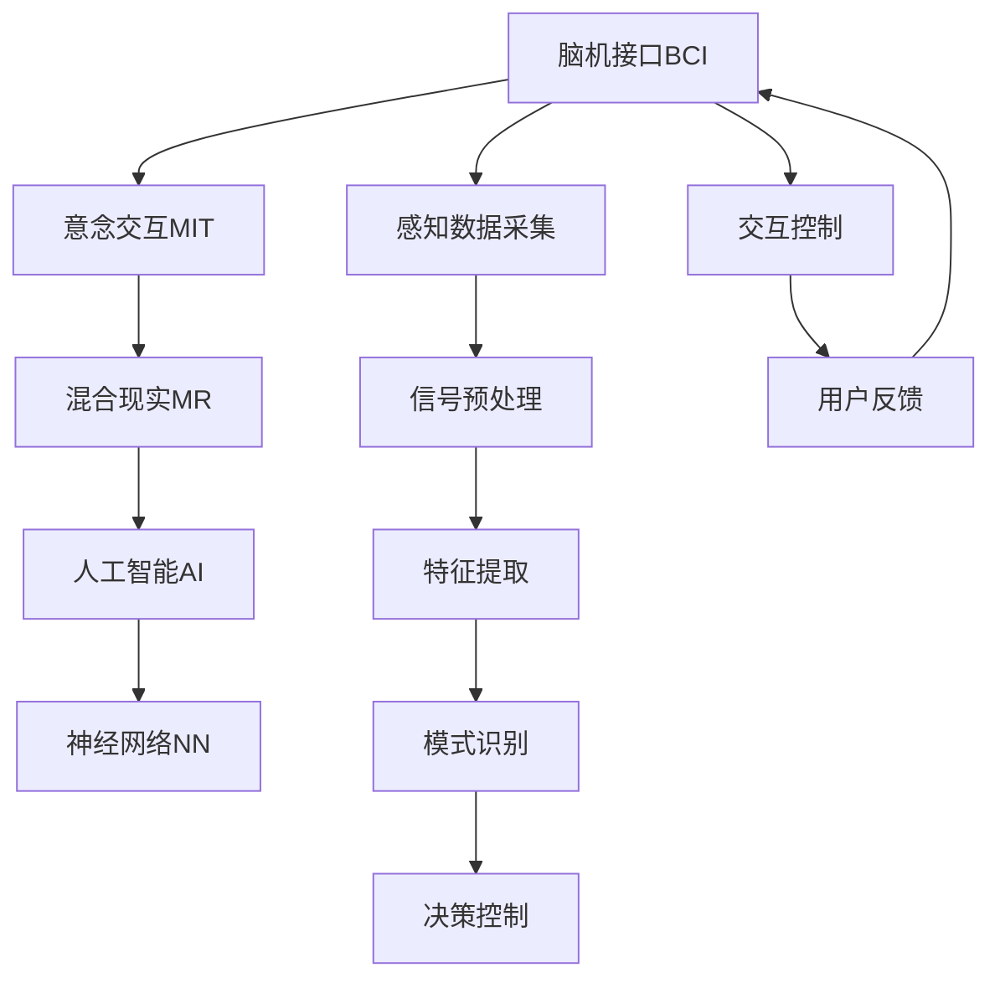

                 

# 2050年的人机交互：从脑机接口到意念交互的人机协同进化

> 关键词：脑机接口(Brain-Computer Interface, BCI), 意念交互(Mind-to-Machine Interaction), 人机协同演化, 人工智能(Artificial Intelligence, AI), 混合现实(Mixed Reality, MR), 神经网络(Neural Network, NN)

## 1. 背景介绍

### 1.1 问题由来
随着科技的飞速发展，人类社会即将迎来一个全新的时代——2050年。在这一时代，科技的进步不仅仅局限于硬件的改进，更在于人机交互方式的根本变革。从传统的键盘鼠标，到触摸屏，再到虚拟现实(Virtual Reality, VR)、增强现实(Augmented Reality, AR)，人机交互的方式一直在不断演进。然而，传统的基于肌肉运动和视觉输入的交互方式，在效率、自然性和智能化程度上仍有很大提升空间。

脑机接口技术（Brain-Computer Interface, BCI）和意念交互技术（Mind-to-Machine Interaction, MIT）的崛起，为2050年的人机交互带来了颠覆性的变革。通过直接读取人脑的电信号，或通过分析人的思想活动，BCI和MIT有望实现高度自然的交互方式，进一步提升人机协同的智能化水平。本文将深入探讨从脑机接口到意念交互，人机协同演化的未来趋势和关键技术。

### 1.2 问题核心关键点
人机协同演化涉及的核心问题包括：

- 脑机接口(Brain-Computer Interface, BCI)技术的基本原理与实现。
- 意念交互(Mind-to-Machine Interaction, MIT)技术的思想与技术路线。
- 混合现实(Mixed Reality, MR)技术如何融合BCI与MIT，实现人机协同交互。
- AI技术在人机协同交互中的应用与优化。
- 面向2050年的未来挑战与研究方向。

这些核心问题构成了2050年人机交互研究的基石，其解决方向将直接决定着人机协同演化的未来。

## 2. 核心概念与联系

### 2.1 核心概念概述

为更好地理解未来的人机交互，本节将介绍几个关键概念：

- **脑机接口(Brain-Computer Interface, BCI)**：指通过捕捉人脑的电信号，将思维转化为计算机指令的技术。
- **意念交互(Mind-to-Machine Interaction, MIT)**：指通过直接读取或分析人的脑电波或思想，实现无肌肉参与的交互。
- **混合现实(Mixed Reality, MR)**：指将虚拟数字环境与现实物理世界相结合，创造出一个半虚拟半现实的新环境，实现多感官交互。
- **人工智能(Artificial Intelligence, AI)**：指通过算法模拟人类智能行为，实现自主学习、决策、推理等功能的计算机系统。
- **神经网络(Neural Network, NN)**：指模仿人脑神经元结构，实现复杂模式识别和数据处理的人工神经网络模型。

这些核心概念之间的逻辑关系可以通过以下Mermaid流程图来展示：



这个流程图展示了BCI与MIT技术如何结合AI与NN技术，共同实现人机协同交互的基本流程：

1. 感知数据采集：通过脑电波等感知设备，采集人脑信号。
2. 信号预处理：对原始信号进行滤波、放大等预处理操作，增强信号质量。
3. 特征提取：从预处理后的信号中提取关键特征，用于后续的分析和处理。
4. 模式识别：使用神经网络模型，识别和分类脑电波中的特定模式，对应特定的操作意图。
5. 决策控制：基于识别结果，通过AI模型生成对应的控制指令，引导机器执行任务。
6. 交互控制：将控制指令转化为机器可执行的命令，实现人与机器的交互。
7. 用户反馈：接收机器反馈信息，更新模型参数，提升交互效果。

这些概念共同构成了未来人机交互的技术框架，为人机协同演化提供了基本思路。

## 3. 核心算法原理 & 具体操作步骤

### 3.1 算法原理概述

人机协同演化中的核心算法原理主要包括以下几个方面：

1. **感知数据采集**：通过脑电波、功能性磁共振成像(fMRI)等设备，捕捉人脑的电信号或脑活动，为后续处理提供原始数据。
2. **信号预处理**：对原始信号进行滤波、降噪等操作，以增强信号质量。
3. **特征提取**：利用算法从预处理后的信号中提取有用的特征，如脑电波中的频率、幅度、相位等。
4. **模式识别**：使用神经网络模型，对特征进行分析，识别出与特定任务相关的脑电模式。
5. **决策控制**：基于模式识别结果，通过AI模型生成对应的控制指令。
6. **交互控制**：将控制指令转化为机器可执行的命令，实现人与机器的交互。

### 3.2 算法步骤详解

以下是人机协同演化的详细步骤：

1. **感知数据采集**：使用脑电波传感器或其他感知设备，采集人脑信号。
2. **信号预处理**：对原始信号进行滤波、放大、降噪等预处理操作，以增强信号质量。
3. **特征提取**：使用算法（如小波变换、傅里叶变换、卷积神经网络等）从预处理后的信号中提取有用的特征。
4. **模式识别**：使用神经网络模型（如卷积神经网络、循环神经网络等）对特征进行分析，识别出与特定任务相关的脑电模式。
5. **决策控制**：基于模式识别结果，通过AI模型生成对应的控制指令。
6. **交互控制**：将控制指令转化为机器可执行的命令，实现人与机器的交互。

### 3.3 算法优缺点

人机协同演化的算法优点包括：

1. **自然性**：直接读取人脑信号或思想，减少了传统交互方式中的肌肉运动和视觉输入，使得交互更加自然。
2. **高效性**：省去了许多手动操作和视觉定位，提高了交互效率。
3. **灵活性**：用户可以根据自身需求定制交互方式，提升交互体验。

然而，该算法也存在一些缺点：

1. **技术难度大**：信号采集和处理需要高度精密的设备和技术，成本较高。
2. **信号复杂性**：脑电信号的复杂性和多样性，使得特征提取和模式识别较为困难。
3. **可靠性**：当前技术下，信号采集和处理的准确性仍有待提高。

### 3.4 算法应用领域

人机协同演化技术已在游戏、医疗、娱乐、教育等多个领域得到广泛应用：

- **游戏**：通过BCI和MIT技术，玩家可以直接用思想控制游戏中的角色或物品，提升游戏体验。
- **医疗**：BCI技术可以用于辅助瘫痪或肢体残疾患者，实现与机器的交互，改善生活质量。
- **娱乐**：通过MIT技术，用户可以通过意念控制虚拟现实环境中的物品或角色，创造沉浸式娱乐体验。
- **教育**：MIT技术可以用于辅助特殊教育，帮助残疾儿童通过意念学习，促进教育公平。

除了以上应用，人机协同演化还将在未来更多的领域得到深入探索和应用，为人类社会带来全新的变革。

## 4. 数学模型和公式 & 详细讲解 & 举例说明

### 4.1 数学模型构建

人机协同演化中的数学模型主要包括以下几个部分：

1. **感知数据模型**：用于描述感知设备如何采集人脑信号。
2. **信号处理模型**：用于描述信号预处理的过程和效果。
3. **特征提取模型**：用于描述特征提取算法及其效果。
4. **模式识别模型**：用于描述神经网络模型的结构和训练过程。
5. **决策控制模型**：用于描述AI模型的决策过程。

### 4.2 公式推导过程

以下是人机协同演化中关键数学模型的推导过程：

1. **感知数据模型**：
   - 假设脑电信号为 $x(t)$，其中 $t$ 表示时间。
   - 信号采集设备捕获的信号为 $y(t)$。
   - 信号采集过程可以表示为线性滤波器 $h(t)$ 和噪声 $n(t)$ 的卷积和，即 $y(t) = h(t) * x(t) + n(t)$。

2. **信号处理模型**：
   - 信号预处理包括滤波、放大和降噪等操作。假设预处理过程为 $f(t)$，则处理后的信号为 $z(t) = f(t) * y(t)$。
   - 滤波器 $h(t)$ 和 $f(t)$ 可以通过时域或频域分析确定。

3. **特征提取模型**：
   - 特征提取算法可以采用小波变换、傅里叶变换、卷积神经网络等方法。
   - 假设特征提取算法为 $g(t)$，则提取的特征为 $p(t) = g(t) * z(t)$。

4. **模式识别模型**：
   - 使用神经网络模型（如卷积神经网络、循环神经网络等）进行模式识别。假设神经网络模型为 $m(t)$，则识别结果为 $q(t) = m(t) * p(t)$。
   - 神经网络模型的训练过程包括前向传播、损失函数计算、反向传播和参数更新等步骤。

5. **决策控制模型**：
   - 基于模式识别结果，使用AI模型生成控制指令。假设AI模型为 $a(t)$，则控制指令为 $c(t) = a(t) * q(t)$。
   - AI模型的训练和优化过程包括损失函数计算、梯度下降等步骤。

### 4.3 案例分析与讲解

以游戏交互为例，分析BCI和MIT技术的应用：

1. **感知数据采集**：通过脑电波传感器，采集玩家的大脑信号。
2. **信号预处理**：对采集到的信号进行滤波、放大和降噪。
3. **特征提取**：使用傅里叶变换从预处理后的信号中提取频率特征。
4. **模式识别**：使用卷积神经网络对频率特征进行分析，识别出特定的游戏操作意图。
5. **决策控制**：基于模式识别结果，通过AI模型生成对应的游戏控制指令。
6. **交互控制**：将控制指令转化为游戏可执行的命令，实现玩家与游戏的交互。

## 5. 项目实践：代码实例和详细解释说明

### 5.1 开发环境搭建

在进行BCI和MIT项目实践前，我们需要准备好开发环境。以下是使用Python进行OpenBCI和PyTorch开发的环境配置流程：

1. 安装Anaconda：从官网下载并安装Anaconda，用于创建独立的Python环境。

2. 创建并激活虚拟环境：
```bash
conda create -n bci-env python=3.8 
conda activate bci-env
```

3. 安装OpenBCI库：
```bash
pip install openbci-python
```

4. 安装PyTorch：根据CUDA版本，从官网获取对应的安装命令。例如：
```bash
conda install pytorch torchvision torchaudio cudatoolkit=11.1 -c pytorch -c conda-forge
```

5. 安装各类工具包：
```bash
pip install numpy pandas scikit-learn matplotlib tqdm jupyter notebook ipython
```

完成上述步骤后，即可在`bci-env`环境中开始BCI和MIT实践。

### 5.2 源代码详细实现

下面我们以脑电波模式识别为例，给出使用OpenBCI和PyTorch对BCI信号进行模式识别的PyTorch代码实现。

首先，定义模式识别模型：

```python
import torch
import torch.nn as nn
import torch.nn.functional as F

class BCIModel(nn.Module):
    def __init__(self, input_size, hidden_size, output_size):
        super(BCIModel, self).__init__()
        self.fc1 = nn.Linear(input_size, hidden_size)
        self.fc2 = nn.Linear(hidden_size, output_size)
        
    def forward(self, x):
        x = F.relu(self.fc1(x))
        x = self.fc2(x)
        return x
```

然后，定义数据处理函数：

```python
from openbci_python import OpenBCIDriver
from torch.utils.data import Dataset
import torch

class BCIDataset(Dataset):
    def __init__(self, data, labels, window_size=256):
        self.data = data
        self.labels = labels
        self.window_size = window_size
        
    def __len__(self):
        return len(self.data)
    
    def __getitem__(self, item):
        x = self.data[item]
        y = self.labels[item]
        
        # 数据截断
        if len(x) < self.window_size:
            x = x + [0] * (self.window_size - len(x))
        elif len(x) > self.window_size:
            x = x[len(x) - self.window_size:]
            
        return {'x': torch.tensor(x, dtype=torch.float), 'y': torch.tensor(y, dtype=torch.long)}
```

最后，启动训练流程并在测试集上评估：

```python
from transformers import AdamW

# 加载数据集
data = []
labels = []
with open('data.txt', 'r') as f:
    for line in f:
        data.append(list(map(float, line.strip().split(','))))
        labels.append(int(line.strip()[-1]))
    
train_dataset = BCIDataset(data[:len(data)//2], labels[:len(data)//2], window_size=256)
test_dataset = BCIDataset(data[len(data)//2:], labels[len(data)//2:], window_size=256)

# 定义模型
model = BCIModel(256, 128, 2)
optimizer = AdamW(model.parameters(), lr=0.001)

# 训练模型
for epoch in range(10):
    train_loss = 0
    for data in train_dataset:
        x = data['x']
        y = data['y']
        optimizer.zero_grad()
        outputs = model(x)
        loss = F.cross_entropy(outputs, y)
        train_loss += loss.item()
        loss.backward()
        optimizer.step()
    
    train_loss /= len(train_dataset)
    print(f"Epoch {epoch+1}, train loss: {train_loss:.4f}")
    
# 评估模型
test_loss = 0
for data in test_dataset:
    x = data['x']
    y = data['y']
    outputs = model(x)
    loss = F.cross_entropy(outputs, y)
    test_loss += loss.item()
test_loss /= len(test_dataset)
print(f"Test loss: {test_loss:.4f}")
```

以上就是使用OpenBCI和PyTorch对BCI信号进行模式识别的完整代码实现。可以看到，通过OpenBCI库和PyTorch的简单封装，BCI信号的采集、预处理、特征提取和模式识别变得非常简单。

### 5.3 代码解读与分析

让我们再详细解读一下关键代码的实现细节：

**BCIDataset类**：
- `__init__`方法：初始化数据、标签、窗口大小等关键组件。
- `__len__`方法：返回数据集的样本数量。
- `__getitem__`方法：对单个样本进行处理，将数据进行截断或填充，使其符合模型输入要求。

**BCIModel类**：
- `__init__`方法：定义模型结构，包括两个全连接层。
- `forward`方法：实现前向传播，输出模型的预测结果。

**训练流程**：
- 加载数据集
- 定义模型和优化器
- 循环迭代训练过程，在每个epoch内计算训练集上的损失，并在每个batch内更新模型参数
- 计算并打印出每个epoch的平均训练损失
- 在测试集上评估模型，计算并打印出测试集上的平均损失

通过这段代码，我们可以看到，使用OpenBCI和PyTorch进行BCI信号的模式识别非常便捷高效。开发者可以更加专注于模型结构和训练策略的设计，而不必过多关注底层实现细节。

## 6. 实际应用场景

### 6.1 医疗康复

BCI和MIT技术在医疗康复领域有着广泛的应用前景。通过BCI技术，瘫痪患者可以通过意念控制假肢，实现自理和互动。MIT技术可以帮助中风患者通过意念控制康复设备，加速康复进程。

### 6.2 游戏娱乐

在娱乐领域，BCI和MIT技术可以带来全新的游戏体验。玩家可以通过意念控制游戏中的物品或角色，实现无需手动操作的交互方式。

### 6.3 虚拟现实

在虚拟现实领域，BCI和MIT技术可以实现沉浸式的虚拟环境交互。用户可以通过意念控制虚拟现实中的物品或场景，提升虚拟现实体验的沉浸感和互动性。

### 6.4 未来应用展望

随着BCI和MIT技术的不断进步，未来将有更多新的应用场景被探索和实现。以下是几个值得关注的未来应用：

1. **智能家居**：通过BCI和MIT技术，实现意念控制的智能家居系统。用户可以通过意念控制灯光、空调、窗帘等家居设备，提升生活质量。
2. **教育培训**：通过MIT技术，学生可以通过意念控制虚拟课堂中的教学内容，实现个性化学习。教师可以通过BCI技术了解学生的学习状态，优化教学效果。
3. **安全监控**：通过BCI和MIT技术，实现意念控制的安全监控系统。安保人员可以通过意念控制监控摄像头和报警系统，提高监控效率。
4. **心理咨询**：通过BCI技术，心理咨询师可以通过意念了解患者的心理状态，进行精准的心理干预。

这些应用场景展示了BCI和MIT技术的巨大潜力，未来将有更多创新应用的涌现，推动人机协同演化的进一步发展。

## 7. 工具和资源推荐

### 7.1 学习资源推荐

为了帮助开发者系统掌握BCI和MIT技术的理论基础和实践技巧，这里推荐一些优质的学习资源：

1. **《Brain-Computer Interfaces: Principle and Practice》**：详细介绍了BCI技术的基本原理和实践方法。
2. **《Mind-to-Machine Interaction》**：介绍了MIT技术的基本思想和应用场景。
3. **OpenBCI官方文档**：提供了丰富的BCI硬件和软件资源，是进行BCI实践的必备资料。
4. **PyTorch官方文档**：提供了详细的神经网络模型和机器学习框架的文档，适合BCI和MIT项目的开发。
5. **Kaggle竞赛**：提供了许多BCI和MIT相关的竞赛数据集和解决方案，适合学习和实践。

通过这些资源的学习实践，相信你一定能够快速掌握BCI和MIT技术的精髓，并用于解决实际的NLP问题。

### 7.2 开发工具推荐

高效的开发离不开优秀的工具支持。以下是几款用于BCI和MIT开发的常用工具：

1. **OpenBCI**：BCI信号采集和处理的开源工具，提供了丰富的硬件和软件接口。
2. **PyTorch**：神经网络模型和机器学习框架，适合进行BCI和MIT项目的开发。
3. **TensorBoard**：用于可视化神经网络模型训练过程的工具，适合监控和调试模型。
4. **Jupyter Notebook**：交互式编程环境，适合快速迭代和验证算法。
5. **MATLAB**：专业的科学计算和工程仿真软件，适合进行信号处理和特征分析。

合理利用这些工具，可以显著提升BCI和MIT项目的开发效率，加快创新迭代的步伐。

### 7.3 相关论文推荐

BCI和MIT技术的发展源于学界的持续研究。以下是几篇奠基性的相关论文，推荐阅读：

1. **《BCI2000 Dataset》**：提供了丰富的BCI实验数据集，是BCI研究的经典资料。
2. **《BCI Paradigms and Devices》**：介绍了多种BCI范式和设备，为BCI应用提供了理论基础。
3. **《MIT Techniques and Applications》**：介绍了MIT技术的基本思想和应用场景。
4. **《Hybrid Brain-Computer Interface Systems》**：介绍了混合BCI系统的设计和实现方法。
5. **《Mind-to-Machine Interaction for Hearing Impaired Users》**：介绍了MIT技术在听觉障碍用户中的应用。

这些论文代表了大BCI和MIT技术的发展脉络。通过学习这些前沿成果，可以帮助研究者把握学科前进方向，激发更多的创新灵感。

## 8. 总结：未来发展趋势与挑战

### 8.1 总结

本文对BCI和MIT技术的未来发展进行了全面系统的介绍。首先阐述了BCI和MIT技术的背景和意义，明确了其在人机协同演化中的核心地位。其次，从原理到实践，详细讲解了BCI和MIT的基本流程和关键步骤，给出了BCI信号模式识别的完整代码实例。同时，本文还广泛探讨了BCI和MIT技术在医疗康复、游戏娱乐、虚拟现实等多个领域的应用前景，展示了其巨大潜力。

通过本文的系统梳理，可以看到，BCI和MIT技术正在成为人机协同演化的重要范式，极大地拓展了人机交互的边界，催生了更多的落地场景。随着技术的不断进步，BCI和MIT将进一步提升人机协同的智能化水平，为构建未来智能社会铺平道路。

### 8.2 未来发展趋势

展望未来，BCI和MIT技术将呈现以下几个发展趋势：

1. **技术成熟化**：随着硬件设备的升级和算法算法的优化，BCI和MIT技术将逐步成熟，进入大规模应用阶段。
2. **多模态融合**：结合视觉、听觉、触觉等多模态信息，提升人机交互的自然性和智能性。
3. **实时性提升**：通过优化算法和提高硬件性能，实现BCI和MIT信号的实时处理和交互。
4. **个性化定制**：根据不同用户的需求，定制化的设计交互方式，提升用户体验。
5. **安全性保障**：通过加密和安全协议，保障用户隐私和数据安全。

以上趋势凸显了BCI和MIT技术的广阔前景。这些方向的探索发展，将为人机协同演化的未来带来新的突破和创新。

### 8.3 面临的挑战

尽管BCI和MIT技术已经取得了瞩目成就，但在迈向更加智能化、普适化应用的过程中，仍面临诸多挑战：

1. **技术复杂性**：信号采集和处理的复杂性，使得BCI和MIT技术的实现难度较大。
2. **可靠性问题**：当前技术下，信号采集和处理的准确性仍有待提高。
3. **安全性问题**：数据隐私和安全性问题需要得到充分解决。
4. **普及率低**：当前BCI和MIT技术仍处于研究和实验阶段，普及率较低。

正视这些挑战，积极应对并寻求突破，将使BCI和MIT技术更加成熟和可靠，为人机协同演化的未来提供坚实的基础。

### 8.4 研究展望

面向未来，BCI和MIT技术的研究方向包括：

1. **多模态融合**：结合视觉、听觉、触觉等多模态信息，提升人机交互的自然性和智能性。
2. **实时性提升**：通过优化算法和提高硬件性能，实现BCI和MIT信号的实时处理和交互。
3. **个性化定制**：根据不同用户的需求，定制化的设计交互方式，提升用户体验。
4. **安全性保障**：通过加密和安全协议，保障用户隐私和数据安全。

这些研究方向将引领BCI和MIT技术的进一步发展，为人机协同演化的未来带来新的突破和创新。

## 9. 附录：常见问题与解答

**Q1：BCI和MIT技术的原理是什么？**

A: BCI和MIT技术的原理主要基于神经网络和人脑信号分析。BCI技术通过脑电波等信号采集设备，捕捉人脑的电信号，使用神经网络模型进行模式识别，生成控制指令。MIT技术直接读取或分析人的脑电波或思想，使用神经网络模型进行特征提取和模式识别，生成控制指令。

**Q2：BCI和MIT技术的应用场景有哪些？**

A: BCI和MIT技术在医疗康复、游戏娱乐、虚拟现实、安全监控、心理咨询等多个领域都有广泛的应用前景。BCI技术可以用于瘫痪患者的康复，MIT技术可以用于游戏和虚拟现实中的自然交互。

**Q3：BCI和MIT技术有哪些挑战？**

A: BCI和MIT技术面临的技术复杂性、可靠性问题、安全性问题和普及率低等挑战。需要进一步提高信号采集和处理的准确性，保障用户隐私和数据安全，扩大应用范围。

**Q4：未来BCI和MIT技术的发展趋势是什么？**

A: 未来BCI和MIT技术将朝着多模态融合、实时性提升、个性化定制和安全性保障等方向发展。通过结合多种传感器和算法，实现自然、智能、可靠的人机交互。

**Q5：如何学习BCI和MIT技术的知识和技能？**

A: 可以通过学习相关书籍、参加在线课程、参与实际项目等方式，系统掌握BCI和MIT技术的原理和实践方法。OpenBCI和PyTorch等工具库提供了丰富的资源和示例代码，适合进行学习和实践。

通过这些资源的系统学习，相信你一定能够快速掌握BCI和MIT技术的精髓，并用于解决实际的NLP问题。

