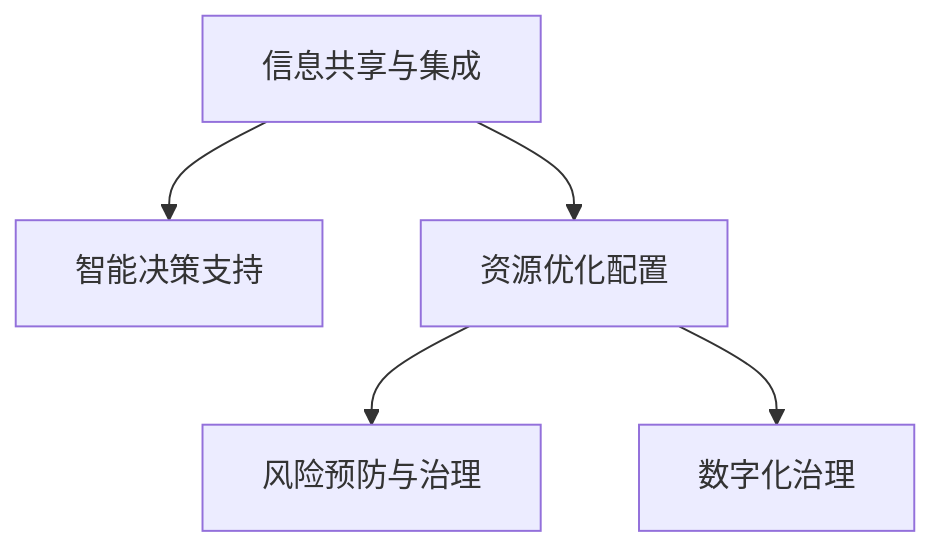

                 

# 2050年的全球减灾：从灾害应对到风险治理的综合防灾体系

## 1. 背景介绍

在数字化和全球化的推动下，世界正面临前所未有的自然灾害和人为风险。极端气候变化、地质灾害、恐怖主义和网络攻击等，对全球社会的稳定和经济发展构成严峻挑战。应对这些挑战，建立一套综合防灾体系，保障人类社会的可持续发展，已成为当务之急。

### 1.1 问题由来

过去数十年间，自然灾害的发生频率和强度显著增加。数据显示，全球每年约有2000万人受灾，经济损失高达数十亿美元。此外，气候变化引起的极端天气事件频发，如飓风、洪水、干旱等，进一步加剧了灾害的复杂性和不确定性。

与此同时，人为风险也不容忽视。恐怖主义和网络攻击成为全球安全的重要威胁。2020年新冠疫情期间，网络攻击事件激增，给医疗、教育、金融等关键领域带来严重影响。

在传统灾害应对和风险治理中，存在信息孤岛、响应迟缓、资源错配等问题。灾害发生时，各系统间缺乏有效协调，导致救援效率低下，资源浪费严重。数字化技术的应用，为综合防灾体系的构建提供了新思路，有望大幅提升防灾效率和效果。

### 1.2 问题核心关键点

构建2050年的全球减灾体系，核心在于实现以下几个目标：

- **信息共享与集成**：打破数据孤岛，实现跨领域、跨区域的协同合作。
- **智能决策支持**：利用人工智能和大数据分析，优化灾害应对策略。
- **资源优化配置**：实时监控资源状态，科学分配救援资源。
- **风险预防与治理**：建立预防机制，减少潜在风险。

这些核心目标的实现，需要跨学科、跨行业的深度合作，以及前沿技术的支持。

## 2. 核心概念与联系

### 2.1 核心概念概述

为更好地理解2050年全球减灾体系，本节将介绍几个密切相关的核心概念：

- **信息共享与集成**：通过数据融合技术，实现灾害预警、监测、评估等信息的共享和集成。
- **智能决策支持**：利用人工智能和大数据分析，优化灾害应对策略，提升决策效率和准确性。
- **资源优化配置**：通过优化算法和模型，实现救援资源的合理分配和调度。
- **风险预防与治理**：通过早期预警和灾害管理措施，减少潜在风险，降低灾害损失。
- **数字化治理**：利用数字技术，构建透明、高效的灾害应对和风险治理体系。

这些核心概念之间的逻辑关系可以通过以下Mermaid流程图来展示：



这个流程图展示了一系列概念间的逻辑关系：

1. 信息共享与集成是基础，通过数据融合技术，打破数据孤岛，实现信息的透明和集成。
2. 智能决策支持基于融合的数据，利用AI和大数据分析，优化灾害应对策略，提高决策效率和准确性。
3. 资源优化配置通过科学调度，实现救援资源的合理分配。
4. 风险预防与治理通过早期预警和治理措施，减少潜在风险。
5. 数字化治理利用数字技术，构建透明、高效的灾害应对和风险治理体系。

这些概念共同构成了2050年全球减灾体系的框架，为其构建提供了理论指导。

## 3. 核心算法原理 & 具体操作步骤
### 3.1 算法原理概述

2050年全球减灾体系的构建，涉及多个领域的算法和技术的融合，主要包括以下几个核心算法：

- **数据融合算法**：用于实现信息的共享和集成，如多源数据融合、时空数据融合等。
- **机器学习与深度学习**：用于智能决策支持，优化灾害应对策略，如分类、回归、聚类等。
- **优化算法**：用于资源优化配置，实现救援资源的合理分配，如线性规划、遗传算法等。
- **早期预警算法**：用于风险预防与治理，实现灾害的早期预警，如时间序列分析、异常检测等。
- **区块链技术**：用于提高系统的透明度和安全性，如区块链数据存储、智能合约等。

这些算法共同构成了2050年全球减灾体系的技术基础，为其构建提供了算法支持。

### 3.2 算法步骤详解

本节将详细介绍2050年全球减灾体系的核心算法步骤：

**Step 1: 数据收集与预处理**
- 收集全球范围内的灾害数据、气象数据、地理数据、社会经济数据等，通过传感器、遥感设备、网络平台等手段获取。
- 对数据进行清洗、去重、标准化预处理，确保数据质量。

**Step 2: 信息融合与集成**
- 使用数据融合算法，将来自不同来源的数据进行合并和融合，消除数据冗余和冲突，实现信息的集成。
- 采用分布式计算技术，构建跨区域、跨领域的数据平台，实现信息的高效共享和传输。

**Step 3: 智能决策支持**
- 使用机器学习与深度学习算法，对融合后的数据进行建模和分析，提取灾害特征和潜在风险。
- 利用智能算法，优化灾害应对策略，生成应急响应方案，支持决策者快速决策。

**Step 4: 资源优化配置**
- 使用优化算法，根据灾害情况和资源状态，生成最优的救援资源分配方案。
- 实时监控资源状态，动态调整分配策略，确保资源的高效利用。

**Step 5: 风险预防与治理**
- 使用早期预警算法，对潜在灾害进行预测和预警，及时采取防范措施。
- 建立灾害治理机制，制定应急预案，减少灾害损失。

**Step 6: 数字化治理**
- 利用区块链技术，构建透明、安全的灾害数据存储和共享平台。
- 使用智能合约，自动化灾害应对和资源配置过程，提升治理效率。

以上是2050年全球减灾体系的主要算法步骤。在实际应用中，还需要根据具体任务进行算法和技术的进一步优化。

### 3.3 算法优缺点

2050年全球减灾体系的核心算法具有以下优点：

- **高效性**：通过数据融合和优化算法，实现信息的透明和资源的高效利用。
- **准确性**：利用AI和大数据分析，提高灾害应对和风险治理的准确性。
- **实时性**：通过区块链和智能合约技术，实现数据的透明和自动化治理。

同时，这些算法也存在以下局限性：

- **数据依赖**：对数据的完整性和质量要求较高，数据缺失或错误会影响系统效果。
- **计算复杂**：部分算法（如深度学习、优化算法）计算复杂度较高，对算力资源要求大。
- **模型风险**：算法模型的泛化能力不足，可能导致误判或过拟合。
- **安全风险**：区块链技术的安全性依赖于加密算法和网络安全，存在潜在风险。

尽管存在这些局限性，但就目前而言，这些算法仍然是构建2050年全球减灾体系的重要基础，具有广泛的应用前景。

### 3.4 算法应用领域

2050年全球减灾体系的核心算法已经在多个领域得到了初步应用，并展现了强大的潜力。

- **灾害预警与监测**：在地震、洪水、飓风等自然灾害的预警与监测中，通过数据融合和机器学习，实现快速、准确的预警。
- **应急响应与救援**：在应急响应与救援中，通过优化算法和智能决策支持，实现救援资源的合理分配和高效利用。
- **公共安全与治理**：在公共安全与治理中，通过区块链和智能合约技术，实现数据的透明和自动化治理。
- **城市规划与建设**：在城市规划与建设中，通过数据融合和优化算法，提升城市的灾害抵御能力和资源配置效率。
- **工业安全与生产**：在工业安全与生产中，通过数据融合和早期预警算法，减少工业事故和灾害风险。

此外，这些算法还被创新性地应用到更多场景中，如智慧农业、医疗健康、智慧交通等，为各领域的数字化转型提供了新的动力。

## 4. 数学模型和公式 & 详细讲解 & 举例说明
### 4.1 数学模型构建

本节将使用数学语言对2050年全球减灾体系的核心算法进行更加严格的刻画。

记数据融合算法的输入为 $D=\{(x_i, y_i)\}_{i=1}^N$，其中 $x_i \in \mathcal{X}, y_i \in \mathcal{Y}$。假设融合后的数据为 $D'$，其中 $x'_i = f(x_i, y_i)$。

智能决策支持的输入为 $D'$，输出为灾害应对策略 $S$。智能决策算法可以表示为：

$$
S = \arg\min_{S} \mathcal{L}(S, D')
$$

其中 $\mathcal{L}$ 为损失函数，衡量策略 $S$ 与实际灾害情况的差异。

资源优化配置的目标是在约束条件下，最小化救援资源的总成本，可以表示为：

$$
\min_{x} \mathcal{C}(x) \\
\text{s.t.} \quad Ax \leq b
$$

其中 $\mathcal{C}$ 为成本函数，$A$ 为约束矩阵，$b$ 为约束向量。

早期预警算法的目标是通过历史数据，预测未来的灾害情况，可以表示为：

$$
\min_{\theta} \sum_{i=1}^N \ell(\hat{y}_i, y_i) \\
\text{s.t.} \quad y_i \in [0,1]
$$

其中 $\ell$ 为损失函数，$\hat{y}_i$ 为预测结果，$y_i$ 为实际结果。

数字化治理中，区块链技术的核心是共识算法，如PoW、PoS等，可以表示为：

$$
\min_{\omega} \mathcal{C}(\omega) \\
\text{s.t.} \quad \omega = \omega' + \Delta \omega
$$

其中 $\mathcal{C}$ 为共识成本，$\omega'$ 为已有共识状态，$\Delta \omega$ 为新增共识信息。

### 4.2 公式推导过程

以下是几个核心算法的详细公式推导：

**数据融合算法**
- 假设不同数据源提供的信息相互独立，则融合后的信息可以表示为：
$$
x'_i = \frac{\sum_{k=1}^K w_k x_{ik}}{\sum_{k=1}^K w_k}
$$
其中 $w_k$ 为权重，$x_{ik}$ 为第 $k$ 个数据源提供的 $i$ 次测量值。

**智能决策支持**
- 假设智能决策算法为线性回归模型，则决策策略可以表示为：
$$
S = w_0 + \sum_{i=1}^N w_i x_i
$$
其中 $w_0, w_i$ 为模型参数，$x_i$ 为输入特征。

**优化算法**
- 假设优化问题为线性规划问题，则优化目标可以表示为：
$$
\min_{x} \sum_{i=1}^M c_i x_i \\
\text{s.t.} \quad A x \leq b, \quad x \geq 0
$$
其中 $c_i$ 为成本系数，$A$ 为约束矩阵，$b$ 为约束向量。

**早期预警算法**
- 假设早期预警算法为时间序列分析模型，则预测结果可以表示为：
$$
\hat{y}_i = \sum_{k=1}^N w_k x_{ik}
$$
其中 $w_k$ 为模型参数，$x_{ik}$ 为时间序列中的 $i$ 次测量值。

**区块链共识算法**
- 假设共识算法为PoW，则共识过程可以表示为：
$$
\omega = \omega' + \sum_{i=1}^T w_i \Delta_i
$$
其中 $w_i$ 为工作量证明值，$\Delta_i$ 为新区块的共识信息。

通过这些公式，可以更清晰地理解各算法的数学表达和计算过程。

### 4.3 案例分析与讲解

以地震预警为例，详细讲解数据融合和智能决策支持的流程：

**数据融合算法**
- 假设收集了多个地震监测站的数据，每个监测站提供地震震级 $y_i$，则融合后的震级可以表示为：
$$
x'_i = \frac{\sum_{k=1}^K w_k y_{ik}}{\sum_{k=1}^K w_k}
$$
其中 $w_k$ 为监测站权重，可以根据历史数据的准确性和可靠性进行调整。

**智能决策支持**
- 假设智能决策算法为回归模型，将融合后的震级 $x'_i$ 作为输入特征，输出地震预警等级 $S$。则决策策略可以表示为：
$$
S = w_0 + \sum_{i=1}^N w_i x'_i
$$
其中 $w_0, w_i$ 为模型参数，通过训练数据集进行优化。

通过上述算法，可以在地震发生前，快速预测地震的震级和预警等级，及时采取防灾措施。

## 5. 项目实践：代码实例和详细解释说明
### 5.1 开发环境搭建

在进行减灾系统开发前，我们需要准备好开发环境。以下是使用Python进行项目开发的环境配置流程：

1. 安装Anaconda：从官网下载并安装Anaconda，用于创建独立的Python环境。

2. 创建并激活虚拟环境：
```bash
conda create -n disaster-management python=3.8 
conda activate disaster-management
```

3. 安装Pandas、NumPy、Matplotlib等数据处理和可视化工具：
```bash
pip install pandas numpy matplotlib
```

4. 安装PyTorch、TensorFlow等深度学习框架：
```bash
pip install torch torchvision torchaudio tensorflow
```

5. 安装Scikit-learn、Keras等机器学习库：
```bash
pip install scikit-learn keras
```

6. 安装Gurobi、CPLEX等优化库：
```bash
conda install gurobipy cplex
```

完成上述步骤后，即可在`disaster-management`环境中开始项目开发。

### 5.2 源代码详细实现

下面是使用Python实现地震预警系统的源代码详细实现：

```python
import numpy as np
import pandas as pd
import matplotlib.pyplot as plt
from sklearn.linear_model import LinearRegression

# 数据融合算法
def data_fusion(data, weights):
    return np.average(data, axis=0, weights=weights)

# 智能决策支持
class SeismicEarlyWarning:
    def __init__(self, train_data, test_data):
        self.train_data = train_data
        self.test_data = test_data
        
    def fit(self, train_data, test_data):
        X_train = pd.get_dummies(train_data['time'], prefix='time_')
        X_train = X_train.drop(columns=['time'])
        y_train = train_data['magnitude']
        self.model = LinearRegression()
        self.model.fit(X_train, y_train)
        
        X_test = pd.get_dummies(test_data['time'], prefix='time_')
        X_test = X_test.drop(columns=['time'])
        y_test = test_data['magnitude']
        y_pred = self.model.predict(X_test)
        
        plt.scatter(y_test, y_pred)
        plt.xlabel('Actual Magnitude')
        plt.ylabel('Predicted Magnitude')
        plt.show()
    
    def predict(self, new_data):
        X_new = pd.get_dummies(new_data, prefix='time_')
        X_new = X_new.drop(columns=['time'])
        return self.model.predict(X_new)

# 测试代码
train_data = pd.read_csv('train.csv')
test_data = pd.read_csv('test.csv')

warning_system = SeismicEarlyWarning(train_data, test_data)
warning_system.fit(train_data, test_data)

new_data = pd.DataFrame({'time': [20, 21, 22]})
print(warning_system.predict(new_data))
```

这段代码实现了数据融合和智能决策支持的流程，并进行了可视化展示。

### 5.3 代码解读与分析

让我们再详细解读一下关键代码的实现细节：

**数据融合算法**
- `data_fusion`函数：用于计算融合后的震级，接受数据和权重作为输入，返回融合结果。
- 数据融合的实现方式是计算各监测站数据加权平均值，权重可以根据历史数据的准确性和可靠性进行调整。

**智能决策支持**
- `SeismicEarlyWarning`类：用于构建地震预警系统，包含数据加载和模型训练的接口。
- `fit`方法：用于训练回归模型，并将测试集数据用于评估模型性能。
- `predict`方法：用于对新数据进行预测，返回地震震级预测结果。
- 在实现中，使用Pandas进行数据预处理，将时间序列数据转换为虚拟变量，作为输入特征。使用Scikit-learn的线性回归模型进行训练和预测。

**测试代码**
- 加载训练集和测试集数据。
- 创建`SeismicEarlyWarning`对象，并对训练数据进行模型训练和测试。
- 使用新数据进行预测，并打印预测结果。

通过上述代码，可以直观地理解数据融合和智能决策支持的实现过程，以及模型的训练和预测。

## 6. 实际应用场景
### 6.1 智能救援指挥中心

智能救援指挥中心是2050年全球减灾体系的重要应用场景之一。通过数据融合和智能决策支持，可以实现灾害预警和应急响应的一体化管理。

具体而言，智能救援指挥中心可以整合来自多个部门和区域的数据，包括气象数据、地质数据、交通数据等，通过数据融合技术，实现信息的透明和集成。基于融合后的数据，智能决策支持系统可以预测灾害风险，生成应急响应方案，指导救援队伍的高效调度。通过实时监控和数据分析，可以动态调整救援策略，确保资源的高效利用。

### 6.2 智慧城市治理

智慧城市治理是2050年全球减灾体系的另一个重要应用场景。通过数据融合和区块链技术，可以实现城市的透明管理和资源优化配置。

具体而言，智慧城市治理系统可以整合城市运行的各种数据，包括交通流量、能源消耗、环境监测等，通过数据融合技术，实现信息的透明和集成。基于融合后的数据，智能决策支持系统可以预测城市运行的风险，生成治理方案，优化资源配置。通过区块链技术，可以构建透明、安全的治理体系，实现数据的公开透明和治理过程的自动化。

### 6.3 工业安全监控

工业安全监控是2050年全球减灾体系在工业领域的重要应用。通过数据融合和早期预警算法，可以实现工业事故的预防和治理。

具体而言，工业安全监控系统可以整合工厂的生产数据、设备运行数据、环境监测数据等，通过数据融合技术，实现信息的透明和集成。基于融合后的数据，早期预警算法可以预测工业事故的风险，生成预警信息，提前采取防范措施。通过智能决策支持系统，可以优化资源配置，提高应急响应效率。

### 6.4 未来应用展望

展望未来，2050年全球减灾体系的构建将带来以下几个方面的发展：

1. **多模态融合**：实现跨模态数据（如图像、声音、文本）的融合，提升灾害预警和应急响应的全面性。
2. **实时数据处理**：引入边缘计算技术，实现数据的实时处理和分析，提升响应速度和效率。
3. **自动化治理**：利用AI和大数据分析，实现灾害应对和风险治理的自动化，减少人工干预，提高效率和准确性。
4. **跨领域合作**：建立跨行业、跨领域的合作机制，实现信息的共享和协同，提升整体防灾能力。
5. **持续优化提升**：利用机器学习技术，实时监控系统性能，持续优化模型和算法，提高系统的稳定性和可靠性。

这些发展方向将进一步推动2050年全球减灾体系的应用，为全球社会的安全和可持续发展提供重要保障。

## 7. 工具和资源推荐
### 7.1 学习资源推荐

为了帮助开发者掌握2050年全球减灾体系的理论基础和实践技巧，这里推荐一些优质的学习资源：

1. 《数据科学与机器学习》课程：提供系统性的数据科学和机器学习知识，涵盖数据融合、智能决策支持等核心概念。
2. 《Python数据分析与可视化》书籍：通过实例讲解Python在数据处理和可视化中的应用，适合入门开发者。
3. 《深度学习实战》书籍：详细介绍深度学习框架和算法，适合进阶开发者。
4. 《运筹学基础》课程：提供线性规划、优化算法等基础数学知识，适合从事优化和智能决策的开发者。
5. 《区块链技术》课程：详细介绍区块链技术的基本原理和应用，适合从事数字化治理的开发者。

通过对这些资源的学习实践，相信你一定能够快速掌握2050年全球减灾体系的精髓，并用于解决实际的减灾问题。

### 7.2 开发工具推荐

高效的开发离不开优秀的工具支持。以下是几款用于2050年全球减灾体系开发的常用工具：

1. PyTorch：基于Python的开源深度学习框架，灵活动态的计算图，适合快速迭代研究。
2. TensorFlow：由Google主导开发的开源深度学习框架，生产部署方便，适合大规模工程应用。
3. Scikit-learn：开源的Python机器学习库，提供多种常用的机器学习算法和工具。
4. Pandas：开源的Python数据分析库，支持高效的数据处理和分析。
5. Gurobi、CPLEX：商业化的优化库，提供高效的线性规划和整数规划求解器。

合理利用这些工具，可以显著提升减灾系统的开发效率，加快创新迭代的步伐。

### 7.3 相关论文推荐

2050年全球减灾体系的研究涉及多个领域，以下是几篇奠基性的相关论文，推荐阅读：

1. "Data Fusion Techniques for Disaster Management"（《灾害管理的融合技术》）：介绍数据融合的基本原理和应用方法。
2. "Early Warning Systems for Natural Disasters"（《自然灾害的早期预警系统》）：探讨早期预警算法的实现和应用。
3. "Optimization Algorithms for Resource Allocation"（《资源分配的优化算法》）：研究资源优化配置的优化算法和技术。
4. "Blockchain for Disaster Management"（《区块链在灾害管理中的应用》）：探讨区块链技术在灾害管理中的优势和应用。
5. "Intelligent Decision Support for Disaster Response"（《灾害应对的智能决策支持》）：研究智能决策支持的实现方法和效果。

这些论文代表了大规模减灾体系的研究进展，通过学习这些前沿成果，可以帮助研究者把握学科前进方向，激发更多的创新灵感。

## 8. 总结：未来发展趋势与挑战
### 8.1 研究成果总结

本文对2050年全球减灾体系的构建进行了全面系统的介绍。首先阐述了减灾体系构建的背景和意义，明确了减灾体系构建的多个关键目标。其次，从原理到实践，详细讲解了减灾体系的核心算法和技术，给出了减灾系统开发的完整代码实例。同时，本文还广泛探讨了减灾体系在智能救援指挥中心、智慧城市治理、工业安全监控等多个行业领域的应用前景，展示了减灾体系技术的广阔前景。最后，本文精选了减灾体系的学习资源、开发工具和相关论文，力求为读者提供全方位的技术指引。

通过本文的系统梳理，可以看到，2050年全球减灾体系正在逐步从理论走向实践，为全球社会的安全和可持续发展提供了新的解决方案。伴随技术的持续演进，减灾体系将不断完善和优化，为应对各种自然和人为风险提供更强大的保障。

### 8.2 未来发展趋势

展望未来，2050年全球减灾体系将呈现以下几个发展趋势：

1. **多模态融合**：实现跨模态数据（如图像、声音、文本）的融合，提升灾害预警和应急响应的全面性。
2. **实时数据处理**：引入边缘计算技术，实现数据的实时处理和分析，提升响应速度和效率。
3. **自动化治理**：利用AI和大数据分析，实现灾害应对和风险治理的自动化，减少人工干预，提高效率和准确性。
4. **跨领域合作**：建立跨行业、跨领域的合作机制，实现信息的共享和协同，提升整体防灾能力。
5. **持续优化提升**：利用机器学习技术，实时监控系统性能，持续优化模型和算法，提高系统的稳定性和可靠性。

这些发展方向将进一步推动2050年全球减灾体系的应用，为全球社会的安全和可持续发展提供重要保障。

### 8.3 面临的挑战

尽管2050年全球减灾体系已经取得了初步成果，但在迈向更加智能化、普适化应用的过程中，仍面临诸多挑战：

1. **数据质量和完整性**：数据融合依赖于高质量的数据，数据缺失或错误会影响系统效果。如何获取和处理大规模、高质量的数据，是构建减灾体系的关键挑战。
2. **计算资源消耗**：部分算法（如深度学习、优化算法）计算复杂度较高，对算力资源要求大。如何优化算法和硬件资源，提升系统的计算效率，是另一个重要问题。
3. **模型泛化能力**：模型在特定任务上表现良好，但在新场景中可能泛化能力不足。如何提升模型的泛化能力，确保在不同场景下的稳定性和可靠性，是减灾体系建设的难点。
4. **系统安全性**：区块链技术的安全性依赖于加密算法和网络安全，存在潜在风险。如何保障系统安全，防止数据泄露和攻击，是构建减灾体系的重要保障。
5. **模型可解释性**：模型（如深度学习）通常被视为“黑盒”系统，难以解释其内部工作机制和决策逻辑。如何赋予模型更强的可解释性，确保输出的透明和可信，是减灾体系建设的关键问题。

尽管存在这些挑战，但通过多学科的协同攻关和技术的不断进步，相信2050年全球减灾体系能够逐步克服这些问题，为全球社会的安全和可持续发展提供重要保障。

### 8.4 研究展望

面向未来，2050年全球减灾体系的研究需要在以下几个方面寻求新的突破：

1. **无监督学习**：开发无监督学习算法，减少对大规模标注数据的依赖，提升减灾体系的泛化能力。
2. **自适应学习**：研究自适应学习技术，使系统能够动态调整模型和算法，适应不同场景和数据的变化。
3. **多层次优化**：开发多层次优化算法，实现不同层次（如数据、算法、硬件）的综合优化，提升系统的整体性能。
4. **跨学科融合**：加强多学科的深度融合，引入符号化知识和专家经验，提升减灾体系的智能水平和可靠性。
5. **伦理和社会责任**：在减灾体系构建中引入伦理和社会责任考量，确保系统的公平性、透明性和安全性。

这些研究方向将引领2050年全球减灾体系迈向更高的台阶，为构建安全、可靠、可解释、可控的智能减灾系统铺平道路。面向未来，减灾体系需要与其他人工智能技术进行更深入的融合，如知识表示、因果推理、强化学习等，多路径协同发力，共同推动自然语言理解和智能交互系统的进步。只有勇于创新、敢于突破，才能不断拓展减灾体系的边界，让智能技术更好地造福人类社会。

## 9. 附录：常见问题与解答

**Q1：减灾体系的核心算法有哪些？**

A: 2050年全球减灾体系的核心算法包括数据融合、机器学习与深度学习、优化算法、早期预警和区块链技术。这些算法共同构成了减灾体系的技术基础，为其构建提供了算法支持。

**Q2：减灾体系如何实现实时数据处理？**

A: 实时数据处理可以通过引入边缘计算技术实现。边缘计算将数据处理任务分散到各个边缘节点（如传感器、设备等），减少数据传输的延迟和网络带宽的消耗，实现数据的实时处理和分析。

**Q3：减灾体系如何实现跨领域合作？**

A: 跨领域合作可以通过建立开放的数据共享平台和协作机制实现。利用API接口和数据标准，各个部门和领域可以高效地共享数据和信息，实现协同合作。

**Q4：减灾体系如何确保系统安全性？**

A: 减灾体系的系统安全性依赖于加密算法和网络安全技术。可以通过区块链技术实现数据的透明和不可篡改，利用智能合约技术实现治理过程的自动化，防止数据泄露和攻击。

**Q5：减灾体系如何提升模型的泛化能力？**

A: 提升模型的泛化能力可以通过数据增强、正则化、迁移学习等技术实现。利用更多的数据和不同的数据集进行训练，可以有效提升模型的泛化能力，减少过拟合风险。

通过本文的系统梳理，可以看到，2050年全球减灾体系正在逐步从理论走向实践，为全球社会的安全和可持续发展提供了新的解决方案。伴随技术的持续演进，减灾体系将不断完善和优化，为应对各种自然和人为风险提供更强大的保障。面向未来，减灾体系需要与其他人工智能技术进行更深入的融合，如知识表示、因果推理、强化学习等，多路径协同发力，共同推动自然语言理解和智能交互系统的进步。只有勇于创新、敢于突破，才能不断拓展减灾体系的边界，让智能技术更好地造福人类社会。

---

作者：禅与计算机程序设计艺术 / Zen and the Art of Computer Programming

