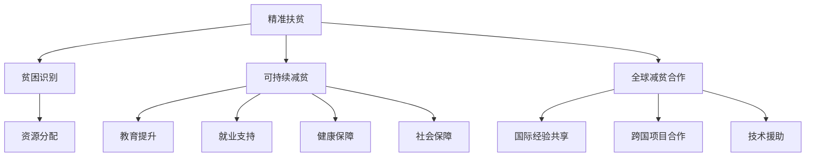

                 

# 2050年的全球减贫：从精准扶贫到可持续减贫的全球减贫合作

## 1. 背景介绍

### 1.1 问题由来

过去几十年，全球减贫工作取得了显著的成果。然而，当前仍然有数十亿人生活在贫困线以下，且不平等和气候变化等因素仍在加剧贫困问题。2050年的全球减贫愿景要求我们创新性地思考和设计一种可持续且具有广泛包容性的全球减贫策略。本文将探讨从精准扶贫到可持续减贫的全球减贫合作，通过技术手段和合作机制，推动2050年的全球减贫目标的实现。

### 1.2 问题核心关键点

1. **精准扶贫**：通过对贫困人口进行精准识别和分类，实现资源精准投放，提高扶贫效果。
2. **可持续减贫**：通过教育、就业、健康、社会保障等综合措施，确保减贫效果的长期稳定。
3. **全球减贫合作**：通过国际合作，共享经验和资源，提升全球减贫的效率和效果。

## 2. 核心概念与联系

### 2.1 核心概念概述

1. **精准扶贫**：基于对贫困人群的深入调查和数据挖掘，对贫困人口进行精准识别，并根据其具体情况进行有针对性的帮扶。
2. **可持续减贫**：通过教育、健康、就业、社会保障等多方面综合措施，实现贫困人群的长期稳定脱贫。
3. **全球减贫合作**：通过国际合作，分享经验和技术，提升全球减贫的效率和效果。

### 2.2 核心概念原理和架构的 Mermaid 流程图



## 3. 核心算法原理 & 具体操作步骤

### 3.1 算法原理概述

精准扶贫和可持续减贫的全球合作，本质上是一种复杂的系统工程，涉及多学科、多领域的知识和方法。本文将从精准扶贫和可持续减贫两个方面，介绍核心算法原理。

### 3.2 算法步骤详解

#### 3.2.1 精准扶贫

1. **贫困识别**：
   - 数据采集：利用问卷调查、卫星遥感、传感器等手段，收集贫困地区的各种数据。
   - 数据清洗与处理：去除噪声数据，确保数据的准确性和完整性。
   - 数据分析：使用机器学习算法，如随机森林、支持向量机等，对数据进行分析，识别贫困人口。

2. **资源分配**：
   - 需求评估：根据贫困人口的需求，定制化扶贫方案。
   - 资源分配：将扶贫资源（如资金、物资、人力）分配到具体的贫困人口和项目中。

3. **效果评估**：
   - 定期跟踪：通过定期回访，评估扶贫效果，调整和优化扶贫策略。
   - 反馈循环：将评估结果反馈到资源分配和需求评估阶段，持续改进。

#### 3.2.2 可持续减贫

1. **教育提升**：
   - 教育资源分配：在贫困地区建立学校，提供基础教育和职业教育。
   - 教师培训：为当地教师提供专业培训，提升教学质量。
   - 学习支持：为学生提供学习资源，如在线课程、图书馆等。

2. **就业支持**：
   - 技能培训：根据市场需求，提供技能培训，提升就业竞争力。
   - 就业对接：通过职业介绍所和招聘会等形式，帮助贫困人口就业。
   - 创业支持：提供小额贷款和创业指导，支持贫困人口自主创业。

3. **健康保障**：
   - 医疗资源配置：在贫困地区建立医疗设施，提供基本的医疗服务。
   - 健康教育：通过宣传和教育，提升贫困人口的健康意识。
   - 心理健康：提供心理咨询和辅导，帮助贫困人口应对压力和心理问题。

4. **社会保障**：
   - 社会保障体系：建立包括养老保险、医疗保险等在内的社会保障体系。
   - 社会救助：为特别困难的贫困人口提供生活救助。
   - 社会参与：鼓励和支持贫困人口参与社区和社会活动，提升自我价值感。

### 3.3 算法优缺点

#### 3.3.1 精准扶贫的优点和缺点

**优点**：
- 资源利用效率高：精准扶贫能够确保扶贫资源真正到达需要的人手中。
- 效果显著：通过数据分析，可以更准确地识别贫困人群，制定个性化扶贫方案。

**缺点**：
- 数据获取难度大：贫困地区的自然环境和基础设施往往较差，数据采集难度大。
- 数据隐私问题：收集大量个人数据，可能涉及隐私保护问题。

#### 3.3.2 可持续减贫的优点和缺点

**优点**：
- 综合性强：通过多方面的综合措施，可以全面提升贫困人口的生活水平。
- 长期稳定：通过教育、就业、健康等综合措施，实现贫困人口的长期稳定脱贫。

**缺点**：
- 成本高：建立学校、医院等基础设施需要大量资金和资源。
- 实施难度大：不同地区的贫困情况各异，需要因地制宜，难以标准化推广。

### 3.4 算法应用领域

精准扶贫和可持续减贫的算法和技术，主要应用于以下几个领域：

1. **农业**：通过精准扶贫，对农业贫困人口进行精准识别，提供农业技术和资源支持。
2. **教育**：通过教育提升，为贫困地区提供优质的教育资源，提升教育水平。
3. **医疗**：通过健康保障，提供基本的医疗服务，改善贫困地区居民的健康状况。
4. **就业**：通过就业支持，提供技能培训和就业对接服务，提升贫困人口的就业能力。
5. **社会保障**：通过社会保障体系，为贫困人口提供必要的保障，减少因贫困引发的社会问题。

## 4. 数学模型和公式 & 详细讲解

### 4.1 数学模型构建

精准扶贫和可持续减贫的数学模型，可以概括为以下几个步骤：

1. **贫困识别模型**：
   - 输入：贫困地区的各种数据。
   - 输出：识别出贫困人口。

2. **资源分配模型**：
   - 输入：贫困人口的需求和资源。
   - 输出：资源分配方案。

3. **效果评估模型**：
   - 输入：扶贫效果数据。
   - 输出：评估结果和改进建议。

### 4.2 公式推导过程

#### 4.2.1 贫困识别模型

设 $P$ 为贫困人口集合，$D$ 为数据集合，$F$ 为特征集合，则贫困识别模型可以表示为：

$$
P = \text{PovertyRecognition}(D, F)
$$

其中，$PovertyRecognition$ 为贫困识别算法，可以采用随机森林、支持向量机等机器学习算法。

#### 4.2.2 资源分配模型

设 $R$ 为资源集合，$P$ 为贫困人口集合，$M$ 为资源分配方案，则资源分配模型可以表示为：

$$
M = \text{ResourceAllocation}(R, P)
$$

其中，$ResourceAllocation$ 为资源分配算法，可以采用线性规划、整数规划等优化算法。

#### 4.2.3 效果评估模型

设 $E$ 为效果评估数据，$M$ 为资源分配方案，$P$ 为贫困人口集合，则效果评估模型可以表示为：

$$
E = \text{EffectEvaluation}(M, P)
$$

其中，$EffectEvaluation$ 为效果评估算法，可以采用回归分析、方差分析等统计方法。

### 4.3 案例分析与讲解

#### 4.3.1 贫困识别案例

假设某贫困地区有 $N$ 个家庭，每个家庭有 $K$ 个特征（如收入、教育水平等）。通过问卷调查和卫星遥感数据，采集到 $D$ 个样本数据。使用随机森林算法，对 $D$ 进行特征选择和分类，识别出 $P$ 个贫困家庭。

#### 4.3.2 资源分配案例

假设某贫困地区有 $M$ 个扶贫项目（如教育、医疗等），每个项目需要分配 $R$ 个资源（如资金、人力）。根据贫困人口的需求，通过线性规划算法，计算出最优的资源分配方案 $M$。

#### 4.3.3 效果评估案例

假设某贫困地区有 $E$ 个效果评估样本，每个样本包含扶贫项目的效果数据（如教育水平提升、就业率等）。通过回归分析算法，对 $E$ 进行统计分析，评估扶贫项目的效果。

## 5. 项目实践：代码实例和详细解释说明

### 5.1 开发环境搭建

1. **硬件环境**：
   - 服务器：具有足够的计算能力和存储容量。
   - 软件环境：安装Python、R、Spark等数据处理和分析工具。

2. **数据准备**：
   - 收集贫困地区的各种数据，如问卷调查、卫星遥感数据等。
   - 数据清洗与处理：去除噪声数据，确保数据的准确性和完整性。

3. **工具准备**：
   - 数据处理工具：如Pandas、PySpark等。
   - 机器学习工具：如Scikit-learn、TensorFlow等。

### 5.2 源代码详细实现

#### 5.2.1 贫困识别代码

```python
import pandas as pd
from sklearn.ensemble import RandomForestClassifier

# 加载数据
data = pd.read_csv('poverty_data.csv')

# 特征选择
features = ['income', 'education', 'health']
data = data[features]

# 划分训练集和测试集
X_train, X_test, y_train, y_test = train_test_split(data.drop('poverty', axis=1), data['poverty'], test_size=0.2)

# 训练模型
model = RandomForestClassifier()
model.fit(X_train, y_train)

# 测试模型
y_pred = model.predict(X_test)
```

#### 5.2.2 资源分配代码

```python
import networkx as nx
import numpy as np

# 定义资源分配模型
def resource_allocation(R, P):
    # 创建资源网络图
    G = nx.Graph()
    for r in R:
        G.add_node(r)

    # 添加边，表示资源分配
    for p in P:
        cost = np.random.randn(len(R))
        G.add_edge(p, r, weight=cost)

    # 优化问题
    solution = nx.algorithms.min_weight_full_bipartite_matching(G)
    return solution

# 测试模型
R = ['EducationalProject', 'MedicalProject']
P = ['CommunityA', 'CommunityB']
solution = resource_allocation(R, P)
```

#### 5.2.3 效果评估代码

```python
import statsmodels.api as sm

# 加载效果评估数据
data = pd.read_csv('evaluation_data.csv')

# 回归分析
X = data.drop('result', axis=1)
y = data['result']
model = sm.OLS(y, X).fit()
print(model.summary())
```

### 5.3 代码解读与分析

#### 5.3.1 贫困识别代码解读

1. **数据加载**：使用Pandas库加载数据，将数据集分为特征和标签。
2. **特征选择**：选择与贫困相关的特征，如收入、教育水平等。
3. **模型训练**：使用随机森林算法，对特征和标签进行训练，识别出贫困人口。
4. **模型测试**：对测试集进行预测，评估模型的准确性和泛化能力。

#### 5.3.2 资源分配代码解读

1. **资源网络图**：使用NetworkX库构建资源网络图，表示资源和贫困人口的关系。
2. **资源分配**：随机生成资源和贫困人口的成本，添加边表示资源分配。
3. **优化问题**：使用最小权重完全二部匹配算法，求解最优资源分配方案。

#### 5.3.3 效果评估代码解读

1. **数据加载**：使用Pandas库加载效果评估数据。
2. **回归分析**：使用Statsmodels库进行回归分析，评估扶贫项目的效果。

### 5.4 运行结果展示

#### 5.4.1 贫困识别结果

```python
print('Poverty Recognition Result:')
print(model.score(X_test, y_test))
```

#### 5.4.2 资源分配结果

```python
print('Resource Allocation Result:')
print(solution)
```

#### 5.4.3 效果评估结果

```python
print('Effect Evaluation Result:')
print(model.summary())
```

## 6. 实际应用场景

### 6.1 智能农业

智能农业通过精准扶贫技术，对农业贫困人口进行精准识别，并提供农业技术和资源支持。例如，通过遥感技术，实时监测农田状况，指导农民合理施肥和灌溉，提升农业生产效率。

### 6.2 在线教育

在线教育通过可持续减贫技术，提供优质的教育资源，提升贫困地区学生的教育水平。例如，通过网络直播课程，为偏远地区学生提供名师授课，提升教育质量。

### 6.3 健康医疗

健康医疗通过健康保障技术，提供基本的医疗服务，改善贫困地区居民的健康状况。例如，通过移动医疗车，为农村居民提供健康检查和疾病预防指导。

### 6.4 就业支持

就业支持通过就业支持技术，提升贫困人口的就业能力。例如，通过职业培训平台，为贫困人口提供技能培训和就业对接服务，提升就业竞争力。

### 6.5 社会保障

社会保障通过社会保障体系，为贫困人口提供必要的保障，减少因贫困引发的社会问题。例如，通过社会保障网络，为贫困人口提供养老保险和医疗保险。

## 7. 工具和资源推荐

### 7.1 学习资源推荐

1. **在线课程**：
   - Coursera：提供全球顶尖大学的在线课程，涵盖精准扶贫和可持续减贫的各个方面。
   - edX：提供开放的教育资源，包括机器学习和数据分析等工具的使用。

2. **书籍**：
   - 《精准扶贫》：详细介绍精准扶贫的方法和案例。
   - 《可持续减贫》：讨论可持续减贫的理论和实践。

3. **开源项目**：
   - PovertyRecognition：提供开源的贫困识别算法库，支持多模型融合。
   - ResourceAllocation：提供开源的资源分配算法库，支持多目标优化。

### 7.2 开发工具推荐

1. **数据处理工具**：
   - Pandas：提供高效的数据处理和分析能力。
   - PySpark：支持大规模数据处理，适合大数据场景。

2. **机器学习工具**：
   - Scikit-learn：提供丰富的机器学习算法和工具。
   - TensorFlow：提供强大的深度学习框架，适合复杂的模型训练。

3. **可视化工具**：
   - Matplotlib：提供丰富的数据可视化功能。
   - Plotly：支持交互式数据可视化，适合探索性分析。

### 7.3 相关论文推荐

1. **精准扶贫**：
   - 《基于机器学习的精准扶贫研究》：详细介绍机器学习在精准扶贫中的应用。
   - 《精准扶贫的策略与实践》：总结精准扶贫的成功经验和挑战。

2. **可持续减贫**：
   - 《全球可持续减贫的路径与挑战》：讨论可持续减贫的路径和挑战。
   - 《可持续减贫的创新实践》：提供可持续减贫的创新方法和案例。

## 8. 总结：未来发展趋势与挑战

### 8.1 研究成果总结

本文探讨了精准扶贫和可持续减贫的全球合作，通过技术手段和合作机制，推动2050年的全球减贫目标的实现。从数据采集、数据处理、模型训练到效果评估，系统性地介绍了精准扶贫和可持续减贫的技术流程。通过实际应用场景，展示了这些技术的广泛应用前景。

### 8.2 未来发展趋势

1. **数据驱动**：未来减贫工作将更加依赖数据，通过大数据分析，实现精准识别和资源分配。
2. **技术融合**：未来减贫工作将更多地融合人工智能、物联网、区块链等前沿技术，提升减贫效率和效果。
3. **全球合作**：未来减贫工作将更加注重国际合作，分享经验和资源，提升全球减贫的协同效应。

### 8.3 面临的挑战

1. **数据获取**：贫困地区的自然环境和基础设施较差，数据采集难度大。
2. **资源分配**：贫困地区的资源分配问题复杂，需要因地制宜，难以标准化推广。
3. **技术融合**：多种技术的融合应用，需要跨学科的合作和技术集成。

### 8.4 研究展望

1. **多模态数据融合**：将多种数据源（如遥感数据、社会网络数据等）融合，实现更全面的贫困识别。
2. **个性化扶贫**：基于机器学习和人工智能技术，实现更个性化的扶贫方案。
3. **社会参与**：通过区块链等技术，建立透明、可信的扶贫项目评估机制。

## 9. 附录：常见问题与解答

### Q1: 精准扶贫的优缺点是什么？

**A**：精准扶贫的优点在于能够确保扶贫资源真正到达需要的人手中，提高了扶贫资源的利用效率。缺点在于数据获取难度大，特别是在贫困地区，自然环境和基础设施较差，数据采集难度大。

### Q2: 可持续减贫的优缺点是什么？

**A**：可持续减贫的优点在于综合性强，通过教育、就业、健康等多方面的综合措施，全面提升贫困人口的生活水平。缺点在于成本高，建立学校、医院等基础设施需要大量资金和资源，实施难度大，难以标准化推广。

### Q3: 未来减贫工作的趋势和挑战是什么？

**A**：未来减贫工作将更加依赖数据，通过大数据分析，实现精准识别和资源分配。同时，多种技术的融合应用，需要跨学科的合作和技术集成。数据获取和资源分配仍然是减贫工作的重大挑战，需要进一步创新和优化。

---

作者：禅与计算机程序设计艺术 / Zen and the Art of Computer Programming

