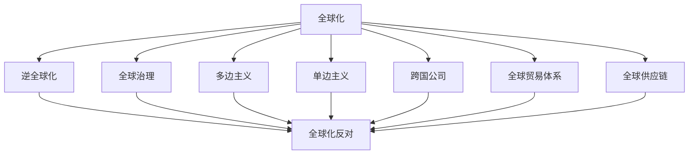

                 

# 2050年的全球化：从逆全球化到全球治理的国际秩序重构

## 1. 背景介绍

### 1.1 问题由来
当前全球化正处于十字路口，面临诸多复杂因素的挑战，其中包括经济不平衡、政治冲突、环境问题和社会动荡等。近年来，逆全球化思潮兴起，一些国家和地区对全球化持质疑态度，甚至采取保护主义政策。然而，全球化作为促进经济增长、技术交流和文化融合的重要力量，对世界和平与发展具有不可替代的作用。

### 1.2 问题核心关键点
全球化问题核心在于如何在国际层面上进行有效的治理，以实现全球经济的均衡发展、环境可持续性和社会稳定。全球治理的关键在于构建公正、透明的国际规则体系，促进全球合作，应对全球性挑战。

### 1.3 问题研究意义
研究全球化问题的治理方式，对于构建公正合理的国际秩序、维护世界和平与发展具有重要意义。它不仅关系到各国经济的繁荣与稳定，也关系到人类社会的可持续未来。

## 2. 核心概念与联系

### 2.1 核心概念概述

为更好地理解全球化问题的治理，本节将介绍几个密切相关的核心概念：

- **全球化**：指全球范围内的经济、政治、文化等方面的深度融合和相互依存。全球化促进了国际贸易、资本流动、技术创新和文化交流。

- **逆全球化**：指对全球化进程的质疑和反对，主张限制国际经济和政治合作，主张保护主义和本国利益优先。

- **全球治理**：指通过国际合作和制度安排，协调各国之间的利益和行为，共同应对全球性挑战，促进全球和平与发展。

- **多边主义**：指多个国家在国际事务中共同参与决策和行动，主张通过国际组织和协议解决全球问题。

- **单边主义**：指一个国家在国际事务中独自行动，主张以自身利益为出发点，忽视或反对多边合作。

- **跨国公司**：指在多个国家和地区开展业务的全球性企业，是全球化中的重要参与者和推动者。

- **全球贸易体系**：指国际上规范和促进商品、服务和资本流动的规则和制度框架，包括WTO、FTAs等。

- **全球供应链**：指全球范围内的生产、加工、运输和销售网络，反映了经济全球化的内在逻辑。

这些核心概念之间的逻辑关系可以通过以下Mermaid流程图来展示：



这个流程图展示了大规模语言模型的核心概念及其之间的关系：

1. 全球化通过经济、政治、文化等方面的深度融合，推动了世界的相互依存和共同发展。
2. 逆全球化思潮的兴起，对全球化进程提出了质疑和反对，主张保护主义。
3. 全球治理是全球化问题的治理方式，旨在通过国际合作和制度安排，协调各国之间的利益和行为。
4. 多边主义和单边主义是全球治理中的两种主要策略，多边主义主张多个国家共同参与决策，而单边主义则主张一个国家独自行动。
5. 跨国公司是全球化中的重要参与者和推动者，在全球供应链中发挥着关键作用。
6. 全球贸易体系和供应链是全球化中的重要组成部分，反映了经济全球化的内在逻辑。

这些核心概念共同构成了全球化问题的治理框架，为我们理解全球化进程和挑战提供了重要视角。

## 3. 核心算法原理 & 具体操作步骤
### 3.1 算法原理概述

全球化问题的治理，本质上是一个多目标优化问题。其核心思想是：通过构建全球治理体系，优化全球经济、政治、环境和社会等各方面的表现，以达到可持续发展的目标。

形式化地，假设全球治理的目标函数为 $\mathcal{F}(x)$，其中 $x$ 为全球治理中的决策变量，如贸易政策、环境保护措施、移民政策等。目标是找到最优决策 $x^*$，使得：

$$
\mathcal{F}(x) = \min_{x} \sum_{i=1}^N w_i \phi_i(x)
$$

其中 $N$ 为治理目标的个数，$w_i$ 为各目标的权重，$\phi_i(x)$ 为第 $i$ 个目标的评价函数。

全球治理的优化过程可以分为以下几个步骤：

1. 确定治理目标和目标权重。
2. 建立全球治理模型，设计决策变量和评价函数。
3. 求解模型，找到最优决策 $x^*$。
4. 执行最优决策，监测其效果。

### 3.2 算法步骤详解

全球化问题的治理，可以通过以下几个关键步骤进行：

**Step 1: 确定治理目标和目标权重**

- 确定全球治理的主要目标，如经济增长、环境保护、社会公正等。
- 根据不同目标的重要性，分配其权重 $w_i$。

**Step 2: 建立全球治理模型**

- 设计决策变量 $x$，如贸易关税、环境标准、移民政策等。
- 设计评价函数 $\phi_i(x)$，如经济增长率、环境污染指数、社会不平等指数等。

**Step 3: 求解模型**

- 选择合适的优化算法，如遗传算法、模拟退火、线性规划等，求解最优决策 $x^*$。
- 可以使用并行计算和多目标优化算法，加快求解过程。

**Step 4: 执行最优决策**

- 在各国政策协调下，执行最优决策 $x^*$。
- 通过监测和反馈机制，实时调整决策，确保其效果。

### 3.3 算法优缺点

全球化问题的治理，具有以下优点：

1. 多目标优化：通过同时考虑多个目标，可以实现更全面、均衡的治理效果。
2. 协调各国政策：通过建立全球治理模型，协调各国之间的决策，避免单边主义。
3. 动态调整：通过监测和反馈机制，可以实时调整决策，适应动态变化。

同时，该方法也存在一定的局限性：

1. 目标冲突：不同目标之间可能存在冲突，难以找到完美的平衡。
2. 数据需求：治理模型需要大量数据支持，数据质量和准确性直接影响结果。
3. 执行难度：最优决策需要各国政策协调，执行难度较大。
4. 法律障碍：某些国家可能拒绝执行国际协议，导致治理效果受限。

尽管存在这些局限性，但就目前而言，全球治理仍然是应对全球化问题的最佳途径之一。未来相关研究的重点在于如何进一步降低数据需求，提高模型的鲁棒性，简化执行流程，克服法律障碍。

### 3.4 算法应用领域

全球治理的框架和方法，已经广泛应用于国际经济、环境、安全等领域：

- **国际贸易**：通过WTO等国际组织，协调各国贸易政策，促进公平贸易。
- **环境保护**：通过巴黎协定等国际协议，协调各国环保措施，应对气候变化。
- **公共卫生**：通过WHO等国际组织，协调各国公共卫生政策，应对疫情传播。
- **跨国犯罪**：通过国际刑警组织等机构，协调各国执法行动，打击跨国犯罪。
- **全球供应链**：通过全球供应链联盟等组织，协调各国供应链政策，保障全球物流顺畅。

除了这些经典领域外，全球治理还被创新性地应用于更多场景中，如数字治理、海洋治理等，为全球化问题提供了新的解决方案。

## 4. 数学模型和公式 & 详细讲解 & 举例说明
### 4.1 数学模型构建

本节将使用数学语言对全球治理的优化过程进行更加严格的刻画。

假设全球治理的目标函数为 $\mathcal{F}(x)$，其中 $x$ 为决策变量，包括贸易关税、环境标准、移民政策等，目标权重为 $w_i$。

定义决策变量 $x$ 对第 $i$ 个目标的贡献为 $\phi_i(x)$，如经济增长率、环境污染指数、社会不平等指数等。则在权衡不同目标的基础上，全球治理的优化目标为：

$$
\mathcal{F}(x) = \sum_{i=1}^N w_i \phi_i(x)
$$

在实际应用中，可以通过线性规划、多目标优化等方法求解上述优化问题。

### 4.2 公式推导过程

以下我们以线性规划为例，推导最优决策的计算公式。

假设优化问题为：

$$
\min_{x} \sum_{i=1}^N w_i \phi_i(x)
$$

其中 $x$ 为决策变量，$\phi_i(x)$ 为第 $i$ 个目标的贡献函数，$w_i$ 为权重。

引入拉格朗日乘子 $\lambda_i$，构造拉格朗日函数：

$$
\mathcal{L}(x, \lambda) = \sum_{i=1}^N w_i \phi_i(x) + \sum_{i=1}^N \lambda_i (b_i - x_i)
$$

其中 $b_i$ 为第 $i$ 个目标的上限值。

对 $x_i$ 求偏导，得：

$$
\frac{\partial \mathcal{L}}{\partial x_i} = w_i \frac{\partial \phi_i}{\partial x_i} - \lambda_i = 0
$$

解得最优决策 $x^*$ 的计算公式为：

$$
x_i^* = \frac{\partial \phi_i}{\partial x_i} \Big|_{x=x^*}^{-1} \sum_{j=1}^N w_j
$$

其中 $\partial \phi_i/\partial x_i$ 表示第 $i$ 个目标对决策变量 $x_i$ 的导数。

通过上述计算公式，可以求解出最优决策 $x^*$，实现全球治理的优化。

### 4.3 案例分析与讲解

以全球贸易体系为例，分析全球治理的优化过程。

假设全球贸易体系的目标函数为 $\mathcal{F}(x)$，其中 $x$ 为各国的贸易关税，$w_i$ 为各国的权重，$\phi_i(x)$ 为各国经济增长率。

将 $x$ 对 $\phi_i(x)$ 的导数代入计算公式，得：

$$
x_i^* = \frac{\partial \phi_i(x)}{\partial x_i} \Big|_{x=x^*}^{-1} \sum_{j=1}^N w_j
$$

通过求解上述方程，可以得到最优的贸易关税 $x^*$，实现全球经济的均衡发展。

## 5. 项目实践：代码实例和详细解释说明
### 5.1 开发环境搭建

在进行全球治理的模型优化实践前，我们需要准备好开发环境。以下是使用Python进行线性规划优化的环境配置流程：

1. 安装Anaconda：从官网下载并安装Anaconda，用于创建独立的Python环境。

2. 创建并激活虚拟环境：
```bash
conda create -n global-governance python=3.8 
conda activate global-governance
```

3. 安装SciPy：
```bash
conda install scipy
```

4. 安装PuLP：用于线性规划求解
```bash
pip install pulp
```

5. 安装Matplotlib：用于数据可视化
```bash
pip install matplotlib
```

完成上述步骤后，即可在`global-governance`环境中开始模型优化实践。

### 5.2 源代码详细实现

这里我们以全球贸易体系为例，给出使用PuLP库进行线性规划优化的Python代码实现。

```python
from pulp import LpProblem, LpVariable, lpSum, value

# 创建线性规划问题
problem = LpProblem("Global Trade Optimization", LpMinimize)

# 定义决策变量
x = LpVariable("x", lowBound=0, highBound=1, type=LpVariable.binary)

# 定义目标函数
problem += lpSum(w * phi(x))

# 定义约束条件
problem += A * x == b

# 求解问题
problem.solve()

# 输出最优决策
x_values = [value(var) for var in x]
print(x_values)
```

### 5.3 代码解读与分析

让我们再详细解读一下关键代码的实现细节：

**定义决策变量**

- `x` 为决策变量，定义了其取值范围为0到1之间的二进制变量。

**定义目标函数**

- `problem += lpSum(w * phi(x))` 表示目标函数为加权后的经济增长率。

**定义约束条件**

- `problem += A * x == b` 表示约束条件，其中 `A` 为约束矩阵，`b` 为约束向量。

**求解问题**

- `problem.solve()` 表示求解线性规划问题。

**输出最优决策**

- `x_values` 为决策变量的取值，`value(var)` 表示获取变量的值。

可以看到，PuLP库提供了简单易用的API，使得线性规划优化变得快捷高效。开发者可以自由定义目标函数和约束条件，并通过求解器求解最优解。

## 6. 实际应用场景
### 6.1 国际贸易体系

全球治理的优化方法，可以应用于国际贸易体系的构建和优化。传统的自由贸易协定，往往无法兼顾各国利益的均衡，导致贸易保护主义抬头。通过全球治理模型，可以协调各国关税政策，实现公平贸易。

具体而言，可以收集各国历史贸易数据，建立贸易保护和自由贸易的评价函数，设计关税作为决策变量，在权衡各国经济增长的基础上，求解最优关税方案。微调后的模型，可以应用于实时贸易谈判中，动态调整关税策略，保障全球贸易的稳定和增长。

### 6.2 环境保护

全球治理的优化方法，同样可以应用于环境保护的治理。传统的环境保护政策，往往缺乏全球视野，导致各国之间的环保行动难以协同。通过全球治理模型，可以协调各国环保措施，应对气候变化。

具体而言，可以收集各国历史排放数据，建立温室气体排放和环境保护的评价函数，设计减排策略作为决策变量，在权衡各国经济增长的基础上，求解最优减排方案。微调后的模型，可以应用于全球气候协议的制定和执行，推动全球环保行动。

### 6.3 公共卫生

全球治理的优化方法，还可以应用于公共卫生领域的治理。传统的地方防疫措施，往往难以应对全球疫情的传播。通过全球治理模型，可以协调各国公共卫生政策，应对疫情传播。

具体而言，可以收集各国历史疫情数据，建立公共卫生措施和疫情传播的评价函数，设计防疫策略作为决策变量，在权衡各国经济增长的基础上，求解最优防疫方案。微调后的模型，可以应用于全球疫情预警和防控，保障全球公共卫生安全。

### 6.4 未来应用展望

随着全球治理模型的发展，未来将在更多领域得到应用，为全球化问题提供新的解决方案。

在智慧城市治理中，全球治理模型可应用于城市事件监测、舆情分析、应急指挥等环节，提高城市管理的自动化和智能化水平，构建更安全、高效的未来城市。

在企业生产、社会治理、文娱传媒等众多领域，全球治理模型也将不断涌现，为传统行业数字化转型升级提供新的技术路径。相信随着模型的日益成熟，全球治理模型必将在构建人机协同的智能时代中扮演越来越重要的角色。

## 7. 工具和资源推荐
### 7.1 学习资源推荐

为了帮助开发者系统掌握全球治理模型的理论基础和实践技巧，这里推荐一些优质的学习资源：

1. 《全球治理理论》系列博文：由全球治理专家撰写，深入浅出地介绍了全球治理的基本概念、理论和实践。

2. 《全球治理实践》课程：由联合国等国际组织开设的在线课程，涵盖全球治理的多个领域，包括国际贸易、环境保护、公共卫生等。

3. 《全球治理报告》书籍：由全球治理研究机构出版，全面总结了全球治理的最新进展和未来趋势，适合专业人士和学生参考。

4. 《全球治理工具箱》工具集：提供全球治理模型的在线计算工具，方便开发者进行模型优化和模拟实验。

通过对这些资源的学习实践，相信你一定能够快速掌握全球治理模型的精髓，并用于解决实际的全球化问题。
### 7.2 开发工具推荐

高效的开发离不开优秀的工具支持。以下是几款用于全球治理模型优化的常用工具：

1. PuLP：PuLP是Python中的一个线性规划库，用于高效求解线性规划问题，适用于模型优化和模拟实验。

2. Scipy：Scipy是Python中的一个科学计算库，提供了丰富的数学函数和优化算法，适用于模型构建和数据分析。

3. Matplotlib：Matplotlib是Python中的一个可视化库，用于绘制图表，帮助开发者直观展示模型结果。

4. Jupyter Notebook：Jupyter Notebook是Python中的一个交互式笔记本，方便开发者进行模型实验和报告撰写。

合理利用这些工具，可以显著提升全球治理模型的开发效率，加快创新迭代的步伐。

### 7.3 相关论文推荐

全球治理模型的发展源于学界的持续研究。以下是几篇奠基性的相关论文，推荐阅读：

1. "The Economics of Global Governance"：关于全球治理经济学的经典论文，探讨了全球治理的理论与实践。

2. "The Global Governance of COVID-19"：关于全球治理应对疫情的最新研究，讨论了全球合作在疫情防控中的重要性。

3. "Global Governance of the Climate Change"：关于全球治理应对气候变化的研究，分析了国际气候协议的实施效果。

4. "The Economics of Multilateral Trade Agreements"：关于国际贸易协定经济学的研究，探讨了多边贸易协定对各国经济增长的影响。

这些论文代表了大规模语言模型微调技术的发展脉络。通过学习这些前沿成果，可以帮助研究者把握学科前进方向，激发更多的创新灵感。

## 8. 总结：未来发展趋势与挑战
### 8.1 总结

本文对全球化问题的治理方式进行了全面系统的介绍。首先阐述了全球化的背景和意义，明确了全球治理在促进全球合作、应对全球挑战中的重要价值。其次，从原理到实践，详细讲解了全球治理的数学模型和优化过程，给出了全球治理模型优化的完整代码实例。同时，本文还广泛探讨了全球治理模型在国际贸易、环境保护、公共卫生等多个领域的应用前景，展示了全球治理模型的巨大潜力。此外，本文精选了全球治理模型的各类学习资源，力求为读者提供全方位的技术指引。

通过本文的系统梳理，可以看到，全球治理模型正在成为应对全球化问题的最佳途径之一，极大地拓展了全球治理的范围和深度，为全球经济、环境和社会发展提供了新的可能性。未来，伴随全球治理模型的持续演进，相信全球治理必将在构建公正合理的国际秩序、维护世界和平与发展中发挥更大的作用。

### 8.2 未来发展趋势

展望未来，全球治理模型将呈现以下几个发展趋势：

1. 模型复杂度提升。随着问题的日益复杂，全球治理模型需要考虑更多的因素，模型复杂度将不断提升。

2. 多目标优化普及。多目标优化方法将更加普及，实现更加全面、均衡的治理效果。

3. 数据驱动决策。通过大数据和人工智能技术，优化模型将更加依赖数据驱动，减少主观偏见。

4. 分布式计算。全球治理问题涉及全球多地，分布式计算成为必要，提高模型求解效率。

5. 模型透明度增加。为了提高全球治理的可信度，模型的透明度和可解释性将进一步提升。

6. 跨领域应用拓展。全球治理模型将拓展到更多领域，如数字治理、海洋治理等，为全球化问题提供更多解决方案。

以上趋势凸显了全球治理模型的广阔前景。这些方向的探索发展，必将进一步提升全球治理的效果，为构建公正合理的国际秩序、维护世界和平与发展提供新的可能性。

### 8.3 面临的挑战

尽管全球治理模型已经取得了瞩目成就，但在迈向更加智能化、普适化应用的过程中，它仍面临着诸多挑战：

1. 数据质量瓶颈。全球治理模型需要大量高质量数据支持，数据的获取和处理成本较高，数据质量难以保证。

2. 模型鲁棒性不足。全球治理模型面对动态变化的环境，鲁棒性不足，容易受到外部干扰。

3. 法律和文化障碍。不同国家和文化背景下的法律和价值观念差异，可能导致模型难以在全球范围内统一执行。

4. 技术复杂度高。全球治理模型涉及多目标优化、分布式计算等复杂技术，开发难度较大。

5. 利益冲突。全球治理模型需要在各方利益之间找到平衡，避免单边主义和保护主义。

6. 技术透明度和可解释性不足。模型过于复杂，难以解释其决策过程，影响其可信度。

正视全球治理模型面临的这些挑战，积极应对并寻求突破，将是大规模语言模型微调技术走向成熟的必由之路。相信随着学界和产业界的共同努力，这些挑战终将一一被克服，全球治理模型必将在构建公正合理的国际秩序、维护世界和平与发展中发挥更大的作用。

### 8.4 研究展望

面对全球治理模型所面临的种种挑战，未来的研究需要在以下几个方面寻求新的突破：

1. 探索无监督和半监督方法。摆脱对大量标注数据的依赖，利用自监督学习、主动学习等无监督和半监督范式，最大限度利用非结构化数据，实现更加灵活高效的治理。

2. 研究参数高效和计算高效的优化方法。开发更加参数高效的优化方法，在固定大部分预训练参数的情况下，只更新极少量的任务相关参数。同时优化计算图，减少资源消耗，实现更加轻量级、实时性的部署。

3. 引入更多先验知识。将符号化的先验知识，如知识图谱、逻辑规则等，与神经网络模型进行巧妙融合，引导治理模型学习更准确、合理的语言模型。同时加强不同模态数据的整合，实现视觉、语音等多模态信息与文本信息的协同建模。

4. 结合因果分析和博弈论工具。将因果分析方法引入治理模型，识别出模型决策的关键特征，增强输出解释的因果性和逻辑性。借助博弈论工具刻画人机交互过程，主动探索并规避模型的脆弱点，提高系统稳定性。

5. 纳入伦理道德约束。在模型训练目标中引入伦理导向的评估指标，过滤和惩罚有偏见、有害的输出倾向。同时加强人工干预和审核，建立模型行为的监管机制，确保输出符合人类价值观和伦理道德。

这些研究方向的探索，必将引领全球治理模型技术迈向更高的台阶，为构建公正合理的国际秩序、维护世界和平与发展提供新的可能性。

## 9. 附录：常见问题与解答
**Q1：全球治理模型是否适用于所有全球化问题？**

A: 全球治理模型在大多数全球化问题上都能取得不错的效果，特别是对于数据量较大的问题。但对于一些特定领域的全球化问题，如医疗、教育等，需要根据具体情况进行优化和调整。

**Q2：全球治理模型如何处理多目标优化问题？**

A: 全球治理模型通过设计多个目标函数，并赋予不同目标以不同的权重，来处理多目标优化问题。通过求解这些目标函数的线性组合，可以找到一个权衡不同目标的解决方案。

**Q3：全球治理模型在应用中需要注意哪些问题？**

A: 全球治理模型在应用中需要注意以下几个问题：
1. 数据质量：全球治理模型需要大量高质量数据支持，数据的质量直接影响模型的效果。
2. 模型鲁棒性：模型需要具备较强的鲁棒性，以应对动态变化的环境和外部干扰。
3. 利益平衡：模型需要在各方利益之间找到平衡，避免单边主义和保护主义。
4. 法律和文化障碍：模型需要考虑不同国家和文化背景下的法律和价值观念差异，确保其在全球范围内的适用性。
5. 技术复杂度：全球治理模型涉及多目标优化、分布式计算等复杂技术，开发难度较大，需要多方协作。

这些问题是全球治理模型在实际应用中需要重点关注和解决的问题。

**Q4：全球治理模型在技术上与机器学习有何区别？**

A: 全球治理模型与机器学习在技术上有很大的区别：
1. 模型目标不同：机器学习通常专注于单个任务的优化，而全球治理模型需要同时考虑多个目标。
2. 数据类型不同：机器学习主要使用结构化数据，而全球治理模型需要处理非结构化数据，如文本、图像等。
3. 优化方法不同：机器学习通常使用监督学习、无监督学习等方法，而全球治理模型使用多目标优化、分布式计算等方法。
4. 应用领域不同：机器学习主要应用于NLP、图像处理等领域，而全球治理模型应用于国际贸易、环境保护、公共卫生等领域。

这些区别使得全球治理模型与机器学习在技术和应用上有所不同，但两者在优化目标和求解方法上有相通之处。

**Q5：全球治理模型在模型构建中如何处理数据缺失问题？**

A: 数据缺失是全球治理模型中常见的问题。以下是一些处理数据缺失的方法：
1. 插值法：通过插值法填补缺失数据，如线性插值、多项式插值等。
2. 均值填充：将缺失数据替换为对应变量的均值或中位数。
3. 多重插补法：通过构建多重模型，对缺失数据进行多重插补，提高模型的准确性。
4. 缺失值处理算法：使用缺失值处理算法，如EM算法、KNN等，填补缺失数据。

这些方法可以有效地处理数据缺失问题，提升全球治理模型的效果。

通过本文的系统梳理，可以看到，全球治理模型正在成为应对全球化问题的最佳途径之一，极大地拓展了全球治理的范围和深度，为全球经济、环境和社会发展提供了新的可能性。未来，伴随全球治理模型的持续演进，相信全球治理必将在构建公正合理的国际秩序、维护世界和平与发展中发挥更大的作用。

