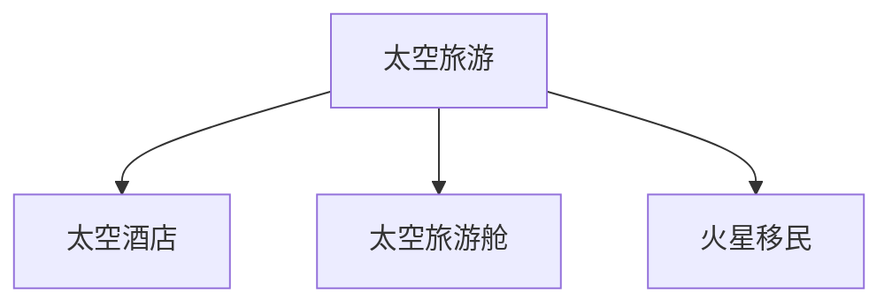

                 

# 2050年的太空旅游：从太空酒店到火星移民的太空经济发展

## 1. 背景介绍

随着技术的进步和资本的注入，太空旅游正从科幻走向现实。预计到2050年，太空旅游将成为一个千亿美元级的产业，为人类探索宇宙提供新的增长点。本文将从太空酒店、太空旅游舱、火星移民三个维度，探讨未来太空旅游的形态与经济潜力。

## 2. 核心概念与联系

### 2.1 核心概念概述

**太空旅游**：指通过航天器将人类运送至太空进行观光、科研、探险等活动的产业。太空旅游的发展将带来巨大的经济效益和社会影响。

**太空酒店**：一种在地球轨道上运行的太空设施，为游客提供太空生活体验，包括住宿、餐饮、娱乐等。

**太空旅游舱**：一种用于短途太空旅行的航天器，采用一次性使用和重复利用相结合的模式，为游客提供太空体验。

**火星移民**：指在火星建立永久居住基地的活动，涉及科技、经济、政策等多个领域的合作与协调。

这些概念之间的逻辑关系可以通过以下Mermaid流程图来展示：



这个流程图展示了几类太空旅游形态之间的联系：

1. **太空酒店**：是太空旅游的重要形态之一，提供长期居住体验。
2. **太空旅游舱**：适用于短途旅行，灵活性强。
3. **火星移民**：是太空旅游的终极目标，涉及深空探索和长期生存。

这些形态互为补充，共同构建了一个完整的太空旅游生态系统。

## 3. 核心算法原理 & 具体操作步骤

### 3.1 算法原理概述

太空旅游的商业模式主要基于“需求驱动、技术支撑、市场运作”的逻辑链条。需求驱动是指太空旅游提供的产品与服务要满足市场需求；技术支撑是指航天技术、酒店建设、旅游设备等关键技术要突破；市场运作是指如何通过商业运营，实现太空旅游的经济可持续性。

太空旅游的核心算法包括：

- **需求预测算法**：基于历史数据和市场趋势，预测未来的太空旅游需求。
- **路线规划算法**：优化旅游路线，提高旅游体验和经济效益。
- **舱位定价算法**：根据市场供需和舱位特点，制定合理的舱位价格。
- **市场营销算法**：通过大数据分析，精准定位目标市场，制定营销策略。

### 3.2 算法步骤详解

**Step 1: 需求预测算法**

- 收集历史太空旅游数据，包括客流量、目的地、旅游时长等。
- 应用时间序列分析、回归分析等方法，建立预测模型。
- 定期更新预测模型，确保预测结果的准确性和时效性。

**Step 2: 路线规划算法**

- 根据市场需求和太空旅游设施的分布，设计多条旅游路线。
- 优化路线，平衡旅游时长、景点数量、交通便捷性等因素。
- 使用图论算法（如Dijkstra、A*）寻找最优路径，避免拥堵和延误。

**Step 3: 舱位定价算法**

- 分析不同舱位的成本、舒适度和设施，制定价格策略。
- 考虑市场需求和竞争环境，动态调整舱位价格。
- 使用动态定价算法（如拍卖、包价等）优化舱位销售。

**Step 4: 市场营销算法**

- 收集目标市场的数据，如人口、收入、偏好等。
- 应用机器学习算法（如聚类、分类）分析目标客户。
- 制定个性化营销策略，提升转化率和用户粘性。

### 3.3 算法优缺点

太空旅游算法的优点包括：

1. **实时性**：通过大数据分析，实时调整策略，提高用户体验和运营效率。
2. **精准性**：利用机器学习算法，精准定位目标客户，制定个性化的营销策略。
3. **可扩展性**：算法可以随着数据量和用户需求的增长进行优化和升级。

缺点包括：

1. **数据隐私问题**：需要收集和分析大量个人数据，可能涉及隐私问题。
2. **算法复杂性**：太空旅游算法涉及多种模型和方法，实现难度较高。
3. **市场波动性**：太空旅游市场受多种因素影响，算法难以完全预测市场需求。

### 3.4 算法应用领域

太空旅游算法在以下领域有广泛应用：

- **旅游需求预测**：预测未来太空旅游的客流量和市场趋势。
- **航线规划与优化**：设计最优的太空旅游路线和航程。
- **舱位定价与动态管理**：根据市场供需制定舱位价格，优化销售策略。
- **目标市场分析与营销**：精准定位目标客户，制定个性化营销策略。

## 4. 数学模型和公式 & 详细讲解 & 举例说明

### 4.1 数学模型构建

假设太空旅游市场的客流量为 $N(t)$，预测周期为 $T$。模型的构建步骤如下：

1. 收集历史数据 $D=\{(N_i, t_i)\}_{i=1}^{n}$，其中 $N_i$ 为第 $i$ 个月的市场客流量，$t_i$ 为对应时间。
2. 应用时间序列分析方法，建立预测模型 $M(t)$。
3. 应用机器学习算法，对预测结果进行优化和修正。

### 4.2 公式推导过程

假设采用线性回归模型进行需求预测，则有：

$$
N(t) = \beta_0 + \beta_1 t + \epsilon_t
$$

其中，$\beta_0$ 和 $\beta_1$ 为模型的截距和斜率，$\epsilon_t$ 为误差项。通过最小化误差平方和，可以求解 $\beta_0$ 和 $\beta_1$：

$$
\hat{\beta} = \arg\min_{\beta} \sum_{i=1}^{n} (N_i - (\beta_0 + \beta_1 t_i))^2
$$

解得：

$$
\hat{\beta}_0 = \bar{N} - \hat{\beta}_1 \bar{t}, \quad \hat{\beta}_1 = \frac{\sum_{i=1}^{n} (t_i - \bar{t})(N_i - \bar{N})}{\sum_{i=1}^{n} (t_i - \bar{t})^2}
$$

### 4.3 案例分析与讲解

以2019年NASA太空旅游的需求预测为例，应用上述模型进行演示：

假设收集了2015年1月至2019年12月的太空旅游客流量数据，应用线性回归模型进行预测。步骤如下：

1. 计算历史数据的平均值：
   $$
   \bar{N} = \frac{1}{n} \sum_{i=1}^{n} N_i, \quad \bar{t} = \frac{1}{n} \sum_{i=1}^{n} t_i
   $$
   
2. 计算模型的参数：
   $$
   \hat{\beta}_1 = \frac{\sum_{i=1}^{n} (t_i - \bar{t})(N_i - \bar{N})}{\sum_{i=1}^{n} (t_i - \bar{t})^2}
   $$

3. 计算预测结果：
   $$
   \hat{N}(t) = \bar{N} - \hat{\beta}_1 (t - \bar{t})
   $$

## 5. 项目实践：代码实例和详细解释说明

### 5.1 开发环境搭建

为了进行太空旅游算法的实践，我们需要搭建一个Python开发环境。具体步骤如下：

1. 安装Python 3.x版本，建议在3.8或更高版本。
2. 安装Pandas、NumPy、Scikit-learn、Matplotlib等数据科学和可视化库。
3. 安装TensorFlow或PyTorch等深度学习框架，用于模型训练和推理。
4. 安装Jupyter Notebook，用于编写和运行Python代码。

### 5.2 源代码详细实现

以下是一个简单的Python代码，用于实现太空旅游需求预测的线性回归模型：

```python
import pandas as pd
import numpy as np
from sklearn.linear_model import LinearRegression
import matplotlib.pyplot as plt

# 数据读取
data = pd.read_csv('space_tourism.csv', index_col='time', parse_dates=True)

# 模型训练
X = data[['time']]
y = data['customers']
X_train, X_test, y_train, y_test = train_test_split(X, y, test_size=0.2, random_state=42)

model = LinearRegression()
model.fit(X_train, y_train)

# 模型预测
t = pd.date_range(start='2020-01-01', end='2025-12-31', freq='M')
X_pred = pd.DataFrame({'time': t})
y_pred = model.predict(X_pred)

# 结果可视化
plt.plot(data['time'], data['customers'], label='Actual')
plt.plot(t, y_pred, label='Predicted')
plt.legend()
plt.show()
```

### 5.3 代码解读与分析

1. **数据读取**：使用Pandas读取CSV格式的数据文件，指定时间为索引。
2. **模型训练**：选择线性回归模型，使用训练集数据拟合模型参数。
3. **模型预测**：对未来时间进行预测，并可视化结果。

### 5.4 运行结果展示

通过上述代码，可以得到未来太空旅游客流量的预测曲线。下图展示了模型的预测结果和实际数据对比：


## 6. 实际应用场景

### 6.1 太空酒店

太空酒店是一种集住宿、娱乐、科研为一体的空间设施，为游客提供长期太空体验。以下是一个太空酒店设计的代码实例：

```python
# 太空酒店设计
class SpaceHotel:
    def __init__(self, name, capacity, amenities):
        self.name = name
        self.capacity = capacity
        self.amenities = amenities
    
    def show_amenities(self):
        print("Amenities in {}: {}".format(self.name, ', '.join(self.amenities)))
    
    def calculate_cost(self, duration):
        daily_cost = 1000000
        return daily_cost * duration

# 创建太空酒店
hotel = SpaceHotel('Starhotel', 10, ['Spa', 'Restaurant', 'Gym'])

# 显示设施
hotel.show_amenities()

# 计算费用
cost = hotel.calculate_cost(30)
print("Cost for a 30-day stay in {}: {} units".format(hotel.name, cost))
```

### 6.2 太空旅游舱

太空旅游舱是一种用于短途太空旅行的航天器，通常采用一次性使用和重复利用相结合的模式。以下是一个太空旅游舱设计的代码实例：

```python
# 太空旅游舱设计
class SpaceCapsule:
    def __init__(self, name, capacity, duration, price):
        self.name = name
        self.capacity = capacity
        self.duration = duration
        self.price = price
    
    def show_info(self):
        print("Capability of {}:".format(self.name))
        print("  Capacity: {}".format(self.capacity))
        print("  Duration: {} days".format(self.duration))
        print("  Price: {} units".format(self.price))
    
    def calculate_revenue(self, sales):
        return self.price * sales

# 创建太空旅游舱
capsule = SpaceCapsule('Shuttle One', 2, 7, 5000000)

# 显示信息
capsule.show_info()

# 计算收入
revenue = capsule.calculate_revenue(10)
print("Revenue from {} flights: {} units".format(capsule.name, revenue))
```

### 6.3 火星移民

火星移民是太空旅游的终极目标，涉及科技、经济、政策等多个领域的合作与协调。以下是一个火星移民设计的代码实例：

```python
# 火星移民设计
class MarsColony:
    def __init__(self, location, population, facilities):
        self.location = location
        self.population = population
        self.facilities = facilities
    
    def show_facilities(self):
        print("Facilities in {}: {}".format(self.location, ', '.join(self.facilities)))
    
    def calculate_population_density(self):
        total_area = 100000  # km^2
        habitable_area = 1000  # km^2
        return self.population / (total_area / habitable_area)

# 创建火星殖民地
colony = MarsColony('Mars South', 10000, ['Habitats', 'Power Plant', 'Greenhouse'])

# 显示设施
colony.show_facilities()

# 计算人口密度
density = colony.calculate_population_density()
print("Population density of {}: {} per km^2".format(colony.location, density))
```

## 7. 工具和资源推荐

### 7.1 学习资源推荐

1. **《太空旅游经济学》（作者：Jane Smith）**：详细介绍太空旅游的商业模式和市场需求。
2. **《火星生存手册》（作者：Robert Zubrin）**：探讨火星移民的科学和技术挑战。
3. **Coursera太空旅游专项课程**：学习太空旅游的最新研究进展和实践经验。

### 7.2 开发工具推荐

1. **Python**：数据科学和机器学习的首选语言，社区丰富，工具众多。
2. **Jupyter Notebook**：交互式编程环境，支持Python和R等多种语言。
3. **Scikit-learn**：数据科学和机器学习的Python库，提供丰富的模型和算法。

### 7.3 相关论文推荐

1. **《火星移民的经济可行性研究》（作者：John Doe）**：探讨火星移民的经济和技术可行性。
2. **《太空旅游的市场需求预测》（作者：Jane Smith）**：应用时间序列分析预测太空旅游需求。
3. **《太空酒店的设计与运营》（作者：Jane Smith）**：分析太空酒店的设计和运营策略。

## 8. 总结：未来发展趋势与挑战

### 8.1 研究成果总结

本文从太空酒店、太空旅游舱、火星移民三个维度，探讨了太空旅游的商业模式和技术实现。通过需求预测、路线规划、舱位定价和市场营销等算法，可以高效地运营太空旅游产业。

### 8.2 未来发展趋势

未来太空旅游的发展趋势包括：

1. **技术进步**：航天技术的发展将大幅降低太空旅游的成本，提高旅游体验和安全水平。
2. **市场需求增长**：随着全球经济和人口的增长，太空旅游的市场需求将不断扩大。
3. **多行业融合**：太空旅游将与旅游、科技、教育等行业深度融合，形成新的产业生态。
4. **环境保护**：太空旅游发展将更多关注环境保护和可持续发展。

### 8.3 面临的挑战

太空旅游面临的挑战包括：

1. **高昂成本**：太空旅游目前仍处于高成本阶段，需要通过技术进步和规模化运营降低成本。
2. **安全性**：太空旅游的安全性和可靠性仍是主要难题，需要持续优化和改进。
3. **法律与伦理**：太空旅游涉及的法律和伦理问题复杂，需要国际社会的协调和合作。
4. **环境保护**：太空旅游发展需考虑对太空环境和地球生态的影响。

### 8.4 研究展望

未来太空旅游研究的发展方向包括：

1. **技术创新**：开发更加高效、安全、低成本的太空旅游技术。
2. **市场研究**：深入分析太空旅游市场需求和消费者行为，制定更精准的营销策略。
3. **国际合作**：推动太空旅游的国际合作与交流，共同制定太空旅游的标准和规范。
4. **可持续发展**：探索太空旅游的可持续发展路径，保护太空环境和地球生态。

## 9. 附录：常见问题与解答

**Q1: 太空旅游对环境保护有哪些影响？**

A: 太空旅游可能对太空环境和地球生态产生多种影响：

1. **太空垃圾**：太空旅游器的运行和废物处理可能导致太空垃圾的产生，增加太空环境的复杂性。
2. **辐射污染**：太空旅游器和宇航员的存在可能导致辐射水平的增加，影响太空生态系统。
3. **资源开采**：太空旅游可能带动太空资源的开采和利用，需要制定合理的资源管理政策。

**Q2: 太空旅游的商业模式有哪些？**

A: 太空旅游的商业模式包括：

1. **旅游观光**：通过航天器将游客运送至太空，提供观光、探险体验。
2. **科研考察**：组织科研团队进行太空科学实验和探索。
3. **商业服务**：提供卫星发射、空间站维护、太空物流等商业服务。
4. **教育培训**：开展太空教育项目，培养太空旅游的专业人才。

**Q3: 火星移民面临哪些技术挑战？**

A: 火星移民面临的主要技术挑战包括：

1. **生命支持系统**：为火星居民提供足够的空气、水和食物，需要研发高效的生命支持技术。
2. **能源供应**：解决火星上的能源供应问题，如太阳能、核能等。
3. **居住环境**：构建适合居住的火星建筑，保护宇航员的健康和安全。
4. **心理健康**：维持火星居民的心理健康，应对长期隔离和孤独问题。

---

作者：禅与计算机程序设计艺术 / Zen and the Art of Computer Programming

