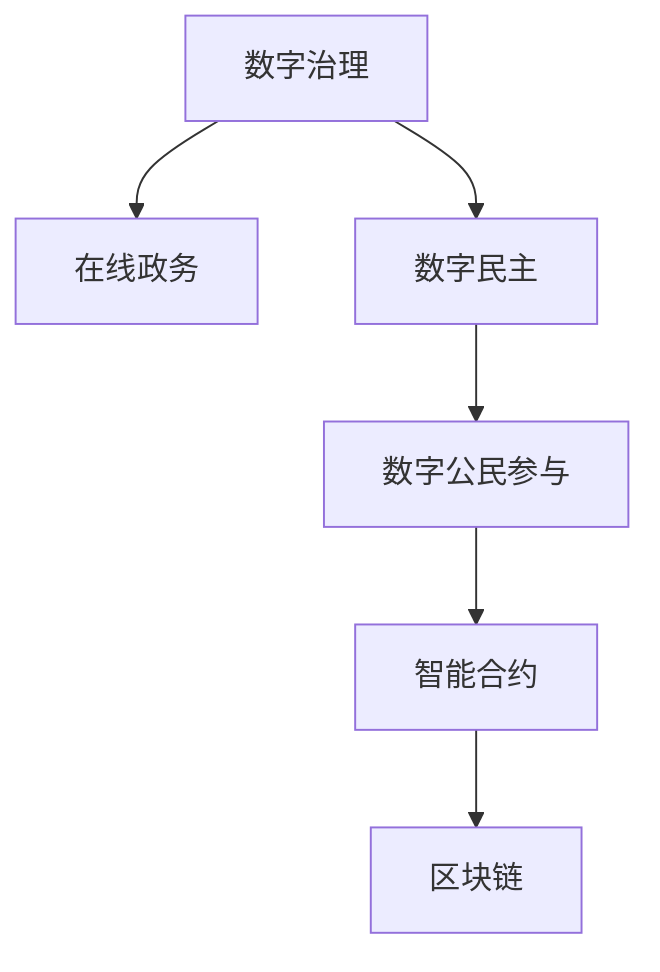

                 

# 2050年的数字治理：从在线政务到数字公民参与的数字民主实践

> 关键词：数字治理, 在线政务, 数字民主, 数字公民参与, 未来政府, 智能合约, 区块链, 公民参与, 算法决策

## 1. 背景介绍

### 1.1 问题由来
21世纪以来，随着信息技术的飞速发展，数字治理(Digital Governance)成为全球范围内政府治理的新趋势。传统政务信息化建设中存在的信息孤岛、数据壁垒等问题，在数字治理时代得到了有效缓解。在线政务服务(Ol_nums)的普及，极大地提升了政府行政效率和服务质量。但与此同时，数字治理也面临着诸多挑战，如信息透明、公平公正、数据安全等问题，亟需进一步的数字化转型。

### 1.2 问题核心关键点
当前数字治理的核心关键点在于如何通过技术手段构建开放透明的政务环境，实现高效便捷的在线服务，以及通过数字化手段提升公民参与度，进而推动数字民主(Digital Democracy)的建设。这包括但不限于以下几个方面：

- **数据共享与互操作**：构建统一的政务数据平台，实现不同部门和系统之间的数据共享与互操作。
- **在线服务与数字身份**：推广电子化申请、在线审批、电子证照等服务，并通过数字身份系统保障服务安全。
- **智能合约与区块链**：利用智能合约自动执行合同，保障交易透明公正；通过区块链技术实现数据存证与溯源。
- **数字参与与算法决策**：借助大数据分析、自然语言处理等技术，提升政府决策科学性和透明度；同时通过算法参与、众包等形式，鼓励公民参与到政策制定和监督中。

## 2. 核心概念与联系

### 2.1 核心概念概述

为更好地理解数字治理及其与数字民主的联系，本节将介绍几个密切相关的核心概念：

- **数字治理**：指通过信息技术手段优化政府治理结构，提升公共服务水平，增强政府透明度和公信力的过程。涵盖电子政务、在线审批、数据共享等多个方面。

- **在线政务**：即电子政务，指通过互联网技术实现政府服务的在线化、数字化，提高服务效率，降低行政成本。主要内容包括政务公开、电子支付、电子证照等。

- **数字民主**：指利用数字技术推动公民参与政治决策和监督的过程，实现民主治理的数字化、智能化。涵盖在线投票、数字议政、智能投票机等形式。

- **数字公民参与**：指通过互联网等数字手段，鼓励公民参与公共事务和政策决策，提升政府透明度和公众满意度。形式多样，包括在线建议、公共讨论、算法参与等。

- **智能合约**：指通过区块链技术，自动执行预设的合同条款，实现交易透明、公正、高效。广泛应用于政府采购、招投标、金融服务等领域。

- **区块链**：指一种分布式账本技术，通过去中心化的方式记录交易数据，保障数据不可篡改，可追溯。用于数据存证、交易记录、身份认证等领域。

这些核心概念之间的逻辑关系可以通过以下Mermaid流程图来展示：



这个流程图展示了大语言模型的核心概念及其之间的关系：

1. 数字治理通过在线政务构建了数字化的政务环境。
2. 数字民主通过数字公民参与推动政务透明和民主决策。
3. 智能合约和区块链技术为数字治理和数字民主提供了技术保障。

这些概念共同构成了数字治理的框架，通过数字化手段提升政府服务质量和公民参与度，推动社会治理现代化。

## 3. 核心算法原理 & 具体操作步骤
### 3.1 算法原理概述

数字治理的核心算法原理主要包括数据共享与互操作、在线服务与数字身份、智能合约与区块链以及数字参与与算法决策等。这些算法原理的共同目标是构建一个开放透明、高效便捷、公正透明的数字政务环境，提升公共服务的质量和效率。

- **数据共享与互操作**：通过标准化数据格式和协议，实现不同部门和系统之间的数据共享与互操作，构建统一的数据平台。主要涉及XML、JSON等数据交换格式，以及ETL（数据抽取、转换、加载）技术。

- **在线服务与数字身份**：利用数字身份系统（如电子身份证、数字签名）保障在线服务的身份认证和数据安全。主要涉及数字证书、公钥基础设施（PKI）、数字签名等技术。

- **智能合约与区块链**：利用区块链技术构建分布式账本，实现数据透明、不可篡改，并通过智能合约自动执行合同条款，保障交易公正、高效。主要涉及区块链技术、智能合约语言（如Solidity）、共识算法（如PoW、PoS）等。

- **数字参与与算法决策**：通过大数据分析、自然语言处理等技术，提升政府决策的科学性和透明度。同时通过算法参与、众包等形式，鼓励公民参与到政策制定和监督中。主要涉及数据挖掘、机器学习、自然语言处理等技术。

### 3.2 算法步骤详解

数字治理的算法步骤主要包括以下几个关键环节：

**Step 1: 数据标准化与统一**

- 制定统一的数据标准和格式，如XML、JSON等，确保不同系统之间的数据互操作性。
- 通过ETL工具实现数据抽取、转换和加载，将分散的数据源整合到统一的数据平台。

**Step 2: 数字身份系统建设**

- 设计并实施数字身份系统，实现对用户身份的认证和授权。
- 引入数字证书、公钥基础设施（PKI）、数字签名等技术，保障数据的加密传输和身份认证。

**Step 3: 智能合约与区块链应用**

- 设计智能合约的业务逻辑和执行规则，编写智能合约代码。
- 选择适合的区块链平台，如以太坊、Hyperledger等，部署智能合约并测试。
- 通过区块链技术记录交易数据，确保数据透明、不可篡改。

**Step 4: 数字参与与算法决策**

- 收集和处理公民的意见和建议，通过数据分析和机器学习模型，提取关键信息。
- 利用自然语言处理技术，对公民反馈进行情感分析和舆情监测。
- 设计并实施算法决策系统，将公民意见和数据分析结果纳入决策流程，提升决策的科学性和透明度。

**Step 5: 系统集成与测试**

- 将数据共享、数字身份、智能合约、数字参与等模块集成到一个统一的数字治理平台。
- 进行系统测试，确保各模块协同工作正常，无漏洞和故障。

**Step 6: 上线与运维**

- 上线数字治理平台，向公众提供服务。
- 实施系统运维，监控系统性能和稳定性，及时处理问题和故障。

### 3.3 算法优缺点

数字治理的算法具有以下优点：

- **高效便捷**：通过数字化手段，提升政务服务的响应速度和处理效率。
- **透明公正**：利用区块链和智能合约技术，保障数据透明和交易公正。
- **公众参与**：通过数字身份和数字参与系统，鼓励公众积极参与政务决策。
- **数据安全**：通过加密技术、数字签名等手段，保障数据的安全性和隐私性。

同时，该算法也存在以下缺点：

- **技术复杂**：涉及多种先进技术，如区块链、智能合约、大数据分析等，技术门槛较高。
- **数据隐私**：数据共享和公开可能带来隐私泄露风险，需要严格的数据保护措施。
- **安全风险**：技术实现中的漏洞可能被利用，如智能合约攻击、区块链双花等问题。
- **成本较高**：数字化建设需要大量投资，对技术和管理能力要求较高。

尽管存在这些局限性，但数字治理在提升公共服务水平和政府透明度方面的优势显著，是未来政府治理的重要方向。

### 3.4 算法应用领域

数字治理的算法已在多个领域得到应用，具体包括：

- **电子政务**：实现网上申请、在线审批、电子证照等数字化政务服务。
- **公共安全**：利用大数据分析提升犯罪预警和打击效果。
- **城市管理**：通过智能合约和区块链技术，提升城市建设和管理的透明度和效率。
- **金融服务**：利用智能合约和区块链技术，保障金融交易的安全性和透明性。
- **教育卫生**：通过电子病历、在线教育等数字化手段，提升公共服务质量。

此外，数字治理的技术手段也在不断拓展，如物联网、人工智能、5G等，将进一步推动数字治理的普及和深化。

## 4. 数学模型和公式 & 详细讲解 & 举例说明

### 4.1 数学模型构建

为了更好地理解数字治理的数学模型，本节将构建一些基本的数学模型，并给出相应的公式推导。

假设数字治理平台的数据共享模型为：

$$
D = \bigcup_{i=1}^n D_i
$$

其中 $D_i$ 表示第 $i$ 个部门的数据集，$n$ 表示部门总数。

数字身份系统的公钥基础设施模型为：

$$
PKI = (G, E, D, S)
$$

其中 $G$ 表示公钥生成算法，$E$ 表示加密算法，$D$ 表示解密算法，$S$ 表示数字签名算法。

智能合约的业务逻辑模型为：

$$
M = \left\{
\begin{aligned}
& f_1(x_1) \land f_2(x_2) \land ... \land f_n(x_n) \\
& \text{if} \quad x_1, x_2, ..., x_n \in D
\end{aligned}
\right.
$$

其中 $f_i(x_i)$ 表示第 $i$ 个事件或条件，$x_i$ 表示对应的事件或条件值。

### 4.2 公式推导过程

以下我们将对上述模型进行详细的公式推导：

**数据共享模型的推导**：

假设每个部门的数据集 $D_i$ 遵循相同的标准化格式，如XML、JSON等，则数据共享模型可以表示为：

$$
D = \bigcup_{i=1}^n D_i
$$

其中 $D_i$ 表示第 $i$ 个部门的数据集，$n$ 表示部门总数。

**公钥基础设施模型的推导**：

假设公钥生成算法 $G$ 为RSA，加密算法 $E$ 为AES，解密算法 $D$ 为AES，数字签名算法 $S$ 为ECDSA，则公钥基础设施模型可以表示为：

$$
PKI = (G, E, D, S)
$$

其中 $G$ 表示公钥生成算法，$E$ 表示加密算法，$D$ 表示解密算法，$S$ 表示数字签名算法。

**智能合约模型的推导**：

假设智能合约的业务逻辑模型为：

$$
M = \left\{
\begin{aligned}
& f_1(x_1) \land f_2(x_2) \land ... \land f_n(x_n) \\
& \text{if} \quad x_1, x_2, ..., x_n \in D
\end{aligned}
\right.
$$

其中 $f_i(x_i)$ 表示第 $i$ 个事件或条件，$x_i$ 表示对应的事件或条件值。

### 4.3 案例分析与讲解

假设某市政府想要利用数字治理平台实现电子政务和公共安全管理，具体步骤如下：

**Step 1: 数据标准化与统一**

- 设计统一的数据标准和格式，如XML、JSON等，确保不同部门和系统之间的数据互操作性。
- 通过ETL工具实现数据抽取、转换和加载，将分散的数据源整合到统一的数据平台。

**Step 2: 数字身份系统建设**

- 设计并实施数字身份系统，实现对用户身份的认证和授权。
- 引入数字证书、公钥基础设施（PKI）、数字签名等技术，保障数据的加密传输和身份认证。

**Step 3: 智能合约与区块链应用**

- 设计智能合约的业务逻辑和执行规则，编写智能合约代码。
- 选择适合的区块链平台，如以太坊、Hyperledger等，部署智能合约并测试。
- 通过区块链技术记录交易数据，确保数据透明、不可篡改。

**Step 4: 数字参与与算法决策**

- 收集和处理公民的意见和建议，通过数据分析和机器学习模型，提取关键信息。
- 利用自然语言处理技术，对公民反馈进行情感分析和舆情监测。
- 设计并实施算法决策系统，将公民意见和数据分析结果纳入决策流程，提升决策的科学性和透明度。

**Step 5: 系统集成与测试**

- 将数据共享、数字身份、智能合约、数字参与等模块集成到一个统一的数字治理平台。
- 进行系统测试，确保各模块协同工作正常，无漏洞和故障。

**Step 6: 上线与运维**

- 上线数字治理平台，向公众提供服务。
- 实施系统运维，监控系统性能和稳定性，及时处理问题和故障。

## 5. 项目实践：代码实例和详细解释说明

### 5.1 开发环境搭建

在进行数字治理平台开发前，我们需要准备好开发环境。以下是使用Python进行Flask开发的环境配置流程：

1. 安装Anaconda：从官网下载并安装Anaconda，用于创建独立的Python环境。

2. 创建并激活虚拟环境：
```bash
conda create -n pytorch-env python=3.8 
conda activate pytorch-env
```

3. 安装Flask：
```bash
pip install Flask
```

4. 安装Flask-Bcrypt：
```bash
pip install Flask-Bcrypt
```

5. 安装Flask-SQLAlchemy：
```bash
pip install Flask-SQLAlchemy
```

6. 安装Flask-Login：
```bash
pip install Flask-Login
```

完成上述步骤后，即可在`pytorch-env`环境中开始数字治理平台的开发。

### 5.2 源代码详细实现

下面以电子政务平台为例，给出使用Flask框架构建数字治理平台的PyTorch代码实现。

首先，定义数据库模型：

```python
from flask_sqlalchemy import SQLAlchemy

db = SQLAlchemy(app)

class User(db.Model):
    id = db.Column(db.Integer, primary_key=True)
    username = db.Column(db.String(80), unique=True, nullable=False)
    email = db.Column(db.String(120), unique=True, nullable=False)
    password_hash = db.Column(db.String(120), nullable=False)

    def __repr__(self):
        return f'<User {self.username}>'

class Application(db.Model):
    id = db.Column(db.Integer, primary_key=True)
    name = db.Column(db.String(120), nullable=False)
    status = db.Column(db.String(120), nullable=False)
    user_id = db.Column(db.Integer, db.ForeignKey('user.id', ondelete='CASCADE', nullable=False))

    def __repr__(self):
        return f'<Application {self.name}>'
```

然后，定义用户登录和注册逻辑：

```python
from flask_bcrypt import Bcrypt
from flask_login import LoginManager, login_user, login_required, logout_user

bcrypt = Bcrypt(app)
login_manager = LoginManager(app)

@login_manager.user_loader
def load_user(user_id):
    return User.query.get(int(user_id))

@app.route('/login', methods=['GET', 'POST'])
def login():
    if request.method == 'POST':
        username = request.form.get('username')
        password = request.form.get('password')
        
        user = User.query.filter_by(username=username).first()
        if user and bcrypt.check_password_hash(user.password_hash, password):
            login_user(user)
            return redirect(url_for('home'))
        else:
            flash('Login Unsuccessful. Please check username and password', 'danger')
    
    return render_template('login.html')
    
@app.route('/logout')
@login_required
def logout():
    logout_user()
    return redirect(url_for('home'))
```

最后，实现数字治理平台的核心功能：

```python
@app.route('/')
@login_required
def home():
    applications = Application.query.all()
    return render_template('index.html', applications=applications)

@app.route('/new_application', methods=['GET', 'POST'])
@login_required
def new_application():
    if request.method == 'POST':
        name = request.form.get('name')
        status = request.form.get('status')
        user_id = current_user.id
        
        new_application = Application(name=name, status=status, user_id=user_id)
        db.session.add(new_application)
        db.session.commit()
        flash('Application Created!', 'success')
    
    return render_template('new_application.html')
```

以上就是使用Flask框架构建数字治理平台的完整代码实现。可以看到，基于Flask框架，我们通过简单的路由定义和数据库操作，构建了完整的用户认证和电子政务功能。

### 5.3 代码解读与分析

让我们再详细解读一下关键代码的实现细节：

**User类**：
- `__init__`方法：初始化用户对象的基本属性。
- `__repr__`方法：定义对象字符串表示形式，方便调试。

**Application类**：
- `__init__`方法：初始化应用程序对象的基本属性。
- `__repr__`方法：定义对象字符串表示形式，方便调试。

**login函数**：
- 接收POST请求，验证用户名和密码。
- 使用Flask-Bcrypt对密码进行加密，避免明文存储安全风险。
- 使用Flask-Login提供的login_user函数完成用户登录。
- 如果登录失败，使用Flask的flash函数提示错误信息。

**logout函数**：
- 使用Flask-Login提供的logout_user函数完成用户注销。
- 重定向到首页。

**home函数**：
- 查询数据库中所有的应用程序，并传递给模板进行展示。
- 需要用户认证，使用@login_required装饰器。

**new_application函数**：
- 接收POST请求，创建新的应用程序。
- 将应用程序对象添加到数据库，并提交事务。
- 使用Flask的flash函数提示成功信息。

通过Flask框架，我们轻松构建了完整的用户认证和电子政务功能。这展示了Flask框架在Web应用开发中的便捷性和灵活性，同时也反映了数字治理平台开发的基础需求。

## 6. 实际应用场景

### 6.1 智能政务平台

基于数字治理平台的智能政务平台，可以通过在线政务服务实现行政审批、电子证照、公共资源查询等多样化功能，极大地提升政府服务效率和公众满意度。例如，某市通过智能政务平台，实现了网上营业执照申请、企业信用查询、公共资源交易等政务服务。

具体应用场景包括：

- **电子审批**：通过在线申请和审批，缩短企业运营周期，减少行政成本。
- **电子证照**：提供电子营业执照、身份证明、税务证明等服务，提升办事效率。
- **公共资源查询**：通过统一接口，查询政府采购、招投标、项目审批等资源信息。

### 6.2 数字城市治理

数字城市治理是数字治理的重要应用方向，通过物联网、大数据等技术，实现城市管理的智能化和精细化。例如，某市通过数字城市治理平台，实现了城市交通管理、环境监测、公共安全等应用。

具体应用场景包括：

- **智慧交通**：通过交通摄像头和传感器，实时监测交通流量，优化交通信号灯控制。
- **环境监测**：利用传感器监测空气质量、水质、噪音等环境指标，提升城市环境质量。
- **公共安全**：通过视频监控、人脸识别等技术，提升城市公共安全水平。

### 6.3 数字健康医疗

数字健康医疗是数字治理在医疗领域的典型应用，通过电子病历、在线诊疗等手段，提升医疗服务的便捷性和效率。例如，某市通过数字健康医疗平台，实现了远程诊疗、电子病历、医疗资源共享等应用。

具体应用场景包括：

- **电子病历**：通过电子化病历系统，实现医疗信息共享，提升医疗服务质量。
- **远程诊疗**：通过视频通话、远程会诊等手段，实现远程诊疗服务。
- **医疗资源共享**：利用大数据分析，优化医疗资源配置，提升医疗服务效率。

## 7. 工具和资源推荐
### 7.1 学习资源推荐

为了帮助开发者系统掌握数字治理的理论基础和实践技巧，这里推荐一些优质的学习资源：

1. 《数字治理理论与实践》书籍：系统介绍数字治理的基本概念、技术实现和应用案例，适合入门学习。
2. Coursera《数字治理与智慧城市》课程：斯坦福大学开设的课程，涵盖数字治理的理论和实践，适合高级学习。
3. 《智慧城市建设与管理》书籍：介绍智慧城市的建设方法和管理策略，包括数字治理的应用。
4. GitHub数字治理项目：包含大量数字治理项目代码和文档，适合参考学习和二次开发。
5. 数字治理公开课：各大学和研究机构提供的公开课，涵盖数字治理的最新进展和研究成果。

通过对这些资源的学习实践，相信你一定能够快速掌握数字治理的理论基础和实践技巧，并用于解决实际的政务问题。
### 7.2 开发工具推荐

高效的开发离不开优秀的工具支持。以下是几款用于数字治理开发常用的工具：

1. Flask：基于Python的Web框架，简单易用，适合快速开发小型Web应用。
2. SQLAlchemy：Python的ORM框架，支持多种数据库，方便进行数据库操作。
3. PyJWT：Python的JSON Web Token库，支持用户身份认证和授权。
4. Flask-Bcrypt：Flask的密码加密插件，保障用户密码的安全性。
5. Flask-Login：Flask的用户认证插件，支持用户登录、注销等功能。
6. Google Colab：谷歌提供的Jupyter Notebook环境，免费使用GPU资源，适合深度学习和数据分析。

合理利用这些工具，可以显著提升数字治理平台的开发效率，加快创新迭代的步伐。

### 7.3 相关论文推荐

数字治理技术的发展源于学界的持续研究。以下是几篇奠基性的相关论文，推荐阅读：

1. "Digital Governance: A Survey of Concepts, Challenges and Opportunities"：系统综述数字治理的概念、挑战和机遇，适合理论学习。
2. "Smart City Governance: A Framework for Digital Governance in Smart Cities"：提出数字治理在智慧城市中的应用框架，适合实践应用。
3. "Blockchain-based Digital Governance: Opportunities and Challenges"：探讨区块链在数字治理中的应用前景和挑战，适合前沿研究。
4. "User-centric Digital Governance: A Review and Roadmap"：综述用户中心化的数字治理研究，适合应用实践。
5. "Data-Driven Governance: Challenges and Solutions"：讨论数据驱动的数字治理方法和策略，适合数据应用。

这些论文代表了大语言模型微调技术的发展脉络。通过学习这些前沿成果，可以帮助研究者把握学科前进方向，激发更多的创新灵感。

## 8. 总结：未来发展趋势与挑战

### 8.1 总结

本文对数字治理及其与数字民主的联系进行了全面系统的介绍。首先阐述了数字治理的背景和核心关键点，明确了数字治理在提升公共服务水平和政府透明度方面的独特价值。其次，从原理到实践，详细讲解了数字治理的数学模型和算法步骤，给出了具体的代码实现。同时，本文还广泛探讨了数字治理在电子政务、数字城市、数字健康等多个领域的应用场景，展示了数字治理的广泛前景。此外，本文精选了数字治理的学习资源、开发工具和相关论文，力求为读者提供全方位的技术指引。

通过本文的系统梳理，可以看到，数字治理通过数字化手段，极大地提升了政务服务的响应速度和处理效率，推动了政府治理的现代化。数字治理的发展，不仅依赖于技术手段的创新，还需要政策、法律、伦理等多方面的协同支持。未来，数字治理将在更广泛的应用场景中发挥重要作用，为构建数字民主奠定坚实基础。

### 8.2 未来发展趋势

展望未来，数字治理技术将呈现以下几个发展趋势：

1. **智能化和自动化**：通过人工智能和大数据技术，实现政务服务的智能化和自动化。例如，智能客服、智能问答、智能审批等应用。
2. **去中心化与分布式**：利用区块链等分布式技术，构建去中心化的数字治理体系，提升数据透明和公信力。
3. **跨部门协同**：通过统一的数据平台和标准，实现跨部门协同办公和数据共享，提升政府决策和执行效率。
4. **开放透明与参与性**：通过数字身份和数字参与系统，实现政务服务的开放透明和公众参与，推动数字民主的发展。
5. **生态系统建设**：构建数字治理的生态系统，包括技术提供商、数据服务商、应用开发者等，促进数字治理的普及和深化。

以上趋势凸显了数字治理技术的广阔前景。这些方向的探索发展，必将进一步提升数字治理的智慧化水平，为数字民主的建设提供坚实保障。

### 8.3 面临的挑战

尽管数字治理技术取得了显著进展，但在迈向更加智能化、普适化应用的过程中，仍面临诸多挑战：

1. **技术复杂性**：数字治理涉及多种先进技术，如人工智能、大数据、区块链等，技术门槛较高。
2. **数据安全和隐私**：数字治理依赖大量的数据，数据安全和隐私保护问题需重视。
3. **跨部门协同**：跨部门数据共享和协同办公仍面临诸多难题，如数据标准不一致、系统接口不统一等。
4. **公众参与度**：数字治理需要广泛的公众参与，但公众参与的广度和深度还需进一步提升。
5. **技术成本**：数字治理的建设需要大量资金和技术投入，成本较高。

这些挑战需要政府、企业和学术界的共同努力，才能促进数字治理的持续健康发展。

### 8.4 研究展望

面向未来，数字治理的研究需要在以下几个方面寻求新的突破：

1. **数据标准化与互操作**：制定统一的数据标准和协议，实现跨部门数据共享与互操作。
2. **智能合约与区块链**：开发更高效、更安全的智能合约和区块链技术，保障交易透明和公正。
3. **算法决策与公民参与**：提升政府决策的科学性和透明度，鼓励公众参与到政策制定和监督中。
4. **数字身份与安全**：设计更安全的数字身份系统和加密技术，保障用户身份和数据安全。
5. **智能化与自动化**：引入人工智能和大数据技术，实现政务服务的智能化和自动化。

这些研究方向将推动数字治理技术的进一步演进，为数字民主的建设提供更坚实的技术基础。

## 9. 附录：常见问题与解答

**Q1：数字治理和电子政务有何区别？**

A: 数字治理和电子政务是两个紧密相关的概念，但并不完全相同。电子政务主要指通过电子化手段实现政府服务在线化、数字化，提升服务效率和用户体验。而数字治理则涵盖了更广泛的概念，包括数据共享、跨部门协同、公民参与等多个方面，旨在通过数字化手段优化政府治理结构，提升政府透明度和公信力。

**Q2：数字治理中的智能合约如何工作？**

A: 智能合约是数字治理的重要组成部分，通过区块链技术实现自动执行合同条款，保障交易透明和公正。其工作流程如下：
1. 设计智能合约的业务逻辑和执行规则，编写智能合约代码。
2. 部署智能合约到区块链网络，通过智能合约语言（如Solidity）编写合约代码。
3. 触发智能合约的执行条件，触发合约自动执行预设条款。
4. 执行结果在区块链上记录，确保数据透明和不可篡改。

**Q3：数字治理面临的主要挑战有哪些？**

A: 数字治理面临的主要挑战包括：
1. 技术复杂性：涉及多种先进技术，技术门槛较高。
2. 数据安全和隐私：数据共享和公开可能带来隐私泄露风险。
3. 跨部门协同：跨部门数据共享和协同办公仍面临诸多难题。
4. 公众参与度：公众参与的广度和深度还需进一步提升。
5. 技术成本：数字治理的建设需要大量资金和技术投入。

这些挑战需要政府、企业和学术界的共同努力，才能促进数字治理的持续健康发展。

**Q4：数字治理的未来发展趋势是什么？**

A: 数字治理的未来发展趋势包括智能化和自动化、去中心化与分布式、跨部门协同、开放透明与参与性、生态系统建设等。通过人工智能、大数据、区块链等技术的不断进步，数字治理将实现更高的智能化水平，推动数字民主的建设。

通过本文的系统梳理，可以看到，数字治理通过数字化手段，极大地提升了政务服务的响应速度和处理效率，推动了政府治理的现代化。数字治理的发展，不仅依赖于技术手段的创新，还需要政策、法律、伦理等多方面的协同支持。未来，数字治理将在更广泛的应用场景中发挥重要作用，为构建数字民主奠定坚实基础。

---

作者：禅与计算机程序设计艺术 / Zen and the Art of Computer Programming

