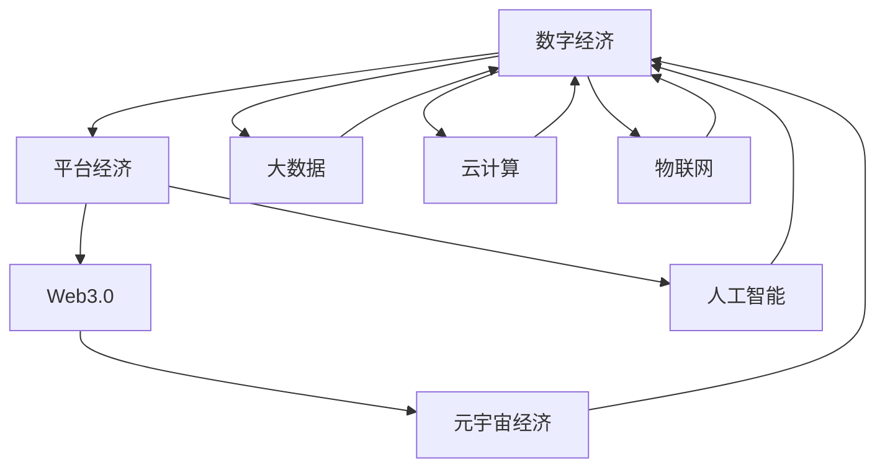

                 

# 2050年的数字经济：从平台经济到元宇宙经济的数字经济形态演进

## 1. 背景介绍

在数字化转型的浪潮下，全球经济正在经历从平台经济向元宇宙经济的转变。从20世纪末互联网经济兴起，到21世纪初社交媒体、电子商务、金融科技等平台的繁荣，再到未来元宇宙时代的全面到来，数字经济的结构和形态将发生翻天覆地的变化。本文将探讨2050年数字经济的演进轨迹，分析其内在逻辑和驱动因素，并对未来发展趋势进行展望。

### 1.1 数字经济的兴起与演进

数字经济最初源于互联网技术的商业化应用，如电子商务、在线广告、社交网络等。进入21世纪，数字经济逐渐从消费领域拓展到生产领域，涌现出大数据、云计算、物联网、人工智能等新产业。随着技术的不断发展，数字经济开始向产业互联网方向迈进，通过平台经济实现了企业间、产业间的协同和共享。

### 1.2 平台经济的特征与发展

平台经济的核心在于构建一个连接供需双方的交易平台，通过聚合资源和提供技术支持，实现资源的有效配置。20世纪末到21世纪初，互联网平台如亚马逊、谷歌、阿里巴巴等迅速崛起，引领了平台经济的繁荣。平台经济不仅优化了资源配置，还推动了创新和创业，促进了经济的全球化。

## 2. 核心概念与联系

### 2.1 核心概念概述

为了更好地理解2050年数字经济的演进，我们需要明确几个核心概念：

- **数字经济**：基于信息技术和数字技术，以数字化方式改造传统经济结构，提升经济运行效率和创新能力。

- **平台经济**：通过构建数字平台，聚合资源、提供服务，连接供需双方，实现资源的优化配置和价值创造。

- **元宇宙经济**：基于虚拟现实、增强现实、区块链等技术，构建一个虚拟世界，实现人机交互、经济活动和社交关系的数字化。

- **Web3.0**：新一代互联网，以区块链、智能合约等技术为核心，强调数据的开放、共享和可信，推动去中心化的经济活动和治理。

- **人工智能**：利用算法和大数据，实现自主学习、智能决策，提升经济活动效率和创造力。

这些核心概念构成了数字经济从平台经济向元宇宙经济演进的基础，它们的相互关系和互动，将推动数字经济的发展。

### 2.2 核心概念原理和架构的 Mermaid 流程图



## 3. 核心算法原理 & 具体操作步骤

### 3.1 算法原理概述

数字经济的演进，本质上是技术驱动的资源配置和价值创造过程。平台经济通过对资源的聚合和优化配置，实现了高效率的价值创造。而元宇宙经济则通过虚拟世界的构建，拓展了价值创造的新空间。

数字经济的核心算法包括：

- **云计算**：通过分布式计算和存储，实现资源的高效管理和弹性伸缩，支持海量数据的存储和处理。
- **大数据**：利用数据分析技术，从海量数据中提取有用信息，支持决策和优化。
- **人工智能**：通过深度学习和智能算法，实现自主学习和智能决策，提升经济活动的效率和创新能力。
- **区块链**：通过去中心化的技术，实现数据透明和可信，推动去中心化的经济活动和治理。

### 3.2 算法步骤详解

数字经济演进的具体步骤包括：

1. **数据驱动**：通过大数据和云计算技术，采集、存储和分析海量数据，为经济活动提供数据支撑。

2. **算法优化**：利用人工智能和机器学习算法，优化资源配置和价值创造，提升经济活动的效率和创新能力。

3. **平台构建**：通过构建数字平台，连接供需双方，实现资源的优化配置和价值创造。

4. **去中心化**：引入区块链技术，实现数据透明和可信，推动去中心化的经济活动和治理。

5. **虚拟经济**：构建虚拟世界，拓展经济活动的空间，实现新的价值创造。

### 3.3 算法优缺点

数字经济演进的算法具有以下优点：

- **高效性**：通过云计算和大数据技术，实现资源的高效管理和优化配置，提升经济活动的效率。
- **智能化**：利用人工智能和机器学习算法，提升决策和优化能力，推动经济活动的创新。
- **透明性**：引入区块链技术，实现数据透明和可信，增强经济活动的透明度和安全性。

同时，也存在以下缺点：

- **依赖性强**：数字经济高度依赖技术基础设施，技术中断或数据安全问题可能导致经济活动中断。
- **复杂性高**：数字经济涉及多个技术领域，技术融合和协同难度大。
- **伦理风险**：数字经济中的隐私保护、数据安全等问题，可能引发伦理风险。

### 3.4 算法应用领域

数字经济演进的算法已广泛应用于多个领域，包括：

- **金融科技**：通过大数据、云计算和区块链技术，实现金融服务的数字化、智能化和去中心化。
- **零售电商**：利用大数据和人工智能技术，优化供应链管理和客户体验，提升销售额和客户满意度。
- **医疗健康**：通过云计算和大数据技术，实现医疗数据的共享和分析，推动精准医疗和健康管理。
- **制造业**：通过物联网和人工智能技术，实现智能制造和柔性生产，提升生产效率和产品质量。
- **农业**：利用大数据和云计算技术，优化农业生产和管理，提升农产品的产量和质量。

## 4. 数学模型和公式 & 详细讲解 & 举例说明

### 4.1 数学模型构建

数字经济演进的核心数学模型包括：

- **线性回归模型**：用于描述经济活动中变量之间的关系，如价格和需求的关系。
- **聚类分析模型**：用于将数据进行分组，发现数据中的隐藏模式，如市场细分和客户群体分析。
- **优化模型**：用于优化资源配置，提升经济活动的效率，如供应链优化和智能调度。

### 4.2 公式推导过程

以线性回归模型为例，公式推导如下：

$$
y = \beta_0 + \beta_1x_1 + \beta_2x_2 + \ldots + \beta_nx_n + \epsilon
$$

其中，$y$ 为因变量，$\beta_0, \beta_1, \beta_2, \ldots, \beta_n$ 为回归系数，$x_1, x_2, \ldots, x_n$ 为自变量，$\epsilon$ 为误差项。

### 4.3 案例分析与讲解

假设我们有一个电商平台，通过收集用户的购买数据和浏览数据，建立线性回归模型，用于预测用户的购买行为。模型的公式如下：

$$
\hat{y} = \beta_0 + \beta_1x_1 + \beta_2x_2 + \ldots + \beta_nx_n
$$

其中，$x_1, x_2, \ldots, x_n$ 分别代表用户的浏览时长、浏览品类、浏览次数等特征，$\hat{y}$ 为预测的用户购买量。通过训练模型，可以发现不同特征对用户购买行为的影响，从而优化电商平台的用户体验和营销策略。

## 5. 项目实践：代码实例和详细解释说明

### 5.1 开发环境搭建

要进行数字经济演进的相关实践，需要搭建好Python开发环境。以下是Python开发环境的搭建步骤：

1. 安装Python：从官网下载并安装Python，建议使用3.8及以上版本。
2. 安装Anaconda：从官网下载并安装Anaconda，用于创建独立的Python环境。
3. 创建虚拟环境：使用`conda create`命令，创建名为`digital-economy-env`的虚拟环境。
4. 激活虚拟环境：使用`conda activate digital-economy-env`命令，激活虚拟环境。

### 5.2 源代码详细实现

以下是一个简单的线性回归模型实现的Python代码示例：

```python
import numpy as np
from sklearn.linear_model import LinearRegression

# 构造数据
X = np.array([[1, 2, 3], [4, 5, 6], [7, 8, 9]])
y = np.array([10, 20, 30])

# 建立线性回归模型
model = LinearRegression().fit(X, y)

# 预测新数据
X_new = np.array([[1, 1, 1], [2, 2, 2]])
y_new = model.predict(X_new)
print(y_new)
```

### 5.3 代码解读与分析

**代码解读**：

1. 导入必要的库，包括Numpy和Scikit-learn的LinearRegression。
2. 构造训练数据集，包括自变量X和因变量y。
3. 建立线性回归模型，使用`fit`方法进行训练。
4. 使用训练好的模型，对新数据进行预测，使用`predict`方法。
5. 输出预测结果。

**代码分析**：

- **数据构造**：构造一个简单的训练数据集，包含自变量X和因变量y。
- **模型建立**：使用Scikit-learn的LinearRegression模型，训练模型参数。
- **数据预测**：使用训练好的模型，对新数据进行预测，得到预测结果。

## 6. 实际应用场景

### 6.1 金融科技

金融科技是数字经济的重要领域，通过大数据、云计算和区块链技术，实现了金融服务的数字化、智能化和去中心化。例如，智能投顾、智能合约、去中心化金融等应用，通过算法和数据驱动，提高了金融服务的效率和安全性。

### 6.2 零售电商

零售电商通过大数据和人工智能技术，优化了供应链管理和客户体验，提升了销售额和客户满意度。例如，电商平台的推荐系统、智能客服等应用，通过算法推荐和智能对话，提升了用户体验。

### 6.3 医疗健康

医疗健康领域通过云计算和大数据技术，实现了医疗数据的共享和分析，推动了精准医疗和健康管理。例如，电子病历、远程医疗等应用，通过数据共享和分析，提高了医疗服务的质量和效率。

### 6.4 制造业

制造业通过物联网和人工智能技术，实现了智能制造和柔性生产，提升了生产效率和产品质量。例如，智能工厂、智能仓储等应用，通过算法和数据驱动，优化了生产流程和资源配置。

### 6.5 农业

农业领域通过大数据和云计算技术，优化了农业生产和管理，提升了农产品的产量和质量。例如，精准农业、智能灌溉等应用，通过数据监测和分析，提高了农业生产的效率和收益。

## 7. 工具和资源推荐

### 7.1 学习资源推荐

为了帮助开发者掌握数字经济演进的技术，这里推荐一些优质的学习资源：

1. 《深度学习与人工智能》书籍：全面介绍了深度学习和人工智能的基本概念和技术。
2. 《Python数据科学手册》书籍：介绍了Python在数据科学中的应用，包括大数据、云计算和机器学习等。
3. Coursera《大数据与人工智能》课程：由斯坦福大学和MIT等名校开设，系统讲解了大数据和人工智能的基本概念和技术。
4. Kaggle数据科学竞赛平台：提供了大量的数据集和竞赛，可以锻炼数据科学和机器学习技能。

### 7.2 开发工具推荐

以下是几个用于数字经济演进开发的常用工具：

1. Python：作为数据科学和机器学习的主要语言，Python具有丰富的数据处理和分析库。
2. Jupyter Notebook：开源的交互式编程环境，支持数据科学和机器学习的开发和演示。
3. Scikit-learn：开源的机器学习库，提供了多种机器学习算法和工具。
4. TensorFlow和PyTorch：开源的深度学习框架，支持大规模神经网络的构建和训练。
5. Hadoop和Spark：开源的大数据处理平台，支持大规模数据处理和分析。

### 7.3 相关论文推荐

数字经济演进的相关论文，可以系统地了解技术的发展和前沿应用：

1. 《从平台经济到元宇宙经济：数字经济的演进轨迹》论文：深入分析了数字经济演进的内在逻辑和驱动因素。
2. 《数字经济中的平台效应》论文：分析了平台经济的特征和发展规律。
3. 《区块链技术在金融中的应用》论文：介绍了区块链技术在金融领域的应用和前景。
4. 《人工智能在医疗中的应用》论文：介绍了人工智能在医疗领域的最新进展和应用。
5. 《智能制造的现状与未来》论文：分析了智能制造的现状和未来发展趋势。

## 8. 总结：未来发展趋势与挑战

### 8.1 研究成果总结

本文对数字经济演进的背景和核心概念进行了详细分析，探讨了平台经济到元宇宙经济的发展路径，并给出了具体的算法原理和操作步骤。通过对案例的分析，展示了数字经济演进在金融科技、零售电商、医疗健康、制造业和农业等领域的实际应用。

### 8.2 未来发展趋势

展望未来，数字经济将呈现以下几个发展趋势：

1. **去中心化**：去中心化技术将进一步普及，推动数据透明和可信，提高经济活动的效率和安全性。
2. **智能化**：人工智能和大数据技术将进一步融合，推动经济活动的智能化和个性化，提升效率和创新能力。
3. **可持续发展**：数字经济将更加注重可持续发展，通过技术手段实现资源的高效利用和环境保护。
4. **全球化**：数字经济将推动经济全球化，促进各国之间的交流与合作，提升全球经济一体化水平。
5. **元宇宙经济**：虚拟经济将成为数字经济的重要组成部分，拓展经济活动的新空间，推动经济创新和增长。

### 8.3 面临的挑战

数字经济演进在取得巨大成就的同时，也面临着诸多挑战：

1. **技术复杂性**：数字经济涉及多个技术领域，技术融合和协同难度大，需要持续的技术创新和优化。
2. **隐私保护**：数据隐私和安全问题是数字经济的重要挑战，需要建立完善的数据保护机制和政策法规。
3. **伦理道德**：数字经济中的伦理道德问题，如隐私保护、数据安全、算法歧视等，需要引起高度重视。
4. **技术成本**：数字经济的初期投入和技术维护成本较高，需要政策支持和社会资本的投入。
5. **全球化挑战**：数字经济全球化进程中，各国之间的技术标准、政策法规不统一，需要加强国际合作和协调。

### 8.4 研究展望

面向未来，数字经济演进的研究方向包括：

1. **去中心化技术**：研究区块链、分布式账本等去中心化技术，推动数据透明和可信，提高经济活动的效率和安全性。
2. **人工智能应用**：研究人工智能技术在各个领域的应用，提升经济活动的智能化和个性化，推动经济创新和增长。
3. **可持续发展**：研究数字经济对环境和社会的影响，推动可持续发展技术的应用，实现资源的高效利用和环境保护。
4. **全球化合作**：加强国际合作和政策协调，推动数字经济全球化进程，促进各国之间的交流与合作。
5. **元宇宙经济**：研究虚拟经济的应用和前景，拓展经济活动的新空间，推动经济创新和增长。

## 9. 附录：常见问题与解答

### Q1：数字经济演进的本质是什么？

A: 数字经济演进的本质是通过技术手段，实现资源的优化配置和价值创造。平台经济和元宇宙经济是数字经济演进的两个重要阶段，它们通过聚合资源、提供服务，连接供需双方，实现资源的优化配置和价值创造。

### Q2：数字经济与传统经济有何不同？

A: 数字经济与传统经济的主要不同在于，数字经济是基于信息技术和数字技术，以数字化方式改造传统经济结构，提升经济运行效率和创新能力。数字经济的核心在于数据驱动和算法优化，通过数据和算法实现资源的优化配置和价值创造。

### Q3：数字经济演进的驱动因素有哪些？

A: 数字经济演进的驱动因素包括技术进步、市场需求、政策法规等。技术进步如云计算、大数据、人工智能、区块链等，提供了数字经济的基础设施和工具；市场需求如智能制造、精准医疗、金融科技等，推动了数字经济的应用和发展；政策法规如数据保护法、隐私保护政策等，保障了数字经济的可持续发展。

### Q4：数字经济演进的主要趋势有哪些？

A: 数字经济演进的主要趋势包括去中心化、智能化、可持续发展、全球化和元宇宙经济等。去中心化技术推动数据透明和可信，提升经济活动的效率和安全性；智能化和大数据技术推动经济活动的智能化和个性化，提升效率和创新能力；可持续发展技术实现资源的高效利用和环境保护；全球化推动各国之间的交流与合作；元宇宙经济拓展经济活动的新空间，推动经济创新和增长。

### Q5：数字经济演进面临的挑战有哪些？

A: 数字经济演进面临的挑战包括技术复杂性、隐私保护、伦理道德、技术成本和全球化挑战等。技术复杂性需要持续的技术创新和优化；隐私保护需要建立完善的数据保护机制和政策法规；伦理道德问题如隐私保护、数据安全、算法歧视等需要引起高度重视；技术成本较高，需要政策支持和社会资本的投入；全球化进程中，各国之间的技术标准、政策法规不统一，需要加强国际合作和协调。

---

作者：禅与计算机程序设计艺术 / Zen and the Art of Computer Programming

