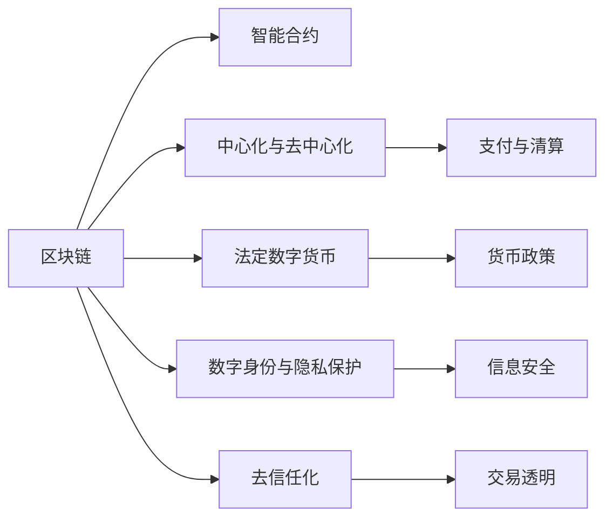

                 

# 2050年的数字货币：从法定数字货币到全球货币体系的重构

## 1. 背景介绍

### 1.1 数字货币的起源与演化

数字货币的诞生源于互联网时代，伴随着区块链技术的兴起，开始从虚拟世界扩展到现实经济中。比特币作为第一个成功的区块链应用，为数字货币的发展打开了大门。随着以太坊、EOS等智能合约平台的崛起，越来越多的加密货币和应用进入公众视野。

20世纪末，互联网的普及带来了新的支付和金融需求，传统银行和金融机构开始尝试电子支付系统，如PayPal、支付宝等。但这些系统受限于中心化的架构和支付网络的局限性，难以满足全球化和跨国的金融需求。

### 1.2 法定数字货币的崛起

法定数字货币（Central Bank Digital Currency, CBDC）是指由国家中央银行发行的数字货币，与传统货币一样，具有法律效力。近年来，多个国家开始探索CBDC的发行和应用，如中国央行推出的数字人民币(Digital Renminbi, DCEP)、瑞典的数字克朗(e-krona)等。CBDC作为中央银行的新型货币工具，有望带来金融体系的重大变革。

CBDC的发行对传统金融体系构成了严峻挑战。它可以大大降低支付和结算的成本，提高金融服务的普及率，但同时也可能对货币政策的执行、金融系统的稳定等带来新问题。

### 1.3 未来货币体系的展望

展望未来，数字货币将成为全球货币体系的重要组成部分。随着区块链、物联网、5G等技术的进一步发展，数字货币的应用将更加广泛，涵盖支付、交易、清算、存管等多个领域。未来货币体系将形成法定货币与数字货币并存的格局，实现支付便捷、交易透明、金融普惠的目标。

## 2. 核心概念与联系

### 2.1 核心概念概述

为更好地理解CBDC和未来数字货币体系的重构过程，本节将介绍几个核心概念：

- 区块链(Blockchain)：一种分布式账本技术，通过去中心化的共识机制，实现数据的不可篡改性和透明性。
- 智能合约(Smart Contract)：一种在区块链上自动执行、控制和管理复杂业务逻辑的编程合约。
- 中心化与去中心化(Centralization vs. Decentralization)：涉及金融系统中信息、权力、信任的分布情况。
- 法定数字货币(CBDC)：由国家中央银行发行的数字货币，具有法律效力。
- 数字身份与隐私保护(Identity & Privacy)：数字货币交易中需要身份认证，同时必须保护用户隐私。
- 去信任化(Trustless)：数字货币系统无需信任中介机构，通过密码学技术保证交易安全。

这些核心概念之间的逻辑关系可以通过以下Mermaid流程图来展示：



这个流程图展示了几大核心概念及其之间的关系：

1. 区块链技术为智能合约提供底层基础设施，支持去中心化交易和智能合约的执行。
2. 智能合约通过编程方式实现复杂的业务逻辑，保障交易的自动化和安全性。
3. 中心化与去中心化平衡了信息分布和信任关系，是金融系统设计的重要维度。
4. 法定数字货币是国家政策导向的数字货币，具有法律效力。
5. 数字身份和隐私保护是数字货币交易中需要解决的重要问题。
6. 去信任化通过密码学技术保证了交易的安全和透明。

这些概念共同构成了CBDC和未来数字货币体系的基础，推动着金融领域的技术创新和应用变革。

## 3. 核心算法原理 & 具体操作步骤

### 3.1 算法原理概述

法定数字货币的发行和应用过程，本质上是一个基于区块链的共识算法和交易验证过程。其核心算法包括以下几个关键部分：

- 共识算法(Consensus Algorithm)：在分布式网络中达成一致的共识机制。常见的共识算法包括PoW、PoS、DPoS等。
- 交易验证(Transaction Validation)：验证交易的有效性和合法性，确保资金安全。
- 智能合约执行(Smart Contract Execution)：自动执行和控制交易逻辑，提升交易效率。
- 隐私保护(Privacy Protection)：保护用户隐私，防止数据泄露。
- 货币政策(Currency Policy)：通过货币政策工具调控经济活动，维护金融稳定。

基于CBDC的数字货币体系重构过程，主要包括以下几个步骤：

1. 法定数字货币的设计与发行。根据国家货币政策和经济需要，设计法定数字货币的发行机制和流通规则。
2. 智能合约的编写与部署。根据业务需求，编写智能合约代码并部署到区块链上。
3. 区块链网络的搭建与管理。搭建和维护区块链网络，确保其安全、稳定和高效运行。
4. 法定数字货币的流通与监管。在法定数字货币的基础上，设计和实施货币政策的执行和管理机制。
5. 数字身份的建立与认证。为数字货币用户建立身份认证机制，保障交易安全。

### 3.2 算法步骤详解

#### 3.2.1 法定数字货币的设计与发行

法定数字货币的设计与发行是CBDC体系建设的关键环节，包括：

- 定义货币单位和数字资产形式。如数字人民币以元为单位，具有纸钞和硬币的电子形式。
- 确定发行机制和货币政策。如数字人民币由央行发行，货币政策由央行调控。
- 设计隐私保护机制。如数字人民币采用匿名支付机制，保障用户隐私。
- 实现货币政策的自动化调控。如通过智能合约自动触发货币政策的执行和调整。

#### 3.2.2 智能合约的编写与部署

智能合约的编写与部署是CBDC体系的核心技术支持，包括：

- 编写智能合约代码，实现复杂业务逻辑的自动化处理。
- 将智能合约部署到区块链网络，确保其可执行性和安全性。
- 设计交易执行机制，保障交易透明和效率。
- 实现跨链交互和互操作性，提升系统灵活性和适应性。

#### 3.2.3 区块链网络的搭建与管理

区块链网络的搭建与管理是CBDC体系的基础设施，包括：

- 选择适合的共识算法，保障网络的安全性和一致性。
- 设计网络的拓扑结构和节点部署策略，确保网络的高可用性和扩展性。
- 搭建区块链网络，部署智能合约和数据存储。
- 实施区块链网络的维护和优化，提升网络性能和稳定性。

#### 3.2.4 法定数字货币的流通与监管

法定数字货币的流通与监管是CBDC体系的关键应用场景，包括：

- 设计法定数字货币的流通机制，确保货币政策执行和金融监管。
- 实施货币政策的自动化调控，提升货币政策的效果和透明度。
- 建立数字货币的反洗钱和反恐融资机制，保障金融安全。
- 设计数字货币的监管框架，确保法律合规性和风险控制。

#### 3.2.5 数字身份的建立与认证

数字身份的建立与认证是CBDC体系的用户基础，包括：

- 设计数字身份的标准和认证机制，确保用户身份的合法性和可信度。
- 实现身份认证和授权管理，保障交易安全。
- 设计隐私保护机制，确保用户隐私不被泄露。
- 建立身份认证的跨机构互认机制，提升系统互通性和用户便利性。

### 3.3 算法优缺点

CBDC体系的设计和应用过程，具有以下优点：

- 降低支付和结算成本，提高金融服务的普及率。
- 增强货币政策的执行和调控能力，保障金融稳定。
- 提升系统的透明度和安全性，防止数据泄露和欺诈行为。
- 促进金融普惠，支持欠发达地区和偏远地区的发展。
- 实现跨机构互认和跨境支付，促进全球金融一体化。

同时，该体系也存在一些局限性：

- 对现有的银行体系构成冲击，可能引发金融不稳定性。
- 需要大量的技术投资和政策支持，实施难度较大。
- 缺乏统一的国际标准，可能引发监管和法律问题。
- 对隐私和数据保护提出了更高的要求，需要复杂的机制设计。
- 可能引发网络攻击和系统漏洞，需要强大的安全保障。

尽管存在这些局限性，但CBDC体系依然是未来数字货币体系的重要组成部分，对于实现金融普惠、提升金融透明度和效率具有重要意义。

### 3.4 算法应用领域

CBDC体系的应用领域非常广泛，涉及支付、交易、清算、存管等多个方面，包括：

- 电子支付：通过数字钱包实现实时支付和转账，提升支付效率和便捷性。
- 跨境支付：实现跨国的实时支付和清算，促进全球金融一体化。
- 贸易结算：通过智能合约自动执行贸易合同，提升交易效率和安全性。
- 企业融资：通过数字货币发行企业贷款，降低融资成本和风险。
- 公共服务：通过数字货币提供公共服务支付，提升服务效率和公平性。
- 社会福利：通过数字货币发放社会福利和补贴，提升福利分配的透明性和公平性。

CBDC体系的应用将覆盖金融系统的各个方面，为社会经济的发展注入新的动力。

## 4. 数学模型和公式 & 详细讲解 & 举例说明

### 4.1 数学模型构建

本节将使用数学语言对CBDC的设计和应用过程进行更加严格的刻画。

记法定数字货币为 $M_{\theta}$，其中 $\theta$ 为预训练得到的模型参数。给定CBDC系统的初始参数和流通机制，定义模型 $M_{\theta}$ 在每个交易时间步 $t$ 上的状态 $s_t$，输出 $o_t$，损失函数为 $L(s_t, o_t)$，则每个时间步上的模型更新过程为：

$$
s_{t+1} = f(s_t, o_t, \Delta t)
$$

$$
o_{t+1} = M_{\theta}(s_{t+1})
$$

$$
L = \sum_{t} \omega_t L(s_t, o_t)
$$

其中，$f$ 为系统状态更新函数，$\omega_t$ 为权重系数。

在模型更新过程中，每个时间步的系统状态 $s_t$ 代表当前货币流通和交易的状态，包括货币余额、交易流水、市场状况等。模型 $M_{\theta}$ 根据当前状态 $s_t$ 输出决策 $o_t$，如货币发行、交易执行、风险监控等。

### 4.2 公式推导过程

以下我们以数字人民币的发行和流通为例，推导法定数字货币的发行机制和货币政策的执行过程。

假设数字人民币的发行机制为固定比例发行，即每年发行 $N$ 数字人民币，比例为 $\alpha$，则发行机制的数学模型为：

$$
R_t = R_{t-1} + \alpha N
$$

其中 $R_t$ 为第 $t$ 年的数字人民币总量，$R_{t-1}$ 为上一年的数字人民币总量。

在数字人民币的流通过程中，设定货币政策为基于通货膨胀的目标调控，设定通货膨胀率为 $\beta$，则货币政策的数学模型为：

$$
C_t = C_{t-1} + \beta R_t
$$

其中 $C_t$ 为第 $t$ 年的通货膨胀率，$C_{t-1}$ 为上一年的通货膨胀率。

根据上述模型，可以建立数字人民币的发行和流通过程，通过智能合约和区块链技术实现货币政策的自动化调控和执行。

### 4.3 案例分析与讲解

以数字人民币的发行和流通为例，进一步讲解CBDC的数学模型和应用过程：

1. 数字人民币的发行机制：

```python
def calculate_issued_cny(rate, base_cny, period):
    total_cny = 0
    for _ in range(period):
        total_cny += rate * base_cny
    return total_cny
```

2. 货币政策的执行机制：

```python
def calculate_inflation_rate(rate, cny, period):
    inflation_rate = 0
    for _ in range(period):
        inflation_rate += rate * cny
    return inflation_rate
```

3. 基于智能合约的数字人民币流通：

```python
from ethers import Ethers
from ethers.integrations.web3 import Web3

def deploy_smart_contract(web3, address, rate, base_cny):
    contract = Ethers.SmartContract(deploy_bytes)
    contract.deployed = web3.eth.contract(address=address, abi=abi)
    return contract

def calculate_balance(contract, address, period):
    balance = 0
    for _ in range(period):
        balance += contract.call(func_name, args=[address]) * rate
    return balance
```

通过这些公式和代码，可以模拟数字人民币的发行、流通和货币政策的执行过程，进一步理解CBDC的设计和应用原理。

## 5. 项目实践：代码实例和详细解释说明

### 5.1 开发环境搭建

在进行CBDC项目实践前，我们需要准备好开发环境。以下是使用Python进行Ethers开发的环境配置流程：

1. 安装Anaconda：从官网下载并安装Anaconda，用于创建独立的Python环境。

2. 创建并激活虚拟环境：
```bash
conda create -n ethers-env python=3.8 
conda activate ethers-env
```

3. 安装Ethers和Web3：
```bash
pip install ethers==2.0
pip install web3
```

4. 安装各类工具包：
```bash
pip install numpy pandas scikit-learn matplotlib tqdm jupyter notebook ipython
```

完成上述步骤后，即可在`ethers-env`环境中开始CBDC实践。

### 5.2 源代码详细实现

这里我们以数字人民币的发行和流通为例，给出使用Ethers库进行CBDC开发的PyTorch代码实现。

首先，定义数字人民币的发行和流通函数：

```python
from ethers import Ethers
from ethers.integrations.web3 import Web3

def deploy_smart_contract(web3, address, rate, base_cny):
    contract = Ethers.SmartContract(deploy_bytes)
    contract.deployed = web3.eth.contract(address=address, abi=abi)
    return contract

def calculate_balance(contract, address, period):
    balance = 0
    for _ in range(period):
        balance += contract.call(func_name, args=[address]) * rate
    return balance
```

然后，定义货币政策的执行函数：

```python
def calculate_inflation_rate(rate, cny, period):
    inflation_rate = 0
    for _ in range(period):
        inflation_rate += rate * cny
    return inflation_rate
```

最后，启动数字人民币的发行和流通流程：

```python
rate = 0.01  # 每年发行率
base_cny = 1000  # 初始数字人民币总量
period = 10  # 时间周期

contract = deploy_smart_contract(web3, address, rate, base_cny)
balance = calculate_balance(contract, address, period)
inflation_rate = calculate_inflation_rate(rate, cny, period)

print(f"数字人民币总量：{balance}")
print(f"通货膨胀率：{inflation_rate}")
```

以上就是使用Ethers进行CBDC微调的完整代码实现。可以看到，得益于Ethers库的强大封装，我们可以用相对简洁的代码完成CBDC的发行和流通过程。

### 5.3 代码解读与分析

让我们再详细解读一下关键代码的实现细节：

**deploy_smart_contract函数**：
- 定义智能合约的部署函数，接受web3实例、地址、发行率和初始数字人民币总量，返回智能合约对象。

**calculate_balance函数**：
- 计算指定地址的数字人民币余额，循环模拟一定时间周期的数字人民币发行和流通。

**calculate_inflation_rate函数**：
- 计算通货膨胀率，循环模拟一定时间周期的货币政策执行。

**启动流程**：
- 初始化发行率和初始数字人民币总量。
- 部署智能合约对象。
- 计算指定地址的数字人民币余额和通货膨胀率，输出结果。

可以看到，Ethers库使得CBDC的微调过程非常简洁高效，开发者可以将更多精力放在智能合约的编写和设计上，而不必过多关注底层的实现细节。

当然，工业级的系统实现还需考虑更多因素，如智能合约的优化、货币政策的精细调控、系统的稳定性和安全性等。但核心的微调范式基本与此类似。

## 6. 实际应用场景

### 6.1 智能支付系统

CBDC的推出将极大提升支付系统的效率和安全性。智能支付系统可以实时处理全球范围内的支付交易，支持即时转账和跨境支付，大幅降低支付成本和时间。智能支付系统在银行、保险公司、电商等行业均有广泛应用前景。

### 6.2 金融市场与交易

CBDC将显著改变金融市场和交易的运作方式。通过智能合约和区块链技术，可以实现自动化清算、交易结算和风险监控，提升市场的透明度和效率。CBDC支持去中心化的金融交易，降低交易成本和提高交易效率，推动金融市场的创新发展。

### 6.3 社会福利与公共服务

CBDC可以用于社会福利和公共服务的支付，提高福利分配的透明性和公平性。通过智能合约自动发放福利，确保福利资金的精准投放，防止资金滥用和浪费。CBDC支持实时支付和汇款，提升公共服务的覆盖面和便利性。

### 6.4 跨境贸易与结算

CBDC支持跨境贸易和结算的自动化处理，降低跨境交易的成本和复杂度，提升交易效率和安全性。通过智能合约和区块链技术，可以实现跨境贸易的全程监管和追溯，保障贸易双方的权益。

## 7. 工具和资源推荐

### 7.1 学习资源推荐

为了帮助开发者系统掌握CBDC的理论基础和实践技巧，这里推荐一些优质的学习资源：

1. 《区块链技术原理与实践》系列博文：由大模型技术专家撰写，深入浅出地介绍了区块链原理、智能合约开发等前沿话题。

2. 《数字货币经济学》课程：斯坦福大学开设的数字货币经济学课程，涵盖数字货币发行、流通、监管等核心内容，提供大量案例和数据分析。

3. 《智能合约设计与实现》书籍：智能合约技术专家所著，全面介绍了智能合约的编程语言、设计原则和最佳实践。

4. HuggingFace官方文档：智能合约库的官方文档，提供了海量预训练智能合约和智能合约的开发样例代码，是上手实践的必备资料。

5. COIN项目：区块链开发社区，提供丰富的区块链开发工具和开源项目，助力开发者快速构建CBDC应用。

通过对这些资源的学习实践，相信你一定能够快速掌握CBDC的精髓，并用于解决实际的金融问题。

### 7.2 开发工具推荐

高效的开发离不开优秀的工具支持。以下是几款用于CBDC开发常用的工具：

1. Ethers：智能合约开发的开源工具，支持多种区块链平台，提供丰富的API和开发接口。

2. Web3.py：Web3库的Python版本，提供与Ethereum网络的交互功能，支持智能合约部署和交互。

3. IPFS：分布式文件系统，支持数据去中心化存储，提供文件分发和权限控制功能。

4. Hyperledger Fabric：开源区块链框架，支持企业级应用开发，提供智能合约和业务流程自动化功能。

5. Truffle：智能合约开发的开发框架，提供IDE、测试网络、部署工具等全面的开发环境。

6. MetaMask：浏览器插件，支持Web3网络交互和智能合约交易，提供安全、便捷的用户体验。

合理利用这些工具，可以显著提升CBDC的开发效率，加快创新迭代的步伐。

### 7.3 相关论文推荐

CBDC体系的发展源于学界的持续研究。以下是几篇奠基性的相关论文，推荐阅读：

1. "On the Design of a Digital Cash System"：提出了数字货币的设计框架和基本原理，奠定了CBDC体系的理论基础。

2. "Blockchain and the Blockchain"：介绍了区块链技术的工作原理和应用场景，对CBDC体系的构建有重要参考价值。

3. "Smart Contracts"：阐述了智能合约的设计原则和应用场景，提供了智能合约开发的实践指导。

4. "Blockchain and the Central Bank"：探讨了CBDC的发行机制和应用场景，为CBDC体系的实践提供了理论支持。

5. "Digital Currency for the Masses"：分析了CBDC对传统金融体系的影响，提供了数字货币监管和政策建议。

这些论文代表了大规模数字货币和CBDC体系的发展脉络。通过学习这些前沿成果，可以帮助研究者把握学科前进方向，激发更多的创新灵感。

## 8. 总结：未来发展趋势与挑战

### 8.1 总结

本文对CBDC的设计和应用过程进行了全面系统的介绍。首先阐述了CBDC的起源和演化，明确了法定数字货币在数字货币体系中的重要作用。其次，从原理到实践，详细讲解了CBDC的设计和应用数学模型，给出了CBDC开发实践的完整代码实例。同时，本文还广泛探讨了CBDC在智能支付、金融市场、社会福利、跨境贸易等实际应用场景中的应用前景，展示了CBDC体系的发展潜力。

通过本文的系统梳理，可以看到，CBDC体系已经成为未来数字货币体系的重要组成部分，推动着全球金融系统的变革和升级。CBDC的设计和应用将深刻影响金融体系的未来发展，促进金融普惠和全球一体化。

### 8.2 未来发展趋势

展望未来，CBDC体系的发展将呈现以下几个趋势：

1. 数字货币体系的全球化。CBDC将逐步成为全球货币体系的重要组成部分，促进全球金融一体化和普惠。
2. 智能合约的普及和优化。智能合约将成为CBDC体系的核心技术支撑，推动金融和商业流程的自动化和智能化。
3. 去中心化的扩展和深化。去中心化技术将进一步扩展应用场景，提升系统的透明性和安全性。
4. 数据隐私和安全的提升。CBDC体系将更加注重数据隐私保护和网络安全，防止数据泄露和系统攻击。
5. 货币政策的自动化调控。通过智能合约和区块链技术，实现货币政策的自动化调控，提升政策的透明度和效果。
6. 跨境支付和结算的优化。CBDC将推动跨境支付和结算的优化，提升交易效率和透明度。
7. 多模态融合和跨平台互通。CBDC体系将支持多模态融合和跨平台互通，提升系统的灵活性和适应性。

以上趋势凸显了CBDC体系的发展前景，为全球金融系统的变革和升级提供了新的动力。

### 8.3 面临的挑战

尽管CBDC体系具有广阔的发展前景，但在迈向大规模应用的过程中，仍面临诸多挑战：

1. 技术复杂性和实施难度。CBDC体系的建设和维护需要高度复杂的技术支撑，实施难度较大，需要大量的政策和技术投入。
2. 金融稳定性和系统风险。CBDC体系可能会对现有的金融体系构成冲击，引发金融不稳定性，需要谨慎设计。
3. 隐私保护和数据安全。CBDC体系需要平衡用户隐私保护和金融监管的需求，设计复杂的隐私保护机制。
4. 法律和监管问题。CBDC体系涉及多国法律和监管，存在复杂的法律和技术问题，需要协调解决。
5. 技术演进和升级。CBDC体系需要不断演进和升级，以适应新的金融需求和技术趋势。

尽管面临诸多挑战，但CBDC体系依然是未来数字货币体系的重要组成部分，对于实现金融普惠、提升金融透明度和效率具有重要意义。

### 8.4 研究展望

面对CBDC体系面临的挑战，未来的研究需要在以下几个方面寻求新的突破：

1. 探索去中心化的共识算法。开发高效、安全的共识算法，提高网络的安全性和稳定性。
2. 研究智能合约的可扩展性和互操作性。开发通用的智能合约平台，支持跨平台互通和数据共享。
3. 设计高效的隐私保护机制。开发隐私保护算法和隐私计算技术，保障用户隐私不被泄露。
4. 实现货币政策的自动化调控。开发货币政策的智能调控系统，提升政策的透明度和效果。
5. 推动跨境支付和结算的优化。开发跨境支付和结算的自动化系统，提升交易效率和透明度。
6. 探索多模态融合的智能合约。开发支持多模态融合的智能合约，提升系统的灵活性和适应性。

这些研究方向的探索，必将引领CBDC体系的技术创新和应用优化，为全球金融系统的变革和升级提供新的动力。面向未来，CBDC体系需要与其他金融技术进行更深入的融合，共同推动金融领域的创新和发展。

## 9. 附录：常见问题与解答

**Q1：CBDC的推出对现有金融体系有何影响？**

A: CBDC的推出将对现有金融体系构成重大冲击。它可能会改变传统的银行业务模式，降低支付和结算成本，提升金融服务的普及率。但同时也可能引发金融不稳定性，需要谨慎设计和实施。

**Q2：CBDC的设计和应用过程中，如何平衡隐私保护和金融监管？**

A: 在CBDC的设计和应用过程中，隐私保护和金融监管需要得到平衡。一方面，需要设计复杂的隐私保护机制，保障用户隐私不被泄露；另一方面，需要建立透明的监管机制，确保金融稳定和安全。

**Q3：CBDC的实施难度是否过高？**

A: CBDC的实施难度确实较大，涉及技术、政策、法律等多方面因素。但通过多国协调合作，建立统一的CBDC标准和机制，可以有效降低实施难度，提升CBDC的推广应用效果。

**Q4：CBDC能否实现全球统一的货币政策？**

A: CBDC的推出可能推动全球货币政策的协调和统一。但不同国家的经济情况和货币政策目标存在差异，CBDC的统一应用需要国际合作和多国协调。

**Q5：CBDC的未来发展方向是什么？**

A: CBDC的未来发展方向是全球化、智能化、去中心化。通过智能合约和区块链技术，实现全球货币政策的一体化调控和应用，提升金融系统的透明度和效率，保障金融稳定和安全。

这些问题的回答，可以进一步帮助读者理解CBDC的设计和应用过程，为CBDC体系的研究和实践提供参考。

---

作者：禅与计算机程序设计艺术 / Zen and the Art of Computer Programming

