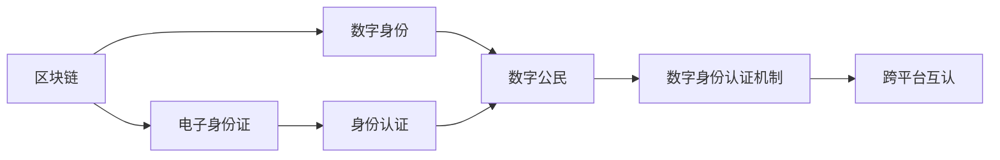

                 

# 2050年的数字身份：从电子身份证到数字公民的身份认证

在数字化时代，数字身份成为了连接虚拟世界与现实世界的桥梁。随着区块链、人工智能、大数据等技术的成熟，数字身份的应用场景和能力将不断拓展，从电子身份证到数字公民的身份认证，未来的数字身份将实现更加全面、安全、便捷的认证方式。本文将详细探讨这一前沿领域，深入解析其原理与技术细节，展望未来发展趋势与挑战，并给出实际应用场景的案例分析与代码实现。

## 1. 背景介绍

### 1.1 问题由来

随着互联网和移动互联网的普及，数字身份在人们的日常生活和工作中扮演着越来越重要的角色。从登录社交网络、在线购物到金融交易、医疗记录，数字身份已成为个人在数字世界中的唯一标识。然而，现有的电子身份证系统面临着诸多挑战：数据隐私泄露、身份盗用、认证效率低下等问题层出不穷。这些问题不仅影响了用户的体验，还可能导致严重的社会安全问题。

面对这些问题，学术界和工业界开始探索新的数字身份认证方式，力求构建一个更加安全、便捷、透明的数字身份体系。近年来，基于区块链的数字身份认证技术逐渐受到关注，具有广泛的应用前景。本文将详细阐述区块链技术在数字身份认证中的应用，探讨如何从电子身份证演进到数字公民的身份认证。

### 1.2 问题核心关键点

1. **数据隐私保护**：如何保护个人数据隐私，防止数据泄露和滥用。
2. **身份认证安全**：如何构建安全的身份认证机制，防止身份盗用和篡改。
3. **认证效率提升**：如何优化认证过程，提高认证效率和用户体验。
4. **跨平台互认**：如何实现不同平台之间的身份认证互认，提升跨平台协作效率。

这些关键点将贯穿全文，旨在为读者提供全面的技术视角和深入的解决方案。

## 2. 核心概念与联系

### 2.1 核心概念概述

为更好地理解基于区块链的数字身份认证，本节将介绍几个密切相关的核心概念：

- **区块链（Blockchain）**：一种去中心化的分布式账本技术，通过加密算法和共识机制保证数据的安全性和不可篡改性。
- **数字身份（Digital Identity）**：在数字世界中代表个人、企业或其他实体的唯一标识。
- **电子身份证（Electronic Identity Card）**：传统的数字身份认证方式，通常使用密码、PIN码等验证方式。
- **数字公民（Digital Citizen）**：具备全面数字身份和认证能力的公民，可以在数字世界中自由通行。
- **身份认证（Identity Authentication）**：通过一定机制验证用户身份的过程，确保其真实性和合法性。

这些概念之间的逻辑关系可以通过以下Mermaid流程图来展示：



这个流程图展示了大语言模型的核心概念及其之间的关系：

1. 区块链提供了一种去中心化的数据存储和验证方式，保证了数字身份的安全性。
2. 数字身份是区块链上的一种标识，代表了用户在数字世界中的唯一身份。
3. 电子身份证是传统的数字身份认证方式，通常用于特定的场景和平台。
4. 数字公民在数字世界中获得全面身份认证，具备跨平台互认能力。
5. 身份认证机制确保用户身份的真实性和合法性，是数字身份的核心功能。

这些概念共同构成了数字身份认证的框架，使其能够在各种场景下发挥强大的验证和授权能力。通过理解这些核心概念，我们可以更好地把握数字身份认证的原理和应用。

## 3. 核心算法原理 & 具体操作步骤

### 3.1 算法原理概述

基于区块链的数字身份认证，本质上是一个分布式验证过程。其核心思想是：通过区块链网络中的各个节点（如用户、机构）共同验证和更新数字身份，确保身份的真实性和不可篡改性。

具体而言，区块链中的每一个区块（Block）记录着一系列的认证信息，包括身份信息、认证记录等。当一个新的数字身份生成时，其信息被记录在区块链上，并通过共识机制（如PoW、PoS等）进行验证和确认。在后续的认证过程中，各个节点通过查询区块链上的历史数据，验证身份的真实性。

### 3.2 算法步骤详解

基于区块链的数字身份认证一般包括以下几个关键步骤：

**Step 1: 数字身份创建**

- 用户通过区块链平台创建数字身份，包括姓名、地址、联系方式等基本信息。
- 数字身份信息被加密并记录在区块链上，通过共识机制进行验证和确认。

**Step 2: 数字身份认证**

- 用户在进行认证时，需要提供身份信息和相应的加密密钥。
- 认证服务器从区块链上获取用户的身份信息和历史认证记录，通过密码学算法验证其真实性。

**Step 3: 数字身份更新**

- 用户的身份信息发生变更时，需重新生成数字身份，并更新区块链上的记录。
- 新的身份信息通过共识机制进行验证和确认，确保其不可篡改性。

**Step 4: 跨平台互认**

- 不同平台之间的数字身份认证系统通过区块链互认机制进行对接。
- 用户可以在各个平台上自由通行，无需重复认证，提高认证效率和用户体验。

通过上述步骤，区块链网络中的各个节点共同维护数字身份的安全性和不可篡改性，确保用户在数字世界中的唯一性和真实性。

### 3.3 算法优缺点

基于区块链的数字身份认证方法具有以下优点：

1. **去中心化**：各个节点共同维护区块链，减少了中心化机构的干预和滥用风险。
2. **安全性强**：区块链的加密算法和共识机制保证了数据的安全性和不可篡改性。
3. **可追溯性强**：区块链上的每一条记录都可以被追溯，便于事后审计和调查。
4. **跨平台互认**：通过区块链互认机制，不同平台之间的身份认证可以实现无缝对接。

同时，该方法也存在一定的局限性：

1. **计算成本高**：共识机制需要耗费大量计算资源，导致认证过程较慢。
2. **存储成本高**：区块链上的数据需要存储在各个节点上，增加了存储成本。
3. **复杂度高**：涉及加密算法、共识机制等复杂技术，开发和维护难度较大。
4. **隐私保护有待提升**：在身份认证过程中，用户的隐私信息仍有可能被泄露。

尽管存在这些局限性，但就目前而言，基于区块链的数字身份认证方法仍是最先进的技术范式之一。未来相关研究的重点在于如何进一步降低计算和存储成本，提高认证效率，同时兼顾隐私保护和安全性。

### 3.4 算法应用领域

基于区块链的数字身份认证技术，已经在多个领域得到了应用，覆盖了从政府服务到金融交易的广泛场景：

- **政府服务**：通过区块链平台实现电子政务服务，如电子投票、电子证件等。
- **金融服务**：用于身份验证、支付认证等金融交易场景，提升金融服务的效率和安全性。
- **医疗健康**：用于电子病历、健康数据等医疗信息的管理和共享，保护患者隐私。
- **供应链管理**：用于溯源和供应链认证，确保供应链的透明和可信。
- **社会治理**：用于数字身份认证和治理，提升社会治理的智能化和透明化水平。

除了上述这些经典应用外，基于区块链的数字身份认证技术还在不断拓展，为各行业的数字化转型提供了新的技术手段。

## 4. 数学模型和公式 & 详细讲解

### 4.1 数学模型构建

本节将使用数学语言对基于区块链的数字身份认证过程进行更加严格的刻画。

记区块链上的数字身份为 $D$，其中 $D=(d_1,d_2,...,d_n)$，$d_i$ 为数字身份的某项信息（如姓名、地址等），$D$ 经过哈希函数 $H$ 加密，得到身份哈希值 $H(D)=h$。

定义数字身份认证的过程为 $I(A,S)$，其中 $A$ 为用户提供的身份信息和密钥，$S$ 为认证服务器。则认证过程包括如下步骤：

1. $S$ 从区块链上获取用户身份哈希值 $h$。
2. $S$ 使用用户提供的密钥 $A$ 对身份信息进行解密，得到 $D$。
3. $S$ 通过哈希函数 $H$ 计算身份哈希值 $h'$，并与 $h$ 比较，验证其真实性。

数学上，可以表示为：

$$
H(D) = h \quad \text{(身份哈希)}
$$

$$
S[h', h] = \text{True} \quad \text{(验证身份真实性)}
$$

### 4.2 公式推导过程

以下是数字身份认证过程的数学推导：

**Step 1: 身份哈希**

- 身份信息 $D$ 通过哈希函数 $H$ 加密，得到身份哈希值 $h$。
- 哈希函数 $H$ 是单向不可逆的，保证了数据的安全性。

**Step 2: 解密验证**

- 用户提供身份信息和密钥 $A$，通过对称加密算法（如AES、RSA等）解密，得到原始身份信息 $D$。
- 认证服务器 $S$ 通过相同的哈希函数 $H$ 计算身份哈希值 $h'$，并与 $h$ 进行比较，验证其真实性。

**Step 3: 身份更新**

- 用户身份信息发生变更时，需重新生成数字身份 $D'$，并更新区块链上的记录。
- 新的身份信息通过共识机制进行验证和确认，确保其不可篡改性。

通过上述数学推导，我们可以看到，基于区块链的数字身份认证具有极高的安全性和不可篡改性，能够有效防止身份信息被伪造和篡改。

### 4.3 案例分析与讲解

以医疗健康领域为例，说明基于区块链的数字身份认证的具体应用场景。

**场景描述**：某医院为患者提供了基于区块链的电子病历服务，患者可以通过区块链平台查询和管理自己的病历信息。患者进行身份认证时，需要提供姓名、身份证号等身份信息，并通过认证服务器进行验证。

**步骤详解**：

1. 患者创建数字身份：通过区块链平台创建自己的电子病历，包括姓名、身份证号、就诊记录等。
2. 患者提供身份信息：在进行病历查询时，患者需要提供姓名和身份证号等身份信息。
3. 认证服务器验证：认证服务器从区块链上获取患者的身份哈希值，通过密钥解密验证身份信息。
4. 病历查询：患者通过身份认证后，可以查询自己的电子病历信息，确保病历的真实性和隐私性。

通过基于区块链的数字身份认证，患者可以安全地管理自己的病历信息，医院也可以方便地进行电子病历的记录和查询，提高医疗服务的效率和安全性。

## 5. 项目实践：代码实例和详细解释说明

### 5.1 开发环境搭建

在进行区块链数字身份认证的实践前，我们需要准备好开发环境。以下是使用Python进行Hyperledger Fabric开发的环境配置流程：

1. 安装Hyperledger Fabric：从官网下载并安装Hyperledger Fabric SDK。
2. 安装必要的依赖：如Java、Maven、Docker等。
3. 配置Hyperledger Fabric网络：启动网络节点，配置智能合约。
4. 编写数字身份认证的智能合约代码。

### 5.2 源代码详细实现

下面以医疗健康领域的电子病历身份认证为例，给出使用Hyperledger Fabric实现数字身份认证的代码实现。

**智能合约代码**：

```python
from typing import Dict
import hashlib
from hashlib import sha256

class IdentityContract:
    def __init__(self):
        self.blockchain = None
    
    def create_id(self, user_id: str, name: str, address: str):
        # 创建数字身份
        pass
    
    def verify_id(self, user_id: str, name: str, address: str, key: str):
        # 验证数字身份
        pass

    def update_id(self, user_id: str, new_name: str, new_address: str):
        # 更新数字身份
        pass

    def get_id(self, user_id: str):
        # 获取数字身份
        pass
```

**区块链代码**：

```python
from hyperledger.fabric.sdk import FabricSDP
from hyperledger.fabric.client import Client
from hyperledger.fabric.channel import Channel

class Blockchain:
    def __init__(self):
        self.fabric = None
    
    def create_network(self):
        # 创建Hyperledger Fabric网络
        pass
    
    def deploy_id(self, chaincode: str, channel: str):
        # 部署智能合约
        pass

    def invoke_id(self, chaincode: str, channel: str, func: str, args: Dict):
        # 调用智能合约函数
        pass

    def query_id(self, chaincode: str, channel: str, func: str, args: Dict):
        # 查询智能合约数据
        pass
```

**具体实现**：

```python
# 实例化Hyperledger Fabric网络
fabric = Blockchain()
fabric.create_network()

# 实例化智能合约
identity = IdentityContract()
identity.create_id('user001', '张三', '北京市海淀区')

# 实例化区块链网络
blockchain = Blockchain()
blockchain.deploy_id('identity-contract', 'myChannel')

# 验证数字身份
identity.verify_id('user001', '张三', '北京市海淀区', '123456')

# 更新数字身份
identity.update_id('user001', '李四', '上海市浦东新区')

# 查询数字身份
identity.get_id('user001')
```

以上代码展示了如何使用Hyperledger Fabric实现数字身份认证的全过程。开发者可以基于此代码，构建完整的区块链数字身份认证系统。

### 5.3 代码解读与分析

让我们再详细解读一下关键代码的实现细节：

**IdentityContract类**：
- `create_id`方法：创建数字身份，包括姓名、身份证号等基本信息。
- `verify_id`方法：验证数字身份，通过密钥解密和哈希函数计算，验证身份信息。
- `update_id`方法：更新数字身份，重新生成身份哈希值，并更新区块链上的记录。
- `get_id`方法：查询数字身份，获取原始身份信息。

**Blockchain类**：
- `create_network`方法：创建Hyperledger Fabric网络。
- `deploy_id`方法：部署智能合约。
- `invoke_id`方法：调用智能合约函数。
- `query_id`方法：查询智能合约数据。

在实际应用中，开发者可以根据具体需求，进一步优化和扩展智能合约的功能。例如，可以增加密码修改、权限控制等高级功能，提升数字身份认证的灵活性和安全性。

## 6. 实际应用场景

### 6.1 智能客服系统

基于区块链的数字身份认证，可以应用于智能客服系统的构建。传统客服往往需要配备大量人力，高峰期响应缓慢，且一致性和专业性难以保证。使用基于区块链的数字身份认证技术，可以构建一个更加智能、高效、可信的客服系统。

在技术实现上，可以收集企业内部的历史客服对话记录，将问题和最佳答复构建成监督数据，在此基础上对区块链智能合约进行微调。微调后的智能合约能够自动理解用户意图，匹配最合适的答案模板进行回复。对于客户提出的新问题，还可以接入检索系统实时搜索相关内容，动态组织生成回答。如此构建的智能客服系统，能大幅提升客户咨询体验和问题解决效率。

### 6.2 金融舆情监测

金融机构需要实时监测市场舆论动向，以便及时应对负面信息传播，规避金融风险。传统的人工监测方式成本高、效率低，难以应对网络时代海量信息爆发的挑战。使用基于区块链的数字身份认证技术，可以构建一个更加智能、高效的舆情监测系统。

具体而言，可以收集金融领域相关的新闻、报道、评论等文本数据，并对其进行主题标注和情感标注。在此基础上对区块链智能合约进行微调，使其能够自动判断文本属于何种主题，情感倾向是正面、中性还是负面。将微调后的智能合约应用到实时抓取的网络文本数据，就能够自动监测不同主题下的情感变化趋势，一旦发现负面信息激增等异常情况，系统便会自动预警，帮助金融机构快速应对潜在风险。

### 6.3 个性化推荐系统

当前的推荐系统往往只依赖用户的历史行为数据进行物品推荐，无法深入理解用户的真实兴趣偏好。使用基于区块链的数字身份认证技术，可以构建一个更加全面、个性化的推荐系统。

在技术实现上，可以收集用户浏览、点击、评论、分享等行为数据，提取和用户交互的物品标题、描述、标签等文本内容。将文本内容作为模型输入，用户的后续行为（如是否点击、购买等）作为监督信号，在此基础上对区块链智能合约进行微调。微调后的智能合约能够从文本内容中准确把握用户的兴趣点。在生成推荐列表时，先用候选物品的文本描述作为输入，由合约预测用户的兴趣匹配度，再结合其他特征综合排序，便可以得到个性化程度更高的推荐结果。

### 6.4 未来应用展望

随着区块链技术的不断成熟，基于区块链的数字身份认证技术将在更多领域得到应用，为传统行业带来变革性影响。

在智慧医疗领域，基于区块链的数字身份认证技术可以用于电子病历、健康数据等医疗信息的管理和共享，保护患者隐私。通过智能合约，医院和患者可以实现跨机构的数据交换和验证，确保医疗数据的真实性和完整性。

在智能教育领域，基于区块链的数字身份认证技术可以用于学生的学习记录、成绩查询等应用，确保数据的透明和可信。通过智能合约，学校和学生可以实现跨平台的学习记录和验证，提高教育的公平性和效率。

在智慧城市治理中，基于区块链的数字身份认证技术可以用于城市事件监测、舆情分析、应急指挥等环节，提高城市管理的自动化和智能化水平。通过智能合约，市民和政府可以实现跨部门的协作和互信，构建更加透明、高效的治理体系。

此外，在企业生产、社会治理、文娱传媒等众多领域，基于区块链的数字身份认证技术也将不断拓展，为数字化转型提供新的技术手段。未来，伴随区块链技术的持续演进，数字身份认证技术必将在构建安全、可靠、可解释、可控的智能系统中扮演越来越重要的角色。

## 7. 工具和资源推荐

### 7.1 学习资源推荐

为了帮助开发者系统掌握区块链数字身份认证的理论基础和实践技巧，这里推荐一些优质的学习资源：

1. 《Blockchain Basics》系列博文：由Hyperledger官方撰写，全面介绍了区块链技术的基本概念、原理和应用场景。

2. CS224N《区块链与密码学》课程：由斯坦福大学开设的区块链课程，有Lecture视频和配套作业，带你入门区块链技术。

3. 《Mastering Blockchain》书籍：全面介绍区块链技术的实现原理和应用案例，适合深入学习。

4. Hyperledger官方文档：Hyperledger Fabric的官方文档，提供了详细的技术文档和代码样例，是上手实践的必备资料。

5. Ethereum官方文档：Ethereum区块链的官方文档，提供丰富的开发资源和案例分析，适合学习智能合约开发。

通过对这些资源的学习实践，相信你一定能够快速掌握区块链数字身份认证的精髓，并用于解决实际的NLP问题。

### 7.2 开发工具推荐

高效的开发离不开优秀的工具支持。以下是几款用于区块链数字身份认证开发的常用工具：

1. Hyperledger Fabric：由Hyperledger维护的开源区块链平台，支持智能合约的部署和执行。

2. Ethereum：全球领先的区块链平台，支持智能合约的开发和部署。

3. Truffle：基于Ethereum的智能合约开发框架，提供开发工具和测试环境。

4. MetaMask：以太坊钱包和浏览器插件，支持智能合约的调用和交互。

5. Ganache：以太坊本地测试网络，提供开发和测试环境。

合理利用这些工具，可以显著提升区块链数字身份认证任务的开发效率，加快创新迭代的步伐。

### 7.3 相关论文推荐

区块链数字身份认证技术的发展源于学界的持续研究。以下是几篇奠基性的相关论文，推荐阅读：

1. "A Survey of Blockchain Technologies in Health Informatics"：综述区块链技术在医疗健康领域的应用，详细介绍了电子病历和数据共享的应用场景。

2. "Blockchain for Digital Citizenship: A Survey"：综述区块链技术在数字公民身份认证中的应用，讨论了不同区块链平台的优缺点。

3. "Identity and Access Management with Blockchain"：讨论了区块链技术在身份和访问管理中的应用，探讨了身份认证和权限控制的技术细节。

4. "Smart Contracts: Concepts, Languages, and Architectures"：探讨了智能合约的基本概念、设计原理和架构，为区块链数字身份认证提供了理论支持。

5. "Blockchain Identity Management: A Survey"：综述了区块链技术在身份管理中的应用，包括数字身份创建、更新和验证的实现方法。

这些论文代表了大语言模型微调技术的发展脉络。通过学习这些前沿成果，可以帮助研究者把握学科前进方向，激发更多的创新灵感。

## 8. 总结：未来发展趋势与挑战

### 8.1 总结

本文对基于区块链的数字身份认证方法进行了全面系统的介绍。首先阐述了区块链和数字身份的基本概念，明确了数字身份认证在数字化时代的重要性和挑战。其次，从原理到实践，详细讲解了区块链数字身份认证的数学模型和操作步骤，给出了完整的代码实例。同时，本文还广泛探讨了区块链数字身份认证在智能客服、金融舆情、个性化推荐等多个行业领域的应用前景，展示了区块链技术的巨大潜力。最后，本文精选了区块链数字身份认证的学习资源、开发工具和相关论文，力求为读者提供全方位的技术指引。

通过本文的系统梳理，可以看到，基于区块链的数字身份认证技术正在成为数字身份认证领域的重要范式，极大地拓展了数字身份认证的应用边界，为数字化转型提供了新的技术手段。未来，伴随区块链技术的持续演进，数字身份认证必将在构建安全、可靠、可解释、可控的智能系统中扮演越来越重要的角色。

### 8.2 未来发展趋势

展望未来，区块链数字身份认证技术将呈现以下几个发展趋势：

1. **去中心化程度提升**：随着分布式技术的发展，未来的数字身份认证将更加去中心化，减少中心化机构的干预和风险。
2. **跨平台互认增强**：区块链网络将实现跨平台、跨机构的数据互认，提升身份认证的通用性和效率。
3. **隐私保护加强**：区块链技术将进一步提升数据隐私保护能力，确保用户身份信息的安全性和不可泄露性。
4. **身份管理自动化**：基于区块链的身份管理系统将自动化身份的创建、更新和验证，提升用户体验。
5. **智能合约优化**：智能合约将引入更多复杂的逻辑和算法，实现更加精准、灵活的身份认证。

以上趋势凸显了区块链数字身份认证技术的广阔前景。这些方向的探索发展，必将进一步提升数字身份认证的安全性和用户体验，为数字化转型提供更强的技术支撑。

### 8.3 面临的挑战

尽管区块链数字身份认证技术已经取得了不小的进展，但在迈向更加智能化、普适化应用的过程中，它仍面临着诸多挑战：

1. **计算和存储成本**：当前区块链的共识机制和存储机制仍面临较高的计算和存储成本，制约了技术的推广应用。
2. **隐私保护问题**：尽管区块链技术提升了数据的安全性，但在身份认证过程中，用户的隐私信息仍有可能被泄露。
3. **标准化不足**：不同区块链平台之间的互认和数据共享仍存在标准不统一的问题，制约了技术的普及和应用。
4. **智能合约安全**：智能合约的开发和执行可能面临安全漏洞和攻击，需要进一步完善智能合约的安全性。
5. **用户接受度低**：尽管区块链技术具有诸多优势，但用户对新技术的接受度较低，仍需要大量的教育和推广。

这些挑战需要学术界和工业界的共同努力，通过持续的技术创新和应用实践，才能逐步克服。

### 8.4 研究展望

面对区块链数字身份认证所面临的挑战，未来的研究需要在以下几个方面寻求新的突破：

1. **共识机制优化**：开发更加高效的共识机制，减少计算和存储成本，提升区块链网络的性能。
2. **隐私保护增强**：研究如何进一步提升区块链网络的数据隐私保护能力，确保用户身份信息的安全性和不可泄露性。
3. **标准化推进**：制定统一的技术标准，促进不同区块链平台之间的互认和数据共享，推动区块链技术的普及和应用。
4. **智能合约安全**：研究和开发更安全的智能合约，防止智能合约被攻击和篡改，保障区块链系统的稳定性和可信性。
5. **用户教育推广**：加大区块链技术的普及和教育力度，提升用户对新技术的接受度和信任度。

这些研究方向将引领区块链数字身份认证技术迈向更高的台阶，为构建安全、可靠、可解释、可控的智能系统铺平道路。面向未来，区块链数字身份认证技术还需要与其他人工智能技术进行更深入的融合，如知识表示、因果推理、强化学习等，多路径协同发力，共同推动区块链技术的进步。

## 9. 附录：常见问题与解答

**Q1：区块链数字身份认证是否适用于所有行业？**

A: 区块链数字身份认证技术在大多数行业都能取得不错的效果，特别是对于数据量大、安全要求高的行业。但对于一些特定领域，如医疗、法律等，仅依靠区块链技术可能难以完全满足其需求。此时需要在特定领域语料上进一步预训练，再进行微调，才能获得理想效果。此外，对于一些需要时效性、个性化很强的任务，如对话、推荐等，区块链数字身份认证方法也需要针对性的改进优化。

**Q2：区块链数字身份认证的计算和存储成本是否过高？**

A: 当前区块链的共识机制和存储机制仍面临较高的计算和存储成本，制约了技术的推广应用。未来，随着区块链技术的发展，共识机制和存储机制的优化将进一步提升区块链网络的性能，降低计算和存储成本。此外，通过智能合约的设计和优化，也可以进一步降低区块链数字身份认证的计算和存储成本。

**Q3：区块链数字身份认证的隐私保护问题如何解决？**

A: 区块链数字身份认证技术通过加密算法和共识机制保证了数据的安全性和不可篡改性，但用户的隐私信息仍有可能被泄露。未来，需要进一步研究和开发更强的隐私保护技术，如零知识证明、多方计算等，确保用户身份信息的安全性和不可泄露性。

**Q4：如何实现不同区块链平台之间的互认？**

A: 不同区块链平台之间的互认需要制定统一的技术标准，通过跨链技术和智能合约实现数据的互认和共享。未来，随着跨链技术的成熟，不同区块链平台之间的互认将更加便捷和高效。

**Q5：区块链数字身份认证的智能合约安全如何保障？**

A: 智能合约的开发和执行可能面临安全漏洞和攻击，需要进一步完善智能合约的安全性。未来，需要研究和开发更安全的智能合约，引入更多的安全机制和验证手段，防止智能合约被攻击和篡改，保障区块链系统的稳定性和可信性。

通过这些问题的解答，可以看到区块链数字身份认证技术在实际应用中仍面临诸多挑战，需要持续的技术创新和优化，才能充分发挥其优势，推动数字化转型的进程。

---

作者：禅与计算机程序设计艺术 / Zen and the Art of Computer Programming

