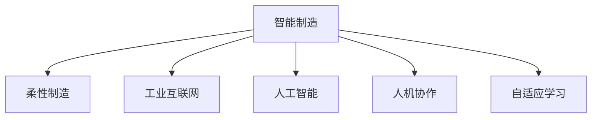

                 

# 2050年的智能制造：从自动化到柔性化的工业革命

## 1. 背景介绍

### 1.1 问题由来
随着人工智能技术的快速发展，智能制造正逐渐成为工业革命4.0的核心驱动力。从传统的机械自动化生产，到灵活柔性的智能制造系统，工业界正在经历一场深刻的转型。这场转型不仅仅涉及到技术创新，更关乎生产模式、管理方式和商业模式的全面升级。

智能制造的愿景，是通过数字化、网络化和智能化技术，将物理生产系统与信息空间深度融合，实现人机协同、供需优化、弹性制造、质量提升等目标。然而，当前智能制造技术仍面临诸多挑战，如柔性制造能力不足、系统互联互通难度大、数据安全等问题。如何克服这些难题，推动智能制造向更加智能化、柔性化的方向发展，是当前工业界和学术界共同面临的重要课题。

### 1.2 问题核心关键点
智能制造的核心在于如何构建一个高度灵活、高效、安全的制造系统。主要包括以下几个关键点：
- 自动化与智能化：通过机器学习、计算机视觉、自然语言处理等技术，实现生产过程的自动监控和优化。
- 数据驱动决策：建立数据平台，采集、分析和应用生产数据，实现实时决策和优化。
- 协同制造与智能物流：构建工业互联网平台，实现人机协同、物联协同和产供协同，提升供应链管理效率。
- 质量控制与预测性维护：应用智能传感器和预测性算法，提升产品质量和设备运行可靠性。
- 人机协作与职业教育：改善人机交互界面，提升工人技能和生产效率。

这些关键点相互交织，共同构成了智能制造的复杂系统，需要综合考虑技术、管理、文化等多方面因素。本文将围绕智能制造的核心概念，探索未来智能制造系统的发展趋势和优化策略。

## 2. 核心概念与联系

### 2.1 核心概念概述

为更好地理解智能制造的技术框架和应用场景，本节将介绍几个密切相关的核心概念：

- 智能制造（Intelligent Manufacturing）：利用新一代信息通信技术与先进制造技术深度融合，实现工业全生命周期各环节全面数字化、网络化、智能化，提升制造效率和质量，实现绿色制造和可持续发展。

- 柔性制造系统（Flexible Manufacturing System, FMS）：通过自动化技术实现生产的灵活调整和重新配置，支持多品种、小批量生产，提升生产系统的适应性和响应速度。

- 工业互联网（Industrial Internet）：基于互联网和新一代信息通信技术构建的工业应用生态，实现设备联网、数据共享、应用集成、服务协同，推动制造系统的智能化和互联互通。

- 人工智能（Artificial Intelligence, AI）：通过模拟人脑的思维过程，实现计算求解、智能推理、自适应学习等智能行为，提升生产系统的决策能力、适应性和效率。

- 人机协作（Human-Machine Collaboration, HMC）：结合先进感知、决策、执行技术，实现人机协同工作，提升生产过程的灵活性和协同效率。

- 自适应学习（Adaptive Learning）：通过机器学习算法，使系统具备学习能力，自动优化参数和策略，提高生产系统的智能化水平。

这些核心概念之间的逻辑关系可以通过以下Mermaid流程图来展示：



这个流程图展示了一个典型的智能制造系统的组成部分，以及它们之间的相互关系：

- 柔性制造系统是智能制造的基础，实现生产的灵活调整和重新配置。
- 工业互联网提供了设备联网和数据共享的基础，实现系统间的协同与互联。
- 人工智能通过算法优化，提升系统的智能决策和自适应能力。
- 人机协作实现人机协同工作，提升生产系统的灵活性和协同效率。
- 自适应学习使系统具备学习能力，自动优化参数和策略。

这些概念共同构成了智能制造的技术框架，为构建高效、灵活、智能的制造系统提供了理论基础。

## 3. 核心算法原理 & 具体操作步骤
### 3.1 算法原理概述

智能制造系统的算法原理，基于计算机视觉、机器学习、自然语言处理等多方面的技术，实现生产过程的监控、优化和决策。其核心思想是：通过采集和分析生产数据，构建数学模型和算法，实现生产过程的自动化、智能化和优化。

形式化地，假设智能制造系统中的传感器采集到实时生产数据 $X=\{x_i\}_{i=1}^N$，其中 $x_i \in \mathbb{R}^d$。系统通过数据预处理、特征提取、模型训练等步骤，建立预测模型 $M(X)$，用于预测生产状态 $Y=\{y_i\}_{i=1}^N$，其中 $y_i \in \mathcal{Y}$。目标是最小化预测误差，即：

$$
\hat{M} = \mathop{\arg\min}_{M} \mathcal{L}(M,Y)
$$

其中 $\mathcal{L}$ 为损失函数，用于衡量模型预测结果与真实标签之间的差异。常见的损失函数包括均方误差、交叉熵等。

通过梯度下降等优化算法，系统不断更新模型参数，最小化损失函数，使得模型预测结果逼近真实标签。在此过程中，需要选择合适的优化算法、超参数和正则化技术，避免过拟合，提升模型泛化能力。

### 3.2 算法步骤详解

智能制造系统的算法步骤主要包括：

**Step 1: 数据采集与预处理**
- 配置传感器和设备，采集生产过程中的各类数据，包括温度、压力、流量、振动、图像等。
- 数据清洗和预处理，去除噪声和异常值，进行归一化和标准化，形成可用于模型训练的数据集。

**Step 2: 特征提取与选择**
- 通过统计特征、时频特征、图像特征等方法，提取数据的关键特征。
- 使用特征选择算法，选择对预测效果有显著影响的关键特征，减少冗余。

**Step 3: 模型建立与训练**
- 选择合适的预测模型，如线性回归、支持向量机、神经网络等。
- 划分数据集为训练集和验证集，使用训练集对模型进行训练，并在验证集上评估模型性能。
- 调整模型超参数，如学习率、正则化强度等，优化模型性能。

**Step 4: 模型应用与评估**
- 将训练好的模型部署到生产系统中，实时采集数据，进行预测和优化。
- 在生产过程中监测模型性能，记录预测结果与实际结果之间的差异。
- 根据评估结果，调整模型参数和超参数，优化模型性能。

**Step 5: 数据反馈与迭代优化**
- 收集生产过程中的反馈数据，对模型进行迭代优化。
- 更新模型参数和超参数，提升模型预测准确度和泛化能力。
- 重复执行步骤3-5，实现系统的自适应学习。

### 3.3 算法优缺点

智能制造系统的算法具有以下优点：
- 自动化与智能化：通过机器学习算法，实现生产过程的自动监控和优化，提高生产效率和质量。
- 实时决策：通过实时数据采集和分析，快速响应生产异常，优化生产过程。
- 柔性制造：通过模型自适应学习，实现生产的灵活调整和重新配置。
- 预测性维护：应用预测性算法，提升设备运行可靠性和维护效率。

同时，该方法也存在一定的局限性：
- 数据质量依赖：系统的预测效果很大程度上依赖于数据的质量和完整性，数据获取难度大。
- 模型复杂度：复杂的机器学习模型计算量大，实时性差，需要高配置硬件支持。
- 适应性限制：模型对特定场景的适应性有限，需要持续优化和迭代更新。
- 解释性不足：机器学习模型往往是"黑盒"系统，难以解释其决策过程。

尽管存在这些局限性，但智能制造系统的算法在生产过程的监控、优化和决策方面仍具有显著的优势，为构建高效、灵活、智能的制造系统提供了重要手段。

### 3.4 算法应用领域

智能制造系统的算法广泛应用于制造过程的各个环节，涵盖以下几方面：

- **生产过程监控**：通过机器视觉和传感器技术，实现生产设备的实时监控和故障诊断，提高设备运行可靠性。
- **质量控制**：应用机器学习算法，分析产品质量数据，实现质量缺陷的预测和分类，提升产品合格率。
- **生产调度优化**：通过优化算法，合理分配生产资源，减少等待时间和库存成本，提高生产效率。
- **供应链管理**：构建工业互联网平台，实现供应链各环节的数据共享和协同，优化供应链管理效率。
- **预测性维护**：应用时间序列分析和异常检测算法，预测设备故障和维护需求，提升维护效率和生产稳定性。
- **柔性制造**：通过模型自适应学习，实现生产的灵活调整和重新配置，支持多品种、小批量生产。

除了这些经典应用外，智能制造系统还被创新性地应用于更多场景中，如智能仓储、智能物流、智能监测等，为制造系统的智能化和高效化带来了新的突破。

## 4. 数学模型和公式 & 详细讲解  
### 4.1 数学模型构建

本节将使用数学语言对智能制造系统的算法原理进行更加严格的刻画。

假设智能制造系统中的传感器采集到实时生产数据 $X=\{x_i\}_{i=1}^N$，其中 $x_i \in \mathbb{R}^d$。目标是通过机器学习算法建立预测模型 $M(X)$，预测生产状态 $Y=\{y_i\}_{i=1}^N$，其中 $y_i \in \mathcal{Y}$。

定义模型 $M(X)$ 在数据样本 $(x,y)$ 上的损失函数为 $\ell(M(X)(x),y)$，则在数据集 $D$ 上的经验风险为：

$$
\mathcal{L}(M)=\frac{1}{N}\sum_{i=1}^N\ell(M(X)(x_i),y_i)
$$

目标是最小化经验风险，即找到最优模型：

$$
M_{\hat{M}} = \mathop{\arg\min}_{M} \mathcal{L}(M)
$$

在实践中，我们通常使用基于梯度的优化算法（如SGD、Adam等）来近似求解上述最优化问题。设 $\eta$ 为学习率，$\lambda$ 为正则化系数，则参数的更新公式为：

$$
\theta \leftarrow \theta - \eta\nabla_{\theta}\mathcal{L}(\theta) - \eta\lambda\theta
$$

其中 $\nabla_{\theta}\mathcal{L}(\theta)$ 为损失函数对参数 $\theta$ 的梯度，可通过反向传播算法高效计算。

### 4.2 公式推导过程

以下我们以预测设备故障为例，推导基于机器学习算法的预测模型。

假设传感器采集到设备的振动信号 $x_i \in \mathbb{R}^d$，表示设备在第 $i$ 个时间步的振动特征。设备故障状态 $y_i \in \{0,1\}$，其中 $y_i=1$ 表示设备在 $i$ 时间步发生故障，否则为正常。则预测模型可定义为：

$$
\hat{y}_i = M_{\theta}(x_i)
$$

其中 $M_{\theta}$ 为预测模型，$\theta$ 为模型参数。

定义预测模型 $M_{\theta}$ 在数据样本 $(x,y)$ 上的损失函数为：

$$
\ell(M_{\theta}(x_i),y_i) = -[y_i\log\hat{y}_i+(1-y_i)\log(1-\hat{y}_i)]
$$

将其代入经验风险公式，得：

$$
\mathcal{L}(\theta)=\frac{1}{N}\sum_{i=1}^N[-y_i\log\hat{y}_i-(1-y_i)\log(1-\hat{y}_i)]
$$

根据链式法则，损失函数对参数 $\theta$ 的梯度为：

$$
\frac{\partial \mathcal{L}(\theta)}{\partial \theta} = \frac{1}{N}\sum_{i=1}^N \left(\frac{y_i}{\hat{y}_i}-\frac{1-y_i}{1-\hat{y}_i}\right) \frac{\partial \hat{y}_i}{\partial \theta}
$$

其中 $\frac{\partial \hat{y}_i}{\partial \theta}$ 可进一步递归展开，利用自动微分技术完成计算。

在得到损失函数的梯度后，即可带入参数更新公式，完成模型的迭代优化。重复上述过程直至收敛，最终得到适应生产任务的最优模型参数 $\theta^*$。

## 5. 项目实践：代码实例和详细解释说明
### 5.1 开发环境搭建

在进行智能制造系统开发前，我们需要准备好开发环境。以下是使用Python进行TensorFlow开发的环境配置流程：

1. 安装Anaconda：从官网下载并安装Anaconda，用于创建独立的Python环境。

2. 创建并激活虚拟环境：
```bash
conda create -n tensorflow-env python=3.8 
conda activate tensorflow-env
```

3. 安装TensorFlow：根据CUDA版本，从官网获取对应的安装命令。例如：
```bash
conda install tensorflow-gpu -c conda-forge
```

4. 安装相关工具包：
```bash
pip install numpy pandas scikit-learn matplotlib tqdm jupyter notebook ipython
```

完成上述步骤后，即可在`tensorflow-env`环境中开始智能制造系统的开发。

### 5.2 源代码详细实现

下面以预测设备故障为例，给出使用TensorFlow进行智能制造系统开发的PyTorch代码实现。

首先，定义设备故障预测任务的数据处理函数：

```python
import tensorflow as tf
from tensorflow.keras.preprocessing.sequence import pad_sequences
from tensorflow.keras.layers import Dense, Dropout, LSTM
from tensorflow.keras.models import Sequential
from sklearn.model_selection import train_test_split
import numpy as np

def load_data(filename):
    with open(filename, 'r') as f:
        data = f.readlines()
        X = []
        Y = []
        for line in data:
            features, label = line.split(',')
            X.append(features.split())
            Y.append(int(label))
        return np.array(X), np.array(Y)

# 加载数据集
X_train, Y_train = load_data('train.txt')
X_test, Y_test = load_data('test.txt')

# 数据预处理
max_len = 100
X_train = pad_sequences(X_train, maxlen=max_len, padding='post')
X_test = pad_sequences(X_test, maxlen=max_len, padding='post')

# 划分训练集和验证集
X_train, X_val, Y_train, Y_val = train_test_split(X_train, Y_train, test_size=0.2, random_state=42)
```

然后，定义模型和优化器：

```python
from tensorflow.keras.optimizers import Adam

model = Sequential()
model.add(LSTM(64, input_shape=(max_len,)))
model.add(Dense(32, activation='relu'))
model.add(Dense(1, activation='sigmoid'))
model.compile(loss='binary_crossentropy', optimizer=Adam(lr=0.001), metrics=['accuracy'])
```

接着，定义训练和评估函数：

```python
def train_model(model, X_train, Y_train, X_val, Y_val, epochs=50, batch_size=32):
    model.fit(X_train, Y_train, validation_data=(X_val, Y_val), epochs=epochs, batch_size=batch_size, verbose=2)

def evaluate_model(model, X_test, Y_test):
    loss, acc = model.evaluate(X_test, Y_test, verbose=0)
    print(f'Test loss: {loss:.4f}')
    print(f'Test accuracy: {acc:.4f}')
```

最后，启动训练流程并在测试集上评估：

```python
train_model(model, X_train, Y_train, X_val, Y_val, epochs=50, batch_size=32)
evaluate_model(model, X_test, Y_test)
```

以上就是使用TensorFlow对设备故障预测进行智能制造系统开发的完整代码实现。可以看到，得益于TensorFlow的强大封装，我们可以用相对简洁的代码完成设备故障预测的预测模型开发。

### 5.3 代码解读与分析

让我们再详细解读一下关键代码的实现细节：

**load_data函数**：
- 定义数据加载函数，从文本文件中读取数据，将特征和标签分割，并转换为模型所需格式。

**数据预处理**：
- 使用pad_sequences函数对特征序列进行填充，确保所有样本的长度一致。
- 使用train_test_split函数将数据集划分为训练集和验证集。

**模型定义与编译**：
- 定义一个顺序模型，包含LSTM层、全连接层和输出层。
- 使用Adam优化器和二元交叉熵损失函数进行模型编译。

**训练与评估**：
- 使用fit函数进行模型训练，使用validation_data参数指定验证集。
- 使用evaluate函数进行模型评估，输出损失和准确率。

**训练流程**：
- 调用train_model函数进行模型训练，指定训练集、验证集、轮数和批大小。
- 在测试集上评估模型性能，输出测试结果。

可以看到，TensorFlow为开发者提供了丰富的模型构建和训练工具，能够快速搭建和优化智能制造系统的预测模型。

当然，工业级的系统实现还需考虑更多因素，如模型的保存和部署、超参数的自动搜索、更灵活的任务适配层等。但核心的智能制造算法基本与此类似。

## 6. 实际应用场景
### 6.1 智能仓储管理

智能仓储系统通过机器视觉和传感器技术，实现对仓储环境和物品的实时监控和自动化管理。具体应用场景包括：

- **货物识别与定位**：通过机器视觉技术，自动识别和定位仓库中的货物，生成货物清单和定位信息，提高拣选效率。
- **库存管理与补货**：实时监测库存水平，预测货物需求，自动生成补货订单，优化库存管理。
- **环境监测与异常检测**：使用传感器监测仓库环境，如温度、湿度、空气质量等，实时检测环境异常，保障货物安全和仓储环境。

### 6.2 智能物流调度

智能物流调度系统通过工业互联网平台，实现对物流全链路的实时监控和优化。具体应用场景包括：

- **车辆调度与路径优化**：通过GPS和传感器技术，实时监控车辆位置和状态，动态调整车辆路径，优化物流调度。
- **货物跟踪与异常处理**：实时跟踪货物位置，检测异常运输事件，如货物丢失、延误等，自动生成应对策略，保障货物安全。
- **仓库管理与物流协同**：整合仓库、运输、配送等环节，实现信息共享和协同工作，提升物流效率和客户满意度。

### 6.3 智能设备维护

智能设备维护系统通过预测性维护技术，实现对生产设备的实时监测和故障预测，提高设备运行可靠性和维护效率。具体应用场景包括：

- **设备状态监控**：使用传感器监测设备状态，如振动、温度、电流等，实时检测设备异常，防止设备故障。
- **故障预测与维护**：应用机器学习算法，预测设备故障发生时间，自动生成维护计划，提高维护效率。
- **设备健康评估**：定期评估设备健康状态，生成健康报告，指导设备升级和维护策略。

### 6.4 未来应用展望

随着智能制造技术的不断进步，未来智能制造系统将呈现以下几个发展趋势：

1. **智能化的协同生产**：通过智能制造平台，实现人机协同、物联协同和产供协同，构建更加灵活、高效的制造系统。
2. **全生命周期管理**：实现产品设计、生产、销售、服务等全生命周期的数字化、网络化和智能化管理，提升产品附加值和服务水平。
3. **柔性化生产**：通过柔性制造系统，支持多品种、小批量生产，快速响应市场需求变化，提高市场竞争力。
4. **智能化的决策支持**：通过数据分析和机器学习，提升生产决策的科学性和智能化水平，实现智能化的生产管理。
5. **智能化的质量管理**：应用人工智能算法，提升质量检测和控制能力，实现高质量的制造过程。
6. **智能化的供应链优化**：通过工业互联网平台，实现供应链各环节的数据共享和协同，提升供应链效率和响应速度。

以上趋势凸显了智能制造技术的广阔前景，为构建高效、灵活、智能的制造系统提供了方向指导。

## 7. 工具和资源推荐
### 7.1 学习资源推荐

为了帮助开发者系统掌握智能制造的技术框架和应用场景，这里推荐一些优质的学习资源：

1. 《智能制造》系列书籍：系统介绍智能制造的理论基础和实践方法，涵盖制造系统设计、智能设备应用、智能管理等众多方面。
2. 《深度学习与智能制造》课程：麻省理工学院开设的深度学习与智能制造专题课程，涵盖深度学习在制造中的应用，包括预测、优化、监控等任务。
3. 《工业互联网与智能制造》课程：国内多所大学联合开设的工业互联网与智能制造课程，涵盖工业互联网平台、智能设备、智能管理等多个方面。
4. 《工业4.0：数字化转型与智能制造》书籍：介绍工业4.0时代智能制造的发展历程和未来趋势，涵盖智能制造的理论、技术和应用。
5. 《人工智能在智能制造中的应用》文章：系统介绍人工智能在智能制造中的应用，包括预测、优化、协同等任务，适合技术开发人员阅读。

通过对这些资源的学习实践，相信你一定能够全面掌握智能制造的技术框架和应用场景，为实际应用提供坚实的理论基础。

### 7.2 开发工具推荐

高效的开发离不开优秀的工具支持。以下是几款用于智能制造系统开发的常用工具：

1. TensorFlow：基于Google的深度学习框架，支持分布式计算和GPU加速，适用于大型的智能制造系统开发。
2. PyTorch：Facebook开源的深度学习框架，灵活易用，适用于各种规模的智能制造系统开发。
3. ROS（Robot Operating System）：开源的机器人操作系统，支持机器人硬件和软件开发，适用于智能仓储和物流系统的开发。
4. MATLAB：Simulink和MATLAB集成开发环境，适用于控制系统设计和仿真。
5. Autodesk Inventor：面向制造业的计算机辅助设计（CAD）软件，适用于产品设计和制造过程的仿真和优化。
6. OmniSCAD：面向制造业的3D建模软件，支持制造过程的可视化设计和优化。

合理利用这些工具，可以显著提升智能制造系统的开发效率，加快创新迭代的步伐。

### 7.3 相关论文推荐

智能制造系统的发展得益于众多学者的持续研究。以下是几篇奠基性的相关论文，推荐阅读：

1. "A Survey on Smart Manufacturing"（智能制造综述）：系统总结了智能制造的理论基础和技术框架，涵盖制造系统设计、智能设备应用、智能管理等众多方面。
2. "Towards a Smart Manufacturing Ecosystem"（智能制造生态系统）：探讨了智能制造的生态系统架构，包括智能设备、智能系统、智能管理等组成部分。
3. "Deep Learning for Predictive Maintenance"（深度学习在预测性维护中的应用）：展示了深度学习在预测性维护中的广泛应用，包括设备故障预测、维护计划生成等。
4. "Intelligent Warehouse Management System"（智能仓储管理系统）：介绍了一种基于机器视觉和深度学习的智能仓储管理系统，涵盖货物识别、库存管理、环境监测等多个方面。
5. "A Survey on Industrial Internet of Things and Smart Manufacturing"（工业互联网与智能制造综述）：总结了工业互联网与智能制造的理论基础和应用场景，涵盖设备联网、数据共享、协同优化等环节。

这些论文代表了大智能制造的发展脉络，为智能制造系统的理论和实践提供了丰富的指导。

## 8. 总结：未来发展趋势与挑战

### 8.1 研究成果总结

本文对智能制造系统的核心概念和算法原理进行了详细讲解，并给出了基于机器学习的智能制造系统开发实例。通过本文的系统梳理，可以看到，智能制造系统通过数字化、网络化和智能化技术，实现了生产过程的自动化、优化和决策，具有显著的应用前景。

### 8.2 未来发展趋势

展望未来，智能制造系统将呈现以下几个发展趋势：

1. **智能化与柔性化并重**：智能制造系统将更加注重智能化与柔性化的融合，实现生产过程的实时优化和灵活调整。
2. **数据驱动决策**：通过大数据分析和机器学习，提升生产决策的科学性和智能化水平，实现智能化的生产管理。
3. **人机协同与智能仓储**：通过人机协同和智能仓储技术，提升仓储管理和物流调度的效率和精度。
4. **智能化的设备维护**：通过预测性维护技术，提高设备运行可靠性和维护效率，实现智能化的设备管理。
5. **智能化的质量管理**：应用人工智能算法，提升质量检测和控制能力，实现高质量的制造过程。
6. **智能化的供应链优化**：通过工业互联网平台，实现供应链各环节的数据共享和协同，提升供应链效率和响应速度。

以上趋势凸显了智能制造技术的广阔前景，为构建高效、灵活、智能的制造系统提供了方向指导。

### 8.3 面临的挑战

尽管智能制造系统具有显著的优势，但在迈向更加智能化、柔性化的过程中，仍面临诸多挑战：

1. **技术瓶颈**：智能制造系统涉及多学科、多技术的融合，技术实现难度大，需要跨学科的协作。
2. **数据隐私和安全**：智能制造系统需要实时采集大量数据，数据隐私和安全问题需要高度重视。
3. **设备互联互通**：智能制造系统需要实现设备互联互通，解决异构设备的互操作性问题。
4. **模型可解释性**：智能制造系统中的机器学习模型往往是"黑盒"系统，难以解释其决策过程。
5. **成本控制**：智能制造系统的部署和维护成本较高，需要探索更具成本效益的实现方案。
6. **标准和规范**：智能制造系统的建设需要遵循统一的标准和规范，避免技术壁垒和信息孤岛。

这些挑战需要在技术创新、管理优化、标准制定等多个层面进行协同努力，才能推动智能制造系统向更高的水平发展。

### 8.4 研究展望

未来智能制造系统的发展方向将在以下几个方面进行深入研究：

1. **智能化与柔性化的融合**：探索如何实现智能化与柔性化的深度融合，提升制造系统的适应性和响应速度。
2. **数据驱动的决策支持**：深入研究数据采集、处理和分析技术，提升生产决策的科学性和智能化水平。
3. **人机协同与智能仓储**：探索人机协同技术的应用，提升仓储管理和物流调度的效率和精度。
4. **智能化的设备维护**：研究预测性维护技术，提高设备运行可靠性和维护效率，实现智能化的设备管理。
5. **智能化的质量管理**：应用人工智能算法，提升质量检测和控制能力，实现高质量的制造过程。
6. **智能化的供应链优化**：研究工业互联网平台，实现供应链各环节的数据共享和协同，提升供应链效率和响应速度。

这些研究方向将为智能制造系统的构建提供更坚实的理论基础和实践指导。通过技术创新、管理优化、标准制定等多方面的协同努力，智能制造系统必将在未来实现更广泛的应用，推动制造业的转型升级。

## 9. 附录：常见问题与解答

**Q1：智能制造与传统自动化生产的区别是什么？**

A: 智能制造与传统自动化生产的主要区别在于智能化水平的提升。传统自动化生产主要依赖预先编程的控制逻辑和传感器反馈，实现自动化控制。而智能制造则通过人工智能技术，实现生产过程的实时监控、优化和决策，提升系统的智能化水平。具体来说，智能制造系统能够自适应地学习生产过程中的数据和规律，自动调整参数和策略，实现更灵活、高效的制造过程。

**Q2：智能制造系统对数据质量有什么要求？**

A: 智能制造系统的预测和优化效果很大程度上依赖于数据的质量和完整性。数据需要真实、准确、及时、全面，反映生产过程的真实情况。具体来说，数据需要包括以下几个方面：
- 传感器数据：实时采集设备状态、环境参数等数据，反映设备的运行状态和环境变化。
- 操作数据：记录操作人员的动作、指令等信息，反映生产过程的人机交互。
- 产品数据：记录产品的制造信息、质量数据等，反映产品的生产过程和质量控制。
- 管理数据：记录生产计划、库存状态、设备状态等管理信息，反映生产过程的计划和执行情况。

这些数据需要经过预处理、清洗和转换，确保数据质量和一致性，才能用于智能制造系统的预测和优化。

**Q3：智能制造系统如何实现自适应学习？**

A: 智能制造系统通过机器学习算法实现自适应学习。具体来说，系统通过以下步骤实现自适应学习：
1. 数据采集：实时采集生产过程中的各类数据，包括传感器数据、操作数据、产品数据等。
2. 数据预处理：对采集到的数据进行清洗、归一化和转换，确保数据质量和一致性。
3. 特征提取：通过统计特征、时频特征、图像特征等方法，提取数据的关键特征。
4. 模型建立：选择合适的预测模型，如线性回归、支持向量机、神经网络等，建立预测模型。
5. 模型训练：使用训练集对模型进行训练，优化模型参数，提高模型的泛化能力。
6. 模型应用：在生产过程中实时采集数据，使用模型进行预测和优化，动态调整生产参数。
7. 模型评估：定期评估模型性能，根据评估结果，调整模型参数和超参数，优化模型性能。

通过上述步骤，智能制造系统能够自适应地学习生产过程中的数据和规律，自动调整参数和策略，实现更灵活、高效的制造过程。

**Q4：智能制造系统如何实现设备互联互通？**

A: 智能制造系统通过工业互联网平台实现设备互联互通。具体来说，系统通过以下步骤实现设备互联：
1. 设备接入：将各类设备和传感器接入工业互联网平台，确保数据采集和传输的实时性和可靠性。
2. 数据共享：通过工业互联网平台，实现设备数据和应用数据的共享，实现设备间的协同工作。
3. 应用集成：通过工业互联网平台，实现各类应用功能的集成和协同，提升系统的综合能力和灵活性。
4. 安全保障：通过工业互联网平台，实现设备数据的安全传输和存储，保障数据隐私和安全。

通过上述步骤，智能制造系统能够实现设备互联互通，提升系统的综合能力和灵活性，实现智能化的生产过程。

**Q5：智能制造系统的开发流程包括哪些步骤？**

A: 智能制造系统的开发流程包括以下几个关键步骤：
1. 需求分析：明确智能制造系统的需求和目标，包括生产过程、质量控制、设备维护等环节。
2. 系统设计：根据需求分析，设计智能制造系统的架构和功能，包括数据采集、处理、分析、决策等多个环节。
3. 数据采集与预处理：配置传感器和设备，采集生产过程中的各类数据，进行数据清洗和预处理，确保数据质量和一致性。
4. 特征提取与选择：通过统计特征、时频特征、图像特征等方法，提取数据的关键特征，选择合适的特征。
5. 模型建立与训练：选择合适的预测模型，如线性回归、支持向量机、神经网络等，建立预测模型，使用训练集对模型进行训练，优化模型参数。
6. 模型应用与评估：在生产过程中实时采集数据，使用模型进行预测和优化，动态调整生产参数，定期评估模型性能，根据评估结果，调整模型参数和超参数，优化模型性能。
7. 系统部署与迭代优化：将训练好的模型部署到生产系统中，实时采集数据，进行预测和优化，实现系统的自适应学习。

通过上述步骤，智能制造系统能够实现生产过程的自动化、优化和决策，提升生产效率和质量，实现智能化的制造过程。

**Q6：智能制造系统在实际应用中需要注意哪些问题？**

A: 智能制造系统在实际应用中需要注意以下几个问题：
1. 数据质量依赖：系统的预测效果很大程度上依赖于数据的质量和完整性，数据获取难度大，需要投入大量时间和资源进行数据采集和预处理。
2. 模型复杂度：复杂的机器学习模型计算量大，实时性差，需要高配置硬件支持，系统的部署和维护成本较高。
3. 适应性限制：模型对特定场景的适应性有限，需要持续优化和迭代更新，系统的迭代优化需要大量数据和计算资源。
4. 可解释性不足：机器学习模型往往是"黑盒"系统，难以解释其决策过程，系统的输出结果需要人工审核和验证。
5. 安全性和隐私保护：智能制造系统需要实时采集大量数据，数据隐私和安全问题需要高度重视，需要采取数据加密、访问控制等措施，保障数据隐私和安全。
6. 标准和规范：智能制造系统的建设需要遵循统一的标准和规范，避免技术壁垒和信息孤岛，需要制定和推广智能制造标准，提升系统的互操作性和标准化水平。

这些问题需要在技术创新、管理优化、标准制定等多个层面进行协同努力，才能推动智能制造系统向更高的水平发展。

**Q7：智能制造系统的未来发展方向是什么？**

A: 智能制造系统的未来发展方向将在以下几个方面进行深入研究：
1. **智能化与柔性化的融合**：探索如何实现智能化与柔性化的深度融合，提升制造系统的适应性和响应速度。
2. **数据驱动的决策支持**：深入研究数据采集、处理和分析技术，提升生产决策的科学性和智能化水平。
3. **人机协同与智能仓储**：探索人机协同技术的应用，提升仓储管理和物流调度的效率和精度。
4. **智能化的设备维护**：研究预测性维护技术，提高设备运行可靠性和维护效率，实现智能化的设备管理。
5. **智能化的质量管理**：应用人工智能算法，提升质量检测和控制能力，实现高质量的制造过程。
6. **智能化的供应链优化**：研究工业互联网平台，实现供应链各环节的数据共享和协同，提升供应链效率和响应速度。

通过技术创新、管理优化、标准制定等多方面的协同努力，智能制造系统必将在未来实现更广泛的应用，推动制造业的转型升级。

---

作者：禅与计算机程序设计艺术 / Zen and the Art of Computer Programming

