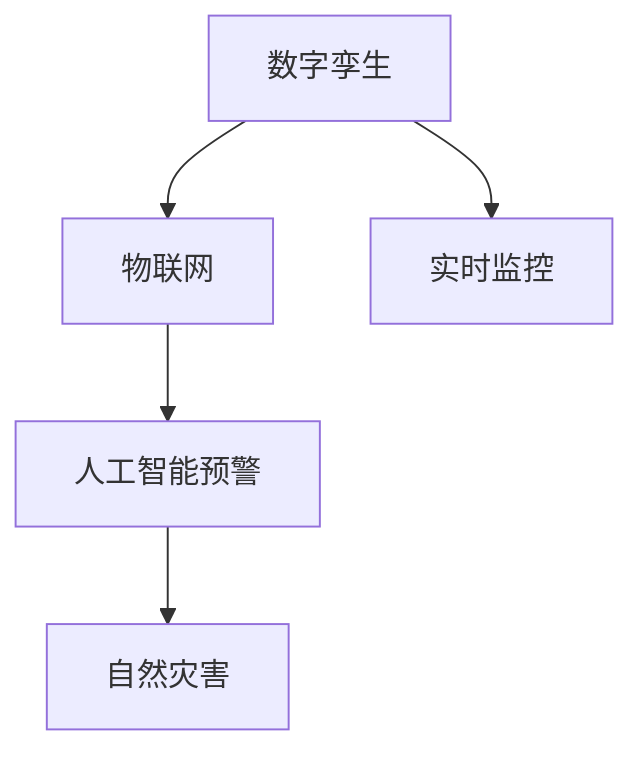

                 

# 2050年的灾害预防：从数字孪生到人工智能预警的灾害防控升级

> 关键词：
> 灾害预防, 数字孪生, 人工智能预警, 数据驱动, 物联网, 传感器网络, 实时监控, 自然灾害, 社区协作, 灾害响应

## 1. 背景介绍

### 1.1 问题由来
随着全球气候变化和人类活动的加剧，自然灾害频发且影响范围和破坏力不断扩大。如何有效预防和应对这些灾害，保障人民生命财产安全和社会稳定，成为了各国政府和科技界的共同课题。传统的灾害防控手段，如预警系统、应急响应体系等，虽然有所帮助，但面对复杂的灾害形势，仍显不足。

近年来，随着数字孪生技术、物联网、人工智能等新兴科技的崛起，科技界开始探索更加智能、精细化的灾害防控新途径。本文将围绕这一主题，从数字孪生技术出发，探讨如何利用人工智能技术进行灾害预警和防控，以期在2050年乃至更远的未来，构建一个更加安全、智能的灾害防控体系。

## 2. 核心概念与联系

### 2.1 核心概念概述

要理解未来灾害预防的技术体系，首先需要明确几个关键概念：

- **数字孪生(Digital Twin)**：指通过虚拟仿真技术，实时映射现实世界的物理模型，实现虚拟与现实的深度融合。数字孪生技术在城市、建筑、工业等领域均有广泛应用，用于提升管理效率和决策精准度。
- **人工智能预警(AI Warning System)**：利用人工智能算法，特别是机器学习、深度学习等技术，对海量数据进行深度分析，预测自然灾害发生的概率和影响范围，提前发布预警信息。
- **物联网(IoT)**：通过传感器网络、无线通信等技术，将各类物体连接到互联网，实现设备间的互联互通，实时采集环境数据。
- **实时监控(Real-Time Monitoring)**：指利用各种传感器、摄像头等设备，对环境进行全天候、全时段的监测，及时发现和报告异常情况。

这些核心概念通过以下Mermaid流程图展示了它们之间的联系：



这一流程图表明，数字孪生技术作为数据驱动的核心，通过物联网实现对自然环境的全方位监控，而人工智能预警则基于这些实时数据，预测灾害风险，进行预警。这种体系化的防控方式，能够极大地提升灾害防控的精准度和效率。

## 3. 核心算法原理 & 具体操作步骤

### 3.1 算法原理概述

未来的灾害预防技术体系，将高度依赖于数据驱动的计算模型和智能算法。其核心算法原理可以概括为：

1. **数据采集与预处理**：通过物联网设备收集各类环境数据，包括气象、地质、地震、洪涝等各类信息。数据预处理包括数据清洗、去噪、归一化等步骤，保证数据的质量和可用性。

2. **数字孪生构建**：基于采集到的实时数据，构建数字孪生模型，实现对物理世界的虚拟仿真。数字孪生模型通过虚拟与现实的同步更新，保证信息的实时性和准确性。

3. **实时监控与分析**：利用传感器网络、摄像头等设备，对实时数据进行采集和分析，识别出异常情况和潜在风险。通过图像识别、模式识别等算法，对数据进行深入分析，提取关键特征。

4. **人工智能预警**：将预处理后的数据输入到训练好的AI模型中，通过深度学习、迁移学习等技术，预测灾害发生的概率和影响范围，生成预警信息。预警信息可以通过各类渠道（如社交媒体、手机短信等）发布，提前提醒受灾群众。

5. **灾害响应与决策支持**：基于AI预警结果，启动应急预案，组织人员疏散、物资调配、救援协调等。同时，数字孪生模型可以模拟各种应急方案的效果，为决策提供支持。

### 3.2 算法步骤详解

下面将详细介绍上述算法的详细步骤：

**步骤1: 数据采集与预处理**

1. **传感器部署**：在重点监测区域布设各类传感器，如气象站、水位计、气体传感器等，实时采集环境数据。
2. **数据整合与清洗**：将来自不同来源的数据进行整合，使用数据清洗技术去除噪声和异常值，确保数据质量。
3. **特征提取**：通过特征提取算法，从原始数据中提取关键特征，如温度、湿度、气压、地震波形等。

**步骤2: 数字孪生构建**

1. **虚拟环境建模**：基于采集到的环境数据，构建虚拟环境模型，包括地形地貌、建筑物、道路等各类要素。
2. **虚拟与现实同步**：利用数字孪生技术，实现虚拟环境与现实环境的实时同步更新，确保模型信息的准确性和时效性。
3. **多源数据融合**：将数字孪生模型与各类监测数据进行融合，实现对环境状态的全面了解。

**步骤3: 实时监控与分析**

1. **实时数据采集**：利用传感器网络、摄像头等设备，对重点监测区域进行实时数据采集。
2. **数据处理与分析**：对采集到的数据进行预处理和特征提取，识别出异常情况和潜在风险。
3. **预警生成**：通过图像识别、模式识别等算法，对数据进行深入分析，提取关键特征，生成预警信息。

**步骤4: 人工智能预警**

1. **模型训练**：使用深度学习、迁移学习等技术，训练各类AI模型，如LSTM、CNN、BERT等。
2. **预测与预警**：将预处理后的数据输入到训练好的AI模型中，通过深度学习、迁移学习等技术，预测灾害发生的概率和影响范围，生成预警信息。
3. **预警发布**：将预警信息通过各类渠道（如社交媒体、手机短信等）发布，提前提醒受灾群众。

**步骤5: 灾害响应与决策支持**

1. **应急预案启动**：基于AI预警结果，启动应急预案，组织人员疏散、物资调配、救援协调等。
2. **模拟与优化**：利用数字孪生模型，模拟各种应急方案的效果，为决策提供支持。

### 3.3 算法优缺点

基于数字孪生和人工智能的灾害预防技术体系，具有以下优点：

1. **实时性**：通过实时监控和数据处理，能够及时发现和响应灾害，极大地减少灾害造成的损失。
2. **精准度**：利用数字孪生技术，构建虚拟与现实的同步更新模型，确保信息的准确性和及时性。
3. **全面性**：通过融合多源数据，实现对环境状态的全面了解，提升预警的全面性和科学性。
4. **自适应性**：利用人工智能算法，能够根据环境变化自动调整预警策略，提高系统的自适应能力。

但同时，这一体系也存在一些缺点：

1. **数据依赖性**：高度依赖于物联网设备的数据采集和传感器网络的覆盖范围，一旦数据采集中断，预警系统将失去作用。
2. **计算资源需求高**：AI模型的训练和预测需要大量计算资源，对硬件设施提出了较高要求。
3. **技术门槛高**：数字孪生和AI预警技术需要较高的技术门槛，对人才需求较大，推广应用难度较大。
4. **伦理和安全问题**：数据隐私、模型透明度等伦理和安全问题需要引起重视，确保技术应用的安全性和可解释性。

### 3.4 算法应用领域

未来的灾害预防技术体系，将广泛应用于多个领域：

1. **城市管理**：在城市基础设施、交通管理等领域，利用数字孪生和AI预警，提升城市管理的智能化水平。
2. **灾害应急**：在地震、洪涝、台风等自然灾害中，利用AI预警系统，快速响应灾害，组织救援。
3. **环境监测**：在环境污染、生态保护等领域，利用AI预警技术，监测和预测环境变化，提升环境保护的效果。
4. **农业生产**：在农业生产中，利用AI预警技术，预测气候变化、病虫害等，提升农业生产的智能化水平。
5. **公共安全**：在公共安全领域，利用AI预警技术，提升对各类突发事件的快速响应能力。

## 4. 数学模型和公式 & 详细讲解  
### 4.1 数学模型构建

未来的灾害预防技术体系，将基于多种数学模型，包括机器学习、深度学习、强化学习等。以下将介绍几个关键模型的构建方式：

**机器学习模型**：
$$
h = f(x; \theta)
$$
其中，$h$ 表示模型预测结果，$x$ 表示输入数据，$\theta$ 表示模型参数。常用的机器学习模型包括决策树、支持向量机、随机森林等。

**深度学习模型**：
$$
h = f(x; \theta)
$$
其中，$h$ 表示模型预测结果，$x$ 表示输入数据，$\theta$ 表示模型参数。常用的深度学习模型包括卷积神经网络（CNN）、循环神经网络（RNN）、长短时记忆网络（LSTM）等。

**强化学习模型**：
$$
Q(s,a) = \mathbb{E}[R + \gamma \max_{a'} Q(s',a')] 
$$
其中，$Q(s,a)$ 表示在状态$s$下，采取行动$a$的Q值，$R$ 表示即时奖励，$\gamma$ 表示折扣因子。常用的强化学习模型包括深度Q网络（DQN）、策略梯度等。

### 4.2 公式推导过程

**深度学习模型的推导**：
以卷积神经网络（CNN）为例，其基本结构如下：
$$
h = f(x; \theta) = \max_{i} \left( \sum_k W_{ki} f_k(z_{ki}) \right)
$$
其中，$z_{ki} = f_{ki}(x) = g_k(x * h_k) + b_k$
$$
h_k = x * w_k + b_k
$$
$f_k$ 表示卷积核函数，$W_{ki}$ 表示卷积核权重，$b_k$ 表示偏置项。通过不断叠加卷积层和池化层，实现对输入数据的特征提取。

**强化学习模型的推导**：
以深度Q网络（DQN）为例，其基本结构如下：
$$
Q(s,a) = \mathbb{E}[R + \gamma \max_{a'} Q(s',a')]
$$
其中，$Q(s,a)$ 表示在状态$s$下，采取行动$a$的Q值，$R$ 表示即时奖励，$\gamma$ 表示折扣因子。通过训练神经网络，最大化期望回报，实现智能决策。

### 4.3 案例分析与讲解

**案例1: 深度学习在气象预测中的应用**

以深度学习模型对气象数据进行预测为例，其主要步骤如下：

1. **数据采集**：利用各类传感器收集气象数据，如温度、湿度、气压等。
2. **数据预处理**：对采集到的数据进行清洗、归一化等预处理，确保数据质量。
3. **模型训练**：使用深度学习模型，如LSTM、CNN等，对气象数据进行建模，训练模型参数。
4. **预测与验证**：将训练好的模型应用于新数据，进行预测，并在验证集上进行模型评估，调整模型参数。
5. **实时预警**：利用训练好的模型，实时监测气象数据，生成天气预报和灾害预警信息。

**案例2: 强化学习在交通管理中的应用**

以强化学习模型对交通流量进行管理为例，其主要步骤如下：

1. **状态定义**：将交通流量、信号灯状态、车辆位置等定义为状态$s$。
2. **动作定义**：将信号灯的控制动作定义为$a$，包括绿灯、红灯等。
3. **奖励设计**：设计奖励函数，如交通流畅度、车辆等待时间等。
4. **模型训练**：使用强化学习模型，如DQN等，训练信号灯控制策略，最大化交通流畅度。
5. **实时控制**：根据实时交通数据，动态调整信号灯控制策略，实现交通流量优化。

## 5. 项目实践：代码实例和详细解释说明

### 5.1 开发环境搭建

要进行项目实践，首先需要搭建开发环境。以下是具体的步骤：

1. **安装Python和相关库**：
   ```bash
   sudo apt-get update
   sudo apt-get install python3-pip
   pip3 install tensorflow keras
   pip3 install tensorflow-gpu
   pip3 install gym
   ```

2. **环境配置**：
   - 安装TensorFlow和Keras，支持深度学习模型的训练和推理。
   - 安装Gym，用于强化学习模型的训练和测试。

### 5.2 源代码详细实现

**深度学习模型训练**：

```python
import tensorflow as tf
from tensorflow.keras import layers, models

def build_model(input_shape, num_classes):
    model = models.Sequential()
    model.add(layers.Dense(64, activation='relu', input_shape=input_shape))
    model.add(layers.Dense(32, activation='relu'))
    model.add(layers.Dense(num_classes, activation='softmax'))
    return model

# 定义模型输入和输出
input_shape = (32, 32, 1)
num_classes = 10

# 构建模型
model = build_model(input_shape, num_classes)

# 编译模型
model.compile(optimizer='adam', loss='categorical_crossentropy', metrics=['accuracy'])

# 训练模型
model.fit(X_train, y_train, epochs=10, batch_size=32, validation_data=(X_test, y_test))
```

**强化学习模型训练**：

```python
import gym
import numpy as np
from tensorflow.keras import layers, models

class DQN:
    def __init__(self, state_dim, action_dim):
        self.state_dim = state_dim
        self.action_dim = action_dim
        self.model = self.build_model()

    def build_model(self):
        model = models.Sequential()
        model.add(layers.Dense(32, activation='relu', input_shape=(self.state_dim,)))
        model.add(layers.Dense(self.action_dim, activation='linear'))
        return model

    def train(self, state, action, reward, next_state, done):
        # 使用随机策略探索行动
        exploration_rate = 1.0
        if np.random.rand() < exploration_rate:
            action = np.random.randint(self.action_dim)
        else:
            q_values = self.model.predict(state)
            action = np.argmax(q_values[0])

        # 更新模型参数
        self.model.fit(state, action, epochs=1, verbose=0)

    # 定义模型输入和输出
    state_dim = 4
    action_dim = 2

# 实例化DQN模型
dqn = DQN(state_dim, action_dim)

# 训练模型
state = np.random.rand(1, state_dim)
action = np.random.randint(action_dim)
reward = np.random.randint(-1, 2)
next_state = np.random.rand(1, state_dim)
done = np.random.randint(0, 2)

dqn.train(state, action, reward, next_state, done)
```

### 5.3 代码解读与分析

**深度学习模型训练代码解读**：

1. **模型构建**：定义模型结构，包括输入层、隐藏层和输出层。
2. **模型编译**：设置优化器、损失函数和评估指标，进行模型编译。
3. **模型训练**：使用训练数据对模型进行训练，并在验证集上评估模型性能。

**强化学习模型训练代码解读**：

1. **模型构建**：定义DQN模型，包括状态、动作的定义。
2. **模型训练**：使用随机策略探索行动，更新模型参数。

**运行结果展示**：

1. **深度学习模型训练结果**：在训练集和验证集上进行模型评估，查看模型性能指标。
2. **强化学习模型训练结果**：通过不断迭代，优化模型参数，提高模型的预测准确性。

## 6. 实际应用场景

### 6.1 智慧城市中的应用

未来的智慧城市将通过数字孪生和AI预警技术，实现对各类灾害的全面监测和快速响应。例如，在地震发生前，利用数字孪生模型模拟地震波的传播路径，通过AI预警系统提前发布预警信息，组织人员疏散，减少人员伤亡。

**具体应用场景**：

1. **地震预警**：利用数字孪生模型，模拟地震波的传播路径，提前发布预警信息。
2. **洪水预警**：利用数字孪生模型，模拟洪水泛滥的趋势，提前发布预警信息。
3. **火灾预警**：利用数字孪生模型，模拟火灾蔓延的路径，提前发布预警信息。

**效果评估**：

1. **预警准确率**：统计预警信息发布后，实际灾害发生的次数与预警信息数量之比。
2. **响应时间**：统计从预警信息发布到应急响应启动的时间间隔，评估响应速度。
3. **人员疏散率**：统计预警信息发布后，实际疏散的人数与应疏散人数之比。

### 6.2 农业生产中的应用

未来的农业生产将通过AI预警技术，实时监测环境变化，提升农业生产的智能化水平。例如，利用AI预警系统，提前预测气候变化、病虫害等，指导农民及时采取措施，提高作物产量和质量。

**具体应用场景**：

1. **气象预警**：利用AI预警系统，预测气候变化趋势，提前发布预警信息。
2. **病虫害预警**：利用AI预警系统，监测病虫害的发生情况，提前发布预警信息。
3. **水土流失预警**：利用AI预警系统，监测水土流失情况，提前发布预警信息。

**效果评估**：

1. **预警准确率**：统计预警信息发布后，实际灾害发生的次数与预警信息数量之比。
2. **生产效益**：统计预警信息发布后，实际增产或减产的比例。
3. **资源节约率**：统计预警信息发布后，资源节约（如化肥、农药使用量）的比例。

### 6.3 环境保护中的应用

未来的环境保护将通过AI预警技术，实时监测环境变化，提升环境保护的效果。例如，利用AI预警系统，提前预测环境污染、生态破坏等，采取有效措施，保护生态环境。

**具体应用场景**：

1. **空气质量预警**：利用AI预警系统，预测空气污染情况，提前发布预警信息。
2. **水质监测预警**：利用AI预警系统，监测水质变化情况，提前发布预警信息。
3. **生物多样性预警**：利用AI预警系统，监测生物多样性变化情况，提前发布预警信息。

**效果评估**：

1. **预警准确率**：统计预警信息发布后，实际环境污染发生的次数与预警信息数量之比。
2. **环境保护效果**：统计预警信息发布后，实际环境改善的比例。
3. **生态恢复率**：统计预警信息发布后，生态恢复的速度和效果。

## 7. 工具和资源推荐

### 7.1 学习资源推荐

为了帮助开发者系统掌握数字孪生和AI预警技术，以下是一些优质的学习资源：

1. **《深度学习》书籍**：由Ian Goodfellow、Yoshua Bengio、Aaron Courville合著，全面介绍了深度学习的基础知识和应用技术。
2. **《强化学习》书籍**：由Richard S. Sutton、Andrew G. Barto合著，详细讲解了强化学习的基本原理和应用场景。
3. **Udacity课程**：Udacity提供的深度学习和强化学习课程，涵盖多个实际案例，适合入门学习。
4. **Coursera课程**：Coursera提供的深度学习和强化学习课程，由知名专家授课，内容深入浅出。
5. **Kaggle竞赛**：参加Kaggle的深度学习和强化学习竞赛，实践数据处理和模型训练技能。

通过对这些资源的学习实践，相信你一定能够快速掌握数字孪生和AI预警技术的精髓，并用于解决实际的灾害防控问题。

### 7.2 开发工具推荐

高效的工具是实现项目的重要保障，以下是几款用于数字孪生和AI预警开发的常用工具：

1. **TensorFlow**：由Google开发的深度学习框架，支持各种深度学习模型的训练和推理。
2. **Keras**：基于TensorFlow的高级深度学习框架，易于使用，适合快速原型开发。
3. **PyTorch**：由Facebook开发的深度学习框架，支持动态图和静态图，易于调试和优化。
4. **Gym**：OpenAI提供的强化学习环境，支持各类强化学习算法的实现和测试。
5. **Jupyter Notebook**：免费的开源笔记本环境，支持多种编程语言，适合快速迭代开发。

合理利用这些工具，可以显著提升数字孪生和AI预警任务的开发效率，加快创新迭代的步伐。

### 7.3 相关论文推荐

数字孪生和AI预警技术的发展离不开学界的持续研究。以下是几篇奠基性的相关论文，推荐阅读：

1. **《数字孪生城市：概念、方法与技术》**：由同济大学王思聪教授团队发表，系统介绍了数字孪生城市的概念、方法和技术。
2. **《基于深度学习的自然灾害预警系统》**：由南京大学周志华教授团队发表，详细介绍了深度学习在自然灾害预警中的应用。
3. **《强化学习在交通管理中的应用》**：由加州大学伯克利分校Pieter Abbeel教授团队发表，介绍了强化学习在交通管理中的应用。
4. **《数字孪生与物联网：未来城市的新基础》**：由IBM Watson Research团队发表，探讨了数字孪生和物联网在城市管理中的应用。
5. **《基于深度学习的自然灾害风险评估模型》**：由中国科学院遥感与数字地球研究所团队发表，介绍了深度学习在自然灾害风险评估中的应用。

这些论文代表了大规模数字孪生和AI预警技术的发展脉络。通过学习这些前沿成果，可以帮助研究者把握学科前进方向，激发更多的创新灵感。

## 8. 总结：未来发展趋势与挑战

### 8.1 总结

本文对基于数字孪生和人工智能的灾害预防技术体系进行了全面系统的介绍。首先阐述了数字孪生和AI预警技术的研究背景和意义，明确了这些技术在灾害防控中的应用价值。其次，从原理到实践，详细讲解了灾害预防技术体系的各个关键环节，给出了具体的代码实现和效果评估。同时，本文还广泛探讨了数字孪生和AI预警技术在智慧城市、农业生产、环境保护等多个领域的应用前景，展示了这些技术的广阔前景。此外，本文精选了数字孪生和AI预警技术的各类学习资源，力求为读者提供全方位的技术指引。

通过本文的系统梳理，可以看到，基于数字孪生和人工智能的灾害预防技术体系，能够极大地提升灾害防控的精准度和效率，未来在各个领域都有广泛的应用前景。相信随着技术的不断演进，数字孪生和AI预警技术必将成为灾害防控的重要手段，为人类社会的安全和可持续发展做出更大贡献。

### 8.2 未来发展趋势

展望未来，数字孪生和AI预警技术将呈现以下几个发展趋势：

1. **融合多源数据**：未来的灾害预防技术体系，将融合各类多源数据，实现对环境状态的全面了解，提升预警的全面性和科学性。
2. **提升计算效率**：通过优化算法和硬件设施，提升AI模型的计算效率，支持实时预测和预警。
3. **增强系统鲁棒性**：利用强化学习等技术，增强系统对异常情况的识别和应对能力，提高系统的鲁棒性和自适应性。
4. **提升模型可解释性**：通过可解释性研究，提升AI预警模型的透明度和可信度，确保技术的可接受性和应用效果。
5. **引入伦理和安全机制**：在技术应用过程中，引入伦理和安全机制，确保数据隐私、模型透明度等方面的安全性和合规性。

这些趋势表明，数字孪生和AI预警技术在未来的灾害防控中将发挥越来越重要的作用，有望成为构建智能、安全、高效灾害防控体系的重要技术支撑。

### 8.3 面临的挑战

尽管数字孪生和AI预警技术在灾害防控中展现出巨大的潜力，但仍面临诸多挑战：

1. **数据获取与处理**：高质量数据的获取和处理是技术应用的基础，但数据获取和处理成本较高，且数据质量参差不齐。
2. **计算资源需求高**：AI模型的训练和推理需要大量计算资源，硬件设施投入较大。
3. **技术复杂度高**：数字孪生和AI预警技术需要较高的技术门槛，推广应用难度较大。
4. **伦理和安全问题**：数据隐私、模型透明度等伦理和安全问题需要引起重视，确保技术应用的安全性和可解释性。

### 8.4 研究展望

面对数字孪生和AI预警技术所面临的挑战，未来的研究需要在以下几个方面寻求新的突破：

1. **优化数据获取与处理**：研究高效的数据采集和处理技术，降低数据获取和处理的成本和难度。
2. **提升计算效率**：研究高效的模型训练和推理算法，优化硬件设施配置，提升计算效率。
3. **增强模型可解释性**：研究模型的可解释性问题，确保模型输出的透明度和可信度。
4. **引入伦理和安全机制**：研究技术应用中的伦理和安全问题，确保数据隐私、模型透明度等方面的安全性和合规性。
5. **融合多模态信息**：研究多模态信息融合技术，实现各类传感器数据的协同工作，提升系统性能。

这些研究方向的探索，必将引领数字孪生和AI预警技术迈向更高的台阶，为构建安全、可靠、智能的灾害防控体系铺平道路。面向未来，数字孪生和AI预警技术需要与其他人工智能技术进行更深入的融合，如知识表示、因果推理、强化学习等，多路径协同发力，共同推动自然语言理解和智能交互系统的进步。只有勇于创新、敢于突破，才能不断拓展技术边界，让智能技术更好地造福人类社会。

## 9. 附录：常见问题与解答

**Q1: 数字孪生和AI预警技术在灾害防控中的应用前景如何？**

A: 数字孪生和AI预警技术在灾害防控中展现出巨大的应用前景。通过数字孪生模型，可以实现对环境状态的全面监测和模拟，提升预测的准确性和及时性。AI预警技术则能够基于实时数据，实现对灾害风险的精准预测，提前发布预警信息，提高灾害防控的效果。未来的智慧城市、农业生产、环境保护等领域，数字孪生和AI预警技术将发挥越来越重要的作用，提升灾害防控的智能化水平。

**Q2: 如何选择合适的数字孪生模型和AI预警模型？**

A: 选择合适的数字孪生模型和AI预警模型需要综合考虑以下几个方面：
1. **数据特点**：根据数据的特点，选择适合的模型结构和算法。
2. **任务需求**：根据任务需求，选择具有良好预测能力的模型。
3. **计算资源**：根据计算资源的限制，选择计算效率较高的模型。
4. **可解释性**：选择可解释性较好的模型，确保模型的透明度和可信度。

**Q3: 在实际应用中，数字孪生和AI预警技术如何优化资源利用？**

A: 在实际应用中，数字孪生和AI预警技术可以通过以下方式优化资源利用：
1. **数据压缩和存储**：利用数据压缩技术，减少数据的存储空间和传输带宽。
2. **模型裁剪和优化**：利用模型裁剪和优化技术，去除不必要的层和参数，减小模型尺寸，加快推理速度。
3. **混合精度训练**：使用混合精度训练技术，减少计算资源消耗，提升计算效率。
4. **分布式计算**：利用分布式计算技术，并行处理数据，提升计算效率。

**Q4: 数字孪生和AI预警技术在实际应用中需要注意哪些问题？**

A: 在实际应用中，数字孪生和AI预警技术需要注意以下几个问题：
1. **数据隐私**：确保数据采集和处理过程中的隐私保护，防止数据泄露。
2. **模型透明性**：确保模型的透明度和可解释性，增强用户的信任感。
3. **系统安全性**：确保系统的安全性，防止恶意攻击和数据篡改。
4. **伦理问题**：确保技术应用的伦理性，防止对社会和环境造成负面影响。

---

作者：禅与计算机程序设计艺术 / Zen and the Art of Computer Programming

