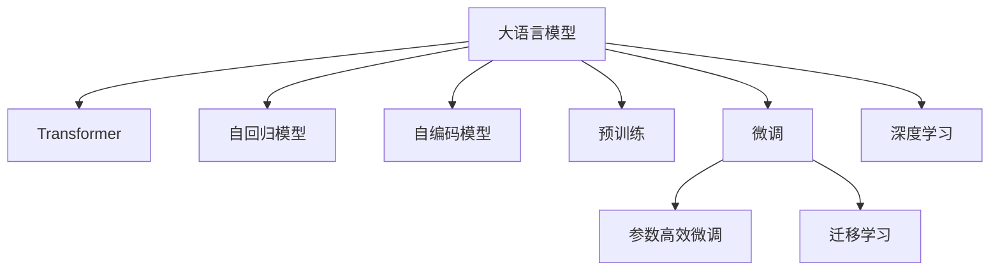

                 

# 底层和通用：LLM 的本质

> 关键词：大语言模型,Transformer,自回归模型,自编码模型,预训练,微调,Fine-tuning,自然语言处理(NLP),深度学习,Transformer,自回归模型,自编码模型,预训练,微调,Fine-tuning,自然语言处理(NLP),深度学习

## 1. 背景介绍

### 1.1 问题由来

大语言模型（Large Language Models, LLMs）的迅猛发展正在重塑自然语言处理（Natural Language Processing, NLP）的行业格局。这类模型，如GPT-3、BERT等，通过在大规模无标签文本数据上进行预训练，学习到了广泛的语言知识和语法规则，具备了强大的文本生成和理解能力。然而，这些模型仍然是“黑盒”式的，其内部运作机制不透明，难以解释。

在实际应用中，我们常常需要在大语言模型的基础上，针对特定的下游任务进行微调（Fine-tuning）。例如，针对情感分析、命名实体识别、文本生成等任务，利用微调技术可以显著提升模型的精度和泛化能力。

尽管如此，我们仍然需要进一步深入理解大语言模型的底层机制，并探讨如何在大规模数据上提升模型的通用性。

### 1.2 问题核心关键点

本节将重点讨论以下核心问题：
- 大语言模型的内部结构与运作原理是什么？
- 大语言模型的预训练和微调策略如何设计？
- 如何在大规模数据上提升模型的通用性？
- 大语言模型在实际应用中面临哪些挑战？

## 2. 核心概念与联系

### 2.1 核心概念概述

要回答上述核心问题，我们首先介绍几个关键的概念：

- **大语言模型 (Large Language Models, LLMs)**：指在大规模无标签文本数据上进行自监督预训练的深度神经网络模型。这些模型通常具有数十亿的参数，能学习到丰富的语言知识和语法规则。

- **Transformer**：一种常用的神经网络结构，能够高效地并行计算自注意力机制，用于处理序列数据。

- **自回归模型 (Autoregressive Model)**：一种基于未来信息的预测模型，用于生成文本等序列数据。

- **自编码模型 (Autoencoder Model)**：一种用于特征提取和数据压缩的技术，通过将输入数据压缩成低维表示，然后再进行重建。

- **预训练 (Pre-training)**：指在大规模无标签数据上，通过自监督学习任务训练通用模型的过程。

- **微调 (Fine-tuning)**：指在预训练模型的基础上，使用下游任务的少量标注数据，通过有监督学习优化模型在该任务上的性能。

- **自然语言处理 (Natural Language Processing, NLP)**：利用计算机处理和理解人类语言的技术，是人工智能的重要分支。

这些概念之间的关系可以用以下Mermaid流程图来表示：



### 2.2 核心概念原理和架构的 Mermaid 流程图

以下是一个基于Transformer结构的自回归模型示意图：

```mermaid
graph LR
    A[输入] --> B[编码器]
    B --> C[解码器]
    C --> D[输出]
    B --{自注意力机制} C
    B --{位置编码} C
    A --{位置编码} D
```

## 3. 核心算法原理 & 具体操作步骤

### 3.1 算法原理概述

大语言模型的核心算法原理包括自监督预训练和微调两个主要步骤：

1. **自监督预训练**：在大规模无标签文本数据上，通过自回归或自编码任务进行预训练，学习通用的语言表示。

2. **微调**：在预训练模型的基础上，使用下游任务的少量标注数据，通过有监督学习优化模型在该任务上的性能。

### 3.2 算法步骤详解

#### 3.2.1 自监督预训练

自监督预训练的目标是在大规模无标签数据上，学习到通用的语言表示。主要步骤如下：

1. **数据准备**：准备大规模无标签文本数据，如Pile、BigQuery等。

2. **模型设计**：设计Transformer结构的自回归或自编码模型。

3. **训练过程**：
    - **自回归预训练**：使用未来的文本信息预测当前文本，最大化后验概率。
    - **自编码预训练**：将输入数据压缩成低维表示，然后重建原始数据，最小化重建误差。

#### 3.2.2 微调

微调的目标是在预训练模型的基础上，通过有监督学习优化模型在特定任务上的性能。主要步骤如下：

1. **任务适配层**：根据任务类型，设计合适的输出层和损失函数。

2. **模型加载**：将预训练模型加载到内存，并进行必要的适配层连接。

3. **训练过程**：
    - **数据准备**：准备下游任务的标注数据集。
    - **模型优化**：使用优化器（如AdamW）进行参数更新，最小化损失函数。

### 3.3 算法优缺点

#### 3.3.1 算法优点

- **通用性**：预训练模型可以在多种任务上获得显著的性能提升。
- **可解释性**：通过分析预训练和微调过程，可以揭示模型的内部运作机制。
- **高效性**：微调过程仅需少量标注数据和较短的训练时间，即可实现性能提升。

#### 3.3.2 算法缺点

- **依赖数据**：微调效果依赖于标注数据的数量和质量，难以处理长尾领域数据。
- **模型复杂**：大规模预训练模型参数量巨大，计算资源消耗高。
- **稳定性问题**：模型易受到数据分布变化的影响，泛化性能不稳定。

### 3.4 算法应用领域

大语言模型在NLP领域已经得到了广泛应用，涵盖文本分类、命名实体识别、情感分析、机器翻译、对话系统等多个任务。

1. **文本分类**：如情感分析、主题分类、意图识别等，利用微调技术提升分类精度。

2. **命名实体识别**：识别文本中的人名、地名、机构名等特定实体，通过微调实现更高的识别率。

3. **情感分析**：判断文本的情感倾向，通过微调优化模型在情感分类上的表现。

4. **机器翻译**：将源语言文本翻译成目标语言，通过微调提升翻译精度和流畅度。

5. **对话系统**：使机器能够与人自然对话，通过微调优化对话生成模型。

## 4. 数学模型和公式 & 详细讲解 & 举例说明

### 4.1 数学模型构建

以BERT为例，其数学模型构建过程如下：

1. **输入编码器**：将输入文本编码成Transformer的输入序列，进行位置编码和嵌入操作。

2. **Transformer编码器**：包含多个Transformer层，每一层包含自注意力机制和前馈神经网络。

3. **池化层**：通过全局最大池化或平均池化，将Transformer编码器的输出转化为固定维度的向量表示。

4. **输出层**：将池化层的向量表示映射到标签空间，通过线性层和softmax函数输出概率分布。

### 4.2 公式推导过程

#### 4.2.1 Transformer层

Transformer层的自注意力机制可以表示为：

$$
\text{Attention}(Q, K, V) = \text{softmax}(\frac{QK^T}{\sqrt{d_k}})V
$$

其中，$Q, K, V$ 分别为查询、键和值，$d_k$ 为键的维数。

#### 4.2.2 自回归预训练

自回归预训练的目标是最大化未来文本信息的概率，可以表示为：

$$
\mathcal{L} = -\sum_{i=1}^n \log P(x_i|x_{<i})
$$

其中，$P(x_i|x_{<i})$ 表示给定前文 $x_{<i}$，当前文本 $x_i$ 的条件概率。

#### 4.2.3 自编码预训练

自编码预训练的目标是最小化重建误差，可以表示为：

$$
\mathcal{L} = \frac{1}{N} \sum_{i=1}^N (x_i - \hat{x}_i)^2
$$

其中，$\hat{x}_i$ 表示通过预训练模型重建的输入 $x_i$。

### 4.3 案例分析与讲解

以BERT为例，其自监督预训练的案例分析如下：

1. **掩码语言模型**：将部分文本进行随机掩码，通过预测掩码位置的词来训练模型。

2. **下一句预测**：随机选择两个句子，判断它们是否是连续的，通过分类任务训练模型。

## 5. 项目实践：代码实例和详细解释说明

### 5.1 开发环境搭建

在开发大语言模型时，需要安装以下软件：

1. **Python**：选择3.8或更高版本。

2. **PyTorch**：安装最新版本，支持GPU加速。

3. **HuggingFace Transformers库**：提供预训练模型和微调接口，方便开发和测试。

### 5.2 源代码详细实现

以下是BERT模型的微调代码示例：

```python
from transformers import BertTokenizer, BertForSequenceClassification, AdamW
from transformers import Trainer, TrainingArguments
from torch.utils.data import DataLoader

# 数据准备
tokenizer = BertTokenizer.from_pretrained('bert-base-uncased')
train_dataset = BertDataset(train_data, tokenizer)
eval_dataset = BertDataset(eval_data, tokenizer)

# 模型加载和适配
model = BertForSequenceClassification.from_pretrained('bert-base-uncased', num_labels=2)
model.to('cuda')

# 训练过程
training_args = TrainingArguments(output_dir='./results', per_device_train_batch_size=16, 
                                per_device_eval_batch_size=16, evaluation_strategy='epoch', 
                                learning_rate=2e-5, num_train_epochs=3, save_strategy='epoch')

trainer = Trainer(model=model, args=training_args, train_dataset=train_dataset, eval_dataset=eval_dataset)
trainer.train()
```

### 5.3 代码解读与分析

上述代码展示了BERT模型在文本分类任务上的微调过程。其主要步骤如下：

1. **数据准备**：使用BertTokenizer将文本数据转化为Token序列，并进行必要的预处理。

2. **模型加载和适配**：加载预训练的BERT模型，并适配到文本分类任务。

3. **训练过程**：使用Trainer进行模型的训练，包括超参数设置、数据加载、模型优化等。

### 5.4 运行结果展示

训练完成后，可以保存模型并评估其性能：

```python
trainer.save_model('model')
```

## 6. 实际应用场景

### 6.1 智能客服系统

智能客服系统利用大语言模型的微调技术，可以提升客服的响应速度和准确性。通过收集历史客服对话数据，并对其进行标注，可以在微调后生成高质量的回复。

### 6.2 金融舆情监测

金融舆情监测应用可以通过微调BERT模型，自动分析新闻、评论等文本数据，及时发现潜在的金融风险。

### 6.3 个性化推荐系统

个性化推荐系统利用微调BERT模型，可以更好地理解用户偏好，提供个性化推荐。通过微调，模型可以学习到用户对不同物品的兴趣程度。

## 7. 工具和资源推荐

### 7.1 学习资源推荐

1. **《Transformer from the Ground Up》**：由Attention Mechanism提出者Jurgen Schmidhuber所著，详细讲解Transformer模型的基本原理。

2. **CS224N《Natural Language Processing with Deep Learning》**：斯坦福大学开设的NLP课程，涵盖Transformer、BERT等前沿技术。

3. **《Natural Language Processing with Transformers》**：HuggingFace团队合著的书籍，提供大量预训练模型和微调范例。

4. **CLUE开源项目**：中文语言理解测评基准，包含多种NLP数据集和微调模型。

### 7.2 开发工具推荐

1. **PyTorch**：灵活的动态计算图框架，支持GPU加速。

2. **TensorFlow**：开源深度学习框架，提供强大的分布式计算能力。

3. **Transformers库**：提供丰富的预训练模型和微调接口。

4. **Weights & Biases**：实验跟踪工具，帮助记录和分析模型训练过程。

5. **TensorBoard**：可视化工具，用于监测模型训练状态和结果。

### 7.3 相关论文推荐

1. **Attention is All You Need**：Transformer原始论文，提出自注意力机制。

2. **BERT: Pre-training of Deep Bidirectional Transformers for Language Understanding**：BERT模型，通过掩码语言模型进行自监督预训练。

3. **Language Models are Unsupervised Multitask Learners**：GPT-2论文，展示无监督学习的强大能力。

4. **Parameter-Efficient Transfer Learning for NLP**：参数高效微调方法，提出Adapter等技术。

5. **AdaLoRA: Adaptive Low-Rank Adaptation for Parameter-Efficient Fine-Tuning**：参数高效微调方法，提高微调效率。

## 8. 总结：未来发展趋势与挑战

### 8.1 研究成果总结

大语言模型的微调技术在NLP领域取得了显著成效，通过微调可以显著提升模型在特定任务上的表现。但仍然存在依赖数据、模型复杂、稳定性问题等挑战。

### 8.2 未来发展趋势

未来大语言模型微调技术将呈现以下发展趋势：

1. **模型规模持续增大**：预训练模型参数量将进一步增长，增强模型的语言理解和生成能力。

2. **微调方法更加多样**：引入参数高效微调、自适应微调等方法，提高微调效率和效果。

3. **多模态微调崛起**：引入视觉、语音等多模态数据，提升模型的跨领域迁移能力。

4. **持续学习成为常态**：实现模型在不断更新数据下的持续学习，保持模型的时效性和适应性。

5. **少样本学习和无监督学习**：利用提示学习、自监督学习等方法，在少样本条件下也能取得良好效果。

### 8.3 面临的挑战

大语言模型微调技术仍面临以下挑战：

1. **依赖标注数据**：标注数据成本高，难以获得足够的训练数据。

2. **模型鲁棒性不足**：面对新数据，泛化性能不稳定，易受干扰。

3. **推理效率低**：模型规模大，推理速度慢，内存占用高。

4. **可解释性不足**：模型决策过程不透明，难以解释。

5. **安全性问题**：模型可能学习到有害信息，影响安全。

6. **知识整合能力不足**：模型难以整合外部知识库，形成全面的知识表示。

### 8.4 研究展望

未来研究需要在以下方向进行突破：

1. **无监督学习和半监督学习**：通过无监督或半监督学习，减少对标注数据的依赖。

2. **参数高效微调**：开发参数高效的方法，提高微调效率，减少计算资源消耗。

3. **多模态数据融合**：将视觉、语音等数据与文本数据结合，增强模型的跨领域能力。

4. **因果学习和博弈论**：引入因果推理和博弈论，提升模型的决策质量和稳定性。

5. **伦理和安全**：关注模型的伦理和安全问题，确保输出符合人类价值观和法律规范。

## 9. 附录：常见问题与解答

**Q1: 如何选择合适的预训练模型？**

A: 选择合适的预训练模型应考虑以下几个因素：

1. **任务相关性**：选择与目标任务相关性高的预训练模型，如BERT用于文本分类，GPT用于文本生成。

2. **数据规模**：选择参数量适中的模型，避免资源浪费。

3. **性能表现**：查看预训练模型在相似任务上的表现，选择性能较好的模型。

**Q2: 微调过程中如何防止过拟合？**

A: 防止过拟合可以采取以下措施：

1. **数据增强**：使用回译、近义替换等方式扩充训练集。

2. **正则化**：使用L2正则、Dropout等技术。

3. **对抗训练**：引入对抗样本，提高模型鲁棒性。

4. **参数高效微调**：仅调整少量参数，避免过拟合。

**Q3: 如何提高模型的泛化能力？**

A: 提高模型的泛化能力可以采取以下措施：

1. **数据多样性**：收集多样化的数据，涵盖不同领域、不同风格。

2. **模型多样性**：训练多个模型，取平均输出，抑制过拟合。

3. **迁移学习**：利用已有模型的知识，进行跨领域迁移学习。

**Q4: 如何提高模型的实时性？**

A: 提高模型的实时性可以采取以下措施：

1. **模型裁剪**：去除不必要的层和参数，减小模型尺寸。

2. **量化加速**：将浮点模型转为定点模型，压缩存储空间。

3. **模型并行**：利用分布式计算，提高并行计算能力。

**Q5: 如何提高模型的可解释性？**

A: 提高模型的可解释性可以采取以下措施：

1. **可视化技术**：使用可视化工具，分析模型的内部运作机制。

2. **因果分析**：分析模型决策的关键特征，解释输出。

3. **规则库结合**：引入外部知识库和规则，指导模型推理。

---

作者：禅与计算机程序设计艺术 / Zen and the Art of Computer Programming

